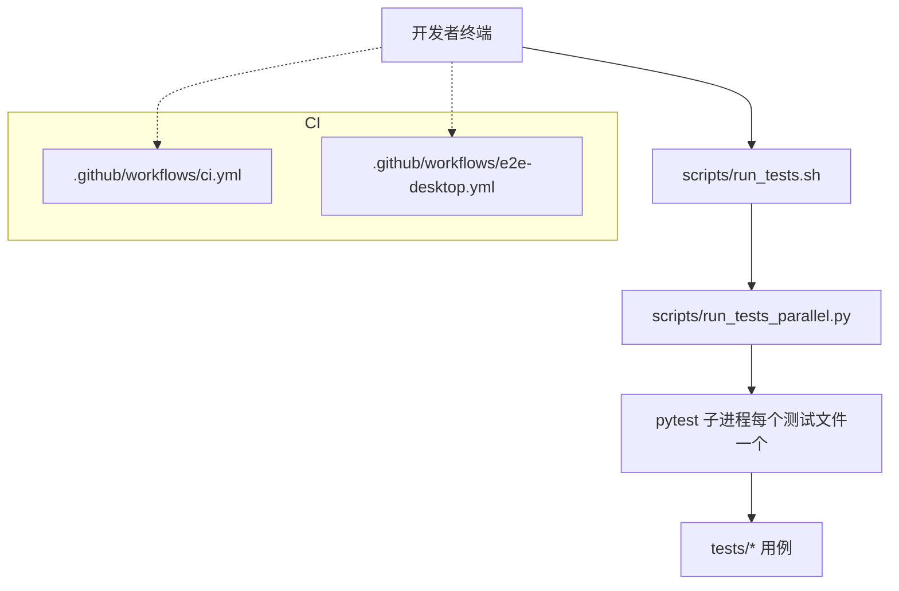
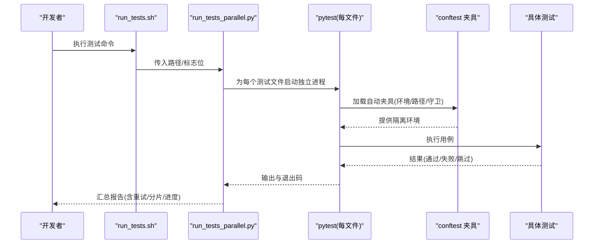
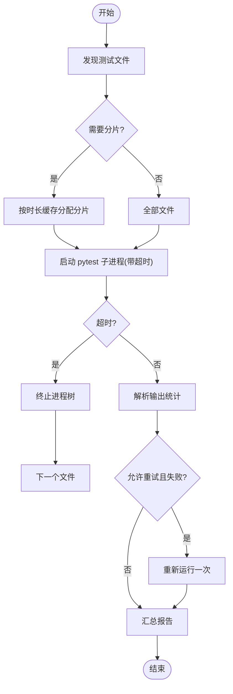
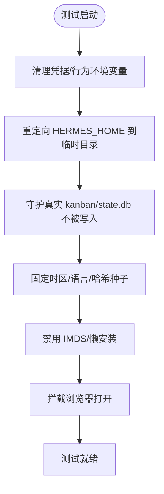
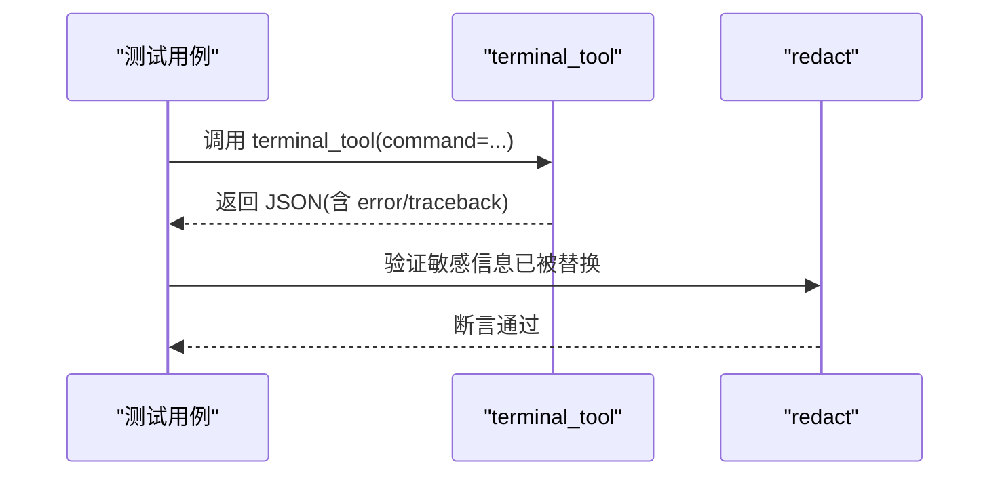
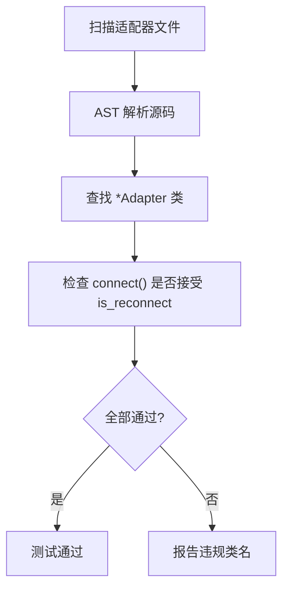
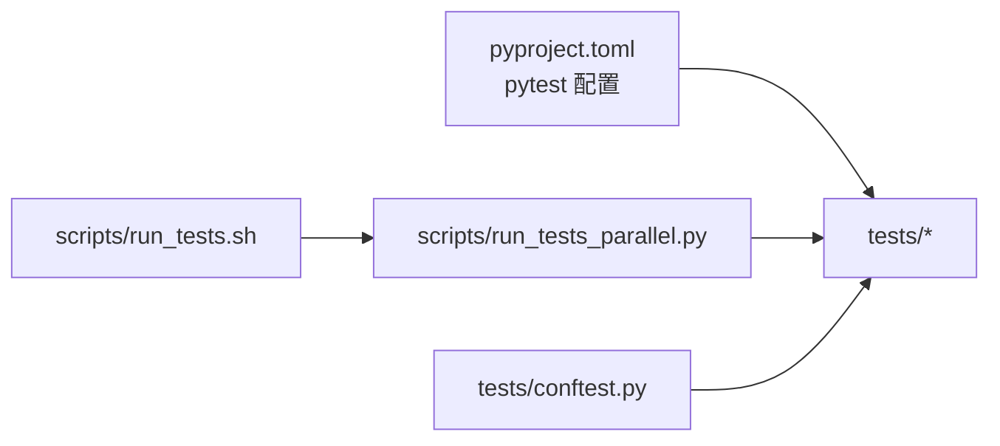

# 技能测试与调试

<cite>
**本文引用的文件**
- [README.md](file://README.md)
- [pyproject.toml](file://pyproject.toml)
- [tests/conftest.py](file://tests/conftest.py)
- [scripts/run_tests.sh](file://scripts/run_tests.sh)
- [scripts/run_tests_parallel.py](file://scripts/run_tests_parallel.py)
- [tests/tools/test_terminal_error_redaction.py](file://tests/tools/test_terminal_error_redaction.py)
- [tests/gateway/test_adapter_connect_is_reconnect_contract.py](file://tests/gateway/test_adapter_connect_is_reconnect_contract.py)
- [.github/workflows/ci.yml](file://.github/workflows/ci.yml)
- [.github/workflows/e2e-desktop.yml](file://.github/workflows/e2e-desktop.yml)
</cite>

## 目录
1. [简介](#简介)
2. [项目结构](#项目结构)
3. [核心组件](#核心组件)
4. [架构总览](#架构总览)
5. [详细组件分析](#详细组件分析)
6. [依赖关系分析](#依赖关系分析)
7. [性能考量](#性能考量)
8. [故障排查指南](#故障排查指南)
9. [结论](#结论)
10. [附录](#附录)

## 简介
本文件面向“技能”的测试与调试，覆盖单元测试、集成测试、端到端测试的编写与执行；提供日志分析、性能剖析、错误追踪等调试技巧；并给出测试数据准备、模拟服务搭建、测试环境配置、常见问题诊断、自动化测试流程与持续集成配置、质量保证措施等实践建议。内容基于仓库现有测试基础设施与脚本进行说明，确保可落地、可复现。

## 项目结构
仓库采用多语言、多子系统的工程组织方式：
- Python 主工程包含 agent、gateway、hermes_cli、tools、cron、acp_adapter 等模块，以及大量 tests 下的单元/集成/E2E 用例。
- 前端桌面应用位于 apps/desktop，使用 Playwright/Vitest 进行 UI 与 E2E 测试。
- 测试运行器由 scripts/run_tests.sh 统一入口，内部通过 scripts/run_tests_parallel.py 实现按文件并行隔离执行。
- CI 流水线在 .github/workflows 中定义，包括常规 CI、安装 E2E、桌面 E2E 等。

图表来源
- [scripts/run_tests.sh:1-184](file://scripts/run_tests.sh#L1-L184)
- [scripts/run_tests_parallel.py:1-120](file://scripts/run_tests_parallel.py#L1-L120)
- [.github/workflows/ci.yml](file://.github/workflows/ci.yml)
- [.github/workflows/e2e-desktop.yml](file://.github/workflows/e2e-desktop.yml)

章节来源
- [README.md:105-120](file://README.md#L105-L120)
- [pyproject.toml:410-422](file://pyproject.toml#L410-L422)
- [scripts/run_tests.sh:1-184](file://scripts/run_tests.sh#L1-L184)
- [scripts/run_tests_parallel.py:1-120](file://scripts/run_tests_parallel.py#L1-L120)

## 核心组件
- 测试运行器与隔离策略
  - 统一入口：scripts/run_tests.sh 负责定位 venv、设置环境变量、预编译字节码、调用并行运行器。
  - 并行隔离：scripts/run_tests_parallel.py 以“每文件一进程”的方式运行 pytest，避免跨文件状态泄漏；支持超时、重试、分片、进度展示等。
- 测试环境与夹具
  - tests/conftest.py 提供强隔离：清理凭据类环境变量、重定向 HERMES_HOME、固定时区/语言/哈希种子、禁用 AWS IMDS、禁用懒加载安装、保护真实 kanban/state.db 不被写入等。
- 标记与默认行为
  - pyproject.toml 中配置 pytest 标记与默认选项，例如默认跳过 integration 标记的用例。
- 示例测试
  - 终端工具错误脱敏：tests/tools/test_terminal_error_redaction.py 验证错误/回溯中的敏感信息被正确遮蔽。
  - 平台适配器契约校验：tests/gateway/test_adapter_connect_is_reconnect_contract.py 通过 AST 静态检查所有平台适配器的 connect() 是否接受 is_reconnect 参数，防止连接恢复时的签名不兼容导致静默断连。

章节来源
- [scripts/run_tests.sh:1-184](file://scripts/run_tests.sh#L1-L184)
- [scripts/run_tests_parallel.py:1-120](file://scripts/run_tests_parallel.py#L1-L120)
- [tests/conftest.py:1-120](file://tests/conftest.py#L1-L120)
- [tests/conftest.py:429-513](file://tests/conftest.py#L429-L513)
- [tests/conftest.py:586-718](file://tests/conftest.py#L586-L718)
- [pyproject.toml:410-422](file://pyproject.toml#L410-L422)
- [tests/tools/test_terminal_error_redaction.py:1-154](file://tests/tools/test_terminal_error_redaction.py#L1-L154)
- [tests/gateway/test_adapter_connect_is_reconnect_contract.py:1-145](file://tests/gateway/test_adapter_connect_is_reconnect_contract.py#L1-L145)

## 架构总览
下图展示了从开发者到 CI 的完整测试执行链路，以及关键隔离点与保障机制。

图表来源
- [scripts/run_tests.sh:152-184](file://scripts/run_tests.sh#L152-L184)
- [scripts/run_tests_parallel.py:231-373](file://scripts/run_tests_parallel.py#L231-L373)
- [tests/conftest.py:429-513](file://tests/conftest.py#L429-L513)

## 详细组件分析

### 测试运行器与并行隔离
- 设计要点
  - 单文件隔离：每个测试文件在独立 Python 进程中执行，避免模块级状态污染。
  - 超时与清理：对单个文件设置超时，超时时终止整个进程树，避免僵尸进程。
  - 重试与分片：支持失败文件的一次性重试；支持 LPT 分片以均衡 CI 负载。
  - 进度与摘要：解析 pytest 输出统计 passed/failed/skipped/errors，实时显示进度。
- 关键能力
  - 发现与过滤：默认跳过 integration/e2e/docker 目录，可通过参数或环境变量启用。
  - 参数透传：支持将 pytest 参数直接透传给每个子进程，无需额外分隔符。
  - 时长缓存：记录上次运行耗时，用于后续分片优化。

图表来源
- [scripts/run_tests_parallel.py:126-170](file://scripts/run_tests_parallel.py#L126-L170)
- [scripts/run_tests_parallel.py:231-373](file://scripts/run_tests_parallel.py#L231-L373)
- [scripts/run_tests_parallel.py:528-648](file://scripts/run_tests_parallel.py#L528-L648)

章节来源
- [scripts/run_tests.sh:1-184](file://scripts/run_tests.sh#L1-L184)
- [scripts/run_tests_parallel.py:1-120](file://scripts/run_tests_parallel.py#L1-L120)
- [scripts/run_tests_parallel.py:231-373](file://scripts/run_tests_parallel.py#L231-L373)
- [scripts/run_tests_parallel.py:528-648](file://scripts/run_tests_parallel.py#L528-L648)

### 测试环境与夹具（Hermetic 隔离）
- 环境变量清洗
  - 自动删除凭据形状的环境变量（如 *_API_KEY、*_TOKEN 等），避免本地密钥泄露到断言。
  - 重置影响行为的 HERMES_* 变量，确保不同测试之间不会互相干扰。
- 路径隔离
  - 将 HERMES_HOME 指向临时目录，避免写入真实用户目录；同时保护真实 kanban/state.db 不被意外写入。
- 确定性运行时
  - 固定 TZ/LANG/LC_ALL/PYTHONHASHSEED，保证时间/区域/哈希相关行为一致。
- 安全与网络
  - 禁用 AWS IMDS 探测，避免测试阻塞；禁用懒加载安装，避免测试中触发 pip 安装。
- 浏览器与系统资源
  - 拦截 webbrowser 打开行为，仅记录 URL；屏蔽 macOS Keychain 读取，避免依赖本机钥匙串。

图表来源
- [tests/conftest.py:125-229](file://tests/conftest.py#L125-L229)
- [tests/conftest.py:429-513](file://tests/conftest.py#L429-L513)
- [tests/conftest.py:586-718](file://tests/conftest.py#L586-L718)

章节来源
- [tests/conftest.py:1-120](file://tests/conftest.py#L1-L120)
- [tests/conftest.py:429-513](file://tests/conftest.py#L429-L513)
- [tests/conftest.py:586-718](file://tests/conftest.py#L586-L718)

### 示例测试：终端工具错误脱敏
- 目标
  - 确保终端工具在执行失败或异常时，错误信息与回溯中不包含敏感字符串（如 API Key）。
- 方法
  - 通过 monkeypatch 注入失败环境/注册表，构造多种异常路径（前台重试、后台启动、导入错误、外层异常）。
  - 断言返回结果中的 error/traceback 字段已脱敏。
- 价值
  - 防止生产环境中因异常信息泄露造成安全风险；作为回归测试保障脱敏逻辑稳定。

图表来源
- [tests/tools/test_terminal_error_redaction.py:1-154](file://tests/tools/test_terminal_error_redaction.py#L1-L154)

章节来源
- [tests/tools/test_terminal_error_redaction.py:1-154](file://tests/tools/test_terminal_error_redaction.py#L1-L154)

### 示例测试：平台适配器连接契约
- 目标
  - 确保所有平台适配器的 connect() 方法接受 is_reconnect 关键字参数，避免网关重连时因签名不匹配而静默断开。
- 方法
  - 通过 AST 扫描 gateway/platforms 与 plugins/platforms 下的适配器文件，提取类与方法签名进行校验。
  - 若未检测到 connect() 或未接受 is_reconnect，则报告失败。
- 价值
  - 以静态方式保障接口契约，避免引入可选第三方 SDK 带来的导入成本与副作用。

图表来源
- [tests/gateway/test_adapter_connect_is_reconnect_contract.py:1-145](file://tests/gateway/test_adapter_connect_is_reconnect_contract.py#L1-L145)

章节来源
- [tests/gateway/test_adapter_connect_is_reconnect_contract.py:1-145](file://tests/gateway/test_adapter_connect_is_reconnect_contract.py#L1-L145)

### 端到端与集成测试
- 默认行为
  - 通过 pytest 标记与默认选项，常规测试集默认跳过 integration 用例，缩短本地与 CI 反馈时间。
- 专用工作流
  - e2e 与 docker 相关测试在独立 CI 作业中运行，避免共享 runner 上的构建开销与外部依赖冲突。
- 桌面端 E2E
  - 使用 Playwright 与 Vitest 进行桌面端交互与页面级测试，配合独立的 CI 工作流。

章节来源
- [pyproject.toml:410-422](file://pyproject.toml#L410-L422)
- [scripts/run_tests_parallel.py:54-73](file://scripts/run_tests_parallel.py#L54-L73)
- [.github/workflows/e2e-desktop.yml](file://.github/workflows/e2e-desktop.yml)

## 依赖关系分析
- 测试框架与标记
  - pytest、pytest-asyncio 等通过 dev extra 安装；pytest.ini_options 定义了 testpaths 与 markers。
- 运行器依赖
  - run_tests.sh 负责选择正确的 Python 解释器（优先本地 venv，其次 Nix devShell），并传递必要环境变量。
  - run_tests_parallel.py 依赖标准库 subprocess/threading/time 等，无重型第三方依赖。
- 测试夹具依赖
  - conftest.py 通过 monkeypatch 与 sys.modules 操作实现强隔离，不引入额外包。

图表来源
- [pyproject.toml:410-422](file://pyproject.toml#L410-L422)
- [scripts/run_tests.sh:40-99](file://scripts/run_tests.sh#L40-L99)
- [scripts/run_tests_parallel.py:1-120](file://scripts/run_tests_parallel.py#L1-L120)
- [tests/conftest.py:1-120](file://tests/conftest.py#L1-L120)

章节来源
- [pyproject.toml:410-422](file://pyproject.toml#L410-L422)
- [scripts/run_tests.sh:40-99](file://scripts/run_tests.sh#L40-L99)
- [scripts/run_tests_parallel.py:1-120](file://scripts/run_tests_parallel.py#L1-L120)
- [tests/conftest.py:1-120](file://tests/conftest.py#L1-L120)

## 性能考量
- 并行度与超时
  - 默认并发为 CPU 核数×2，可通过 -j/--jobs 调整；单文件超时默认 300 秒，避免卡死拖慢整体。
- 分片与缓存
  - 使用 LPT 算法将测试文件分配到多个切片，结合历史时长缓存平衡各切片耗时。
- 字节码预编译
  - 运行前预编译 .pyc，减少子进程首次导入开销。
- 进程树清理
  - 超时或异常时终止整个进程树，避免遗留 uvicorn/异步任务等子进程占用资源。

章节来源
- [scripts/run_tests_parallel.py:75-95](file://scripts/run_tests_parallel.py#L75-L95)
- [scripts/run_tests_parallel.py:564-648](file://scripts/run_tests_parallel.py#L564-L648)
- [scripts/run_tests.sh:160-167](file://scripts/run_tests.sh#L160-L167)
- [scripts/run_tests_parallel.py:173-229](file://scripts/run_tests_parallel.py#L173-L229)

## 故障排查指南
- 依赖问题
  - 现象：找不到 pytest 或 venv 中缺少开发依赖。
  - 处理：确认本地 .venv/venv 存在且安装了 pytest；或使用 Nix devShell 提供的 HERMES_PYTHON。
  - 参考：scripts/run_tests.sh 会探测 venv 并提示缺失情况。
- 权限问题
  - 现象：无法写入 ~/.hermes 或真实 kanban/state.db。
  - 处理：确保测试在隔离的 HERMES_HOME 下运行；conftest 已内置写保护，若绕过需显式标记。
  - 参考：tests/conftest.py 的 kanban/state.db 写保护逻辑。
- 环境问题
  - 现象：AWS IMDS 探测导致测试阻塞；懒加载安装触发 pip 下载。
  - 处理：conftest 已禁用 IMDS 与懒安装；如需网络行为，请在测试中显式启用并限定范围。
  - 参考：tests/conftest.py 的环境变量设置。
- 平台适配器连接失败
  - 现象：网关重连后某平台静默断开。
  - 处理：运行适配器契约测试，确保 connect() 接受 is_reconnect；必要时更新签名。
  - 参考：tests/gateway/test_adapter_connect_is_reconnect_contract.py。
- 终端工具错误泄露
  - 现象：错误信息中包含敏感键值。
  - 处理：确认 redact 逻辑生效；运行脱敏测试定位异常路径。
  - 参考：tests/tools/test_terminal_error_redaction.py。

章节来源
- [scripts/run_tests.sh:40-99](file://scripts/run_tests.sh#L40-L99)
- [tests/conftest.py:429-513](file://tests/conftest.py#L429-L513)
- [tests/conftest.py:586-718](file://tests/conftest.py#L586-L718)
- [tests/gateway/test_adapter_connect_is_reconnect_contract.py:1-145](file://tests/gateway/test_adapter_connect_is_reconnect_contract.py#L1-L145)
- [tests/tools/test_terminal_error_redaction.py:1-154](file://tests/tools/test_terminal_error_redaction.py#L1-L154)

## 结论
该仓库提供了完善且高内聚的测试基础设施：统一的运行入口、严格的隔离夹具、强大的并行运行器与 CI 集成。通过 AST 契约测试、错误脱敏测试等手段，有效保障了代码质量与安全。建议在新增“技能”时遵循以下实践：
- 使用 pytest 编写单元/集成测试，并通过 conftest 提供的夹具确保环境隔离。
- 对外部依赖进行 mock/stub，避免网络与 I/O 不确定性。
- 将耗时或需外部服务的用例标记为 integration，并在 CI 中单独运行。
- 利用并行运行器的超时、重试、分片能力提升效率与稳定性。
- 在 CI 中复用现有工作流，保持与本地一致的测试行为。

## 附录
- 快速开始
  - 安装与运行：参考 README 的安装与入门指引。
  - 运行测试：使用 scripts/run_tests.sh 执行全量或指定路径的测试。
- 常用命令
  - 限制并行度：scripts/run_tests.sh -j 4
  - 指定路径：scripts/run_tests.sh tests/agent/
  - 透传 pytest 参数：scripts/run_tests.sh -v --tb=long
- 持续集成
  - 常规 CI：.github/workflows/ci.yml
  - 桌面端 E2E：.github/workflows/e2e-desktop.yml

章节来源
- [README.md:105-120](file://README.md#L105-L120)
- [scripts/run_tests.sh:16-32](file://scripts/run_tests.sh#L16-L32)
- [.github/workflows/ci.yml](file://.github/workflows/ci.yml)
- [.github/workflows/e2e-desktop.yml](file://.github/workflows/e2e-desktop.yml)