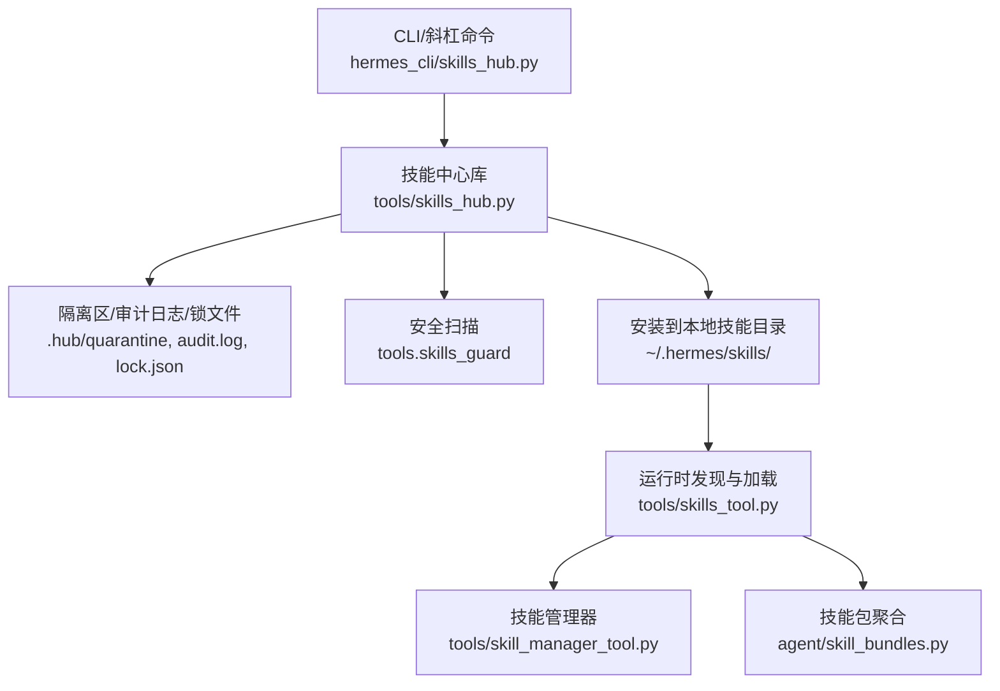
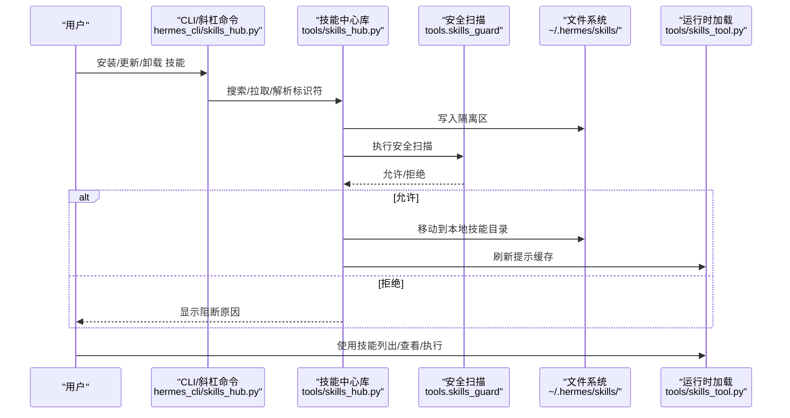
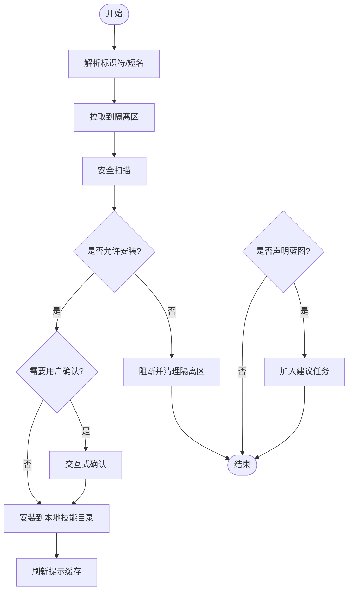
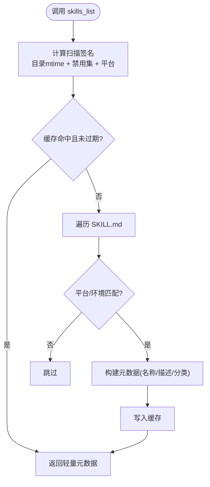
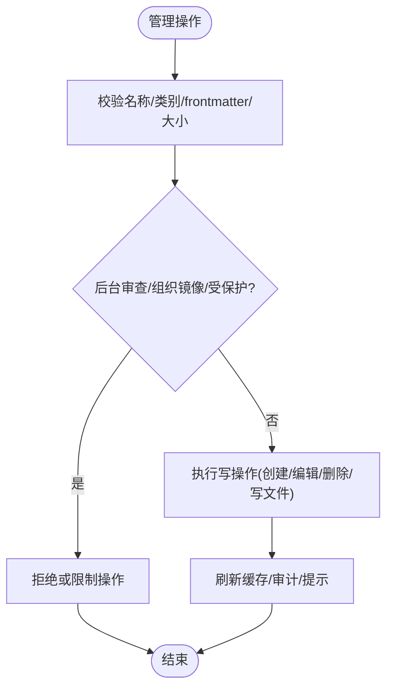
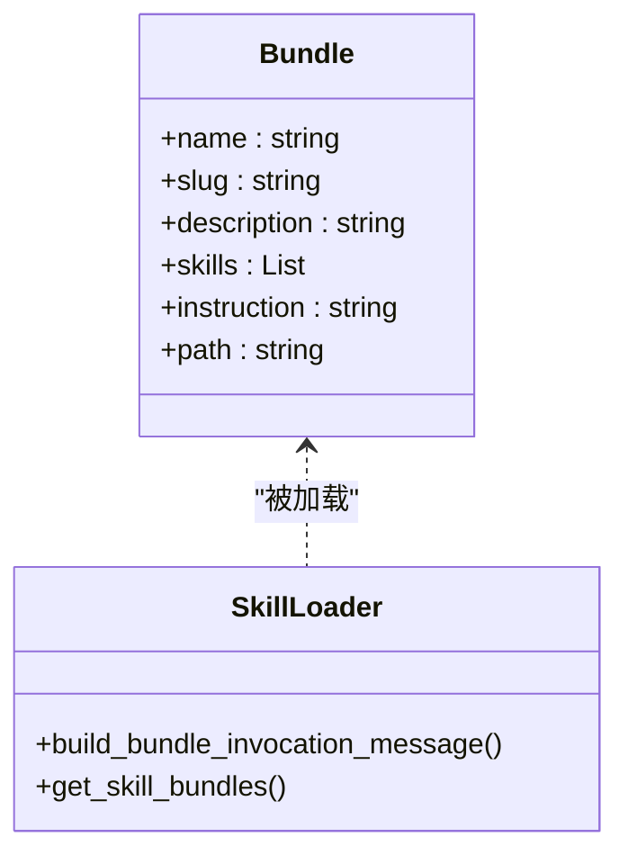
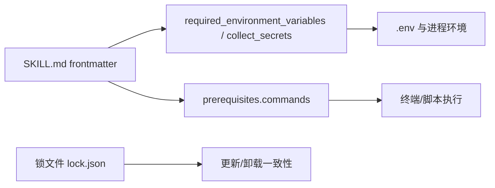

# 技能生命周期管理

<cite>
**本文引用的文件**
- [tools/skills_tool.py](file://tools/skills_tool.py)
- [tools/skill_manager_tool.py](file://tools/skill_manager_tool.py)
- [hermes_cli/skills_hub.py](file://hermes_cli/skills_hub.py)
- [tools/skills_hub.py](file://tools/skills_hub.py)
- [agent/skill_bundles.py](file://agent/skill_bundles.py)
- [optional-skills/gaming/pokemon-player/SKILL.md](file://optional-skills/gaming/pokemon-player/SKILL.md)
</cite>

## 目录
1. [简介](#简介)
2. [项目结构](#项目结构)
3. [核心组件](#核心组件)
4. [架构总览](#架构总览)
5. [详细组件分析](#详细组件分析)
6. [依赖关系分析](#依赖关系分析)
7. [性能考量](#性能考量)
8. [故障排查指南](#故障排查指南)
9. [结论](#结论)
10. [附录](#附录)

## 简介
本文件系统性阐述 Hermes Agent 的“技能”全生命周期管理，覆盖安装、激活、更新、卸载与版本管理；深入解析技能依赖解析机制（Python 包依赖、系统工具依赖与环境变量配置）；说明技能注册过程以及与 Hermes 核心系统的集成点（工具注册、事件处理、状态管理等）；提供冲突检测与解决策略（版本兼容性与依赖冲突）；并给出性能监控、错误处理与故障恢复建议。文档面向不同技术背景的读者，既提供高层概览，也包含代码级流程与图示。

## 项目结构
Hermes 的技能体系围绕“本地技能目录 + 技能中心（Hub）+ 命令行/斜杠命令入口 + 运行时加载”展开：
- 本地技能目录：~/.hermes/skills/ 是单一事实来源，存放用户、Hub 安装与内置技能的 SKILL.md 及支持文件。
- 技能中心（Hub）：负责搜索、拉取、隔离、扫描、确认与安装第三方或官方可选技能。
- CLI/斜杠命令：hermes_cli/skills_hub.py 暴露统一入口，驱动 Hub 能力。
- 运行时加载：tools/skills_tool.py 负责发现、过滤、缓存与按需加载技能元数据与内容；skill_manager_tool.py 提供创建、编辑、删除等管理能力。
- 技能包（Bundles）：agent/skill_bundles.py 将多个技能打包为单个斜杠命令一次性加载。

**图表来源**
- [hermes_cli/skills_hub.py:490-793](file://hermes_cli/skills_hub.py#L490-L793)
- [tools/skills_hub.py:130-193](file://tools/skills_hub.py#L130-L193)
- [tools/skills_tool.py:670-778](file://tools/skills_tool.py#L670-L778)
- [tools/skill_manager_tool.py:638-662](file://tools/skill_manager_tool.py#L638-L662)
- [agent/skill_bundles.py:168-205](file://agent/skill_bundles.py#L168-L205)

**章节来源**
- [hermes_cli/skills_hub.py:490-793](file://hermes_cli/skills_hub.py#L490-L793)
- [tools/skills_hub.py:130-193](file://tools/skills_hub.py#L130-L193)
- [tools/skills_tool.py:670-778](file://tools/skills_tool.py#L670-L778)
- [tools/skill_manager_tool.py:638-662](file://tools/skill_manager_tool.py#L638-L662)
- [agent/skill_bundles.py:168-205](file://agent/skill_bundles.py#L168-L205)

## 核心组件
- 技能发现与加载（tools/skills_tool.py）
  - 递归扫描 ~/.hermes/skills/ 与外部目录，解析 SKILL.md 的 YAML frontmatter，按平台与环境过滤，构建轻量元数据列表，并提供按需加载完整内容的能力。
  - 维护会话级缓存，基于目录 mtime 与禁用集签名进行失效控制，避免频繁 IO。
- 技能管理（tools/skill_manager_tool.py）
  - 提供 create/edit/patch/delete/write_file/remove_file 等操作，严格校验名称、类别、frontmatter 与内容大小，并在后台审查模式下限制对非托管技能的写入。
  - 支持组织镜像技能的安全编辑与删除保护。
- 技能中心（hermes_cli/skills_hub.py + tools/skills_hub.py）
  - 统一搜索、浏览、检查、安装、更新与卸载；拉取后进入隔离区，执行安全扫描，必要时提示确认，最终安装至本地技能目录。
  - 维护锁文件记录已安装技能及其来源，支持审计日志与索引缓存。
- 技能包（agent/skill_bundles.py）
  - 将多个技能组合为一个斜杠命令，批量加载并注入上下文，同时应用禁用与平台过滤。

**章节来源**
- [tools/skills_tool.py:670-778](file://tools/skills_tool.py#L670-L778)
- [tools/skill_manager_tool.py:527-662](file://tools/skill_manager_tool.py#L527-L662)
- [hermes_cli/skills_hub.py:490-793](file://hermes_cli/skills_hub.py#L490-L793)
- [tools/skills_hub.py:130-193](file://tools/skills_hub.py#L130-L193)
- [agent/skill_bundles.py:168-205](file://agent/skill_bundles.py#L168-L205)

## 架构总览
技能生命周期由“发现—安装—验证—注册—运行—更新—卸载”构成，关键路径如下：
- 发现：运行时扫描本地技能目录与外部目录，解析 frontmatter，按平台与环境过滤，生成元数据列表。
- 安装：通过 CLI/斜杠命令从 Hub 源获取技能，进入隔离区，执行安全扫描，必要时交互确认，再复制到本地技能目录。
- 注册：安装完成后刷新提示缓存，使新技能在下一会话可见；若声明蓝图则加入建议任务以便后续调度。
- 运行：根据斜杠命令或预加载策略加载技能内容，注入上下文；支持技能包批量加载。
- 更新：通过 Hub 更新流程重新拉取并替换，保持锁文件与审计一致。
- 卸载：删除本地技能目录条目，清理相关缓存与引用。

**图表来源**
- [hermes_cli/skills_hub.py:490-793](file://hermes_cli/skills_hub.py#L490-L793)
- [tools/skills_hub.py:130-193](file://tools/skills_hub.py#L130-L193)
- [tools/skills_tool.py:670-778](file://tools/skills_tool.py#L670-L778)

## 详细组件分析

### 安装流程（Hub 安装）
- 解析短名或完整标识符，定位来源适配器。
- 拉取技能包到隔离区，执行安全扫描，输出报告与来源信息。
- 根据信任级别与策略决定是否允许安装；必要时提示用户确认。
- 安装到本地技能目录，刷新提示缓存；若声明蓝图则加入建议任务。

**图表来源**
- [hermes_cli/skills_hub.py:490-793](file://hermes_cli/skills_hub.py#L490-L793)
- [tools/skills_hub.py:130-193](file://tools/skills_hub.py#L130-L193)

**章节来源**
- [hermes_cli/skills_hub.py:490-793](file://hermes_cli/skills_hub.py#L490-L793)
- [tools/skills_hub.py:130-193](file://tools/skills_hub.py#L130-L193)

### 运行时发现与加载（技能列表与视图）
- 扫描本地与外部技能目录，解析 SKILL.md 的 frontmatter，按平台与环境过滤。
- 维护会话级缓存，基于目录 mtime 与禁用集签名进行失效控制。
- 提供 skills_list（轻量元数据）与 skill_view（按需加载完整内容与支持文件）。

**图表来源**
- [tools/skills_tool.py:107-138](file://tools/skills_tool.py#L107-L138)
- [tools/skills_tool.py:670-778](file://tools/skills_tool.py#L670-L778)

**章节来源**
- [tools/skills_tool.py:107-138](file://tools/skills_tool.py#L107-L138)
- [tools/skills_tool.py:670-778](file://tools/skills_tool.py#L670-L778)

### 技能管理（创建/编辑/删除/写文件）
- 名称与类别校验，frontmatter 必填字段与长度限制，内容大小限制。
- 后台审查模式下的读写守卫：仅允许对托管技能进行变更，防止误改外部或受保护技能。
- 组织镜像技能：本地可编辑但禁止删除；提交合并需走提议流程。

**图表来源**
- [tools/skill_manager_tool.py:527-662](file://tools/skill_manager_tool.py#L527-L662)
- [tools/skill_manager_tool.py:699-737](file://tools/skill_manager_tool.py#L699-L737)

**章节来源**
- [tools/skill_manager_tool.py:527-662](file://tools/skill_manager_tool.py#L527-L662)
- [tools/skill_manager_tool.py:699-737](file://tools/skill_manager_tool.py#L699-L737)

### 技能包（Bundle）聚合加载
- 扫描 ~/.hermes/skill-bundles/*.yaml，解析 slug 与技能列表。
- 按禁用与平台过滤，逐个加载技能内容，组装为单条用户消息。
- 支持缺失与禁用技能的友好提示。

**图表来源**
- [agent/skill_bundles.py:116-165](file://agent/skill_bundles.py#L116-L165)
- [agent/skill_bundles.py:253-368](file://agent/skill_bundles.py#L253-L368)

**章节来源**
- [agent/skill_bundles.py:116-165](file://agent/skill_bundles.py#L116-L165)
- [agent/skill_bundles.py:253-368](file://agent/skill_bundles.py#L253-L368)

### 示例技能（Pokemon Player）
- 以 optional-skills/gaming/pokemon-player/SKILL.md 为例，展示技能的结构化指令、启动流程、保存/加载、游戏循环与注意事项。
- 该示例体现了技能如何通过清晰的步骤与约束指导代理行为，适合用作模板参考。

**章节来源**
- [optional-skills/gaming/pokemon-player/SKILL.md:17-37](file://optional-skills/gaming/pokemon-player/SKILL.md#L17-L37)
- [optional-skills/gaming/pokemon-player/SKILL.md:88-154](file://optional-skills/gaming/pokemon-player/SKILL.md#L88-L154)
- [optional-skills/gaming/pokemon-player/SKILL.md:190-217](file://optional-skills/gaming/pokemon-player/SKILL.md#L190-L217)

## 依赖关系分析
- Python 包依赖
  - 技能可通过 frontmatter 的 prerequisites.env_vars 声明环境变量依赖；setup.collect_secrets 支持交互式收集密钥。
  - 运行时通过 load_env() 读取 HERMES_HOME/.env，结合进程环境变量完成注入。
- 系统工具依赖
  - prerequisites.commands 用于声明系统命令依赖（如 curl、jq），当前作为建议性检查；实际执行时由终端工具或脚本保证可用性。
- 环境变量配置
  - 支持 required_environment_variables 与 legacy env_vars 归一化为统一结构；缺失时在网关或非交互环境下给出引导提示。
- 版本管理与锁定
  - Hub 安装流程通过锁文件记录已安装技能及其来源，便于更新与审计；索引缓存减少重复检索开销。

**图表来源**
- [tools/skills_tool.py:207-223](file://tools/skills_tool.py#L207-L223)
- [tools/skills_tool.py:337-403](file://tools/skills_tool.py#L337-L403)
- [tools/skills_hub.py:72-99](file://tools/skills_hub.py#L72-L99)

**章节来源**
- [tools/skills_tool.py:207-223](file://tools/skills_tool.py#L207-L223)
- [tools/skills_tool.py:337-403](file://tools/skills_tool.py#L337-L403)
- [tools/skills_hub.py:72-99](file://tools/skills_hub.py#L72-L99)

## 性能考量
- 技能发现缓存
  - 会话级缓存基于目录 mtime 与禁用集签名，TTL 控制新鲜度，避免频繁扫描。
- Hub 并行检索
  - 多源并行搜索，设置超时与每源限制，提升浏览与搜索体验。
- 按需加载
  - 列表仅返回轻量元数据，详细内容通过 skill_view 按需加载，降低令牌消耗与内存占用。
- 安全扫描缓存
  - 扫描结果与来源信息缓存，减少重复扫描开销。

[本节为通用性能讨论，不直接分析具体文件]

## 故障排查指南
- 安装被阻断
  - 检查安全扫描报告与信任级别策略；确认来源 URL 与标识符正确；必要时增加认证或提高速率限制。
- 环境变量缺失
  - 在非交互网关环境中无法提示输入密钥时，会返回引导提示；请在本地 CLI 或通过 .env 配置所需变量。
- 技能未生效
  - 确认已刷新提示缓存；检查平台与环境过滤；查看禁用列表与外部目录优先级。
- 后台审查模式限制
  - 非托管或受保护技能在后台审查模式下不可编辑或删除；需切换为前台或由管理员处理。

**章节来源**
- [hermes_cli/skills_hub.py:650-689](file://hermes_cli/skills_hub.py#L650-L689)
- [tools/skills_tool.py:406-481](file://tools/skills_tool.py#L406-L481)
- [tools/skill_manager_tool.py:301-421](file://tools/skill_manager_tool.py#L301-L421)

## 结论
Hermes 的技能生命周期管理以“本地目录为中心、Hub 为扩展、运行时按需加载”为核心设计，兼顾安全性（隔离与扫描）、可观测性（审计与锁文件）与易用性（CLI/斜杠命令与渐进式披露）。通过严格的依赖解析、冲突检测与缓存优化，系统在大规模技能生态中保持稳定与高效。建议在实际使用中遵循最佳实践：明确 frontmatter、合理声明依赖、利用技能包聚合场景、关注安全扫描与审计日志。

[本节为总结性内容，不直接分析具体文件]

## 附录
- 术语
  - 技能（Skill）：以 SKILL.md 为核心的可复用知识单元。
  - 技能包（Bundle）：将多个技能聚合为单个斜杠命令的配置文件。
  - 技能中心（Hub）：提供搜索、拉取、隔离、扫描与安装的集中式服务。
- 常用路径
  - 本地技能目录：~/.hermes/skills/
  - Hub 目录：~/.hermes/skills/.hub/（含 quarantine、audit.log、lock.json、index-cache）
  - 技能包目录：~/.hermes/skill-bundles/

[本节为概念性说明，不直接分析具体文件]