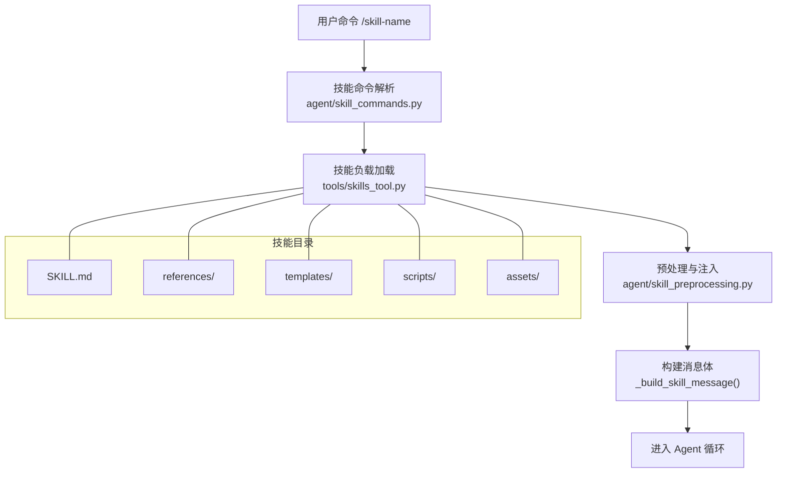
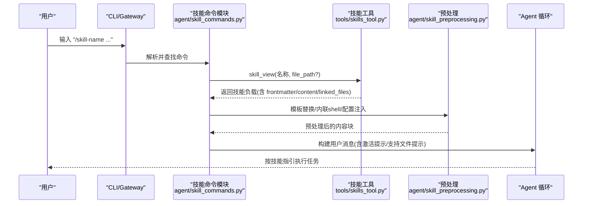
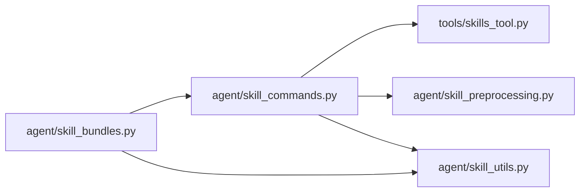

# 技能结构设计

<cite>
**本文引用的文件**
- [agent/skill_commands.py](file://agent/skill_commands.py)
- [agent/skill_bundles.py](file://agent/skill_bundles.py)
- [agent/skill_preprocessing.py](file://agent/skill_preprocessing.py)
- [agent/skill_utils.py](file://agent/skill_utils.py)
- [tools/skills_tool.py](file://tools/skills_tool.py)
- [skills/software-development/hermes-agent-skill-authoring/SKILL.md](file://skills/software-development/hermes-agent-skill-authoring/SKILL.md)
- [skills/github/github-code-review/SKILL.md](file://skills/github/github-code-review/SKILL.md)
- [skills/creative/comfyui/SKILL.md](file://skills/creative/comfyui/SKILL.md)
</cite>

## 目录
1. [简介](#简介)
2. [项目结构](#项目结构)
3. [核心组件](#核心组件)
4. [架构总览](#架构总览)
5. [详细组件分析](#详细组件分析)
6. [依赖关系分析](#依赖关系分析)
7. [性能考虑](#性能考虑)
8. [故障排查指南](#故障排查指南)
9. [结论](#结论)
10. [附录](#附录)

## 简介
本文件系统性阐述 Hermes Agent 的“技能”（Skill）结构设计，覆盖技能目录组织、SKILL.md 元数据字段与配置项、技能与核心系统的集成点（工具注册、事件处理、状态管理）、不同复杂度技能的架构模式，以及版本管理、依赖声明与兼容性策略。目标是帮助开发者以一致、可维护的方式编写和扩展技能，并理解其在 Hermes 中的加载、发现、执行与治理流程。

## 项目结构
技能在 Hermes 中以“目录 + SKILL.md”的形式存在，支持本地用户目录与仓库内嵌两种位置：
- 用户本地：~/.hermes/skills/<category>/<name>/SKILL.md
- 仓库内嵌：skills/<category>/<name>/SKILL.md 或 optional-skills/<category>/<name>/SKILL.md

每个技能目录通常包含：
- SKILL.md：主指令与元数据（YAML frontmatter + 正文）
- references/：参考文档、模板、示例等渐进式披露内容
- templates/：输出模板
- scripts/：辅助脚本（Python/shell/Node 等）
- assets/：资源文件（图片、模型清单等）

图表来源
- [agent/skill_commands.py:374-467](file://agent/skill_commands.py#L374-L467)
- [tools/skills_tool.py:670-778](file://tools/skills_tool.py#L670-L778)
- [agent/skill_preprocessing.py:128-145](file://agent/skill_preprocessing.py#L128-L145)

章节来源
- [skills/software-development/hermes-agent-skill-authoring/SKILL.md:18-30](file://skills/software-development/hermes-agent-skill-authoring/SKILL.md#L18-L30)
- [tools/skills_tool.py:140-165](file://tools/skills_tool.py#L140-L165)

## 核心组件
- 技能命令与发现：扫描 ~/.hermes/skills 与外部目录，生成斜杠命令映射，过滤平台与环境相关性，避免与核心命令冲突。
- 技能包（Bundle）：将多个技能打包为一条斜杠命令，统一注入多条技能指令。
- 预处理：模板变量替换、内联 shell 执行、配置值注入。
- 元数据与条件：frontmatter 解析、平台与环境匹配、禁用列表、配置变量提取。
- 工具接口：skills_list/skill_view 提供渐进式披露（轻量列表 → 完整内容 → 关联文件）。

章节来源
- [agent/skill_commands.py:374-467](file://agent/skill_commands.py#L374-L467)
- [agent/skill_bundles.py:168-250](file://agent/skill_bundles.py#L168-L250)
- [agent/skill_preprocessing.py:25-63](file://agent/skill_preprocessing.py#L25-L63)
- [agent/skill_utils.py:174-220](file://agent/skill_utils.py#L174-L220)
- [tools/skills_tool.py:786-800](file://tools/skills_tool.py#L786-L800)

## 架构总览
技能从“发现 → 加载 → 预处理 → 注入 → 执行”形成闭环；同时通过“包/堆叠调用”增强组合能力。

图表来源
- [agent/skill_commands.py:569-613](file://agent/skill_commands.py#L569-L613)
- [tools/skills_tool.py:670-778](file://tools/skills_tool.py#L670-L778)
- [agent/skill_preprocessing.py:128-145](file://agent/skill_preprocessing.py#L128-L145)

## 详细组件分析

### 技能目录与文件组织最佳实践
- 根文件
  - SKILL.md：必须包含 YAML frontmatter 与正文；描述应简洁明确，遵循长度与风格规范。
- 子目录
  - references/：长文档、API 说明、示例等，按需通过 skill_view(file_path=...) 加载。
  - templates/：输出模板，便于稳定格式。
  - scripts/：可执行脚本，供终端工具直接调用。
  - assets/：静态资源（图片、模型清单等）。
- 命名与分类
  - 使用 category/name 组织，保持语义清晰；避免创建“路由型”技能。
- 测试与文档
  - 在 tests/skills/test_<skill>_skill.py 中编写单测；更新网站文档侧边栏。

章节来源
- [skills/software-development/hermes-agent-skill-authoring/SKILL.md:18-41](file://skills/software-development/hermes-agent-skill-authoring/SKILL.md#L18-L41)
- [skills/software-development/hermes-agent-skill-authoring/SKILL.md:106-135](file://skills/software-development/hermes-agent-skill-authoring/SKILL.md#L106-L135)
- [skills/software-development/hermes-agent-skill-authoring/SKILL.md:148-153](file://skills/software-development/hermes-agent-skill-authoring/SKILL.md#L148-L153)

### SKILL.md 元数据字段与配置选项
- 基础字段
  - name：技能名（小写、短横线、≤64 字符）
  - description：能力简述（建议 ≤60 字符，句号结尾）
  - version：语义化版本（如 0.1.0）
  - author：贡献者署名（人优先，其次 Hermes Agent）
  - license：许可证
  - platforms：平台限制（linux/macos/windows），用于加载门控
  - metadata.hermes.tags：标签
  - metadata.hermes.related_skills：相关技能
- 可选字段
  - compatibility：兼容性说明
  - prerequisites.commands/env_vars：前置命令/环境变量（旧版兼容）
  - setup.help/collect_secrets：安装引导与密钥收集
  - required_environment_variables：必需环境变量（支持 prompt/help/required_for/optional）
- 运行时配置注入
  - metadata.hermes.config：声明需要的 config.yaml 键，系统会在消息中注入当前值，便于模型感知配置。

章节来源
- [skills/software-development/hermes-agent-skill-authoring/SKILL.md:43-92](file://skills/software-development/hermes-agent-skill-authoring/SKILL.md#L43-L92)
- [tools/skills_tool.py:337-403](file://tools/skills_tool.py#L337-L403)
- [agent/skill_utils.py:701-757](file://agent/skill_utils.py#L701-L757)

### 平台与环境门控
- 平台匹配
  - 基于 frontmatter.platforms 与运行环境 sys.platform 进行匹配，Termux/Android 特殊兼容。
- 环境匹配
  - 基于 frontmatter.environments（kanban/docker/s6）判断是否“相关”，仅影响展示与自动发现，不阻止显式加载。
- 禁用技能
  - 通过 config.yaml 的 skills.disabled 与 platform_disabled 控制全局与平台级禁用。

章节来源
- [agent/skill_utils.py:226-271](file://agent/skill_utils.py#L226-L271)
- [agent/skill_utils.py:351-387](file://agent/skill_utils.py#L351-L387)
- [agent/skill_utils.py:436-471](file://agent/skill_utils.py#L436-L471)

### 技能命令与堆叠调用
- 斜杠命令
  - 扫描本地与外部技能目录，生成 /slug 映射；若与核心命令冲突则跳过自动注册。
- 堆叠调用
  - 支持 “/skill-a /skill-b do XYZ” 形式，最多堆叠若干技能，复用 Bundle 标记以便正确提取用户指令。
- 预加载
  - 通过 CLI/TUI 启动时预加载指定技能，同样受禁用列表约束。

章节来源
- [agent/skill_commands.py:374-467](file://agent/skill_commands.py#L374-L467)
- [agent/skill_commands.py:633-744](file://agent/skill_commands.py#L633-L744)
- [agent/skill_commands.py:747-800](file://agent/skill_commands.py#L747-L800)

### 技能包（Bundle）
- 定义
  - YAML 文件位于 ~/.hermes/skill-bundles/*.yaml，列出要一起加载的技能集合。
- 行为
  - 调用 /bundle-name 会一次性注入多个技能指令，并报告缺失/被禁用的技能。
- 冲突
  - 若 bundle 与 skill 同名，bundle 优先。

章节来源
- [agent/skill_bundles.py:1-41](file://agent/skill_bundles.py#L1-L41)
- [agent/skill_bundles.py:168-250](file://agent/skill_bundles.py#L168-L250)
- [agent/skill_bundles.py:253-368](file://agent/skill_bundles.py#L253-L368)

### 预处理与模板
- 模板变量
  - ${HERMES_SKILL_DIR}、${HERMES_SESSION_ID} 会被替换为实际值。
- 内联 Shell
  - !`cmd` 片段可在加载时执行，输出截断以防上下文爆炸。
- 配置注入
  - 根据 frontmatter 声明的 config 键，动态注入当前配置值到消息中。

章节来源
- [agent/skill_preprocessing.py:12-23](file://agent/skill_preprocessing.py#L12-L23)
- [agent/skill_preprocessing.py:39-63](file://agent/skill_preprocessing.py#L39-L63)
- [agent/skill_preprocessing.py:65-103](file://agent/skill_preprocessing.py#L65-L103)
- [agent/skill_commands.py:232-268](file://agent/skill_commands.py#L232-L268)

### 工具注册与渐进式披露
- skills_list：返回轻量元数据（名称、描述、分类），用于索引与推荐。
- skill_view：按需加载完整内容与关联文件，实现渐进式披露，减少 token 消耗。
- 安全校验：对技能名称与路径进行安全检查，防止越权读取。

章节来源
- [tools/skills_tool.py:1-67](file://tools/skills_tool.py#L1-L67)
- [tools/skills_tool.py:180-204](file://tools/skills_tool.py#L180-L204)
- [tools/skills_tool.py:786-800](file://tools/skills_tool.py#L786-L800)

### 事件处理与状态管理
- 事件处理
  - 技能本身不直接订阅事件，但可通过脚本/工具与外部服务交互（如 REST/WebSocket），并在消息中汇报结果。
- 状态管理
  - 会话级状态由 Gateway/Agent 管理；技能通过 task_id/session_id 传递上下文，确保隔离。
- 使用追踪
  - 技能被调用时会记录使用次数，用于生命周期管理与统计。

章节来源
- [agent/skill_commands.py:595-600](file://agent/skill_commands.py#L595-L600)
- [agent/skill_commands.py:703-708](file://agent/skill_commands.py#L703-L708)
- [agent/skill_commands.py:790-795](file://agent/skill_commands.py#L790-L795)

### 不同复杂度技能的架构模式
- 简单脚本型
  - 单一 SKILL.md + 少量 scripts/，适合一次性任务或工具封装。
- 工作流型
  - 多步骤流程，结合 references/ 与 templates/，通过 scripts/ 编排复杂操作。
- 应用集成型
  - 与外部服务深度集成（如 ComfyUI），分层设计（CLI 生命周期 + API/WS 执行），提供健康检查与批处理能力。

章节来源
- [skills/github/github-code-review/SKILL.md:1-482](file://skills/github/github-code-review/SKILL.md#L1-L482)
- [skills/creative/comfyui/SKILL.md:1-613](file://skills/creative/comfyui/SKILL.md#L1-L613)

## 依赖关系分析
- 模块耦合
  - agent/skill_commands.py 依赖 tools/skills_tool.py 获取技能负载，依赖 agent/skill_preprocessing.py 做内容预处理。
  - agent/skill_bundles.py 复用 _load_skill_payload/_build_skill_message 以保持一致的消息格式。
  - agent/skill_utils.py 提供 frontmatter 解析、平台/环境匹配、禁用列表、外部目录解析等通用能力。
- 外部依赖
  - 配置文件：config.yaml（skills.* 段）
  - 文件系统：~/.hermes/skills、~/.hermes/skill-bundles、外部技能目录
  - 第三方工具：bash、Python、Node 等（由技能自身决定）

图表来源
- [agent/skill_commands.py:192-229](file://agent/skill_commands.py#L192-L229)
- [agent/skill_bundles.py:284-338](file://agent/skill_bundles.py#L284-L338)
- [agent/skill_utils.py:499-579](file://agent/skill_utils.py#L499-L579)

章节来源
- [agent/skill_commands.py:192-229](file://agent/skill_commands.py#L192-L229)
- [agent/skill_bundles.py:284-338](file://agent/skill_bundles.py#L284-L338)
- [agent/skill_utils.py:499-579](file://agent/skill_utils.py#L499-L579)

## 性能考虑
- 缓存
  - 技能扫描结果按签名（目录 mtime、禁用集、平台）缓存，TTL 限制新鲜度。
  - 配置读取采用 mtime+size 键的本地缓存，避免重复解析。
- 渐进式披露
  - 先返回轻量元数据，再按需加载详细内容，降低 token 与 IO 开销。
- 内联 Shell 限制
  - 输出截断与超时保护，防止失控命令影响性能。

章节来源
- [tools/skills_tool.py:91-104](file://tools/skills_tool.py#L91-L104)
- [tools/skills_tool.py:670-778](file://tools/skills_tool.py#L670-L778)
- [agent/skill_utils.py:393-433](file://agent/skill_utils.py#L393-L433)
- [agent/skill_preprocessing.py:21-23](file://agent/skill_preprocessing.py#L21-L23)

## 故障排查指南
- 技能未生效
  - 检查 frontmatter 的 platforms/environments 是否与当前环境匹配；确认未被禁用。
- 命令冲突
  - 若生成的 /command 与核心命令冲突，将被跳过自动注册；改用 /skill <name> 显式加载。
- 配置未注入
  - 确认 frontmatter.metadata.hermes.config 声明正确，且 config.yaml 中存在对应键。
- 内联 Shell 失败
  - 检查 bash 可用性、命令权限与超时设置；错误会被捕获并以标记形式返回。
- Bundle 缺失技能
  - 查看构建消息头部的“Skills missing (skipped)”列表，补齐或修正依赖。

章节来源
- [agent/skill_commands.py:432-444](file://agent/skill_commands.py#L432-L444)
- [agent/skill_commands.py:232-268](file://agent/skill_commands.py#L232-L268)
- [agent/skill_preprocessing.py:65-103](file://agent/skill_preprocessing.py#L65-L103)
- [agent/skill_bundles.py:354-368](file://agent/skill_bundles.py#L354-L368)

## 结论
Hermes 的技能体系以 SKILL.md 为核心，配合目录化资源与工具接口，实现了高内聚、低耦合的可插拔能力扩展。通过平台/环境门控、禁用列表、配置注入与渐进式披露，既保证了安全性与性能，又提供了灵活的组合方式（包/堆叠调用）。遵循本文的组织规范与最佳实践，可以高效地开发、维护与演进各类技能。

## 附录
- 版本管理
  - 使用 semver 版本号；新技能从 0.1.0 开始。
- 依赖声明
  - 通过 prerequisites 与 required_environment_variables 声明环境与命令依赖；setup 提供安装引导与密钥收集。
- 兼容性
  - 明确 platforms 与 environments；对未知环境标签采取“开放”策略，避免误屏蔽。
- 测试与文档
  - 为技能编写单测；更新网站文档与侧边栏，确保可发现性与可维护性。

章节来源
- [skills/software-development/hermes-agent-skill-authoring/SKILL.md:43-92](file://skills/software-development/hermes-agent-skill-authoring/SKILL.md#L43-L92)
- [tools/skills_tool.py:337-403](file://tools/skills_tool.py#L337-L403)
- [agent/skill_utils.py:351-387](file://agent/skill_utils.py#L351-L387)
- [skills/software-development/hermes-agent-skill-authoring/SKILL.md:148-153](file://skills/software-development/hermes-agent-skill-authoring/SKILL.md#L148-L153)