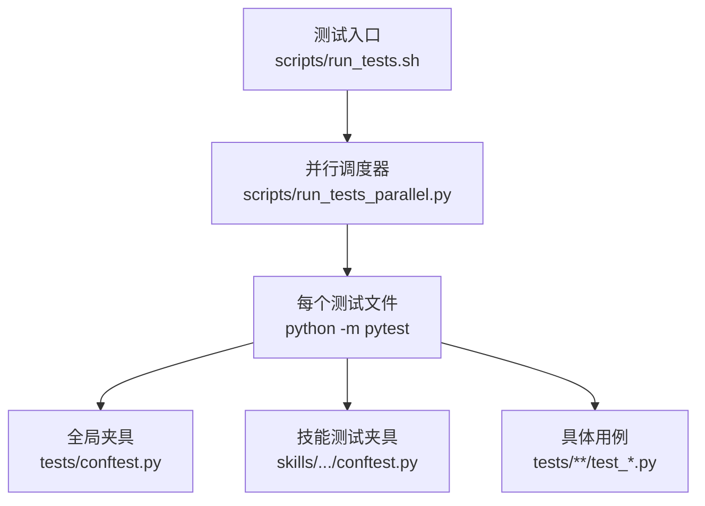
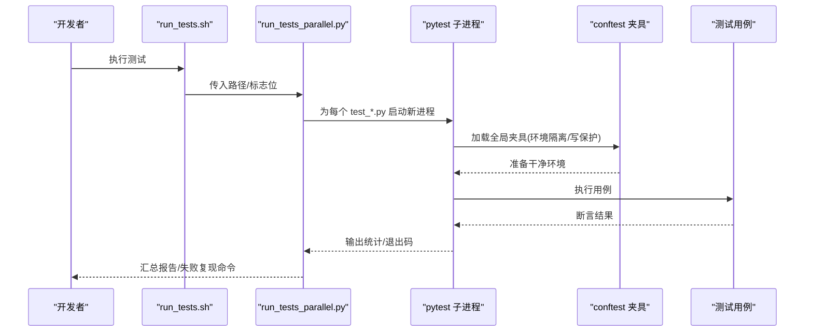
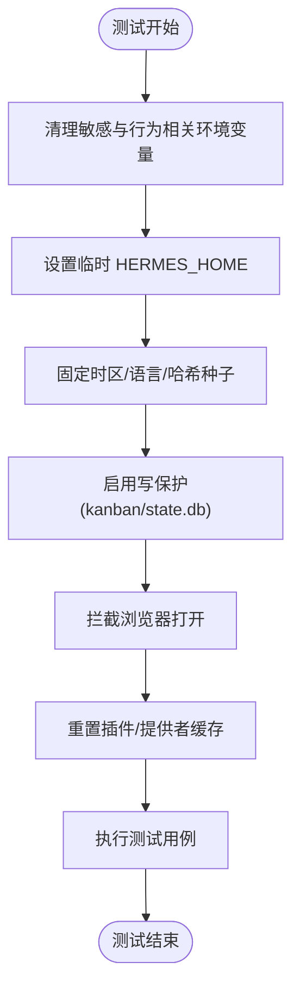
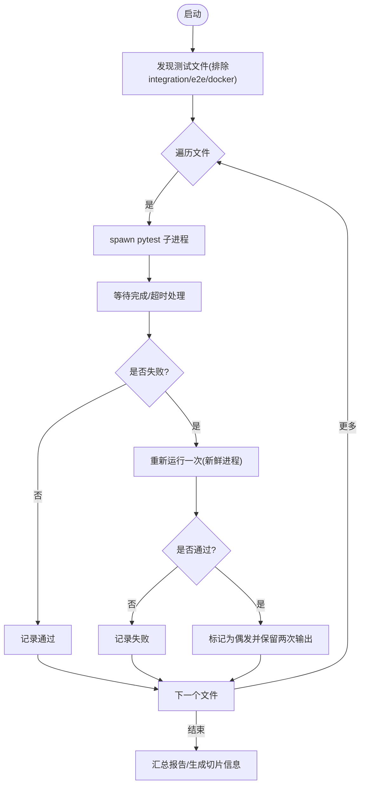
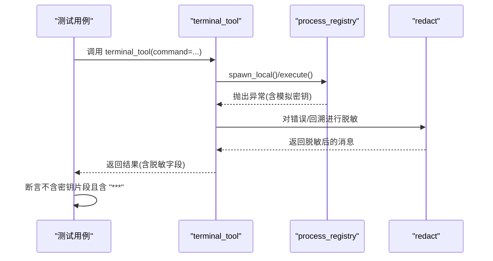
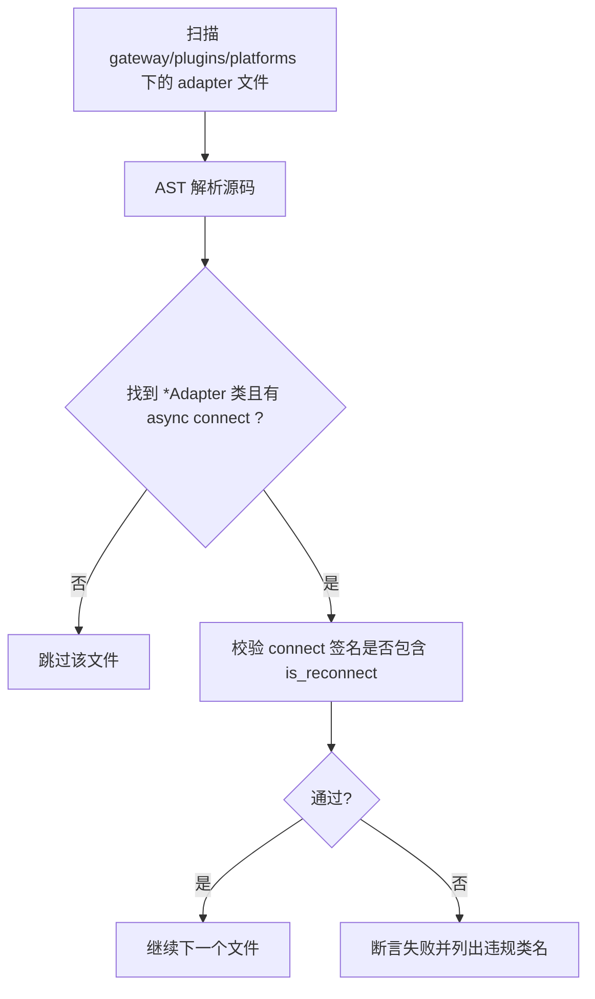
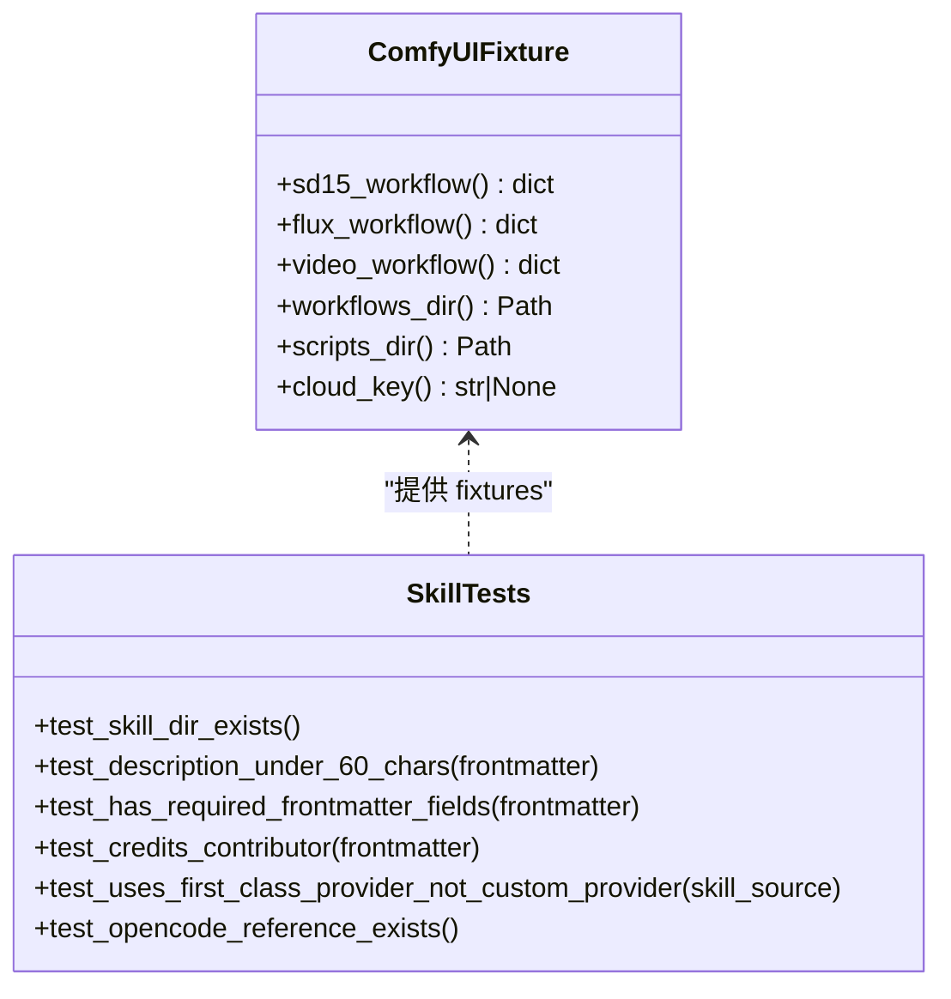
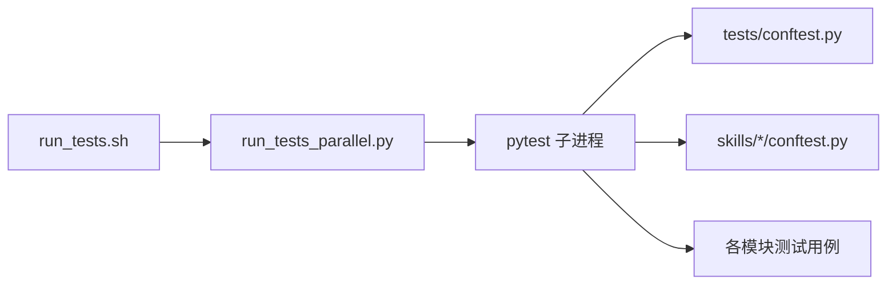

# 单元与集成测试

<cite>
**本文引用的文件**
- [tests/conftest.py](file://tests/conftest.py)
- [scripts/run_tests.sh](file://scripts/run_tests.sh)
- [scripts/run_tests_parallel.py](file://scripts/run_tests_parallel.py)
- [tests/tools/test_terminal_error_redaction.py](file://tests/tools/test_terminal_error_redaction.py)
- [tests/gateway/test_adapter_connect_is_reconnect_contract.py](file://tests/gateway/test_adapter_connect_is_reconnect_contract.py)
- [skills/creative/comfyui/tests/conftest.py](file://skills/creative/comfyui/tests/conftest.py)
- [tests/skills/test_actual_setup_skill.py](file://tests/skills/test_actual_setup_skill.py)
</cite>

## 目录
1. [简介](#简介)
2. [项目结构](#项目结构)
3. [核心组件](#核心组件)
4. [架构总览](#架构总览)
5. [详细组件分析](#详细组件分析)
6. [依赖关系分析](#依赖关系分析)
7. [性能考量](#性能考量)
8. [故障排查指南](#故障排查指南)
9. [结论](#结论)
10. [附录](#附录)

## 简介
本文件面向 hermes-agent 的测试体系，系统性说明单元测试与集成测试的编写方法、Mock 策略、断言实践、测试数据管理、覆盖率要求与分析方法，以及技能测试框架的使用。文档基于仓库内现有测试基础设施（pytest 配置、并行测试运行器、环境隔离夹具等）进行提炼，并提供可操作的流程与最佳实践案例。

## 项目结构
- 测试根目录 tests/ 按模块组织，覆盖 agent、gateway、hermes_cli、tools、skills 等子系统。
- 顶层 conftest.py 提供全局测试夹具与环境隔离，确保本地与 CI 行为一致。
- scripts/run_tests.sh 是官方入口脚本，统一执行环境与参数传递。
- scripts/run_tests_parallel.py 实现“按文件并行”的 pytest 调度，避免 xdist 的进程状态泄漏问题。
- skills 子包自带独立 conftest 与用例，便于对技能功能进行专项验证。

**图示来源**
- [scripts/run_tests.sh:1-184](file://scripts/run_tests.sh#L1-L184)
- [scripts/run_tests_parallel.py:1-120](file://scripts/run_tests_parallel.py#L1-L120)
- [tests/conftest.py:1-120](file://tests/conftest.py#L1-L120)
- [skills/creative/comfyui/tests/conftest.py:1-65](file://skills/creative/comfyui/tests/conftest.py#L1-L65)

**章节来源**
- [scripts/run_tests.sh:1-184](file://scripts/run_tests.sh#L1-L184)
- [scripts/run_tests_parallel.py:1-120](file://scripts/run_tests_parallel.py#L1-L120)
- [tests/conftest.py:1-120](file://tests/conftest.py#L1-L120)

## 核心组件
- 全局环境隔离夹具：清理敏感环境变量、重定向 HERMES_HOME、锁定时区/语言/哈希种子、禁用 AWS IMDS、重置插件单例等，保证测试可重复且安全。
- 写保护守卫：防止测试误写真实 kanban/state.db；支持在特定标记下绕过。
- 浏览器打开拦截：记录而非真正打开浏览器窗口。
- 并行测试运行器：按文件粒度启动 pytest 子进程，带超时、重试、进度展示、切片分发与失败快速定位。
- 技能测试夹具：为特定技能提供工作流/fixtures 与云 API key 条件跳过。

**章节来源**
- [tests/conftest.py:39-120](file://tests/conftest.py#L39-L120)
- [tests/conftest.py:429-527](file://tests/conftest.py#L429-L527)
- [tests/conftest.py:586-718](file://tests/conftest.py#L586-L718)
- [scripts/run_tests_parallel.py:231-373](file://scripts/run_tests_parallel.py#L231-L373)
- [skills/creative/comfyui/tests/conftest.py:23-65](file://skills/creative/comfyui/tests/conftest.py#L23-L65)

## 架构总览
下图展示了从脚本入口到单个测试文件的调用链，以及关键隔离点。

**图示来源**
- [scripts/run_tests.sh:152-184](file://scripts/run_tests.sh#L152-L184)
- [scripts/run_tests_parallel.py:301-373](file://scripts/run_tests_parallel.py#L301-L373)
- [tests/conftest.py:429-527](file://tests/conftest.py#L429-L527)

## 详细组件分析

### 全局夹具与环境隔离（tests/conftest.py）
- 环境变量清洗：自动移除所有形如 *_API_KEY/*_TOKEN/*_SECRET 等的变量，并清空一组影响行为的 HERMES_* 变量，避免本地密钥或平台配置污染测试。
- 工作目录隔离：将 HERMES_HOME 指向临时目录，确保代码读取 ~/.hermes/* 的路径不会命中真实用户目录。
- 确定性运行时：固定 TZ/LANG/LC_ALL/PYTHONHASHSEED，消除时间、区域与哈希随机性带来的不稳定。
- 写保护：对 kanban DB 和主 state.db 的写入进行拒绝式保护，防止误写生产数据；支持通过标记绕过。
- 浏览器拦截：阻止真实浏览器打开，仅记录 URL 以便断言。
- 插件与提供者缓存重置：避免跨测试的状态泄漏。

**图示来源**
- [tests/conftest.py:429-527](file://tests/conftest.py#L429-L527)
- [tests/conftest.py:586-718](file://tests/conftest.py#L586-L718)

**章节来源**
- [tests/conftest.py:39-120](file://tests/conftest.py#L39-L120)
- [tests/conftest.py:429-527](file://tests/conftest.py#L429-L527)
- [tests/conftest.py:586-718](file://tests/conftest.py#L586-L718)

### 并行测试运行器（scripts/run_tests_parallel.py）
- 发现与过滤：默认忽略 integration/e2e/docker，除非显式包含。
- 每文件隔离：每个 test_*.py 以独立 Python 进程运行，避免跨文件模块级状态泄漏。
- 超时与清理：为每个文件设置超时，并在超时时终止整个进程树，防止僵尸进程。
- 失败重试：对失败文件进行一次重试，若通过则标记为“偶发”，便于定位不稳定用例。
- 进度与诊断：解析 pytest 输出统计，显示实时进度；失败时打印最后若干行与可复现命令。
- 切片分发：基于历史耗时缓存使用 LPT 算法将文件分配到多个切片，平衡 CI 负载。

**图示来源**
- [scripts/run_tests_parallel.py:54-124](file://scripts/run_tests_parallel.py#L54-L124)
- [scripts/run_tests_parallel.py:231-373](file://scripts/run_tests_parallel.py#L231-L373)
- [scripts/run_tests_parallel.py:528-648](file://scripts/run_tests_parallel.py#L528-L648)

**章节来源**
- [scripts/run_tests_parallel.py:54-124](file://scripts/run_tests_parallel.py#L54-L124)
- [scripts/run_tests_parallel.py:231-373](file://scripts/run_tests_parallel.py#L231-L373)
- [scripts/run_tests_parallel.py:528-648](file://scripts/run_tests_parallel.py#L528-L648)

### 终端工具错误脱敏测试（tests/tools/test_terminal_error_redaction.py）
- 目标：确保终端工具的错误与回溯中不泄露凭证类字符串。
- Mock 策略：通过 monkeypatch 替换内部环境对象、注册表、检查函数等，构造成功/失败场景。
- 断言要点：校验返回字段中的错误/回溯不包含原始密钥片段，且包含脱敏占位符。
- 覆盖场景：前台重试错误、后台启动错误、导入错误、外层异常等。

**图示来源**
- [tests/tools/test_terminal_error_redaction.py:27-45](file://tests/tools/test_terminal_error_redaction.py#L27-L45)
- [tests/tools/test_terminal_error_redaction.py:47-154](file://tests/tools/test_terminal_error_redaction.py#L47-L154)

**章节来源**
- [tests/tools/test_terminal_error_redaction.py:1-154](file://tests/tools/test_terminal_error_redaction.py#L1-L154)

### 平台适配器契约静态检查（tests/gateway/test_adapter_connect_is_reconnect_contract.py）
- 目标：确保所有平台适配器的 connect() 接受 is_reconnect 关键字参数，避免网关重连时静默断开。
- 方法：AST 解析源码，查找 Adapter 类及其 async def connect，校验签名。
- 优势：无需导入第三方 SDK，避免可选依赖污染测试环境。

**图示来源**
- [tests/gateway/test_adapter_connect_is_reconnect_contract.py:33-106](file://tests/gateway/test_adapter_connect_is_reconnect_contract.py#L33-L106)
- [tests/gateway/test_adapter_connect_is_reconnect_contract.py:109-145](file://tests/gateway/test_adapter_connect_is_reconnect_contract.py#L109-L145)

**章节来源**
- [tests/gateway/test_adapter_connect_is_reconnect_contract.py:1-145](file://tests/gateway/test_adapter_connect_is_reconnect_contract.py#L1-L145)

### 技能测试夹具与用例（skills/creative/comfyui/tests/conftest.py, tests/skills/test_actual_setup_skill.py）
- 技能夹具：提供工作流 JSON fixture、脚本/工作流目录路径、云 API key 条件跳过逻辑。
- 技能用例：校验 SKILL.md frontmatter 规范、必需字段、引用是否存在等。
- 适用场景：为自定义技能编写有效用例，复用现有 pytest 基础设施进行技能验证。

**图示来源**
- [skills/creative/comfyui/tests/conftest.py:23-65](file://skills/creative/comfyui/tests/conftest.py#L23-L65)
- [tests/skills/test_actual_setup_skill.py:19-69](file://tests/skills/test_actual_setup_skill.py#L19-L69)

**章节来源**
- [skills/creative/comfyui/tests/conftest.py:1-65](file://skills/creative/comfyui/tests/conftest.py#L1-L65)
- [tests/skills/test_actual_setup_skill.py:1-69](file://tests/skills/test_actual_setup_skill.py#L1-L69)

## 依赖关系分析
- run_tests.sh 依赖 run_tests_parallel.py 作为实际执行器，后者再驱动 pytest 子进程。
- 所有测试均受 tests/conftest.py 的全局夹具约束，确保环境一致性与安全性。
- 技能测试可叠加自身 conftest，提供领域特定的 fixtures。
- 静态契约测试（适配器签名）不引入外部依赖，降低耦合。

**图示来源**
- [scripts/run_tests.sh:152-184](file://scripts/run_tests.sh#L152-L184)
- [scripts/run_tests_parallel.py:301-373](file://scripts/run_tests_parallel.py#L301-L373)
- [tests/conftest.py:429-527](file://tests/conftest.py#L429-L527)
- [skills/creative/comfyui/tests/conftest.py:23-65](file://skills/creative/comfyui/tests/conftest.py#L23-L65)

**章节来源**
- [scripts/run_tests.sh:152-184](file://scripts/run_tests.sh#L152-L184)
- [scripts/run_tests_parallel.py:301-373](file://scripts/run_tests_parallel.py#L301-L373)
- [tests/conftest.py:429-527](file://tests/conftest.py#L429-L527)
- [skills/creative/comfyui/tests/conftest.py:23-65](file://skills/creative/comfyui/tests/conftest.py#L23-L65)

## 性能考量
- 每文件进程隔离避免了 xdist 的复杂状态管理与泄漏问题，同时保持合理的启动开销。
- 预编译字节码缓存减少子进程首次导入成本。
- 文件级超时与进程树清理防止个别慢用例拖垮整体运行。
- 基于历史耗时的切片分发提升 CI 并行效率。

[本节为通用指导，不直接分析具体文件]

## 故障排查指南
- 若测试意外写入真实数据：检查是否触发了 write guard 的 deny-list 判定；必要时使用 live_system_guard_bypass 标记明确绕过（谨慎）。
- 若出现偶发失败：查看运行器输出的 FLAKY 提示与两次尝试的输出差异，定位竞态或资源竞争。
- 若网络/云服务导致超时：确认是否设置了相应的条件跳过（如 COMFY_CLOUD_API_KEY），或在夹具中禁用网络访问。
- 若浏览器弹窗干扰：确认浏览器打开已被拦截，并通过记录的 URL 列表进行断言。

**章节来源**
- [tests/conftest.py:586-718](file://tests/conftest.py#L586-L718)
- [scripts/run_tests_parallel.py:497-525](file://scripts/run_tests_parallel.py#L497-L525)
- [skills/creative/comfyui/tests/conftest.py:57-65](file://skills/creative/comfyui/tests/conftest.py#L57-L65)

## 结论
本项目采用“严格环境隔离 + 每文件进程隔离 + 写保护守卫”的测试基线，配合并行运行器与技能专用夹具，既保证了稳定性又兼顾了扩展性。建议在新功能开发中遵循以下原则：
- 优先使用 monkeypatch 与夹具进行 Mock，避免真实外部依赖。
- 对涉及 I/O 或外部服务的用例，提供条件跳过与离线替代。
- 对可能泄露敏感信息的输出，增加脱敏断言。
- 对接口契约变更，采用静态解析或最小化集成测试保障兼容性。

[本节为总结性内容，不直接分析具体文件]

## 附录

### 单元测试编写指南（基于仓库实践）
- 用例设计
  - 聚焦单一职责：每个测试只验证一个行为分支。
  - 边界与异常：覆盖成功、失败、空值、越界、超时等路径。
  - 可重复性：不依赖外部状态，使用夹具与 Mock 隔离。
- Mock 对象
  - 使用 pytest 的 monkeypatch 替换模块属性或函数。
  - 针对异步/并发场景，注意替换后不影响事件循环。
- 断言语句
  - 明确期望：不仅断言返回值，还要断言副作用（如日志、回调调用次数）。
  - 安全断言：对敏感信息进行脱敏断言，避免泄露。
- 参考示例
  - 终端错误脱敏：见 [tests/tools/test_terminal_error_redaction.py:47-154](file://tests/tools/test_terminal_error_redaction.py#L47-L154)
  - 适配器契约检查：见 [tests/gateway/test_adapter_connect_is_reconnect_contract.py:109-145](file://tests/gateway/test_adapter_connect_is_reconnect_contract.py#L109-L145)

**章节来源**
- [tests/tools/test_terminal_error_redaction.py:47-154](file://tests/tools/test_terminal_error_redaction.py#L47-L154)
- [tests/gateway/test_adapter_connect_is_reconnect_contract.py:109-145](file://tests/gateway/test_adapter_connect_is_reconnect_contract.py#L109-L145)

### 集成测试实现要点
- 数据库连接测试
  - 使用临时目录与写保护守卫，避免影响真实 state.db/kanban.db。
  - 可通过夹具创建内存或临时 SQLite 实例进行读写验证。
- API 调用测试
  - 使用本地服务器或 Mock 服务，避免真实网络请求。
  - 对认证/鉴权路径，使用夹具注入令牌或跳过。
- 外部服务模拟
  - 通过 monkeypatch 替换 HTTP 客户端、SDK 调用。
  - 对云服务（如 Comfy Cloud）使用条件跳过，未配置时自动跳过。

[本节为通用指导，不直接分析具体文件]

### 测试数据管理策略
- 创建：使用夹具集中生成，避免在测试函数内硬编码。
- 清理：利用 tmp_path 与 atexit 清理临时目录；写保护守卫兜底。
- 隔离：每文件进程隔离 + 环境变量隔离，确保用例互不干扰。
- 参考：全局夹具的环境与路径隔离见 [tests/conftest.py:429-527](file://tests/conftest.py#L429-L527)。

**章节来源**
- [tests/conftest.py:429-527](file://tests/conftest.py#L429-L527)

### 测试覆盖率要求与分析方法
- 建议目标
  - 核心模块：≥80% 行覆盖率，关键路径 ≥90%。
  - 新增代码：PR 级别增量覆盖率不低于基线。
- 分析方法
  - 使用 pytest-cov 生成 HTML/JSON 报告，关注未覆盖分支。
  - 结合静态契约测试（如适配器签名检查）弥补动态覆盖不足。
- 持续集成
  - 在 CI 中强制覆盖率阈值，失败阻断合并。

[本节为通用指导，不直接分析具体文件]

### 测试驱动的编程模式与重构技巧
- 先写失败用例：定义预期行为与边界，再实现最小可用代码。
- 逐步演进：小步提交，频繁运行测试，及时修复回归。
- 重构安全网：借助测试套件保障重构期间行为不变。
- 契约优先：对外部接口（如适配器 connect）用静态检查+最小集成测试保障。

[本节为通用指导，不直接分析具体文件]

### 技能测试框架使用方法
- 为自定义技能编写用例
  - 在 skills/<domain>/<skill>/tests 下添加 test_*.py。
  - 使用本目录 conftest 提供的 fixtures（工作流、脚本路径、云 key）。
  - 对需要云能力的用例，使用条件跳过（无 key 时自动跳过）。
- 利用现有基础设施
  - 继承全局夹具的环境隔离与写保护。
  - 使用并行运行器执行，获得一致的本地/CI 体验。
- 参考示例
  - 技能 frontmatter 校验：见 [tests/skills/test_actual_setup_skill.py:27-69](file://tests/skills/test_actual_setup_skill.py#L27-L69)
  - 云能力条件跳过：见 [skills/creative/comfyui/tests/conftest.py:57-65](file://skills/creative/comfyui/tests/conftest.py#L57-L65)

**章节来源**
- [tests/skills/test_actual_setup_skill.py:27-69](file://tests/skills/test_actual_setup_skill.py#L27-L69)
- [skills/creative/comfyui/tests/conftest.py:57-65](file://skills/creative/comfyui/tests/conftest.py#L57-L65)