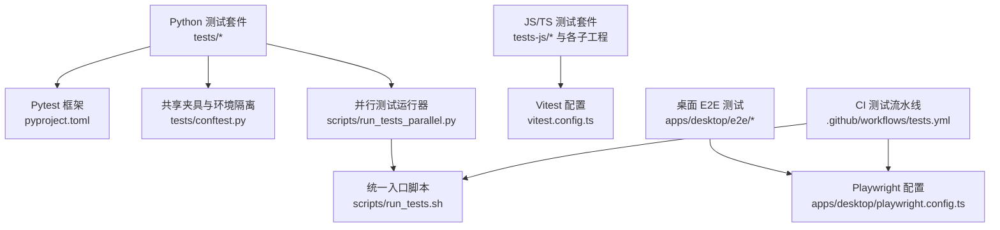
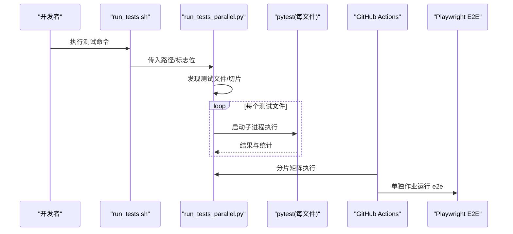
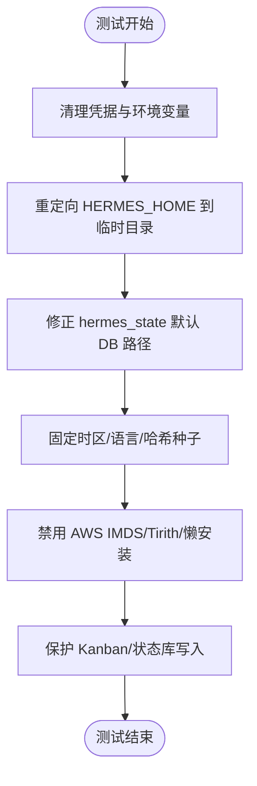
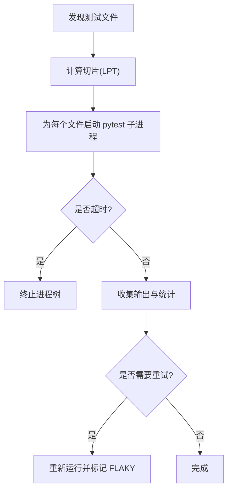
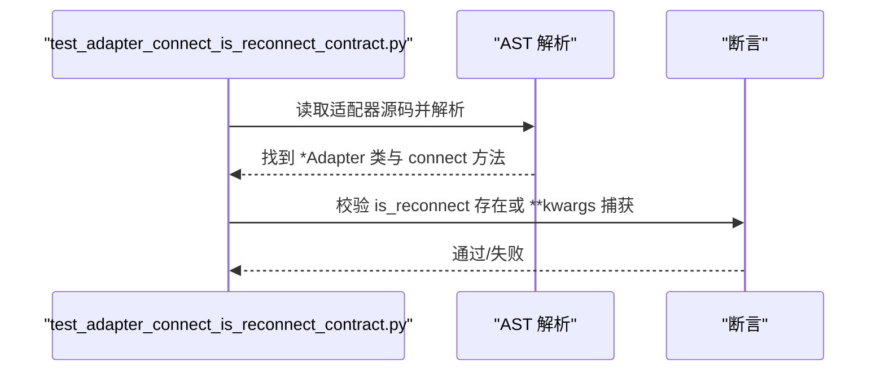
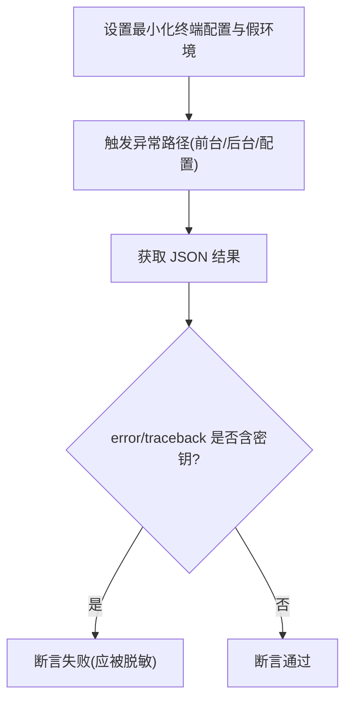
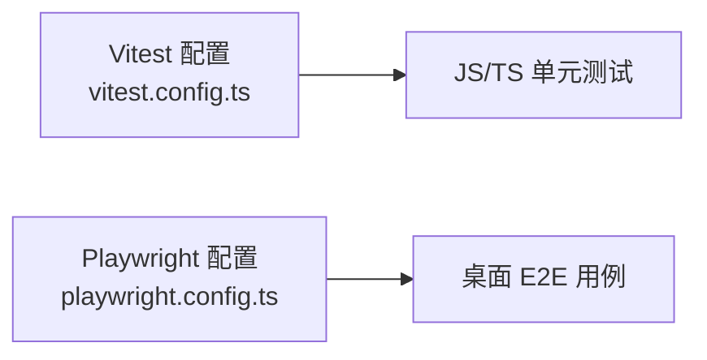
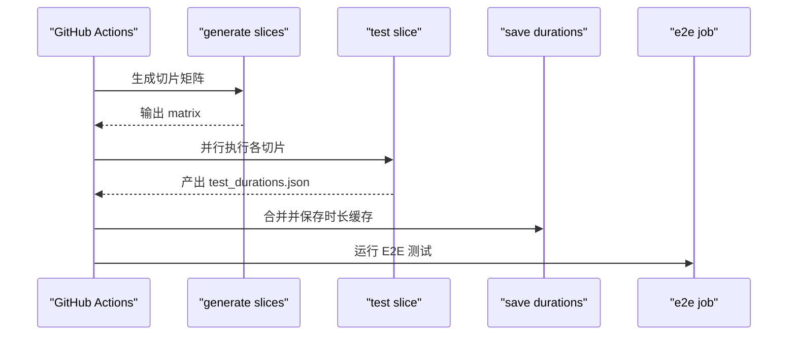
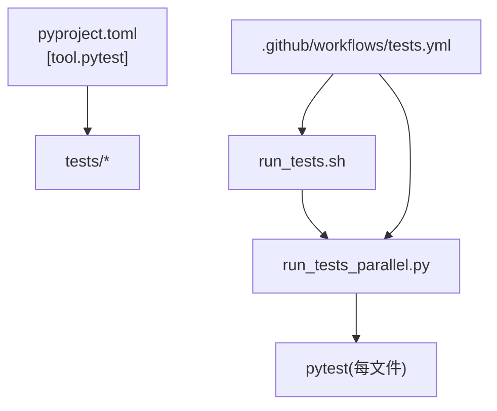

# 测试与调试

<cite>
**本文引用的文件**
- [tests/conftest.py](file://tests/conftest.py)
- [scripts/run_tests.sh](file://scripts/run_tests.sh)
- [scripts/run_tests_parallel.py](file://scripts/run_tests_parallel.py)
- [pyproject.toml](file://pyproject.toml)
- [.github/workflows/tests.yml](file://.github/workflows/tests.yml)
- [tests/gateway/test_adapter_connect_is_reconnect_contract.py](file://tests/gateway/test_adapter_connect_is_reconnect_contract.py)
- [tests/tools/test_terminal_error_redaction.py](file://tests/tools/test_terminal_error_redaction.py)
- [apps/desktop/playwright.config.ts](file://apps/desktop/playwright.config.ts)
- [apps/desktop/vitest.config.ts](file://apps/desktop/vitest.config.ts)
- [ui-tui/vitest.config.ts](file://ui-tui/vitest.config.ts)
- [web/vitest.config.ts](file://web/vitest.config.ts)
- [tests-js/vitest.config.ts](file://tests-js/vitest.config.ts)
</cite>

## 目录
1. [简介](#简介)
2. [项目结构](#项目结构)
3. [核心组件](#核心组件)
4. [架构总览](#架构总览)
5. [详细组件分析](#详细组件分析)
6. [依赖关系分析](#依赖关系分析)
7. [性能考量](#性能考量)
8. [故障排除指南](#故障排除指南)
9. [结论](#结论)
10. [附录](#附录)

## 简介
本文件面向 Hermes Agent 项目的测试与调试实践，覆盖单元测试、集成测试、端到端（E2E）测试的编写方法，测试数据准备、外部依赖模拟、断言验证等设计原则；同时提供调试工具使用建议（日志分析、断点调试、性能分析）、CI/CD 自动化流程配置与报告生成，以及常见问题排查方法与测试驱动开发（TDD）最佳实践。

## 项目结构
仓库采用多语言、多应用分层组织：
- Python 后端与 CLI：tests、agent、hermes_cli、gateway、tools 等模块
- 前端与桌面应用：apps/desktop（Electron + Playwright E2E）、web、ui-tui
- JavaScript/TypeScript 单测：tests-js、各子工程的 vitest 配置
- 测试基础设施：pytest conftest、并行测试运行器、CI 工作流

**图表来源**
- [scripts/run_tests.sh:1-184](file://scripts/run_tests.sh#L1-L184)
- [scripts/run_tests_parallel.py:1-120](file://scripts/run_tests_parallel.py#L1-L120)
- [pyproject.toml:410-422](file://pyproject.toml#L410-L422)
- [.github/workflows/tests.yml:20-133](file://.github/workflows/tests.yml#L20-L133)
- [apps/desktop/playwright.config.ts](file://apps/desktop/playwright.config.ts)

**章节来源**
- [scripts/run_tests.sh:1-184](file://scripts/run_tests.sh#L1-L184)
- [scripts/run_tests_parallel.py:1-120](file://scripts/run_tests_parallel.py#L1-L120)
- [pyproject.toml:410-422](file://pyproject.toml#L410-L422)
- [.github/workflows/tests.yml:20-133](file://.github/workflows/tests.yml#L20-L133)

## 核心组件
- 环境隔离与夹具：通过 pytest 自动夹具清理敏感环境变量、重定向 HERMES_HOME、固定时区/语言/哈希种子，确保本地与 CI 一致。
- 并行测试执行：按文件粒度启动独立 pytest 进程，避免跨文件状态泄漏，支持超时、重试、切片调度与进度展示。
- 契约型静态检查：通过 AST 扫描平台适配器 connect 签名，强制兼容网关重连参数，防止回归。
- 安全输出断言：对终端工具错误信息中的凭据形状字符串进行脱敏断言，防止泄露。
- JS/TS 测试：Vitest 用于前端与共享逻辑的单测；Playwright 用于桌面 E2E。
- CI 流水线：基于 GitHub Actions 的分片执行、缓存、失败快速停止与 E2E 单独作业。

**章节来源**
- [tests/conftest.py:1-120](file://tests/conftest.py#L1-L120)
- [scripts/run_tests_parallel.py:1-120](file://scripts/run_tests_parallel.py#L1-L120)
- [tests/gateway/test_adapter_connect_is_reconnect_contract.py:1-145](file://tests/gateway/test_adapter_connect_is_reconnect_contract.py#L1-L145)
- [tests/tools/test_terminal_error_redaction.py:1-154](file://tests/tools/test_terminal_error_redaction.py#L1-L154)
- [apps/desktop/playwright.config.ts](file://apps/desktop/playwright.config.ts)
- [tests-js/vitest.config.ts:1-9](file://tests-js/vitest.config.ts#L1-L9)

## 架构总览
下图展示了从开发者触发到 CI 执行的完整测试链路，包括环境隔离、并行执行、切片分发与 E2E 作业。

**图表来源**
- [scripts/run_tests.sh:1-184](file://scripts/run_tests.sh#L1-L184)
- [scripts/run_tests_parallel.py:231-373](file://scripts/run_tests_parallel.py#L231-L373)
- [.github/workflows/tests.yml:20-133](file://.github/workflows/tests.yml#L20-L133)
- [.github/workflows/tests.yml:183-252](file://.github/workflows/tests.yml#L183-L252)

## 详细组件分析

### 环境与夹具隔离（pytest conftest）
- 自动清理凭据类环境变量与行为开关变量，避免本地密钥污染测试断言。
- 将 HERMES_HOME 指向临时目录，并修正 hermes_state 默认数据库路径，防止写入生产数据。
- 固定 TZ/LANG/PYTHONHASHSEED，保证时间、区域与哈希确定性。
- 禁用 AWS IMDS 与 Tirith 网络访问，避免测试阻塞或意外安装。
- 保护 Kanban 与主状态数据库不被误写至真实用户目录。

**图表来源**
- [tests/conftest.py:119-527](file://tests/conftest.py#L119-L527)
- [tests/conftest.py:586-718](file://tests/conftest.py#L586-L718)

**章节来源**
- [tests/conftest.py:1-120](file://tests/conftest.py#L1-L120)
- [tests/conftest.py:119-527](file://tests/conftest.py#L119-L527)
- [tests/conftest.py:586-718](file://tests/conftest.py#L586-L718)

### 并行测试运行器（按文件隔离）
- 以文件为单位启动独立 pytest 进程，避免 xdist 持久 worker 的状态累积问题。
- 支持 per-file 超时、一次重试标记为 FLAKY、进度显示与汇总解析。
- 通过 LPT（最长处理时间优先）算法将测试文件分配到多个切片，平衡 CI 负载。
- 预编译字节码缓存以减少重复开销。

**图表来源**
- [scripts/run_tests_parallel.py:126-170](file://scripts/run_tests_parallel.py#L126-L170)
- [scripts/run_tests_parallel.py:231-373](file://scripts/run_tests_parallel.py#L231-L373)
- [scripts/run_tests_parallel.py:564-648](file://scripts/run_tests_parallel.py#L564-L648)

**章节来源**
- [scripts/run_tests_parallel.py:1-120](file://scripts/run_tests_parallel.py#L1-L120)
- [scripts/run_tests_parallel.py:231-373](file://scripts/run_tests_parallel.py#L231-L373)
- [scripts/run_tests_parallel.py:564-648](file://scripts/run_tests_parallel.py#L564-L648)

### 契约型静态检查（适配器 connect 签名）
- 通过 AST 遍历所有平台适配器的 connect 方法，校验是否接受 is_reconnect 关键字参数。
- 不导入第三方 SDK，避免引入额外依赖；若缺失则失败提示修复方式。

**图表来源**
- [tests/gateway/test_adapter_connect_is_reconnect_contract.py:61-103](file://tests/gateway/test_adapter_connect_is_reconnect_contract.py#L61-L103)
- [tests/gateway/test_adapter_connect_is_reconnect_contract.py:109-145](file://tests/gateway/test_adapter_connect_is_reconnect_contract.py#L109-L145)

**章节来源**
- [tests/gateway/test_adapter_connect_is_reconnect_contract.py:1-145](file://tests/gateway/test_adapter_connect_is_reconnect_contract.py#L1-L145)

### 安全输出断言（终端工具错误脱敏）
- 构造包含凭据形状字符串的错误场景，断言返回结果中 error/traceback 字段不包含明文密钥。
- 验证在关闭脱敏时保留原始输出，以及在开启时调用命令感知的脱敏函数。

**图表来源**
- [tests/tools/test_terminal_error_redaction.py:27-45](file://tests/tools/test_terminal_error_redaction.py#L27-L45)
- [tests/tools/test_terminal_error_redaction.py:47-154](file://tests/tools/test_terminal_error_redaction.py#L47-L154)

**章节来源**
- [tests/tools/test_terminal_error_redaction.py:1-154](file://tests/tools/test_terminal_error_redaction.py#L1-L154)

### 前端与桌面 E2E 测试
- Vitest 用于 JS/TS 单元与集成测试，配置文件指定 Node 环境与匹配规则。
- Playwright 用于桌面应用 E2E，支持浏览器/窗口交互与截图对比。

**图表来源**
- [tests-js/vitest.config.ts:1-9](file://tests-js/vitest.config.ts#L1-L9)
- [apps/desktop/playwright.config.ts](file://apps/desktop/playwright.config.ts)
- [ui-tui/vitest.config.ts](file://ui-tui/vitest.config.ts)
- [web/vitest.config.ts](file://web/vitest.config.ts)

**章节来源**
- [tests-js/vitest.config.ts:1-9](file://tests-js/vitest.config.ts#L1-L9)
- [apps/desktop/playwright.config.ts](file://apps/desktop/playwright.config.ts)
- [ui-tui/vitest.config.ts](file://ui-tui/vitest.config.ts)
- [web/vitest.config.ts](file://web/vitest.config.ts)

### CI/CD 集成与报告
- 使用 GitHub Actions 定义测试工作流：生成切片、并行执行、缓存依赖与时长、上传工件。
- 默认跳过 integration/e2e/docker 目录，由专门作业执行；E2E 单独 job 运行。
- 通过环境变量清空 API Key，确保测试不会调用真实服务。

**图表来源**
- [.github/workflows/tests.yml:20-133](file://.github/workflows/tests.yml#L20-L133)
- [.github/workflows/tests.yml:149-182](file://.github/workflows/tests.yml#L149-L182)
- [.github/workflows/tests.yml:183-252](file://.github/workflows/tests.yml#L183-L252)

**章节来源**
- [.github/workflows/tests.yml:20-133](file://.github/workflows/tests.yml#L20-L133)
- [.github/workflows/tests.yml:149-182](file://.github/workflows/tests.yml#L149-L182)
- [.github/workflows/tests.yml:183-252](file://.github/workflows/tests.yml#L183-L252)

## 依赖关系分析
- pytest 配置集中于 pyproject.toml，定义测试路径、标记与默认选项（如跳过 integration）。
- 并行运行器依赖标准库与 subprocess，无额外运行时依赖。
- CI 通过 uv 锁定依赖，确保可重现环境；额外功能按需安装以满足测试需求。

**图表来源**
- [pyproject.toml:410-422](file://pyproject.toml#L410-L422)
- [scripts/run_tests.sh:1-184](file://scripts/run_tests.sh#L1-L184)
- [scripts/run_tests_parallel.py:1-120](file://scripts/run_tests_parallel.py#L1-L120)
- [.github/workflows/tests.yml:20-133](file://.github/workflows/tests.yml#L20-L133)

**章节来源**
- [pyproject.toml:410-422](file://pyproject.toml#L410-L422)
- [scripts/run_tests.sh:1-184](file://scripts/run_tests.sh#L1-L184)
- [scripts/run_tests_parallel.py:1-120](file://scripts/run_tests_parallel.py#L1-L120)
- [.github/workflows/tests.yml:20-133](file://.github/workflows/tests.yml#L20-L133)

## 性能考量
- 按文件隔离减少跨文件状态泄漏风险，同时避免 per-test 子进程的高开销。
- 预编译 .pyc 字节码缓存降低重复导入成本。
- LPT 切片分配依据历史耗时，平衡 CI 各作业负载。
- 超时与重试机制防止卡死与偶发抖动影响整体通过率。
- 缓存 uv 下载与 wheel，缩短 CI 构建时间。

[本节为通用指导，无需特定文件引用]

## 故障排除指南
- 凭据泄漏：确认 conftest 已清理凭据类环境变量；若仍出现，检查是否有未匹配的变量名或模块级初始化提前读取了环境变量。
- 写入生产数据：确保 HERMES_HOME 指向临时目录；若自定义根目录，需更新守卫的额外拒绝列表。
- 适配器重连失败：检查所有平台适配器的 connect 方法是否接受 is_reconnect 参数；可通过静态检查测试定位。
- 终端错误泄露密钥：验证错误路径是否经过脱敏逻辑；必要时调整脱敏开关或命令感知脱敏函数。
- CI 超时或资源不足：调整 per-file 超时、并行度与工作节点资源；利用切片与缓存优化。
- E2E 不稳定：检查 Playwright 配置与浏览器环境；必要时增加等待策略或禁用非必要动画。

**章节来源**
- [tests/conftest.py:119-527](file://tests/conftest.py#L119-L527)
- [tests/conftest.py:586-718](file://tests/conftest.py#L586-L718)
- [tests/gateway/test_adapter_connect_is_reconnect_contract.py:109-145](file://tests/gateway/test_adapter_connect_is_reconnect_contract.py#L109-L145)
- [tests/tools/test_terminal_error_redaction.py:47-154](file://tests/tools/test_terminal_error_redaction.py#L47-L154)
- [scripts/run_tests_parallel.py:231-373](file://scripts/run_tests_parallel.py#L231-L373)

## 结论
本项目建立了完善的测试与调试体系：通过严格的夹具与环境隔离保障稳定性，借助并行运行器与切片调度提升效率，结合契约型静态检查与安全断言强化质量门禁；CI 流水线实现自动化执行与反馈。遵循本文的实践与排障建议，可有效支撑持续交付与高质量迭代。

[本节为总结性内容，无需特定文件引用]

## 附录
- 常用命令
  - 本地运行全部测试：scripts/run_tests.sh
  - 仅运行某目录：scripts/run_tests.sh tests/agent/
  - 指定并行度：scripts/run_tests.sh -j 4
  - 传递 pytest 参数：scripts/run_tests.sh -v --tb=long
- 调试技巧
  - 日志分析：关注 conftest 设置的日志路径与旋转策略；在 Windows 下使用并发日志处理器避免权限冲突。
  - 断点调试：使用 debugpy 在 IDE 中附加 pytest 进程；注意隔离环境以避免干扰。
  - 性能分析：利用 run_tests_parallel.py 的输出统计与 test_durations.json 识别慢用例；结合 CI 缓存优化。
- TDD 实践
  - 先写失败的测试用例（如适配器连接契约、错误脱敏），再实现代码使其通过。
  - 保持测试小而专注，避免跨文件状态依赖；必要时拆分文件或明确顺序责任。
  - 使用 fixtures 与 monkeypatch 模拟外部依赖，确保测试可重复与快速。

[本节为补充信息，无需特定文件引用]