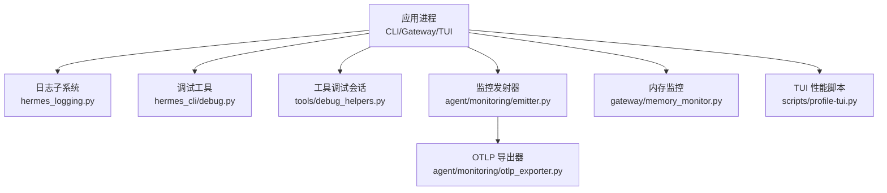
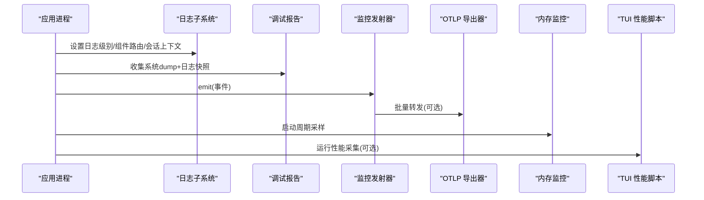
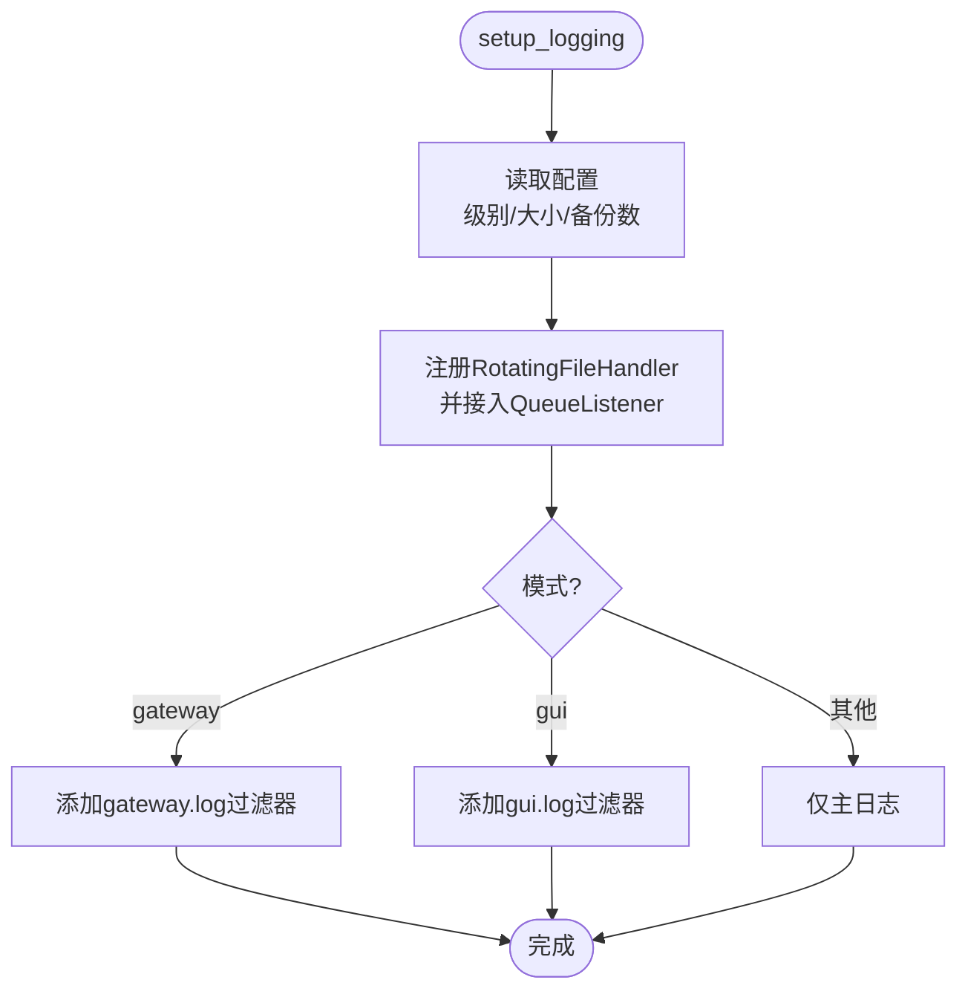
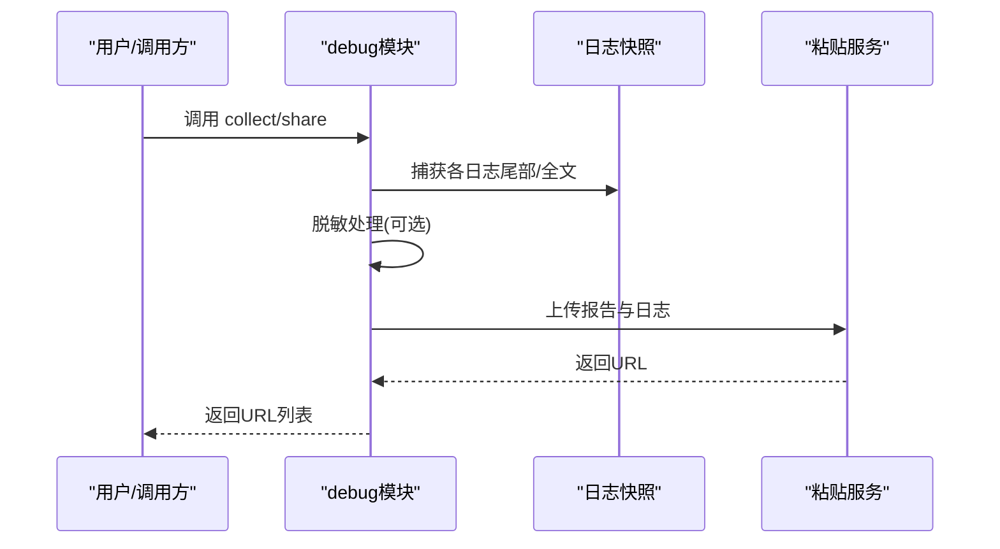
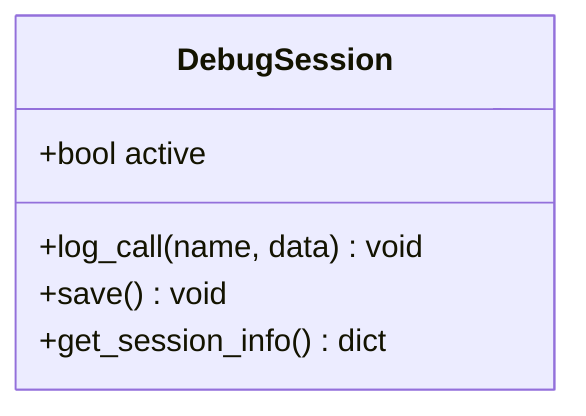
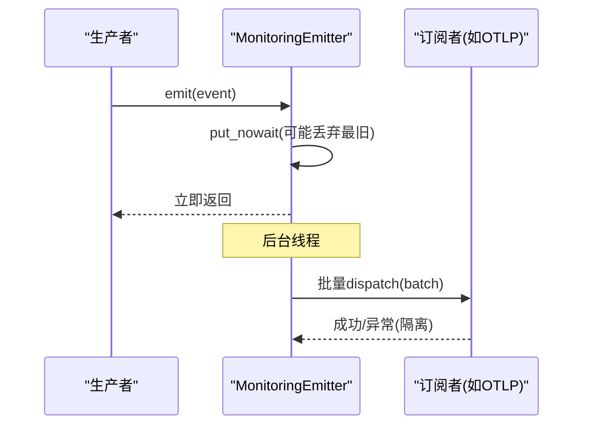
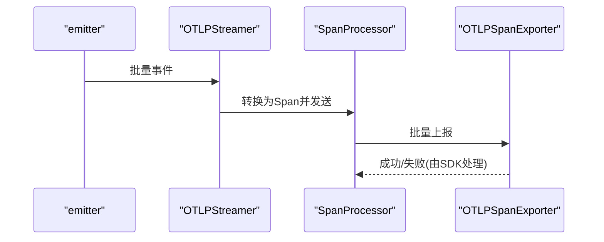
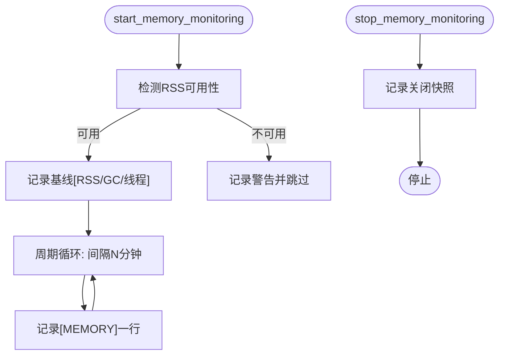
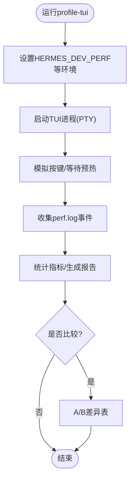
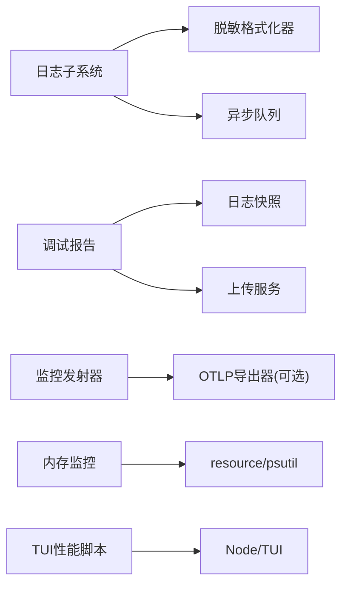

# 调试与性能分析

<cite>
**本文引用的文件**
- [hermes_cli/debug.py](file://hermes_cli/debug.py)
- [tools/debug_helpers.py](file://tools/debug_helpers.py)
- [hermes_logging.py](file://hermes_logging.py)
- [agent/monitoring/emitter.py](file://agent/monitoring/emitter.py)
- [gateway/memory_monitor.py](file://gateway/memory_monitor.py)
- [scripts/profile-tui.py](file://scripts/profile-tui.py)
- [agent/monitoring/otlp_exporter.py](file://agent/monitoring/otlp_exporter.py)
</cite>

## 目录
1. [简介](#简介)
2. [项目结构](#项目结构)
3. [核心组件](#核心组件)
4. [架构总览](#架构总览)
5. [详细组件分析](#详细组件分析)
6. [依赖关系分析](#依赖关系分析)
7. [性能注意事项](#性能注意事项)
8. [故障排查指南](#故障排查指南)
9. [结论](#结论)
10. [附录](#附录)

## 简介
本文件面向 Hermes Agent 的调试与性能分析，聚焦以下目标：
- 介绍可用的调试工具与能力：日志采集、调试会话记录、远程/分布式调试思路、链路追踪导出。
- 说明如何识别和优化性能瓶颈：CPU、内存、I/O、前端渲染管线等。
- 提供基准测试构建方法：负载、压力、稳定性测试的实践建议。
- 给出常见性能问题的诊断与解决方案，并结合实际代码路径进行定位。
- 针对技能开发过程中的调试技巧与性能分析方法，帮助快速定位问题。

## 项目结构
围绕调试与性能分析，仓库提供了多层次的支撑：
- 日志系统：集中式日志配置、按组件分流、异步队列落盘、敏感信息脱敏。
- 调试工具：一键打包并上传诊断报告（含系统信息与日志），工具级调试会话记录。
- 监控与可观测性：事件发射器、OTLP 链路追踪导出、进程内存周期性采样。
- 性能剖析：TUI 性能脚本，采集 React 与 Ink 管线指标，支持 A/B 对比。

图表来源
- [hermes_logging.py:259-376](file://hermes_logging.py#L259-L376)
- [hermes_cli/debug.py:583-711](file://hermes_cli/debug.py#L583-L711)
- [tools/debug_helpers.py:36-106](file://tools/debug_helpers.py#L36-L106)
- [agent/monitoring/emitter.py:36-164](file://agent/monitoring/emitter.py#L36-L164)
- [agent/monitoring/otlp_exporter.py:107-261](file://agent/monitoring/otlp_exporter.py#L107-L261)
- [gateway/memory_monitor.py:83-231](file://gateway/memory_monitor.py#L83-L231)
- [scripts/profile-tui.py:111-284](file://scripts/profile-tui.py#L111-L284)

章节来源
- [hermes_logging.py:259-376](file://hermes_logging.py#L259-L376)
- [hermes_cli/debug.py:583-711](file://hermes_cli/debug.py#L583-L711)
- [tools/debug_helpers.py:36-106](file://tools/debug_helpers.py#L36-L106)
- [agent/monitoring/emitter.py:36-164](file://agent/monitoring/emitter.py#L36-L164)
- [agent/monitoring/otlp_exporter.py:107-261](file://agent/monitoring/otlp_exporter.py#L107-L261)
- [gateway/memory_monitor.py:83-231](file://gateway/memory_monitor.py#L83-L231)
- [scripts/profile-tui.py:111-284](file://scripts/profile-tui.py#L111-L284)

## 核心组件
- 日志子系统：统一入口 setup_logging，按组件路由到不同日志文件；使用异步队列避免阻塞事件循环；支持会话上下文标签；写入时自动脱敏。
- 调试报告：收集系统 dump 与最近日志，支持上传至公共粘贴服务或私有存储，默认强制脱敏。
- 工具调试会话：按工具维度开启调试模式，记录调用序列，输出 JSON 便于回溯。
- 监控发射器：热路径 emit 不阻塞、不抛异常；后台线程批量分发到订阅者（如 OTLP）。
- OTLP 导出：将网关健康/诊断事件映射为 Span，发送到配置的 OTEL Collector。
- 内存监控：后台线程周期记录 RSS、GC 计数、线程数，便于发现泄漏趋势。
- TUI 性能脚本：驱动 TUI 压测，采集 React 与 Ink 管线指标，生成 A/B 对比报告。

章节来源
- [hermes_logging.py:259-376](file://hermes_logging.py#L259-L376)
- [hermes_cli/debug.py:583-711](file://hermes_cli/debug.py#L583-L711)
- [tools/debug_helpers.py:36-106](file://tools/debug_helpers.py#L36-L106)
- [agent/monitoring/emitter.py:36-164](file://agent/monitoring/emitter.py#L36-L164)
- [agent/monitoring/otlp_exporter.py:107-261](file://agent/monitoring/otlp_exporter.py#L107-L261)
- [gateway/memory_monitor.py:83-231](file://gateway/memory_monitor.py#L83-L231)
- [scripts/profile-tui.py:111-284](file://scripts/profile-tui.py#L111-L284)

## 架构总览
下图展示了从应用侧到监控/日志/调试的数据流与关键交互点。

图表来源
- [hermes_logging.py:259-376](file://hermes_logging.py#L259-L376)
- [hermes_cli/debug.py:583-711](file://hermes_cli/debug.py#L583-L711)
- [agent/monitoring/emitter.py:36-164](file://agent/monitoring/emitter.py#L36-L164)
- [agent/monitoring/otlp_exporter.py:107-261](file://agent/monitoring/otlp_exporter.py#L107-L261)
- [gateway/memory_monitor.py:83-231](file://gateway/memory_monitor.py#L83-L231)
- [scripts/profile-tui.py:111-284](file://scripts/profile-tui.py#L111-L284)

## 详细组件分析

### 日志子系统（hermes_logging.py）
- 功能要点
  - 统一入口 setup_logging，创建 agent.log、errors.log，并在 gateway/gui 模式下分别创建专用日志。
  - 通过组件前缀过滤将 gateway/gui 日志隔离到对应文件。
  - 使用 QueueListener 异步写盘，避免事件循环被旋转锁阻塞。
  - 注入会话上下文标签，便于跨日志关联同一会话。
  - 所有文件写入均经过脱敏格式化器，防止密钥落盘。
- 关键流程
  - 初始化阶段读取配置，注册处理器与过滤器。
  - 运行时通过 set_session_context/clear_session_context 控制会话标签。
  - 提供 flush/drain 接口用于测试或优雅退出时的落盘保障。

图表来源
- [hermes_logging.py:259-376](file://hermes_logging.py#L259-L376)
- [hermes_logging.py:550-760](file://hermes_logging.py#L550-L760)

章节来源
- [hermes_logging.py:259-376](file://hermes_logging.py#L259-L376)
- [hermes_logging.py:550-760](file://hermes_logging.py#L550-L760)

### 调试报告（hermes_cli/debug.py）
- 功能要点
  - 收集系统 dump 与多个日志文件的尾部/全文，生成摘要报告。
  - 上传到公共粘贴服务或私有存储（支持签名 URL），默认强制脱敏。
  - 维护待删除清单，定时清理过期粘贴。
- 典型用法
  - CLI 命令 hermes debug share：生成报告并上传，返回分享链接。
  - Dashboard 集成：后端调用 build_debug_share 获取结构化结果。

图表来源
- [hermes_cli/debug.py:583-711](file://hermes_cli/debug.py#L583-L711)
- [hermes_cli/debug.py:754-800](file://hermes_cli/debug.py#L754-L800)

章节来源
- [hermes_cli/debug.py:583-711](file://hermes_cli/debug.py#L583-L711)
- [hermes_cli/debug.py:754-800](file://hermes_cli/debug.py#L754-L800)

### 工具调试会话（tools/debug_helpers.py）
- 功能要点
  - 以工具为单位启用调试模式（环境变量开关），记录调用时间戳与参数摘要。
  - 将调试数据持久化为 JSON，便于离线分析。
  - 暴露 get_debug_session_info 供外部查询当前会话状态。
- 适用场景
  - 在特定工具中定位调用链、重复调用、异常分支。
  - 结合日志与调试会话进行交叉验证。

图表来源
- [tools/debug_helpers.py:36-106](file://tools/debug_helpers.py#L36-L106)

章节来源
- [tools/debug_helpers.py:36-106](file://tools/debug_helpers.py#L36-L106)

### 监控发射器（agent/monitoring/emitter.py）
- 设计原则
  - emit 必须微秒级返回，绝不阻塞、绝不抛出异常。
  - 使用有界队列，满队丢弃最旧事件，保证内存可控。
  - 后台线程批量分发到订阅者，单个订阅者失败不影响其他。
- 生命周期
  - 首次 emit 时懒启动后台线程。
  - 支持 subscribe/unsubscribe 动态管理订阅者。
  - flush/close 用于测试或优雅关闭。

图表来源
- [agent/monitoring/emitter.py:36-164](file://agent/monitoring/emitter.py#L36-L164)

章节来源
- [agent/monitoring/emitter.py:36-164](file://agent/monitoring/emitter.py#L36-L164)

### OTLP 导出器（agent/monitoring/otlp_exporter.py）
- 功能要点
  - 将监控事件映射为 OpenTelemetry Span，发送至配置的 OTEL Collector。
  - 支持从环境变量解析认证头，避免硬编码密钥。
  - 懒加载 SDK，未安装时给出明确提示。
- 使用方式
  - start_streaming(config)：若启用则订阅 emitter 并持续导出。
  - is_enabled/is_available：检查配置与依赖可用性。

图表来源
- [agent/monitoring/otlp_exporter.py:107-261](file://agent/monitoring/otlp_exporter.py#L107-L261)

章节来源
- [agent/monitoring/otlp_exporter.py:107-261](file://agent/monitoring/otlp_exporter.py#L107-L261)

### 内存监控（gateway/memory_monitor.py）
- 功能要点
  - 后台线程周期记录 RSS、GC 计数、线程数，便于发现缓慢泄漏。
  - 启动时记录基线，关闭时记录最终值，便于前后对比。
  - 优先使用 resource.getrusage，回退到 psutil，不可用时降级告警。
- 使用建议
  - 在 Gateway 启动时调用 start_memory_monitoring(interval_seconds)。
  - 在关闭路径调用 stop_memory_monitoring(timeout)。

图表来源
- [gateway/memory_monitor.py:83-231](file://gateway/memory_monitor.py#L83-L231)

章节来源
- [gateway/memory_monitor.py:83-231](file://gateway/memory_monitor.py#L83-L231)

### TUI 性能脚本（scripts/profile-tui.py）
- 功能要点
  - 驱动 TUI 执行压测，采集 React 与 Ink 管线指标（帧耗时、阶段耗时、补丁数、写入字节、背压等）。
  - 支持保存指标并与历史对比，生成 A/B 差异表。
  - 支持监听源码变化，自动重建并重新运行，提升迭代效率。
- 关键指标
  - 帧耗时 p50/p95/p99/max、有效 FPS、各阶段耗时、backpressure 比例、drain 延迟。
- 使用建议
  - 单测：run_once(args) 后 summarize/logic。
  - 回归：loop_mode 持续比对上次运行指标。

图表来源
- [scripts/profile-tui.py:111-284](file://scripts/profile-tui.py#L111-L284)
- [scripts/profile-tui.py:405-525](file://scripts/profile-tui.py#L405-L525)

章节来源
- [scripts/profile-tui.py:111-284](file://scripts/profile-tui.py#L111-L284)
- [scripts/profile-tui.py:405-525](file://scripts/profile-tui.py#L405-L525)

## 依赖关系分析
- 日志子系统依赖：
  - 配置文件（logging.*）与 hermes_home 路径。
  - 可选并发日志库（Windows 下替换 RotatingFileHandler）。
  - 脱敏格式化器（RedactingFormatter）。
- 调试报告依赖：
  - 日志快照与系统 dump 输出。
  - 网络上传（paste.rs/dpaste.com 或内部存储）。
- 监控与链路追踪依赖：
  - 事件发射器作为唯一入站通道。
  - OTLP 导出器为可选依赖，按需安装与配置。
- 内存监控依赖：
  - resource/psutil 任一可用即可。
- TUI 性能脚本依赖：
  - Node 环境与 TUI 构建产物。
  - PTY 与终端控制。

图表来源
- [hermes_logging.py:259-376](file://hermes_logging.py#L259-L376)
- [hermes_cli/debug.py:583-711](file://hermes_cli/debug.py#L583-L711)
- [agent/monitoring/emitter.py:36-164](file://agent/monitoring/emitter.py#L36-L164)
- [agent/monitoring/otlp_exporter.py:107-261](file://agent/monitoring/otlp_exporter.py#L107-L261)
- [gateway/memory_monitor.py:83-231](file://gateway/memory_monitor.py#L83-L231)
- [scripts/profile-tui.py:111-284](file://scripts/profile-tui.py#L111-L284)

章节来源
- [hermes_logging.py:259-376](file://hermes_logging.py#L259-L376)
- [hermes_cli/debug.py:583-711](file://hermes_cli/debug.py#L583-L711)
- [agent/monitoring/emitter.py:36-164](file://agent/monitoring/emitter.py#L36-L164)
- [agent/monitoring/otlp_exporter.py:107-261](file://agent/monitoring/otlp_exporter.py#L107-L261)
- [gateway/memory_monitor.py:83-231](file://gateway/memory_monitor.py#L83-L231)
- [scripts/profile-tui.py:111-284](file://scripts/profile-tui.py#L111-L284)

## 性能注意事项
- CPU 使用率分析
  - 使用 TUI 性能脚本观察前端渲染阶段耗时与背压情况，定位 UI 卡顿。
  - 在 Gateway 中结合内存监控与 GC 计数，评估 Python 对象分配与回收对 CPU 的影响。
- 内存泄漏检测
  - 通过 memory_monitor 的周期日志观察 RSS 增长趋势，结合 GC 计数判断是否存在泄漏。
  - 关注长生命周期缓存（会话、工具 schema、MCP 连接）的增长与释放策略。
- I/O 性能优化
  - 日志写入已异步化，避免事件循环阻塞；注意磁盘 IO 峰值与日志轮转频率。
  - 调试报告上传为阻塞操作，应在非事件循环线程执行，避免影响响应。
- 前端渲染管线
  - 关注 Ink/Yoga 阶段的耗时与补丁数量，减少不必要的重绘与布局计算。
  - 监控 writeBytes 与 drainMs，识别终端刷新瓶颈。

[本节为通用指导，不直接分析具体文件]

## 故障排查指南
- 日志相关
  - 确认 setup_logging 已正确调用，并设置了合适的日志级别与模式。
  - 使用 session context 标签过滤同一会话的日志。
  - 若遇到 Windows 下的旋转锁超时，日志子系统已做静默处理，避免干扰业务。
- 调试报告
  - 若上传失败，查看 failures 列表中的错误信息；必要时使用 --no-redact 本地查看原始内容。
  - 确保 paste/rs 或 dpaste 可达；或使用内部存储路径。
- 监控与链路追踪
  - 若 OTLP 不可用，检查依赖安装与环境变量配置；is_enabled/is_available 可用于自检。
  - 通过 emitter.stats 查看队列积压与丢弃情况，评估是否需要调整队列深度或批大小。
- 内存监控
  - 若无法读取 RSS，会记录警告并跳过；检查 resource/psutil 可用性。
  - 关注 baseline 与 shutdown 快照的差异，判断是否存在持续增长。
- TUI 性能
  - 若无 perf.log 或无事件，检查 HERMES_DEV_PERF 与阈值设置。
  - 使用 loop_mode 持续比对改动前后的指标，快速定位回归。

章节来源
- [hermes_logging.py:259-376](file://hermes_logging.py#L259-L376)
- [hermes_cli/debug.py:583-711](file://hermes_cli/debug.py#L583-L711)
- [agent/monitoring/emitter.py:36-164](file://agent/monitoring/emitter.py#L36-L164)
- [agent/monitoring/otlp_exporter.py:107-261](file://agent/monitoring/otlp_exporter.py#L107-L261)
- [gateway/memory_monitor.py:83-231](file://gateway/memory_monitor.py#L83-L231)
- [scripts/profile-tui.py:111-284](file://scripts/profile-tui.py#L111-L284)

## 结论
Hermes Agent 提供了完善的调试与性能分析基础设施：
- 日志子系统确保可观测性与安全性（脱敏、会话标签、异步落盘）。
- 调试报告简化了问题复现与共享，支持多种上传目标。
- 监控发射器与 OTLP 导出实现了可扩展的可观测性管道。
- 内存监控与 TUI 性能脚本覆盖了后端与前端的关键性能维度。
在实际工程中，建议将上述工具纳入日常开发与发布流程，形成“采集—分析—优化—验证”的闭环。

[本节为总结，不直接分析具体文件]

## 附录
- 常用命令与用法
  - 日志：通过 setup_logging(mode="cli"/"gateway"/"gui") 启动相应日志。
  - 调试报告：hermes debug share 生成并上传诊断包。
  - 工具调试：设置工具环境变量开启调试，查看 logs 目录下的 JSON 文件。
  - 监控：start_streaming(config) 启用 OTLP 导出；memory_monitor 启动周期采样。
  - TUI 性能：scripts/profile-tui.py 运行单次或循环模式，保存与对比指标。
- 最佳实践
  - 在生产环境中保持合理的日志级别与轮转策略，避免磁盘占用过高。
  - 对敏感信息进行脱敏后再上传或共享。
  - 将监控与链路追踪纳入部署配置，确保可观测性持续可用。
  - 使用 TUI 性能脚本进行回归测试，确保 UI 性能不退化。

[本节为补充信息，不直接分析具体文件]