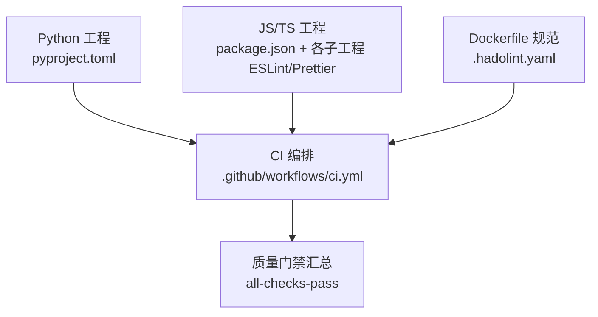
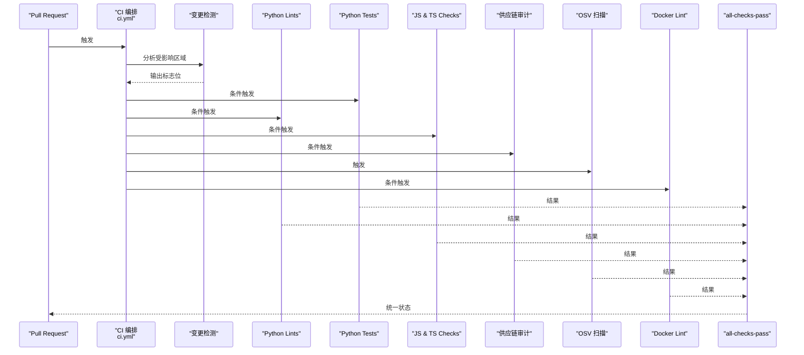
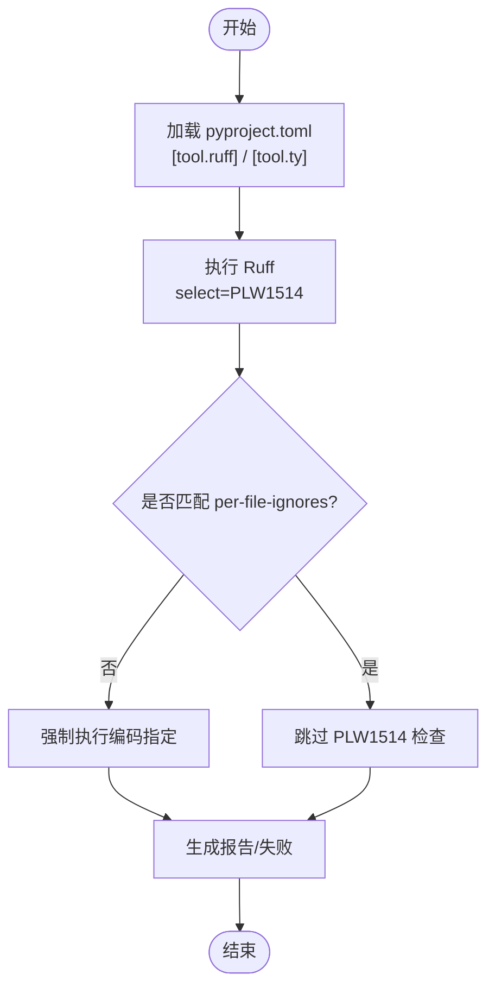
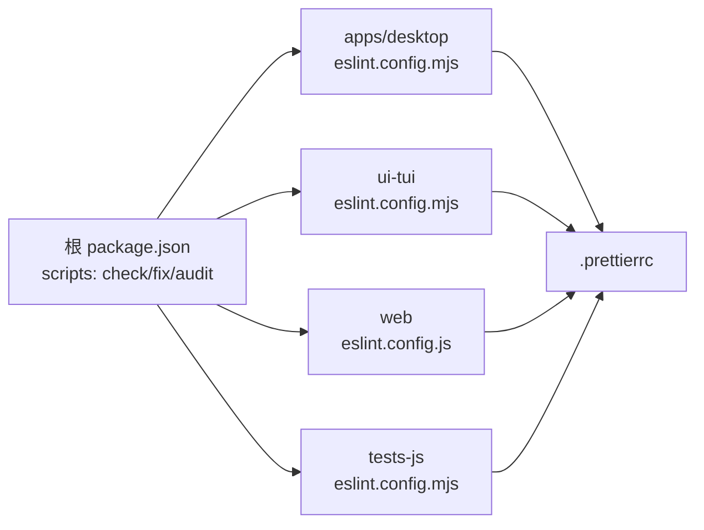
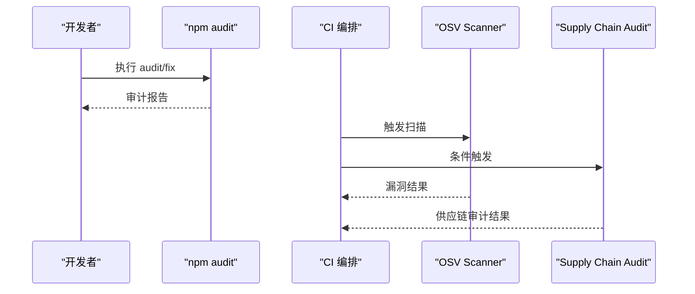
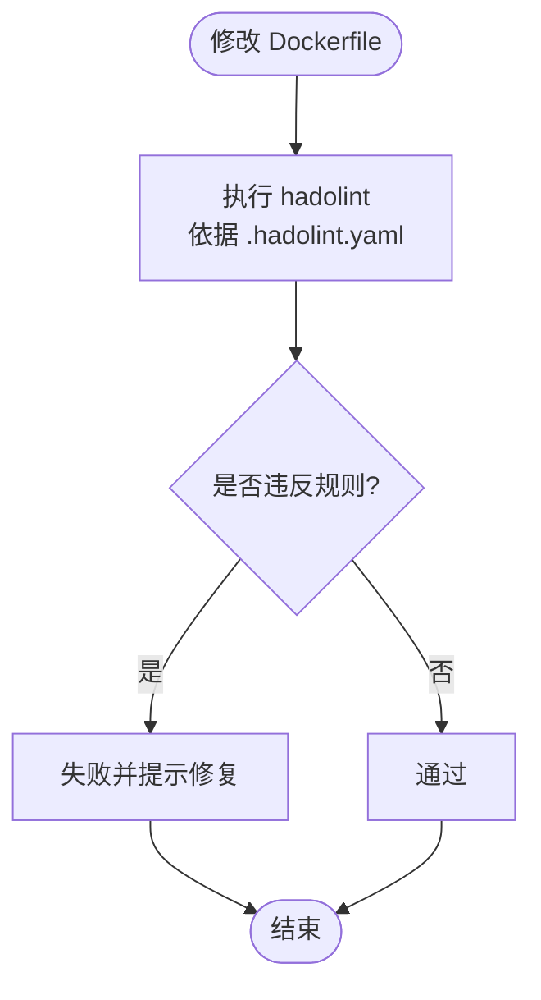
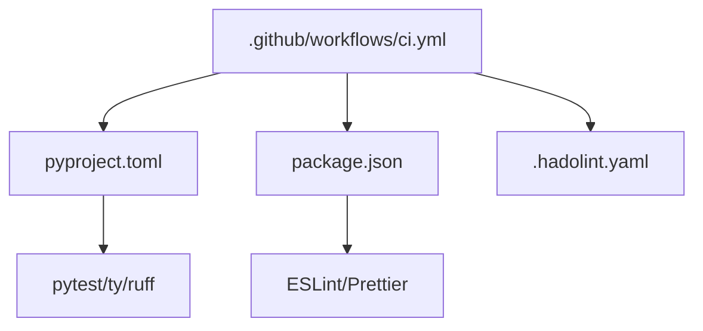

# 代码质量检查工具

<cite>
**本文引用的文件**
- [pyproject.toml](file://pyproject.toml)
- [.github/workflows/ci.yml](file://.github/workflows/ci.yml)
- [package.json](file://package.json)
- [.prettierrc](file://.prettierrc)
- [.hadolint.yaml](file://.hadolint.yaml)
</cite>

## 目录
1. [简介](#简介)
2. [项目结构](#项目结构)
3. [核心组件](#核心组件)
4. [架构总览](#架构总览)
5. [详细组件分析](#详细组件分析)
6. [依赖关系分析](#依赖关系分析)
7. [性能考虑](#性能考虑)
8. [故障排查指南](#故障排查指南)
9. [结论](#结论)
10. [附录](#附录)

## 简介
本文件面向 Hermes-Agent 项目的代码质量保证体系，聚焦静态分析、覆盖率、依赖扫描与安全审计、代码格式化以及持续集成中的自动化流程。文档基于仓库中现有配置与 CI 工作流进行说明，帮助开发者在本地与 CI 环境中统一执行质量门禁，降低缺陷与安全漏洞引入风险。

## 项目结构
本项目采用多语言、多子工程组织：
- Python 工程：以 pyproject.toml 为中心，集中声明依赖、测试与部分 lint 规则。
- JavaScript/TypeScript 工程：根 package.json 管理 workspace，各子应用独立维护 ESLint/Prettier 等配置。
- Docker 构建：使用 hadolint 对 Dockerfile 进行规范检查。
- CI 流水线：通过 .github/workflows/ci.yml 编排检测、测试、安全扫描与制品构建。



**图表来源**
- [.github/workflows/ci.yml:17-29](file://.github/workflows/ci.yml#L17-L29)
- [pyproject.toml:410-449](file://pyproject.toml#L410-L449)
- [package.json:13-26](file://package.json#L13-L26)
- [.hadolint.yaml:1-37](file://.hadolint.yaml#L1-L37)

**章节来源**
- [pyproject.toml:410-449](file://pyproject.toml#L410-L449)
- [package.json:13-26](file://package.json#L13-L26)
- [.github/workflows/ci.yml:17-29](file://.github/workflows/ci.yml#L17-L29)
- [.hadolint.yaml:1-37](file://.hadolint.yaml#L1-L37)

## 核心组件
- 静态分析与类型检查
  - Ruff（Python）：启用预览模式，仅开启 PLW1514（文本 I/O 未指定编码），避免 Windows 下默认编码导致乱码问题；测试与插件目录放宽该规则。
  - ty（Python 类型检查）：设置 Python 版本与规则策略。
  - ESLint（JS/TS）：各子工程维护 eslint.config.*，根级提供共享配置。
- 代码覆盖率
  - pytest 测试框架：通过 pyproject.toml 的 [tool.pytest.ini_options] 定义测试路径与标记；覆盖率统计可结合 pytest-cov 或 coverage.py 在本地或 CI 中执行。
- 依赖扫描与安全审计
  - npm audit：根 package.json 提供 audit 脚本，支持按 workspace 审计与修复。
  - OSV 扫描：CI 中包含 osv-scanner 任务，用于开源漏洞扫描。
  - 供应链审计：CI 包含 supply-chain-audit 子工作流，结合变更检测决定是否运行。
- 代码格式化
  - Prettier：根级 .prettierrc 统一 JS/TS 风格。
  - Dockerfile 规范：.hadolint.yaml 约束 Dockerfile 最佳实践。
- 持续集成
  - CI 编排：ci.yml 作为入口，协调 tests、lint、js-tests、supply-chain、osv-scanner、docker-lint 等任务，并通过 all-checks-pass 聚合结果。

**章节来源**
- [pyproject.toml:410-449](file://pyproject.toml#L410-L449)
- [package.json:13-26](file://package.json#L13-L26)
- [.github/workflows/ci.yml:69-190](file://.github/workflows/ci.yml#L69-L190)
- [.hadolint.yaml:1-37](file://.hadolint.yaml#L1-L37)

## 架构总览
下图展示 CI 中质量检查的整体流程：变更检测后并行触发各 lane，最终汇总到 all-checks-pass。



**图表来源**
- [.github/workflows/ci.yml:33-190](file://.github/workflows/ci.yml#L33-L190)
- [.github/workflows/ci.yml:242-291](file://.github/workflows/ci.yml#L242-L291)

**章节来源**
- [.github/workflows/ci.yml:33-190](file://.github/workflows/ci.yml#L33-L190)
- [.github/workflows/ci.yml:242-291](file://.github/workflows/ci.yml#L242-L291)

## 详细组件分析

### Python 静态分析与类型检查（Ruff、ty）
- Ruff
  - 启用预览规则，仅选择 PLW1514（强制文本 I/O 指定编码），防止 Windows 默认编码引发数据损坏。
  - 针对 tests、skills、plugins 等目录放宽该规则，允许有意为之的边界场景。
- ty
  - 指定 Python 版本为 3.13，并配置规则策略（如 unknown-argument warn、redundant-cast ignore）。



**图表来源**
- [pyproject.toml:430-449](file://pyproject.toml#L430-L449)

**章节来源**
- [pyproject.toml:430-449](file://pyproject.toml#L430-L449)

### Python 测试与覆盖率（pytest、pytest-cov、coverage.py）
- 测试框架
  - 通过 [tool.pytest.ini_options] 指定测试路径为 tests，并定义 markers（integration、real_concurrent_gate 等）。
  - addopts 默认排除 integration 测试，加速常规 CI。
- 覆盖率
  - 可在本地或 CI 中以 pytest-cov 或 coverage.py 收集覆盖率，建议将覆盖率阈值纳入质量门禁。
  - 建议在 CI 中产出 HTML/JSON 报告以便归档与趋势分析。

```mermaid
flowchart TD
TStart(["运行测试"]) --> PyTest["调用 pytest<br/>读取 pyproject 配置"]
PyTest --> Markers{"是否标记 integration?"}
Markers --> |是| SkipInt["跳过或单独执行"]
Markers --> |否| RunTests["执行单元测试"]
RunTests --> Cov["可选：pytest-cov/coverage.py 收集覆盖率"]
Cov --> Report["生成覆盖率报告"]
SkipInt --> Report
Report --> TE nd(["结束"])
```

**图表来源**
- [pyproject.toml:410-422](file://pyproject.toml#L410-L422)

**章节来源**
- [pyproject.toml:410-422](file://pyproject.toml#L410-L422)

### JavaScript/TypeScript 静态检查与格式化（ESLint、Prettier）
- ESLint
  - 根级提供共享配置，各子工程（apps/*、ui-tui、web、tests-js）维护各自 eslint.config.*。
  - 通过 package.json 的 scripts 提供 check/fix 命令，便于统一执行。
- Prettier
  - 根级 .prettierrc 统一风格（单引号、无分号、printWidth 120 等）。
- npm audit
  - 提供 root/web/tui 三个层级的 audit 与 fix 脚本，支持按 workspace 审计。



**图表来源**
- [package.json:13-26](file://package.json#L13-L26)
- [.prettierrc:1-12](file://.prettierrc#L1-L12)

**章节来源**
- [package.json:13-26](file://package.json#L13-L26)
- [.prettierrc:1-12](file://.prettierrc#L1-L12)

### 依赖扫描与安全审计（npm audit、OSV、供应链审计）
- npm audit
  - 根 package.json 提供 audit 系列脚本，支持按 workspace 审计与自动修复。
- OSV 扫描
  - CI 中包含 osv-scanner 任务，用于开源漏洞扫描。
- 供应链审计
  - CI 中包含 supply-chain-audit 子工作流，根据 detect 输出决定是否运行。



**图表来源**
- [package.json:13-26](file://package.json#L13-L26)
- [.github/workflows/ci.yml:167-190](file://.github/workflows/ci.yml#L167-L190)

**章节来源**
- [package.json:13-26](file://package.json#L13-L26)
- [.github/workflows/ci.yml:167-190](file://.github/workflows/ci.yml#L167-L190)

### Docker 镜像规范检查（Hadolint）
- .hadolint.yaml 定义了 Dockerfile 检查规则与忽略项，确保新变更不会引入新的规范问题，同时保留必要的历史妥协。
- CI 中 docker-lint 任务会在受影响的变更时执行。



**图表来源**
- [.hadolint.yaml:1-37](file://.hadolint.yaml#L1-L37)

**章节来源**
- [.hadolint.yaml:1-37](file://.hadolint.yaml#L1-L37)

## 依赖关系分析
- Python 侧
  - 依赖与开发工具集中在 pyproject.toml，其中 dev extra 包含 ruff、pytest 等工具；ty 用于类型检查。
- JS/TS 侧
  - 根 package.json 统一管理 workspace 与脚本，各子工程维护各自的 ESLint/Prettier 配置。
- CI 侧
  - ci.yml 通过 detect-changes 决定后续任务，形成“检测→并行执行→汇总”的依赖链。



**图表来源**
- [pyproject.toml:157-176](file://pyproject.toml#L157-L176)
- [package.json:13-26](file://package.json#L13-L26)
- [.github/workflows/ci.yml:33-190](file://.github/workflows/ci.yml#L33-L190)
- [.hadolint.yaml:1-37](file://.hadolint.yaml#L1-L37)

**章节来源**
- [pyproject.toml:157-176](file://pyproject.toml#L157-L176)
- [package.json:13-26](file://package.json#L13-L26)
- [.github/workflows/ci.yml:33-190](file://.github/workflows/ci.yml#L33-L190)
- [.hadolint.yaml:1-37](file://.hadolint.yaml#L1-L37)

## 性能考虑
- 测试执行
  - 默认排除 integration 测试，缩短常规 CI 时间；可按需单独执行。
- 并行化
  - CI 中各 lane 并行执行，减少端到端等待时间。
- 缓存与增量
  - 建议在本地与 CI 中利用缓存（如 uv.lock、node_modules）提升重复执行效率。
- 规则粒度
  - Ruff 仅启用关键规则，避免过度检查带来的开销；可按模块逐步放开更多规则。

## 故障排查指南
- 本地无法运行 lint/test
  - 确认已安装对应工具（ruff、pytest、ty、ESLint、Prettier），并在相应 workspace 内执行。
  - 若遇到编码相关报错，检查是否显式指定了文本 I/O 的 encoding。
- CI 失败定位
  - 查看 ci.yml 中 all-checks-pass 汇总结果，定位具体失败的 job。
  - 对于 supply-chain/osv 失败，优先处理高严重性漏洞。
- Dockerfile 规范失败
  - 根据 hadolint 输出逐项修复，必要时评估是否可以调整 .hadolint.yaml 的忽略项。

**章节来源**
- [.github/workflows/ci.yml:242-291](file://.github/workflows/ci.yml#L242-L291)
- [.hadolint.yaml:1-37](file://.hadolint.yaml#L1-L37)

## 结论
本项目已具备较为完善的代码质量保证体系：Python 侧通过 Ruff 与 ty 控制基础质量与类型安全；JS/TS 侧通过 ESLint 与 Prettier 统一风格；依赖与安全方面借助 npm audit、OSV 与供应链审计；CI 编排将上述环节串联为统一门禁。建议在此基础上逐步扩展覆盖率阈值、引入更严格的 lint 规则，并将预提交钩子与本地脚本对齐，进一步提升交付质量。

## 附录
- 常用命令参考
  - Python 测试：pytest（可通过 pyproject 配置）
  - Python 类型检查：ty（通过 pyproject 配置）
  - Python 代码检查：ruff（通过 pyproject 配置）
  - JS/TS 检查：npm run check（根脚本分发至各 workspace）
  - JS/TS 修复：npm run fix
  - 依赖审计：npm audit（根及各 workspace）
- 配置文件位置
  - Python：pyproject.toml
  - JS/TS：package.json 与各子工程 eslint.config.*、.prettierrc
  - Docker：.hadolint.yaml
  - CI：.github/workflows/ci.yml