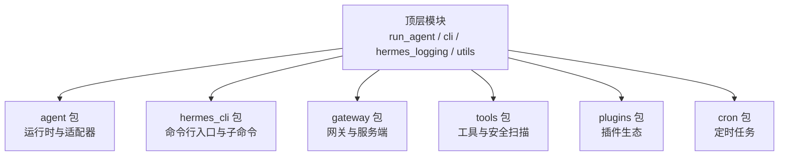
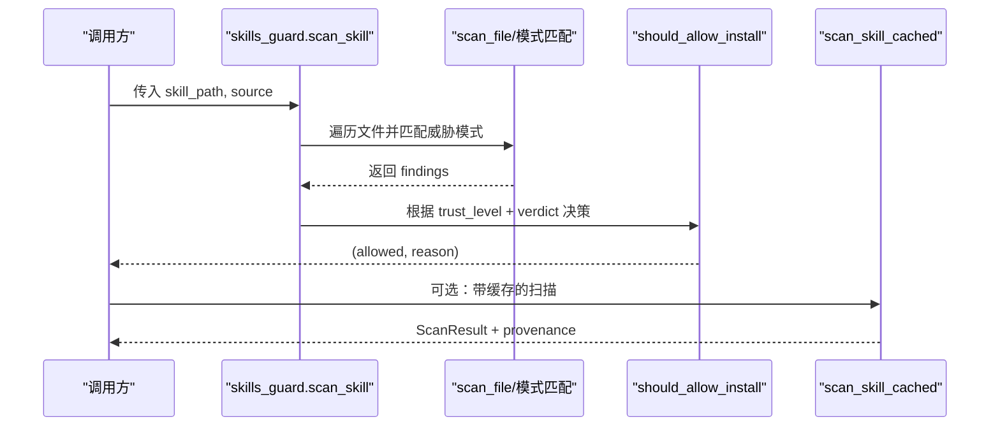
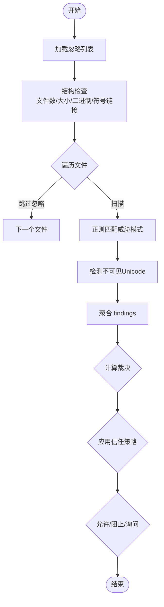
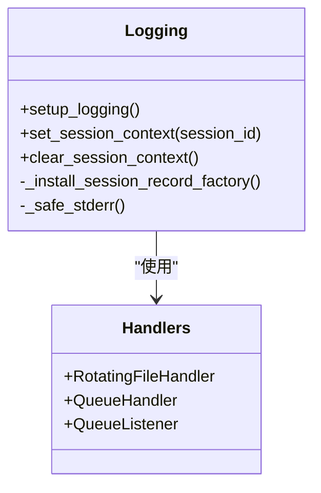
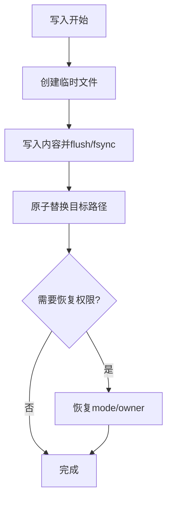
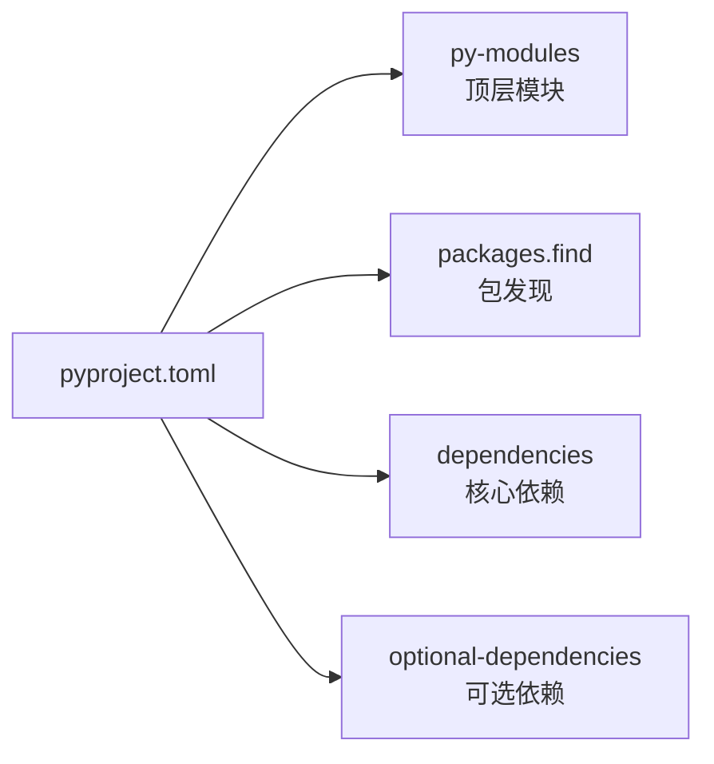

# 代码风格指南

<cite>
**本文引用的文件**
- [pyproject.toml](file://pyproject.toml)
- [tools/skills_guard.py](file://tools/skills_guard.py)
- [hermes_logging.py](file://hermes_logging.py)
- [utils.py](file://utils.py)
</cite>

## 目录
1. [简介](#简介)
2. [项目结构](#项目结构)
3. [核心组件](#核心组件)
4. [架构总览](#架构总览)
5. [详细组件分析](#详细组件分析)
6. [依赖关系分析](#依赖关系分析)
7. [性能考量](#性能考量)
8. [故障排查指南](#故障排查指南)
9. [结论](#结论)
10. [附录](#附录)

## 简介
本指南面向 Hermes Agent 的 Python 代码，目标是建立统一、可执行、可审查的代码规范与质量基线。内容覆盖：
- 缩进、行宽、注释与导入顺序等基础格式约定
- 变量/函数命名、类设计原则、模块组织方式
- 文档字符串与复杂逻辑注释标准
- 工具链配置（Ruff、Black、isort、pytest 等）
- 代码审查清单与质量标准
- 以 skills_guard.py 为范例，展示清晰、可维护的安全扫描代码组织模式
- 优秀示例与常见问题修复思路

## 项目结构
仓库采用按功能域划分的包结构，Python 代码主要分布在 agent、hermes_cli、gateway、tools、plugins、cron 等子包中；顶层包含入口脚本与构建配置。关键特征：
- 单文件模块与包并存：顶层存在 run_agent、cli、hermes_constants、hermes_logging、utils 等单文件模块，便于直接作为脚本或库使用
- 包发现范围在构建配置中显式声明，确保打包产物完整
- 可选依赖通过 extras 管理，核心依赖保持最小化并严格版本锁定，降低供应链风险

**图示来源**
- [pyproject.toml:374-399](file://pyproject.toml#L374-L399)

**章节来源**
- [pyproject.toml:374-399](file://pyproject.toml#L374-L399)

## 核心组件
本节聚焦与代码风格和质量保障密切相关的核心组件：日志系统、通用工具、技能安全扫描器。

- 日志系统（hermes_logging.py）
  - 提供统一的 setup_logging 入口，集中输出 agent.log、errors.log、gateway.log、gui.log
  - 支持会话上下文注入，便于跨进程/线程关联日志
  - Windows 下使用并发日志处理器避免重命名冲突
  - 对第三方噪声日志进行降噪处理

- 通用工具（utils.py）
  - 原子写入与替换：atomic_write_text、atomic_replace，保证崩溃/中断下的数据一致性
  - 权限与所有者保留：在原子替换后恢复 mode/owner，适配 Docker/NAS 场景
  - 布尔值与环境变量解析：is_truthy_value、env_var_enabled

- 技能安全扫描器（tools/skills_guard.py）
  - 基于正则的模式匹配，检测信息泄露、提示注入、破坏性操作、持久化、网络隧道、混淆、提权、供应链风险等
  - 信任等级策略：builtin/trusted/community/agent-created，决定允许/阻止/询问
  - 结构化结果：Finding、ScanResult 数据类，便于序列化与审计
  - 缓存与溯源：scan_skill_cached 支持按内容哈希缓存与签发溯源信息

**章节来源**
- [hermes_logging.py:1-200](file://hermes_logging.py#L1-L200)
- [utils.py:1-200](file://utils.py#L1-L200)
- [tools/skills_guard.py:1-800](file://tools/skills_guard.py#L1-L800)

## 架构总览
下图展示了“技能安装前安全扫描”的关键流程，体现从扫描到决策再到缓存与溯源的闭环。

**图示来源**
- [tools/skills_guard.py:640-800](file://tools/skills_guard.py#L640-L800)

## 详细组件分析

### 组件A：技能安全扫描器（tools/skills_guard.py）
该组件是外部技能进入系统前的安全闸门，采用“规则+策略”的方式实现高内聚、低耦合的可扩展扫描能力。

- 数据结构
  - Finding：记录匹配到的威胁模式、严重级别、类别、位置与描述
  - ScanResult：汇总技能名、来源、信任等级、裁决、发现项、时间戳与摘要
- 威胁模式
  - 分类覆盖：exfiltration、injection、destructive、persistence、network、obfuscation、execution、traversal、mining、supply_chain、privilege_escalation、credential_exposure 等
  - 预编译正则提升性能，逐行去重减少重复告警
- 策略与信任
  - INSTALL_POLICY 将 trust_level 与 verdict 映射为 allow/block/ask
  - TRUSTED_REPOS 定义可信源集合
- 扫描流程
  - 结构检查：文件数量、大小、二进制文件、符号链接等
  - 文本扫描：仅扫描白名单扩展名，忽略 .skillignore/.clawhubignore
  - 不可见字符检测：防止零宽字符注入
- 缓存与溯源
  - full_content_hash 生成稳定哈希
  - scan_skill_cached 返回 ScanResult 与 provenance，支持 fresh/fallback

**图示来源**
- [tools/skills_guard.py:531-568](file://tools/skills_guard.py#L531-L568)
- [tools/skills_guard.py:575-637](file://tools/skills_guard.py#L575-L637)
- [tools/skills_guard.py:640-800](file://tools/skills_guard.py#L640-L800)

**章节来源**
- [tools/skills_guard.py:1-800](file://tools/skills_guard.py#L1-L800)

### 组件B：日志系统（hermes_logging.py）
- 统一入口：setup_logging() 初始化多文件输出，区分 agent/gateway/gui/errors
- 会话上下文：set_session_context/clear_session_context 注入 session_tag
- 平台兼容：Windows 下使用并发日志处理器避免锁竞争
- 噪声抑制：对第三方库日志进行降噪

**图示来源**
- [hermes_logging.py:1-200](file://hermes_logging.py#L1-L200)

**章节来源**
- [hermes_logging.py:1-200](file://hermes_logging.py#L1-L200)

### 组件C：通用工具（utils.py）
- 原子写入：atomic_write_text 通过临时文件+fsync+原子替换，确保一致性与幂等
- 权限保留：在替换后恢复 mode/owner，适配容器与共享存储
- 布尔与环境变量：is_truthy_value、env_var_enabled 提供一致的语义

**图示来源**
- [utils.py:91-200](file://utils.py#L91-L200)

**章节来源**
- [utils.py:1-200](file://utils.py#L1-L200)

## 依赖关系分析
- 构建与包发现
  - py-modules 声明顶层单文件模块
  - packages.find 指定包发现范围，确保打包完整性
- 依赖管理
  - 核心依赖精确锁定，减少供应链漂移
  - 可选依赖通过 extras 按需引入，降低默认安装面
  - 平台标记与条件依赖用于跨平台兼容

**图示来源**
- [pyproject.toml:374-399](file://pyproject.toml#L374-L399)
- [pyproject.toml:157-352](file://pyproject.toml#L157-L352)

**章节来源**
- [pyproject.toml:157-399](file://pyproject.toml#L157-L399)

## 性能考量
- 正则预编译：威胁模式在模块级预编译，避免重复编译开销
- 行级去重：同一 pattern_id 在同一行仅记录一次，减少冗余
- 文件过滤：仅扫描白名单扩展名，跳过二进制与无关文件
- 缓存机制：scan_skill_cached 基于内容哈希与来源标识缓存结果，避免重复扫描
- 日志优化：队列处理器与降噪策略降低 I/O 与噪音

[本节为通用指导，不直接分析具体文件]

## 故障排查指南
- 日志相关
  - Windows 日志旋转失败：确认使用并发日志处理器，避免多进程同时重命名
  - 会话标签缺失：确保在会话开始时调用 set_session_context，结束时 clear_session_context
- 文件写入相关
  - 权限丢失：使用 atomic_write_text 并启用 preserve_mode，必要时设置 create_mode
  - 跨设备/忙文件：atomic_replace 已内置 copy/fsync/unlink 回退路径
- 安全扫描相关
  - 误报过多：调整 THREAT_PATTERNS 或 .skillignore 排除开发/文档工件
  - 漏报：补充新的正则模式并评估严重级别与类别

**章节来源**
- [hermes_logging.py:1-200](file://hermes_logging.py#L1-L200)
- [utils.py:91-200](file://utils.py#L91-L200)
- [tools/skills_guard.py:531-800](file://tools/skills_guard.py#L531-L800)

## 结论
本指南基于仓库现有实践提炼出统一的 Python 代码风格与质量基线，并以 skills_guard.py 为范例展示如何编写清晰、可维护、可扩展的安全扫描代码。建议团队在新增功能时遵循以下原则：
- 明确职责边界，保持模块高内聚、低耦合
- 使用数据类与结构化结果表达状态与决策
- 通过策略与规则分离实现可扩展行为
- 借助工具链自动化格式与静态检查，减少人为差异

[本节为总结性内容，不直接分析具体文件]

## 附录

### A. 代码格式与导入顺序规范
- 缩进与行宽
  - 使用 4 空格缩进
  - 行宽建议不超过 120 字符，必要时合理换行
- 导入顺序
  - 标准库 → 第三方库 → 本地模块
  - 每组之间空一行，按字母序排列
- 格式化与检查
  - Ruff：启用预览规则，强制文本模式打开文件时指定 encoding（PLW1514）
  - Black：统一代码风格（若启用）
  - isort：自动排序与分组导入（若启用）
  - pytest：测试路径与标记在配置中集中管理

**章节来源**
- [pyproject.toml:410-449](file://pyproject.toml#L410-L449)

### B. 命名约定
- 变量与函数
  - 小写下划线分隔（snake_case），如 env_var_enabled、atomic_write_text
  - 私有成员使用前缀下划线，如 _preserve_file_mode
- 类与常量
  - 类名使用大驼峰（PascalCase），如 ScanResult、Finding
  - 常量全大写加下划线，如 SCANNER_VERSION、TRUSTED_REPOS
- 模块与包
  - 短横线或下划线均可，但需保持一致；当前仓库多用下划线

[本节为通用指导，不直接分析具体文件]

### C. 类的设计原则
- 单一职责：每个类聚焦一个概念或领域（如 Finding、ScanResult）
- 数据类优先：使用 dataclass 表达不可变或轻量对象
- 明确输入输出：方法签名清晰，返回值类型明确
- 可测试性：纯函数与副作用隔离，便于单元测试

**章节来源**
- [tools/skills_guard.py:74-95](file://tools/skills_guard.py#L74-L95)

### D. 模块组织结构
- 顶层模块：入口与基础设施（如 hermes_logging、utils）
- 包内按功能划分：agent、hermes_cli、gateway、tools、plugins、cron
- 包发现与打包：在构建配置中显式声明，避免遗漏

**章节来源**
- [pyproject.toml:374-399](file://pyproject.toml#L374-L399)

### E. 文档字符串与注释标准
- 函数/方法
  - 首行简述用途，后续说明参数、返回值、异常与注意事项
  - 示例：scan_file 的 docstring 明确参数与返回值
- 复杂逻辑
  - 在关键分支处添加行内注释，解释“为什么”而非“是什么”
  - 对安全敏感逻辑（如权限恢复、编码处理）给出背景与约束
- 模块级
  - 模块顶部说明职责、依赖与使用方式

**章节来源**
- [tools/skills_guard.py:575-585](file://tools/skills_guard.py#L575-L585)
- [utils.py:91-170](file://utils.py#L91-L170)
- [hermes_logging.py:1-28](file://hermes_logging.py#L1-L28)

### F. 工具链配置要点
- Ruff
  - 启用预览规则，强制 PLW1514（未指定编码）
  - 针对 tests、skills、plugins 放宽特定规则
- 依赖管理
  - 核心依赖精确锁定，可选依赖通过 extras 管理
  - 平台标记与条件依赖确保跨平台兼容
- 测试
  - 测试路径与标记在配置中集中管理，集成测试默认跳过

**章节来源**
- [pyproject.toml:410-449](file://pyproject.toml#L410-L449)
- [pyproject.toml:157-352](file://pyproject.toml#L157-L352)

### G. 代码审查清单与质量标准
- 基本规范
  - 缩进、行宽、导入顺序符合约定
  - 命名清晰、一致，无歧义缩写
- 设计与实现
  - 单一职责，模块边界清晰
  - 使用数据类与结构化结果表达状态
  - 复杂逻辑有注释与用例支撑
- 安全与健壮性
  - 敏感信息不落地，日志脱敏
  - 文件操作使用原子写入与权限恢复
  - 外部输入校验与错误处理完备
- 可维护性
  - 依赖最小化，可选依赖按需加载
  - 测试覆盖关键路径，CI 门禁有效

[本节为通用指导，不直接分析具体文件]

### H. 优秀示例与常见问题修复
- 优秀示例
  - skills_guard.py：清晰的 Finding/ScanResult 数据类、预编译正则、策略与规则分离、缓存与溯源
  - utils.py：原子写入与权限恢复，适配容器与共享存储
  - hermes_logging.py：统一日志入口、会话上下文注入、平台兼容
- 常见问题修复
  - 未指定编码导致 Windows 乱码：通过 Ruff 规则 PLW1514 强制显式编码
  - 日志旋转失败：Windows 下切换为并发日志处理器
  - 权限丢失：原子替换后恢复 mode/owner
  - 误报/漏报：调整威胁模式与忽略列表

**章节来源**
- [tools/skills_guard.py:526-568](file://tools/skills_guard.py#L526-L568)
- [utils.py:91-200](file://utils.py#L91-L200)
- [hermes_logging.py:42-69](file://hermes_logging.py#L42-L69)
- [pyproject.toml:430-449](file://pyproject.toml#L430-L449)