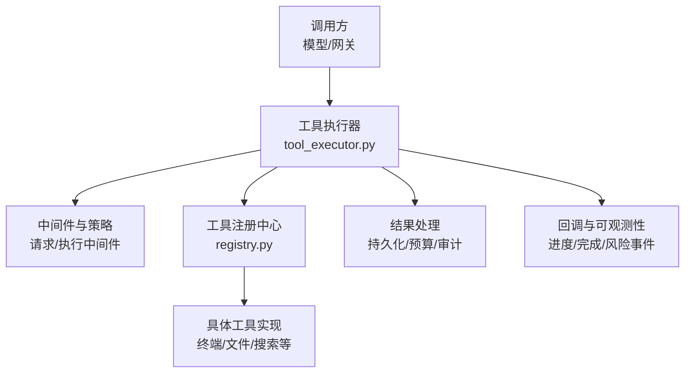
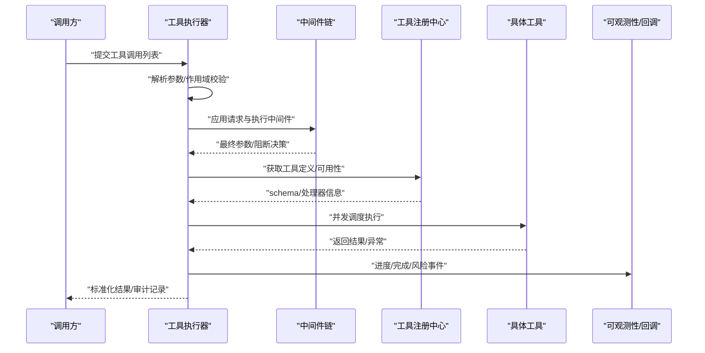
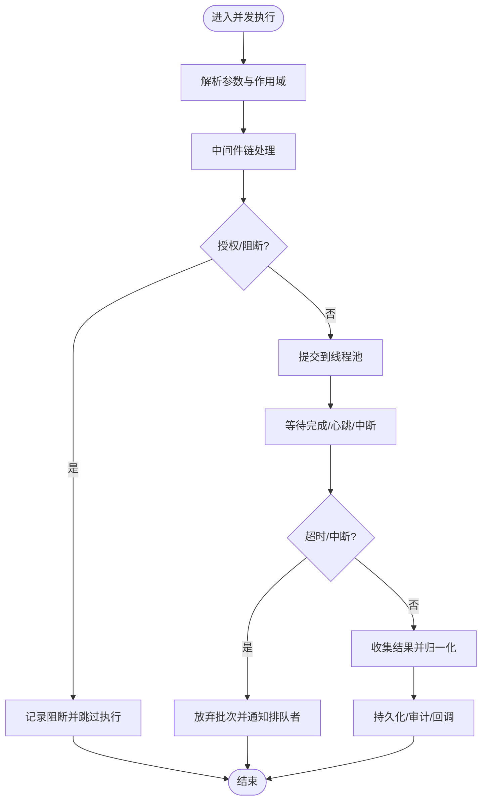
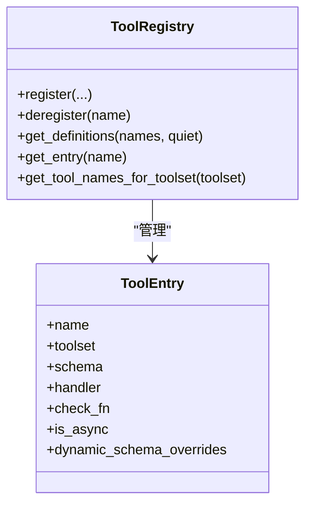
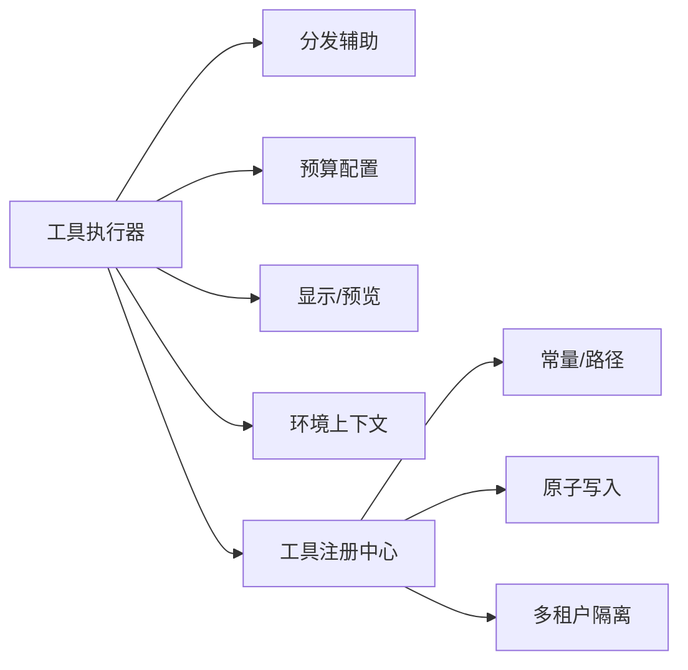

# 常见反模式和重构技巧

<cite>
**本文引用的文件**
- [agent/tool_executor.py](file://agent/tool_executor.py)
- [tools/registry.py](file://tools/registry.py)
- [tests/tools/test_terminal_error_redaction.py](file://tests/tools/test_terminal_error_redaction.py)
- [tests/gateway/test_adapter_connect_is_reconnect_contract.py](file://tests/gateway/test_adapter_connect_is_reconnect_contract.py)
</cite>

## 目录
1. [简介](#简介)
2. [项目结构](#项目结构)
3. [核心组件](#核心组件)
4. [架构总览](#架构总览)
5. [详细组件分析](#详细组件分析)
6. [依赖关系分析](#依赖关系分析)
7. [性能考量](#性能考量)
8. [故障排查指南](#故障排查指南)
9. [结论](#结论)
10. [附录](#附录)

## 简介
本文件聚焦于在技能与工具执行链路中常见的代码反模式，以及对应的重构策略与最佳实践。结合仓库中的工具执行器与工具注册中心，我们系统梳理了魔法数字、深层嵌套、重复逻辑、硬编码常量等反模式，并给出函数提取、条件简化、循环优化、并发控制、错误处理与可观测性注入等重构技巧。同时，通过实际案例展示如何运用工厂、策略、观察者等设计模式提升可扩展性与可维护性，并以工具执行流程为例，演示复杂逻辑的重构路径与效果评估方法。

## 项目结构
围绕“工具调用—调度—执行—结果处理”的主干链路，关键模块包括：
- 工具执行器：负责解析参数、中间件管道、并发调度、超时与中断、结果持久化与审计。
- 工具注册中心：集中管理工具元数据、可用性检查缓存、动态 schema 覆盖、注册/注销安全策略。
- 测试用例：验证输出脱敏、接口契约一致性等质量门禁。

**图示来源**
- [agent/tool_executor.py:758-1599](file://agent/tool_executor.py#L758-L1599)
- [tools/registry.py:414-764](file://tools/registry.py#L414-L764)

**章节来源**
- [agent/tool_executor.py:758-1599](file://agent/tool_executor.py#L758-L1599)
- [tools/registry.py:414-764](file://tools/registry.py#L414-L764)

## 核心组件
- 工具执行器
  - 职责：解析参数、校验作用域、中间件链、并发执行、超时/中断、结果归一化、预算控制、审计与回调。
  - 关键点：顺序门控避免审批提示交错；授权门限排除人类等待时间；批量放弃信号防止僵尸线程；结果持久化保障可恢复。
- 工具注册中心
  - 职责：发现与注册工具、生成 OpenAI 风格 schema、可用性检查缓存、动态 schema 覆盖、注册/注销权限控制。
  - 关键点：TTL 与宽限期抑制瞬态失败；多租户隔离的缓存范围；按工具粒度过滤暴露能力。

**章节来源**
- [agent/tool_executor.py:758-1599](file://agent/tool_executor.py#L758-L1599)
- [tools/registry.py:201-764](file://tools/registry.py#L201-L764)

## 架构总览
下图展示了从工具调用到执行的完整时序，包含参数解析、中间件、并发调度、超时/中断、结果处理与审计回调。

**图示来源**
- [agent/tool_executor.py:758-1599](file://agent/tool_executor.py#L758-L1599)
- [tools/registry.py:717-764](file://tools/registry.py#L717-L764)

## 详细组件分析

### 工具执行器：并发调度与批处理
- 反模式识别
  - 魔法数字：并发超时、启动顺序门超时、授权锁超时等硬编码阈值。
  - 深层嵌套：参数解析、作用域解包、中间件、授权、执行、结果处理的分支交织。
  - 重复逻辑：多处结果写入、审计回调、活动心跳更新。
- 重构建议
  - 将阈值抽取为配置项或常量表，并提供单位与默认值说明。
  - 使用策略模式封装不同工具类型的并行度限制（如图像生成）。
  - 将“开始顺序门控”和“授权门限”抽象为可组合的守卫对象，降低耦合。
  - 用统一的“结果装配器”聚合各分支的结果写入与审计，减少重复。
- 复杂度与性能
  - 并发度受限于最大工作线程数与特定工具类型上限，避免后端风暴。
  - 超时与中断采用轮询+取消策略，兼顾响应性与资源释放。
  - 通过“人类等待排除”机制，使批处理截止时间更贴近真实耗时。

**图示来源**
- [agent/tool_executor.py:800-1599](file://agent/tool_executor.py#L800-L1599)

**章节来源**
- [agent/tool_executor.py:800-1599](file://agent/tool_executor.py#L800-L1599)

### 工具注册中心：注册、可用性与动态 Schema
- 反模式识别
  - 魔法数字：TTL、宽限期、缓存上限等。
  - 重复逻辑：多次 check_fn 调用与缓存写入。
  - 深层嵌套：注册/注销时的权限判断与状态快照。
- 重构建议
  - 将 TTL、宽限期、缓存上限等作为可配置常量，便于调优。
  - 将 check_fn 包装为带重试与退避的策略，屏蔽瞬态失败。
  - 将“动态 schema 覆盖”抽象为独立的策略对象，支持运行时扩展。
  - 使用快照读模式保证并发安全，避免读写竞争。
- 复杂度与性能
  - 通过 TTL 与宽限期平衡新鲜度与稳定性，减少外部探测开销。
  - 按工具维度过滤暴露能力，避免全量扫描带来的延迟。

**图示来源**
- [tools/registry.py:201-764](file://tools/registry.py#L201-L764)

**章节来源**
- [tools/registry.py:201-764](file://tools/registry.py#L201-L764)

### 测试与质量门禁：脱敏与契约校验
- 反模式识别
  - 硬编码密钥出现在错误消息中（潜在泄露）。
  - 平台适配器连接签名不一致导致重连失败。
- 重构建议
  - 统一错误消息脱敏策略，确保敏感字段被替换。
  - 对关键接口进行静态契约校验（如 connect 必须接受 is_reconnect），防止回归。
- 效果评估
  - 通过单元测试断言错误消息不包含敏感信息。
  - 通过 AST 扫描确保所有适配器符合约定签名。

**章节来源**
- [tests/tools/test_terminal_error_redaction.py:1-154](file://tests/tools/test_terminal_error_redaction.py#L1-L154)
- [tests/gateway/test_adapter_connect_is_reconnect_contract.py:1-145](file://tests/gateway/test_adapter_connect_is_reconnect_contract.py#L1-L145)

## 依赖关系分析
- 工具执行器依赖
  - 显示与预览：用于日志与 UI 展示。
  - 工具分发辅助：计划批处理分段、结果消息构造。
  - 预算配置：根据上下文窗口调整结果大小限制。
  - 环境上下文：终端环境变量传播。
- 工具注册中心依赖
  - 常量与路径：定位缓存位置。
  - 原子写入：缓存文件的原子更新。
  - 多进程/多租户：会话隔离与缓存范围。

**图示来源**
- [agent/tool_executor.py:1-112](file://agent/tool_executor.py#L1-L112)
- [tools/registry.py:162-199](file://tools/registry.py#L162-L199)

**章节来源**
- [agent/tool_executor.py:1-112](file://agent/tool_executor.py#L1-L112)
- [tools/registry.py:162-199](file://tools/registry.py#L162-L199)

## 性能考量
- 并发度控制
  - 全局最大工作线程数与特定工具类型（如图像生成）的并行上限，避免后端过载。
- 超时与中断
  - 批处理超时与启动顺序门超时分层设置，避免长任务阻塞整体进度。
  - 用户中断时快速取消未启动任务，已运行任务给予短暂优雅退出窗口。
- 缓存与探测
  - 可用性检查的 TTL 与宽限期抑制瞬态失败，减少不必要的网络/SDK 调用。
- 结果预算
  - 根据上下文窗口动态裁剪工具结果，防止单次结果过大导致请求超限。

[本节提供通用指导，不直接分析具体文件]

## 故障排查指南
- 常见问题
  - 工具结果过长：检查预算配置与结果归一化逻辑。
  - 并发卡死：检查启动顺序门与授权门的超时设置与放弃信号。
  - 错误消息泄露：确认脱敏策略是否生效。
  - 平台断开：确认适配器 connect 签名是否符合契约。
- 定位步骤
  - 查看工具执行日志中的阶段标记与耗时。
  - 检查中间件链是否阻断或修改参数。
  - 核对注册中心的可用性缓存与动态 schema 覆盖。
  - 运行相关测试用例验证脱敏与契约。

**章节来源**
- [agent/tool_executor.py:1147-1599](file://agent/tool_executor.py#L1147-L1599)
- [tests/tools/test_terminal_error_redaction.py:1-154](file://tests/tools/test_terminal_error_redaction.py#L1-L154)
- [tests/gateway/test_adapter_connect_is_reconnect_contract.py:1-145](file://tests/gateway/test_adapter_connect_is_reconnect_contract.py#L1-L145)

## 结论
通过对工具执行器与注册中心的深入分析，我们识别出魔法数字、深层嵌套、重复逻辑等常见反模式，并提出了基于函数提取、策略模式、守卫对象、统一结果装配等重构方案。结合并发控制、超时中断、缓存与预算等机制，系统在可扩展性、稳定性与可观测性方面得到显著提升。建议在后续迭代中持续引入契约测试与静态检查，进一步降低回归风险。

[本节总结性内容，不直接分析具体文件]

## 附录
- 重构前后对比要点
  - 将硬编码阈值迁移至配置层，提高可调性与可维护性。
  - 将复杂条件分支拆分为独立守卫与策略，降低认知负担。
  - 统一结果处理与审计入口，减少重复与不一致。
- 度量指标建议
  - 平均/分位耗时：工具执行与批处理整体耗时。
  - 超时率与中断率：反映系统健壮性与用户体验。
  - 缓存命中率：可用性检查缓存命中比例。
  - 结果截断率：因预算导致的截断比例。

[本节提供通用指导，不直接分析具体文件]