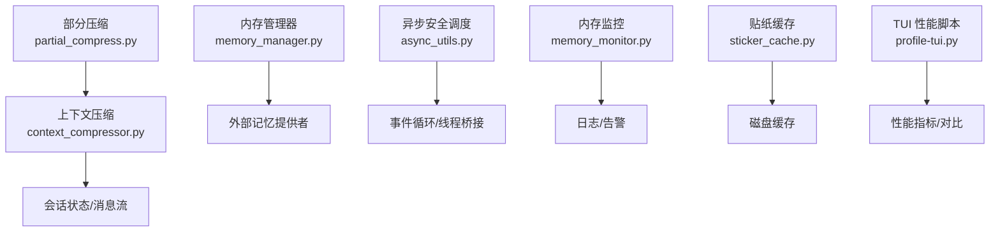
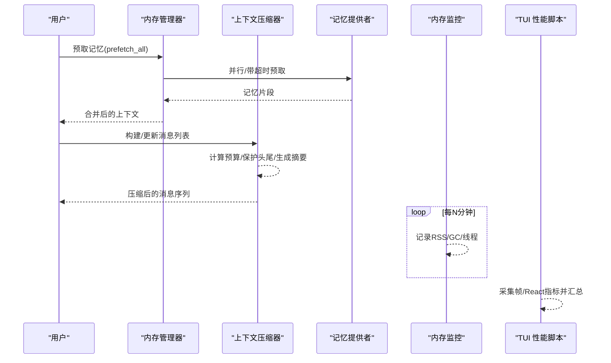
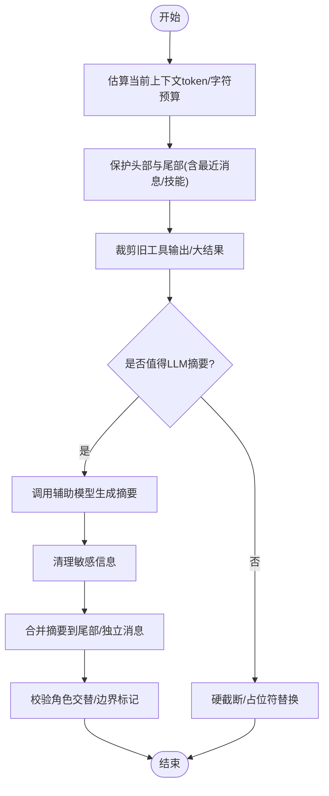
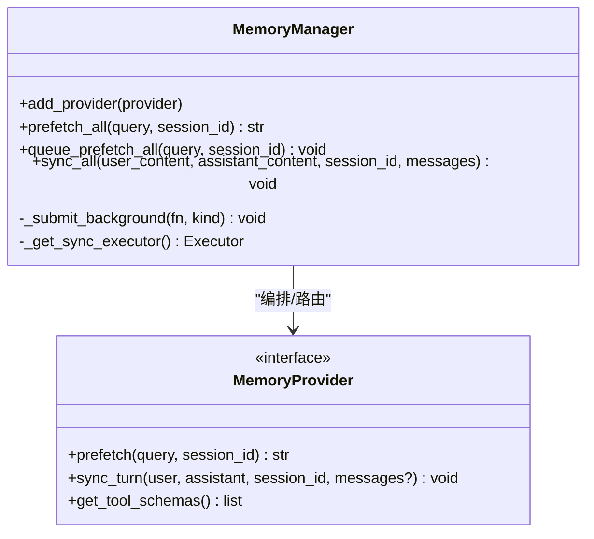
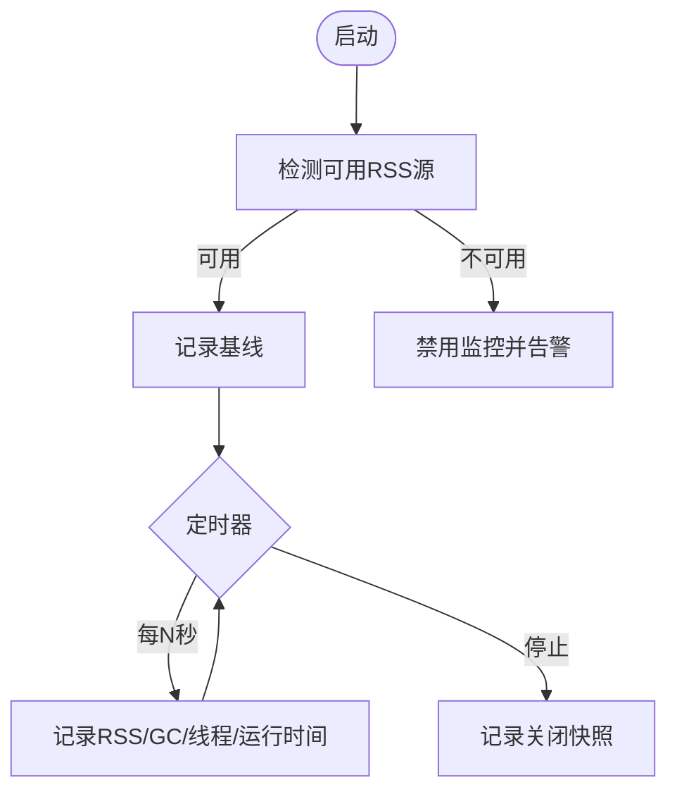
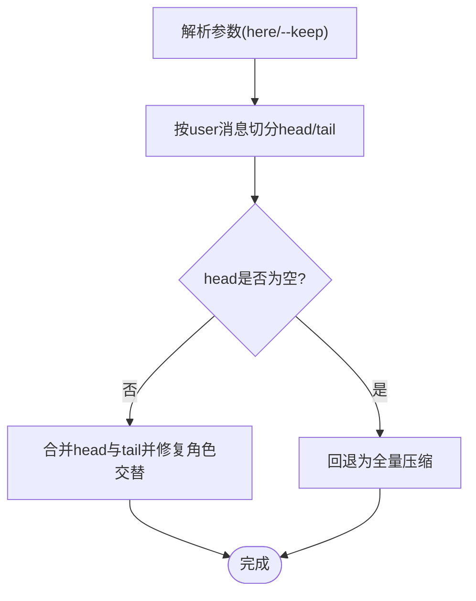
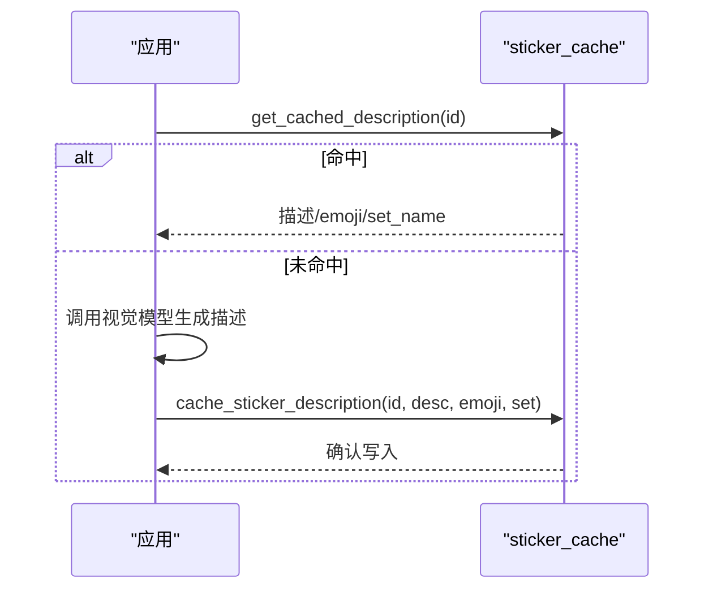
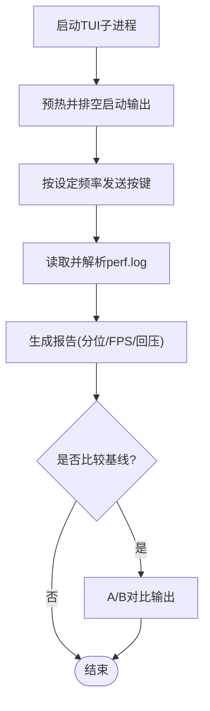
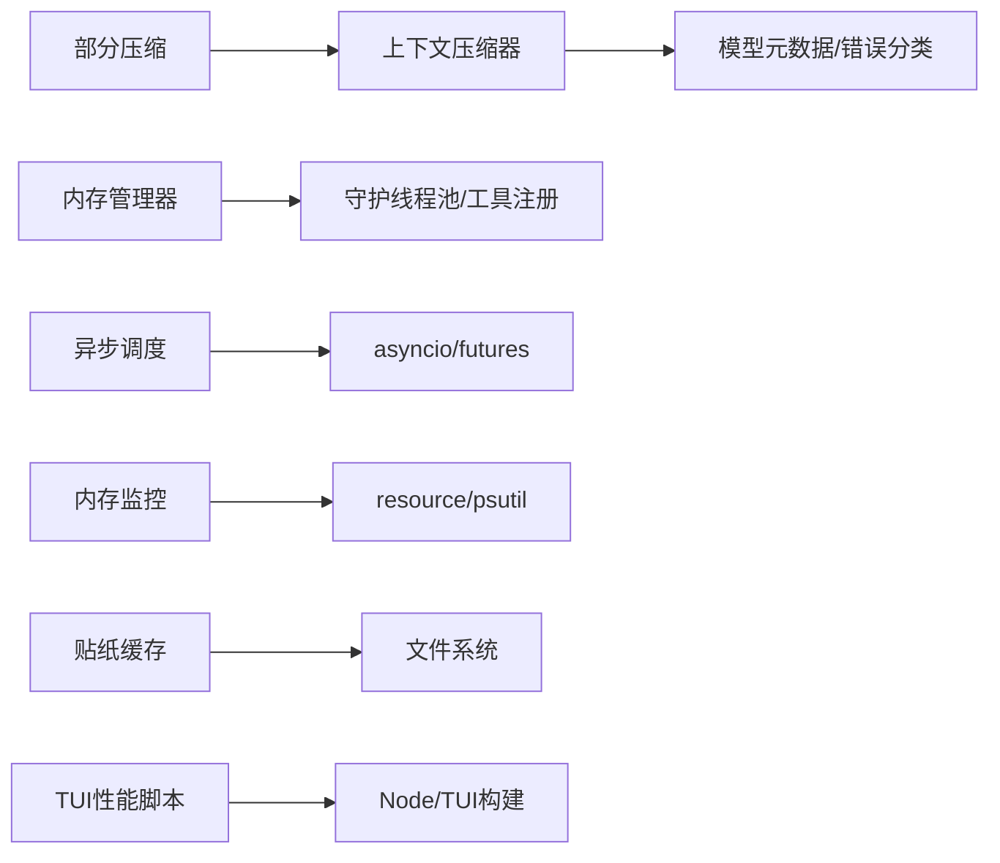

# 性能优化建议

<cite>
**本文引用的文件**
- [agent/context_compressor.py](file://agent/context_compressor.py)
- [agent/memory_manager.py](file://agent/memory_manager.py)
- [agent/async_utils.py](file://agent/async_utils.py)
- [gateway/memory_monitor.py](file://gateway/memory_monitor.py)
- [hermes_cli/partial_compress.py](file://hermes_cli/partial_compress.py)
- [gateway/sticker_cache.py](file://gateway/sticker_cache.py)
- [scripts/profile-tui.py](file://scripts/profile-tui.py)
</cite>

## 目录
1. [简介](#简介)
2. [项目结构](#项目结构)
3. [核心组件](#核心组件)
4. [架构总览](#架构总览)
5. [详细组件分析](#详细组件分析)
6. [依赖关系分析](#依赖关系分析)
7. [性能考量](#性能考量)
8. [故障排查指南](#故障排查指南)
9. [结论](#结论)
10. [附录](#附录)

## 简介
本文件面向大规模对话与数据处理场景，围绕内存管理、并发策略、缓存设计、I/O 与网络优化、以及性能分析与调优工具使用，提供可落地的最佳实践。文档以仓库中的上下文压缩、内存管理器、异步调度、内存监控、部分压缩、贴纸缓存与 TUI 性能脚本为依据，给出代码级实现要点与可视化流程，帮助在长会话、高吞吐下保持低延迟与稳定内存占用。

## 项目结构
本项目在 agent、gateway、hermes_cli、scripts 等模块中实现了与性能密切相关的子系统：
- 上下文压缩与边界控制：agent/context_compressor.py、hermes_cli/partial_compress.py
- 内存管理与后台同步：agent/memory_manager.py
- 异步安全调度：agent/async_utils.py
- 进程内存监控：gateway/memory_monitor.py
- 轻量持久缓存：gateway/sticker_cache.py
- 前端与终端性能采集：scripts/profile-tui.py



**图表来源**
- [agent/context_compressor.py:1-180](file://agent/context_compressor.py#L1-L180)
- [agent/memory_manager.py:364-758](file://agent/memory_manager.py#L364-L758)
- [agent/async_utils.py:34-85](file://agent/async_utils.py#L34-L85)
- [gateway/memory_monitor.py:83-193](file://gateway/memory_monitor.py#L83-L193)
- [hermes_cli/partial_compress.py:55-143](file://hermes_cli/partial_compress.py#L55-L143)
- [gateway/sticker_cache.py:29-93](file://gateway/sticker_cache.py#L29-L93)
- [scripts/profile-tui.py:111-284](file://scripts/profile-tui.py#L111-L284)

**章节来源**
- [agent/context_compressor.py:1-180](file://agent/context_compressor.py#L1-L180)
- [agent/memory_manager.py:364-758](file://agent/memory_manager.py#L364-L758)
- [agent/async_utils.py:34-85](file://agent/async_utils.py#L34-L85)
- [gateway/memory_monitor.py:83-193](file://gateway/memory_monitor.py#L83-L193)
- [hermes_cli/partial_compress.py:55-143](file://hermes_cli/partial_compress.py#L55-L143)
- [gateway/sticker_cache.py:29-93](file://gateway/sticker_cache.py#L29-L93)
- [scripts/profile-tui.py:111-284](file://scripts/profile-tui.py#L111-L284)

## 核心组件
- 上下文压缩器：对长对话进行滚动/批量压缩，保护头尾关键信息，维护摘要一致性，避免提示词膨胀与模型调用失败。
- 内存管理器：统一编排内置与外部记忆提供者，后台串行化写入，防止阻塞主流程；对外部预取设置超时与线程隔离。
- 异步安全调度：封装 run_coroutine_threadsafe，避免协程泄漏与“从未 await”警告，保障关闭路径安全。
- 内存监控：周期性记录 RSS、GC 计数、线程数，便于发现慢泄漏与线程泄漏。
- 部分压缩：支持用户指定压缩边界，保留最近若干轮完整对话，保证角色交替合法性。
- 贴纸缓存：将视觉描述结果持久化到 JSON，原子写入，减少重复推理成本。
- TUI 性能脚本：驱动 TUI 并收集帧/React 指标，输出分位值、FPS、回压等，支持 A/B 对比。

**章节来源**
- [agent/context_compressor.py:1-180](file://agent/context_compressor.py#L1-L180)
- [agent/memory_manager.py:364-758](file://agent/memory_manager.py#L364-L758)
- [agent/async_utils.py:34-85](file://agent/async_utils.py#L34-L85)
- [gateway/memory_monitor.py:83-193](file://gateway/memory_monitor.py#L83-L193)
- [hermes_cli/partial_compress.py:55-143](file://hermes_cli/partial_compress.py#L55-L143)
- [gateway/sticker_cache.py:29-93](file://gateway/sticker_cache.py#L29-L93)
- [scripts/profile-tui.py:111-284](file://scripts/profile-tui.py#L111-L284)

## 架构总览
下图展示长会话处理的关键路径：用户输入进入后，先通过内存管理器预取相关记忆，再交由上下文压缩器维护上下文窗口，必要时触发压缩；记忆同步与外部预取走后台队列；网关侧周期记录内存指标；TUI 性能脚本用于采集渲染与交互性能。



**图表来源**
- [agent/memory_manager.py:525-695](file://agent/memory_manager.py#L525-L695)
- [agent/context_compressor.py:1-180](file://agent/context_compressor.py#L1-L180)
- [gateway/memory_monitor.py:139-193](file://gateway/memory_monitor.py#L139-L193)
- [scripts/profile-tui.py:111-284](file://scripts/profile-tui.py#L111-L284)

## 详细组件分析

### 上下文压缩器（ContextCompressor）
- 目标：在长对话中维持稳定的上下文窗口，避免提示词过大导致失败或变慢。
- 关键点：
  - 保护头部与尾部（含最近 N 条），确保活跃任务不被误删。
  - 对中间内容做摘要，限制摘要大小与输入字符上限，降低 LLM 压力。
  - 严格清理跨边界的敏感信息，避免凭据泄露到持久摘要。
  - 维护角色交替合法性，避免模板校验失败。
  - 失败冷却与降级：连续失败时跳过，避免忙循环。
  - 技能指令防幽灵：当技能内容被裁剪时注入标记，提示重新加载。



**图表来源**
- [agent/context_compressor.py:417-453](file://agent/context_compressor.py#L417-L453)
- [agent/context_compressor.py:764-782](file://agent/context_compressor.py#L764-L782)
- [agent/context_compressor.py:230-247](file://agent/context_compressor.py#L230-L247)

**章节来源**
- [agent/context_compressor.py:1-180](file://agent/context_compressor.py#L1-L180)
- [agent/context_compressor.py:417-453](file://agent/context_compressor.py#L417-L453)
- [agent/context_compressor.py:764-782](file://agent/context_compressor.py#L764-L782)
- [agent/context_compressor.py:230-247](file://agent/context_compressor.py#L230-L247)

### 内存管理器（MemoryManager）
- 目标：统一协调多个记忆提供者，避免阻塞主流程，保证写入顺序与资源释放。
- 关键点：
  - 仅允许一个外部提供者，避免工具表膨胀与冲突。
  - 预取外部提供者使用独立线程+超时，失败不阻断主流程。
  - 同步写入通过单工作线程序列化，保证 turn N 先于 turn N+1。
  - 后台任务追踪与优雅关闭，避免进程退出时被卡住。
  - 工具 schema 规范化，避免请求被严格后端拒绝。



**图表来源**
- [agent/memory_manager.py:364-758](file://agent/memory_manager.py#L364-L758)

**章节来源**
- [agent/memory_manager.py:364-758](file://agent/memory_manager.py#L364-L758)

### 异步安全调度（async_utils）
- 目标：从线程向事件循环调度协程时，避免协程泄漏与未 await 警告。
- 关键点：
  - 捕获 run_coroutine_threadsafe 异常，关闭协程，返回 None 供分支处理。
  - 提供 detached task 结果消费方法，吞掉取消/异常以避免噪音。

```mermaid
sequenceDiagram
participant Thread as "工作线程"
participant Loop as "事件循环"
participant Helper as "safe_schedule_threadsafe"
Thread->>Helper : 提交协程
alt 成功
Helper-->>Thread : Future
Thread->>Loop : 运行Future
else 失败(循环关闭等)
Helper-->>Thread : None
Note over Helper : 关闭协程，避免泄漏
end
```

**图表来源**
- [agent/async_utils.py:34-85](file://agent/async_utils.py#L34-L85)

**章节来源**
- [agent/async_utils.py:34-85](file://agent/async_utils.py#L34-L85)

### 内存监控（memory_monitor）
- 目标：长期运行的网关进程中，持续记录内存与 GC 指标，辅助定位慢泄漏。
- 关键点：
  - 优先使用 resource.getrusage，回退 psutil。
  - 后台守护线程定时记录，启动/关闭时输出基线与最终快照。
  - 记录线程数，辅助诊断线程泄漏。



**图表来源**
- [gateway/memory_monitor.py:52-127](file://gateway/memory_monitor.py#L52-L127)
- [gateway/memory_monitor.py:139-193](file://gateway/memory_monitor.py#L139-L193)

**章节来源**
- [gateway/memory_monitor.py:52-127](file://gateway/memory_monitor.py#L52-L127)
- [gateway/memory_monitor.py:139-193](file://gateway/memory_monitor.py#L139-L193)

### 部分压缩（partial_compress）
- 目标：让用户选择压缩边界，保留最近若干轮完整对话，同时保证角色交替合法。
- 关键点：
  - 解析 here / up to here / --keep N 等参数。
  - 按 user 消息划分 head/tail，确保 tail 以 user 开头。
  - 合并 head/tail 时修复非法相邻角色，必要时插入桥接消息。



**图表来源**
- [hermes_cli/partial_compress.py:55-143](file://hermes_cli/partial_compress.py#L55-L143)
- [hermes_cli/partial_compress.py:213-325](file://hermes_cli/partial_compress.py#L213-L325)

**章节来源**
- [hermes_cli/partial_compress.py:55-143](file://hermes_cli/partial_compress.py#L55-L143)
- [hermes_cli/partial_compress.py:213-325](file://hermes_cli/partial_compress.py#L213-L325)

### 贴纸缓存（sticker_cache）
- 目标：缓存视觉描述结果，减少重复推理与网络开销。
- 关键点：
  - 基于 file_unique_id 的键值存储。
  - 原子写入（临时文件+fsync+replace），避免损坏。
  - 构建注入文本，便于下游消费。



**图表来源**
- [gateway/sticker_cache.py:29-93](file://gateway/sticker_cache.py#L29-L93)

**章节来源**
- [gateway/sticker_cache.py:29-93](file://gateway/sticker_cache.py#L29-L93)

### TUI 性能脚本（profile-tui.py）
- 目标：驱动 TUI 并采集帧/React 指标，输出分位值、FPS、回压等，支持 A/B 对比。
- 关键点：
  - 通过 PTY 发送按键，模拟高频交互。
  - 解析 perf.log，统计各阶段耗时与回压情况。
  - 输出关键指标与差异对比，辅助回归检测。



**图表来源**
- [scripts/profile-tui.py:111-284](file://scripts/profile-tui.py#L111-L284)
- [scripts/profile-tui.py:405-525](file://scripts/profile-tui.py#L405-L525)

**章节来源**
- [scripts/profile-tui.py:111-284](file://scripts/profile-tui.py#L111-L284)
- [scripts/profile-tui.py:405-525](file://scripts/profile-tui.py#L405-L525)

## 依赖关系分析
- 上下文压缩器依赖模型元数据与错误分类，确保预算与失败处理合理。
- 内存管理器依赖工具集注册与守护线程池，保证后台任务生命周期可控。
- 异步调度依赖 asyncio 与 concurrent.futures，屏蔽底层异常。
- 内存监控依赖系统 API 或可选库，具备降级能力。
- 部分压缩与上下文压缩协同，保证语义与格式一致。
- 贴纸缓存依赖文件系统原子性，确保数据一致性。
- TUI 性能脚本依赖 Node/TUI 构建产物与环境变量。



**图表来源**
- [agent/context_compressor.py:28-44](file://agent/context_compressor.py#L28-L44)
- [agent/memory_manager.py:736-758](file://agent/memory_manager.py#L736-L758)
- [agent/async_utils.py:23-28](file://agent/async_utils.py#L23-L28)
- [gateway/memory_monitor.py:52-80](file://gateway/memory_monitor.py#L52-L80)
- [hermes_cli/partial_compress.py:213-325](file://hermes_cli/partial_compress.py#L213-L325)
- [gateway/sticker_cache.py:39-56](file://gateway/sticker_cache.py#L39-L56)
- [scripts/profile-tui.py:405-473](file://scripts/profile-tui.py#L405-L473)

**章节来源**
- [agent/context_compressor.py:28-44](file://agent/context_compressor.py#L28-L44)
- [agent/memory_manager.py:736-758](file://agent/memory_manager.py#L736-L758)
- [agent/async_utils.py:23-28](file://agent/async_utils.py#L23-L28)
- [gateway/memory_monitor.py:52-80](file://gateway/memory_monitor.py#L52-L80)
- [hermes_cli/partial_compress.py:213-325](file://hermes_cli/partial_compress.py#L213-L325)
- [gateway/sticker_cache.py:39-56](file://gateway/sticker_cache.py#L39-L56)
- [scripts/profile-tui.py:405-473](file://scripts/profile-tui.py#L405-L473)

## 性能考量
- 内存管理最佳实践
  - 对象生命周期：通过单工作线程串行化写入，避免并发写导致的竞争与锁争用；外部预取使用独立线程并设置超时，避免阻塞主流程。
  - 垃圾回收优化：利用 GC 计数作为创建量的代理，结合 RSS 趋势判断是否需要调整阈值或触发压缩。
  - 内存泄漏检测：定期记录 RSS、线程数，关注缓慢上升曲线；在会话边界/压缩前后打点，定位增量来源。
- 并发处理策略
  - 异步编程：使用 safe_schedule_threadsafe 包装线程到事件循环的调度，避免协程泄漏。
  - 线程池管理：后台同步使用 DaemonThreadPoolExecutor，确保进程退出时不会阻塞。
  - 进程间通信：通过文件/JSON 缓存（如贴纸缓存）与日志（内存监控）解耦组件。
- 缓存策略
  - 多级缓存：本地 JSON 缓存（贴纸描述）+ 运行时内存（会话上下文）。
  - 失效策略：基于唯一 ID 的键值过期（可扩展 TTL），原子写入保证一致性。
  - 一致性保证：原子替换文件，避免部分写入；读取失败回退为空缓存。
- I/O 与网络优化
  - 文件 I/O：使用 fsync 与原子替换，避免崩溃导致的数据损坏。
  - 网络请求：外部记忆预取设置超时与失败降级；上下文压缩限制摘要输入字符，避免慢后端超时。
- 具体场景调优
  - 数据库查询：在会话状态读写中使用 WAL/检查点（参考上下文压缩器的持久化标记清理），减少冗余写入。
  - 网络请求：对远程记忆/视觉服务设置超时与重试退避，失败时回退到本地缓存或忽略。
  - 文件 I/O：批量写入前合并，减少 fsync 次数；使用临时文件+原子替换。
- 性能分析工具
  - cProfile：对热点函数（如压缩、预取）进行采样，识别 CPU 瓶颈。
  - memory_profiler：跟踪函数级内存分配，定位增长热点。
  - line_profiler：逐行分析热点函数，定位低效逻辑。
  - 结合 gateway/memory_monitor.py 的 RSS/GC 日志与 scripts/profile-tui.py 的帧/React 指标，形成端到端观测。

[本节为通用指导，不直接分析具体文件]

## 故障排查指南
- 上下文压缩失败
  - 现象：摘要生成失败或频繁失败。
  - 排查：检查失败冷却与可行性跳过逻辑；查看摘要输入字符上限与模型限制；确认角色交替与边界标记。
  - 参考：[agent/context_compressor.py:417-453](file://agent/context_compressor.py#L417-L453)、[agent/context_compressor.py:230-247](file://agent/context_compressor.py#L230-L247)
- 内存泄漏/增长
  - 现象：RSS 随时间缓慢上升。
  - 排查：查看内存监控日志（baseline/shutdown），关注 GC 计数与线程数；在会话边界打点，定位增量来源。
  - 参考：[gateway/memory_monitor.py:83-193](file://gateway/memory_monitor.py#L83-L193)
- 外部记忆预取阻塞
  - 现象：主流程卡顿或长时间等待。
  - 排查：检查外部预取超时与线程状态；确认失败不阻断主流程；查看后台任务队列。
  - 参考：[agent/memory_manager.py:525-695](file://agent/memory_manager.py#L525-L695)
- 异步调度异常
  - 现象：协程未 await 警告或事件循环关闭异常。
  - 排查：使用 safe_schedule_threadsafe 包装；检查 future 结果与回调；确认关闭路径正确。
  - 参考：[agent/async_utils.py:34-85](file://agent/async_utils.py#L34-L85)
- 缓存不一致
  - 现象：缓存读取不到或数据损坏。
  - 排查：检查原子写入流程；读取失败回退；验证键空间与过期策略。
  - 参考：[gateway/sticker_cache.py:39-93](file://gateway/sticker_cache.py#L39-L93)

**章节来源**
- [agent/context_compressor.py:417-453](file://agent/context_compressor.py#L417-L453)
- [agent/context_compressor.py:230-247](file://agent/context_compressor.py#L230-L247)
- [gateway/memory_monitor.py:83-193](file://gateway/memory_monitor.py#L83-L193)
- [agent/memory_manager.py:525-695](file://agent/memory_manager.py#L525-L695)
- [agent/async_utils.py:34-85](file://agent/async_utils.py#L34-L85)
- [gateway/sticker_cache.py:39-93](file://gateway/sticker_cache.py#L39-L93)

## 结论
通过在上下文压缩、内存管理、异步调度、内存监控、部分压缩、缓存与性能采集等方面的系统化设计与实现，可在大规模数据处理与长会话场景中保持高性能与稳定性。建议在生产环境中启用内存监控与性能采集，结合 cProfile/memory_profiler/line_profiler 等工具进行持续优化，并以原子写入与超时降级保障一致性与可用性。

[本节为总结，不直接分析具体文件]

## 附录
- 快速实践清单
  - 启用内存监控：在网关启动时开启周期性日志，关注 baseline 与 shutdown 快照。
  - 配置上下文压缩：根据模型上下文长度与负载调整阈值与摘要上限。
  - 使用部分压缩：对用户操作提供“到此为止”的压缩边界，提升交互体验。
  - 引入贴纸缓存：对视觉描述结果进行持久化缓存，减少重复推理。
  - 采集 TUI 性能：使用 profile-tui.py 生成指标与 A/B 对比，定位 UI 瓶颈。
- 参考实现路径
  - 上下文压缩：[agent/context_compressor.py:1-180](file://agent/context_compressor.py#L1-L180)
  - 内存管理：[agent/memory_manager.py:364-758](file://agent/memory_manager.py#L364-L758)
  - 异步调度：[agent/async_utils.py:34-85](file://agent/async_utils.py#L34-L85)
  - 内存监控：[gateway/memory_monitor.py:83-193](file://gateway/memory_monitor.py#L83-L193)
  - 部分压缩：[hermes_cli/partial_compress.py:55-143](file://hermes_cli/partial_compress.py#L55-L143)
  - 贴纸缓存：[gateway/sticker_cache.py:29-93](file://gateway/sticker_cache.py#L29-L93)
  - TUI 性能：[scripts/profile-tui.py:111-284](file://scripts/profile-tui.py#L111-L284)

[本节为附录，不直接分析具体文件]