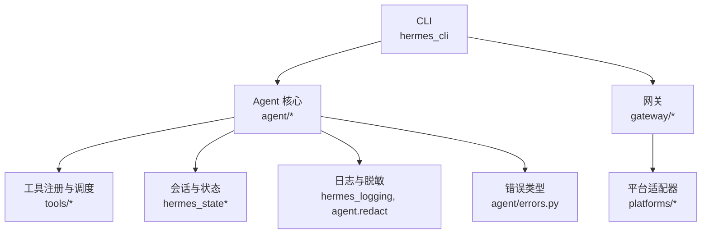
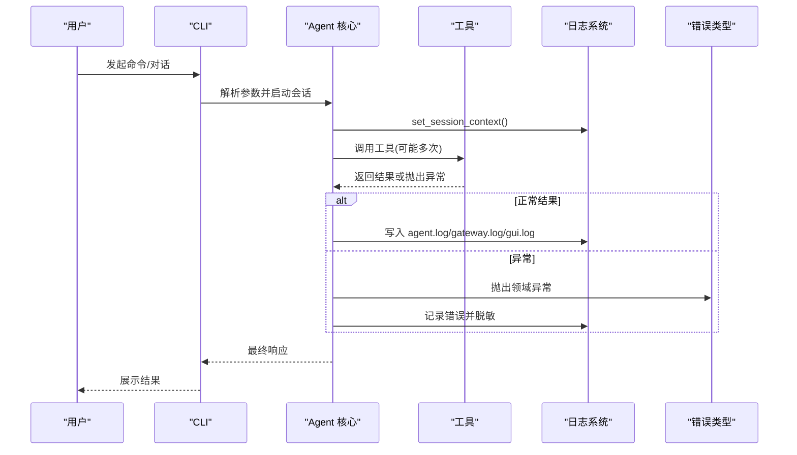
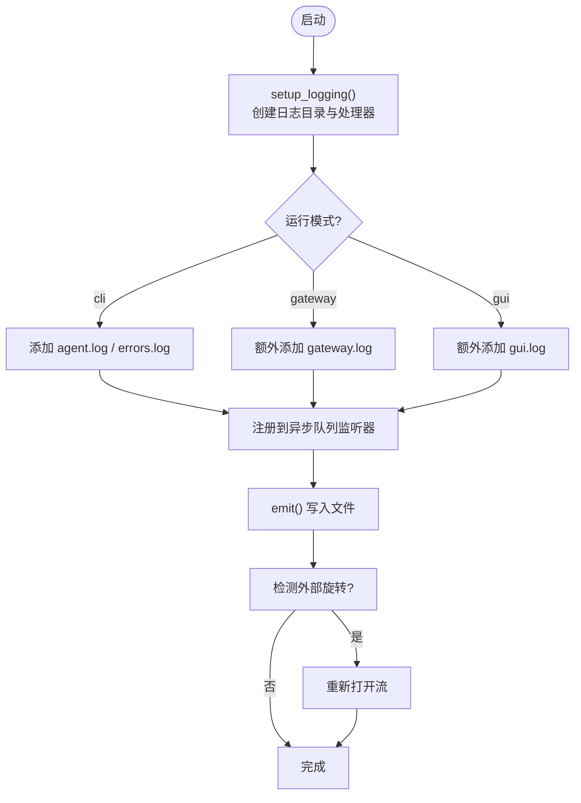
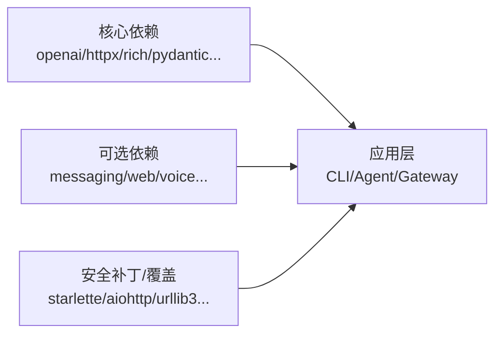

# 编码规范和最佳实践

<cite>
**本文引用的文件**
- [README.md](file://README.md)
- [CONTRIBUTING.md](file://CONTRIBUTING.md)
- [pyproject.toml](file://pyproject.toml)
- [hermes_logging.py](file://hermes_logging.py)
- [agent/errors.py](file://agent/errors.py)
- [tests/tools/test_terminal_error_redaction.py](file://tests/tools/test_terminal_error_redaction.py)
</cite>

## 目录
1. [简介](#简介)
2. [项目结构](#项目结构)
3. [核心组件](#核心组件)
4. [架构总览](#架构总览)
5. [详细组件分析](#详细组件分析)
6. [依赖分析](#依赖分析)
7. [性能考虑](#性能考虑)
8. [故障排查指南](#故障排查指南)
9. [结论](#结论)
10. [附录](#附录)

## 简介
本规范面向 Hermes Agent 的 Python 代码与技能（Skill）开发，目标是建立统一的编码风格、错误处理、输入验证与安全、性能优化、质量检查与重构技巧。文档基于仓库现有实现与约定，提炼出可执行的规则与实践建议，帮助团队在大规模协作中保持一致性与可靠性。

## 项目结构
Hermes Agent 采用多模块、分层组织：CLI、Agent 核心、工具集、网关、技能与插件等。贡献指南明确了“优先修复 Bug → 跨平台兼容 → 安全加固 → 性能与健壮性 → 新技能/工具”的贡献优先级，并给出了代码风格、新增工具/技能的流程与约束。

**章节来源**
- [CONTRIBUTING.md:215-327](file://CONTRIBUTING.md#L215-L327)
- [README.md:217-281](file://README.md#L217-L281)

## 核心组件
- 统一日志子系统：集中式日志配置、按组件分流、会话上下文注入、异步队列落盘、Windows 并发旋转保护、敏感信息脱敏。
- 错误类型定义：领域异常（如 SSL 配置错误、空流错误、预设缺失）用于明确错误语义与捕获策略。
- 测试驱动的安全保障：终端工具输出与错误回溯中的密钥自动脱敏，确保不泄露凭证。

**章节来源**
- [hermes_logging.py:1-28](file://hermes_logging.py#L1-L28)
- [hermes_logging.py:259-376](file://hermes_logging.py#L259-L376)
- [hermes_logging.py:415-548](file://hermes_logging.py#L415-L548)
- [hermes_logging.py:550-760](file://hermes_logging.py#L550-L760)
- [agent/errors.py:1-14](file://agent/errors.py#L1-L14)
- [tests/tools/test_terminal_error_redaction.py:1-154](file://tests/tools/test_terminal_error_redaction.py#L1-L154)

## 架构总览
下图展示 CLI、Agent、工具、网关与日志/错误处理的交互关系，体现“请求进入→会话上下文→工具执行→结果返回→日志记录与脱敏”的主路径。

**图表来源**
- [hermes_logging.py:165-212](file://hermes_logging.py#L165-L212)
- [hermes_logging.py:259-376](file://hermes_logging.py#L259-L376)
- [agent/errors.py:1-14](file://agent/errors.py#L1-L14)

## 详细组件分析

### 日志与脱敏子系统
- 设计要点
  - 单点入口 setup_logging() 负责创建 agent.log、errors.log，以及按模式创建的 gateway.log、gui.log。
  - 通过 QueueListener 将文件 I/O 移出事件循环线程，避免阻塞；Windows 使用并发日志处理器解决重命名冲突。
  - 会话上下文注入：set_session_context/clear_session_context 为每条日志附加会话标签，便于关联追踪。
  - 敏感信息脱敏：所有文件处理器使用 RedactingFormatter，避免密钥落入磁盘。
- 关键流程
  - 初始化阶段读取配置，设置级别、滚动大小与备份数。
  - 对第三方噪声日志器降级至 WARNING。
  - 外部旋转检测：ManagedRotatingFileHandler 在 emit 前 stat 基文件名 inode，必要时重新打开流，防止外部 logrotate 导致写错文件。
  - 退出时安全关闭监听器，避免死锁。

**图表来源**
- [hermes_logging.py:259-376](file://hermes_logging.py#L259-L376)
- [hermes_logging.py:415-548](file://hermes_logging.py#L415-L548)
- [hermes_logging.py:550-760](file://hermes_logging.py#L550-L760)

**章节来源**
- [hermes_logging.py:1-28](file://hermes_logging.py#L1-L28)
- [hermes_logging.py:165-212](file://hermes_logging.py#L165-L212)
- [hermes_logging.py:259-376](file://hermes_logging.py#L259-L376)
- [hermes_logging.py:415-548](file://hermes_logging.py#L415-L548)
- [hermes_logging.py:550-760](file://hermes_logging.py#L550-L760)

### 错误类型与异常处理
- 领域异常
  - SSLConfigurationError：SSL/TLS 证书配置失败。
  - EmptyStreamError：提供者关闭流但未产生响应。
  - MoAPresetNotFoundError：持久化预设不存在。
- 最佳实践
  - 捕获具体异常而非裸 except。
  - 使用 logger.warning()/logger.error() 记录，附带 exc_info=True 以保留堆栈。
  - 对外暴露结构化错误消息，避免泄露内部细节。

**章节来源**
- [agent/errors.py:1-14](file://agent/errors.py#L1-L14)
- [CONTRIBUTING.md:330-336](file://CONTRIBUTING.md#L330-L336)

### 输入验证与安全防护
- 终端工具输出与错误回溯强制脱敏，防止密钥泄漏。
- 跨平台安全注意
  - 禁止使用 os.kill(pid, 0) 做存活探测（Windows 会发送 Ctrl+C）。
  - 使用 shutil.which() 校验外部命令可用性，避免假设 Linux 工具存在。
  - termios/fcntl 仅 Unix，需捕获 ImportError/NotImplementedError。
  - 文件编码处理 UTF-8 BOM 与 cp1252 差异。
  - 进程管理使用 psutil 跨平台。
  - 信号与子进程参数按平台分支。
  - 路径使用 pathlib，避免硬编码分隔符。
  - Windows 符号链接需要管理员权限。
  - 文件权限在 NTFS 上行为不同，需用 ACL 替代 POSIX 模式。
  - 后台守护进程在 Windows 使用 pythonw.exe。

**章节来源**
- [tests/tools/test_terminal_error_redaction.py:1-154](file://tests/tools/test_terminal_error_redaction.py#L1-L154)
- [CONTRIBUTING.md:676-800](file://CONTRIBUTING.md#L676-L800)

### 性能优化建议
- 日志 I/O 异步化：通过 QueueListener 将文件写入移至独立线程，避免阻塞事件循环。
- 日志滚动与外部旋转：ManagedRotatingFileHandler 检测 inode 变化并重新打开流，避免写错文件。
- 依赖最小化：核心依赖精确锁定，可选功能通过 extras 与懒加载减少攻击面与安装体积。
- 网络与 IO 降噪：对高频第三方库默认降级日志级别，降低 I/O 压力。

**章节来源**
- [hermes_logging.py:550-760](file://hermes_logging.py#L550-L760)
- [pyproject.toml:1-155](file://pyproject.toml#L1-L155)

### 代码质量检查与工具
- Ruff：启用预览规则，强制文本文件显式编码（PLW1514），避免 Windows 下因系统编码导致的乱码。
- Ty：类型检查环境配置与规则。
- Pytest：测试标记与集成测试排除，保证 CI 效率。
- 依赖治理：核心依赖精确锁定，可选依赖通过 extras 与懒加载控制；对已知漏洞进行版本上限或覆盖。

**章节来源**
- [pyproject.toml:410-450](file://pyproject.toml#L410-L450)
- [pyproject.toml:1-155](file://pyproject.toml#L1-L155)

### 常见反模式与重构技巧
- 反模式
  - 宽泛捕获异常掩盖真实问题。
  - 直接拼接路径字符串，忽略平台差异。
  - 在事件循环中执行阻塞 I/O。
  - 将敏感信息写入日志或返回给客户端。
- 重构建议
  - 用领域异常替换通用异常，提升可读性与可维护性。
  - 使用 pathlib 与 shutil.which() 增强跨平台健壮性。
  - 将耗时任务放入队列或线程池，保持主循环响应。
  - 统一通过 RedactingFormatter 与工具级脱敏函数处理敏感数据。

[本节为概念性总结，不直接分析具体文件]

## 依赖分析
- 核心依赖精确锁定，降低供应链风险；可选能力通过 extras 按需引入。
- 对已知漏洞进行版本覆盖或限制（例如 Starlette、aiohttp、urllib3、cryptography 等）。
- 构建与发布：setuptools 打包顶层模块，package-data 包含必要资源。

**图表来源**
- [pyproject.toml:1-155](file://pyproject.toml#L1-L155)
- [pyproject.toml:157-352](file://pyproject.toml#L157-L352)

**章节来源**
- [pyproject.toml:1-155](file://pyproject.toml#L1-L155)
- [pyproject.toml:157-352](file://pyproject.toml#L157-L352)

## 性能考虑
- 日志 I/O 非阻塞：QueueListener + QueueHandler 避免事件循环阻塞。
- 日志滚动安全：ManagedRotatingFileHandler 检测外部旋转并重建流，避免静默丢失。
- 依赖瘦身：仅将全局必需包放入 core，其余通过 extras 与懒加载，缩短冷启动与安装时间。
- 网络与第三方库降噪：默认降低高频库日志级别，减少 I/O 与 CPU 开销。

[本节提供通用指导，无需特定文件引用]

## 故障排查指南
- 日志定位
  - 使用 session 上下文标签过滤同一会话的所有日志。
  - 根据运行模式查看对应日志文件：agent.log、errors.log、gateway.log、gui.log。
  - 若出现 Windows 并发日志锁超时，已内置抑制逻辑，不会污染聊天输出。
- 常见问题
  - 终端工具报错含密钥：确认已通过脱敏处理；如需调试，可在本地临时关闭脱敏开关。
  - 日志未滚动或写错文件：检查 ManagedRotatingFileHandler 的 inode 检测与外部旋转场景。
  - 第三方库噪音过多：调整对应 logger 级别至 WARNING。

**章节来源**
- [hermes_logging.py:165-212](file://hermes_logging.py#L165-L212)
- [hermes_logging.py:259-376](file://hermes_logging.py#L259-L376)
- [hermes_logging.py:521-535](file://hermes_logging.py#L521-L535)
- [tests/tools/test_terminal_error_redaction.py:1-154](file://tests/tools/test_terminal_error_redaction.py#L1-L154)

## 结论
本规范以仓库现有实现为依据，总结了日志与脱敏、错误处理、输入验证与安全、性能优化、质量检查与重构的最佳实践。遵循这些规则可显著提升代码一致性、安全性与可维护性，同时降低跨平台与供应链风险。建议在 PR 审查中对照本规范逐项核对，确保变更符合工程标准。

[本节为总结性内容，无需特定文件引用]

## 附录
- 贡献优先级与流程：Bug 修复优先，其次跨平台兼容与安全加固，再是性能与健壮性，最后才是新功能。
- 技能与工具选择：优先以 Skill 表达指令+脚本+工具组合；仅在需要深度集成或二进制/实时流时使用 Tool。
- 平台适配清单：严格遵循跨平台注意事项，避免隐式假设。

**章节来源**
- [CONTRIBUTING.md:7-17](file://CONTRIBUTING.md#L7-L17)
- [CONTRIBUTING.md:39-67](file://CONTRIBUTING.md#L39-L67)
- [CONTRIBUTING.md:676-800](file://CONTRIBUTING.md#L676-L800)