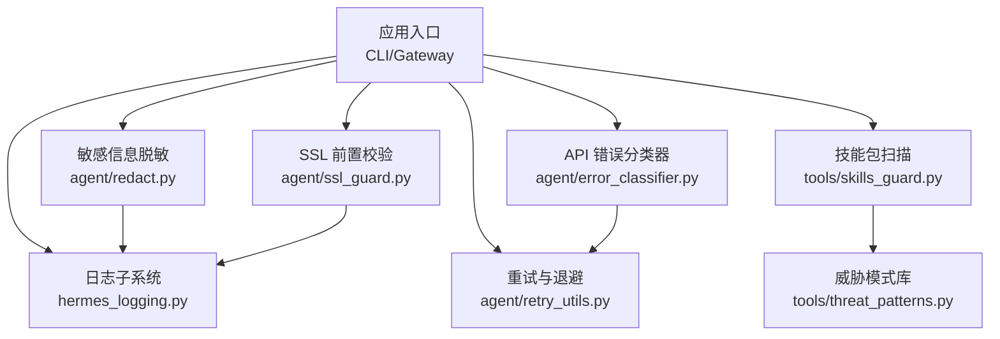
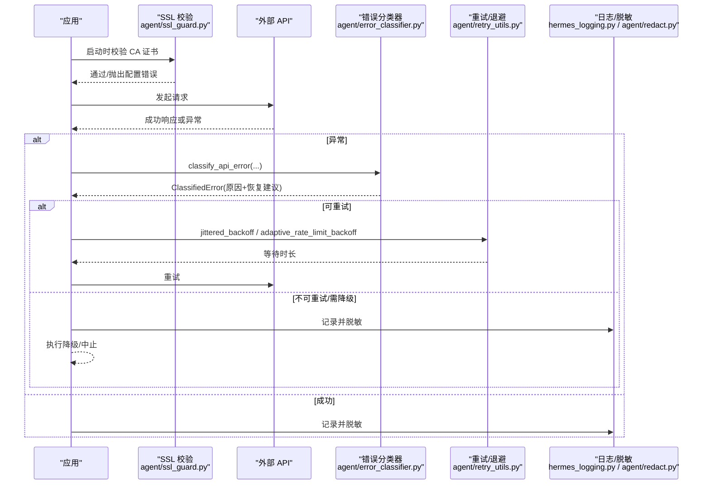
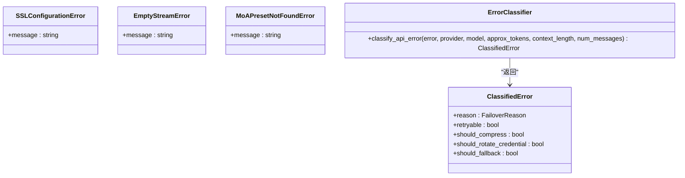
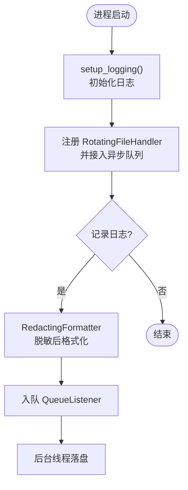
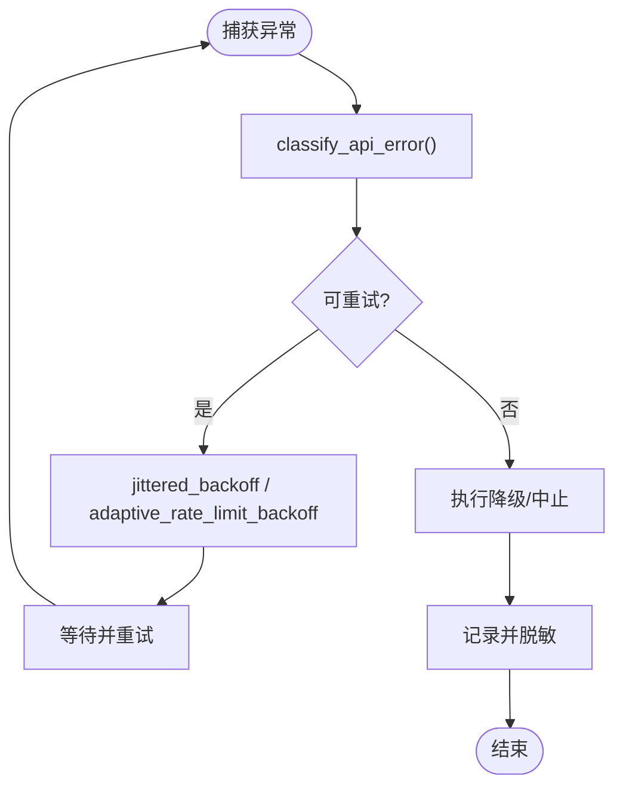
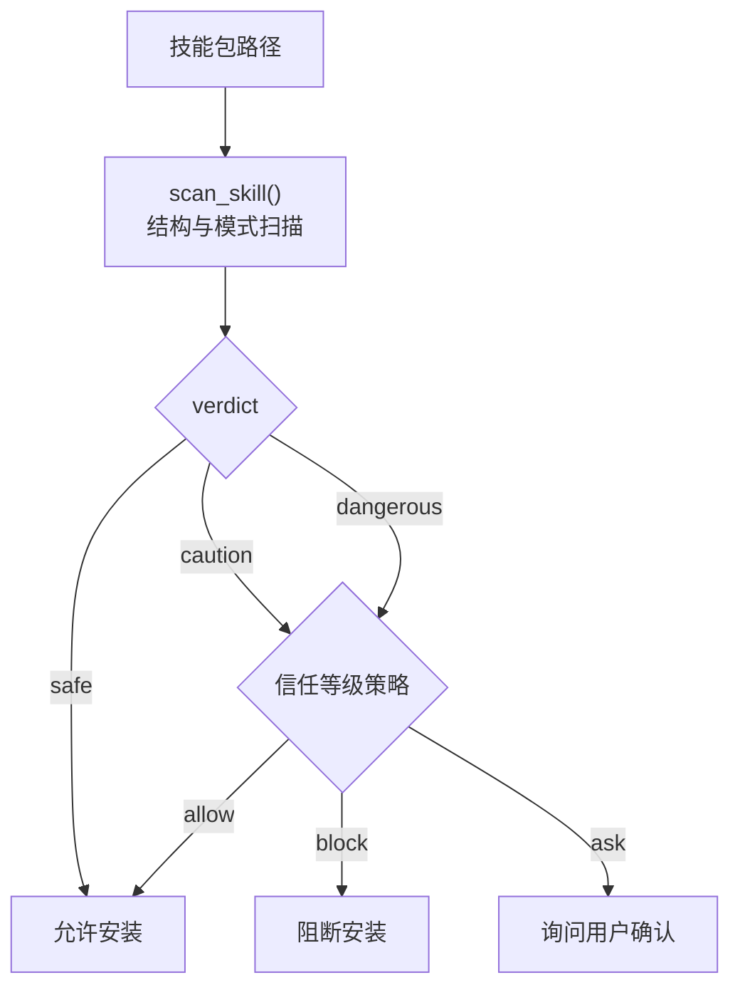
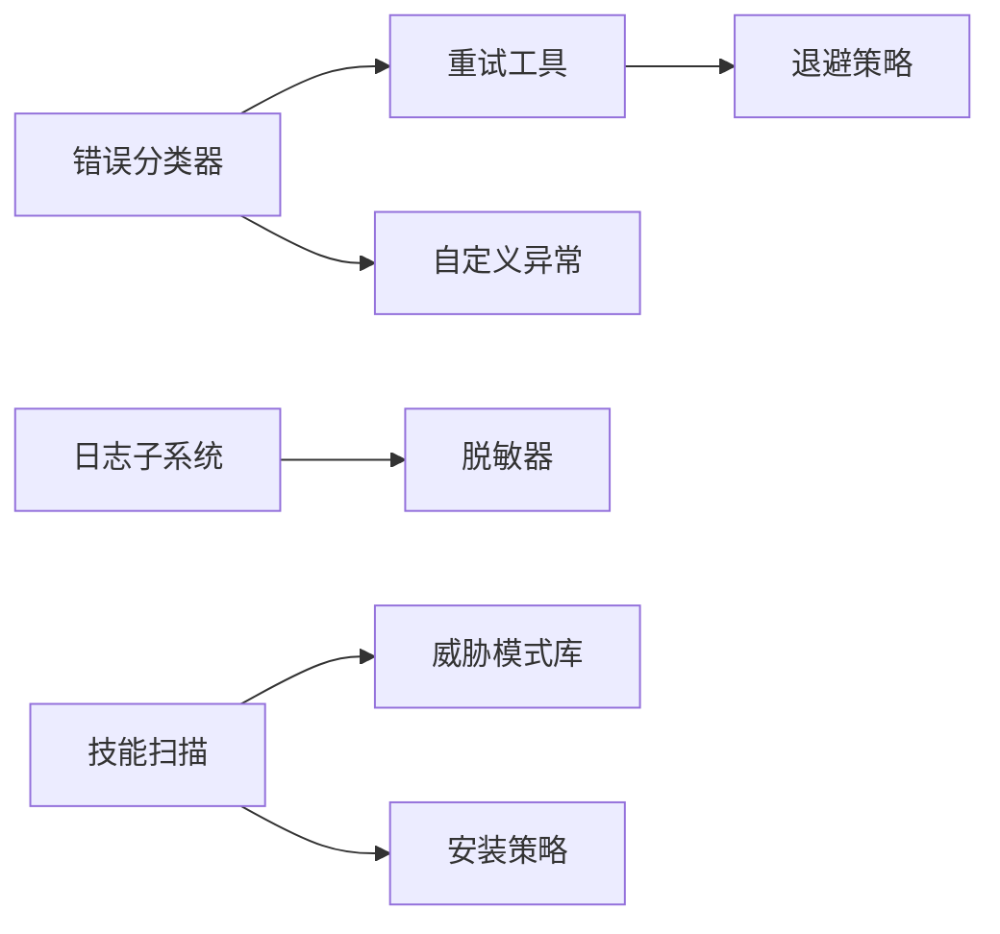

# 错误处理与安全

<cite>
**本文引用的文件**
- [agent/errors.py](file://agent/errors.py)
- [agent/error_classifier.py](file://agent/error_classifier.py)
- [agent/ssl_guard.py](file://agent/ssl_guard.py)
- [hermes_logging.py](file://hermes_logging.py)
- [agent/redact.py](file://agent/redact.py)
- [tools/skills_guard.py](file://tools/skills_guard.py)
- [tools/threat_patterns.py](file://tools/threat_patterns.py)
- [agent/retry_utils.py](file://agent/retry_utils.py)
- [tests/tools/test_terminal_error_redaction.py](file://tests/tools/test_terminal_error_redaction.py)
</cite>

## 目录
1. [简介](#简介)
2. [项目结构](#项目结构)
3. [核心组件](#核心组件)
4. [架构总览](#架构总览)
5. [详细组件分析](#详细组件分析)
6. [依赖关系分析](#依赖关系分析)
7. [性能考量](#性能考量)
8. [故障排查指南](#故障排查指南)
9. [结论](#结论)
10. [附录](#附录)

## 简介
本文件聚焦于错误处理与安全的系统化实现，覆盖以下主题：
- 自定义异常定义、异常传播与处理策略
- 输入验证（参数类型检查、边界值校验、格式校验）
- 安全防护（SQL 注入防护、XSS 防护、路径遍历防护等）
- 日志记录规范（级别选择、敏感信息脱敏、结构化日志）
- 错误恢复与重试机制
- 安全漏洞常见模式与防护措施
- 基于 skills_guard.py 的威胁检测模式，说明如何实现有效的安全扫描与风险评估

## 项目结构
围绕错误与安全的关键模块分布如下：
- 异常与分类：agent/errors.py、agent/error_classifier.py
- SSL/TLS 前置校验：agent/ssl_guard.py
- 日志与脱敏：hermes_logging.py、agent/redact.py
- 技能包安全扫描：tools/skills_guard.py、tools/threat_patterns.py
- 重试与退避：agent/retry_utils.py
- 终端工具输出脱敏测试：tests/tools/test_terminal_error_redaction.py

图表来源
- [hermes_logging.py:259-376](file://hermes_logging.py#L259-L376)
- [agent/ssl_guard.py:68-102](file://agent/ssl_guard.py#L68-L102)
- [agent/error_classifier.py:624-717](file://agent/error_classifier.py#L624-L717)
- [agent/retry_utils.py:90-128](file://agent/retry_utils.py#L90-L128)
- [agent/redact.py:772-800](file://agent/redact.py#L772-L800)
- [tools/skills_guard.py:640-696](file://tools/skills_guard.py#L640-L696)
- [tools/threat_patterns.py:207-255](file://tools/threat_patterns.py#L207-L255)

章节来源
- [hermes_logging.py:259-376](file://hermes_logging.py#L259-L376)
- [agent/ssl_guard.py:68-102](file://agent/ssl_guard.py#L68-L102)
- [agent/error_classifier.py:624-717](file://agent/error_classifier.py#L624-L717)
- [agent/retry_utils.py:90-128](file://agent/retry_utils.py#L90-L128)
- [agent/redact.py:772-800](file://agent/redact.py#L772-L800)
- [tools/skills_guard.py:640-696](file://tools/skills_guard.py#L640-L696)
- [tools/threat_patterns.py:207-255](file://tools/threat_patterns.py#L207-L255)

## 核心组件
- 自定义异常与错误分类
  - 自定义异常：SSL 配置错误、空流错误、预设未找到等
  - 错误分类：将 API 错误映射为可执行的恢复动作（重试、降级、压缩上下文、切换凭据或终止）
- SSL 前置校验
  - 启动前校验 CA 证书链与环境变量指向的证书包是否有效
- 日志与脱敏
  - 统一日志初始化、按组件分流、异步队列落盘、Windows 并发旋转保护
  - 全局敏感信息脱敏（令牌、密钥、URL 凭证、表单体、JSON 字段等）
- 技能包安全扫描
  - 静态规则匹配（数据外泄、提示注入、破坏性命令、持久化、网络隧道、混淆、供应链风险、权限提升、硬编码密钥等）
  - 信任等级与安装策略（内置/可信/社区/代理创建）
- 重试与退避
  - 抖动指数退避、特定供应商过载自适应退避、Retry-After 解析

章节来源
- [agent/errors.py:1-14](file://agent/errors.py#L1-L14)
- [agent/error_classifier.py:24-93](file://agent/error_classifier.py#L24-L93)
- [agent/ssl_guard.py:18-66](file://agent/ssl_guard.py#L18-L66)
- [hermes_logging.py:259-376](file://hermes_logging.py#L259-L376)
- [agent/redact.py:772-800](file://agent/redact.py#L772-L800)
- [tools/skills_guard.py:55-67](file://tools/skills_guard.py#L55-L67)
- [agent/retry_utils.py:38-128](file://agent/retry_utils.py#L38-L128)

## 架构总览
下图展示一次 API 调用从发起、错误分类、重试到日志与脱敏的整体流程。

图表来源
- [agent/ssl_guard.py:68-102](file://agent/ssl_guard.py#L68-L102)
- [agent/error_classifier.py:624-717](file://agent/error_classifier.py#L624-L717)
- [agent/retry_utils.py:90-128](file://agent/retry_utils.py#L90-L128)
- [hermes_logging.py:259-376](file://hermes_logging.py#L259-L376)
- [agent/redact.py:772-800](file://agent/redact.py#L772-L800)

## 详细组件分析

### 异常体系与传播
- 自定义异常
  - SSLConfigurationError：用于在 CA 证书配置错误时提供一致且可操作的错误消息
  - EmptyStreamError：当上游提供者关闭流但未产出响应时抛出
  - MoAPresetNotFoundError：当配置的预设不存在时抛出
- 传播策略
  - 在 SSL 前置校验阶段直接抛出，阻止后续网络调用
  - 在 API 层由错误分类器统一归类，上层根据恢复建议决定重试、降级或终止

图表来源
- [agent/errors.py:1-14](file://agent/errors.py#L1-L14)
- [agent/error_classifier.py:77-93](file://agent/error_classifier.py#L77-L93)

章节来源
- [agent/errors.py:1-14](file://agent/errors.py#L1-L14)
- [agent/error_classifier.py:77-93](file://agent/error_classifier.py#L77-L93)

### 输入验证与边界检查
- 参数类型与边界
  - 错误分类器接收近似 token 数、上下文长度、消息数量等，用于判断上下文溢出、图片过大、负载过大等场景
  - 重试工具对 attempt 进行幂等计算，避免指数爆炸；对 base_delay/max_delay/jitter_ratio 做合理约束
- 格式校验
  - 日志格式化使用固定模板，确保 session_tag 始终存在
  - 脱敏器对 URL、表单体、JSON 字段、授权头等进行严格匹配，避免误伤正常文本

章节来源
- [agent/error_classifier.py:624-717](file://agent/error_classifier.py#L624-L717)
- [agent/retry_utils.py:90-128](file://agent/retry_utils.py#L90-L128)
- [hermes_logging.py:165-207](file://hermes_logging.py#L165-L207)
- [agent/redact.py:772-800](file://agent/redact.py#L772-L800)

### 安全防护措施
- SQL 注入防护
  - 代码库中未发现直接使用 SQL 拼接的场景；若涉及数据库操作，应遵循“参数化查询”和“最小权限原则”，并在日志中脱敏连接串
- XSS 防护
  - 前端/渲染侧应启用内容安全策略（CSP）、输出编码与 DOMPurify 类清洗；后端不直接回显用户可控 HTML
- 路径遍历防护
  - 技能扫描包含路径遍历模式（如 ../ 多级上跳），在安装前拦截危险行为
- 其他关键防护
  - SSL 前置校验：防止因证书链损坏导致的静默失败
  - 敏感信息脱敏：令牌、密钥、URL 凭证、表单体、JSON 字段、授权头等全面覆盖
  - 技能包扫描：覆盖数据外泄、提示注入、破坏性命令、持久化、网络隧道、混淆、供应链风险、权限提升、硬编码密钥等

章节来源
- [tools/skills_guard.py:101-524](file://tools/skills_guard.py#L101-L524)
- [tools/threat_patterns.py:63-135](file://tools/threat_patterns.py#L63-L135)
- [agent/ssl_guard.py:68-102](file://agent/ssl_guard.py#L68-L102)
- [agent/redact.py:772-800](file://agent/redact.py#L772-L800)

### 日志记录规范
- 日志级别选择
  - 默认 INFO，errors.log 仅记录 WARNING+，便于快速定位问题
- 敏感信息脱敏
  - 所有文件处理器均使用 RedactingFormatter，确保密钥、令牌、URL 凭证等不会落盘
- 结构化日志
  - 统一模板包含时间戳、级别、会话标签、logger 名称与消息
  - 支持按组件分流（gateway.log、gui.log），便于隔离排查
- 并发与可靠性
  - Windows 下使用并发旋转处理器避免锁竞争
  - 异步队列写入，避免阻塞事件循环

图表来源
- [hermes_logging.py:259-376](file://hermes_logging.py#L259-L376)
- [hermes_logging.py:575-644](file://hermes_logging.py#L575-L644)

章节来源
- [hermes_logging.py:259-376](file://hermes_logging.py#L259-L376)
- [hermes_logging.py:575-644](file://hermes_logging.py#L575-L644)

### 错误恢复与重试机制
- 分类驱动恢复
  - 认证失败、计费耗尽、速率限制、服务器过载、上下文溢出、模型不存在、内容策略拒绝等均有明确恢复建议
- 退避策略
  - 抖动指数退避，避免雪崩效应
  - 针对特定供应商（如 Z.AI Coding Plan）的自适应长退避表
- Retry-After 支持
  - 解析 HTTP 头部中的 Retry-After，尊重服务端限流指示

图表来源
- [agent/error_classifier.py:624-717](file://agent/error_classifier.py#L624-L717)
- [agent/retry_utils.py:90-128](file://agent/retry_utils.py#L90-L128)
- [agent/retry_utils.py:162-191](file://agent/retry_utils.py#L162-L191)

章节来源
- [agent/error_classifier.py:624-717](file://agent/error_classifier.py#L624-L717)
- [agent/retry_utils.py:90-128](file://agent/retry_utils.py#L90-L128)
- [agent/retry_utils.py:162-191](file://agent/retry_utils.py#L162-L191)

### 安全扫描与风险评估（skills_guard 模式）
- 扫描范围
  - 结构检查（文件数量、总大小、二进制文件、符号链接）
  - 正则模式匹配（数据外泄、提示注入、破坏性命令、持久化、网络隧道、混淆、供应链风险、权限提升、硬编码密钥等）
  - 不可见 Unicode 字符检测
- 信任等级与策略
  - 内置/可信/社区/代理创建，不同等级对应不同的允许/阻断策略
- 缓存与溯源
  - 基于内容哈希的缓存与审计溯源，保证结果可复现

图表来源
- [tools/skills_guard.py:640-696](file://tools/skills_guard.py#L640-L696)
- [tools/skills_guard.py:55-67](file://tools/skills_guard.py#L55-L67)
- [tools/skills_guard.py:774-800](file://tools/skills_guard.py#L774-L800)

章节来源
- [tools/skills_guard.py:640-696](file://tools/skills_guard.py#L640-L696)
- [tools/skills_guard.py:55-67](file://tools/skills_guard.py#L55-L67)
- [tools/skills_guard.py:774-800](file://tools/skills_guard.py#L774-L800)

### 概念总览
- 错误处理与安全是一个贯穿系统全生命周期的横切关注点：从启动时的 SSL 校验，到运行时的错误分类与重试，再到输出端的日志与脱敏，以及外部资源（技能包）的安全扫描与风险评估
- 通过集中化的错误分类与统一的脱敏/日志框架，降低分散实现的维护成本，提高一致性与可观测性

[本节为概念性总结，不直接分析具体文件]

## 依赖关系分析
- 模块耦合
  - 错误分类器依赖异常类型与错误消息提取逻辑
  - 重试工具与分类器协作，依据分类结果选择退避策略
  - 日志与脱敏被广泛引用，作为通用基础设施
  - 技能扫描依赖威胁模式库，形成规则中心
- 外部依赖
  - SSL 校验依赖 certifi 与系统信任存储
  - 日志在 Windows 下依赖并发旋转处理器以避免锁竞争

图表来源
- [agent/error_classifier.py:624-717](file://agent/error_classifier.py#L624-L717)
- [agent/retry_utils.py:90-128](file://agent/retry_utils.py#L90-L128)
- [hermes_logging.py:259-376](file://hermes_logging.py#L259-L376)
- [agent/redact.py:772-800](file://agent/redact.py#L772-L800)
- [tools/skills_guard.py:640-696](file://tools/skills_guard.py#L640-L696)
- [tools/threat_patterns.py:207-255](file://tools/threat_patterns.py#L207-L255)

章节来源
- [agent/error_classifier.py:624-717](file://agent/error_classifier.py#L624-L717)
- [agent/retry_utils.py:90-128](file://agent/retry_utils.py#L90-L128)
- [hermes_logging.py:259-376](file://hermes_logging.py#L259-L376)
- [agent/redact.py:772-800](file://agent/redact.py#L772-L800)
- [tools/skills_guard.py:640-696](file://tools/skills_guard.py#L640-L696)
- [tools/threat_patterns.py:207-255](file://tools/threat_patterns.py#L207-L255)

## 性能考量
- 日志写入采用异步队列，避免阻塞事件循环与跨进程旋转锁
- 脱敏器使用预编译的正则与高效匹配策略，控制回溯深度，避免长文本下的性能退化
- 重试退避引入抖动，减少并发重试风暴；针对特定供应商的自适应退避表提升用户体验
- 技能扫描限制最大扫描字符数，避免恶意大文本导致长时间匹配

章节来源
- [hermes_logging.py:575-644](file://hermes_logging.py#L575-L644)
- [agent/redact.py:772-800](file://agent/redact.py#L772-L800)
- [agent/retry_utils.py:90-128](file://agent/retry_utils.py#L90-L128)
- [tools/threat_patterns.py:49-53](file://tools/threat_patterns.py#L49-L53)

## 故障排查指南
- SSL 配置错误
  - 现象：启动时报错，提示证书缺失或无法加载
  - 处理：运行修复命令或手动重装证书包；检查环境变量指向的证书路径
- 终端工具错误泄露
  - 现象：错误消息或堆栈中包含密钥片段
  - 处理：确认脱敏器已启用；检查输出字段是否经过 redact_sensitive_text
- 日志丢失或权限问题
  - 现象：Windows 下日志旋转失败或权限不足
  - 处理：使用并发旋转处理器；检查托管模式下文件权限设置
- 技能包安装被阻断
  - 现象：扫描结果为 caution/dangerous，安装被阻止
  - 处理：查看扫描报告，调整技能内容或信任等级；必要时强制安装并记录审计

章节来源
- [agent/ssl_guard.py:68-102](file://agent/ssl_guard.py#L68-L102)
- [tests/tools/test_terminal_error_redaction.py:47-154](file://tests/tools/test_terminal_error_redaction.py#L47-L154)
- [hermes_logging.py:415-548](file://hermes_logging.py#L415-L548)
- [tools/skills_guard.py:774-800](file://tools/skills_guard.py#L774-L800)

## 结论
本仓库在错误处理与安全方面形成了闭环：
- 启动前进行 SSL 前置校验，尽早暴露配置问题
- 运行时通过集中式错误分类器指导恢复策略，结合抖动与自适应退避提升稳定性
- 日志与脱敏贯穿全流程，确保可观测性与安全性
- 对外部资源（技能包）实施严格的静态扫描与信任策略，防范注入、外泄、破坏性操作等风险
- 通过测试覆盖关键路径（如终端错误脱敏），保障实现正确性

[本节为总结性内容，不直接分析具体文件]

## 附录
- 常见安全漏洞模式与防护要点
  - SQL 注入：使用参数化查询，避免字符串拼接；对数据库连接串进行脱敏
  - XSS：启用 CSP、输出编码、DOM 清洗；后端不直接回显用户可控 HTML
  - 路径遍历：限制文件访问白名单，校验相对路径，禁止多级上跳
  - 提示注入：在上下文装配与工具结果中应用威胁模式扫描，阻断危险指令
  - 数据外泄：扫描 shell/HTTP/脚本中的密钥插值与读取敏感文件的行为
  - 供应链风险：锁定依赖版本，避免运行时动态拉取未签名资源
  - 权限提升：检测 sudo、setuid/setgid、NOPASSWD 等高危行为
  - 硬编码密钥：识别常见密钥前缀与私钥块，阻断含密文的内容

[本节为概念性补充，不直接分析具体文件]