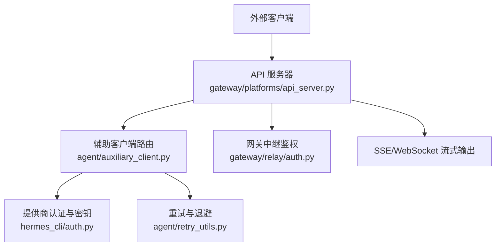
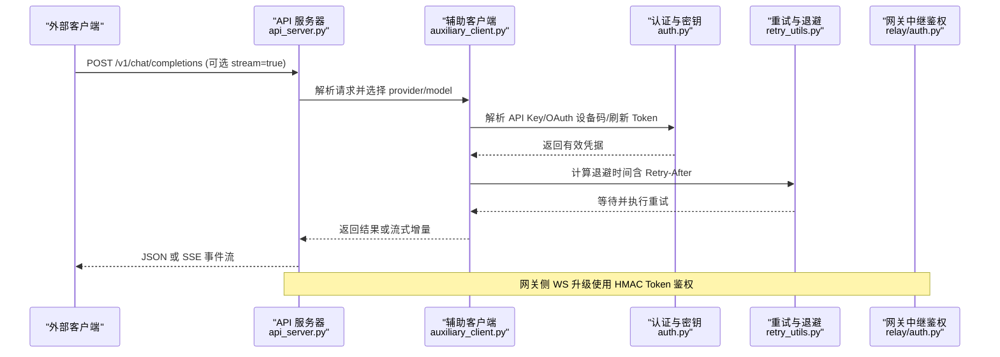
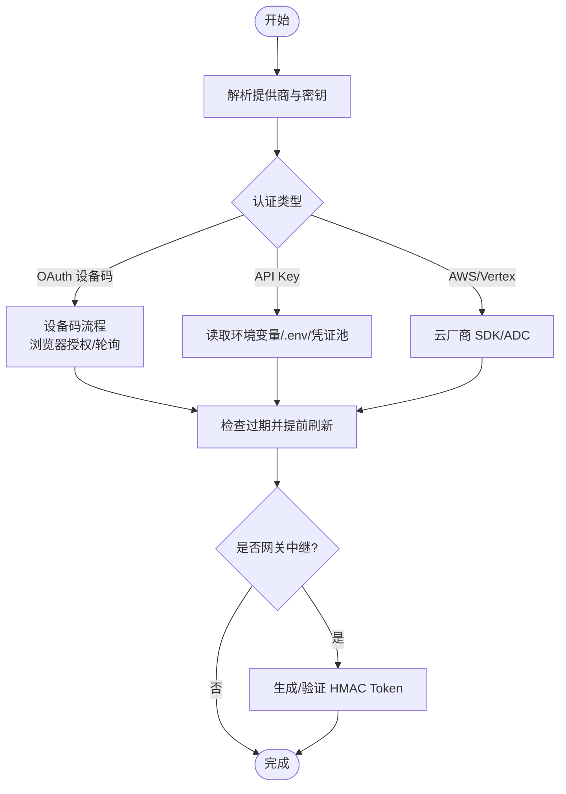
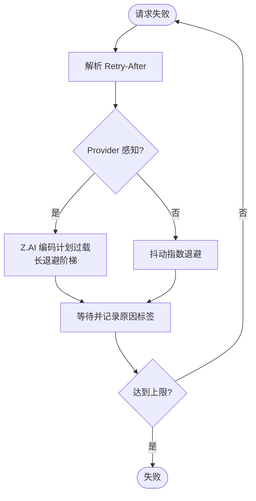
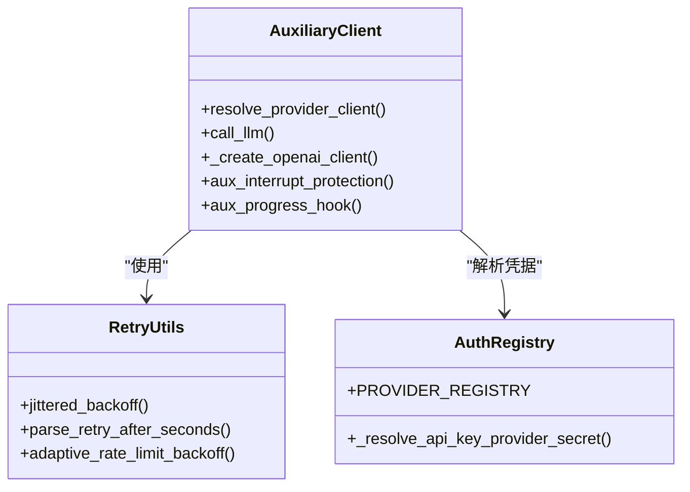
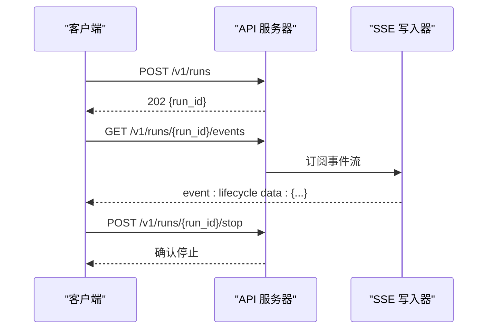
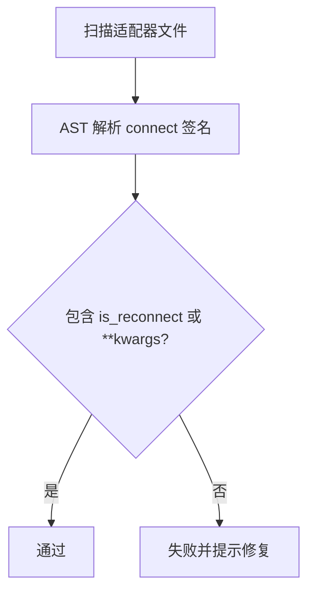
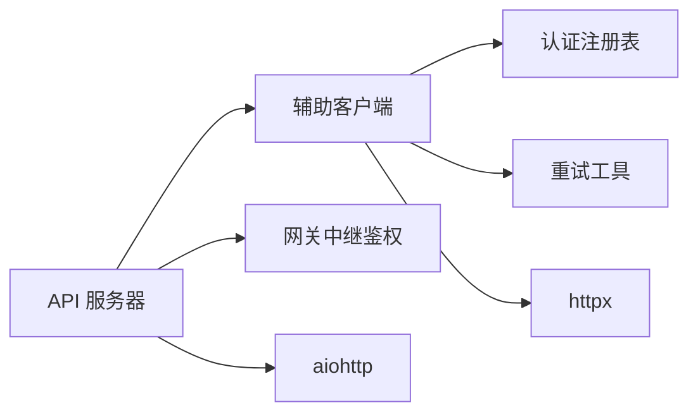

# API 集成

<cite>
**本文引用的文件**
- [agent/retry_utils.py](file://agent/retry_utils.py)
- [hermes_cli/auth.py](file://hermes_cli/auth.py)
- [gateway/relay/auth.py](file://gateway/relay/auth.py)
- [agent/auxiliary_client.py](file://agent/auxiliary_client.py)
- [gateway/platforms/api_server.py](file://gateway/platforms/api_server.py)
- [tests/gateway/test_adapter_connect_is_reconnect_contract.py](file://tests/gateway/test_adapter_connect_is_reconnect_contract.py)
</cite>

## 目录
1. [简介](#简介)
2. [项目结构](#项目结构)
3. [核心组件](#核心组件)
4. [架构总览](#架构总览)
5. [详细组件分析](#详细组件分析)
6. [依赖关系分析](#依赖关系分析)
7. [性能考量](#性能考量)
8. [故障排查指南](#故障排查指南)
9. [结论](#结论)
10. [附录：API 调用与最佳实践](#附录api-调用与最佳实践)

## 简介
本文件面向需要在 Hermes Agent 中集成 RESTful API、认证（OAuth 2.0、API Key）、异步流式通信（SSE/WebSocket）以及限流重试机制的开发者。文档基于仓库中的实现，系统梳理了：
- REST 接口与请求构建、响应处理、错误处理
- 认证机制：多提供者 OAuth 设备码流程、API Key 解析与刷新、网关中继 HMAC 签名
- 异步 API：SSE 事件流、WebSocket 升级鉴权
- 限流与重试：抖动退避、Provider 感知策略、Z.AI 编码计划过载适配
- 客户端封装与复用：辅助客户端路由、OpenAI 兼容服务器适配器
- 完整示例与最佳实践：GitHub Copilot 令牌、API Key 安全存储、请求重试策略

## 项目结构
围绕 API 集成的关键目录与职责：
- hermes_cli/auth.py：多提供者认证注册表、API Key/OAuth 设备码流程、Token 刷新策略
- agent/retry_utils.py：通用重试工具（抖动退避、Retry-After 解析、Provider 感知退避）
- gateway/relay/auth.py：网关与连接器之间的 HMAC 鉴权（WS 升级 Token、入站投递签名）
- agent/auxiliary_client.py：辅助任务统一客户端路由（自动回退链、OpenAI 兼容客户端构造）
- gateway/platforms/api_server.py：OpenAI 兼容 HTTP 服务器（Chat Completions、Responses、SSE、Runs 事件流）
- tests/gateway/test_adapter_connect_is_reconnect_contract.py：平台适配器连接契约校验（is_reconnect 参数）

**图表来源**
- [gateway/platforms/api_server.py:1-120](file://gateway/platforms/api_server.py#L1-L120)
- [agent/auxiliary_client.py:1-120](file://agent/auxiliary_client.py#L1-L120)
- [hermes_cli/auth.py:190-507](file://hermes_cli/auth.py#L190-L507)
- [agent/retry_utils.py:1-129](file://agent/retry_utils.py#L1-L129)
- [gateway/relay/auth.py:1-169](file://gateway/relay/auth.py#L1-L169)

**章节来源**
- [gateway/platforms/api_server.py:1-120](file://gateway/platforms/api_server.py#L1-L120)
- [agent/auxiliary_client.py:1-120](file://agent/auxiliary_client.py#L1-L120)
- [hermes_cli/auth.py:190-507](file://hermes_cli/auth.py#L190-L507)
- [agent/retry_utils.py:1-129](file://agent/retry_utils.py#L1-L129)
- [gateway/relay/auth.py:1-169](file://gateway/relay/auth.py#L1-L169)

## 核心组件
- 认证与密钥管理
  - 多提供者注册表与 API Key/OAuth 设备码流程
  - Token 刷新与过期前偏移（Skew）控制
  - 网关中继 HMAC 签名与升级 Token
- 重试与限流
  - 抖动指数退避，避免“惊群”重试
  - Retry-After 头解析与 Provider 感知退避（如 Z.AI 编码计划过载）
- 辅助客户端路由
  - 自动回退链（主提供者 → OpenRouter → Nous Portal → 自定义端点 → 原生 Anthropic → 直连 API Key 提供商）
  - 禁用 SDK 内部重试，由 Hermes 统一预算控制
- OpenAI 兼容 API 服务器
  - Chat Completions、Responses、Runs 事件流（SSE）
  - SSE 帧序列化、布尔值规范化、内容归一化
  - 会话与运行生命周期管理

**章节来源**
- [hermes_cli/auth.py:190-507](file://hermes_cli/auth.py#L190-L507)
- [agent/retry_utils.py:38-129](file://agent/retry_utils.py#L38-L129)
- [agent/auxiliary_client.py:1-120](file://agent/auxiliary_client.py#L1-L120)
- [gateway/platforms/api_server.py:187-244](file://gateway/platforms/api_server.py#L187-L244)

## 架构总览
Hermes 的 API 集成以“认证—路由—重试—流式输出”为主线：
- 外部客户端通过 OpenAI 兼容服务器访问聊天/响应/运行接口
- 辅助客户端根据配置与可用凭据选择后端，必要时触发 OAuth 或 API Key 解析
- 所有出站请求使用统一的抖动退避与 Provider 感知策略
- 流式输出通过 SSE 推送；网关与连接器之间使用 HMAC 鉴权保障通道安全

**图表来源**
- [gateway/platforms/api_server.py:187-244](file://gateway/platforms/api_server.py#L187-L244)
- [agent/auxiliary_client.py:1-120](file://agent/auxiliary_client.py#L1-L120)
- [hermes_cli/auth.py:190-507](file://hermes_cli/auth.py#L190-L507)
- [agent/retry_utils.py:38-129](file://agent/retry_utils.py#L38-L129)
- [gateway/relay/auth.py:83-134](file://gateway/relay/auth.py#L83-L134)

## 详细组件分析

### 认证与密钥管理（OAuth 2.0、API Key、Token 刷新）
- 多提供者注册表
  - 支持多种 auth_type：oauth_device_code、oauth_external、api_key、aws_sdk、vertex 等
  - 每个 ProviderConfig 定义 base_url、scope、client_id、环境变量键名
- API Key 解析优先级
  - 优先 ~/.hermes/.env，其次进程环境；对特定提供商（如 Copilot）走专用验证模块
  - 可回退到凭证池（credential pool）获取运行时密钥
- Token 刷新策略
  - 各提供商定义了 ACCESS_TOKEN_REFRESH_SKEW_SECONDS，提前刷新以避免窗口期抖动
  - 针对短生命周期 Token（如 xAI/Grok），扩大刷新窗口以减少静默失效
- 网关中继 HMAC 鉴权
  - WS 升级 Token：payload=gateway_id，带 TTL，base64url 编码
  - 入站投递签名：x-relay-timestamp + x-relay-signature，防重放窗口校验

**图表来源**
- [hermes_cli/auth.py:190-507](file://hermes_cli/auth.py#L190-L507)
- [gateway/relay/auth.py:83-134](file://gateway/relay/auth.py#L83-L134)

**章节来源**
- [hermes_cli/auth.py:190-507](file://hermes_cli/auth.py#L190-L507)
- [gateway/relay/auth.py:1-169](file://gateway/relay/auth.py#L1-L169)

### 重试与限流（抖动退避、Provider 感知、Retry-After）
- 抖动指数退避
  - jittered_backoff：按尝试次数指数增长，叠加随机抖动，避免并发“惊群”
  - 种子来自时间与进程内单调计数器，确保去相关
- Retry-After 解析
  - parse_retry_after_seconds：支持数值、HTTP-date、头部映射，负值钳制为 0
- Provider 感知退避
  - adaptive_rate_limit_backoff：对 Z.AI 编码计划 GLM-5.2 过载 429 采用长退避阶梯（30/60/90/120s）
  - zai_coding_overload_retry_ceiling：保证长退避序列可达
- 重试上限与日志
  - 短尝试数与长退避阶段分离，避免过早放弃或无限重试

**图表来源**
- [agent/retry_utils.py:38-129](file://agent/retry_utils.py#L38-L129)
- [agent/retry_utils.py:142-209](file://agent/retry_utils.py#L142-L209)

**章节来源**
- [agent/retry_utils.py:38-129](file://agent/retry_utils.py#L38-L129)
- [agent/retry_utils.py:142-209](file://agent/retry_utils.py#L142-L209)

### 辅助客户端路由（自动回退链、OpenAI 兼容）
- 自动回退链（文本任务）
  - 主提供者 → OpenRouter → Nous Portal → 自定义端点 → 原生 Anthropic → 直连 API Key 提供商
- 视觉/多模态任务
  - 首选主提供者的视觉后端，否则回退至 OpenRouter/Nous/Anthropic/自定义端点
- OpenAI 客户端构造
  - 禁用 SDK 内部重试，统一由 Hermes 控制预算；注入 keepalive httpx 客户端
  - TLS 验证解析：支持 per-provider ssl_ca_cert/ssl_verify 与环境变量约定
- 中断保护与进度钩子
  - 压缩等原子任务可标记为中断保护，防止中途取消导致降级
  - 流式消费时安装进度钩子，延长超时阈值

**图表来源**
- [agent/auxiliary_client.py:1-120](file://agent/auxiliary_client.py#L1-L120)
- [agent/retry_utils.py:38-129](file://agent/retry_utils.py#L38-L129)
- [hermes_cli/auth.py:630-671](file://hermes_cli/auth.py#L630-L671)

**章节来源**
- [agent/auxiliary_client.py:1-120](file://agent/auxiliary_client.py#L1-L120)
- [hermes_cli/auth.py:630-671](file://hermes_cli/auth.py#L630-L671)

### OpenAI 兼容 API 服务器（REST/SSE/Runs）
- 暴露端点
  - /v1/chat/completions、/v1/responses、/v1/models、/v1/capabilities
  - /api/sessions（CRUD）、/api/sessions/{id}/messages、/api/sessions/{id}/fork
  - /v1/runs（启动、状态、事件流 SSE）、/v1/runs/{id}/approval、/v1/runs/{id}/stop
- 流式输出
  - _sse_frame：统一 SSE 帧序列化（event/data），保持字节一致性
  - 布尔值规范化：兼容字符串形式的 stream/true/false
- 内容归一化
  - 文本数组扁平化、图像 URL 校验（http(s)/data:image）、文件部分拒绝
- 会话与运行生命周期
  - 进程回收与所有权标记，避免断开后遗留后台进程泄漏

**图表来源**
- [gateway/platforms/api_server.py:1-120](file://gateway/platforms/api_server.py#L1-L120)
- [gateway/platforms/api_server.py:187-244](file://gateway/platforms/api_server.py#L187-L244)

**章节来源**
- [gateway/platforms/api_server.py:1-120](file://gateway/platforms/api_server.py#L1-L120)
- [gateway/platforms/api_server.py:187-244](file://gateway/platforms/api_server.py#L187-L244)

### 平台适配器连接契约（is_reconnect）
- 测试约束
  - 所有平台适配器的 connect() 必须接受 is_reconnect 关键字参数
  - 网关重连监视器在每次重试时转发 is_reconnect=True，缺失将导致静默断连
- 静态 AST 校验
  - 扫描 gateway/platforms 与 plugins/platforms 下的 adapter 文件
  - 若 connect() 未声明 is_reconnect 或未用 **kwargs 吸收，则测试失败

**图表来源**
- [tests/gateway/test_adapter_connect_is_reconnect_contract.py:1-145](file://tests/gateway/test_adapter_connect_is_reconnect_contract.py#L1-L145)

**章节来源**
- [tests/gateway/test_adapter_connect_is_reconnect_contract.py:1-145](file://tests/gateway/test_adapter_connect_is_reconnect_contract.py#L1-L145)

## 依赖关系分析
- 组件耦合
  - API 服务器依赖辅助客户端进行 LLM 调用；辅助客户端依赖认证注册表与重试工具
  - 网关中继鉴权独立于业务逻辑，仅负责通道安全
- 外部依赖
  - httpx 用于 HTTP 请求与 keepalive 客户端
  - aiohttp 用于 API 服务器（可选导入）
  - 各提供商 SDK（OpenAI、Anthropic 等）通过代理延迟加载，减少冷启动开销

**图表来源**
- [agent/auxiliary_client.py:172-221](file://agent/auxiliary_client.py#L172-L221)
- [gateway/platforms/api_server.py:79-84](file://gateway/platforms/api_server.py#L79-L84)
- [gateway/relay/auth.py:1-169](file://gateway/relay/auth.py#L1-L169)

**章节来源**
- [agent/auxiliary_client.py:172-221](file://agent/auxiliary_client.py#L172-L221)
- [gateway/platforms/api_server.py:79-84](file://gateway/platforms/api_server.py#L79-L84)
- [gateway/relay/auth.py:1-169](file://gateway/relay/auth.py#L1-L169)

## 性能考量
- 抖动退避降低并发重试风暴，提升整体稳定性
- 禁用 SDK 内部重试，避免慢端点放大超时（例如 120s × 3 次 = 360s）
- SSE 帧序列化集中管理，减少重复代码与不一致性
- 流式进度钩子延长超时阈值，避免慢模型被误杀
- 内容归一化限制递归深度与长度，防止恶意输入导致资源耗尽

[本节为通用指导，不直接分析具体文件]

## 故障排查指南
- 认证失败
  - 检查 PROVIDER_REGISTRY 中对应提供商的 api_key_env_vars 是否正确设置
  - 对于 OAuth 设备码流程，确认浏览器授权与轮询间隔合理
  - 网关中继 HMAC 签名失败：核对 x-relay-timestamp 与 x-relay-signature，检查重放窗口
- 重试与限流
  - 观察 Retry-After 头是否被正确解析；若为 HTTP-date，确认时区与计算
  - Z.AI 编码计划过载：确认 base_url 与 model 匹配，启用长退避阶梯
- 流式输出异常
  - SSE 帧格式错误：检查 _sse_frame 的使用与 ensure_ascii 参数
  - 布尔值传参问题：确保 stream 等字段为真实布尔或显式字符串
- 适配器连接
  - 若平台适配器 connect() 缺少 is_reconnect，重连后将静默失败；参考测试约束修复

**章节来源**
- [hermes_cli/auth.py:190-507](file://hermes_cli/auth.py#L190-L507)
- [gateway/relay/auth.py:142-169](file://gateway/relay/auth.py#L142-L169)
- [agent/retry_utils.py:38-129](file://agent/retry_utils.py#L38-L129)
- [gateway/platforms/api_server.py:187-244](file://gateway/platforms/api_server.py#L187-L244)
- [tests/gateway/test_adapter_connect_is_reconnect_contract.py:1-145](file://tests/gateway/test_adapter_connect_is_reconnect_contract.py#L1-L145)

## 结论
Hermes Agent 的 API 集成提供了企业级的认证、重试、流式输出与网关安全能力。通过统一的认证注册表、抖动退避与 Provider 感知策略、OpenAI 兼容服务器与辅助客户端路由，开发者可以稳定地对接多种后端与服务。建议在生产环境中：
- 严格管理 API Key 与 OAuth 凭据，使用 .env 与凭证池
- 启用重试与限流策略，关注 Retry-After 与 Provider 特定行为
- 使用 SSE/WebSocket 进行实时交互，并确保网关中继鉴权正确配置
- 遵循平台适配器连接契约，避免重连失败

[本节为总结，不直接分析具体文件]

## 附录：API 调用与最佳实践
- REST 调用
  - 构建请求：使用 OpenAI 兼容格式（chat/completions、responses）
  - 响应处理：区分 JSON 与 SSE 流；解析事件类型与数据体
  - 错误处理：捕获 4xx/5xx，结合 Retry-After 与抖动退避重试
- 认证机制
  - OAuth 2.0 设备码：适用于 Nous Portal、MiniMax 等；注意轮询间隔与过期处理
  - API Key 管理：优先 ~/.hermes/.env，其次环境变量；敏感信息不落盘
  - Token 刷新：利用 Skew 提前刷新，避免窗口期抖动
- 异步 API
  - SSE：订阅 /v1/runs/{id}/events，处理结构化生命周期事件
  - WebSocket：网关中继 WS 升级使用 HMAC Token；入站投递需签名校验
- 限流与重试
  - 使用 jittered_backoff 与 adaptive_rate_limit_backoff；关注 Z.AI 过载场景
  - 合理设置最大重试次数与超时，避免长时间阻塞
- 客户端封装与复用
  - 通过辅助客户端路由统一调用；禁用 SDK 内部重试，统一预算控制
  - 使用 keepalive httpx 客户端，减少握手开销
- 完整示例与最佳实践
  - GitHub Copilot：使用 COPILOT_GITHUB_TOKEN 或 GH_TOKEN；必要时走专用验证模块
  - API Key 安全存储：避免硬编码，使用 .env 与凭证池；定期轮换
  - 请求重试策略：结合 Retry-After 与抖动退避；对 Provider 特定错误采用长退避

[本节为实践指导，不直接分析具体文件]