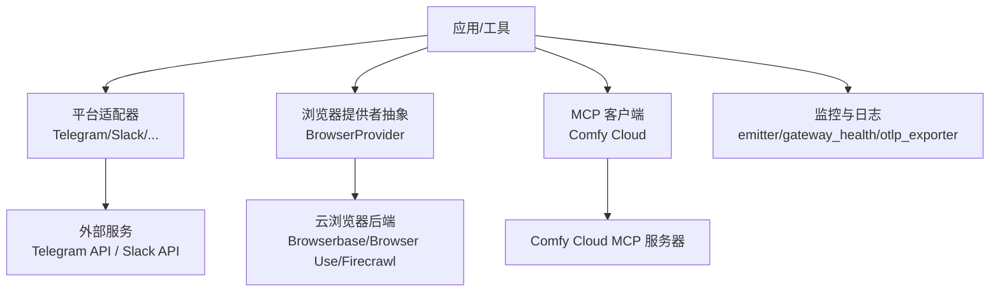
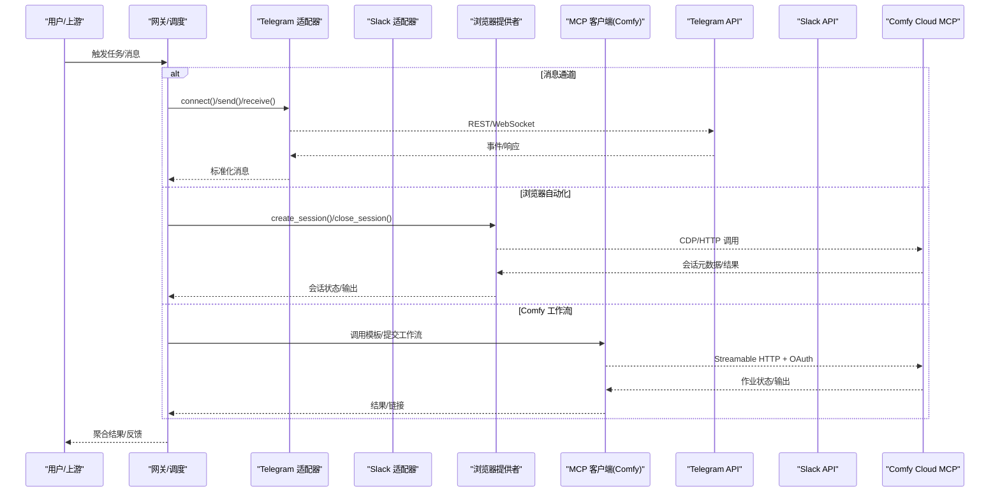
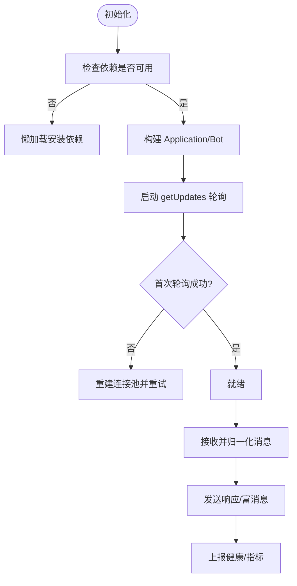
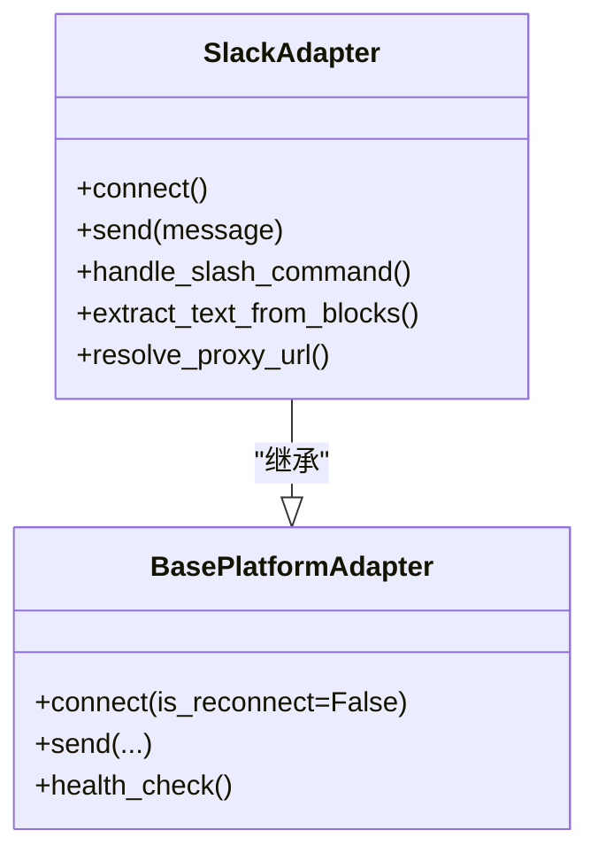
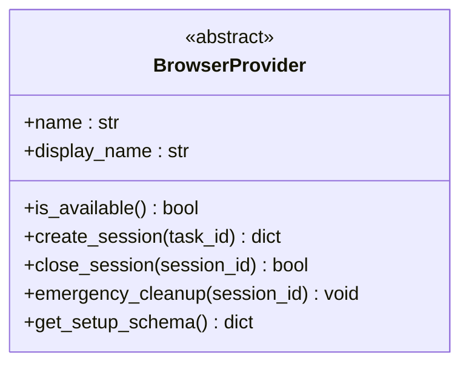
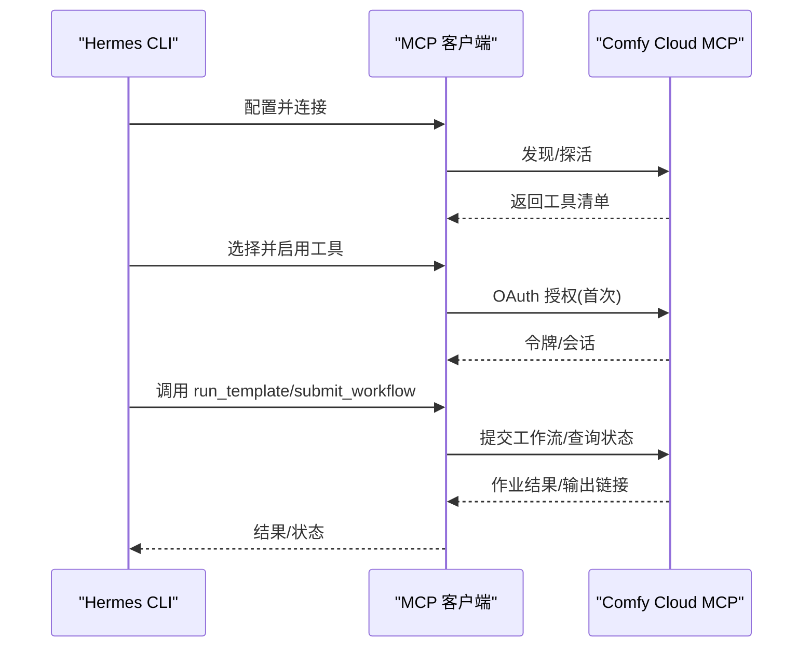
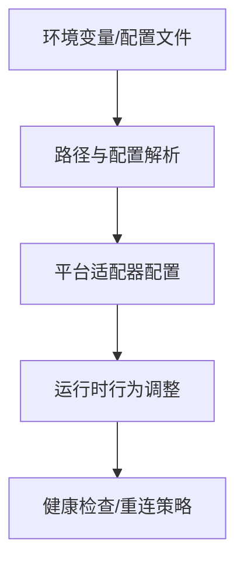
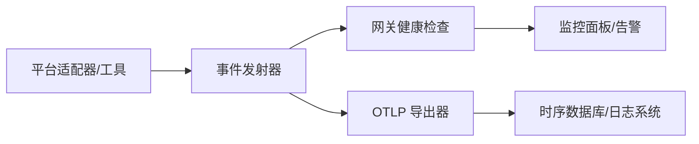
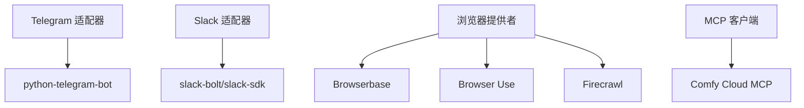

# 外部服务集成

<cite>
**本文引用的文件**
- [agent/browser_provider.py](file://agent/browser_provider.py)
- [plugins/platforms/telegram/adapter.py](file://plugins/platforms/telegram/adapter.py)
- [plugins/platforms/slack/adapter.py](file://plugins/platforms/slack/adapter.py)
- [optional-mcps/comfy-cloud/manifest.yaml](file://optional-mcps/comfy-cloud/manifest.yaml)
- [hermes_constants.py](file://hermes_constants.py)
- [tests/gateway/test_adapter_connect_is_reconnect_contract.py](file://tests/gateway/test_adapter_connect_is_reconnect_contract.py)
- [agent/monitoring/emitter.py](file://agent/monitoring/emitter.py)
- [agent/monitoring/gateway_health.py](file://agent/monitoring/gateway_health.py)
- [agent/monitoring/otlp_exporter.py](file://agent/monitoring/otlp_exporter.py)
</cite>

## 目录
1. [简介](#简介)
2. [项目结构](#项目结构)
3. [核心组件](#核心组件)
4. [架构总览](#架构总览)
5. [详细组件分析](#详细组件分析)
6. [依赖关系分析](#依赖关系分析)
7. [性能考虑](#性能考虑)
8. [故障排除指南](#故障排除指南)
9. [结论](#结论)
10. [附录](#附录)

## 简介
本文件面向“外部服务集成”，聚焦第三方服务的接入与治理，包括：
- 服务发现与健康检查
- 故障转移与重试
- 配置管理（动态、环境变量、配置文件）
- 监控与日志记录
- 服务间通信模式（REST、WebSocket、消息队列等）
- 复杂场景示例：ComfyUI 工作流执行、多平台消息集成、浏览器自动化

Hermes Agent 通过“平台适配器”“MCP 清单”“浏览器提供者抽象”“监控导出器”等机制，将外部系统以统一接口接入，并在网关层进行生命周期管理、健康探测与故障恢复。

## 项目结构
围绕外部服务集成，仓库的关键位置如下：
- 平台适配器：gateway/platforms 与 plugins/platforms 下的各平台实现（如 Telegram、Slack），提供连接、重连、消息收发、媒体处理等能力。
- 浏览器提供者：agent/browser_provider.py 定义云浏览器的统一抽象，供工具层调用。
- MCP 清单：optional-mcps/comfy-cloud/manifest.yaml 描述 Comfy Cloud 的远程 MCP 服务器、传输、认证与工具集。
- 配置与环境：hermes_constants.py 提供 HERMES_HOME 等路径解析与环境变量约定；平台适配器中大量使用环境变量控制行为。
- 监控与可观测性：agent/monitoring/* 提供事件发射、网关健康、OTLP 导出等能力。

**图表来源**
- [plugins/platforms/telegram/adapter.py:633-800](file://plugins/platforms/telegram/adapter.py#L633-L800)
- [plugins/platforms/slack/adapter.py:1-120](file://plugins/platforms/slack/adapter.py#L1-L120)
- [agent/browser_provider.py:50-178](file://agent/browser_provider.py#L50-L178)
- [optional-mcps/comfy-cloud/manifest.yaml:1-83](file://optional-mcps/comfy-cloud/manifest.yaml#L1-L83)
- [agent/monitoring/emitter.py](file://agent/monitoring/emitter.py)
- [agent/monitoring/gateway_health.py](file://agent/monitoring/gateway_health.py)
- [agent/monitoring/otlp_exporter.py](file://agent/monitoring/otlp_exporter.py)

**章节来源**
- [plugins/platforms/telegram/adapter.py:633-800](file://plugins/platforms/telegram/adapter.py#L633-L800)
- [plugins/platforms/slack/adapter.py:1-120](file://plugins/platforms/slack/adapter.py#L1-L120)
- [agent/browser_provider.py:50-178](file://agent/browser_provider.py#L50-L178)
- [optional-mcps/comfy-cloud/manifest.yaml:1-83](file://optional-mcps/comfy-cloud/manifest.yaml#L1-L83)
- [hermes_constants.py:114-158](file://hermes_constants.py#L114-L158)
- [agent/monitoring/emitter.py](file://agent/monitoring/emitter.py)
- [agent/monitoring/gateway_health.py](file://agent/monitoring/gateway_health.py)
- [agent/monitoring/otlp_exporter.py](file://agent/monitoring/otlp_exporter.py)

## 核心组件
- 平台适配器（Platform Adapter）
  - 负责与外部消息平台建立连接、接收消息、发送响应、处理媒体与命令、错误处理与重连。
  - 典型实现：TelegramAdapter、SlackAdapter。
- 浏览器提供者（Browser Provider）
  - 抽象云浏览器后端，提供会话创建、关闭、紧急清理、可用性检测与安装引导。
  - 支持 Browserbase、Browser Use、Firecrawl 等。
- MCP 清单（Comfy Cloud）
  - 声明式描述远程 MCP 服务器的传输类型、URL、OAuth 认证、默认启用的工具子集及安装后提示。
- 监控与可观测性
  - 事件发射器、网关健康检查、OTLP 导出，用于上报指标、追踪与告警。

**章节来源**
- [plugins/platforms/telegram/adapter.py:633-800](file://plugins/platforms/telegram/adapter.py#L633-L800)
- [plugins/platforms/slack/adapter.py:1-120](file://plugins/platforms/slack/adapter.py#L1-L120)
- [agent/browser_provider.py:50-178](file://agent/browser_provider.py#L50-L178)
- [optional-mcps/comfy-cloud/manifest.yaml:1-83](file://optional-mcps/comfy-cloud/manifest.yaml#L1-L83)
- [agent/monitoring/emitter.py](file://agent/monitoring/emitter.py)
- [agent/monitoring/gateway_health.py](file://agent/monitoring/gateway_health.py)
- [agent/monitoring/otlp_exporter.py](file://agent/monitoring/otlp_exporter.py)

## 架构总览
下图展示 Hermes Agent 如何统一接入多种外部服务：

**图表来源**
- [plugins/platforms/telegram/adapter.py:633-800](file://plugins/platforms/telegram/adapter.py#L633-L800)
- [plugins/platforms/slack/adapter.py:1-120](file://plugins/platforms/slack/adapter.py#L1-L120)
- [agent/browser_provider.py:50-178](file://agent/browser_provider.py#L50-L178)
- [optional-mcps/comfy-cloud/manifest.yaml:1-83](file://optional-mcps/comfy-cloud/manifest.yaml#L1-L83)

## 详细组件分析

### 平台适配器：Telegram
- 职责
  - 维护 PTB Application/Bot 实例，处理 getUpdates 轮询、富文本渲染、媒体分组、线程上下文、速率限制与代理。
  - 提供超时保护、死锁诊断、异常脱敏、批量合并与去重。
- 关键特性
  - 启动与就绪：带超时与进度验证，避免冷启动挂起。
  - 重连与恢复：心跳、错误任务、回退 IP、连接池重建。
  - 安全与隐私：错误信息脱敏、敏感字段隐藏。
  - 配置：大量环境变量控制批处理延迟、富消息开关、去重窗口等。

**图表来源**
- [plugins/platforms/telegram/adapter.py:633-800](file://plugins/platforms/telegram/adapter.py#L633-L800)

**章节来源**
- [plugins/platforms/telegram/adapter.py:633-800](file://plugins/platforms/telegram/adapter.py#L633-L800)

### 平台适配器：Slack
- 职责
  - 基于 Socket Mode 收发消息、处理 Slash 命令、线程上下文、Block Kit 渲染与 URL 提取。
  - 提供代理配置、错误体截断、去重 TTL、音频格式映射等。
- 关键特性
  - 依赖懒加载与绑定，避免启动时引入重型 SDK。
  - 对 Block Kit 的结构化内容进行可读文本提取，便于下游处理。
  - 对网络错误体进行长度限制，避免内存膨胀。

**图表来源**
- [plugins/platforms/slack/adapter.py:1-120](file://plugins/platforms/slack/adapter.py#L1-L120)
- [tests/gateway/test_adapter_connect_is_reconnect_contract.py:114-145](file://tests/gateway/test_adapter_connect_is_reconnect_contract.py#L114-L145)

**章节来源**
- [plugins/platforms/slack/adapter.py:1-120](file://plugins/platforms/slack/adapter.py#L1-L120)
- [tests/gateway/test_adapter_connect_is_reconnect_contract.py:114-145](file://tests/gateway/test_adapter_connect_is_reconnect_contract.py#L114-L145)

### 浏览器自动化：Cloud Browser Provider
- 职责
  - 定义统一的云浏览器后端抽象：名称、可用性检测、会话创建/关闭、紧急清理、安装引导 Schema。
  - 保持与旧版 CloudBrowserProvider 兼容，使工具层无需感知具体后端。
- 关键特性
  - is_available 不得发起网络请求，适合在工具列表绘制时快速判断。
  - create_session 返回标准会话元数据（含 CDP URL、过期时间、功能标志）。
  - emergency_cleanup 保证进程退出时的资源释放。

**图表来源**
- [agent/browser_provider.py:50-178](file://agent/browser_provider.py#L50-L178)

**章节来源**
- [agent/browser_provider.py:50-178](file://agent/browser_provider.py#L50-L178)

### ComfyUI 工作流执行：MCP 清单
- 职责
  - 声明 Comfy Cloud 的远程 MCP 服务器地址、传输类型（HTTP）、OAuth 认证流程、默认启用工具集与安装后说明。
- 关键特性
  - 通过 Streamable HTTP 与原生 OAuth 2.1 + Dynamic Client Registration 交互。
  - 默认仅启用约 20 个工具，控制模型调用开销。
  - 首次连接会打开浏览器完成认证，随后重启会话加载工具。

**图表来源**
- [optional-mcps/comfy-cloud/manifest.yaml:1-83](file://optional-mcps/comfy-cloud/manifest.yaml#L1-L83)

**章节来源**
- [optional-mcps/comfy-cloud/manifest.yaml:1-83](file://optional-mcps/comfy-cloud/manifest.yaml#L1-L83)

### 配置管理与环境变量
- 全局路径与 Home
  - 通过 HERMES_HOME 与平台默认路径解析，确保跨部署一致性与多 Profile 隔离。
- 平台级配置
  - 各适配器通过环境变量精细控制行为（如批处理延迟、去重窗口、代理、富消息开关等）。
- 动态配置
  - 平台适配器在运行时读取并应用配置，结合健康检查与重连策略实现弹性。

**图表来源**
- [hermes_constants.py:114-158](file://hermes_constants.py#L114-L158)
- [plugins/platforms/telegram/adapter.py:633-800](file://plugins/platforms/telegram/adapter.py#L633-L800)
- [plugins/platforms/slack/adapter.py:1-120](file://plugins/platforms/slack/adapter.py#L1-L120)

**章节来源**
- [hermes_constants.py:114-158](file://hermes_constants.py#L114-L158)
- [plugins/platforms/telegram/adapter.py:633-800](file://plugins/platforms/telegram/adapter.py#L633-L800)
- [plugins/platforms/slack/adapter.py:1-120](file://plugins/platforms/slack/adapter.py#L1-L120)

### 监控与日志记录
- 事件发射器：统一的事件上报入口，便于后续扩展。
- 网关健康：暴露网关健康状态，支撑外部监控系统拉取。
- OTLP 导出：将指标与追踪数据导出到 OpenTelemetry 兼容后端。

**图表来源**
- [agent/monitoring/emitter.py](file://agent/monitoring/emitter.py)
- [agent/monitoring/gateway_health.py](file://agent/monitoring/gateway_health.py)
- [agent/monitoring/otlp_exporter.py](file://agent/monitoring/otlp_exporter.py)

**章节来源**
- [agent/monitoring/emitter.py](file://agent/monitoring/emitter.py)
- [agent/monitoring/gateway_health.py](file://agent/monitoring/gateway_health.py)
- [agent/monitoring/otlp_exporter.py](file://agent/monitoring/otlp_exporter.py)

## 依赖关系分析
- 平台适配器依赖
  - Telegram 适配器依赖 python-telegram-bot，支持懒加载与失败降级。
  - Slack 适配器依赖 slack-bolt/slack-sdk，同样采用懒加载与错误体限制。
- 浏览器提供者依赖
  - 由工具层根据配置选择具体后端，抽象出统一接口，屏蔽差异。
- MCP 客户端依赖
  - Comfy Cloud 通过 HTTP 传输与 OAuth 认证，工具清单受清单约束。

**图表来源**
- [plugins/platforms/telegram/adapter.py:633-800](file://plugins/platforms/telegram/adapter.py#L633-L800)
- [plugins/platforms/slack/adapter.py:1-120](file://plugins/platforms/slack/adapter.py#L1-L120)
- [agent/browser_provider.py:50-178](file://agent/browser_provider.py#L50-L178)
- [optional-mcps/comfy-cloud/manifest.yaml:1-83](file://optional-mcps/comfy-cloud/manifest.yaml#L1-L83)

**章节来源**
- [plugins/platforms/telegram/adapter.py:633-800](file://plugins/platforms/telegram/adapter.py#L633-L800)
- [plugins/platforms/slack/adapter.py:1-120](file://plugins/platforms/slack/adapter.py#L1-L120)
- [agent/browser_provider.py:50-178](file://agent/browser_provider.py#L50-L178)
- [optional-mcps/comfy-cloud/manifest.yaml:1-83](file://optional-mcps/comfy-cloud/manifest.yaml#L1-L83)

## 性能考虑
- 消息批处理与节流
  - Telegram/Slack 均对高频消息进行批处理与节流，降低 API 压力与客户端抖动。
- 超时与兜底
  - 为轮询、停止、连接池重建设置严格超时，防止阻塞主循环。
- 资源释放
  - 浏览器会话与网络连接的紧急清理，避免进程退出时泄漏。
- 缓存与去重
  - 利用去重窗口与本地缓存减少重复请求与冗余处理。

[本节为通用指导，不直接分析具体文件]

## 故障排除指南
- 平台适配器重连契约
  - 所有平台的 connect() 必须接受 is_reconnect 关键字参数，否则网关重连时会抛出签名错误导致平台静默断开。
- 常见问题定位
  - 查看平台适配器的错误脱敏日志，确认未泄露敏感信息。
  - 检查环境变量是否正确（如代理、批处理延迟、去重窗口）。
  - 确认依赖是否懒加载成功，必要时手动安装或更新。
- 浏览器自动化问题
  - 检查 is_available 返回与 create_session 返回值，确认 CDP URL 与过期时间。
  - 若会话卡住，调用 emergency_cleanup 强制释放资源。
- Comfy 工作流问题
  - 首次连接需完成 OAuth 授权；若工具未加载，重启会话重新加载。
  - 关注作业状态与输出链接，必要时取消或重试。

**章节来源**
- [tests/gateway/test_adapter_connect_is_reconnect_contract.py:114-145](file://tests/gateway/test_adapter_connect_is_reconnect_contract.py#L114-L145)
- [plugins/platforms/telegram/adapter.py:633-800](file://plugins/platforms/telegram/adapter.py#L633-L800)
- [plugins/platforms/slack/adapter.py:1-120](file://plugins/platforms/slack/adapter.py#L1-L120)
- [agent/browser_provider.py:50-178](file://agent/browser_provider.py#L50-L178)
- [optional-mcps/comfy-cloud/manifest.yaml:1-83](file://optional-mcps/comfy-cloud/manifest.yaml#L1-L83)

## 结论
Hermes Agent 通过平台适配器、浏览器提供者抽象与 MCP 清单，将多种外部服务以统一方式接入，并提供健壮的健康检查、重连与监控能力。对于复杂场景（Comfy 工作流、多平台消息、浏览器自动化），建议遵循以下实践：
- 使用清单与抽象，避免硬编码第三方细节。
- 通过环境变量与配置文件实现动态调优。
- 借助监控与日志，持续观察健康与性能。
- 严格遵循重连契约与超时策略，保障稳定性。

[本节为总结，不直接分析具体文件]

## 附录
- 常用环境变量（示例）
  - HERMES_HOME：Hermes 根目录
  - 平台相关：HERMES_TELEGRAM_*、SLACK_DEDUP_TTL_SECONDS 等
- 参考路径
  - 平台适配器：plugins/platforms/*
  - 浏览器提供者：agent/browser_provider.py
  - MCP 清单：optional-mcps/*/manifest.yaml
  - 监控导出：agent/monitoring/*

[本节为补充信息，不直接分析具体文件]