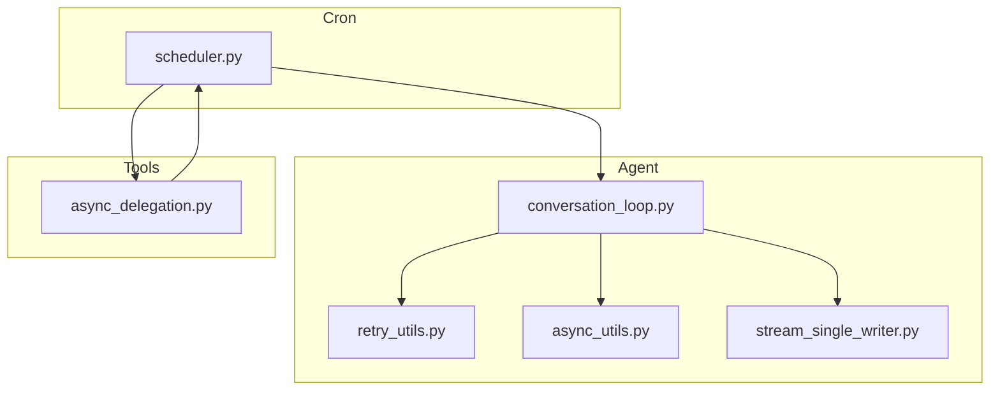
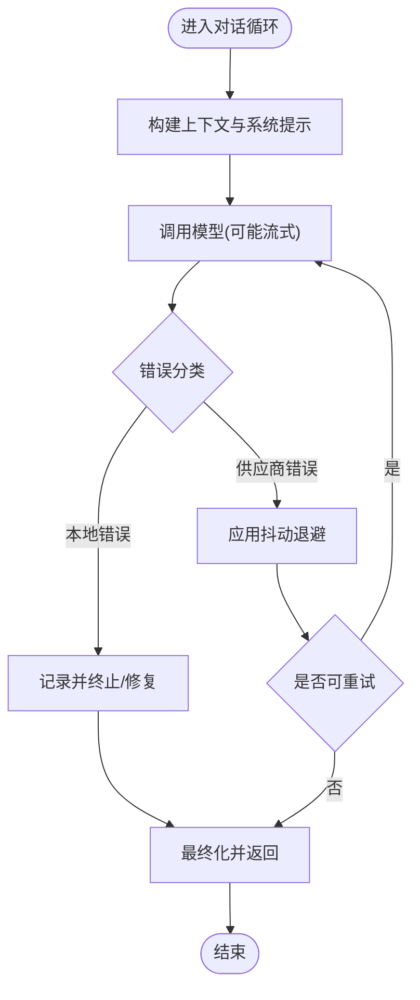
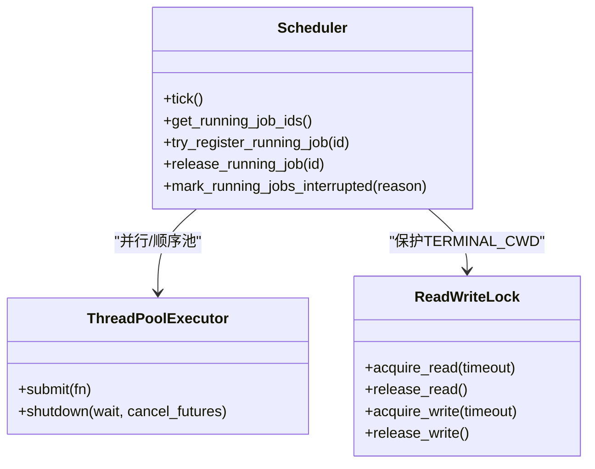
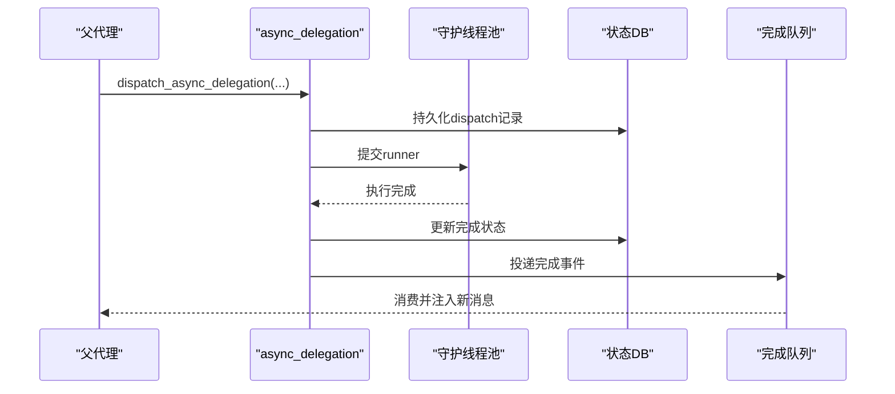
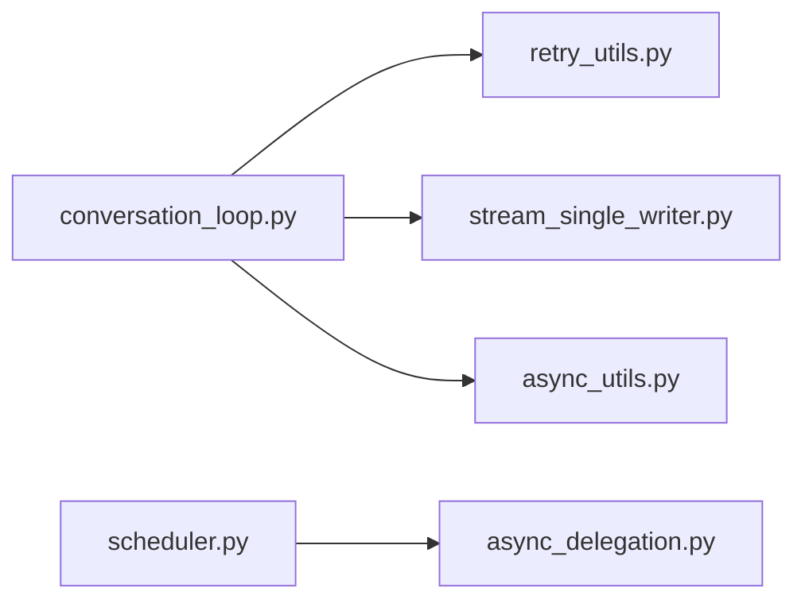

# 异步并发模式

<cite>
**本文引用的文件**
- [agent/async_utils.py](file://agent/async_utils.py)
- [agent/conversation_loop.py](file://agent/conversation_loop.py)
- [agent/retry_utils.py](file://agent/retry_utils.py)
- [cron/scheduler.py](file://cron/scheduler.py)
- [tools/async_delegation.py](file://tools/async_delegation.py)
- [agent/stream_single_writer.py](file://agent/stream_single_writer.py)
</cite>

## 目录
1. [简介](#简介)
2. [项目结构](#项目结构)
3. [核心组件](#核心组件)
4. [架构总览](#架构总览)
5. [详细组件分析](#详细组件分析)
6. [依赖关系分析](#依赖关系分析)
7. [性能考量](#性能考量)
8. [故障排查指南](#故障排查指南)
9. [结论](#结论)
10. [附录](#附录)

## 简介
本文件聚焦于该代码库中的异步并发模式，围绕以下主题展开：
- 异步编程实现：事件循环、协程、任务调度与线程池协作
- 并发控制机制：锁、读写锁、容量限制、进程级隔离
- 任务调度：定时任务（Cron）、延迟/后台任务、队列化完成事件
- 回调与错误处理：重试退避、中断、超时、资源清理
- 异步 I/O 优化：连接复用、缓冲、批处理、单写者流
- 关键场景：对话循环、任务调度、资源管理

## 项目结构
本项目在多个子系统实现了异步并发能力：
- agent 层：对话循环、重试策略、异步工具、流式输出控制
- cron 层：定时任务调度器，使用线程池与读写锁保障并发安全
- tools 层：后台委托执行器，持久化与队列投递完成事件
- 跨模块：统一的线程上下文传播、守护线程池、状态持久化



**图表来源**
- [agent/conversation_loop.py:1-120](file://agent/conversation_loop.py#L1-L120)
- [agent/retry_utils.py:1-60](file://agent/retry_utils.py#L1-L60)
- [agent/async_utils.py:1-85](file://agent/async_utils.py#L1-L85)
- [agent/stream_single_writer.py:1-71](file://agent/stream_single_writer.py#L1-L71)
- [cron/scheduler.py:1-120](file://cron/scheduler.py#L1-L120)
- [tools/async_delegation.py:1-120](file://tools/async_delegation.py#L1-L120)

**章节来源**
- [agent/conversation_loop.py:1-120](file://agent/conversation_loop.py#L1-L120)
- [cron/scheduler.py:1-120](file://cron/scheduler.py#L1-L120)
- [tools/async_delegation.py:1-120](file://tools/async_delegation.py#L1-L120)

## 核心组件
- 对话循环（conversation_loop）：驱动一次用户请求的完整流程，包含模型调用、工具分发、重试、压缩、后处理等。它通过重试策略和错误分类实现健壮性。
- 重试与退避（retry_utils）：提供抖动指数退避、特定供应商过载识别与自适应退避策略，避免“惊群”重试。
- 线程到事件循环桥接（async_utils）：安全地将协程从工作线程调度到事件循环，防止协程泄漏与未 await 警告。
- 定时任务调度（cron/scheduler）：周期性检查到期任务，使用并行与顺序线程池执行，读写锁保护共享环境变更。
- 后台委托（tools/async_delegation）：将子任务提交到守护线程池，持久化状态并通过共享队列投递完成事件，支持断点恢复与去重。
- 单写者流（stream_single_writer）：为流式输出提供“单写者围栏”，避免并发写入导致的状态不一致。

**章节来源**
- [agent/conversation_loop.py:1-120](file://agent/conversation_loop.py#L1-L120)
- [agent/retry_utils.py:1-60](file://agent/retry_utils.py#L1-L60)
- [agent/async_utils.py:1-85](file://agent/async_utils.py#L1-L85)
- [cron/scheduler.py:330-470](file://cron/scheduler.py#L330-L470)
- [tools/async_delegation.py:60-120](file://tools/async_delegation.py#L60-L120)
- [agent/stream_single_writer.py:1-71](file://agent/stream_single_writer.py#L1-L71)

## 架构总览
整体并发架构由“事件循环 + 线程池 + 队列 + 锁”构成：
- 对话循环在事件循环中运行，遇到阻塞 I/O 或耗时计算时通过线程池或异步 I/O 解耦。
- Cron 调度器以固定周期触发，使用线程池并行执行作业；对会修改全局环境的作业采用顺序池与读写锁串行化。
- 后台委托将子任务放入守护线程池，完成后通过共享队列投递结果，供 CLI/Gateway 消费并注入新消息。
- 流式输出通过单写者围栏保证同一时刻只有一个写者，避免竞态。

```mermaid
sequenceDiagram
participant User as "用户"
participant Loop as "对话循环"
participant Retry as "重试策略"
participant Pool as "线程池"
participant Cron as "Cron调度器"
participant Delegate as "后台委托"
participant Queue as "完成队列"
User->>Loop : 发起请求
Loop->>Retry : 调用API并处理错误
alt 需要后台任务
Loop->>Delegate : 提交子任务
Delegate->>Pool : 执行子任务
Pool-->>Queue : 投递完成事件
Queue-->>Loop : 消费事件并注入新消息
end
alt 定时任务
Cron->>Pool : 调度作业
Pool-->>Cron : 返回结果
end
Loop-->>User : 返回响应
```

**图表来源**
- [agent/conversation_loop.py:1-120](file://agent/conversation_loop.py#L1-L120)
- [agent/retry_utils.py:1-60](file://agent/retry_utils.py#L1-L60)
- [cron/scheduler.py:330-470](file://cron/scheduler.py#L330-L470)
- [tools/async_delegation.py:60-120](file://tools/async_delegation.py#L60-L120)

## 详细组件分析

### 组件A：对话循环与重试策略
- 职责：编排一次用户请求的完整生命周期，包括上下文构建、模型调用、工具执行、压缩、重试、最终化。
- 并发要点：
  - 使用重试策略进行退避，避免瞬时过载导致的雪崩。
  - 错误分类区分本地处理错误与网络/供应商错误，决定重试与否。
  - 流式输出通过单写者围栏确保一致性。
- 复杂度：主循环为 O(N) 次模型/工具调用，每次调用可能触发重试与压缩，整体受限于外部 API 速率与本地处理能力。



**图表来源**
- [agent/conversation_loop.py:160-220](file://agent/conversation_loop.py#L160-L220)
- [agent/retry_utils.py:90-130](file://agent/retry_utils.py#L90-L130)

**章节来源**
- [agent/conversation_loop.py:160-220](file://agent/conversation_loop.py#L160-L220)
- [agent/retry_utils.py:90-130](file://agent/retry_utils.py#L90-L130)

### 组件B：线程到事件循环的安全调度
- 职责：从同步工作线程安全地调度协程到事件循环，失败时关闭协程以避免泄漏。
- 并发要点：
  - 捕获 run_coroutine_threadsafe 异常，关闭协程并返回 None，使调用方可分支处理。
  - 提供 detached task 结果消费函数，避免取消异常噪声。
- 复杂度：O(1)，仅封装调度与异常处理。

```mermaid
sequenceDiagram
participant Thread as "工作线程"
participant Bridge as "async_utils"
participant Loop as "事件循环"
Thread->>Bridge : safe_schedule_threadsafe(coro, loop)
alt 成功
Bridge->>Loop : run_coroutine_threadsafe
Loop-->>Bridge : Future
Bridge-->>Thread : Future
else 失败
Bridge->>Bridge : close(coro)
Bridge-->>Thread : None
end
```

**图表来源**
- [agent/async_utils.py:34-68](file://agent/async_utils.py#L34-L68)

**章节来源**
- [agent/async_utils.py:34-68](file://agent/async_utils.py#L34-L68)

### 组件C：定时任务调度器（Cron）
- 职责：周期性检查到期作业并执行，支持并行与顺序执行，维护运行集与中断标记。
- 并发要点：
  - 并行线程池用于独立作业；顺序线程池用于会修改全局环境（如工作目录）的作业。
  - 读写锁保护共享环境变量，写者优先，避免读者看到脏数据。
  - 运行集与中断标记使用线程锁保护，支持优雅关闭与中断。
- 复杂度：tick 为 O(J) 检查 J 个作业；执行时间取决于作业本身。



**图表来源**
- [cron/scheduler.py:330-470](file://cron/scheduler.py#L330-L470)
- [cron/scheduler.py:471-558](file://cron/scheduler.py#L471-L558)

**章节来源**
- [cron/scheduler.py:330-470](file://cron/scheduler.py#L330-L470)
- [cron/scheduler.py:471-558](file://cron/scheduler.py#L471-L558)

### 组件D：后台委托与完成事件队列
- 职责：将子任务提交到守护线程池，持久化状态，完成后通过共享队列投递结果，支持恢复与去重。
- 并发要点：
  - 守护线程池避免进程退出挂起；记录活跃计数与容量限制，拒绝超载。
  - 使用数据库持久化任务状态，支持重启恢复与交付重试。
  - 监控线程检测停滞任务，给予宽限后强制终结。
- 复杂度：提交 O(1)；恢复与修剪受数据库大小影响。



**图表来源**
- [tools/async_delegation.py:677-800](file://tools/async_delegation.py#L677-L800)
- [tools/async_delegation.py:200-283](file://tools/async_delegation.py#L200-L283)
- [tools/async_delegation.py:344-412](file://tools/async_delegation.py#L344-L412)

**章节来源**
- [tools/async_delegation.py:677-800](file://tools/async_delegation.py#L677-L800)
- [tools/async_delegation.py:200-283](file://tools/async_delegation.py#L200-L283)
- [tools/async_delegation.py:344-412](file://tools/async_delegation.py#L344-L412)

### 组件E：单写者流围栏
- 职责：为流式输出提供“单写者”保障，避免并发写入导致状态不一致。
- 并发要点：
  - 最佳努力获取令牌，若不可用则降级为无围栏，保证不会误杀合法写者。
  - 检查令牌是否仍有效，仅在证明过时后才停止流。
- 复杂度：O(1)。

**章节来源**
- [agent/stream_single_writer.py:31-71](file://agent/stream_single_writer.py#L31-L71)

## 依赖关系分析
- conversation_loop 依赖 retry_utils 进行退避与错误分类，依赖 stream_single_writer 进行流式一致性。
- cron/scheduler 依赖线程池与读写锁，并与 async_delegation 交互以协调后台任务。
- async_delegation 依赖守护线程池与数据库持久化，向队列投递完成事件。
- async_utils 被多处用于线程到事件循环的安全调度。



**图表来源**
- [agent/conversation_loop.py:1-120](file://agent/conversation_loop.py#L1-L120)
- [agent/retry_utils.py:1-60](file://agent/retry_utils.py#L1-L60)
- [agent/stream_single_writer.py:1-71](file://agent/stream_single_writer.py#L1-L71)
- [cron/scheduler.py:330-470](file://cron/scheduler.py#L330-L470)
- [tools/async_delegation.py:60-120](file://tools/async_delegation.py#L60-L120)
- [agent/async_utils.py:1-85](file://agent/async_utils.py#L1-L85)

**章节来源**
- [agent/conversation_loop.py:1-120](file://agent/conversation_loop.py#L1-L120)
- [cron/scheduler.py:330-470](file://cron/scheduler.py#L330-L470)
- [tools/async_delegation.py:60-120](file://tools/async_delegation.py#L60-L120)

## 性能考量
- 抖动退避：通过随机抖动分散重试峰值，降低供应商过载风险。
- 并行与顺序池：独立作业并行执行，环境敏感作业串行化，平衡吞吐与一致性。
- 容量限制：后台委托限制最大并发子任务，避免资源耗尽。
- 单写者流：减少竞争，提升流式输出的稳定性。
- 建议：
  - 根据负载调整线程池大小与委托并发上限。
  - 针对供应商速率限制配置合适的退避参数。
  - 监控队列积压与数据库写入延迟，及时扩容或限流。

[本节为通用指导，不直接分析具体文件]

## 故障排查指南
- 协程泄漏：检查线程到事件循环调度是否捕获异常并关闭协程。
- 任务卡死：查看后台委托的停滞检测与宽限机制，确认进度回调是否正确上报。
- Cron 作业冲突：确认读写锁是否生效，避免工作目录污染。
- 流式输出错乱：验证单写者围栏是否可用，必要时降级为无围栏。
- 重试风暴：检查退避策略是否启用抖动，避免多会话同时重试。

**章节来源**
- [agent/async_utils.py:34-85](file://agent/async_utils.py#L34-L85)
- [tools/async_delegation.py:88-117](file://tools/async_delegation.py#L88-L117)
- [cron/scheduler.py:471-558](file://cron/scheduler.py#L471-L558)
- [agent/stream_single_writer.py:31-71](file://agent/stream_single_writer.py#L31-L71)
- [agent/retry_utils.py:90-130](file://agent/retry_utils.py#L90-L130)

## 结论
该代码库通过事件循环、线程池、队列与锁的组合，构建了健壮的异步并发体系。对话循环负责编排与重试，Cron 调度器提供定时任务能力，后台委托实现长任务与结果回注，单写者流保障输出一致性。合理配置并发参数与退避策略，可在高负载下保持稳定与高效。

[本节为总结，不直接分析具体文件]

## 附录
- 关键实践：
  - 始终使用抖动退避，避免“惊群”。
  - 对共享环境变更使用读写锁，写者优先。
  - 后台任务需持久化状态，支持恢复与去重。
  - 流式输出使用单写者围栏，必要时降级。
- 参考路径：
  - 对话循环：[agent/conversation_loop.py:1-120](file://agent/conversation_loop.py#L1-L120)
  - 重试策略：[agent/retry_utils.py:90-130](file://agent/retry_utils.py#L90-L130)
  - 线程到事件循环：[agent/async_utils.py:34-68](file://agent/async_utils.py#L34-L68)
  - Cron 调度：[cron/scheduler.py:330-470](file://cron/scheduler.py#L330-L470)
  - 后台委托：[tools/async_delegation.py:677-800](file://tools/async_delegation.py#L677-L800)
  - 单写者流：[agent/stream_single_writer.py:31-71](file://agent/stream_single_writer.py#L31-L71)