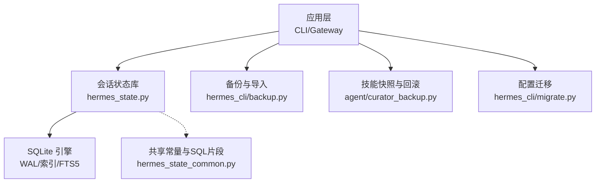
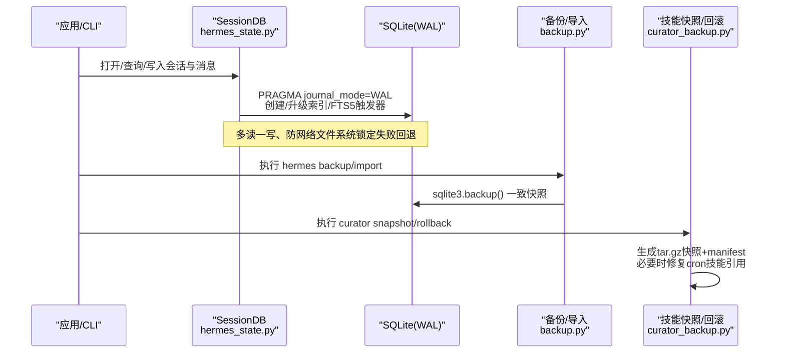
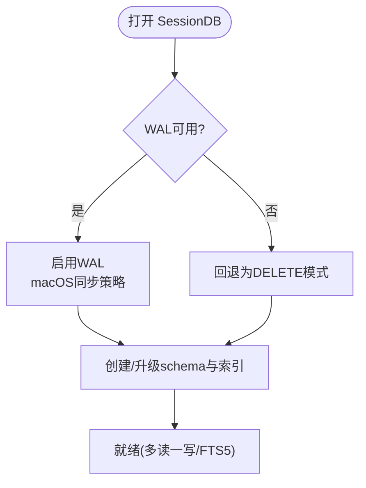
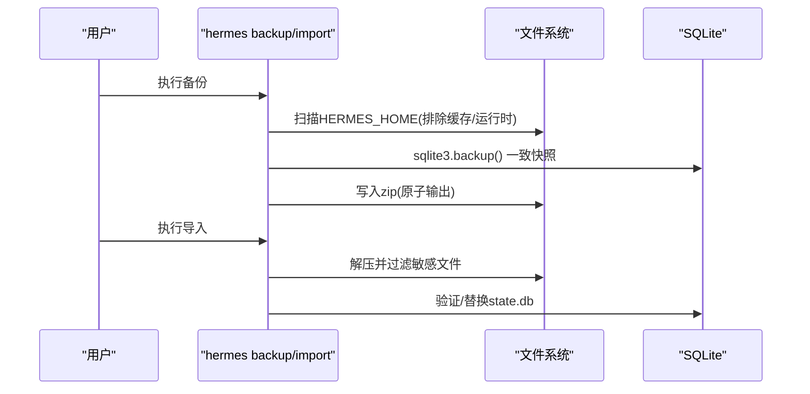
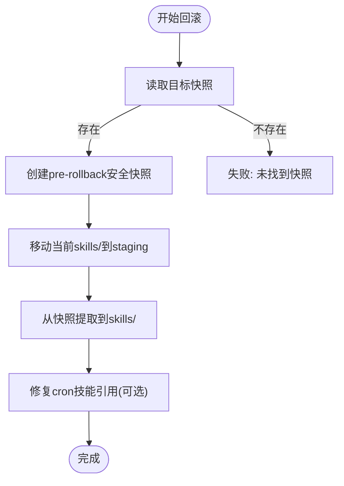
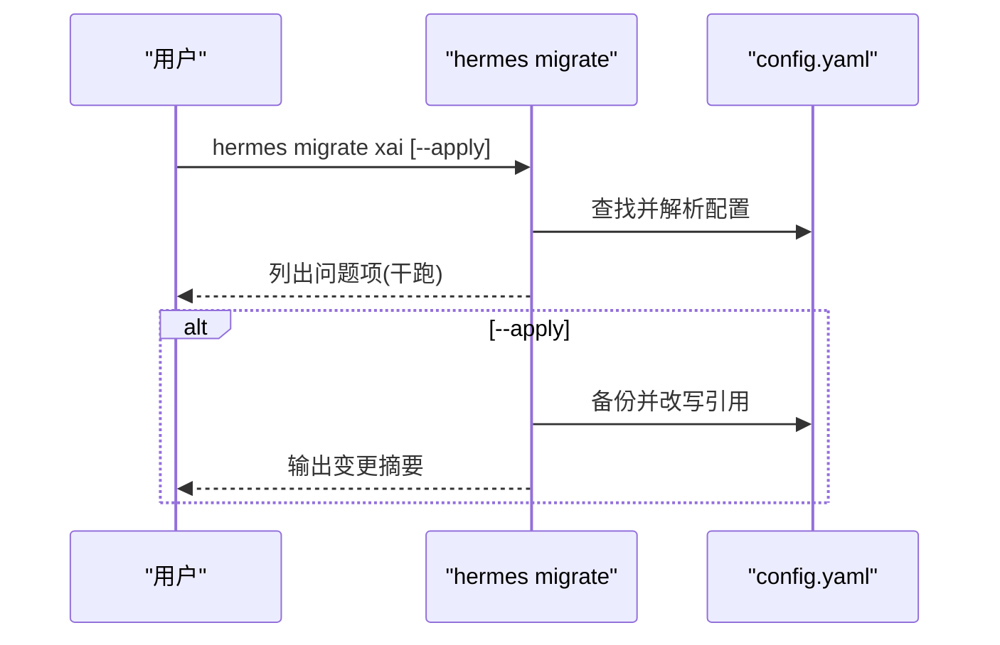
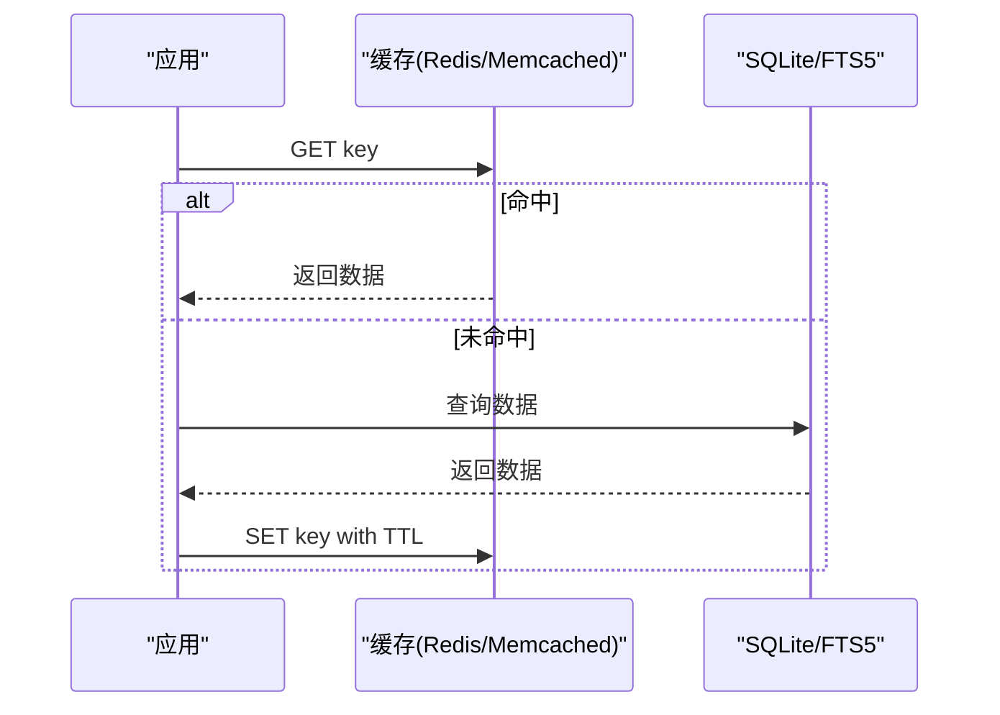
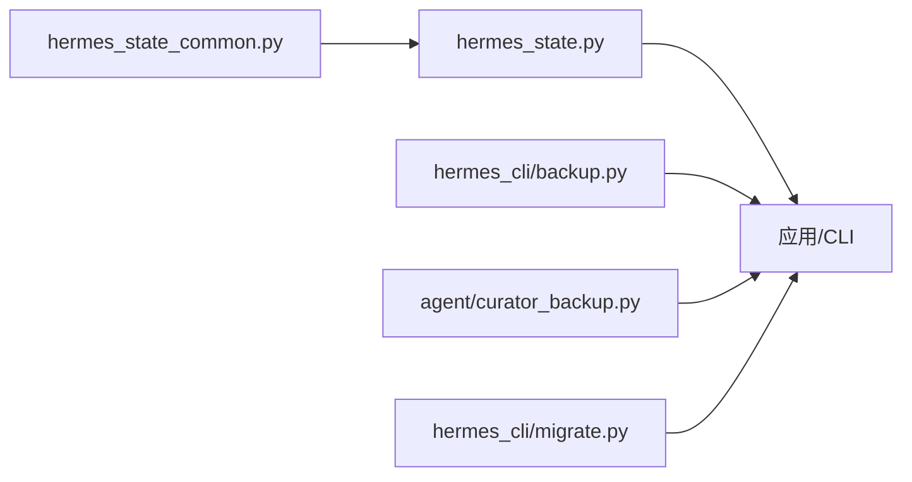

# 数据存储集成

<cite>
**本文引用的文件**
- [hermes_state.py](file://hermes_state.py)
- [hermes_state_common.py](file://hermes_state_common.py)
- [backup.py](file://hermes_cli/backup.py)
- [curator_backup.py](file://agent/curator_backup.py)
- [migrate.py](file://hermes_cli/migrate.py)
</cite>

## 目录
1. [简介](#简介)
2. [项目结构](#项目结构)
3. [核心组件](#核心组件)
4. [架构总览](#架构总览)
5. [详细组件分析](#详细组件分析)
6. [依赖关系分析](#依赖关系分析)
7. [性能考虑](#性能考虑)
8. [故障排查指南](#故障排查指南)
9. [结论](#结论)
10. [附录](#附录)

## 简介
本文件聚焦于 Hermes Agent 的数据存储集成，覆盖数据库连接与操作（SQLite、WAL、FTS5）、事务与并发控制、备份与恢复、数据迁移策略，以及技能系统的安全快照与回滚。文档同时给出缓存机制的集成建议与优化要点，并提供面向“技能系统”的安全存储、状态管理与持久化的实践方案。

## 项目结构
围绕数据存储的核心模块集中在以下位置：
- 会话状态与消息存储：hermes_state.py、hermes_state_common.py
- 备份与导入：hermes_cli/backup.py
- 技能系统快照与回滚：agent/curator_backup.py
- 配置迁移工具：hermes_cli/migrate.py

图表来源
- [hermes_state.py:1-120](file://hermes_state.py#L1-L120)
- [hermes_state_common.py:197-373](file://hermes_state_common.py#L197-L373)
- [backup.py:581-795](file://hermes_cli/backup.py#L581-L795)
- [curator_backup.py:217-291](file://agent/curator_backup.py#L217-L291)
- [migrate.py:16-116](file://hermes_cli/migrate.py#L16-L116)

章节来源
- [hermes_state.py:1-120](file://hermes_state.py#L1-L120)
- [hermes_state_common.py:197-373](file://hermes_state_common.py#L197-L373)
- [backup.py:581-795](file://hermes_cli/backup.py#L581-L795)
- [curator_backup.py:217-291](file://agent/curator_backup.py#L217-L291)
- [migrate.py:16-116](file://hermes_cli/migrate.py#L16-L116)

## 核心组件
- 会话状态数据库（SessionDB）：基于 SQLite，启用 WAL 模式，提供会话元数据、消息历史、模型配置等持久化能力；内置 FTS5 全文检索与 trigram 中文分词支持；通过 schema_version 与延迟索引实现版本演进。
- 备份与导入：对 ~/.hermes 目录进行 zip 打包，使用 sqlite3.backup() 安全拷贝 .db，排除运行时与可再生缓存；导入时跳过易造成跨主机不一致的运行时文件。
- 技能系统快照与回滚：在 curator 变更前对 skills/ 目录创建 tar.gz 快照并保留 manifest；支持按时间戳选择快照进行回滚，并尝试修复 cron jobs.json 中的技能引用。
- 配置迁移：提供 xAI 模型退役迁移命令，支持 dry-run 与实际写入，自动备份配置文件。

章节来源
- [hermes_state.py:1-120](file://hermes_state.py#L1-L120)
- [hermes_state_common.py:167-184](file://hermes_state_common.py#L167-L184)
- [backup.py:342-374](file://hermes_cli/backup.py#L342-L374)
- [curator_backup.py:217-291](file://agent/curator_backup.py#L217-L291)
- [migrate.py:16-116](file://hermes_cli/migrate.py#L16-L116)

## 架构总览
下图展示了从应用到存储层的调用链路与关键保障点：

图表来源
- [hermes_state.py:486-538](file://hermes_state.py#L486-L538)
- [hermes_state_common.py:415-534](file://hermes_state_common.py#L415-L534)
- [backup.py:342-374](file://hermes_cli/backup.py#L342-L374)
- [curator_backup.py:217-291](file://agent/curator_backup.py#L217-L291)

## 详细组件分析

### 数据库连接与操作（SQLite + WAL + FTS5）
- 连接与模式
  - 默认数据库路径解析与测试隔离保护，避免在 pytest 环境下误连生产 state.db。
  - WAL 模式优先，遇到 NFS/SMB/FUSE/ZFS 等锁协议或磁盘 I/O 错误时回退为 DELETE 模式，保证可用性。
  - macOS 上强制 synchronous=FULL 并在 checkpoint 时使用 fullfsync，降低关机/重启时的损坏风险。
- 事务与会话
  - 通过 SQLite 事务边界组织写入；会话压缩、分支、子代理删除等复杂操作以原子方式执行。
  - 针对“委托子代理”的级联删除，先收集所有需删除的子会话 ID，再批量删除消息与会话，确保外键安全。
- 全文检索
  - messages_fts 与 messages_fts_trigram（trigram 分词）双索引，分别用于通用搜索与 CJK 子串搜索。
  - 外部内容布局（v23）将 content/tool_name/tool_calls 独立列，减少冗余复制；旧版兼容 SQL 仅在遗留库中保留。
  - 后台重建期间通过 state_meta 的高水位与进度标记，保证插入/更新/删除触发器的正确性。
- 索引与查询
  - 常用索引包括 sessions/source/started_at、messages/session_id/timestamp、部分 role/tool_calls 条件索引等。
  - 延迟索引在列添加后统一创建，避免 legacy DB 建表失败。

图表来源
- [hermes_state.py:486-538](file://hermes_state.py#L486-L538)
- [hermes_state_common.py:197-373](file://hermes_state_common.py#L197-L373)
- [hermes_state_common.py:415-534](file://hermes_state_common.py#L415-L534)

章节来源
- [hermes_state.py:333-538](file://hermes_state.py#L333-L538)
- [hermes_state_common.py:167-184](file://hermes_state_common.py#L167-L184)
- [hermes_state_common.py:197-373](file://hermes_state_common.py#L197-L373)
- [hermes_state_common.py:415-534](file://hermes_state_common.py#L415-L534)

### 备份与恢复（state.db 与完整目录）
- 一致性快照
  - 使用 sqlite3.backup() 对 .db 进行一致拷贝，避免 WAL/shm/journal 混用导致的不一致。
  - 备份 zip 排除可再生缓存与运行时文件，导入时跳过跨主机不安全的运行时状态。
- 完整性校验
  - 大库跳过全量 integrity_check，采用头部检查与轻量 schema 探测；小库执行 PRAGMA integrity_check。
- 流程概览

图表来源
- [backup.py:342-374](file://hermes_cli/backup.py#L342-L374)
- [backup.py:416-552](file://hermes_cli/backup.py#L416-L552)
- [backup.py:581-795](file://hermes_cli/backup.py#L581-L795)

章节来源
- [backup.py:342-374](file://hermes_cli/backup.py#L342-L374)
- [backup.py:416-552](file://hermes_cli/backup.py#L416-L552)
- [backup.py:581-795](file://hermes_cli/backup.py#L581-L795)

### 技能系统的安全存储、状态管理与持久化
- 快照策略
  - 在 curator 变更前对 skills/ 目录创建 tar.gz 快照，附带 manifest.json（包含原因、时间、大小、技能文件计数、可选的 cron jobs 信息）。
  - 快照排除 .curator_backups 与 .hub，避免递归与管理冲突。
- 回滚流程
  - 先对当前 skills/ 做安全快照（pre-rollback），再将现有条目移动到临时 staging 目录，最后从快照提取到 skills/。
  - 成功后尝试修复 cron/jobs.json 中的技能字段，仅覆盖 skills/skill 相关字段，保留其他调度状态。
- 生命周期与清理
  - 保留最近 N 个快照，支持保护指定 id 不被回收；清理残留的 .rollback-staging-* 目录。

图表来源
- [curator_backup.py:217-291](file://agent/curator_backup.py#L217-L291)
- [curator_backup.py:572-730](file://agent/curator_backup.py#L572-L730)

章节来源
- [curator_backup.py:217-291](file://agent/curator_backup.py#L217-L291)
- [curator_backup.py:572-730](file://agent/curator_backup.py#L572-L730)

### 数据迁移与版本管理
- 数据库版本
  - SCHEMA_VERSION 与 FTS_STORAGE_VERSION 分离管理，主 schema 可在打开时升级，FTS 布局需显式优化。
  - 延迟索引 DEFERRED_INDEX_SQL 在列添加后统一创建，兼容旧库。
- 配置迁移
  - 提供 xAI 模型退役迁移命令，支持 dry-run 与实际写入，自动备份配置文件，并给出修复指引。

图表来源
- [hermes_state_common.py:167-184](file://hermes_state_common.py#L167-L184)
- [hermes_state_common.py:376-393](file://hermes_state_common.py#L376-L393)
- [migrate.py:16-116](file://hermes_cli/migrate.py#L16-L116)

章节来源
- [hermes_state_common.py:167-184](file://hermes_state_common.py#L167-L184)
- [hermes_state_common.py:376-393](file://hermes_state_common.py#L376-L393)
- [migrate.py:16-116](file://hermes_cli/migrate.py#L16-L116)

### 缓存机制集成建议（Redis/Memcached）
仓库内未见 Redis/Memcached 客户端直连实现，但可按如下模式集成以提升热点数据访问性能：
- 缓存目标
  - 会话列表预览、FTS5 查询结果分页、热门技能元数据、工具定义缓存。
- 设计要点
  - 键空间隔离：按环境/租户前缀隔离。
  - 过期策略：TTL 与主动失效结合（如会话结束、技能更新）。
  - 降级策略：缓存不可用时直接走数据库，记录指标告警。
- 示例流程（概念图）

[此图为概念示意，不对应具体源码文件]

### 文件存储操作建议（上传/下载/目录/权限）
- 上传/下载
  - 使用原子写入（临时文件 + 重命名）避免部分写入；对大文件分块处理并校验哈希。
- 目录操作
  - 遍历目录时排除缓存与运行时目录（参考备份排除规则），避免备份膨胀。
- 权限控制
  - 对敏感文件（.env、auth.json、state.db）设置严格权限（如 0600），导入时恢复。
- 安全注意
  - 拒绝符号链接与绝对路径解压，防止路径穿越。

[本节为通用实践建议，不直接分析具体源码文件]

## 依赖关系分析
- 模块耦合
  - hermes_state.py 依赖 hermes_state_common.py 提供的 SQL 片段与常量。
  - backup.py 与 curator_backup.py 均依赖 hermes_constants 获取路径与根目录。
- 外部依赖
  - SQLite（WAL、FTS5、trigram 分词）。
  - 操作系统特性（POSIX flock/msvcrt 锁、macOS fsync 行为）。

图表来源
- [hermes_state_common.py:1-7](file://hermes_state_common.py#L1-L7)
- [hermes_state.py:42-78](file://hermes_state.py#L42-L78)
- [backup.py:26-32](file://hermes_cli/backup.py#L26-L32)
- [curator_backup.py:51-55](file://agent/curator_backup.py#L51-L55)
- [migrate.py:12-14](file://hermes_cli/migrate.py#L12-L14)

章节来源
- [hermes_state_common.py:1-7](file://hermes_state_common.py#L1-L7)
- [hermes_state.py:42-78](file://hermes_state.py#L42-L78)
- [backup.py:26-32](file://hermes_cli/backup.py#L26-L32)
- [curator_backup.py:51-55](file://agent/curator_backup.py#L51-L55)
- [migrate.py:12-14](file://hermes_cli/migrate.py#L12-L14)

## 性能考虑
- 数据库
  - 优先使用 WAL 模式以获得高并发读；在网络文件系统或 ZFS 下回退至 DELETE 模式以保证可用性。
  - 合理使用 FTS5 与 trigram 索引，避免对 tool 行参与 trigram 索引带来的额外开销。
  - 大库避免频繁 PRAGMA integrity_check，改用头部与 schema 探测。
- 备份
  - 使用 sqlite3.backup() 获得一致快照；排除可再生缓存与运行时文件，缩短备份时间。
- 技能快照
  - 流式写入 tar.gz，避免中间副本；限制保留数量，及时清理旧快照。
- 缓存（建议）
  - 对高频只读数据加缓存层，设置合理 TTL，配合失效策略与降级逻辑。

[本节提供通用指导，不直接分析具体源码文件]

## 故障排查指南
- 会话数据库不可用
  - 现象：/resume 等命令提示“会话数据库不可用”。
  - 可能原因：NFS/SMB/FUSE/ZFS 上的 WAL 锁协议失败；SQLite WAL-reset 漏洞版本。
  - 处理：查看初始化错误信息；必要时切换到非网络文件系统或使用受支持的 SQLite 版本。
- 备份失败或不一致
  - 现象：备份不完整或导入后状态异常。
  - 处理：确认 sqlite3.backup() 成功；检查 zip 中是否包含 .db-wal/.db-shm/.db-journal（应被排除）；对大库使用完整性探测。
- 技能回滚失败
  - 现象：回滚后技能目录混乱或 cron 引用不一致。
  - 处理：检查 pre-rollback 安全快照是否存在；查看 staging 目录残留；确认 cron 修复报告。

章节来源
- [hermes_state.py:674-694](file://hermes_state.py#L674-L694)
- [hermes_state.py:486-538](file://hermes_state.py#L486-L538)
- [backup.py:416-552](file://hermes_cli/backup.py#L416-L552)
- [curator_backup.py:572-730](file://agent/curator_backup.py#L572-L730)

## 结论
Hermes Agent 的数据存储集成以 SQLite 为核心，结合 WAL、FTS5 与严格的备份/回滚机制，提供了高可用、可恢复且可扩展的会话与技能状态管理能力。通过版本化 schema、延迟索引与配置迁移工具，系统在演进过程中保持了向后兼容与可维护性。建议在热点场景引入缓存层，进一步提升响应速度与吞吐。

## 附录
- 关键路径速查
  - 会话状态库：hermes_state.py
  - 共享 SQL/常量：hermes_state_common.py
  - 备份与导入：hermes_cli/backup.py
  - 技能快照与回滚：agent/curator_backup.py
  - 配置迁移：hermes_cli/migrate.py

[本节为导航信息，不直接分析具体源码文件]