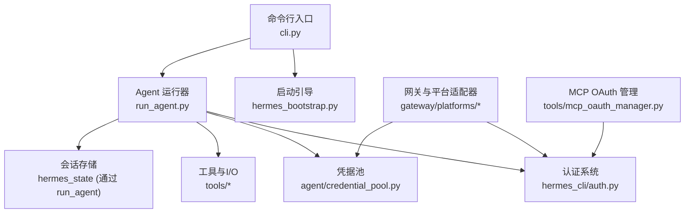
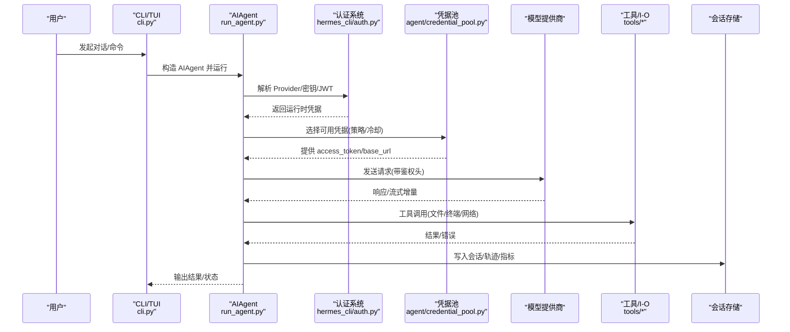
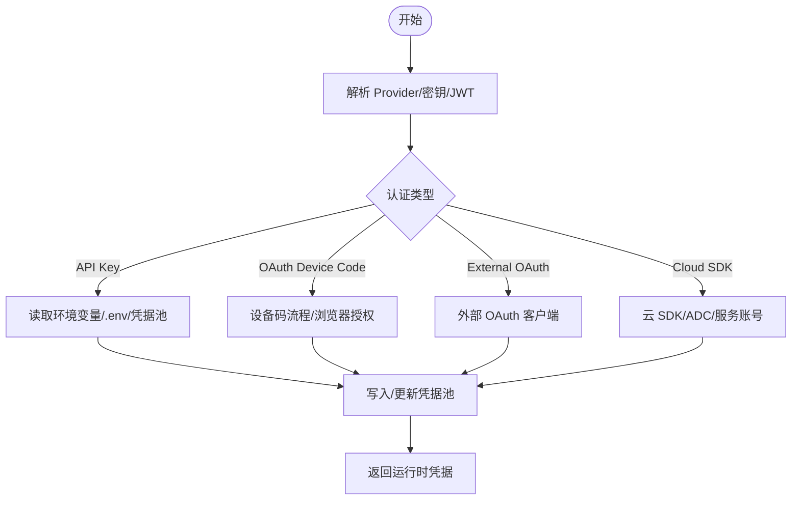
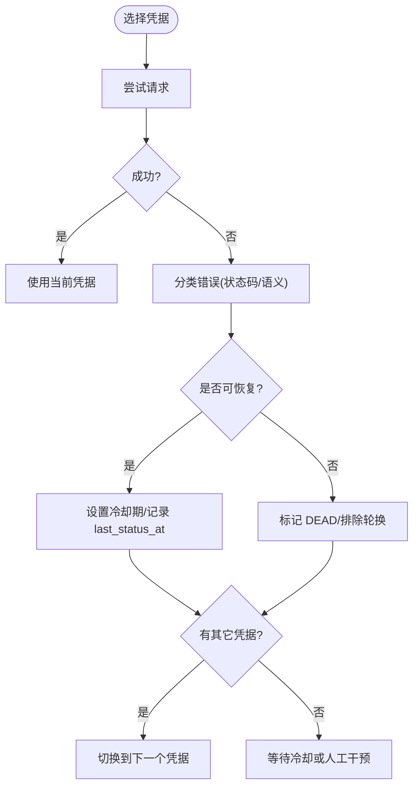
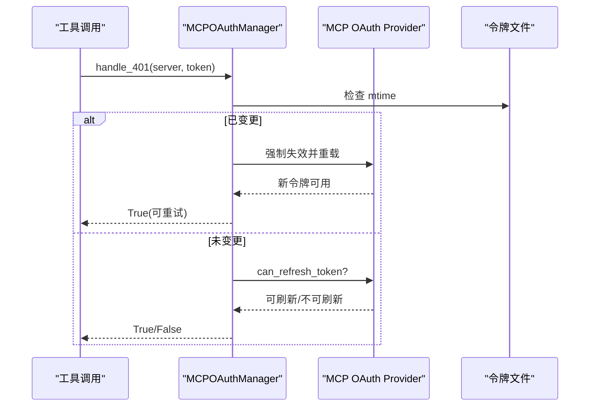
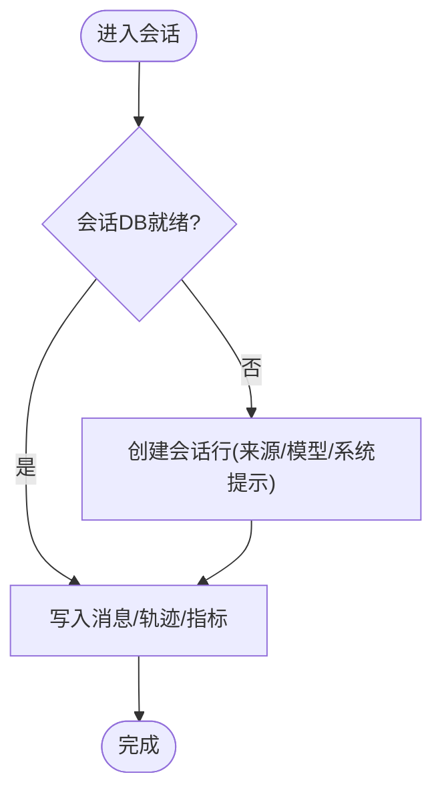
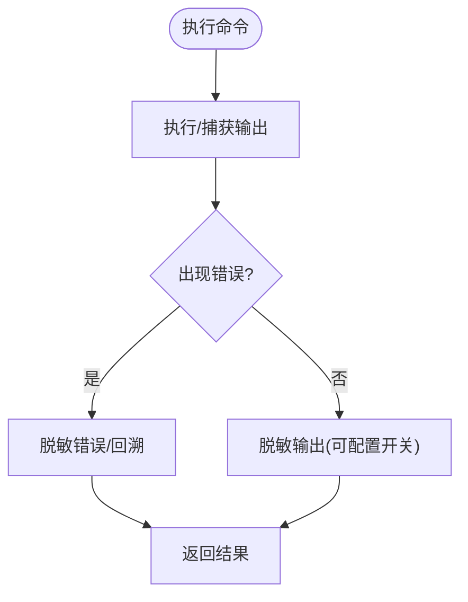
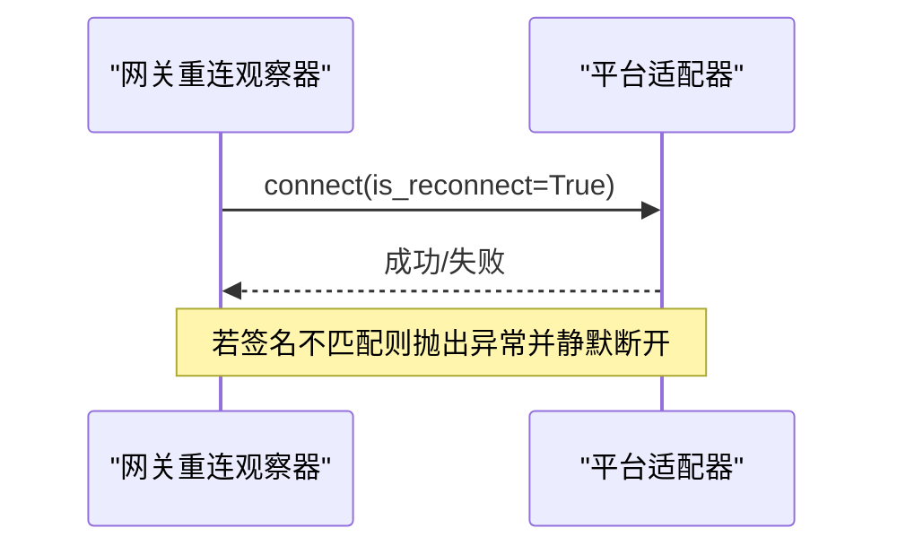
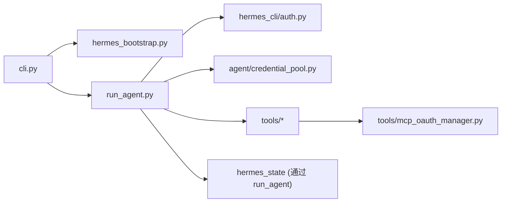

# 集成模式与示例

<cite>
**本文引用的文件**
- [README.md](file://README.md)
- [hermes_bootstrap.py](file://hermes_bootstrap.py)
- [cli.py](file://cli.py)
- [run_agent.py](file://run_agent.py)
- [hermes_cli/auth.py](file://hermes_cli/auth.py)
- [agent/credential_pool.py](file://agent/credential_pool.py)
- [tools/mcp_oauth_manager.py](file://tools/mcp_oauth_manager.py)
- [tests/tools/test_terminal_error_redaction.py](file://tests/tools/test_terminal_error_redaction.py)
- [tests/gateway/test_adapter_connect_is_reconnect_contract.py](file://tests/gateway/test_adapter_connect_is_reconnect_contract.py)
</cite>

## 目录
1. [简介](#简介)
2. [项目结构](#项目结构)
3. [核心组件](#核心组件)
4. [架构总览](#架构总览)
5. [详细组件分析](#详细组件分析)
6. [依赖关系分析](#依赖关系分析)
7. [性能考量](#性能考量)
8. [故障排除指南](#故障排除指南)
9. [结论](#结论)
10. [附录：端到端示例与最佳实践](#附录端到端示例与最佳实践)

## 简介
本文件面向“集成模式与示例”，聚焦 Hermes Agent 在以下方面的工程化实现：REST API 调用、数据库操作、文件处理、消息队列（平台适配器）、外部服务认证授权（OAuth、API Key、JWT）、异步与并发（任务调度、回调、重试）、集成测试方法与最佳实践，以及常见问题的定位与排障。内容基于仓库中的实际代码与测试用例进行提炼，并辅以流程图与时序图帮助理解。

## 项目结构
Hermes Agent 采用多入口、分层清晰的架构：
- 入口与引导：CLI/TUI、Gateway、Agent Runner、Bootstrap 等
- 认证与凭据：Provider 注册表、凭证池、MCP OAuth 管理器
- 工具与执行：工具集、终端工具、浏览器工具、文件/网络 I/O
- 平台与消息：各平台适配器（Telegram/Discord/Slack 等）
- 状态与持久化：会话数据库、轨迹、配置与环境变量
- 可观测性与监控：日志、遥测、健康检查

图表来源
- [cli.py:15-24](file://cli.py#L15-L24)
- [hermes_bootstrap.py:15-48](file://hermes_bootstrap.py#L15-L48)
- [run_agent.py:106-175](file://run_agent.py#L106-L175)
- [hermes_cli/auth.py:190-507](file://hermes_cli/auth.py#L190-L507)
- [agent/credential_pool.py:633-714](file://agent/credential_pool.py#L633-L714)
- [tools/mcp_oauth_manager.py:446-500](file://tools/mcp_oauth_manager.py#L446-L500)

章节来源
- [README.md:105-184](file://README.md#L105-L184)
- [cli.py:15-24](file://cli.py#L15-L24)
- [hermes_bootstrap.py:15-48](file://hermes_bootstrap.py#L15-L48)

## 核心组件
- 启动引导：Windows UTF-8 标准化、路径安全、惰性安装目标激活
- 认证系统：Provider 注册表、设备码 OAuth、API Key、JWT、外部 OAuth 适配
- 凭据池：多凭据轮换、冷却期、死标记、策略选择（填充优先/轮询/随机/最少使用）
- MCP OAuth 管理器：跨进程令牌刷新、401 去重、连接信号
- Agent 运行器：会话生命周期、上下文压缩、轨迹保存、错误分类与重试
- 平台适配器：统一 connect() 契约（含 is_reconnect），支持断线重连

章节来源
- [hermes_bootstrap.py:59-122](file://hermes_bootstrap.py#L59-L122)
- [hermes_cli/auth.py:190-507](file://hermes_cli/auth.py#L190-L507)
- [agent/credential_pool.py:68-151](file://agent/credential_pool.py#L68-L151)
- [tools/mcp_oauth_manager.py:446-500](file://tools/mcp_oauth_manager.py#L446-L500)
- [run_agent.py:412-596](file://run_agent.py#L412-L596)
- [tests/gateway/test_adapter_connect_is_reconnect_contract.py:1-145](file://tests/gateway/test_adapter_connect_is_reconnect_contract.py#L1-L145)

## 架构总览
下图展示从 CLI/Gateway 到模型提供商的调用链，包含认证、凭据池、工具执行与状态持久化。

图表来源
- [cli.py:15-24](file://cli.py#L15-L24)
- [run_agent.py:412-596](file://run_agent.py#L412-L596)
- [hermes_cli/auth.py:190-507](file://hermes_cli/auth.py#L190-L507)
- [agent/credential_pool.py:633-714](file://agent/credential_pool.py#L633-L714)

## 详细组件分析

### 认证与授权（OAuth、API Key、JWT）
- Provider 注册表集中声明不同提供商的认证类型、默认端点、环境变量键与可选覆盖项
- 支持设备码 OAuth（Nous Portal、xAI、Qwen、MiniMax 等）、外部 OAuth、API Key、AWS SDK/Vertex/Azure 等云原生认证
- JWT 用于 Nous Invoke 场景；访问令牌刷新与过期前倾斜提前刷新
- 凭据池负责多凭据轮换、冷却期、死标记与策略选择

图表来源
- [hermes_cli/auth.py:190-507](file://hermes_cli/auth.py#L190-L507)
- [agent/credential_pool.py:185-290](file://agent/credential_pool.py#L185-L290)

章节来源
- [hermes_cli/auth.py:190-507](file://hermes_cli/auth.py#L190-L507)
- [agent/credential_pool.py:185-290](file://agent/credential_pool.py#L185-L290)

### 凭据池与失败恢复（冷却、轮换、死标记）
- 支持多种策略：fill_first、round_robin、random、least_used
- 根据 HTTP 状态码与错误语义设置冷却时间（401/429/402/通用）
- 对“唯一凭据”场景缩短冷却，避免长时间不可用
- 识别“终态认证失败”（如 token_invalidated/revoked），标记 DEAD 并等待显式修复

图表来源
- [agent/credential_pool.py:68-151](file://agent/credential_pool.py#L68-L151)
- [agent/credential_pool.py:310-435](file://agent/credential_pool.py#L310-L435)
- [agent/credential_pool.py:770-800](file://agent/credential_pool.py#L770-L800)

章节来源
- [agent/credential_pool.py:68-151](file://agent/credential_pool.py#L68-L151)
- [agent/credential_pool.py:310-435](file://agent/credential_pool.py#L310-L435)
- [agent/credential_pool.py:770-800](file://agent/credential_pool.py#L770-L800)

### MCP OAuth 管理器（跨进程刷新、401 去重、重连信号）
- 单例管理器维护每个 MCP 服务器的 OAuth 提供者实例
- 磁盘 mtime 监听：外部进程刷新令牌后，下次认证流程自动重载
- 401 去重：同一 access_token 的多并发 401 仅触发一次恢复，其余等待结果
- 预取元数据：冷启动时加载/发现 OAuth 元数据，减少全量重新授权

图表来源
- [tools/mcp_oauth_manager.py:446-500](file://tools/mcp_oauth_manager.py#L446-L500)
- [tools/mcp_oauth_manager.py:637-760](file://tools/mcp_oauth_manager.py#L637-L760)

章节来源
- [tools/mcp_oauth_manager.py:446-500](file://tools/mcp_oauth_manager.py#L446-L500)
- [tools/mcp_oauth_manager.py:637-760](file://tools/mcp_oauth_manager.py#L637-L760)

### 会话与数据库操作（持久化、轨迹、指标）
- 首次使用时创建会话行，记录来源、模型、系统提示、工作目录、配置快照
- 消息写入持久化前打标记，避免重复写入；清理临时脚手架消息
- 轨迹保存、用量统计、成本估算、上下文压缩等由 Agent 协调

图表来源
- [run_agent.py:598-665](file://run_agent.py#L598-L665)
- [run_agent.py:226-279](file://run_agent.py#L226-L279)

章节来源
- [run_agent.py:598-665](file://run_agent.py#L598-L665)
- [run_agent.py:226-279](file://run_agent.py#L226-L279)

### 文件处理与终端工具（安全与脱敏）
- 终端工具在执行前后对输出/错误进行敏感信息脱敏，防止密钥泄露
- 支持前台/后台执行、超时控制、环境隔离与清理
- 错误路径确保异常文本与回溯同样被脱敏

图表来源
- [tests/tools/test_terminal_error_redaction.py:47-154](file://tests/tools/test_terminal_error_redaction.py#L47-L154)

章节来源
- [tests/tools/test_terminal_error_redaction.py:47-154](file://tests/tools/test_terminal_error_redaction.py#L47-L154)

### 平台适配器与消息队列（统一重连契约）
- 所有平台适配器的 connect() 必须接受 is_reconnect 关键字参数，以支持网关的重连观察器
- 测试通过 AST 静态扫描确保契约一致性，避免静默断开

图表来源
- [tests/gateway/test_adapter_connect_is_reconnect_contract.py:1-145](file://tests/gateway/test_adapter_connect_is_reconnect_contract.py#L1-L145)

章节来源
- [tests/gateway/test_adapter_connect_is_reconnect_contract.py:1-145](file://tests/gateway/test_adapter_connect_is_reconnect_contract.py#L1-L145)

## 依赖关系分析
- 入口层：cli.py 引入 hermes_bootstrap 确保跨平台编码与路径安全
- 业务层：run_agent.py 聚合认证、凭据池、工具、状态持久化
- 认证层：hermes_cli/auth.py 提供 Provider 注册与密钥解析
- 凭据层：agent/credential_pool.py 提供多凭据管理与失败恢复
- 扩展层：tools/mcp_oauth_manager.py 为 MCP 场景提供专用 OAuth 管理
- 测试层：针对终端脱敏与适配器契约的回归测试保障稳定性

图表来源
- [cli.py:15-24](file://cli.py#L15-L24)
- [hermes_bootstrap.py:15-48](file://hermes_bootstrap.py#L15-L48)
- [run_agent.py:106-175](file://run_agent.py#L106-L175)
- [hermes_cli/auth.py:190-507](file://hermes_cli/auth.py#L190-L507)
- [agent/credential_pool.py:633-714](file://agent/credential_pool.py#L633-L714)
- [tools/mcp_oauth_manager.py:446-500](file://tools/mcp_oauth_manager.py#L446-L500)

章节来源
- [cli.py:15-24](file://cli.py#L15-L24)
- [hermes_bootstrap.py:15-48](file://hermes_bootstrap.py#L15-L48)
- [run_agent.py:106-175](file://run_agent.py#L106-L175)

## 性能考量
- 延迟优化：OpenAI SDK 懒加载、OpenRouter 元数据预热、上下文压缩阈值控制
- 并发与限流：凭据池策略、冷却期、401/429/402 差异化处理；MCP 401 去重
- I/O 安全：UTF-8 标准化、路径安全、敏感信息脱敏
- 资源管理：会话 DB 懒创建、轨迹与指标按需写入、日志节流

[本节为通用指导，无需具体文件引用]

## 故障排除指南
- 终端错误脱敏：确认错误与回溯中不包含真实密钥；可通过测试用例验证行为
- 适配器重连：确保 connect() 签名包含 is_reconnect；否则网关重连将失败
- 凭据耗尽：查看凭据池状态与冷却时间；必要时切换策略或补充凭据
- MCP OAuth：检查令牌文件 mtime 变化与 401 处理链路；必要时手动 reauth

章节来源
- [tests/tools/test_terminal_error_redaction.py:47-154](file://tests/tools/test_terminal_error_redaction.py#L47-L154)
- [tests/gateway/test_adapter_connect_is_reconnect_contract.py:1-145](file://tests/gateway/test_adapter_connect_is_reconnect_contract.py#L1-L145)
- [agent/credential_pool.py:310-435](file://agent/credential_pool.py#L310-L435)
- [tools/mcp_oauth_manager.py:637-760](file://tools/mcp_oauth_manager.py#L637-L760)

## 结论
Hermes Agent 提供了完善的集成能力：统一的认证抽象、健壮的凭据池、可扩展的工具与平台适配器、可靠的会话与状态持久化，以及完善的测试与故障恢复机制。通过这些组件，开发者可以高效地构建 REST API、数据库、文件、消息队列等多类集成场景，并在复杂环境下保持高可用与安全。

[本节为总结性内容，无需具体文件引用]

## 附录：端到端示例与最佳实践

- REST API 调用
  - 通过 Provider 注册表选择提供商，凭据池提供 access_token/base_url
  - 建议在 run_agent 中复用 OpenAI 兼容客户端，利用代理与超时配置
  - 参考路径：[run_agent.py:106-175](file://run_agent.py#L106-L175)、[hermes_cli/auth.py:190-507](file://hermes_cli/auth.py#L190-L507)

- 数据库操作
  - 会话 DB 懒创建与消息持久化，避免重复写入与污染上下文
  - 参考路径：[run_agent.py:598-665](file://run_agent.py#L598-L665)、[run_agent.py:226-279](file://run_agent.py#L226-L279)

- 文件处理
  - 终端工具输出/错误脱敏，保证密钥不泄露；支持前台/后台执行
  - 参考路径：[tests/tools/test_terminal_error_redaction.py:47-154](file://tests/tools/test_terminal_error_redaction.py#L47-L154)

- 消息队列（平台适配器）
  - 统一 connect() 契约，支持 is_reconnect；网关重连观察器驱动
  - 参考路径：[tests/gateway/test_adapter_connect_is_reconnect_contract.py:1-145](file://tests/gateway/test_adapter_connect_is_reconnect_contract.py#L1-L145)

- 异步与并发
  - 凭据池冷却与轮换、MCP 401 去重、OpenRouter 预热、上下文压缩
  - 参考路径：[agent/credential_pool.py:310-435](file://agent/credential_pool.py#L310-L435)、[tools/mcp_oauth_manager.py:637-760](file://tools/mcp_oauth_manager.py#L637-L760)

- 集成测试与最佳实践
  - 终端脱敏回归测试、适配器契约静态校验
  - 建议新增场景时补充对应单元测试与端到端用例
  - 参考路径：[tests/tools/test_terminal_error_redaction.py:47-154](file://tests/tools/test_terminal_error_redaction.py#L47-L154)、[tests/gateway/test_adapter_connect_is_reconnect_contract.py:1-145](file://tests/gateway/test_adapter_connect_is_reconnect_contract.py#L1-L145)