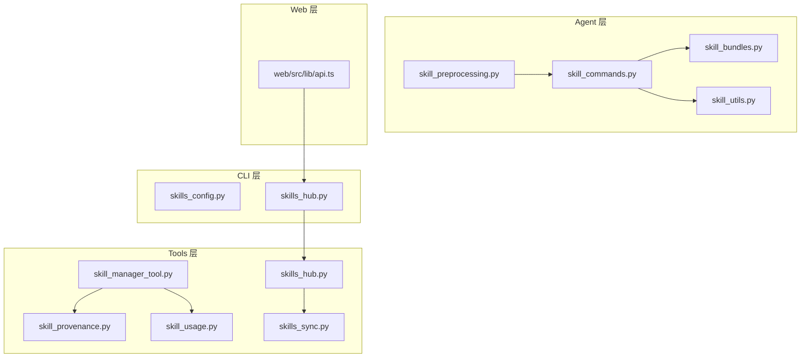
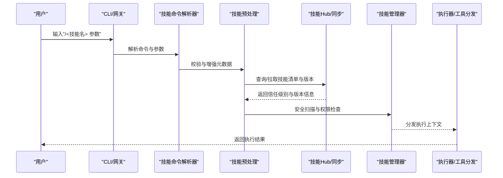
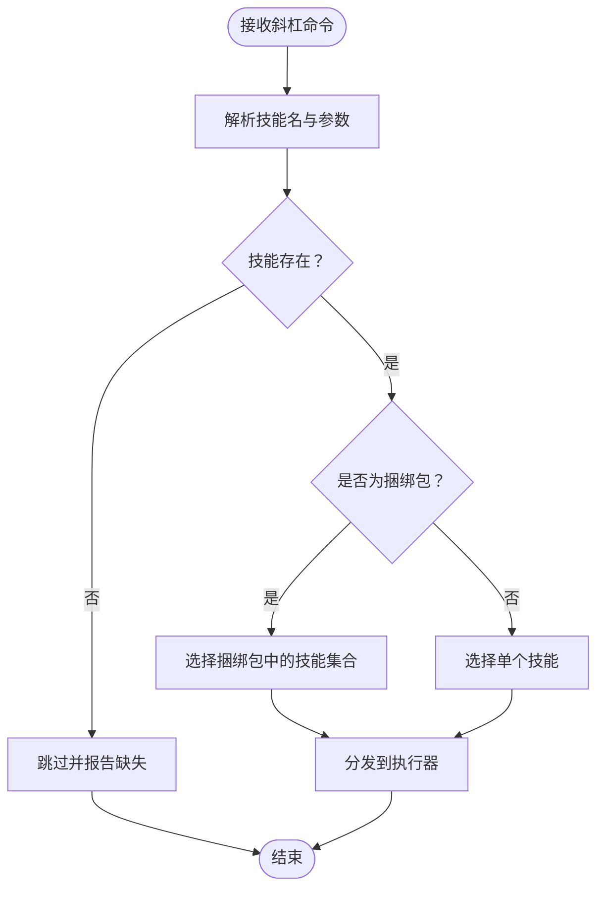
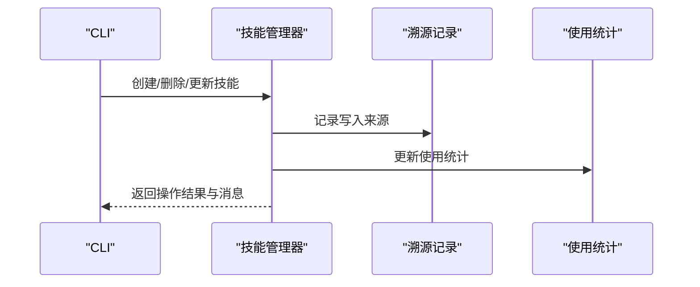
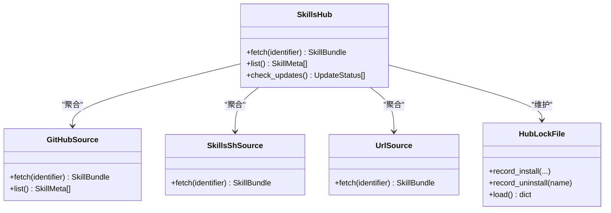
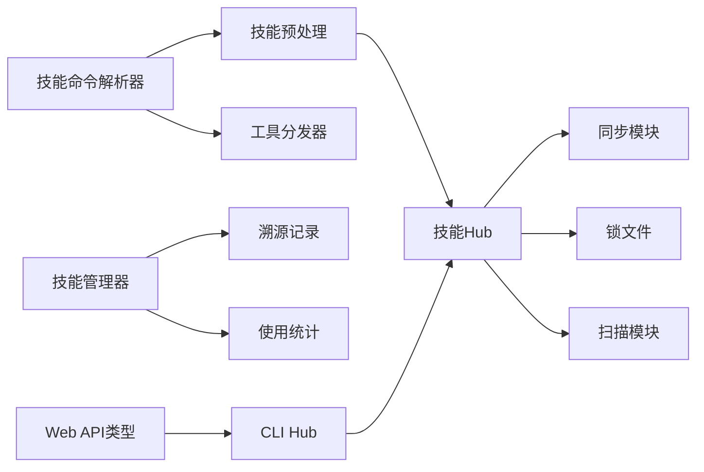

# 技能架构

<cite>
**本文档引用的文件**
- [agent/skill_bundles.py](file://agent/skill_bundles.py)
- [agent/skill_commands.py](file://agent/skill_commands.py)
- [agent/skill_preprocessing.py](file://agent/skill_preprocessing.py)
- [agent/skill_utils.py](file://agent/skill_utils.py)
- [tools/skill_manager_tool.py](file://tools/skill_manager_tool.py)
- [tools/skill_provenance.py](file://tools/skill_provenance.py)
- [tools/skill_usage.py](file://tools/skill_usage.py)
- [tools/skills_hub.py](file://tools/skills_hub.py)
- [tools/skills_sync.py](file://tools/skills_sync.py)
- [hermes_cli/skills_config.py](file://hermes_cli/skills_config.py)
- [hermes_cli/skills_hub.py](file://hermes_cli/skills_hub.py)
- [tests/tools/test_skill_manager_tool.py](file://tests/tools/test_skill_manager_tool.py)
- [tests/agent/test_skill_bundles.py](file://tests/agent/test_skill_bundles.py)
- [tests/agent/test_skill_commands.py](file://tests/agent/test_skill_commands.py)
- [tests/agent/test_skill_utils.py](file://tests/agent/test_skill_utils.py)
- [website/docs/user-guide/skills/bundled/software-development/software-development-hermes-agent-skill-authoring.md](file://website/docs/user-guide/skills/bundled/software-development/software-development-hermes-agent-skill-authoring.md)
- [website/i18n/zh-Hans/docusaurus-plugin-content-docs/current/user-guide/features/skills.md](file://website/i18n/zh-Hans/docusaurus-plugin-content-docs/current/user-guide/features/skills.md)
- [web/src/lib/api.ts](file://web/src/lib/api.ts)
</cite>

## 目录
1. [引言](#引言)
2. [项目结构](#项目结构)
3. [核心组件](#核心组件)
4. [架构总览](#架构总览)
5. [详细组件分析](#详细组件分析)
6. [依赖分析](#依赖分析)
7. [性能考量](#性能考量)
8. [故障排除指南](#故障排除指南)
9. [结论](#结论)
10. [附录](#附录)

## 引言
本文件面向开发者，系统化阐述 Hermes Agent 技能架构的设计与实现，覆盖技能定义格式、执行器架构、分发机制、加载与注册流程、生命周期管理、预处理与命令解析、执行上下文、配置与元数据管理、版本控制与安全扫描等主题。文档以代码级事实为基础，结合架构图与序列图，帮助读者快速理解并高效扩展技能系统。

## 项目结构
技能系统围绕“技能定义”“加载与注册”“命令解析与分发”“执行上下文”“生命周期管理”“同步与版本控制”“安全与信任”等模块协同工作。关键目录与文件如下：
- agent 层：技能命令解析、预处理、工具分发辅助
- tools 层：技能管理、使用统计、Hub 同步、锁文件与扫描
- hermes_cli 层：CLI 级别的技能配置与 Hub 交互
- web 层：前端 API 类型定义（用于 Hub 与扫描结果）
- tests 层：端到端与单元测试，验证行为与边界条件

图表来源
- [agent/skill_bundles.py](file://agent/skill_bundles.py)
- [agent/skill_commands.py](file://agent/skill_commands.py)
- [agent/skill_preprocessing.py](file://agent/skill_preprocessing.py)
- [agent/skill_utils.py](file://agent/skill_utils.py)
- [tools/skill_manager_tool.py](file://tools/skill_manager_tool.py)
- [tools/skill_provenance.py](file://tools/skill_provenance.py)
- [tools/skill_usage.py](file://tools/skill_usage.py)
- [tools/skills_hub.py](file://tools/skills_hub.py)
- [tools/skills_sync.py](file://tools/skills_sync.py)
- [hermes_cli/skills_config.py](file://hermes_cli/skills_config.py)
- [hermes_cli/skills_hub.py](file://hermes_cli/skills_hub.py)
- [web/src/lib/api.ts](file://web/src/lib/api.ts)

章节来源
- [agent/skill_bundles.py](file://agent/skill_bundles.py)
- [agent/skill_commands.py](file://agent/skill_commands.py)
- [agent/skill_preprocessing.py](file://agent/skill_preprocessing.py)
- [agent/skill_utils.py](file://agent/skill_utils.py)
- [tools/skill_manager_tool.py](file://tools/skill_manager_tool.py)
- [tools/skill_provenance.py](file://tools/skill_provenance.py)
- [tools/skill_usage.py](file://tools/skill_usage.py)
- [tools/skills_hub.py](file://tools/skills_hub.py)
- [tools/skills_sync.py](file://tools/skills_sync.py)
- [hermes_cli/skills_config.py](file://hermes_cli/skills_config.py)
- [hermes_cli/skills_hub.py](file://hermes_cli/skills_hub.py)
- [web/src/lib/api.ts](file://web/src/lib/api.ts)

## 核心组件
- 技能命令解析与分发：负责将用户输入映射到具体技能，并进行参数校验与路由。
- 技能预处理：对技能元数据与输入进行清洗、校验与增强。
- 技能工具分发：将技能请求转换为可执行的工具调用，桥接 Agent 执行层。
- 技能管理与生命周期：创建、删除、更新、扫描、使用统计与溯源记录。
- 技能 Hub 与同步：从多源拉取技能清单、版本与内容，维护锁文件与信任级别。
- 配置与元数据：集中管理技能配置、类别、信任等级、版本策略等。

章节来源
- [agent/skill_commands.py](file://agent/skill_commands.py)
- [agent/skill_preprocessing.py](file://agent/skill_preprocessing.py)
- [agent/skill_utils.py](file://agent/skill_utils.py)
- [tools/skill_manager_tool.py](file://tools/skill_manager_tool.py)
- [tools/skill_provenance.py](file://tools/skill_provenance.py)
- [tools/skill_usage.py](file://tools/skill_usage.py)
- [tools/skills_hub.py](file://tools/skills_hub.py)
- [tools/skills_sync.py](file://tools/skills_sync.py)
- [hermes_cli/skills_config.py](file://hermes_cli/skills_config.py)

## 架构总览
技能系统采用“命令解析—预处理—工具分发—执行—反馈”的流水线式架构。CLI/TUI/网关层统一通过命令入口进入，经由技能命令解析器选择目标技能或技能捆绑包；随后进行预处理与安全扫描；最终通过工具分发器执行并返回结果。

图表来源
- [agent/skill_commands.py](file://agent/skill_commands.py)
- [agent/skill_preprocessing.py](file://agent/skill_preprocessing.py)
- [tools/skills_hub.py](file://tools/skills_hub.py)
- [tools/skill_manager_tool.py](file://tools/skill_manager_tool.py)
- [agent/skill_utils.py](file://agent/skill_utils.py)

## 详细组件分析

### 技能命令解析与分发
- 职责：将用户输入的斜杠命令解析为技能名称与参数，支持技能捆绑包与别名解析。
- 关键点：
  - 命令扁平化：在某些平台（如 Discord）注册为单一命令而非分组子命令，便于统一调度。
  - 冲突与优先级：当 slug 冲突时，捆绑包优先于单个技能。
  - 缺失技能容错：捆绑包中缺失的技能会被跳过，不导致致命错误。
  - 生命周期：命令解析后进入执行阶段，不影响 prompt 缓存。

图表来源
- [agent/skill_commands.py](file://agent/skill_commands.py)
- [website/i18n/zh-Hans/docusaurus-plugin-content-docs/current/user-guide/features/skills.md](file://website/i18n/zh-Hans/docusaurus-plugin-content-docs/current/user-guide/features/skills.md)

章节来源
- [agent/skill_commands.py](file://agent/skill_commands.py)
- [website/i18n/zh-Hans/docusaurus-plugin-content-docs/current/user-guide/features/skills.md](file://website/i18n/zh-Hans/docusaurus-plugin-content-docs/current/user-guide/features/skills.md)

### 技能预处理与元数据
- 职责：清洗、校验与增强技能元数据，确保后续执行一致性与安全性。
- 关键点：
  - 元数据字段校验：名称、描述长度限制、内容大小限制等。
  - 交叉引用合并：合并仓库内与用户目录下的技能树，优先仓库内技能。
  - 缓存与增量：技能视图/列表在当前会话内可能有缓存，需新开会话才可见新增技能。

章节来源
- [agent/skill_preprocessing.py](file://agent/skill_preprocessing.py)
- [website/docs/user-guide/skills/bundled/software-development/software-development-hermes-agent-skill-authoring.md](file://website/docs/user-guide/skills/bundled/software-development/software-development-hermes-agent-skill-authoring.md)

### 技能工具分发与执行上下文
- 职责：将技能请求转换为可执行的工具调用，注入执行上下文（如环境变量、权限、超时等）。
- 关键点：
  - 工具分发器：将技能命令映射到具体工具实现。
  - 上下文隔离：确保执行环境与资源隔离，避免跨技能污染。
  - 错误传播：执行失败时保留原始错误并提供诊断信息。

章节来源
- [agent/skill_utils.py](file://agent/skill_utils.py)

### 技能生命周期管理
- 创建/删除/更新：通过技能管理器进行，支持“吸收删除”（将窄技能删除并合并到目标技能）。
- 使用统计：记录技能使用情况，包含创建来源标记（如后台评审）。
- 溯源与审计：记录写入来源（如后台评审），便于审计与回溯。

图表来源
- [tools/skill_manager_tool.py](file://tools/skill_manager_tool.py)
- [tools/skill_provenance.py](file://tools/skill_provenance.py)
- [tools/skill_usage.py](file://tools/skill_usage.py)
- [tests/tools/test_skill_manager_tool.py](file://tests/tools/test_skill_manager_tool.py)

章节来源
- [tools/skill_manager_tool.py](file://tools/skill_manager_tool.py)
- [tools/skill_provenance.py](file://tools/skill_provenance.py)
- [tools/skill_usage.py](file://tools/skill_usage.py)
- [tests/tools/test_skill_manager_tool.py](file://tests/tools/test_skill_manager_tool.py)

### 技能 Hub 与版本控制
- 多源聚合：支持 GitHub、Skills.sh、URL 源等，URL 源优先于 GitHub 源。
- 版本解析：优先下载解析出的标识符，若失败则回退到版本列表。
- 锁文件：记录已安装技能的来源、信任级别、内容哈希、安装时间与文件清单。
- 扫描与信任：根据信任级别与扫描结果决定安装策略（允许/询问/阻止）。

图表来源
- [tools/skills_hub.py](file://tools/skills_hub.py)
- [tools/skills_sync.py](file://tools/skills_sync.py)
- [hermes_cli/skills_hub.py](file://hermes_cli/skills_hub.py)
- [web/src/lib/api.ts](file://web/src/lib/api.ts)

章节来源
- [tools/skills_hub.py](file://tools/skills_hub.py)
- [tools/skills_sync.py](file://tools/skills_sync.py)
- [hermes_cli/skills_hub.py](file://hermes_cli/skills_hub.py)
- [web/src/lib/api.ts](file://web/src/lib/api.ts)

### 技能捆绑包与类别管理
- 捆绑包：将多个技能组合为单一命令入口，便于复用与团队发布。
- 类别与侧车：支持从侧车文件（skills.sh.json）推断技能类别，增强索引与展示。
- 优先级与容错：slug 冲突时捆绑包优先；缺失技能会被跳过。

章节来源
- [agent/skill_bundles.py](file://agent/skill_bundles.py)
- [tests/agent/test_skill_bundles.py](file://tests/agent/test_skill_bundles.py)
- [website/i18n/zh-Hans/docusaurus-plugin-content-docs/current/user-guide/features/skills.md](file://website/i18n/zh-Hans/docusaurus-plugin-content-docs/current/user-guide/features/skills.md)

### 技能配置系统
- 集中式配置：通过 CLI 配置模块管理技能相关策略（如安全扫描开关）。
- 与 Hub 集成：CLI 层与 Hub 层协同，提供安装、卸载、更新与扫描能力。

章节来源
- [hermes_cli/skills_config.py](file://hermes_cli/skills_config.py)
- [hermes_cli/skills_hub.py](file://hermes_cli/skills_hub.py)

## 依赖分析
- 组件耦合：
  - 技能命令解析器依赖技能工具分发器与预处理器。
  - 技能管理器依赖溯源与使用统计模块。
  - Hub 与同步模块依赖锁文件与扫描模块。
- 外部依赖：
  - HTTP 客户端用于访问 GitHub/Skills.sh/URL 源。
  - 前端 API 类型用于 Hub 与扫描结果的数据契约。

图表来源
- [agent/skill_commands.py](file://agent/skill_commands.py)
- [agent/skill_preprocessing.py](file://agent/skill_preprocessing.py)
- [agent/skill_utils.py](file://agent/skill_utils.py)
- [tools/skill_manager_tool.py](file://tools/skill_manager_tool.py)
- [tools/skill_provenance.py](file://tools/skill_provenance.py)
- [tools/skill_usage.py](file://tools/skill_usage.py)
- [tools/skills_hub.py](file://tools/skills_hub.py)
- [tools/skills_sync.py](file://tools/skills_sync.py)
- [hermes_cli/skills_hub.py](file://hermes_cli/skills_hub.py)
- [web/src/lib/api.ts](file://web/src/lib/api.ts)

章节来源
- [agent/skill_commands.py](file://agent/skill_commands.py)
- [agent/skill_preprocessing.py](file://agent/skill_preprocessing.py)
- [agent/skill_utils.py](file://agent/skill_utils.py)
- [tools/skill_manager_tool.py](file://tools/skill_manager_tool.py)
- [tools/skill_provenance.py](file://tools/skill_provenance.py)
- [tools/skill_usage.py](file://tools/skill_usage.py)
- [tools/skills_hub.py](file://tools/skills_hub.py)
- [tools/skills_sync.py](file://tools/skills_sync.py)
- [hermes_cli/skills_hub.py](file://hermes_cli/skills_hub.py)
- [web/src/lib/api.ts](file://web/src/lib/api.ts)

## 性能考量
- 缓存与增量：技能视图/列表在当前会话内可能缓存，建议在新增技能后开启新会话以刷新。
- 并发与回退：Hub 拉取失败时自动回退到版本列表，减少重试开销。
- 扫描策略：默认关闭安全扫描以降低创建/更新延迟，可在需要时启用。

## 故障排除指南
- 命令未注册：当无可用技能时，平台上的 /skill 命令不会注册。
- 删除冲突：删除技能时若指定的吸收目标不存在，会返回错误并拒绝删除。
- 安全扫描：当未启用“仅代理创建”保护时，安全扫描会被短路跳过。
- 缓存不生效：新建技能在当前会话不可见属预期行为，重启会话后生效。

章节来源
- [tests/agent/test_skill_commands.py](file://tests/agent/test_skill_commands.py)
- [tests/tools/test_skill_manager_tool.py](file://tests/tools/test_skill_manager_tool.py)

## 结论
Hermes Agent 技能架构以“命令解析—预处理—工具分发—执行—反馈”为主线，结合 Hub 同步、锁文件与信任扫描，形成可扩展、可观测且安全的技能生态。通过捆绑包与类别侧车，系统在易用性与团队协作方面具备良好表现。开发者可基于现有模块扩展新技能、优化执行路径并完善安全策略。

## 附录
- 技能作者指南要点：遵循元数据规范、控制描述长度与内容大小、注意会话缓存行为。
- 捆绑包使用建议：在重复任务场景中优先使用捆绑包，便于团队发布与心智简化。

章节来源
- [website/docs/user-guide/skills/bundled/software-development/software-development-hermes-agent-skill-authoring.md](file://website/docs/user-guide/skills/bundled/software-development/software-development-hermes-agent-skill-authoring.md)
- [website/i18n/zh-Hans/docusaurus-plugin-content-docs/current/user-guide/features/skills.md](file://website/i18n/zh-Hans/docusaurus-plugin-content-docs/current/user-guide/features/skills.md)