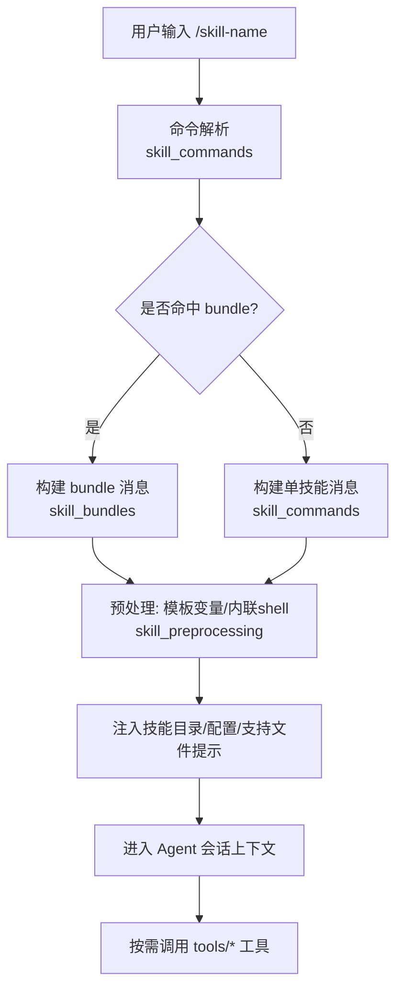
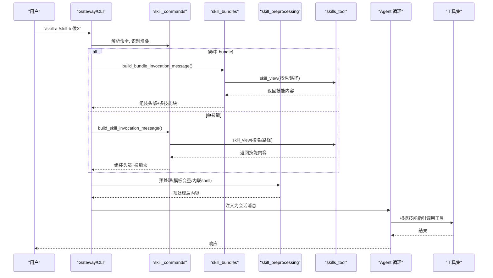
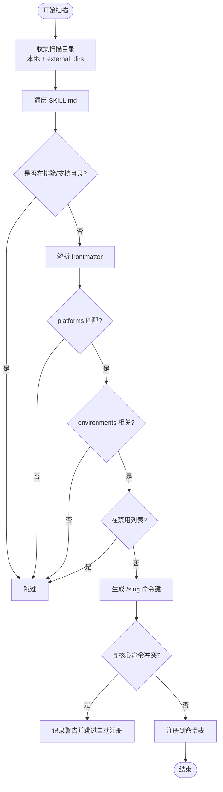
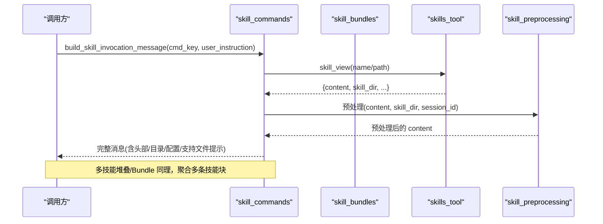
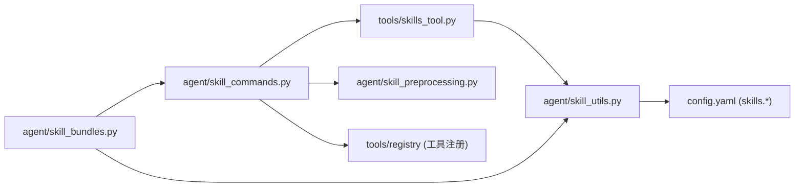

# 技能架构设计

<cite>
**本文引用的文件**
- [agent/skill_bundles.py](file://agent/skill_bundles.py)
- [agent/skill_commands.py](file://agent/skill_commands.py)
- [agent/skill_preprocessing.py](file://agent/skill_preprocessing.py)
- [agent/skill_utils.py](file://agent/skill_utils.py)
- [tools/skills_tool.py](file://tools/skills_tool.py)
- [skills/creative/architecture-diagram/SKILL.md](file://skills/creative/architecture-diagram/SKILL.md)
- [skills/github/github-code-review/SKILL.md](file://skills/github/github-code-review/SKILL.md)
</cite>

## 目录
1. [简介](#简介)
2. [项目结构](#项目结构)
3. [核心组件](#核心组件)
4. [架构总览](#架构总览)
5. [详细组件分析](#详细组件分析)
6. [依赖关系分析](#依赖关系分析)
7. [性能考量](#性能考量)
8. [故障排查指南](#故障排查指南)
9. [结论](#结论)
10. [附录](#附录)

## 简介
本文件系统性阐述 Hermes Agent 的“技能”体系：从元数据定义、目录与文件格式规范，到加载流程、执行上下文、工具调用接口、错误处理机制；并覆盖生命周期管理、版本控制、配置管理、安全隔离，以及与 Agent 核心的集成方式（注册、发现、调度、监控）和资源管理策略。目标是帮助开发者快速理解技能系统的设计与实现，并能安全地扩展新技能或组合技能。

## 项目结构
技能以目录为单位组织，每个技能根目录包含一个 SKILL.md（主指令），以及可选的支持文件目录（references、templates、scripts、assets）。技能通过统一的扫描与解析管线暴露为可发现的命令，支持单技能、多技能堆叠和“技能包”（bundle）一次性加载多个技能。

图表来源
- [agent/skill_commands.py:374-467](file://agent/skill_commands.py#L374-L467)
- [agent/skill_bundles.py:253-368](file://agent/skill_bundles.py#L253-L368)
- [agent/skill_preprocessing.py:128-145](file://agent/skill_preprocessing.py#L128-L145)

章节来源
- [tools/skills_tool.py:14-27](file://tools/skills_tool.py#L14-L27)
- [agent/skill_commands.py:374-467](file://agent/skill_commands.py#L374-L467)
- [agent/skill_bundles.py:168-205](file://agent/skill_bundles.py#L168-L205)

## 核心组件
- 技能清单与视图（tools/skills_tool.py）
  - 负责扫描 ~/.hermes/skills 及外部目录，解析 SKILL.md frontmatter，提供 skills_list 与 skill_view 等能力，支撑渐进式披露（先元数据，再全文，再关联文件）。
- 命令发现与消息构建（agent/skill_commands.py）
  - 扫描并注册 /skill-* 命令，支持堆叠调用（如 /a /b do X），构造带标记的用户消息，提取原始用户指令，避免记忆层污染。
- 技能包（agent/skill_bundles.py）
  - YAML 定义的“技能包”，一次加载多个技能，合并为一个用户消息，支持缺失/禁用技能的宽容处理。
- 预处理（agent/skill_preprocessing.py）
  - 模板变量替换（${HERMES_SKILL_DIR}, ${HERMES_SESSION_ID}）、内联 shell 片段执行（!`cmd`），输出长度限制与超时保护。
- 元数据与平台/环境匹配（agent/skill_utils.py）
  - frontmatter 解析、平台过滤（platforms）、环境相关性过滤（environments）、禁用列表、外部技能目录解析、条件字段提取、配置变量声明解析。

章节来源
- [tools/skills_tool.py:69-105](file://tools/skills_tool.py#L69-L105)
- [agent/skill_commands.py:23-65](file://agent/skill_commands.py#L23-L65)
- [agent/skill_bundles.py:1-41](file://agent/skill_bundles.py#L1-L41)
- [agent/skill_preprocessing.py:1-23](file://agent/skill_preprocessing.py#L1-L23)
- [agent/skill_utils.py:171-220](file://agent/skill_utils.py#L171-L220)

## 架构总览
技能系统围绕“发现—装载—预处理—注入—执行”的主线展开，贯穿 CLI、Gateway、Agent 循环与工具生态。

图表来源
- [agent/skill_commands.py:569-613](file://agent/skill_commands.py#L569-L613)
- [agent/skill_commands.py:665-744](file://agent/skill_commands.py#L665-L744)
- [agent/skill_bundles.py:253-368](file://agent/skill_bundles.py#L253-L368)
- [agent/skill_preprocessing.py:128-145](file://agent/skill_preprocessing.py#L128-L145)
- [tools/skills_tool.py:786-800](file://tools/skills_tool.py#L786-L800)

## 详细组件分析

### 技能元数据与目录规范
- 目录结构
  - 每个技能一个目录，根目录必须包含 SKILL.md。
  - 可选子目录：references（参考文档）、templates（模板）、scripts（脚本）、assets（资源）。
- SKILL.md 格式
  - 使用 YAML frontmatter 描述元数据：name、description、version、license、platforms、metadata.hermes.* 等。
  - 正文为技能说明与工作流程。
- 示例
  - 架构图生成技能：展示 frontmatter 与结构化说明。
  - GitHub 代码审查技能：展示前置条件、工作流与工具调用约定。

章节来源
- [tools/skills_tool.py:14-27](file://tools/skills_tool.py#L14-L27)
- [skills/creative/architecture-diagram/SKILL.md:1-13](file://skills/creative/architecture-diagram/SKILL.md#L1-L13)
- [skills/github/github-code-review/SKILL.md:1-12](file://skills/github/github-code-review/SKILL.md#L1-L12)

### 技能发现与注册
- 扫描范围
  - 本地技能目录 ~/.hermes/skills，以及通过配置 external_dirs 指定的外部目录。
  - 跳过排除目录与支持目录（references/templates/scripts/assets）作为独立技能根。
- 过滤规则
  - 平台过滤：frontmatter.platforms 与当前 OS 匹配。
  - 环境相关性过滤：frontmatter.environments（kanban/docker/s6）用于“呈现期”过滤，不影响显式加载。
  - 禁用列表：config.yaml 中 skills.disabled 与 platform_disabled。
- 命令键生成
  - 将 name 规范化为 slug（小写、空格/下划线转连字符、去除非法字符），形成 /slug 命令键。
  - 与核心命令冲突时自动跳过自动注册，但仍可通过 /skill <name> 加载。

图表来源
- [agent/skill_commands.py:374-467](file://agent/skill_commands.py#L374-L467)
- [agent/skill_utils.py:102-148](file://agent/skill_utils.py#L102-L148)
- [agent/skill_utils.py:226-271](file://agent/skill_utils.py#L226-L271)
- [agent/skill_utils.py:351-387](file://agent/skill_utils.py#L351-L387)
- [agent/skill_utils.py:436-471](file://agent/skill_utils.py#L436-L471)

章节来源
- [agent/skill_commands.py:374-467](file://agent/skill_commands.py#L374-L467)
- [agent/skill_utils.py:499-579](file://agent/skill_utils.py#L499-L579)

### 技能加载与消息构建
- 单技能加载
  - 通过 skill_view 获取技能内容，注入技能目录、已解析的配置值、支持文件提示，附加用户指令与运行时备注。
- 多技能堆叠
  - 支持连续多个 /skill 前缀，最多堆叠固定数量，统一复用 bundle 风格的标记以便记忆层正确提取用户指令。
- 技能包（bundle）
  - YAML 定义一组技能，按顺序加载，合并为一个用户消息；缺失/禁用技能会报告但不会中断。

图表来源
- [agent/skill_commands.py:569-613](file://agent/skill_commands.py#L569-L613)
- [agent/skill_commands.py:665-744](file://agent/skill_commands.py#L665-L744)
- [agent/skill_bundles.py:253-368](file://agent/skill_bundles.py#L253-L368)
- [agent/skill_preprocessing.py:128-145](file://agent/skill_preprocessing.py#L128-L145)

章节来源
- [agent/skill_commands.py:192-229](file://agent/skill_commands.py#L192-L229)
- [agent/skill_commands.py:271-371](file://agent/skill_commands.py#L271-L371)
- [agent/skill_bundles.py:253-368](file://agent/skill_bundles.py#L253-L368)

### 预处理与执行上下文
- 模板变量替换
  - 支持 ${HERMES_SKILL_DIR}、${HERMES_SESSION_ID}，未解析的占位符保留原样便于调试。
- 内联 Shell
  - 支持 !`cmd` 语法，在技能目录下执行，限制输出长度与超时，失败时返回友好错误标记。
- 执行上下文
  - 注入绝对技能目录，指导相对路径解析；注入已解析的技能配置值；附带支持文件清单与加载方式。

章节来源
- [agent/skill_preprocessing.py:39-62](file://agent/skill_preprocessing.py#L39-L62)
- [agent/skill_preprocessing.py:65-103](file://agent/skill_preprocessing.py#L65-L103)
- [agent/skill_commands.py:296-361](file://agent/skill_commands.py#L296-L361)

### 工具调用接口与错误处理
- 工具调用
  - 技能通过 Agent 的工具生态（tools/*）完成实际动作（终端、文件、网络等），技能本身不直接执行系统命令。
- 错误处理
  - 预处理阶段对异常进行容错（如 bash 缺失、超时、live-system guard 拦截），返回短错误信息，不中断整体加载。
  - 技能加载失败（无法解析或不存在）会被记录并跳过，保证命令发现鲁棒性。

章节来源
- [agent/skill_preprocessing.py:65-103](file://agent/skill_preprocessing.py#L65-L103)
- [agent/skill_commands.py:374-467](file://agent/skill_commands.py#L374-L467)

### 生命周期管理、版本控制与配置管理
- 生命周期
  - 扫描→过滤→注册→加载→预处理→注入→执行→统计（使用计数）。
  - 支持热重载：reload_skills/reload_bundles 基于 mtime 增量刷新。
- 版本控制
  - SKILL.md frontmatter 中的 version 字段标识版本；建议配合 Git 管理技能变更。
- 配置管理
  - 技能可在 frontmatter 声明所需配置项（metadata.hermes.config），系统在加载时注入已解析的值，降低技能作者读取配置的复杂度。
  - 全局/平台级禁用列表通过 config.yaml 管理。

章节来源
- [agent/skill_commands.py:485-547](file://agent/skill_commands.py#L485-L547)
- [agent/skill_bundles.py:221-244](file://agent/skill_bundles.py#L221-L244)
- [agent/skill_utils.py:701-757](file://agent/skill_utils.py#L701-L757)
- [tools/skills_tool.py:292-334](file://tools/skills_tool.py#L292-L334)

### 安全隔离与权限
- 路径安全
  - 技能名称与 file_path 校验防止路径穿越；仅允许在受信任的技能根目录内访问。
- 平台与环境隔离
  - platforms/environments 控制可见性与可用性；外部技能目录视为只读生命周期维护边界。
- 敏感信息
  - 内联 shell 输出截断；错误信息脱敏；非交互网关环境下无法采集密钥时给出引导提示。

章节来源
- [tools/skills_tool.py:180-204](file://tools/skills_tool.py#L180-L204)
- [agent/skill_utils.py:658-675](file://agent/skill_utils.py#L658-L675)
- [tools/skills_tool.py:406-481](file://tools/skills_tool.py#L406-L481)

### 与 Agent 核心的集成、事件通信与资源管理
- 集成点
  - Gateway/CLI 将技能消息注入会话；Agent 循环依据技能指引调用工具；Curator 跟踪技能使用情况。
- 事件通信
  - 通过会话消息与工具结果进行通信；技能消息带有特定标记，便于记忆层提取真实用户指令。
- 资源管理
  - 支持文件按需加载；内联 shell 有超时与输出上限；缓存技能扫描结果以减少启动开销。

章节来源
- [agent/skill_commands.py:73-97](file://agent/skill_commands.py#L73-L97)
- [tools/skills_tool.py:91-105](file://tools/skills_tool.py#L91-L105)
- [agent/skill_preprocessing.py:21-23](file://agent/skill_preprocessing.py#L21-L23)

## 依赖关系分析

图表来源
- [tools/skills_tool.py:84-87](file://tools/skills_tool.py#L84-L87)
- [agent/skill_commands.py:15-19](file://agent/skill_commands.py#L15-L19)
- [agent/skill_bundles.py:286-290](file://agent/skill_bundles.py#L286-L290)
- [agent/skill_utils.py:499-579](file://agent/skill_utils.py#L499-L579)

章节来源
- [tools/skills_tool.py:84-87](file://tools/skills_tool.py#L84-L87)
- [agent/skill_commands.py:15-19](file://agent/skill_commands.py#L15-L19)
- [agent/skill_bundles.py:286-290](file://agent/skill_bundles.py#L286-L290)

## 性能考量
- 扫描缓存
  - 技能列表按目录签名与 TTL 缓存，减少重复扫描成本。
- 轻量导入
  - 关键模块延迟导入，避免启动时加载重型依赖。
- 输出限制
  - 内联 shell 输出截断，防止上下文爆炸。
- 配置缓存
  - 配置读取基于 mtime+size 缓存，避免频繁 YAML 解析。

章节来源
- [tools/skills_tool.py:91-105](file://tools/skills_tool.py#L91-L105)
- [agent/skill_bundles.py:195-205](file://agent/skill_bundles.py#L195-L205)
- [agent/skill_preprocessing.py:21-23](file://agent/skill_preprocessing.py#L21-L23)
- [agent/skill_utils.py:393-433](file://agent/skill_utils.py#L393-L433)

## 故障排查指南
- 技能未出现在命令列表
  - 检查 frontmatter.platforms 是否与当前平台匹配；检查 environments 是否相关；确认未被禁用。
- 加载失败或内容异常
  - 查看日志中的 YAML 解析错误或 IO 异常；确认 SKILL.md 编码（UTF-8，无 BOM）。
- 内联 shell 执行失败
  - 确认 bash 可用；检查超时设置；查看错误标记输出。
- Bundle 部分技能缺失
  - 缺失技能会在头部列出；确认技能已安装且未被禁用。

章节来源
- [agent/skill_commands.py:374-467](file://agent/skill_commands.py#L374-L467)
- [agent/skill_bundles.py:253-368](file://agent/skill_bundles.py#L253-L368)
- [agent/skill_preprocessing.py:65-103](file://agent/skill_preprocessing.py#L65-L103)

## 结论
Hermes 技能系统通过标准化的元数据与目录规范、健壮的发现与加载管线、灵活的预处理机制，以及严格的安全与性能保障，实现了可扩展、可组合、可观测的技能生态。开发者可以基于此快速创建、发布与管理技能，并通过 bundle 与堆叠调用提升任务编排效率。

## 附录
- 最佳实践
  - 明确 frontmatter 元数据，合理声明 platforms/environments。
  - 使用 references/templates/scripts 组织支持资源，保持 SKILL.md 简洁。
  - 谨慎使用内联 shell，设置合理超时与输出限制。
  - 通过 config.yaml 管理禁用与平台差异。
- 参考示例
  - 架构图生成技能：展示标准结构与可视化输出要求。
  - GitHub 代码审查技能：展示工作流与工具调用模式。

章节来源
- [skills/creative/architecture-diagram/SKILL.md:1-149](file://skills/creative/architecture-diagram/SKILL.md#L1-L149)
- [skills/github/github-code-review/SKILL.md:1-482](file://skills/github/github-code-review/SKILL.md#L1-L482)