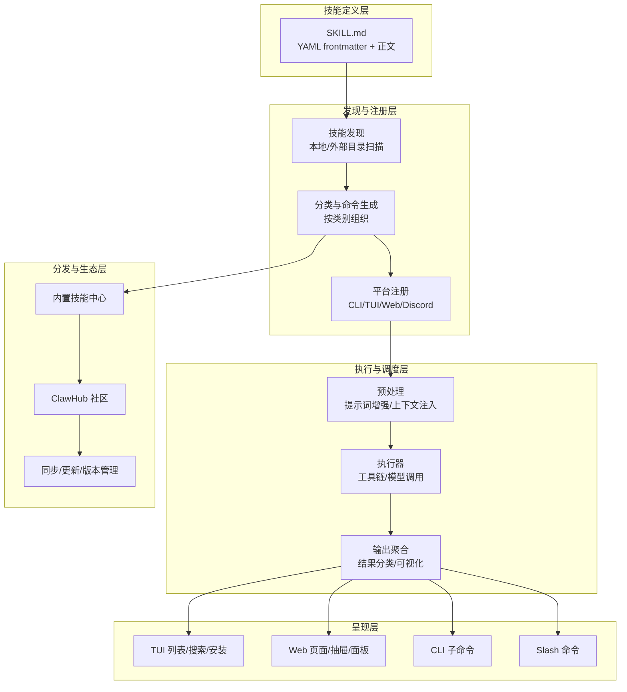
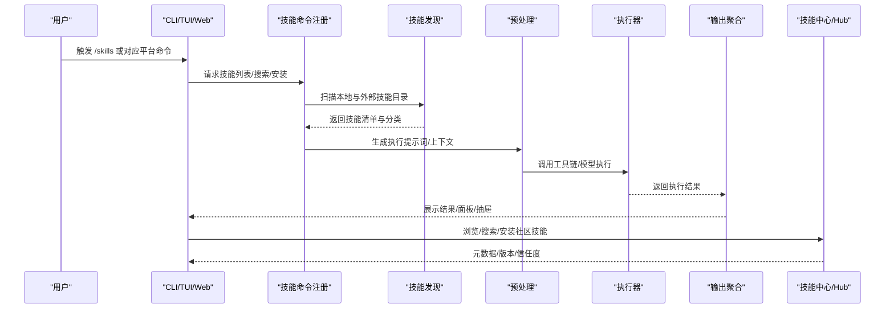
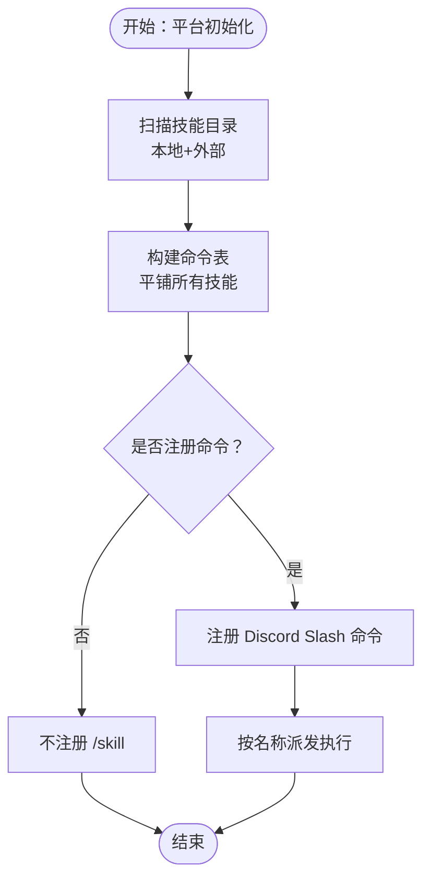
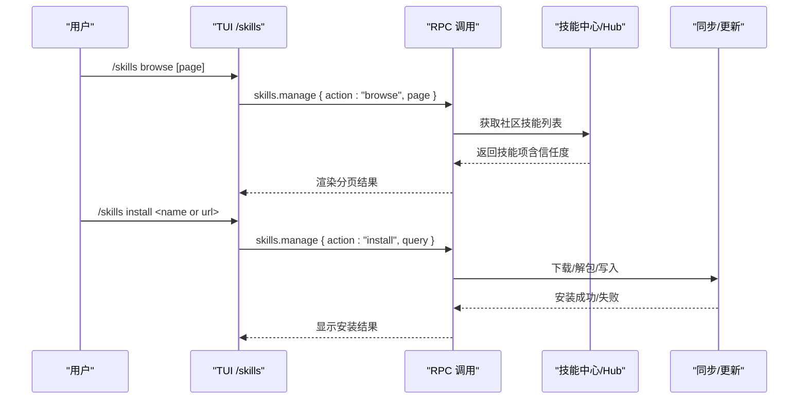
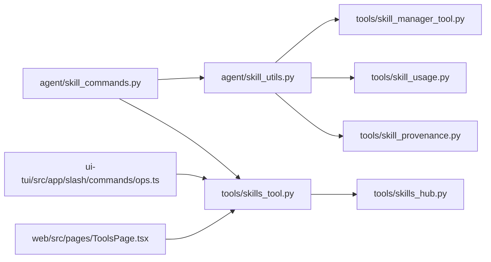

# 技能系统

<cite>
**本文档引用的文件**
- [agent/skill_commands.py](file://agent/skill_commands.py)
- [agent/skill_preprocessing.py](file://agent/skill_preprocessing.py)
- [agent/skill_utils.py](file://agent/skill_utils.py)
- [tools/skills_tool.py](file://tools/skills_tool.py)
- [tools/skill_manager_tool.py](file://tools/skill_manager_tool.py)
- [tools/skill_usage.py](file://tools/skill_usage.py)
- [tools/skill_provenance.py](file://tools/skill_provenance.py)
- [tools/skills_hub.py](file://tools/skills_hub.py)
- [hermes_cli/skills_config.py](file://hermes_cli/skills_config.py)
- [hermes_cli/skills_hub.py](file://hermes_cli/skills_hub.py)
- [tests/agent/test_skill_commands.py](file://tests/agent/test_skill_commands.py)
- [tests/agent/test_skill_utils.py](file://tests/agent/test_skill_utils.py)
- [tests/hermes_cli/test_commands.py](file://tests/hermes_cli/test_commands.py)
- [tests/tools/test_skills_tool.py](file://tests/tools/test_skills_tool.py)
- [tests/tools/test_skills_hub_clawhub.py](file://tests/tools/test_skills_hub_clawhub.py)
- [skills/productivity/DESCRIPTION.md](file://skills/productivity/DESCRIPTION.md)
- [website/i18n/zh-Hans/docusaurus-plugin-content-docs/current/user-guide/skills/bundled/software-development/software-development-hermes-agent-skill-authoring.md](file://website/i18n/zh-Hans/docusaurus-plugin-content-docs/current/user-guide/skills/bundled/software-development/software-development-hermes-agent-skill-authoring.md)
- [website/i18n/zh-Hans/docusaurus-plugin-content-docs/current/user-guide/skills/bundled/software-development/software-development-spike.md](file://website/i18n/zh-Hans/docusaurus-plugin-content-docs/current/user-guide/skills/bundled/software-development/software-development-spike.md)
- [ui-tui/src/app/slash/commands/ops.ts](file://ui-tui/src/app/slash/commands/ops.ts)
- [web/src/pages/ToolsPage.tsx](file://web/src/pages/ToolsPage.tsx)
- [web/src/pages/ToolsPage.tsx](file://web/src/pages/ToolsPage.tsx)
- [web/src/pages/ToolsPage.tsx](file://web/src/pages/ToolsPage.tsx)
</cite>

## 目录
1. [简介](#简介)
2. [项目结构](#项目结构)
3. [核心组件](#核心组件)
4. [架构总览](#架构总览)
5. [详细组件分析](#详细组件分析)
6. [依赖关系分析](#依赖关系分析)
7. [性能考量](#性能考量)
8. [故障排查指南](#故障排查指南)
9. [结论](#结论)
10. [附录](#附录)

## 简介
本文件系统化梳理 Hermes Agent 的技能系统，覆盖技能架构、执行器设计与分发机制，介绍内置技能类别（如创意、开发、研究、生产力等），并提供技能开发指南、自定义技能创建流程、技能测试方法、配置选项、性能优化与版本管理策略，以及扩展机制、打包与共享发布的最佳实践。文档面向技能开发者与使用者，兼顾技术深度与可操作性。

## 项目结构
技能系统围绕“技能定义（SKILL.md）—发现与注册—执行—结果呈现”这一主线展开，涉及以下关键层次：
- 技能定义层：位于 skills/<category>/<skill>/SKILL.md，采用 YAML 前言与正文的结构化描述。
- 发现与注册层：扫描本地与外部技能目录，构建命令表与分类索引，支持平台（CLI/TUI/Web/Discord 等）的命令注册。
- 执行与调度层：根据用户输入与上下文，选择合适技能，预处理提示词，调用工具链执行，并收集结果。
- 结果呈现层：在不同前端（TUI、Web、CLI）展示技能列表、详情、搜索与安装入口。
- 分发与生态层：内置技能中心与社区 Hub，支持浏览、搜索、安装与元数据管理。

图表来源
- [agent/skill_commands.py](file://agent/skill_commands.py)
- [agent/skill_utils.py](file://agent/skill_utils.py)
- [tools/skills_tool.py](file://tools/skills_tool.py)
- [tools/skills_hub.py](file://tools/skills_hub.py)
- [ui-tui/src/app/slash/commands/ops.ts](file://ui-tui/src/app/slash/commands/ops.ts)

章节来源
- [agent/skill_commands.py](file://agent/skill_commands.py)
- [agent/skill_utils.py](file://agent/skill_utils.py)
- [tools/skills_tool.py](file://tools/skills_tool.py)
- [tools/skills_hub.py](file://tools/skills_hub.py)
- [ui-tui/src/app/slash/commands/ops.ts](file://ui-tui/src/app/slash/commands/ops.ts)

## 核心组件
- 技能命令与注册
  - 通过扫描技能目录生成命令表，支持按类别平铺展示，避免旧版嵌套上限限制。
  - 支持 Discord Slash 命令注册，按技能名称动态映射。
- 技能发现与分类
  - 统一从本地 skills 与外部扩展目录加载，合并仓库内与用户本地技能树。
  - 将技能按顶级目录归类（如 creative、productivity、research 等）。
- 技能执行与预处理
  - 对用户输入进行意图识别与上下文增强，结合技能元数据生成执行提示词。
  - 通过工具链执行具体任务，收集并格式化结果。
- 技能管理与生态
  - 提供技能列表、搜索、安装、浏览与信任度标注。
  - 支持内置 Hub 与 ClawHub 社区源，统一元数据与版本管理。

章节来源
- [agent/skill_commands.py](file://agent/skill_commands.py)
- [agent/skill_utils.py](file://agent/skill_utils.py)
- [agent/skill_preprocessing.py](file://agent/skill_preprocessing.py)
- [tools/skills_tool.py](file://tools/skills_tool.py)
- [tools/skill_manager_tool.py](file://tools/skill_manager_tool.py)
- [tools/skill_usage.py](file://tools/skill_usage.py)
- [tools/skill_provenance.py](file://tools/skill_provenance.py)
- [tools/skills_hub.py](file://tools/skills_hub.py)
- [hermes_cli/skills_config.py](file://hermes_cli/skills_config.py)
- [hermes_cli/skills_hub.py](file://hermes_cli/skills_hub.py)

## 架构总览
技能系统采用“声明式定义 + 自动发现 + 多端注册 + 生态分发”的架构模式。核心流程如下：

图表来源
- [agent/skill_commands.py](file://agent/skill_commands.py)
- [agent/skill_utils.py](file://agent/skill_utils.py)
- [agent/skill_preprocessing.py](file://agent/skill_preprocessing.py)
- [tools/skills_tool.py](file://tools/skills_tool.py)
- [tools/skills_hub.py](file://tools/skills_hub.py)

## 详细组件分析

### 技能命令与平台注册
- 功能要点
  - 从技能目录生成命令表，支持平铺展示所有技能，取消旧版嵌套上限。
  - 在 Discord 上注册 /skill 主命令，按技能名直接派发至执行器。
  - 支持本地与外部技能目录合并，确保用户本地技能可见。
- 关键行为
  - 当无技能时，不注册 /skill 命令。
  - 对长名称进行显示名截断与警告提示，避免平台限制。
- 测试验证
  - 单测覆盖命令注册、空技能场景、回调派发与名称截断。

图表来源
- [agent/skill_commands.py](file://agent/skill_commands.py)
- [tests/agent/test_skill_commands.py](file://tests/agent/test_skill_commands.py)
- [tests/hermes_cli/test_commands.py](file://tests/hermes_cli/test_commands.py)

章节来源
- [agent/skill_commands.py](file://agent/skill_commands.py)
- [tests/agent/test_skill_commands.py](file://tests/agent/test_skill_commands.py)
- [tests/hermes_cli/test_commands.py](file://tests/hermes_cli/test_commands.py)

### 技能发现与分类
- 功能要点
  - 合并仓库内 skills 与用户本地 ~/.hermes/skills，形成统一技能树。
  - 按顶级目录自动分类（如 creative、productivity、research 等）。
  - 支持跨目录引用 metadata.hermes.related_skills，但建议优先引用仓库内技能。
- 行为特性
  - 本地技能优先于外部技能；同名冲突时保留本地定义。
  - 分类维度稳定，便于 UI 呈现与搜索。
- 测试验证
  - 单测覆盖多目录合并、分类正确性与隐藏计数逻辑。

章节来源
- [agent/skill_utils.py](file://agent/skill_utils.py)
- [tests/agent/test_skill_utils.py](file://tests/agent/test_skill_utils.py)

### 技能预处理与执行
- 功能要点
  - 基于用户输入与技能元数据生成执行提示词，必要时注入上下文。
  - 通过工具链执行具体任务，支持多模型/多适配器。
  - 结果进行分类与可视化，便于前端展示。
- 性能与健壮性
  - 预处理阶段尽量减少冗余信息，降低上下文开销。
  - 执行器对错误进行捕获与分类，保证流程稳定性。

章节来源
- [agent/skill_preprocessing.py](file://agent/skill_preprocessing.py)
- [tools/skill_manager_tool.py](file://tools/skill_manager_tool.py)
- [tools/skill_usage.py](file://tools/skill_usage.py)
- [tools/skill_provenance.py](file://tools/skill_provenance.py)

### 技能管理与生态
- 功能要点
  - 提供技能列表、搜索、安装、浏览与信任度标注。
  - 内置技能中心与 ClawHub 社区源，统一元数据与版本管理。
  - 支持按标签、关键词与信任度筛选。
- 前端集成
  - TUI 提供 /skills 子命令，支持 list/inspect/search/install/browse。
  - Web 页面提供工具集配置抽屉与技能浏览面板。

图表来源
- [ui-tui/src/app/slash/commands/ops.ts](file://ui-tui/src/app/slash/commands/ops.ts)
- [tools/skills_hub.py](file://tools/skills_hub.py)
- [hermes_cli/skills_hub.py](file://hermes_cli/skills_hub.py)

章节来源
- [ui-tui/src/app/slash/commands/ops.ts](file://ui-tui/src/app/slash/commands/ops.ts)
- [tools/skills_hub.py](file://tools/skills_hub.py)
- [hermes_cli/skills_hub.py](file://hermes_cli/skills_hub.py)
- [tests/tools/test_skills_hub_clawhub.py](file://tests/tools/test_skills_hub_clawhub.py)

### 内置技能类别概览
- 创意技能：图像生成、视频制作、设计与艺术创作等。
- 开发技能：代码审查、调试、原型验证、子代理驱动开发等。
- 研究技能：论文写作、OSINT 调研、ArXiv 检索、并行搜索等。
- 生产力技能：文档、演示文稿、电子表格、OCR 与文档处理等。
- 其他类别：数据科学、MLOps、智能体协作、通信、安全等。

章节来源
- [skills/productivity/DESCRIPTION.md](file://skills/productivity/DESCRIPTION.md)

### 技能开发指南
- 模板与结构
  - 参考同类技能的 SKILL.md 结构，保持语气与格式一致。
  - 使用 YAML frontmatter 定义 name、description 等元数据，正文描述使用场景与触发条件。
- 验证与提交
  - 本地验证：检查 frontmatter 存在、description 长度限制、文件大小限制。
  - Git 提交：在当前分支添加并提交，注意会话级缓存导致新技能需重启会话才可见。
- 最佳实践
  - 明确触发词与边界，避免歧义。
  - 合理拆分步骤，便于调试与回溯。
  - 使用 metadata.hermes.related_skills 进行相关技能引用，优先仓库内引用。

章节来源
- [website/i18n/zh-Hans/docusaurus-plugin-content-docs/current/user-guide/skills/bundled/software-development/software-development-hermes-agent-skill-authoring.md](file://website/i18n/zh-Hans/docusaurus-plugin-content-docs/current/user-guide/skills/bundled/software-development/software-development-hermes-agent-skill-authoring.md)
- [website/i18n/zh-Hans/docusaurus-plugin-content-docs/current/user-guide/skills/bundled/software-development/software-development-spike.md](file://website/i18n/zh-Hans/docusaurus-plugin-content-docs/current/user-guide/skills/bundled/software-development/software-development-spike.md)

### 自定义技能创建与测试
- 创建流程
  - 在目标分类下新建目录，编写 SKILL.md，遵循验证器约束。
  - 使用 write_file 写入文件后，进行本地验证。
- 测试方法
  - 单测覆盖命令注册、空技能场景、回调派发与名称截断。
  - 集成测试覆盖多目录合并、分类正确性与隐藏计数逻辑。
  - Hub 测试覆盖搜索、详情映射与嵌套 payload 处理。

章节来源
- [tests/agent/test_skill_commands.py](file://tests/agent/test_skill_commands.py)
- [tests/agent/test_skill_utils.py](file://tests/agent/test_skill_utils.py)
- [tests/tools/test_skills_tool.py](file://tests/tools/test_skills_tool.py)
- [tests/tools/test_skills_hub_clawhub.py](file://tests/tools/test_skills_hub_clawhub.py)

### 技能配置选项、性能优化与版本管理
- 配置选项
  - 技能中心：支持按标签、关键词与信任度筛选，分页浏览。
  - 工具集配置：在 Web/TUI 中打开技能配置抽屉，调整工具集参数。
- 性能优化
  - 预处理阶段精简提示词，减少上下文长度。
  - 执行器对错误进行分类与降级处理，避免阻塞主流程。
  - 缓存与懒加载：技能目录扫描与命令表构建结果在会话间复用。
- 版本管理
  - 内置 Hub 与 ClawHub 统一元数据与版本号，支持更新与回滚。
  - 外部技能目录与仓库内技能合并，优先本地定义。

章节来源
- [hermes_cli/skills_config.py](file://hermes_cli/skills_config.py)
- [tools/skills_hub.py](file://tools/skills_hub.py)
- [web/src/pages/ToolsPage.tsx](file://web/src/pages/ToolsPage.tsx)

### 技能扩展机制、打包与共享发布
- 扩展机制
  - 支持外部技能目录与仓库内技能合并，统一分类与命令生成。
  - 通过 metadata.hermes.related_skills 实现跨目录引用。
- 打包与发布
  - 使用内置 Hub 与 ClawHub 进行社区发布与分发。
  - 支持按 slug 搜索与安装，返回信任度与摘要信息。
- 共享发布
  - 建议优先将常用技能纳入仓库，确保新克隆用户可直接使用。
  - 对仅存在于用户本地的技能，建议迁移至仓库以便共享。

章节来源
- [agent/skill_utils.py](file://agent/skill_utils.py)
- [tools/skills_hub.py](file://tools/skills_hub.py)
- [hermes_cli/skills_hub.py](file://hermes_cli/skills_hub.py)

## 依赖关系分析

图表来源
- [agent/skill_commands.py](file://agent/skill_commands.py)
- [agent/skill_utils.py](file://agent/skill_utils.py)
- [tools/skills_tool.py](file://tools/skills_tool.py)
- [tools/skill_manager_tool.py](file://tools/skill_manager_tool.py)
- [tools/skill_usage.py](file://tools/skill_usage.py)
- [tools/skill_provenance.py](file://tools/skill_provenance.py)
- [tools/skills_hub.py](file://tools/skills_hub.py)
- [ui-tui/src/app/slash/commands/ops.ts](file://ui-tui/src/app/slash/commands/ops.ts)
- [web/src/pages/ToolsPage.tsx](file://web/src/pages/ToolsPage.tsx)

章节来源
- [agent/skill_commands.py](file://agent/skill_commands.py)
- [agent/skill_utils.py](file://agent/skill_utils.py)
- [tools/skills_tool.py](file://tools/skills_tool.py)
- [tools/skills_hub.py](file://tools/skills_hub.py)
- [ui-tui/src/app/slash/commands/ops.ts](file://ui-tui/src/app/slash/commands/ops.ts)
- [web/src/pages/ToolsPage.tsx](file://web/src/pages/ToolsPage.tsx)

## 性能考量
- 目录扫描与缓存
  - 技能目录扫描与命令表构建结果在会话间复用，避免重复 IO。
- 上下文控制
  - 预处理阶段严格控制提示词长度，减少模型调用成本。
- 错误隔离
  - 执行器对异常进行分类与降级，保证主流程稳定。
- 前端渲染
  - TUI/Web 分页加载与懒加载，降低首屏压力。

## 故障排查指南
- 常见问题
  - 未注册 /skill 命令：确认存在至少一个技能，且未被隐藏。
  - 技能名称过长：平台限制显示名长度，注意截断与警告。
  - 本地技能不可见：检查 HERMES_HOME 与 SKILLS_DIR 设置，确认会话缓存已刷新。
  - Hub 搜索无结果：确认网络连通与 Hub 元数据可用。
- 排查步骤
  - 使用 /skills list/inspect/search/install 进行端到端验证。
  - 查看单测日志与断言，定位注册与分类问题。
  - 检查外部技能目录权限与路径配置。

章节来源
- [tests/agent/test_skill_commands.py](file://tests/agent/test_skill_commands.py)
- [tests/hermes_cli/test_commands.py](file://tests/hermes_cli/test_commands.py)
- [tests/tools/test_skills_hub_clawhub.py](file://tests/tools/test_skills_hub_clawhub.py)

## 结论
Hermes Agent 技能系统以声明式定义为核心，配合自动化发现、多端注册与生态分发，实现了从“创作—测试—发布—共享”的闭环。通过严格的元数据规范、预处理与执行器设计，以及完善的前端集成与 Hub 支持，系统既满足开发者高效创作的需求，也为用户提供了丰富的技能生态与便捷的使用体验。

## 附录
- 快速参考
  - 技能目录：skills/<category>/<name>/SKILL.md
  - 平台命令：/skills list/inspect/search/install/browse
  - Hub：内置中心与 ClawHub 社区
  - 验证：本地断言与单测覆盖