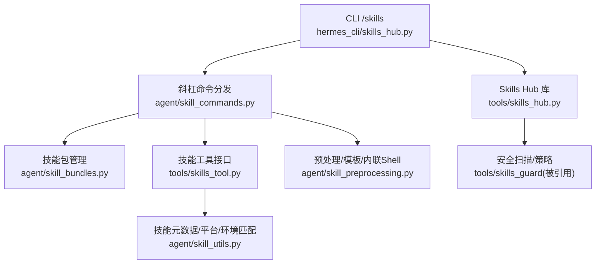
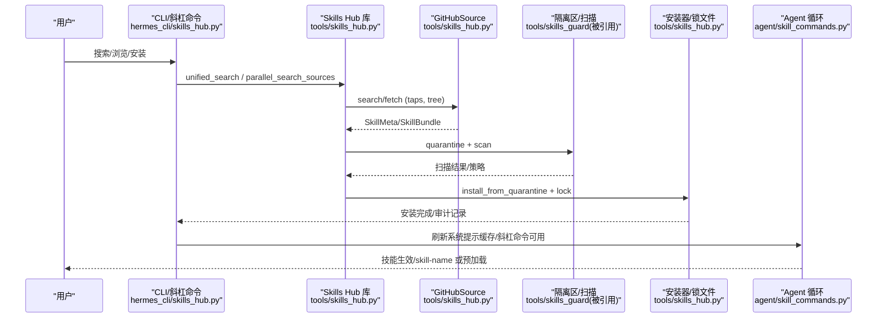
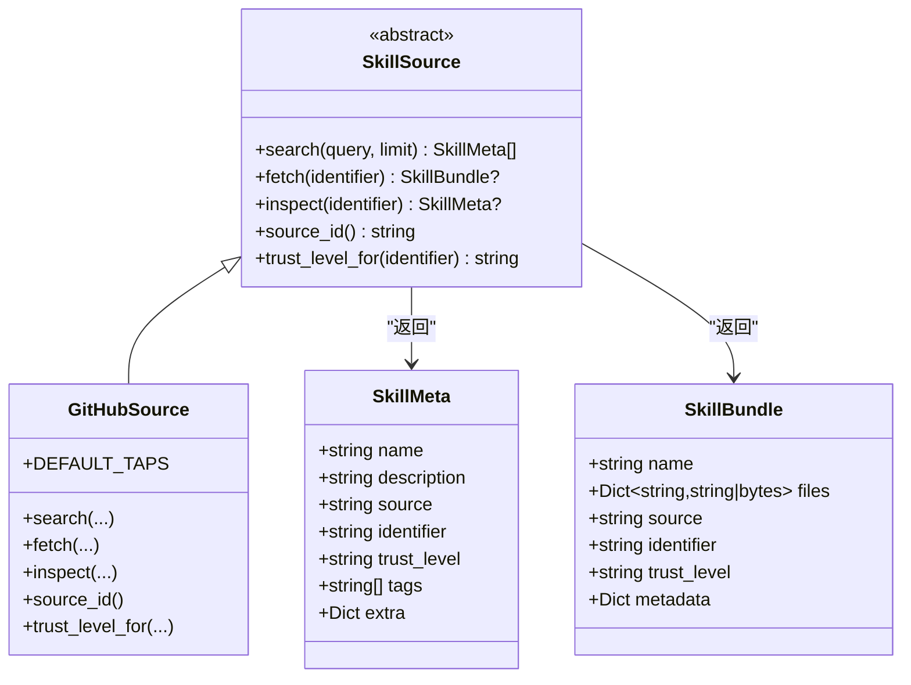
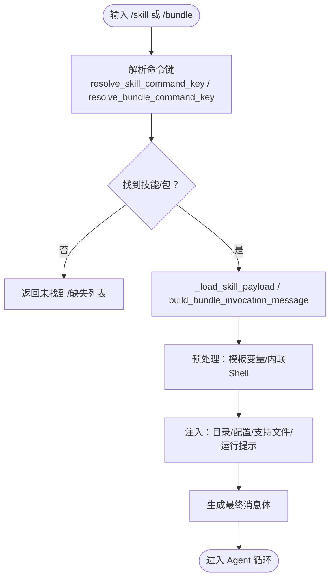
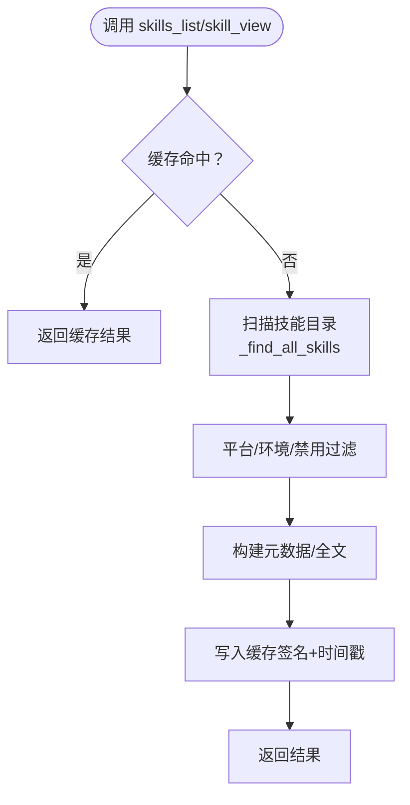
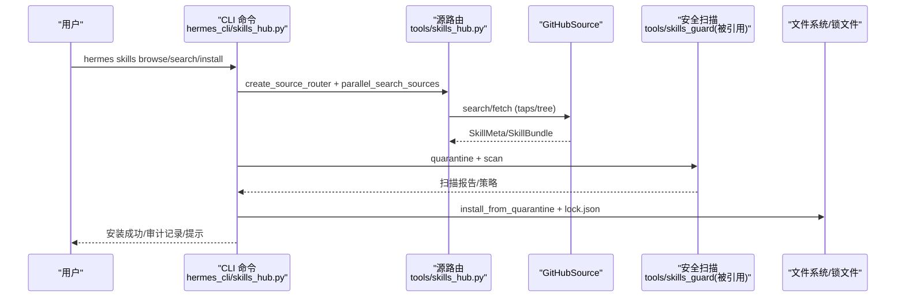
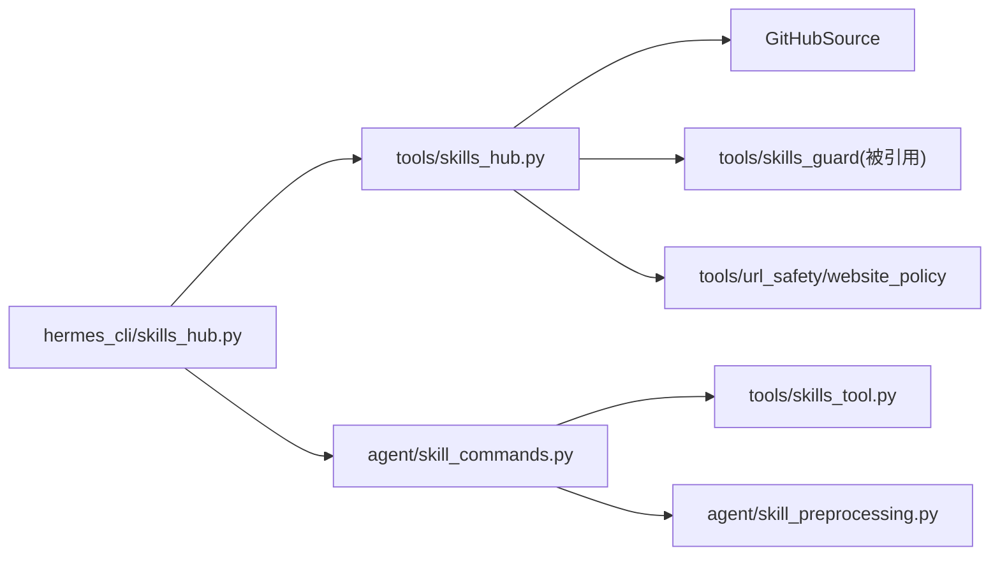

# 技能系统

<cite>
**本文引用的文件**
- [hermes_cli/skills_hub.py](file://hermes_cli/skills_hub.py)
- [tools/skills_hub.py](file://tools/skills_hub.py)
- [agent/skill_commands.py](file://agent/skill_commands.py)
- [agent/skill_bundles.py](file://agent/skill_bundles.py)
- [agent/skill_utils.py](file://agent/skill_utils.py)
- [tools/skills_tool.py](file://tools/skills_tool.py)
- [agent/skill_preprocessing.py](file://agent/skill_preprocessing.py)
</cite>

## 目录
1. [简介](#简介)
2. [项目结构](#项目结构)
3. [核心组件](#核心组件)
4. [架构总览](#架构总览)
5. [详细组件分析](#详细组件分析)
6. [依赖关系分析](#依赖关系分析)
7. [性能考量](#性能考量)
8. [故障排查指南](#故障排查指南)
9. [结论](#结论)
10. [附录](#附录)

## 简介
本文件系统化阐述 Hermes Agent 的“技能系统”，覆盖程序化记忆、技能创建与优化机制，技能的架构设计、元数据定义与执行流程；详解 Skills Hub（技能中心）的使用方式（浏览、安装、更新与管理），并提供完整的技能开发指南（技能结构、工具调用、错误处理与测试方法）。同时说明技能的自我改进机制、使用统计与学习循环，给出社区技能共享的最佳实践与发布流程，并强调安全考虑、权限控制与沙箱隔离。目标是帮助开发者从简单脚本到复杂应用，构建可维护、可扩展、安全的技能生态。

## 项目结构
技能系统由“命令层”“注册/分发层”“存储与索引层”“安全与扫描层”“预处理与模板层”组成：
- 命令层：CLI 与斜杠命令入口，负责用户交互与参数解析
- 注册/分发层：技能发现、斜杠命令映射、包（bundle）聚合
- 存储与索引层：本地技能目录、外部目录、组织镜像、Hub 状态（锁、审计日志、缓存）
- 安全与扫描层：下载后隔离、内容扫描、策略放行
- 预处理与模板层：SKILL.md 前导元数据解析、变量替换、内联 Shell 执行

图表来源
- [hermes_cli/skills_hub.py:250-793](file://hermes_cli/skills_hub.py#L250-L793)
- [tools/skills_hub.py:476-753](file://tools/skills_hub.py#L476-L753)
- [agent/skill_commands.py:374-800](file://agent/skill_commands.py#L374-L800)
- [agent/skill_bundles.py:168-369](file://agent/skill_bundles.py#L168-L369)
- [tools/skills_tool.py:670-800](file://tools/skills_tool.py#L670-L800)
- [agent/skill_utils.py:174-387](file://agent/skill_utils.py#L174-L387)
- [agent/skill_preprocessing.py:25-145](file://agent/skill_preprocessing.py#L25-L145)

章节来源
- [hermes_cli/skills_hub.py:250-793](file://hermes_cli/skills_hub.py#L250-L793)
- [tools/skills_hub.py:476-753](file://tools/skills_hub.py#L476-L753)
- [agent/skill_commands.py:374-800](file://agent/skill_commands.py#L374-L800)
- [agent/skill_bundles.py:168-369](file://agent/skill_bundles.py#L168-L369)
- [tools/skills_tool.py:670-800](file://tools/skills_tool.py#L670-L800)
- [agent/skill_utils.py:174-387](file://agent/skill_utils.py#L174-L387)
- [agent/skill_preprocessing.py:25-145](file://agent/skill_preprocessing.py#L25-L145)

## 核心组件
- 技能元数据与模型
  - SkillMeta：搜索结果的轻量元信息（名称、描述、来源、标识符、信任等级等）
  - SkillBundle：已下载的完整技能包（文件集合、来源、标识符、信任等级、元数据）
- 源适配器抽象与实现
  - SkillSource：统一接口（search/fetch/inspect/source_id/trust_level_for）
  - GitHubSource：通过 GitHub Contents API 拉取技能，支持 taps、分组侧边文件、信任级别判定
  - 官方/可信来源：通过 trust_level 区分 builtin/trusted/community
- 技能命令与包
  - 斜杠命令发现与加载：扫描 SKILL.md，生成 /command 映射，支持平台与环境过滤
  - 技能包（bundle）：YAML 声明一组技能一次性加载，便于组合工作流
- 技能工具与索引
  - skills_list/skill_view：渐进式披露（仅元数据 vs 全文与关联文件）
  - 缓存与签名：按目录 mtime 与禁用集变化进行缓存失效
- 预处理与模板
  - 前导元数据解析、变量替换、内联 Shell 执行（带超时与输出限制）
- Hub 状态与安全
  - 隔离区、审计日志、锁文件、索引缓存、SSRF/重定向防护、路径穿越防护

章节来源
- [tools/skills_hub.py:130-153](file://tools/skills_hub.py#L130-L153)
- [tools/skills_hub.py:476-753](file://tools/skills_hub.py#L476-L753)
- [agent/skill_commands.py:374-800](file://agent/skill_commands.py#L374-L800)
- [agent/skill_bundles.py:168-369](file://agent/skill_bundles.py#L168-L369)
- [tools/skills_tool.py:670-800](file://tools/skills_tool.py#L670-L800)
- [agent/skill_preprocessing.py:25-145](file://agent/skill_preprocessing.py#L25-L145)

## 架构总览
技能系统采用“分层+插件化”的架构：
- 命令层（CLI/斜杠命令）将用户意图转化为统一的技能加载请求
- 注册/分发层根据命令键查找技能或包，组装消息体（含前置提示、配置注入、支持文件清单）
- 存储与索引层提供多来源（本地、外部、组织镜像、GitHub taps）的技能发现与视图
- 安全与扫描层在下载后对内容进行隔离与扫描，依据策略决定是否允许安装
- 预处理层在渲染前对 SKILL.md 进行变量替换与可选的内联 Shell 执行

图表来源
- [hermes_cli/skills_hub.py:250-793](file://hermes_cli/skills_hub.py#L250-L793)
- [tools/skills_hub.py:559-753](file://tools/skills_hub.py#L559-L753)
- [tools/skills_hub.py:294-338](file://tools/skills_hub.py#L294-L338)
- [agent/skill_commands.py:569-800](file://agent/skill_commands.py#L569-L800)

## 详细组件分析

### 技能元数据与模型
- SkillMeta：用于搜索结果展示与去重，包含 name/description/source/identifier/trust_level/tags/extra
- SkillBundle：用于安装阶段，包含 files（相对路径→内容）、source/identifier/trust_level/metadata
- 路径与命名校验：严格拒绝绝对路径、穿越片段、Windows 盘符、空路径；安装路径必须落在受信任根下且以技能名结尾

图表来源
- [tools/skills_hub.py:130-153](file://tools/skills_hub.py#L130-L153)
- [tools/skills_hub.py:476-753](file://tools/skills_hub.py#L476-L753)

章节来源
- [tools/skills_hub.py:130-153](file://tools/skills_hub.py#L130-L153)
- [tools/skills_hub.py:476-753](file://tools/skills_hub.py#L476-L753)

### 技能命令与包（斜杠命令与 bundle）
- 斜杠命令发现：扫描本地与外部技能目录，解析 SKILL.md 前导元数据，生成 /slug 映射；跳过与核心命令冲突的 slug
- 包（bundle）：YAML 声明一组技能，一次加载多条指令，便于组合工作流；支持缺失/禁用提示
- 堆叠调用：支持连续多个 /skill-a /skill-b 前缀，最多 N 个，复用 bundle 标记以便提取用户指令

图表来源
- [agent/skill_commands.py:550-800](file://agent/skill_commands.py#L550-L800)
- [agent/skill_bundles.py:168-369](file://agent/skill_bundles.py#L168-L369)
- [agent/skill_preprocessing.py:25-145](file://agent/skill_preprocessing.py#L25-L145)

章节来源
- [agent/skill_commands.py:374-800](file://agent/skill_commands.py#L374-L800)
- [agent/skill_bundles.py:168-369](file://agent/skill_bundles.py#L168-L369)

### 技能工具与索引（skills_list/skill_view）
- 渐进式披露：先列出元数据（name/description/category），按需再加载全文与关联文件
- 缓存策略：基于目录 mtime 与禁用集变化的签名缓存，TTL 控制新鲜度
- 平台与环境匹配：platforms/environments 字段控制可见性与可用性

图表来源
- [tools/skills_tool.py:670-800](file://tools/skills_tool.py#L670-L800)
- [agent/skill_utils.py:223-387](file://agent/skill_utils.py#L223-L387)

章节来源
- [tools/skills_tool.py:670-800](file://tools/skills_tool.py#L670-L800)
- [agent/skill_utils.py:223-387](file://agent/skill_utils.py#L223-L387)

### Skills Hub 使用（浏览、安装、更新与管理）
- 浏览：并行检索多个来源（官方、GitHub taps、第三方索引），去重并按信任等级排序，分页展示
- 安装：短名解析 → 获取元数据/包 → 隔离 → 扫描 → 策略放行 → 确认 → 安装 → 注册蓝图建议（如适用）→ 刷新系统提示缓存
- 更新：通过锁文件追踪来源，锁定 source_id 避免跨注册表漂移
- 管理：审计日志、锁文件、隔离区、索引缓存、扫描缓存

图表来源
- [hermes_cli/skills_hub.py:250-793](file://hermes_cli/skills_hub.py#L250-L793)
- [tools/skills_hub.py:559-753](file://tools/skills_hub.py#L559-L753)
- [tools/skills_hub.py:294-338](file://tools/skills_hub.py#L294-L338)

章节来源
- [hermes_cli/skills_hub.py:250-793](file://hermes_cli/skills_hub.py#L250-L793)
- [tools/skills_hub.py:559-753](file://tools/skills_hub.py#L559-L753)

### 预处理与模板（变量替换与内联 Shell）
- 变量替换：${HERMES_SKILL_DIR}、${HERMES_SESSION_ID} 在渲染时替换为实际值
- 内联 Shell：!`cmd` 语法，默认关闭，开启时需设置超时与输出上限，失败不中断整体加载
- 配置开关：template_vars 默认开启；inline_shell 默认关闭，可通过配置启用

章节来源
- [agent/skill_preprocessing.py:25-145](file://agent/skill_preprocessing.py#L25-L145)

### 程序化记忆、自我改进与学习循环
- 程序化记忆：斜杠命令展开的消息会被记忆提供者捕获，但系统提供“提取用户指令”的能力，确保只存储用户真实意图而非整个技能正文
- 自我改进：通过“使用统计”（bump_use）与“蓝图建议”（自动化任务注册）形成反馈闭环；安装后可提示用户通过建议面板调度自动化
- 学习循环：使用统计 → 洞察/报表 → 调整技能/提示 → 再次使用评估效果

章节来源
- [agent/skill_commands.py:73-136](file://agent/skill_commands.py#L73-L136)
- [hermes_cli/skills_hub.py:743-793](file://hermes_cli/skills_hub.py#L743-L793)

### 使用统计与学习循环
- 每次激活技能或包成员时，调用 bump_use 记录使用次数（任务级）
- 结合 Curator 生命周期管理，活跃使用的技能可获得更优的上下文与推荐

章节来源
- [agent/skill_commands.py:595-613](file://agent/skill_commands.py#L595-L613)
- [agent/skill_bundles.py:322-326](file://agent/skill_bundles.py#L322-L326)

### 安全考虑、权限控制与沙箱隔离
- 下载与网络：SSRF 防护、重定向限制、网站访问策略检查
- 路径安全：严格校验 bundle 路径、安装路径、锁文件路径，防止穿越与逃逸
- 隔离与扫描：下载后进入隔离区，执行安全扫描并依据策略放行或阻断
- 权限与信任：区分 official/trusted/community，信任等级影响排序与显示；GitHub taps 支持 provider 标签过滤
- 沙箱：内联 Shell 默认关闭，开启时具备超时与输出限制；终端/命令执行需审批与脱敏

章节来源
- [tools/skills_hub.py:195-291](file://tools/skills_hub.py#L195-L291)
- [tools/skills_hub.py:294-338](file://tools/skills_hub.py#L294-L338)
- [hermes_cli/skills_hub.py:639-738](file://hermes_cli/skills_hub.py#L639-L738)
- [agent/skill_preprocessing.py:65-125](file://agent/skill_preprocessing.py#L65-L125)

## 依赖关系分析
- 模块耦合
  - CLI 与 Hub 库：通过 do_* 函数解耦，内部延迟导入避免循环依赖
  - Hub 库与 GitHubSource：通过 SkillSource 抽象，便于扩展新来源
  - 斜杠命令与技能工具：通过 skill_view 与 _load_skill_payload 解耦
  - 预处理与命令：在构建消息时按需调用，不影响基础扫描
- 外部依赖
  - httpx/yaml：HTTP 请求与 YAML 解析
  - tools/skills_guard：安全扫描与策略
  - tools/url_safety/website_policy：URL 安全与访问策略

图表来源
- [hermes_cli/skills_hub.py:250-793](file://hermes_cli/skills_hub.py#L250-L793)
- [tools/skills_hub.py:476-753](file://tools/skills_hub.py#L476-L753)
- [agent/skill_commands.py:374-800](file://agent/skill_commands.py#L374-L800)
- [tools/skills_tool.py:670-800](file://tools/skills_tool.py#L670-L800)
- [agent/skill_preprocessing.py:25-145](file://agent/skill_preprocessing.py#L25-L145)

章节来源
- [hermes_cli/skills_hub.py:250-793](file://hermes_cli/skills_hub.py#L250-L793)
- [tools/skills_hub.py:476-753](file://tools/skills_hub.py#L476-L753)
- [agent/skill_commands.py:374-800](file://agent/skill_commands.py#L374-L800)
- [tools/skills_tool.py:670-800](file://tools/skills_tool.py#L670-L800)
- [agent/skill_preprocessing.py:25-145](file://agent/skill_preprocessing.py#L25-L145)

## 性能考量
- 并行检索：browse/search 并行拉取多来源，单来源限流与总体超时保护
- 缓存策略：
  - 技能索引：基于目录 mtime 与禁用集的签名缓存，TTL 控制新鲜度
  - 树缓存：GitHubSource 对 repo tree 与分组侧边文件进行实例级缓存
  - 配置读取：raw config 与 external_dirs 缓存，减少重复解析
- 渐进式披露：仅元数据优先，按需加载全文与关联文件，降低 token 消耗
- 内联 Shell：默认关闭，开启时限制超时与输出大小，避免阻塞与膨胀

章节来源
- [hermes_cli/skills_hub.py:319-487](file://hermes_cli/skills_hub.py#L319-L487)
- [tools/skills_hub.py:559-753](file://tools/skills_hub.py#L559-L753)
- [tools/skills_tool.py:91-138](file://tools/skills_tool.py#L91-L138)
- [agent/skill_utils.py:401-579](file://agent/skill_utils.py#L401-L579)
- [agent/skill_preprocessing.py:65-125](file://agent/skill_preprocessing.py#L65-L125)

## 故障排查指南
- 无法安装/拉取
  - 检查 GitHub API 速率限制与认证（PAT/gh CLI/GitHub App）
  - 查看 SSRF/重定向限制是否拦截了目标 URL
  - 确认隔离区与扫描策略是否阻止安装
- 斜杠命令不可用
  - 检查 slug 是否与核心命令冲突
  - 检查平台/环境过滤与禁用配置
  - 确认 bundle 中引用的技能是否已安装
- 内联 Shell 异常
  - 确认已启用 inline_shell 并设置合理超时
  - 检查 bash 是否存在与命令输出是否过大
- 缓存不一致
  - 等待 TTL 过期或触发目录 mtime 变更
  - 必要时重启进程以清空内存缓存

章节来源
- [hermes_cli/skills_hub.py:547-738](file://hermes_cli/skills_hub.py#L547-L738)
- [tools/skills_hub.py:294-338](file://tools/skills_hub.py#L294-L338)
- [agent/skill_commands.py:374-467](file://agent/skill_commands.py#L374-L467)
- [agent/skill_preprocessing.py:65-125](file://agent/skill_preprocessing.py#L65-L125)

## 结论
Hermes 技能系统通过清晰的层次划分与严格的沙箱/扫描机制，实现了从简单脚本到复杂应用的技能开发与部署。Skills Hub 提供了统一的浏览、安装与管理体验；斜杠命令与包机制让技能组合与复用变得高效；预处理与模板能力增强了技能的可配置性与动态性。配合使用统计与蓝图建议，系统形成了“使用—反馈—改进”的学习循环。建议在开发中遵循安全最佳实践、明确元数据与平台/环境约束，并通过测试与灰度发布保障质量。

## 附录
- 技能开发指南（要点）
  - 结构：每个技能一个目录，包含 SKILL.md（前导元数据+正文），可选 references/templates/assets/scripts
  - 元数据：name/description/platforms/environments/metadata.hermes.*（tags、config、related_skills 等）
  - 工具调用：通过 agent 提供的工具（终端、文件、浏览器、MCP 等）完成任务；注意权限与脱敏
  - 错误处理：内联 Shell 失败不中断；敏感信息脱敏；提供 setup 提示与必要环境变量收集
  - 测试方法：使用 skills_list/skill_view 验证元数据与内容；通过 /reload-skills 刷新；编写单元测试覆盖关键逻辑
- 社区共享与发布流程（最佳实践）
  - 选择合适来源：官方/可信仓库优先；第三方需标注来源与信任等级
  - 元数据完善：清晰描述、标签、平台/环境约束、相关技能
  - 安全合规：避免危险命令与路径穿越；提供最小权限与沙箱配置
  - 版本与更新：使用标识符与修订信息；通过 Hub 更新与锁文件管理
- 安全与权限
  - 网络：SSRF/重定向限制、网站访问策略
  - 路径：严格校验 bundle/安装/锁文件路径
  - 执行：内联 Shell 默认关闭；终端/命令执行需审批与脱敏
  - 信任：official/trusted/community 分级；provider 标签过滤