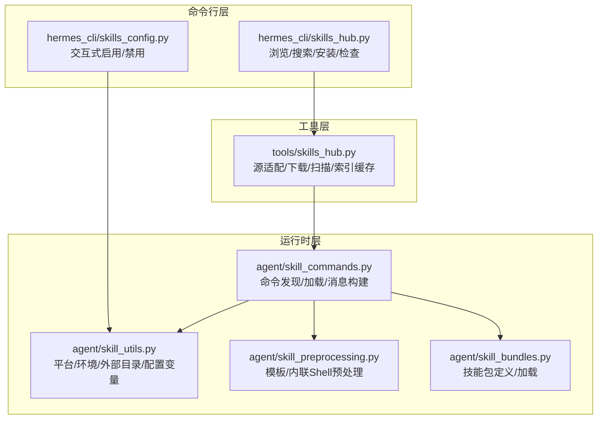
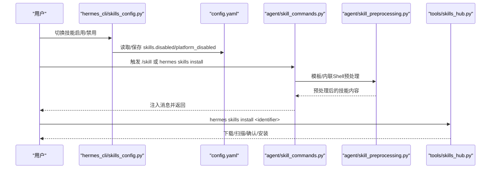
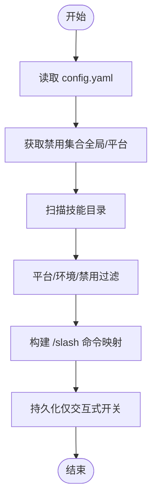
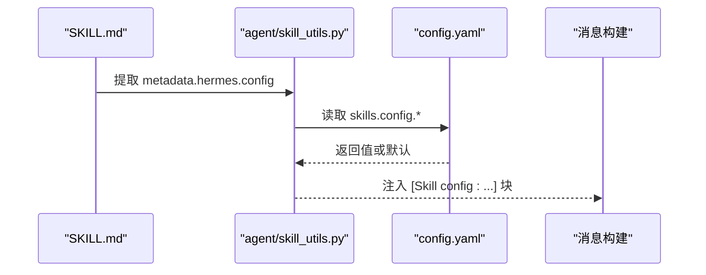
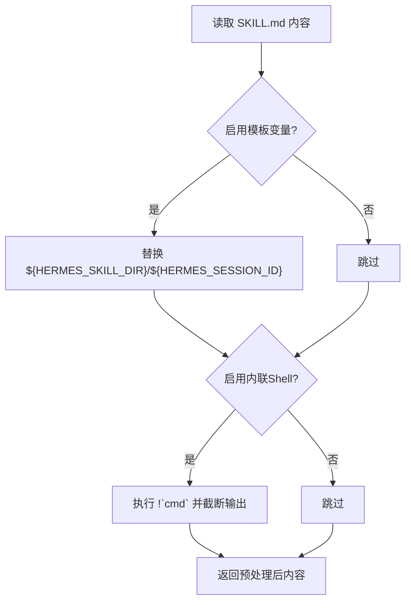
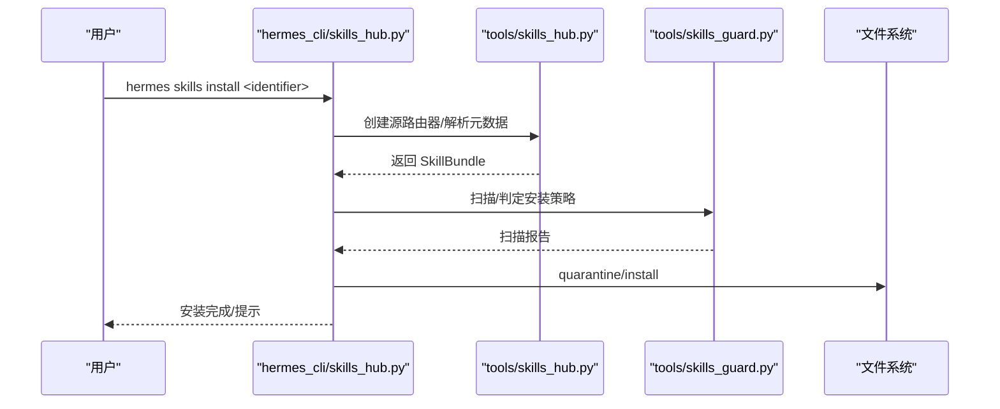
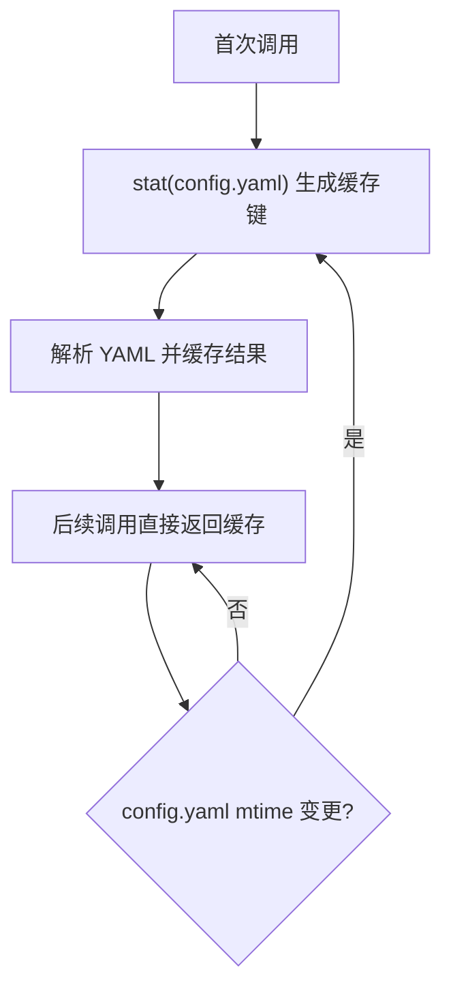
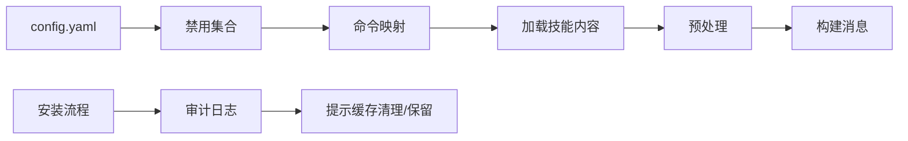

# 技能配置

<cite>
**本文引用的文件**
- [hermes_cli/skills_config.py](file://hermes_cli/skills_config.py)
- [hermes_cli/skills_hub.py](file://hermes_cli/skills_hub.py)
- [tools/skills_hub.py](file://tools/skills_hub.py)
- [agent/skill_utils.py](file://agent/skill_utils.py)
- [agent/skill_commands.py](file://agent/skill_commands.py)
- [agent/skill_preprocessing.py](file://agent/skill_preprocessing.py)
- [agent/skill_bundles.py](file://agent/skill_bundles.py)
- [tools/skills_tool.py](file://tools/skills_tool.py)
- [agent/prompt_builder.py](file://agent/prompt_builder.py)
- [tests/agent/test_external_skills_dirs_cache.py](file://tests/agent/test_external_skills_dirs_cache.py)
- [tests/agent/test_skill_commands_reload.py](file://tests/agent/test_skill_commands_reload.py)
- [tests/tools/test_skills_hub.py](file://tests/tools/test_skills_hub.py)
</cite>

## 目录
1. [简介](#简介)
2. [项目结构](#项目结构)
3. [核心组件](#核心组件)
4. [架构总览](#架构总览)
5. [详细组件分析](#详细组件分析)
6. [依赖关系分析](#依赖关系分析)
7. [性能考量](#性能考量)
8. [故障排除指南](#故障排除指南)
9. [结论](#结论)
10. [附录](#附录)

## 简介
本文件系统化阐述 Hermes Agent 的“技能配置系统”，覆盖以下主题：
- 技能配置文件格式与存储位置
- 配置参数选项与验证机制
- 技能启用/禁用管理、按平台覆盖策略
- 技能优先级与依赖声明（工具集/工具）
- 技能配置变量声明与解析
- 动态更新、热重载与提示缓存一致性
- 技能索引缓存与发现流程
- 安装与安全扫描、离线/在线索引回退
- 示例、排障与性能优化建议

## 项目结构
技能配置系统由三层协作构成：
- 命令行层：hermes_cli/skills_config.py 提供交互式开关与按类批量切换；hermes_cli/skills_hub.py 提供技能仓库浏览、安装、检查等能力。
- 运行时层：agent/skill_utils.py 负责平台/环境过滤、外部目录缓存、配置变量提取与解析；agent/skill_commands.py 负责技能命令发现、加载与消息构建；agent/skill_preprocessing.py 负责模板变量与内联 Shell 预处理；agent/skill_bundles.py 负责技能包的定义与动态加载。
- 工具层：tools/skills_hub.py 提供技能源适配、下载、安全扫描、锁文件与审计日志、索引缓存等。

图表来源
- [hermes_cli/skills_config.py:125-178](file://hermes_cli/skills_config.py#L125-L178)
- [hermes_cli/skills_hub.py:248-315](file://hermes_cli/skills_hub.py#L248-L315)
- [tools/skills_hub.py:49-62](file://tools/skills_hub.py#L49-L62)
- [agent/skill_utils.py:275-323](file://agent/skill_utils.py#L275-L323)
- [agent/skill_commands.py:263-331](file://agent/skill_commands.py#L263-L331)
- [agent/skill_preprocessing.py:23-35](file://agent/skill_preprocessing.py#L23-L35)
- [agent/skill_bundles.py:168-206](file://agent/skill_bundles.py#L168-L206)

章节来源
- [hermes_cli/skills_config.py:1-178](file://hermes_cli/skills_config.py#L1-L178)
- [hermes_cli/skills_hub.py:1-800](file://hermes_cli/skills_hub.py#L1-L800)
- [tools/skills_hub.py:1-800](file://tools/skills_hub.py#L1-L800)
- [agent/skill_utils.py:1-667](file://agent/skill_utils.py#L1-L667)
- [agent/skill_commands.py:1-528](file://agent/skill_commands.py#L1-L528)
- [agent/skill_preprocessing.py:1-140](file://agent/skill_preprocessing.py#L1-L140)
- [agent/skill_bundles.py:1-411](file://agent/skill_bundles.py#L1-L411)

## 核心组件
- 配置读写与平台覆盖
  - 通过 hermes_cli/skills_config.py 读取/保存 config.yaml 中的 skills.disabled 与 skills.platform_disabled。
  - 支持全局禁用列表与按平台覆盖（如 telegram/cli）。
- 技能发现与命令映射
  - agent/skill_commands.py 扫描本地与外部技能目录，基于 SKILL.md frontmatter 生成 /slash 命令映射，并应用平台/环境过滤与禁用列表。
- 预处理与注入
  - agent/skill_preprocessing.py 在加载前替换模板变量与执行内联 Shell，限制输出长度并超时保护。
  - agent/skill_commands.py 将技能内容注入到用户消息中，并可注入已解析的技能配置值。
- 配置变量系统
  - agent/skill_utils.py 提取 SKILL.md 中 metadata.hermes.config 声明，解析 config.yaml 对应键或默认值，支持路径展开。
- 技能包
  - agent/skill_bundles.py 定义技能包 YAML，支持多技能聚合加载与冲突解决（包名优先于同名技能）。
- 安装与安全
  - hermes_cli/skills_hub.py 与 tools/skills_hub.py 协作，实现从多源抓取、隔离区扫描、确认安装、锁文件记录与审计日志。
- 索引缓存与热重载
  - 外部目录缓存、命令映射缓存、提示缓存快照等，确保热重载不破坏前缀缓存。

章节来源
- [hermes_cli/skills_config.py:27-47](file://hermes_cli/skills_config.py#L27-L47)
- [agent/skill_commands.py:263-331](file://agent/skill_commands.py#L263-L331)
- [agent/skill_preprocessing.py:23-35](file://agent/skill_preprocessing.py#L23-L35)
- [agent/skill_utils.py:461-613](file://agent/skill_utils.py#L461-L613)
- [agent/skill_bundles.py:168-206](file://agent/skill_bundles.py#L168-L206)
- [hermes_cli/skills_hub.py:459-685](file://hermes_cli/skills_hub.py#L459-L685)
- [tools/skills_hub.py:49-62](file://tools/skills_hub.py#L49-L62)

## 架构总览
技能配置系统围绕“配置文件 + 运行时发现 + 预处理注入 + 安全安装”的闭环工作。

图表来源
- [hermes_cli/skills_config.py:125-178](file://hermes_cli/skills_config.py#L125-L178)
- [agent/skill_commands.py:432-477](file://agent/skill_commands.py#L432-L477)
- [agent/skill_preprocessing.py:123-140](file://agent/skill_preprocessing.py#L123-L140)
- [hermes_cli/skills_hub.py:459-685](file://hermes_cli/skills_hub.py#L459-L685)
- [tools/skills_hub.py:477-503](file://tools/skills_hub.py#L477-L503)

## 详细组件分析

### 配置文件与参数
- 存储位置与结构
  - 全局配置位于 ~/.hermes/config.yaml 的 skills 节点下。
  - 结构要点：
    - skills.disabled: 全局禁用技能名集合
    - skills.platform_disabled.<platform>: 平台覆盖禁用集合
- 参数解析与验证
  - hermes_cli/skills_config.py 提供读取/保存函数，支持平台维度合并。
  - agent/skill_utils.py 提供 get_disabled_skill_names，自动解析当前会话平台并回退到全局。
- 平台与环境过滤
  - skill_matches_platform 与 skill_matches_environment 控制技能在 Offer/命令映射阶段是否可见。
- 配置变量声明与解析
  - SKILL.md frontmatter 中 metadata.hermes.config 声明逻辑键、描述、默认值、提示词。
  - agent/skill_utils.py 提取并解析 config.yaml 中 skills.config.<key>，支持路径展开。

章节来源
- [hermes_cli/skills_config.py:27-47](file://hermes_cli/skills_config.py#L27-L47)
- [agent/skill_utils.py:275-323](file://agent/skill_utils.py#L275-L323)
- [agent/skill_utils.py:461-613](file://agent/skill_utils.py#L461-L613)

### 技能启用/禁用管理与平台覆盖
- 交互式切换
  - hermes_cli/skills_config.py 提供两类模式：逐项切换与按类别切换。
  - 支持选择平台（含全局）并持久化到 config.yaml。
- 运行时过滤
  - agent/skill_commands.py 在扫描阶段即应用禁用列表与平台/环境过滤，避免无效命令进入映射。

图表来源
- [hermes_cli/skills_config.py:125-178](file://hermes_cli/skills_config.py#L125-L178)
- [agent/skill_commands.py:263-331](file://agent/skill_commands.py#L263-L331)
- [agent/skill_utils.py:275-323](file://agent/skill_utils.py#L275-L323)

章节来源
- [hermes_cli/skills_config.py:125-178](file://hermes_cli/skills_config.py#L125-L178)
- [agent/skill_commands.py:263-331](file://agent/skill_commands.py#L263-L331)

### 技能优先级与依赖关系
- 优先级与冲突
  - 技能包与技能同名时，技能包优先（包名优先于同名技能）。
- 依赖声明
  - SKILL.md frontmatter 可声明：
    - requires_toolsets/fallback_for_toolsets
    - requires_tools/fallback_for_tools
  - agent/skill_utils.py 提取并用于后续工具集/工具可用性判断（运行时由工具注册与调度使用）。

章节来源
- [agent/skill_bundles.py:25-32](file://agent/skill_bundles.py#L25-L32)
- [agent/skill_utils.py:441-456](file://agent/skill_utils.py#L441-L456)

### 技能配置变量系统
- 声明与收集
  - discover_all_skill_config_vars 扫描所有启用技能，去重收集 metadata.hermes.config。
- 解析与注入
  - resolve_skill_config_values 从 config.yaml 读取 skills.config.<key>，无值则回退默认；路径值进行 ~ 与 ${VAR} 展开。
  - build_skill_invocation_message/_build_skill_message 将已解析值注入到消息尾部，便于模型感知当前配置。

图表来源
- [agent/skill_utils.py:520-613](file://agent/skill_utils.py#L520-L613)
- [agent/skill_commands.py:121-158](file://agent/skill_commands.py#L121-L158)

章节来源
- [agent/skill_utils.py:461-613](file://agent/skill_utils.py#L461-L613)
- [agent/skill_commands.py:121-158](file://agent/skill_commands.py#L121-L158)

### 预处理与注入流程
- 模板变量替换
  - ${HERMES_SKILL_DIR} 与 ${HERMES_SESSION_ID} 在 SKILL.md 内容中被替换；未解析的令牌保留以便调试。
- 内联 Shell 执行
  - !`cmd` 单行内联脚本在技能目录 CWD 下执行，限制最大输出长度并超时保护。
- 预处理入口
  - agent/skill_preprocessing.py 提供统一入口 preprocess_skill_content；agent/skill_commands.py 在构建消息前调用。

图表来源
- [agent/skill_preprocessing.py:23-35](file://agent/skill_preprocessing.py#L23-L35)
- [agent/skill_preprocessing.py:123-140](file://agent/skill_preprocessing.py#L123-L140)

章节来源
- [agent/skill_preprocessing.py:23-35](file://agent/skill_preprocessing.py#L23-L35)
- [agent/skill_preprocessing.py:123-140](file://agent/skill_preprocessing.py#L123-L140)
- [agent/skill_commands.py:160-261](file://agent/skill_commands.py#L160-L261)

### 技能包（Bundle）机制
- 定义与加载
  - YAML 文件定义 name/description/skills/instruction；slug 化后作为 /slash 名称。
  - build_bundle_invocation_message 聚合多个技能内容，对缺失技能给出提示。
- 缓存与热重载
  - scan_bundles/get_skill_bundles 基于目录 mtime 缓存；reload_bundles 返回变更差异。

章节来源
- [agent/skill_bundles.py:168-206](file://agent/skill_bundles.py#L168-L206)
- [agent/skill_bundles.py:253-341](file://agent/skill_bundles.py#L253-L341)

### 安装与安全扫描（离线/在线索引）
- 名称解析与元数据
  - hermes_cli/skills_hub.py 提供短名称解析、元数据展示、额外上游信息格式化。
- 源适配与抓取
  - tools/skills_hub.py 提供 GitHub/URL 等源适配，带树缓存与速率限制检测。
- 安全扫描与确认
  - quarantine_bundle/install_from_quarantine + tools/skills_guard 扫描策略，支持强制安装与审计日志。
- 索引缓存与回退
  - INDEX_CACHE_DIR 与 TTL；当统一索引不可用时回退到本地缓存。

图表来源
- [hermes_cli/skills_hub.py:459-685](file://hermes_cli/skills_hub.py#L459-L685)
- [tools/skills_hub.py:477-503](file://tools/skills_hub.py#L477-L503)
- [tests/tools/test_skills_hub.py:1146-1172](file://tests/tools/test_skills_hub.py#L1146-L1172)

章节来源
- [hermes_cli/skills_hub.py:248-315](file://hermes_cli/skills_hub.py#L248-L315)
- [hermes_cli/skills_hub.py:459-685](file://hermes_cli/skills_hub.py#L459-L685)
- [tools/skills_hub.py:49-62](file://tools/skills_hub.py#L49-L62)
- [tests/tools/test_skills_hub.py:1146-1172](file://tests/tools/test_skills_hub.py#L1146-L1172)

### 技能索引缓存与发现流程
- 外部目录缓存
  - get_external_skills_dirs 基于 config.yaml mtime 的进程内缓存，避免重复 YAML 解析。
- 命令映射缓存
  - get_skill_commands 基于平台维度缓存；reload_skills 不删除系统提示缓存快照，保持前缀缓存。
- 索引缓存
  - tools/skills_hub.py 维护 INDEX_CACHE_DIR 与 TTL；网站脚本支持统一索引与回退。

图表来源
- [agent/skill_utils.py:341-425](file://agent/skill_utils.py#L341-L425)
- [tests/agent/test_external_skills_dirs_cache.py:55-98](file://tests/agent/test_external_skills_dirs_cache.py#L55-L98)

章节来源
- [agent/skill_utils.py:341-425](file://agent/skill_utils.py#L341-L425)
- [agent/skill_commands.py:348-411](file://agent/skill_commands.py#L348-L411)
- [tests/agent/test_skill_commands_reload.py:140-160](file://tests/agent/test_skill_commands_reload.py#L140-L160)

## 依赖关系分析
- 组件耦合
  - hermes_cli/skills_config.py 依赖 hermes_cli/config 读写 config.yaml。
  - agent/skill_commands.py 依赖 tools/skills_tool 与 agent/skill_utils 的扫描/过滤能力。
  - agent/skill_preprocessing.py 依赖 hermes_cli/config 获取 skills.* 配置。
  - hermes_cli/skills_hub.py 依赖 tools/skills_hub 与 tools/skills_guard。
- 关键依赖链
  - 配置读取 → 禁用集合 → 命令发现 → 加载与预处理 → 注入消息 → 输出。
  - 安装流程 → 源适配 → 隔离区扫描 → 审计日志 → 缓存失效与提示缓存清理。

图表来源
- [hermes_cli/skills_config.py:27-47](file://hermes_cli/skills_config.py#L27-L47)
- [agent/skill_commands.py:263-331](file://agent/skill_commands.py#L263-L331)
- [agent/skill_preprocessing.py:23-35](file://agent/skill_preprocessing.py#L23-L35)
- [hermes_cli/skills_hub.py:675-685](file://hermes_cli/skills_hub.py#L675-L685)

章节来源
- [hermes_cli/skills_config.py:27-47](file://hermes_cli/skills_config.py#L27-L47)
- [agent/skill_commands.py:263-331](file://agent/skill_commands.py#L263-L331)
- [agent/skill_preprocessing.py:23-35](file://agent/skill_preprocessing.py#L23-L35)
- [hermes_cli/skills_hub.py:675-685](file://hermes_cli/skills_hub.py#L675-L685)

## 性能考量
- 外部目录缓存
  - 通过 mtime 键缓存 get_external_skills_dirs，避免重复 YAML 解析，显著降低启动/扫描成本。
- 命令映射缓存
  - 基于平台维度缓存 _skill_commands，reload_skills 不删除系统提示缓存快照，保持前缀缓存。
- 索引缓存
  - INDEX_CACHE_DIR 与 TTL 减少网络请求与重复计算。
- 预处理限制
  - 内联 Shell 输出截断与超时保护，防止单个技能拖垮上下文。

章节来源
- [agent/skill_utils.py:341-425](file://agent/skill_utils.py#L341-L425)
- [agent/skill_commands.py:348-411](file://agent/skill_commands.py#L348-L411)
- [agent/skill_preprocessing.py:19-21](file://agent/skill_preprocessing.py#L19-L21)
- [agent/skill_preprocessing.py:63-99](file://agent/skill_preprocessing.py#L63-L99)

## 故障排除指南
- 安装失败与阻断
  - quarantine/install 抛出异常或扫描不通过时，会清理隔离区并记录审计日志；检查 tools/skills_guard 的扫描报告与 tools/skills_hub.py 的错误输出。
- GitHub API 限流
  - tools/skills_hub.py 检测 403 且剩余为 0 时标记限流；建议设置 GITHUB_TOKEN 或使用 gh CLI 登录以提升限额。
- 名称/分类校验
  - hermes_cli/skills_hub.py 对 URL 安装的技能名称与分类进行正则校验；若为空或非法，提示交互输入或拒绝安装。
- 热重载与提示缓存
  - reload_skills 不删除系统提示缓存快照，确保前缀缓存不被清空；若出现提示缓存异常，检查 agent/prompt_builder 的快照路径与权限。
- 外部目录缓存未生效
  - 确认 config.yaml mtime 是否变化；测试用例验证了 mtime 变更后缓存失效与重新解析的行为。

章节来源
- [hermes_cli/skills_hub.py:590-622](file://hermes_cli/skills_hub.py#L590-L622)
- [tools/skills_hub.py:640-650](file://tools/skills_hub.py#L640-L650)
- [hermes_cli/skills_hub.py:515-560](file://hermes_cli/skills_hub.py#L515-L560)
- [tests/agent/test_skill_commands_reload.py:140-160](file://tests/agent/test_skill_commands_reload.py#L140-L160)
- [tests/agent/test_external_skills_dirs_cache.py:73-98](file://tests/agent/test_external_skills_dirs_cache.py#L73-L98)

## 结论
Hermes Agent 的技能配置系统以轻量、可扩展与安全为核心设计目标：通过清晰的配置文件结构、严格的平台/环境过滤、完善的预处理与注入机制、以及健壮的安装与索引缓存策略，实现了灵活的技能启用/禁用、按平台覆盖、配置变量注入与热重载能力。配合技能包机制，进一步提升了复杂场景下的组合与复用效率。

## 附录

### 配置文件示例（路径与字段）
- 全局禁用与平台覆盖
  - 路径：~/.hermes/config.yaml
  - 字段：
    - skills.disabled: 列表
    - skills.platform_disabled.<platform>: 列表
- 技能配置变量
  - 路径：~/.hermes/config.yaml
  - 命名空间：skills.config.<key>
  - 示例键：wiki.path、model.provider

章节来源
- [hermes_cli/skills_config.py:8-13](file://hermes_cli/skills_config.py#L8-L13)
- [agent/skill_utils.py:562-563](file://agent/skill_utils.py#L562-L563)
- [agent/skill_utils.py:577-613](file://agent/skill_utils.py#L577-L613)

### 动态更新与热重载
- 外部目录缓存
  - 通过 mtime 键缓存，编辑 config.yaml 后自动失效并重新解析。
- 技能命令映射
  - 基于平台维度缓存；reload_skills 返回变更差异但不删除系统提示缓存快照。
- 提示缓存快照
  - agent/prompt_builder 提供快照路径与清理接口，reload_skills 明确不删除该快照。

章节来源
- [agent/skill_utils.py:341-425](file://agent/skill_utils.py#L341-L425)
- [agent/skill_commands.py:348-411](file://agent/skill_commands.py#L348-L411)
- [tests/agent/test_skill_commands_reload.py:140-160](file://tests/agent/test_skill_commands_reload.py#L140-L160)