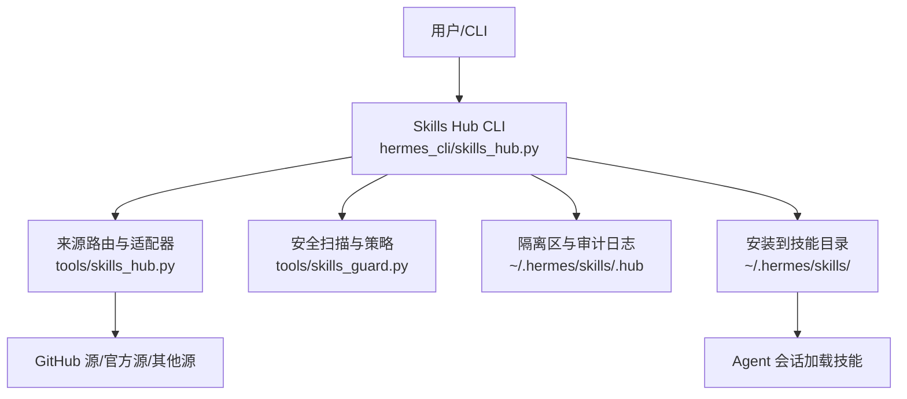
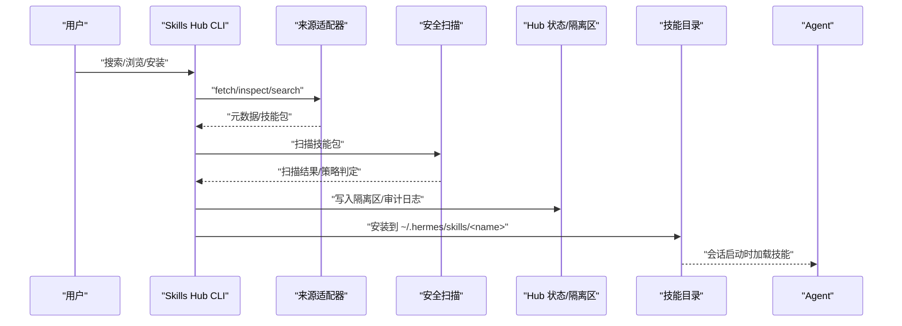
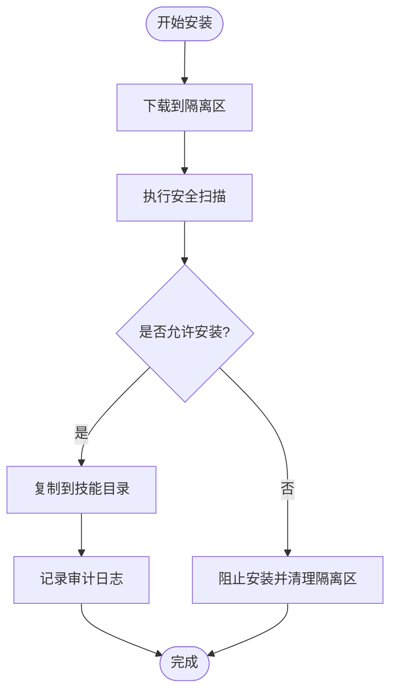
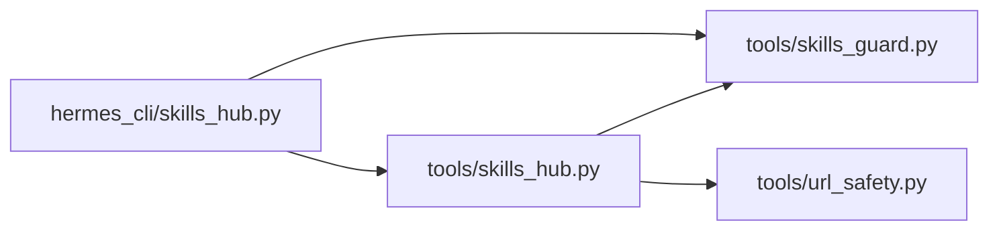

# 社区生态与共享

<cite>
**本文引用的文件**
- [README.md](file://README.md)
- [CONTRIBUTING.md](file://CONTRIBUTING.md)
- [hermes_cli/skills_hub.py](file://hermes_cli/skills_hub.py)
- [tools/skills_hub.py](file://tools/skills_hub.py)
- [tools/skills_guard.py](file://tools/skills_guard.py)
- [.github/workflows/ci.yml](file://.github/workflows/ci.yml)
- [.github/workflows/supply-chain-audit.yml](file://.github/workflows/supply-chain-audit.yml)
- [.github/workflows/osv-scanner.yml](file://.github/workflows/osv-scanner.yml)
- [.github/workflows/skills-index.yml](file://.github/workflows/skills-index.yml)
- [.github/workflows/skills-index-freshness.yml](file://.github/workflows/skills-index-freshness.yml)
</cite>

## 目录
1. [简介](#简介)
2. [项目结构](#项目结构)
3. [核心组件](#核心组件)
4. [架构总览](#架构总览)
5. [详细组件分析](#详细组件分析)
6. [依赖关系分析](#依赖关系分析)
7. [性能考量](#性能考量)
8. [故障排查指南](#故障排查指南)
9. [结论](#结论)
10. [附录](#附录)

## 简介
本文件面向技能作者、贡献者与平台运营者，系统化说明 Hermes Agent 的技能社区运作模式与共享机制。内容涵盖：
- 技能发布标准、代码审查流程、版本管理与分发机制
- 技能包打包格式、依赖声明、许可证要求与安全扫描
- 社区治理规则、贡献者指南、问题报告与功能请求流程
- 技能质量保证措施、用户反馈收集、评分系统与推荐算法
- 技能营销与推广策略（文档、示例、案例研究、社区互动）
- 技能作者发布与维护的完整指导，促进生态繁荣

## 项目结构
Hermes 将“技能”作为可发现、可安装、可安全运行的能力单元，通过 Skills Hub 统一检索、下载、隔离、扫描与安装；内置官方可选技能与来自 GitHub/第三方源的技能共同构成生态目录。

图表来源
- [hermes_cli/skills_hub.py:490-793](file://hermes_cli/skills_hub.py#L490-L793)
- [tools/skills_hub.py:130-153](file://tools/skills_hub.py#L130-L153)
- [tools/skills_guard.py](file://tools/skills_guard.py)

章节来源
- [README.md:163-184](file://README.md#L163-L184)
- [CONTRIBUTING.md:404-624](file://CONTRIBUTING.md#L404-L624)

## 核心组件
- Skills Hub CLI：提供搜索、浏览、检查、安装、更新等命令，统一入口。
- 来源适配器：抽象 SkillSource 接口，支持 GitHub、官方仓库、第三方注册表等。
- 安全扫描器：对技能包进行静态检查、路径穿越防护、SSRF 防护、可信仓库白名单等。
- 锁定与审计：记录已安装技能的来源、路径、信任等级，并维护审计日志。
- 索引缓存：集中索引与本地缓存加速浏览与搜索。

章节来源
- [hermes_cli/skills_hub.py:250-488](file://hermes_cli/skills_hub.py#L250-L488)
- [tools/skills_hub.py:476-502](file://tools/skills_hub.py#L476-L502)
- [tools/skills_hub.py:130-153](file://tools/skills_hub.py#L130-L153)
- [tools/skills_hub.py:294-338](file://tools/skills_hub.py#L294-L338)

## 架构总览
技能从发现到使用的全链路如下：

图表来源
- [hermes_cli/skills_hub.py:490-793](file://hermes_cli/skills_hub.py#L490-L793)
- [tools/skills_hub.py:645-708](file://tools/skills_hub.py#L645-L708)
- [tools/skills_guard.py](file://tools/skills_guard.py)

## 详细组件分析

### 技能包格式与元数据
- 每个技能以目录为单位，必须包含 SKILL.md，支持 frontmatter 字段：
  - name、description、version、author、license、platforms
  - required_environment_variables（安全的环境变量收集）
  - prerequisites（兼容旧版 env_vars/commands）
  - metadata.hermes.tags、related_skills、fallback_for_toolsets、requires_toolsets、blueprint
- 支持 references/templates/scripts/assets/examples 子目录，引用需通过安全校验，禁止路径穿越。
- 平台限制：通过 platforms 字段限定运行平台。
- 条件激活：根据工具/工具集可用性动态显示或隐藏技能。

章节来源
- [CONTRIBUTING.md:423-563](file://CONTRIBUTING.md#L423-L563)
- [tools/skills_hub.py:155-180](file://tools/skills_hub.py#L155-L180)

### 安全扫描与安装策略
- 隔离区：下载后先放入隔离目录，确认安全后再移动至正式目录。
- 安全扫描：执行静态检查、路径验证、SSRF 防护、网站访问策略检查。
- 策略判定：依据扫描结果决定是否允许安装；失败则清理隔离区并记录审计日志。
- 可信仓库：部分 GitHub 源标记为 trusted，提升信任等级。
- 审计日志：记录 BLOCKED/INSTALLED 等操作及原因。

图表来源
- [hermes_cli/skills_hub.py:639-741](file://hermes_cli/skills_hub.py#L639-L741)
- [tools/skills_hub.py:294-338](file://tools/skills_hub.py#L294-L338)
- [tools/skills_guard.py](file://tools/skills_guard.py)

章节来源
- [hermes_cli/skills_hub.py:639-741](file://hermes_cli/skills_hub.py#L639-L741)
- [tools/skills_hub.py:228-291](file://tools/skills_hub.py#L228-L291)

### 版本管理与分发机制
- 来源路由：统一通过 create_source_router 管理多个来源（official、github、clawhub、lobehub、browse-sh 等）。
- 去重与排序：按 trust_level 与 source 优先级合并结果，官方优先，再按信任等级降序。
- 索引缓存：集中索引与本地缓存，提高浏览与搜索效率。
- 锁定文件：记录已安装技能的 identifier、install_path、source、trust_level，防止误删与路径逃逸。
- 更新与回滚：通过锁定文件与审计日志追踪变更，支持强制重装与缓存失效。

章节来源
- [hermes_cli/skills_hub.py:319-488](file://hermes_cli/skills_hub.py#L319-L488)
- [tools/skills_hub.py:130-153](file://tools/skills_hub.py#L130-L153)
- [tools/skills_hub.py:757-795](file://tools/skills_hub.py#L757-L795)

### 代码审查流程与贡献指南
- 贡献优先级：缺陷修复 > 跨平台兼容 > 安全加固 > 性能与健壮性 > 新技能 > 新工具 > 文档。
- 技能 vs 工具：能由指令+脚本+现有工具实现的优先做成技能；需要端到端集成、二进制流、实时事件等才做工具。
- 官方可选技能：放在 optional-skills/，默认不启用，可通过 hub 发现与安装。
- 第三方插件：独立仓库发布，通过约定接口与生命周期钩子接入。
- 测试与 CI：遵循 hermetic 环境运行测试，避免 API Key 泄露；PR 前运行脚本确保质量。

章节来源
- [CONTRIBUTING.md:7-17](file://CONTRIBUTING.md#L7-L17)
- [CONTRIBUTING.md:39-67](file://CONTRIBUTING.md#L39-L67)
- [CONTRIBUTING.md:70-102](file://CONTRIBUTING.md#L70-L102)
- [CONTRIBUTING.md:201-211](file://CONTRIBUTING.md#L201-L211)

### 问题报告与功能请求流程
- 提交前搜索：在 Issues 与 PRs 中搜索重复项，避免重复工作。
- 模板与规范：遵循 PR 模板中的重复检查，在评审阶段也会触发。
- 大型工作：先在 Issue 下评论表明正在处理，协调分工。

章节来源
- [CONTRIBUTING.md:21-35](file://CONTRIBUTING.md#L21-L35)

### 质量保证与用户反馈
- 安全扫描：每次安装均执行扫描，输出报告与来源信息（scanner_version、bundle_hash、rules）。
- 审计日志：记录安装/阻止操作，便于追溯。
- 用户反馈：通过 Discord、Issues 与文档站点收集反馈；技能描述与标签有助于搜索与定位。
- 评分与推荐：当前实现基于 trust_level 与 source 排序（官方优先、trusted 次之），未实现显式评分系统；可在未来扩展。

章节来源
- [hermes_cli/skills_hub.py:650-677](file://hermes_cli/skills_hub.py#L650-L677)
- [hermes_cli/skills_hub.py:395-410](file://hermes_cli/skills_hub.py#L395-L410)
- [README.md:250-255](file://README.md#L250-L255)

### 技能营销与推广策略
- 文档编写：SKILL.md 需遵循现代章节顺序（When to Use、Prerequisites、How to Run、Quick Reference、Procedure、Pitfalls、Verification）。
- 示例展示：在 references/ 与 templates/ 提供模板与参考，scripts/ 提供辅助脚本。
- 案例研究：通过官方可选技能与社区分享形成最佳实践。
- 社区互动：在 Discord #plugins-skills-and-skins 频道推广；利用 Skills Hub 的搜索与浏览提升可见度。

章节来源
- [CONTRIBUTING.md:600-623](file://CONTRIBUTING.md#L600-L623)
- [CONTRIBUTING.md:94-100](file://CONTRIBUTING.md#L94-L100)

### 技能作者发布与维护指导
- 打包格式：以目录为单位，包含 SKILL.md 与必要的支持文件；遵循路径安全校验。
- 依赖声明：通过 required_environment_variables 声明环境变量；prerequisites.commands 仅作为提示。
- 许可证要求：frontmatter 中声明 license；遵守 MIT 等开源协议。
- 安全扫描：安装前自动扫描，关注扫描报告与阻断原因。
- 维护建议：保持 description ≤ 60 字符；明确 when to use；提供 quick reference 与 verification 步骤；定期更新依赖与脚本。

章节来源
- [CONTRIBUTING.md:423-563](file://CONTRIBUTING.md#L423-L563)
- [CONTRIBUTING.md:565-623](file://CONTRIBUTING.md#L565-L623)

## 依赖关系分析
- 模块耦合：
  - hermes_cli/skills_hub.py 依赖 tools/skills_hub.py 与 tools/skills_guard.py。
  - tools/skills_hub.py 定义 SkillSource 抽象与具体实现（GitHubSource、OptionalSkillSource）。
  - 安全扫描与 URL 安全校验通过 tools/skills_guard.py 与 tools/url_safety.py 协作。
- 外部依赖：
  - GitHub API 认证（PAT、gh CLI、GitHub App）。
  - httpx 用于 HTTP 请求，yaml 解析 frontmatter。
- 潜在循环：通过延迟导入避免循环依赖（如 tools.skills_hub 与 tools.skills_guard）。

图表来源
- [hermes_cli/skills_hub.py:23-25](file://hermes_cli/skills_hub.py#L23-L25)
- [tools/skills_hub.py:37-42](file://tools/skills_hub.py#L37-L42)

章节来源
- [tools/skills_hub.py:476-502](file://tools/skills_hub.py#L476-L502)
- [tools/skills_hub.py:349-470](file://tools/skills_hub.py#L349-L470)

## 性能考量
- 并行拉取：多来源并行搜索与拉取，设置 per-source limits 与 overall timeout，避免阻塞。
- 缓存策略：索引缓存与树缓存减少重复 API 调用；扫描结果缓存降低重复开销。
- 分页与限流：浏览分页控制 UI 渲染；GitHub API 速率限制检测并提供提示。
- 资源占用：隔离区与审计日志小文件 IO；避免大体积技能包影响安装速度。

章节来源
- [hermes_cli/skills_hub.py:337-379](file://hermes_cli/skills_hub.py#L337-L379)
- [tools/skills_hub.py:757-795](file://tools/skills_hub.py#L757-L795)
- [tools/skills_hub.py:645-708](file://tools/skills_hub.py#L645-L708)

## 故障排查指南
- 无法拉取技能：检查 GitHub API 速率限制，配置 GITHUB_TOKEN 或使用 gh auth login。
- 安装被阻止：查看扫描报告与审计日志，确认阻断原因（路径不安全、策略拒绝等）。
- 技能未生效：重启会话或刷新提示缓存；确认技能目录结构与 SKILL.md 格式正确。
- 平台不兼容：检查 platforms 字段与实际运行环境匹配。

章节来源
- [hermes_cli/skills_hub.py:547-565](file://hermes_cli/skills_hub.py#L547-L565)
- [hermes_cli/skills_hub.py:679-689](file://hermes_cli/skills_hub.py#L679-L689)
- [hermes_cli/skills_hub.py:784-793](file://hermes_cli/skills_hub.py#L784-L793)

## 结论
Hermes 的技能生态以“可发现、可安装、可安全运行”为核心目标，通过统一的 Skills Hub、严格的安全扫描与清晰的贡献规范，构建了可持续演进的社区体系。作者应遵循发布标准与安全要求，持续优化文档与示例；运营方应完善索引与推荐机制，提升技能可见性与用户体验。

## 附录

### 自动化流水线与安全检查
- CI 流水线：统一构建、测试与部署流程。
- 供应链审计：依赖漏洞与许可证合规检查。
- OSV 扫描：开源漏洞扫描。
- 技能索引：构建与新鲜度检查，保证目录及时更新。

章节来源
- [.github/workflows/ci.yml](file://.github/workflows/ci.yml)
- [.github/workflows/supply-chain-audit.yml](file://.github/workflows/supply-chain-audit.yml)
- [.github/workflows/osv-scanner.yml](file://.github/workflows/osv-scanner.yml)
- [.github/workflows/skills-index.yml](file://.github/workflows/skills-index.yml)
- [.github/workflows/skills-index-freshness.yml](file://.github/workflows/skills-index-freshness.yml)