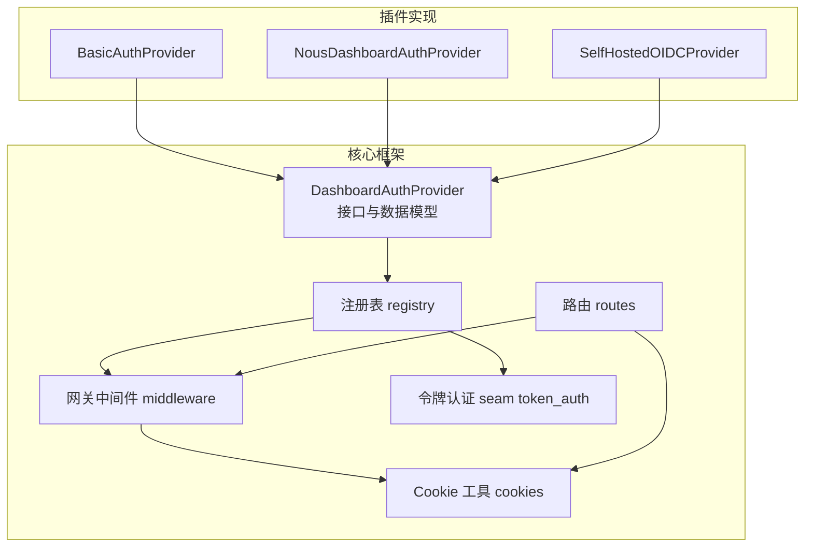
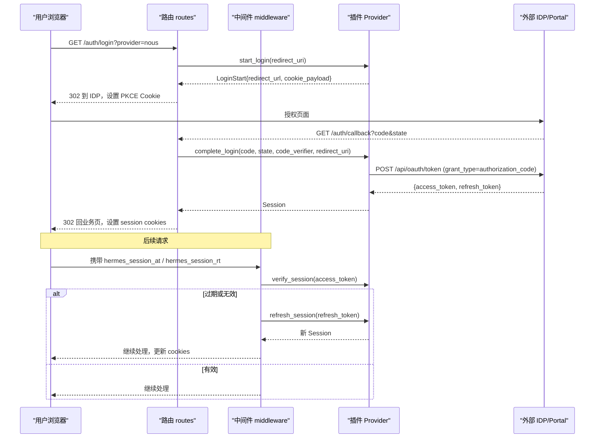
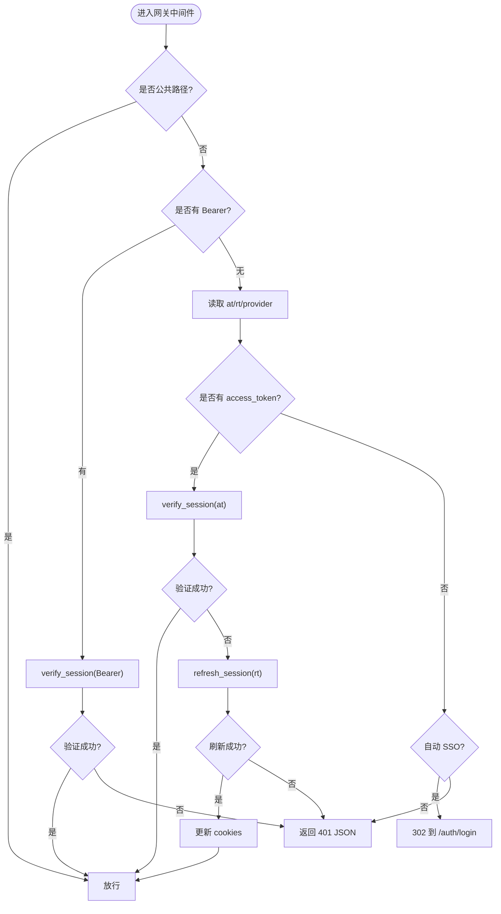
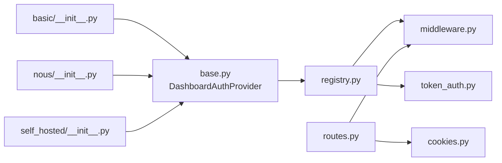

# 仪表板认证插件

<cite>
**本文引用的文件**
- [base.py](file://hermes_cli/dashboard_auth/base.py)
- [registry.py](file://hermes_cli/dashboard_auth/registry.py)
- [middleware.py](file://hermes_cli/dashboard_auth/middleware.py)
- [token_auth.py](file://hermes_cli/dashboard_auth/token_auth.py)
- [cookies.py](file://hermes_cli/dashboard_auth/cookies.py)
- [routes.py](file://hermes_cli/dashboard_auth/routes.py)
- [basic/__init__.py](file://plugins/dashboard_auth/basic/__init__.py)
- [nous/__init__.py](file://plugins/dashboard_auth/nous/__init__.py)
- [self_hosted/__init__.py](file://plugins/dashboard_auth/self_hosted/__init__.py)
</cite>

## 目录
1. [简介](#简介)
2. [项目结构](#项目结构)
3. [核心组件](#核心组件)
4. [架构总览](#架构总览)
5. [详细组件分析](#详细组件分析)
6. [依赖关系分析](#依赖关系分析)
7. [性能与可扩展性](#性能与可扩展性)
8. [故障排查指南](#故障排查指南)
9. [结论](#结论)
10. [附录：开发示例与最佳实践](#附录：开发示例与最佳实践)

## 简介
本指南面向希望为仪表板扩展新认证方式的开发者，系统说明认证插件的接口规范、会话管理、权限控制与令牌处理机制，覆盖 OAuth（含 PKCE）、JWT、LDAP（通过密码登录路径）等常见协议。文档提供完整实现示例，包括基本认证（用户名/密码）、Nous 认证（Portal OAuth）和自托管 OIDC 认证，并解释用户信息映射、角色/组织与访问控制策略。同时涵盖安全考虑、会话生命周期与错误处理，帮助开发者快速构建可插拔、可组合、可审计的认证能力。

## 项目结构
仪表板认证由“核心框架 + 插件”构成：
- 核心框架位于 hermes_cli/dashboard_auth，定义抽象接口、注册表、中间件、Cookie 与路由。
- 插件位于 plugins/dashboard_auth，包含 basic、nous、self_hosted 三种内置实现，可按需扩展更多提供者。

图表来源
- [base.py:105-270](file://hermes_cli/dashboard_auth/base.py#L105-L270)
- [registry.py:23-75](file://hermes_cli/dashboard_auth/registry.py#L23-L75)
- [middleware.py:323-531](file://hermes_cli/dashboard_auth/middleware.py#L323-L531)
- [token_auth.py:144-195](file://hermes_cli/dashboard_auth/token_auth.py#L144-L195)
- [cookies.py:166-213](file://hermes_cli/dashboard_auth/cookies.py#L166-L213)
- [routes.py:182-558](file://hermes_cli/dashboard_auth/routes.py#L182-L558)

章节来源
- [base.py:105-270](file://hermes_cli/dashboard_auth/base.py#L105-L270)
- [registry.py:23-75](file://hermes_cli/dashboard_auth/registry.py#L23-L75)
- [middleware.py:323-531](file://hermes_cli/dashboard_auth/middleware.py#L323-L531)
- [token_auth.py:144-195](file://hermes_cli/dashboard_auth/token_auth.py#L144-L195)
- [cookies.py:166-213](file://hermes_cli/dashboard_auth/cookies.py#L166-L213)
- [routes.py:182-558](file://hermes_cli/dashboard_auth/routes.py#L182-L558)

## 核心组件
- DashboardAuthProvider（抽象基类）
  - 统一接口：start_login、complete_login、verify_session、refresh_session、revoke_session；可选 complete_password_login、verify_token。
  - 数据模型：Session（交互式会话）、TokenPrincipal（非交互令牌主体）、LoginStart（OAuth 启动）。
  - 异常语义：ProviderError（IDP 不可达）、InvalidCodeError（回调校验失败）、InvalidCredentialsError（凭据无效）、RefreshExpiredError（刷新令牌失效）。
- 注册表 registry
  - 维护 provider 列表，支持按名称获取、列出会话/令牌提供者，测试清理。
- 网关中间件 middleware
  - 公共路径白名单、Bearer 优先验证、会话 Cookie 验证与透明刷新、自动 SSO 重定向、未认证响应（API 返回 401 JSON，HTML 跳转 /login）。
- 令牌认证 seam token_auth
  - 针对服务间调用的无状态 Bearer 认证，仅对已注册路径生效，失败关闭（401），后端不可达时返回 503。
- Cookie 工具 cookies
  - 三枚关键 Cookie：access_token、refresh_token、provider 提示；PKCE 短期状态；SSO 尝试标记；根据 HTTPS/前缀选择 __Host-/__Secure- 前缀。
- 路由 routes
  - 登录页、OAuth 往返、原生应用授权、密码登录、注销、身份查询、WS 票据等。

章节来源
- [base.py:105-270](file://hermes_cli/dashboard_auth/base.py#L105-L270)
- [registry.py:23-75](file://hermes_cli/dashboard_auth/registry.py#L23-L75)
- [middleware.py:323-531](file://hermes_cli/dashboard_auth/middleware.py#L323-L531)
- [token_auth.py:144-195](file://hermes_cli/dashboard_auth/token_auth.py#L144-L195)
- [cookies.py:166-213](file://hermes_cli/dashboard_auth/cookies.py#L166-L213)
- [routes.py:182-558](file://hermes_cli/dashboard_auth/routes.py#L182-L558)

## 架构总览
下图展示一次典型 OAuth 登录流程（以 Nous 为例），以及后续请求的会话验证与刷新。

图表来源
- [routes.py:182-558](file://hermes_cli/dashboard_auth/routes.py#L182-L558)
- [nous/__init__.py:179-347](file://plugins/dashboard_auth/nous/__init__.py#L179-L347)
- [middleware.py:323-531](file://hermes_cli/dashboard_auth/middleware.py#L323-L531)
- [cookies.py:166-213](file://hermes_cli/dashboard_auth/cookies.py#L166-L213)

## 详细组件分析

### 抽象接口与数据模型
- Session：包含 user_id、email、display_name、org_id、provider、expires_at、access_token、refresh_token。所有字段必填，provider 用于路由到对应插件。
- TokenPrincipal：用于非交互令牌认证，包含 principal、provider、scopes。
- LoginStart：OAuth 第一步返回的重定向 URL 与短期 Cookie 载荷（如 PKCE state、CSRF nonce）。
- 异常体系：ProviderError、InvalidCodeError、InvalidCredentialsError、RefreshExpiredError，分别对应网络/IDP 不可达、回调参数非法、凭据无效、刷新令牌失效。

章节来源
- [base.py:9-103](file://hermes_cli/dashboard_auth/base.py#L9-L103)
- [base.py:105-270](file://hermes_cli/dashboard_auth/base.py#L105-L270)

### 注册表与提供者发现
- register_provider：注册时进行协议合规检查，防止重复注册。
- list_providers / get_provider：按名称获取或枚举全部提供者。
- list_session_providers / list_token_providers：区分交互式会话与非交互令牌提供者，确保只向合适的提供者发起相应调用。

章节来源
- [registry.py:23-75](file://hermes_cli/dashboard_auth/registry.py#L23-L75)

### 网关中间件与会话生命周期
- 公共路径白名单：/auth/*、/api/auth/providers、静态资源等。
- Bearer 优先：若请求头携带 Authorization: Bearer，则直接调用 verify_session 验证，成功即放行，不写 Cookie。
- 会话验证与刷新：
  - 先尝试 verify_session；若失败且存在 refresh_token，则调用 refresh_session 透明刷新。
  - 任一提供者不可达（ProviderError）时返回 503，避免误判为凭据错误。
  - 刷新成功后更新 Cookie（含旋转后的 refresh_token）。
- 自动 SSO：当仅有一个交互式 OAuth 提供者且无 Cookie 时，自动重定向到门户授权页，减少点击。
- 未认证响应：API 返回结构化 401 JSON（含 login_url），HTML 跳转 /login。

图表来源
- [middleware.py:323-531](file://hermes_cli/dashboard_auth/middleware.py#L323-L531)
- [middleware.py:547-592](file://hermes_cli/dashboard_auth/middleware.py#L547-L592)
- [cookies.py:166-213](file://hermes_cli/dashboard_auth/cookies.py#L166-L213)

章节来源
- [middleware.py:323-531](file://hermes_cli/dashboard_auth/middleware.py#L323-L531)
- [middleware.py:547-592](file://hermes_cli/dashboard_auth/middleware.py#L547-L592)

### 令牌认证 seam（非交互）
- 仅对显式注册的路径生效，严格匹配。
- 从 Authorization 头提取 Bearer，依次调用 supports_token 提供者的 verify_token。
- 任一提供者不可达返回 503；否则未识别返回 401。
- 成功后将 TokenPrincipal 注入 request.state，供下游路由使用。

章节来源
- [token_auth.py:104-195](file://hermes_cli/dashboard_auth/token_auth.py#L104-L195)

### Cookie 与安全
- 三枚 Cookie：
  - hermes_session_at：访问令牌，HttpOnly，TTL 与令牌 exp 一致。
  - hermes_session_rt：刷新令牌，HttpOnly，较长 TTL，支持旋转与复用检测。
  - hermes_session_provider：提供者提示，用于多提供者场景下正确路由刷新。
- 安全属性：SameSite=Lax；HTTPS 下启用 Secure；根据部署前缀选择 __Host-/__Secure- 前缀。
- PKCE Cookie：短期存储 state 与 verifier，登录完成后清除。
- SSO 尝试标记：防止自动重定向死循环。

章节来源
- [cookies.py:1-105](file://hermes_cli/dashboard_auth/cookies.py#L1-L105)
- [cookies.py:166-213](file://hermes_cli/dashboard_auth/cookies.py#L166-L213)
- [cookies.py:240-339](file://hermes_cli/dashboard_auth/cookies.py#L240-L339)

### 路由与登录流程
- /login：渲染登录页，携带 next 目标（同源校验）。
- /auth/login：选择提供者，生成 PKCE 并 302 到 IDP。
- /auth/callback：校验 state、调用 complete_login，设置 session cookies，跳转到 next。
- /auth/password-login：密码登录，速率限制，成功后设置 session cookies。
- /auth/logout：最佳努力撤销刷新令牌，清除 cookies。
- /api/auth/me：返回当前会话信息（受网关保护）。
- /api/auth/ws-ticket：WebSocket 升级票据（Phase 5）。

章节来源
- [routes.py:132-174](file://hermes_cli/dashboard_auth/routes.py#L132-L174)
- [routes.py:182-558](file://hermes_cli/dashboard_auth/routes.py#L182-L558)
- [routes.py:650-770](file://hermes_cli/dashboard_auth/routes.py#L650-L770)
- [routes.py:778-800](file://hermes_cli/dashboard_auth/routes.py#L778-L800)

## 依赖关系分析
- 插件依赖核心接口：所有提供者均实现 DashboardAuthProvider。
- 中间件依赖注册表：按 supports_session/supports_token 筛选提供者。
- 路由依赖中间件与 Cookie：完成登录往返与会话持久化。
- 令牌认证 seam 独立于会话网关：仅对注册路径生效，避免扩大攻击面。

图表来源
- [base.py:105-270](file://hermes_cli/dashboard_auth/base.py#L105-L270)
- [registry.py:23-75](file://hermes_cli/dashboard_auth/registry.py#L23-L75)
- [middleware.py:323-531](file://hermes_cli/dashboard_auth/middleware.py#L323-L531)
- [token_auth.py:144-195](file://hermes_cli/dashboard_auth/token_auth.py#L144-L195)
- [routes.py:182-558](file://hermes_cli/dashboard_auth/routes.py#L182-L558)
- [cookies.py:166-213](file://hermes_cli/dashboard_auth/cookies.py#L166-L213)

章节来源
- [registry.py:23-75](file://hermes_cli/dashboard_auth/registry.py#L23-L75)
- [middleware.py:323-531](file://hermes_cli/dashboard_auth/middleware.py#L323-L531)
- [token_auth.py:144-195](file://hermes_cli/dashboard_auth/token_auth.py#L144-L195)

## 性能与可扩展性
- 懒加载与缓存：
  - JWKS 客户端延迟初始化与键缓存（5 分钟），降低首次验证开销。
  - OIDC 发现文档进程内缓存（1 小时），减少网络抖动影响。
- 并发安全：注册表与令牌路由集合使用线程锁保护。
- 可扩展点：
  - 新增提供者只需实现 DashboardAuthProvider 并注册。
  - 新增令牌认证提供者，仅需实现 verify_token 并设置 supports_token。
  - 新增受保护的 API 路径，通过 register_token_route 声明。

章节来源
- [nous/__init__.py:415-428](file://plugins/dashboard_auth/nous/__init__.py#L415-L428)
- [self_hosted/__init__.py:479-500](file://plugins/dashboard_auth/self_hosted/__init__.py#L479-L500)
- [registry.py:23-75](file://hermes_cli/dashboard_auth/registry.py#L23-L75)
- [token_auth.py:60-80](file://hermes_cli/dashboard_auth/token_auth.py#L60-L80)

## 故障排查指南
- 常见问题定位
  - 401 未认证：检查是否缺少 Bearer 或 Cookie；确认路由是否注册为令牌认证路径；查看 providers 列表是否包含期望提供者。
  - 503 提供者不可达：检查 IDP/JWKS 可达性；确认网络代理与证书；查看日志中 ProviderError 详情。
  - 刷新失败：确认 refresh_token 是否存在且未过期；对于 Nous Portal，注意刷新令牌旋转与复用检测。
  - 登录失败：检查 PKCE state 是否匹配；回调地址是否正确；密码登录是否触发速率限制。
- 建议操作
  - 启用审计日志，关注 LOGIN_FAILURE、REFRESH_FAILURE、TOKEN_AUTH_FAILURE 事件。
  - 在本地使用 --insecure 或 loopback 模式临时绕过网关，逐步定位问题。
  - 核对配置：client_id、portal_url、issuer、scopes、public_url 等是否与 IDP 一致。

章节来源
- [routes.py:427-477](file://hermes_cli/dashboard_auth/routes.py#L427-L477)
- [routes.py:650-770](file://hermes_cli/dashboard_auth/routes.py#L650-L770)
- [middleware.py:421-517](file://hermes_cli/dashboard_auth/middleware.py#L421-L517)
- [token_auth.py:166-195](file://hermes_cli/dashboard_auth/token_auth.py#L166-L195)

## 结论
仪表板认证插件体系通过统一的抽象接口、严格的中间件网关、安全的 Cookie 管理与灵活的令牌认证 seam，提供了可扩展、可组合、可审计的认证能力。开发者可基于该框架快速接入 OAuth、JWT、LDAP（密码路径）等多种协议，并通过插件化方式扩展新的认证方式。遵循本文档的接口规范与安全实践，可确保系统在多提供者环境下稳定运行，并提供良好的用户体验与可观测性。

## 附录：开发示例与最佳实践

### 实现一个自定义认证插件（步骤）
- 新建插件模块，实现 DashboardAuthProvider：
  - 必须实现：start_login、complete_login、verify_session、refresh_session、revoke_session。
  - 可选实现：complete_password_login（supports_password=True）、verify_token（supports_token=True）。
- 在插件入口 register(ctx) 中构造实例并调用 ctx.register_dashboard_auth_provider(provider)。
- 如需令牌认证，实现 verify_token 并在路由中通过 register_token_route 声明受保护路径。
- 遵循异常语义：网络/IDP 不可达抛 ProviderError；凭据无效抛 InvalidCredentialsError；回调参数非法抛 InvalidCodeError；刷新令牌失效抛 RefreshExpiredError。

章节来源
- [base.py:105-270](file://hermes_cli/dashboard_auth/base.py#L105-L270)
- [registry.py:23-75](file://hermes_cli/dashboard_auth/registry.py#L23-L75)
- [token_auth.py:60-80](file://hermes_cli/dashboard_auth/token_auth.py#L60-L80)

### 基本认证（用户名/密码）
- 特点：无外部 IDP，使用 HMAC 签名无状态令牌；支持密码登录；适合单节点自托管。
- 配置：username、password_hash（或 password）、secret（可选）、session_ttl_seconds。
- 安全：scrypt 哈希、常量时间比较、防枚举计时侧信道。

章节来源
- [basic/__init__.py:201-327](file://plugins/dashboard_auth/basic/__init__.py#L201-L327)
- [basic/__init__.py:335-492](file://plugins/dashboard_auth/basic/__init__.py#L335-L492)

### Nous 认证（Portal OAuth）
- 特点：Authorization Code + PKCE；RS256 JWT 访问令牌；刷新令牌旋转与复用检测；支持 agent_instance_id 与 contract version 校验。
- 配置：client_id（agent:{instance_id}）、portal_url（可选）。
- 安全：JWKS 缓存、aud/iss 校验、contract version 兼容处理。

章节来源
- [nous/__init__.py:153-347](file://plugins/dashboard_auth/nous/__init__.py#L153-L347)
- [nous/__init__.py:415-516](file://plugins/dashboard_auth/nous/__init__.py#L415-L516)
- [nous/__init__.py:605-672](file://plugins/dashboard_auth/nous/__init__.py#L605-L672)

### 自托管 OIDC 认证
- 特点：标准 OIDC Relying Party；支持公开/机密客户端；自动发现端点；验证 ID 令牌；支持 revocation_endpoint。
- 配置：issuer、client_id、scopes（默认 openid profile email）、client_secret（可选）。
- 安全：强制 HTTPS（除 loopback）；算法白名单（RS256/ES256 等）；发现文档与端点校验。

章节来源
- [self_hosted/__init__.py:174-355](file://plugins/dashboard_auth/self_hosted/__init__.py#L174-L355)
- [self_hosted/__init__.py:479-592](file://plugins/dashboard_auth/self_hosted/__init__.py#L479-L592)
- [self_hosted/__init__.py:595-711](file://plugins/dashboard_auth/self_hosted/__init__.py#L595-L711)

### 用户信息映射、角色与访问控制
- 用户信息映射：
  - Nous：sub → user_id；org_id 来自 claims；email/display_name 为空（由 UI 显示 user_id）。
  - Self-hosted OIDC：sub → user_id；email/name/preferred_username/nickname → display_name；groups/org_id → org_id。
  - Basic：user_id = username；email/display_name/org_id 为空。
- 角色与访问控制：
  - 插件层负责身份认证与基础属性映射；细粒度权限控制应在上层路由/策略中实现（例如基于 org_id、provider 或 scopes 的策略）。
  - 令牌认证可通过 TokenPrincipal.scopes 表达能力集，供路由级策略使用。

章节来源
- [nous/__init__.py:517-537](file://plugins/dashboard_auth/nous/__init__.py#L517-L537)
- [self_hosted/__init__.py:664-711](file://plugins/dashboard_auth/self_hosted/__init__.py#L664-L711)
- [base.py:29-54](file://hermes_cli/dashboard_auth/base.py#L29-L54)

### 安全考虑
- 始终使用 HTTPS（除 loopback）；启用 Secure Cookie；SameSite=Lax。
- 使用 PKCE 防止授权码拦截；校验 state 防 CSRF。
- 常量时间比较与速率限制，防止凭据枚举与暴力破解。
- 严格校验 issuer/audience；拒绝不安全算法（如 HS256）。
- 令牌认证仅对显式注册路径生效，避免扩大攻击面。

章节来源
- [cookies.py:1-105](file://hermes_cli/dashboard_auth/cookies.py#L1-L105)
- [routes.py:253-286](file://hermes_cli/dashboard_auth/routes.py#L253-L286)
- [routes.py:650-770](file://hermes_cli/dashboard_auth/routes.py#L650-L770)
- [self_hosted/__init__.py:147-167](file://plugins/dashboard_auth/self_hosted/__init__.py#L147-L167)

### 会话管理与错误处理
- 会话生命周期：start_login → complete_login → verify_session → refresh_session → revoke_session。
- 错误处理：
  - ProviderError：IDP 不可达，返回 503，不强制登出。
  - InvalidCodeError：回调参数非法，返回 400。
  - InvalidCredentialsError：凭据无效，返回 401（通用消息）。
  - RefreshExpiredError：刷新令牌失效，清空 Cookie 并强制重新登录。

章节来源
- [base.py:72-103](file://hermes_cli/dashboard_auth/base.py#L72-L103)
- [middleware.py:421-517](file://hermes_cli/dashboard_auth/middleware.py#L421-L517)
- [routes.py:427-477](file://hermes_cli/dashboard_auth/routes.py#L427-L477)