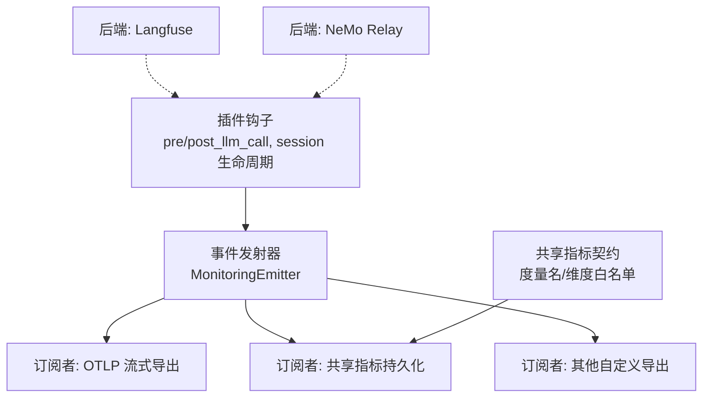
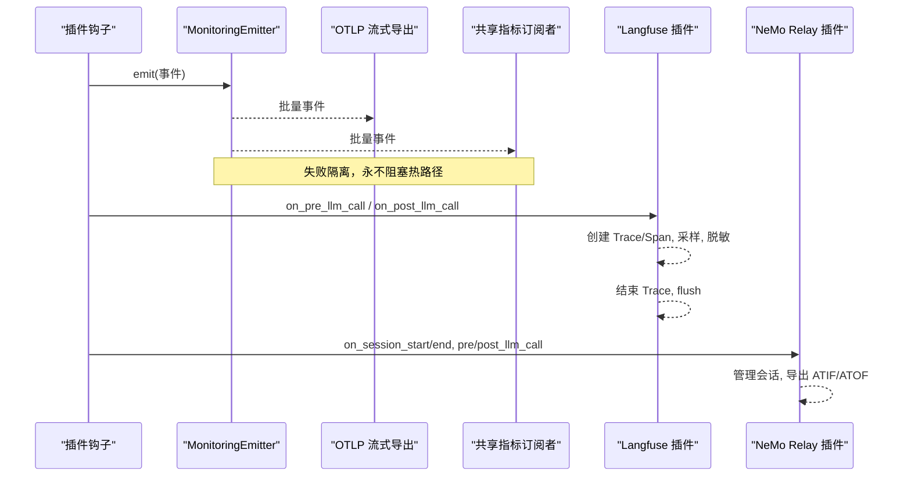
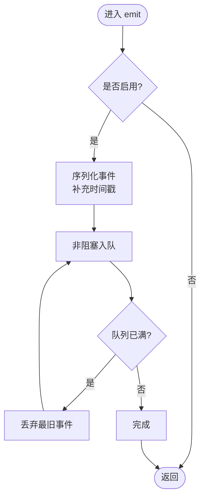
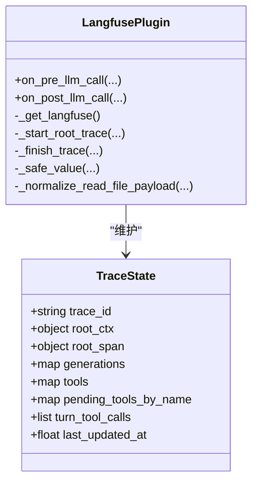
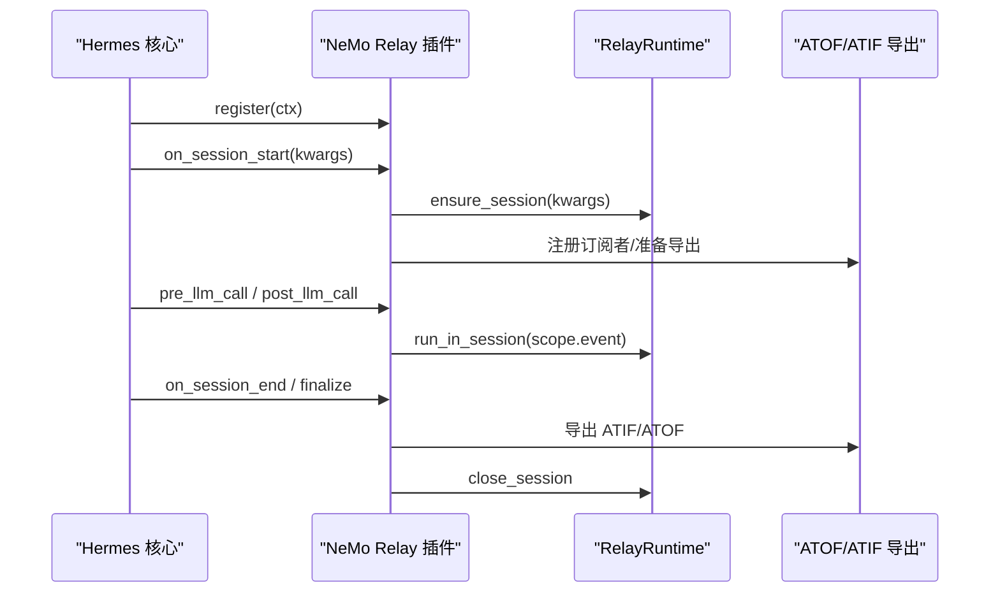
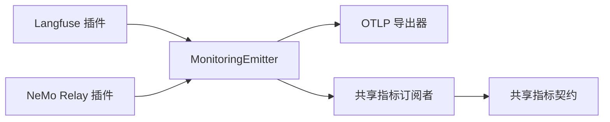

# 可观测性插件

<cite>
**本文引用的文件**
- [plugins/observability/langfuse/__init__.py](file://plugins/observability/langfuse/__init__.py)
- [plugins/observability/nemo_relay/__init__.py](file://plugins/observability/nemo_relay/__init__.py)
- [agent/monitoring/emitter.py](file://agent/monitoring/emitter.py)
- [agent/monitoring/events.py](file://agent/monitoring/events.py)
- [agent/monitoring/otlp_exporter.py](file://agent/monitoring/otlp_exporter.py)
- [hermes_cli/observability/shared_metrics_contract.py](file://hermes_cli/observability/shared_metrics_contract.py)
- [hermes_cli/observability/shared_metrics_subscriber.py](file://hermes_cli/observability/shared_metrics_subscriber.py)
- [plugins/plugin_utils.py](file://plugins/plugin_utils.py)
</cite>

## 目录
1. [简介](#简介)
2. [项目结构](#项目结构)
3. [核心组件](#核心组件)
4. [架构总览](#架构总览)
5. [详细组件分析](#详细组件分析)
6. [依赖关系分析](#依赖关系分析)
7. [性能考量](#性能考量)
8. [故障排查指南](#故障排查指南)
9. [结论](#结论)
10. [附录](#附录)

## 简介
本指南面向希望为 Hermes Agent 开发“可观测性插件”的开发者，覆盖接口规范、指标收集、日志与链路追踪机制，并提供 Langfuse 与 NeMo Relay 两种后端的完整实现参考。文档同时涵盖分布式追踪、性能监控、错误追踪、使用统计、数据格式标准化、采样策略、隐私保护、性能影响评估、数据导出与告警集成等主题，帮助你在不侵入核心业务的前提下扩展系统的可观测能力。

## 项目结构
Hermes 的可观测性由三层组成：
- 事件发射层：以无阻塞队列+后台分发器为核心，保证热路径零阻塞与失败隔离。
- 协议与标准层：定义共享指标契约（度量名、维度取值范围、字段校验），确保跨系统可聚合。
- 后端接入层：对接外部可观测性平台（Langfuse、NeMo Relay、OTLP Collector）。

图表来源
- [agent/monitoring/emitter.py:1-212](file://agent/monitoring/emitter.py#L1-L212)
- [hermes_cli/observability/shared_metrics_contract.py:1-977](file://hermes_cli/observability/shared_metrics_contract.py#L1-L977)
- [hermes_cli/observability/shared_metrics_subscriber.py:1-102](file://hermes_cli/observability/shared_metrics_subscriber.py#L1-L102)
- [agent/monitoring/otlp_exporter.py:1-273](file://agent/monitoring/otlp_exporter.py#L1-L273)

章节来源
- [agent/monitoring/emitter.py:1-212](file://agent/monitoring/emitter.py#L1-L212)
- [hermes_cli/observability/shared_metrics_contract.py:1-977](file://hermes_cli/observability/shared_metrics_contract.py#L1-L977)
- [hermes_cli/observability/shared_metrics_subscriber.py:1-102](file://hermes_cli/observability/shared_metrics_subscriber.py#L1-L102)
- [agent/monitoring/otlp_exporter.py:1-273](file://agent/monitoring/otlp_exporter.py#L1-L273)

## 核心组件
- 事件发射器 MonitoringEmitter：提供 emit() 热路径 API，内部维护环形缓冲队列与后台分发线程，批量投递给所有订阅者；失败隔离、永不抛异常到调用方。
- 事件类型 events：网关健康、诊断、定时任务执行等无内容敏感信息的事件模型，统一 to_dict() 输出。
- OTLP 导出器：将事件映射为 OpenTelemetry Span，通过 OTLP/HTTP 发送到操作者配置的 Collector。
- 共享指标契约：定义度量名、维度枚举、长度限制、校验函数，确保指标可聚合、低基数、安全。
- 共享指标订阅者：从 Relay 生命周期事件中抽取并持久化受控指标。
- 插件钩子与运行时：Langfuse 与 NeMo Relay 通过注册钩子（如 pre/post_llm_call、session 生命周期）接入。

章节来源
- [agent/monitoring/emitter.py:1-212](file://agent/monitoring/emitter.py#L1-L212)
- [agent/monitoring/events.py:1-87](file://agent/monitoring/events.py#L1-L87)
- [agent/monitoring/otlp_exporter.py:1-273](file://agent/monitoring/otlp_exporter.py#L1-L273)
- [hermes_cli/observability/shared_metrics_contract.py:1-977](file://hermes_cli/observability/shared_metrics_contract.py#L1-L977)
- [hermes_cli/observability/shared_metrics_subscriber.py:1-102](file://hermes_cli/observability/shared_metrics_subscriber.py#L1-L102)

## 架构总览
下图展示了从插件钩子到最终导出的端到端流程，包括 Langfuse 与 NeMo Relay 两条典型路径，以及共享指标与 OTLP 导出。

图表来源
- [agent/monitoring/emitter.py:1-212](file://agent/monitoring/emitter.py#L1-L212)
- [agent/monitoring/otlp_exporter.py:1-273](file://agent/monitoring/otlp_exporter.py#L1-L273)
- [plugins/observability/langfuse/__init__.py:1-800](file://plugins/observability/langfuse/__init__.py#L1-L800)
- [plugins/observability/nemo_relay/__init__.py:1-800](file://plugins/observability/nemo_relay/__init__.py#L1-L800)

## 详细组件分析

### 事件发射器与事件模型
- 热路径约束：emit() 必须 O(微秒级)、不阻塞、不抛异常；队列满时丢弃最旧事件，记录丢弃计数。
- 后台分发：独立线程批量拉取事件，分发给所有订阅者；单个订阅者异常不影响其他订阅者与主流程。
- 事件模型：GatewayHealthEvent、GatewayDiagnosticEvent、CronExecutionEvent 均无敏感内容，to_dict() 统一输出。

图表来源
- [agent/monitoring/emitter.py:1-212](file://agent/monitoring/emitter.py#L1-L212)

章节来源
- [agent/monitoring/emitter.py:1-212](file://agent/monitoring/emitter.py#L1-L212)
- [agent/monitoring/events.py:1-87](file://agent/monitoring/events.py#L1-L87)

### OTLP 导出器
- 目标：将监控事件映射为 OTel Span，发送至操作者配置的 OTLP 端点。
- 可选依赖：仅在需要时安装/导入 opentelemetry SDK，避免冷启动开销。
- 资源属性：注入服务名、实例 ID、遥测作用域等元数据。
- 流式订阅：作为 emitter 的订阅者持续消费批次，支持事件过滤。

章节来源
- [agent/monitoring/otlp_exporter.py:1-273](file://agent/monitoring/otlp_exporter.py#L1-L273)

### 共享指标契约与订阅者
- 契约要点：
  - 度量名固定集合（如 hermes.model_call.count、hermes.tool_call.count 等）。
  - 维度值严格白名单（如工具类别、延迟桶、结果状态等）。
  - 标识符长度限制（模型/提供者最大长度）。
  - 客户端资源字段受限（操作系统族、架构、安装方式、Hermes 版本）。
- 订阅者职责：
  - 从 Relay 事件中提取受控字段，进行归一化与校验。
  - 按度量名写入持久化存储，附带客户端资源。
  - 支持运行时 ID 过滤，避免多实例污染。

章节来源
- [hermes_cli/observability/shared_metrics_contract.py:1-977](file://hermes_cli/observability/shared_metrics_contract.py#L1-L977)
- [hermes_cli/observability/shared_metrics_subscriber.py:1-102](file://hermes_cli/observability/shared_metrics_subscriber.py#L1-L102)

### Langfuse 可观测性插件
- 激活条件：SDK 可用且环境变量配置正确（公钥/私钥/基础 URL/环境/版本/采样率/字符上限）。
- 关键特性：
  - 进程内 Trace 状态管理：按 turn/api_request_id 区分并发请求，防止键冲突。
  - 采样与截断：支持采样率控制；字符串与 JSON 字段截断，避免过大负载。
  - 隐私保护：对 data URI（图片/音频）进行脱敏；读取文件内容仅保留首尾行预览。
  - 用量与成本：标准化 usage 并计算成本，适配 Langfuse dashboard 的 key 命名约定。
  - 健壮性：初始化失败缓存，后续快速短路；溢出时驱逐最久未更新 trace，关闭根 span。
- 钩子集成：在 pre/post_llm_call 中创建/结束 trace，合并 tool_calls 到输出。

图表来源
- [plugins/observability/langfuse/__init__.py:1-800](file://plugins/observability/langfuse/__init__.py#L1-L800)

章节来源
- [plugins/observability/langfuse/__init__.py:1-800](file://plugins/observability/langfuse/__init__.py#L1-L800)

### NeMo Relay 可观测性插件
- 激活条件：加载设置（plugins.toml、动态插件）、按需启用 ATOF/ATIF 导出。
- 会话管理：prepare_session/ensure_session/run_in_session/close_session/shutdown 全生命周期管理。
- 子代理上下文：记录父会话与元数据，支持嵌入式子代理导出模式。
- 插件配置：进程级配置共享，支持动态插件初始化与清理；失败回退到直接导出。
- 钩子集成：注册 on_session_*、pre/post_llm_call、subagent_* 等钩子，转发为 scope/event/mark。

图表来源
- [plugins/observability/nemo_relay/__init__.py:1-800](file://plugins/observability/nemo_relay/__init__.py#L1-L800)

章节来源
- [plugins/observability/nemo_relay/__init__.py:1-800](file://plugins/observability/nemo_relay/__init__.py#L1-L800)

### 插件并发与单例工具
- lazy_singleton：装饰器形式的线程安全懒加载单例，适用于无参工厂。
- SingletonSlot：带参数的懒加载槽位，首次成功构建后缓存实例，忽略后续参数。
- 建议：插件应优先使用这些工具避免 TOCTOU 竞争与资源泄漏。

章节来源
- [plugins/plugin_utils.py:1-136](file://plugins/plugin_utils.py#L1-L136)

## 依赖关系分析
- 事件发射器是所有可观测性数据的唯一出口，下游订阅者彼此解耦。
- 共享指标契约约束了指标名称与维度取值，确保跨系统可聚合。
- OTLP 导出器依赖可选的 OpenTelemetry SDK，仅在启用时引入。
- Langfuse/NeMo Relay 插件通过钩子接入，不修改核心逻辑。

图表来源
- [agent/monitoring/emitter.py:1-212](file://agent/monitoring/emitter.py#L1-L212)
- [agent/monitoring/otlp_exporter.py:1-273](file://agent/monitoring/otlp_exporter.py#L1-L273)
- [hermes_cli/observability/shared_metrics_contract.py:1-977](file://hermes_cli/observability/shared_metrics_contract.py#L1-L977)
- [hermes_cli/observability/shared_metrics_subscriber.py:1-102](file://hermes_cli/observability/shared_metrics_subscriber.py#L1-L102)
- [plugins/observability/langfuse/__init__.py:1-800](file://plugins/observability/langfuse/__init__.py#L1-L800)
- [plugins/observability/nemo_relay/__init__.py:1-800](file://plugins/observability/nemo_relay/__init__.py#L1-L800)

章节来源
- [agent/monitoring/emitter.py:1-212](file://agent/monitoring/emitter.py#L1-L212)
- [hermes_cli/observability/shared_metrics_contract.py:1-977](file://hermes_cli/observability/shared_metrics_contract.py#L1-L977)

## 性能考量
- 热路径零阻塞：emitter.emit() 使用非阻塞入队，队列满则丢弃最旧事件，保证主流程不受影响。
- 批量处理：后台线程批量拉取事件，降低 I/O 与序列化开销。
- 失败隔离：每个订阅者异常被捕获，不影响其他订阅者与主流程。
- 采样与截断：Langfuse 支持采样率与字段截断，避免大负载与噪声。
- 内存上限：Trace 状态表有硬上限，超过时驱逐最久未更新的条目并关闭根 span，防止内存泄漏。
- 可选依赖：OTLP 导出器仅在启用时引入 SDK，减少冷启动与常驻开销。

[本节为通用指导，无需特定文件引用]

## 故障排查指南
- 初始化失败快速短路：
  - Langfuse：若 SDK 缺失或凭据无效（含占位符），会缓存失败并跳过后续 hook 调用，避免重复尝试。
  - NeMo Relay：进程级配置初始化失败会回退到直接导出，并记录警告。
- 常见症状与定位：
  - 无数据上报：检查环境变量（密钥、URL、开关）、SDK 是否安装、endpoint 是否可达。
  - 数据丢失：查看 emitter 的 dropped 计数；确认队列容量与订阅者是否正常。
  - 指标不一致：核对 shared_metrics_contract 中的度量名与维度白名单，确保事件字段符合契约。
- 调试建议：
  - 开启 Langfuse DEBUG 环境变量，观察初始化与 flush 日志。
  - 使用 OTLP exporter 的 is_enabled/is_available 判断导出可用性。
  - 在测试中重置 emitter 与插件状态，验证边界情况。

章节来源
- [plugins/observability/langfuse/__init__.py:1-800](file://plugins/observability/langfuse/__init__.py#L1-L800)
- [plugins/observability/nemo_relay/__init__.py:1-800](file://plugins/observability/nemo_relay/__init__.py#L1-L800)
- [agent/monitoring/otlp_exporter.py:1-273](file://agent/monitoring/otlp_exporter.py#L1-L273)
- [agent/monitoring/emitter.py:1-212](file://agent/monitoring/emitter.py#L1-L212)

## 结论
Hermes 的可观测性体系以“事件发射器 + 标准契约 + 多后端接入”为核心，既保证了热路径的高性能与稳定性，又提供了灵活的扩展点。通过 Langfuse 与 NeMo Relay 的实现示例，开发者可以快速接入分布式追踪、性能监控、错误追踪与使用统计，并在数据标准化、采样与隐私保护方面遵循既定规范。结合 OTLP 导出与共享指标持久化，系统能够无缝融入现有可观测性生态，并为告警与分析提供高质量数据源。

[本节为总结，无需特定文件引用]

## 附录
- 环境变量参考（Langfuse）：
  - HERMES_LANGFUSE_PUBLIC_KEY / HERMES_LANGFUSE_SECRET_KEY / HERMES_LANGFUSE_BASE_URL
  - HERMES_LANGFUSE_ENV / HERMES_LANGFUSE_RELEASE / HERMES_LANGFUSE_SAMPLE_RATE / HERMES_LANGFUSE_MAX_CHARS / HERMES_LANGFUSE_DEBUG
- 环境变量参考（NeMo Relay）：
  - HERMES_NEMO_RELAY_PLUGINS_TOML / HERMES_NEMO_RELAY_ATOF_ENABLED / HERMES_NEMO_RELAY_ATIF_ENABLED
  - 相关输出目录与文件名模板变量
- 指标契约要点：
  - 度量名白名单、维度取值白名单、标识符长度限制、客户端资源字段受限。
- 最佳实践：
  - 使用插件并发工具避免竞争条件。
  - 始终对敏感数据进行脱敏与截断。
  - 在插件中实现失败隔离与优雅降级。

[本节为参考资料，无需特定文件引用]