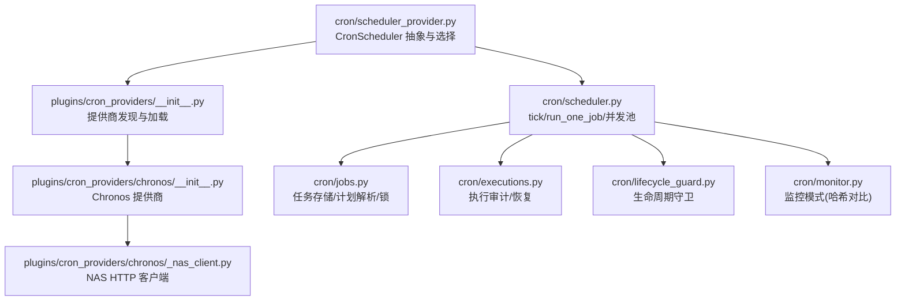
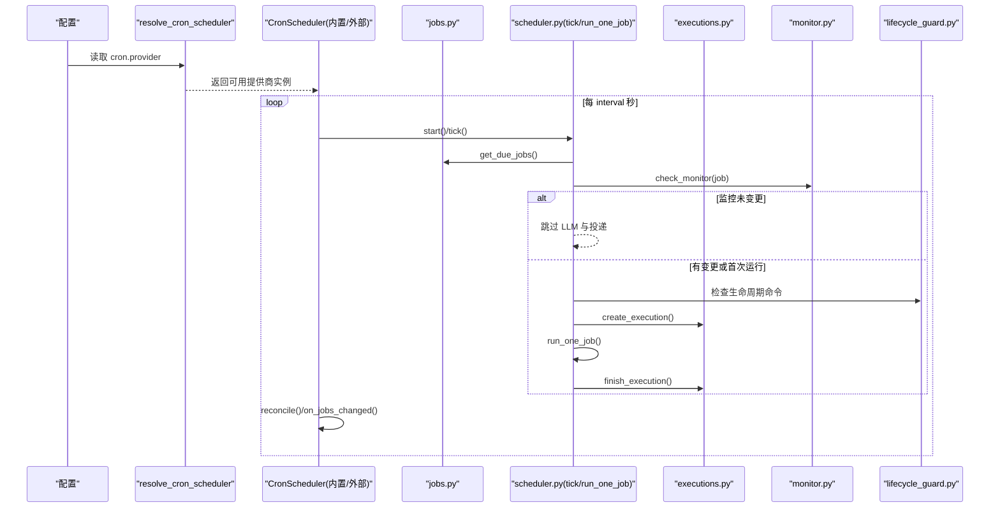
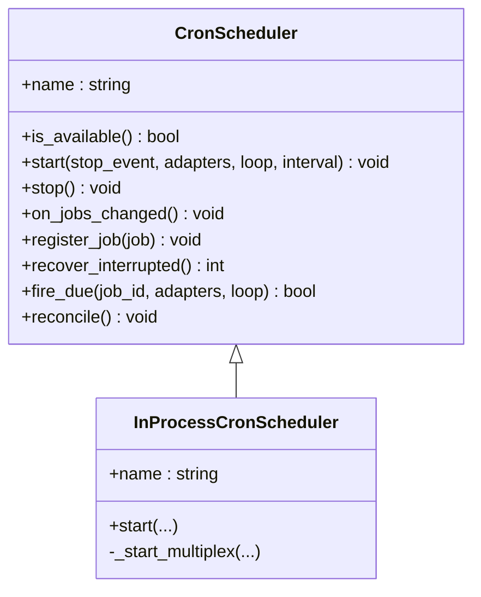
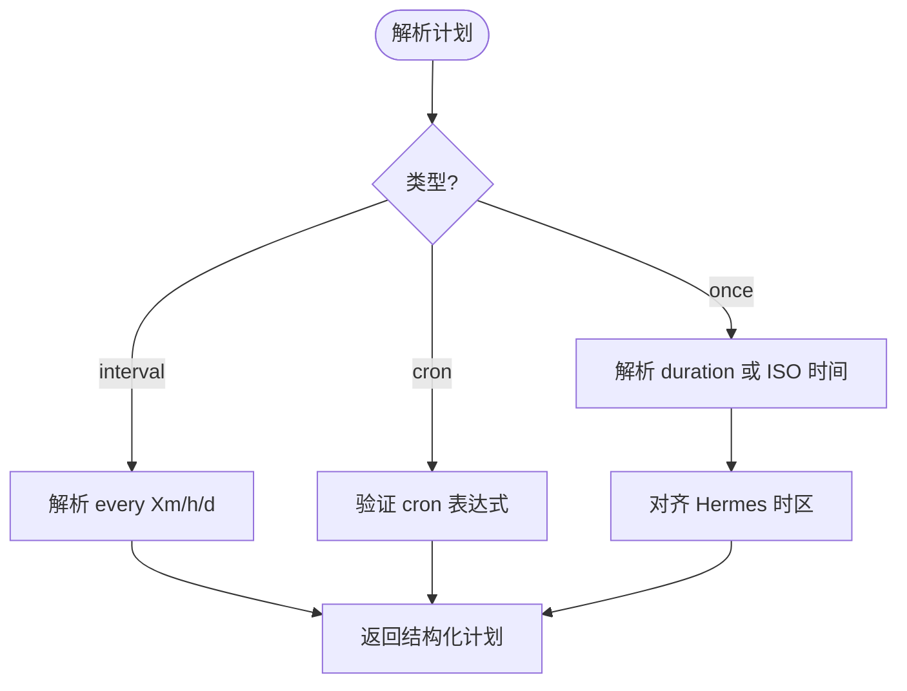
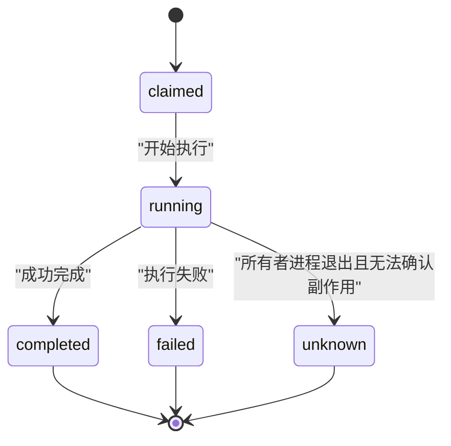
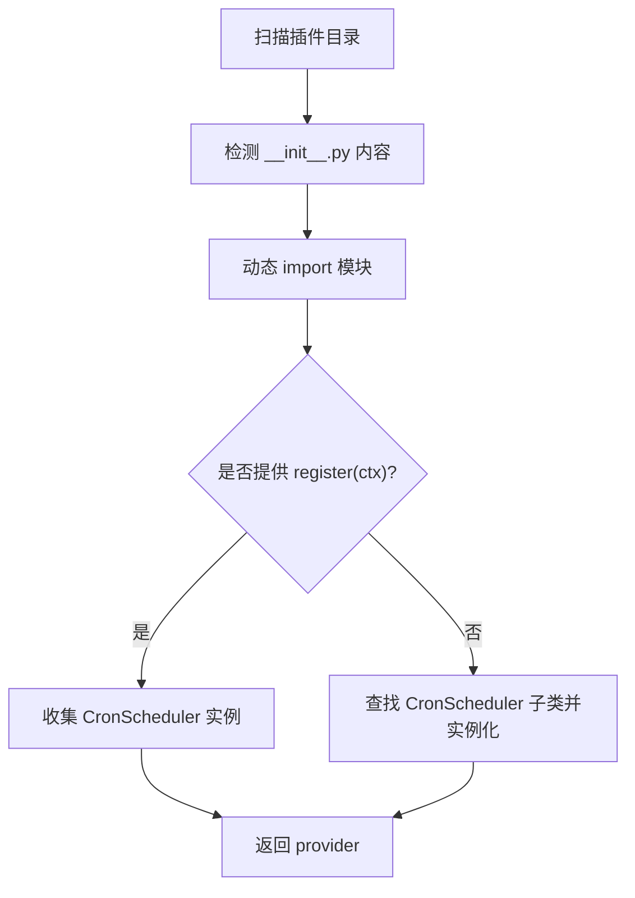
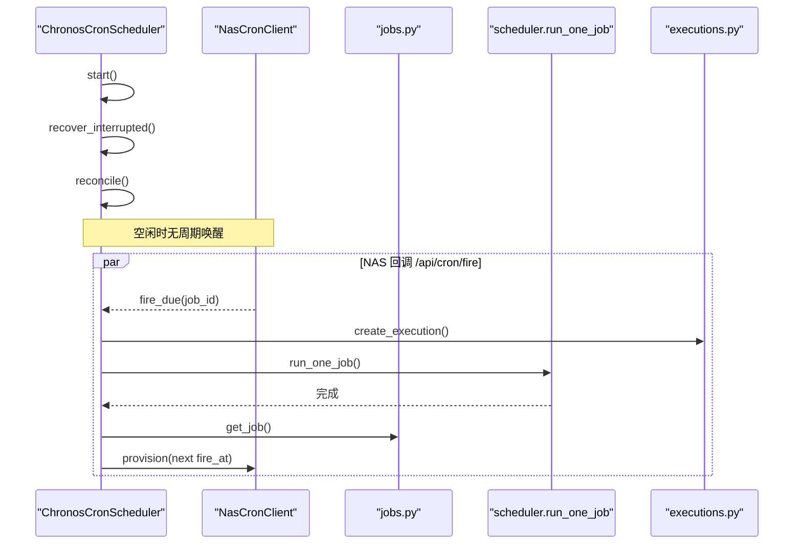
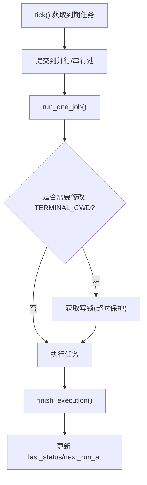
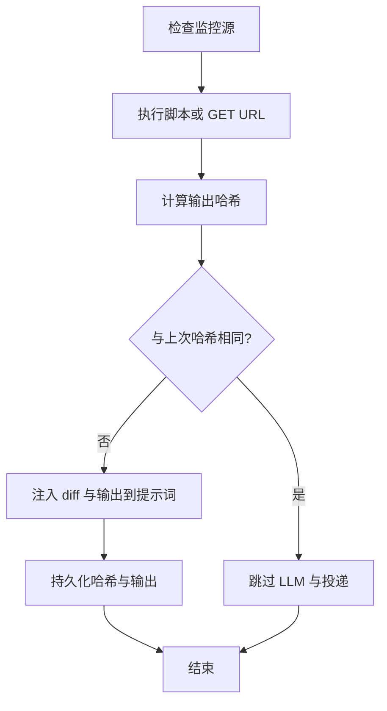
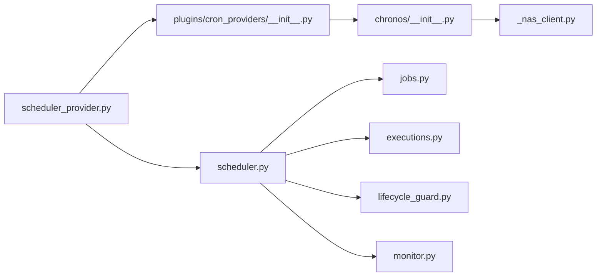

# 定时任务提供商

<cite>
**本文引用的文件**
- [cron/scheduler_provider.py](file://cron/scheduler_provider.py)
- [cron/scheduler.py](file://cron/scheduler.py)
- [cron/jobs.py](file://cron/jobs.py)
- [cron/executions.py](file://cron/executions.py)
- [plugins/cron_providers/__init__.py](file://plugins/cron_providers/__init__.py)
- [plugins/cron_providers/chronos/__init__.py](file://plugins/cron_providers/chronos/__init__.py)
- [plugins/cron_providers/chronos/_nas_client.py](file://plugins/cron_providers/chronos/_nas_client.py)
- [cron/lifecycle_guard.py](file://cron/lifecycle_guard.py)
- [cron/monitor.py](file://cron/monitor.py)
</cite>

## 目录
1. [简介](#简介)
2. [项目结构](#项目结构)
3. [核心组件](#核心组件)
4. [架构总览](#架构总览)
5. [详细组件分析](#详细组件分析)
6. [依赖关系分析](#依赖关系分析)
7. [性能考量](#性能考量)
8. [故障排查指南](#故障排查指南)
9. [结论](#结论)
10. [附录](#附录)

## 简介
本文件面向“定时任务提供商”开发者，系统性说明如何为 Hermes 的调度系统开发可插拔的 Cron 提供商插件。文档覆盖接口规范、任务调度与执行、并发控制、失败重试、日志与监控、状态管理、任务定义与依赖解析、执行环境配置、性能优化与故障恢复等主题，并提供 Chronos 作为完整实现示例，帮助扩展系统的定时任务调度能力。

## 项目结构
Hermes 的定时任务子系统由“调度器抽象 + 内置实现 + 外部提供商 + 存储与执行审计 + 安全与监控”组成：
- 调度器抽象与选择：提供统一的 CronScheduler 接口，支持内置 InProcessCronScheduler 与外部提供商（如 Chronos）。
- 任务存储与解析：jobs.json 持久化任务定义、计划与输出；支持多种计划格式与时间解析。
- 执行审计：executions.db 记录每次尝试的生命周期与结果，支持中断恢复与去重。
- 安全与监控：生命周期守卫防止危险命令；监控模式基于源输出哈希抑制无变更触发。
- 插件发现：按名称加载用户或内置提供商，具备回退到内置实现的健壮性。

图表来源
- [cron/scheduler_provider.py:27-169](file://cron/scheduler_provider.py#L27-L169)
- [plugins/cron_providers/__init__.py:151-212](file://plugins/cron_providers/__init__.py#L151-L212)
- [plugins/cron_providers/chronos/__init__.py:47-245](file://plugins/cron_providers/chronos/__init__.py#L47-L245)
- [plugins/cron_providers/chronos/_nas_client.py:30-124](file://plugins/cron_providers/chronos/_nas_client.py#L30-L124)
- [cron/scheduler.py:330-650](file://cron/scheduler.py#L330-L650)
- [cron/jobs.py:119-185](file://cron/jobs.py#L119-L185)
- [cron/executions.py:135-196](file://cron/executions.py#L135-L196)
- [cron/lifecycle_guard.py:49-104](file://cron/lifecycle_guard.py#L49-L104)
- [cron/monitor.py:54-90](file://cron/monitor.py#L54-L90)

章节来源
- [cron/scheduler_provider.py:27-169](file://cron/scheduler_provider.py#L27-L169)
- [plugins/cron_providers/__init__.py:151-212](file://plugins/cron_providers/__init__.py#L151-L212)

## 核心组件
- CronScheduler 抽象：定义 name、is_available、start、stop、on_jobs_changed、register_job、recover_interrupted、fire_due、reconcile 等最小必要接口，保证新增钩子为非抽象方法以维持向后兼容。
- 内置 InProcessCronScheduler：60s 轮询 tick，支持多 profile 复用、心跳与健康标记、错误记录、可暂停分发。
- 任务存储 jobs.py：跨进程文件锁、per-profile 隔离、计划解析（一次性/间隔/cron/时间戳）、显示状态计算、输出目录安全校验。
- 执行审计 executions.py：SQLite 持久化执行尝试，支持 claimed→running→completed/failed/unknown 状态机，进程存活判定与中断恢复。
- 插件发现 plugins/cron_providers/__init__.py：扫描内置与用户插件目录，按名称加载 CronScheduler，支持 register(ctx) 或类实例两种注册方式。
- Chronos 提供商：scale-to-zero 的外部触发，start() 立即返回，通过 NAS 为一-shot 在 next_run_at 时回调 /api/cron/fire，fire_due 后重新武装下一次。
- 生命周期守卫 lifecycle_guard.py：阻止 cron 创建包含网关生命周期命令的任务，防 SIGTERM-respawn 循环。
- 监控模式 monitor.py：基于 monitor_script/monitor_url 的输出哈希对比，无变更抑制 LLM 调用与投递。

章节来源
- [cron/scheduler_provider.py:27-129](file://cron/scheduler_provider.py#L27-L129)
- [cron/scheduler.py:167-254](file://cron/scheduler.py#L167-L254)
- [cron/jobs.py:587-710](file://cron/jobs.py#L587-L710)
- [cron/executions.py:135-196](file://cron/executions.py#L135-L196)
- [plugins/cron_providers/__init__.py:190-333](file://plugins/cron_providers/__init__.py#L190-L333)
- [plugins/cron_providers/chronos/__init__.py:47-245](file://plugins/cron_providers/chronos/__init__.py#L47-L245)
- [cron/lifecycle_guard.py:49-104](file://cron/lifecycle_guard.py#L49-L104)
- [cron/monitor.py:54-90](file://cron/monitor.py#L54-L90)

## 架构总览
下图展示从提供商选择到任务执行与审计的整体流程，以及外部提供商与内置实现的协作关系。

图表来源
- [cron/scheduler_provider.py:132-169](file://cron/scheduler_provider.py#L132-L169)
- [cron/scheduler.py:330-650](file://cron/scheduler.py#L330-L650)
- [cron/jobs.py:587-710](file://cron/jobs.py#L587-L710)
- [cron/executions.py:135-196](file://cron/executions.py#L135-L196)
- [cron/monitor.py:147-194](file://cron/monitor.py#L147-L194)
- [cron/lifecycle_guard.py:665-715](file://cron/lifecycle_guard.py#L665-L715)

## 详细组件分析

### CronScheduler 抽象与内置实现
- 接口要点：
  - name：短标识符（如 builtin、chronos）
  - is_available：离线可用性检查（不发起网络请求）
  - start(stop_event, adapters, loop, interval)：启动触发逻辑；内置阻塞于 tick 循环，外部提供商可立即返回
  - stop：可选资源释放
  - on_jobs_changed/register_job/recover_interrupted/fire_due/reconcile：Phase-4 钩子，默认安全实现，便于外部提供商增量集成
- 内置 InProcessCronScheduler：
  - 支持单 profile 与多 profile 复用（multiplex_profiles），每个 profile 独立心跳与错误记录
  - 支持 can_dispatch 门控，配合 GatewayRunner 的 drain 阶段避免新分发
  - 捕获 BaseException 并记录 ticker_heartbeat/ticker_error，确保状态可见

图表来源
- [cron/scheduler_provider.py:27-129](file://cron/scheduler_provider.py#L27-L129)
- [cron/scheduler_provider.py:172-368](file://cron/scheduler_provider.py#L172-L368)

章节来源
- [cron/scheduler_provider.py:27-129](file://cron/scheduler_provider.py#L27-L129)
- [cron/scheduler_provider.py:172-368](file://cron/scheduler_provider.py#L172-L368)

### 任务存储与计划解析（jobs.py）
- 存储与隔离：
  - per-profile 路径隔离，使用 ContextVar 切换 store，避免进程全局污染
  - 跨进程文件锁（fcntl/msvcrt）+ 进程内 RLock，超时降级保护
- 计划解析：
  - 支持 once（duration/ISO timestamp）、interval（every X）、cron 表达式（需 croniter）
  - 时区处理：将 naive 时间转换为配置的 Hermes 时区，避免误判 due
- 安全与显示：
  - 输出目录安全校验，拒绝路径穿越
  - effective_job_state 基于 enabled 与 pause 标记推导显示状态

图表来源
- [cron/jobs.py:587-710](file://cron/jobs.py#L587-L710)
- [cron/jobs.py:119-185](file://cron/jobs.py#L119-L185)

章节来源
- [cron/jobs.py:587-710](file://cron/jobs.py#L587-L710)
- [cron/jobs.py:119-185](file://cron/jobs.py#L119-L185)

### 执行审计与中断恢复（executions.py）
- 状态机：claimed → running → completed/failed/unknown
- 进程存活判定：结合 pid 与 process_started_at，区分“仍在运行”和“所有者进程已退出”
- 恢复策略：重启后将未知所有者进程中的 claimed/running 标记为 unknown，不自动重试
- 审计导出：执行状态变更会投影到监控模块（agent.monitoring.cron_health）

图表来源
- [cron/executions.py:32-63](file://cron/executions.py#L32-L63)
- [cron/executions.py:135-196](file://cron/executions.py#L135-L196)
- [cron/executions.py:199-233](file://cron/executions.py#L199-L233)

章节来源
- [cron/executions.py:135-196](file://cron/executions.py#L135-L196)
- [cron/executions.py:199-233](file://cron/executions.py#L199-L233)

### 插件发现与加载（plugins/cron_providers/__init__.py）
- 扫描顺序：内置目录优先，其次用户目录；同名冲突内置优先
- 识别规则：__init__.py 中包含 register_cron_scheduler 或 CronScheduler 子类
- 加载机制：
  - 支持 register(ctx) 模式（推荐）或直接实例化 CronScheduler 子类
  - 为插件建立合成命名空间，避免 sys.modules 冲突
  - 动态导入子模块，支持相对导入

图表来源
- [plugins/cron_providers/__init__.py:79-127](file://plugins/cron_providers/__init__.py#L79-L127)
- [plugins/cron_providers/__init__.py:190-333](file://plugins/cron_providers/__init__.py#L190-L333)

章节来源
- [plugins/cron_providers/__init__.py:190-333](file://plugins/cron_providers/__init__.py#L190-L333)

### Chronos 提供商（scale-to-zero 外部触发）
- 设计约束：
  - start() 立即返回，不阻塞、不周期性唤醒，机器空闲时真正零资源
  - reconcile 仅在热进程中运行（start/on_jobs_changed/fire 时）
- 关键流程：
  - start：恢复中断执行，reconcile 同步 NAS 注册表
  - register_job：为新任务武装第一个 one-shot
  - fire_due：调用父类 fire_due（claim + run_one_job），成功后根据 next_run_at 重新武装下一次
  - reconcile：比较 desired（jobs.json）与 observed（NAS armed），补齐缺失/变更，取消孤儿
- NAS 客户端：
  - 使用 agent 的 Nous Portal 访问令牌认证
  - 端点：provision/cancel/list_armed，带 dedup_key 保证幂等

图表来源
- [plugins/cron_providers/chronos/__init__.py:47-245](file://plugins/cron_providers/chronos/__init__.py#L47-L245)
- [plugins/cron_providers/chronos/_nas_client.py:30-124](file://plugins/cron_providers/chronos/_nas_client.py#L30-L124)
- [cron/executions.py:135-196](file://cron/executions.py#L135-L196)
- [cron/scheduler.py:330-650](file://cron/scheduler.py#L330-L650)

章节来源
- [plugins/cron_providers/chronos/__init__.py:47-245](file://plugins/cron_providers/chronos/__init__.py#L47-L245)
- [plugins/cron_providers/chronos/_nas_client.py:30-124](file://plugins/cron_providers/chronos/_nas_client.py#L30-L124)

### 任务执行与并发控制（scheduler.py）
- 并行与串行池：
  - 并行池：用于常规任务并行执行，避免阻塞 tick 线程
  - 串行池：用于修改进程级环境（如 TERMINAL_CWD）的任务，保证顺序与隔离
- 读写锁 _ReadWriteLock：
  - 写者优先，避免 workdir-less 任务观察到错误的 workdir 覆盖
  - 超时保护：等待超过阈值则失败，避免长期阻塞
- 运行集与中断标记：
  - get_running_job_ids/try_register_running_job/release_running_job：跟踪当前运行任务
  - mark_running_jobs_interrupted：网关关闭时强制标记中断，防止伪造成功
- 工具集与环境：
  - 禁用敏感工具集（cronjob/messaging/clarify/memory），合并 MCP 服务器
  - 工作目录与脚本执行安全限制

图表来源
- [cron/scheduler.py:330-650](file://cron/scheduler.py#L330-L650)
- [cron/scheduler.py:464-604](file://cron/scheduler.py#L464-L604)

章节来源
- [cron/scheduler.py:330-650](file://cron/scheduler.py#L330-L650)
- [cron/scheduler.py:464-604](file://cron/scheduler.py#L464-L604)

### 监控模式（monitor.py）
- 原理：对 monitor_script/monitor_url 的输出进行精确字节哈希对比，无变更则抑制 LLM 调用与投递
- 状态持久化：last_output_hash 与 last_changed_at 写入 jobs.json；上次输出保存在 output/<job_id>/monitor_last_output.txt
- 上下文注入：变更时注入统一 diff 与新输出片段，限制大小以避免提示词过大

图表来源
- [cron/monitor.py:54-90](file://cron/monitor.py#L54-L90)
- [cron/monitor.py:147-194](file://cron/monitor.py#L147-L194)
- [cron/monitor.py:197-213](file://cron/monitor.py#L197-L213)

章节来源
- [cron/monitor.py:147-194](file://cron/monitor.py#L147-L194)
- [cron/monitor.py:197-213](file://cron/monitor.py#L197-L213)

### 生命周期守卫（lifecycle_guard.py）
- 目标：阻止 cron 任务包含直接操作网关生命周期的命令（restart/stop/pkill/launchctl submit 等），防止 SIGTERM-respawn 循环
- 机制：
  - 正则匹配命令形状，屏蔽数据参数中的误报（grep/journalctl/sqlite3 等）
  - 递归扫描引用脚本，限制深度与大小，二进制文件跳过
  - Python 脚本走不同路径（非 shell 执行），但仍检测危险字面量

章节来源
- [cron/lifecycle_guard.py:49-104](file://cron/lifecycle_guard.py#L49-L104)
- [cron/lifecycle_guard.py:567-715](file://cron/lifecycle_guard.py#L567-L715)

## 依赖关系分析
- 低耦合：CronScheduler 抽象与具体实现解耦，通过 resolve_cron_scheduler 选择；插件发现与加载独立于核心调度逻辑
- 高内聚：jobs.py 集中存储与计划解析；executions.py 专注执行审计；scheduler.py 协调执行与并发
- 外部依赖：
  - NAS 客户端仅暴露 provision/cancel/list_armed，隐藏内部调度器细节
  - 监控与审计通过事件发射器向外暴露状态，不影响核心流程

图表来源
- [cron/scheduler_provider.py:132-169](file://cron/scheduler_provider.py#L132-L169)
- [plugins/cron_providers/__init__.py:190-333](file://plugins/cron_providers/__init__.py#L190-L333)
- [plugins/cron_providers/chronos/__init__.py:47-245](file://plugins/cron_providers/chronos/__init__.py#L47-L245)
- [plugins/cron_providers/chronos/_nas_client.py:30-124](file://plugins/cron_providers/chronos/_nas_client.py#L30-L124)
- [cron/scheduler.py:330-650](file://cron/scheduler.py#L330-L650)
- [cron/jobs.py:119-185](file://cron/jobs.py#L119-L185)
- [cron/executions.py:135-196](file://cron/executions.py#L135-L196)
- [cron/lifecycle_guard.py:49-104](file://cron/lifecycle_guard.py#L49-L104)
- [cron/monitor.py:54-90](file://cron/monitor.py#L54-L90)

章节来源
- [cron/scheduler_provider.py:132-169](file://cron/scheduler_provider.py#L132-L169)
- [plugins/cron_providers/__init__.py:190-333](file://plugins/cron_providers/__init__.py#L190-L333)

## 性能考量
- 并发模型：
  - 并行池提高吞吐，串行池保证环境变量一致性；两者均为持久化池，减少创建开销
  - 读写锁写者优先，避免读者饥饿，workdir 任务独占写锁
- 锁与超时：
  - jobs.json 跨进程锁设置 30s 超时，避免死锁导致 ticker 永久停滞
  - TERMINAL_CWD 锁等待上限基于 HERMES_CRON_TIMEOUT 加余量，防止长时间阻塞
- 外部调用：
  - Chronos 的 NAS 客户端使用 15s 超时，避免长尾影响调度循环
- 监控与审计：
  - 监控模式抑制无变更触发，降低 LLM 调用成本
  - 执行审计批量清理历史，限制最大条目数

[本节为通用指导，无需特定文件来源]

## 故障排查指南
- 常见问题定位：
  - ticker 健康：检查 ticker_heartbeat 与 ticker_last_success，确认 tick 是否成功
  - 执行失败：查看 executions.db 中 error 字段与 delivery_outcome，定位失败阶段
  - 并发问题：通过 get_running_job_ids 观察运行集，排查重复执行或卡住任务
  - 外部提供商：检查 is_available 配置项（portal_url/callback_url/token），确认 NAS 连通性
- 恢复策略：
  - 中断恢复：recover_interrupted_executions 将未知所有者进程的执行标记为 unknown
  - 插件回退：当外部提供商不可用时，自动回退到内置 ticker，保证调度不中断
- 日志与监控：
  - 使用 emit_execution_state 将执行状态投影到监控系统
  - 监控模式输出差异与变更时间，辅助判断触发原因

章节来源
- [cron/jobs.py:86-99](file://cron/jobs.py#L86-L99)
- [cron/executions.py:199-233](file://cron/executions.py#L199-L233)
- [cron/scheduler.py:349-461](file://cron/scheduler.py#L349-L461)
- [plugins/cron_providers/chronos/__init__.py:64-88](file://plugins/cron_providers/chronos/__init__.py#L64-L88)

## 结论
Hermes 的定时任务系统通过清晰的抽象与模块化设计，实现了内置与外部提供商的统一接入。内置实现提供稳定可靠的本地调度，Chronos 提供 scale-to-zero 的外部触发能力。结合任务存储、执行审计、安全守卫与监控模式，系统在可靠性、安全性与可观测性方面具备完善保障。开发者可基于 CronScheduler 接口快速扩展新的调度能力，并通过插件发现机制无缝集成。

[本节为总结性内容，无需特定文件来源]

## 附录
- 开发步骤建议：
  - 定义 CronScheduler 子类，实现 name/is_available/start/stop
  - 实现 on_jobs_changed/register_job/reconcile/fire_due 钩子
  - 使用插件发现机制注册提供商，或通过 register(ctx) 模式
  - 编写单元测试覆盖 is_available、fire_due、reconcile 等关键路径
- 配置项参考：
  - cron.provider：选择提供商（空=内置，chronos=外部）
  - cron.chronos.portal_url/callback_url：外部提供商所需配置
  - HERMES_CRON_TIMEOUT：任务不活跃超时，影响锁等待与恢复 TTL

[本节为补充信息，无需特定文件来源]