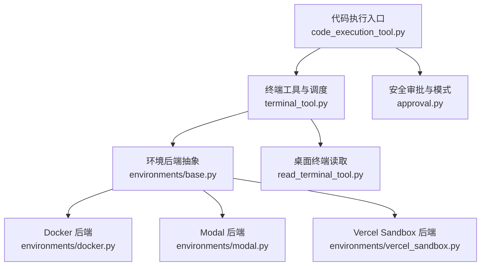
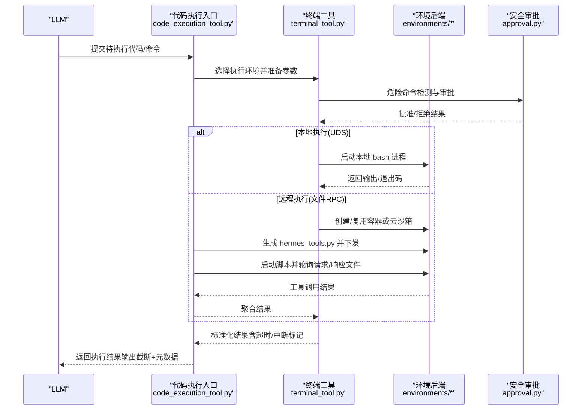
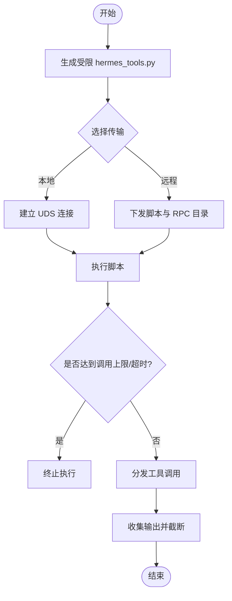
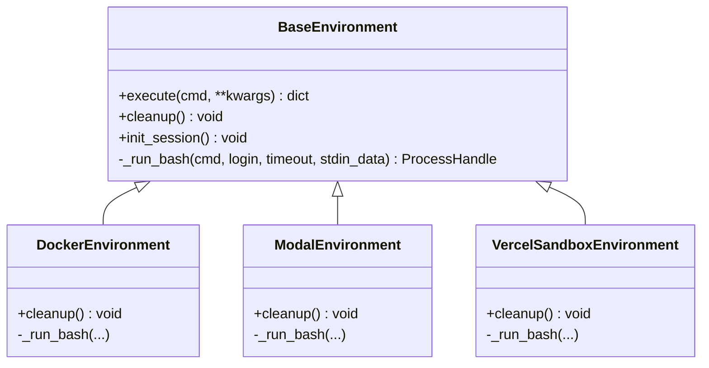
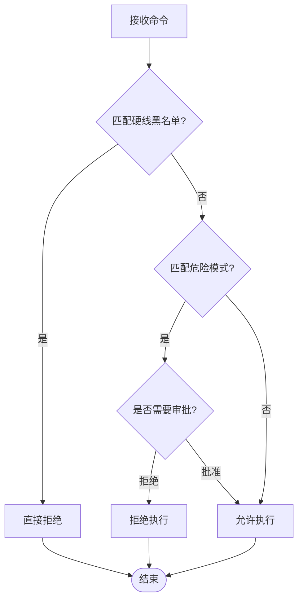
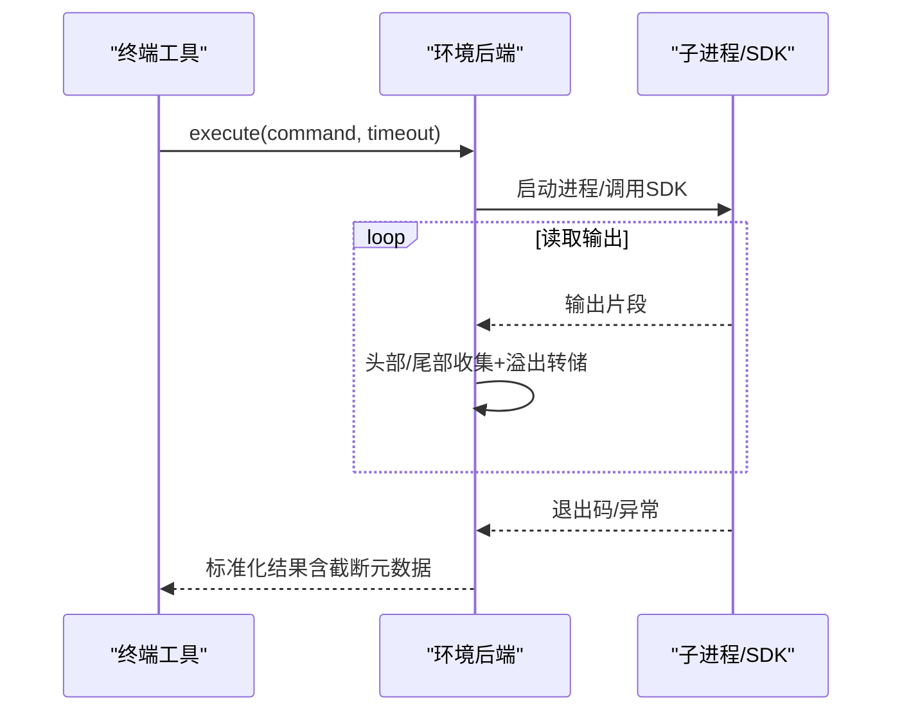
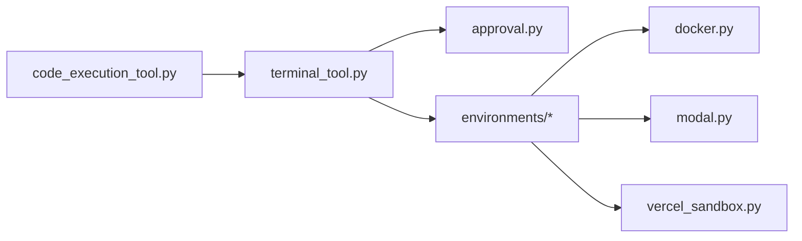

# 代码执行工具开发

<cite>
**本文引用的文件**
- [tools/code_execution_tool.py](file://tools/code_execution_tool.py)
- [tools/terminal_tool.py](file://tools/terminal_tool.py)
- [tools/approval.py](file://tools/approval.py)
- [tools/environments/base.py](file://tools/environments/base.py)
- [tools/environments/docker.py](file://tools/environments/docker.py)
- [tools/environments/modal.py](file://tools/environments/modal.py)
- [tools/environments/vercel_sandbox.py](file://tools/environments/vercel_sandbox.py)
- [tools/read_terminal_tool.py](file://tools/read_terminal_tool.py)
- [tests/tools/test_terminal_error_redaction.py](file://tests/tools/test_terminal_error_redaction.py)
</cite>

## 目录
1. [简介](#简介)
2. [项目结构](#项目结构)
3. [核心组件](#核心组件)
4. [架构总览](#架构总览)
5. [详细组件分析](#详细组件分析)
6. [依赖关系分析](#依赖关系分析)
7. [性能考量](#性能考量)
8. [故障排查指南](#故障排查指南)
9. [结论](#结论)
10. [附录](#附录)

## 简介
本指南面向需要构建“安全、可隔离、可观测”的代码执行工具的开发者。围绕代码沙箱、进程隔离与资源限制，系统讲解如何配置与管理多种执行环境（本地、Docker、Modal、Vercel Sandbox），并提供完整的实现思路与示例路径，涵盖：
- Python 代码执行、终端命令运行、脚本调试
- 异步执行、超时控制、输出捕获
- 环境变量管理、依赖安装、状态持久化
- 安全加固、权限控制、恶意代码检测策略

目标是提供一套完整的技术框架，帮助开发者在可控边界内安全地执行不可信代码。

## 项目结构
仓库将“代码执行”能力拆分为多个模块：
- 顶层执行入口与沙箱协议：code_execution_tool.py
- 终端与环境后端抽象：terminal_tool.py + environments/*
- 危险命令审批与安全策略：approval.py
- 桌面端终端读取：read_terminal_tool.py
- 错误脱敏测试用例：tests/tools/test_terminal_error_redaction.py

**图示来源**
- [tools/code_execution_tool.py:1-120](file://tools/code_execution_tool.py#L1-L120)
- [tools/terminal_tool.py:1-35](file://tools/terminal_tool.py#L1-L35)
- [tools/environments/base.py:553-620](file://tools/environments/base.py#L553-L620)
- [tools/environments/docker.py:1-6](file://tools/environments/docker.py#L1-L6)
- [tools/environments/modal.py:1-6](file://tools/environments/modal.py#L1-L6)
- [tools/environments/vercel_sandbox.py:1-7](file://tools/environments/vercel_sandbox.py#L1-L7)
- [tools/read_terminal_tool.py:1-12](file://tools/read_terminal_tool.py#L1-L12)

**章节来源**
- [tools/code_execution_tool.py:1-120](file://tools/code_execution_tool.py#L1-L120)
- [tools/terminal_tool.py:1-35](file://tools/terminal_tool.py#L1-L35)
- [tools/environments/base.py:553-620](file://tools/environments/base.py#L553-L620)

## 核心组件
- 代码执行沙箱（execute_code）
  - 生成受限的 hermes_tools.py 存根，仅暴露有限工具集合（如 web_search、read_file、write_file、search_files、patch、terminal）。
  - 支持两种传输：本地 Unix Domain Socket（UDS）或远程基于文件的 RPC（用于 Docker/Modal/Vercel 等远端环境）。
  - 严格的环境变量清洗，避免敏感信息泄露；对 HERMES_* 白名单进行收紧。
  - 工具调用计数限制、超时控制、输出截断与元数据上报。
- 终端工具（terminal_tool）
  - 统一封装多后端执行（local、docker、modal、vercel_sandbox、ssh、daytona、singularity）。
  - 危险命令检测与审批流（hardline 黑名单、dangerous 模式、用户 deny 规则）。
  - sudo 交互密码缓存与失败处理；工作目录校验；磁盘使用告警。
- 环境后端抽象（BaseEnvironment）
  - 统一的 execute() 流程：会话快照、CWD 跟踪、中断处理、超时强制、输出收集与溢出转储。
  - 子进程/SDK 适配（_ThreadedProcessHandle），保证统一接口。
- 安全审批（approval.py）
  - 硬线黑名单（不可绕过）、危险模式匹配、sudo -S 防暴力破解、敏感路径写入保护。
  - 上下文感知（会话键、turn/tool_call_id），钩子扩展点。

**章节来源**
- [tools/code_execution_tool.py:60-79](file://tools/code_execution_tool.py#L60-L79)
- [tools/code_execution_tool.py:137-300](file://tools/code_execution_tool.py#L137-L300)
- [tools/code_execution_tool.py:329-465](file://tools/code_execution_tool.py#L329-L465)
- [tools/code_execution_tool.py:646-776](file://tools/code_execution_tool.py#L646-L776)
- [tools/code_execution_tool.py:886-1200](file://tools/code_execution_tool.py#L886-L1200)
- [tools/terminal_tool.py:10-34](file://tools/terminal_tool.py#L10-L34)
- [tools/terminal_tool.py:118-197](file://tools/terminal_tool.py#L118-L197)
- [tools/terminal_tool.py:344-420](file://tools/terminal_tool.py#L344-L420)
- [tools/approval.py:350-483](file://tools/approval.py#L350-L483)
- [tools/approval.py:693-800](file://tools/approval.py#L693-L800)
- [tools/environments/base.py:553-620](file://tools/environments/base.py#L553-L620)
- [tools/environments/base.py:81-231](file://tools/environments/base.py#L81-L231)

## 架构总览
下图展示了从 LLM 调用到代码执行的端到端流程，包括本地与远程两种传输方式，以及安全审批与资源限制。

**图示来源**
- [tools/code_execution_tool.py:8-28](file://tools/code_execution_tool.py#L8-L28)
- [tools/code_execution_tool.py:507-639](file://tools/code_execution_tool.py#L507-L639)
- [tools/code_execution_tool.py:919-1059](file://tools/code_execution_tool.py#L919-L1059)
- [tools/terminal_tool.py:10-34](file://tools/terminal_tool.py#L10-L34)
- [tools/approval.py:350-483](file://tools/approval.py#L350-L483)

## 详细组件分析

### 代码执行沙箱（execute_code）
- 受限工具集与存根生成
  - 通过 SANDBOX_ALLOWED_TOOLS 限定可用工具，动态生成 hermes_tools.py 存根，屏蔽未授权能力。
  - 内置辅助函数（json_parse、shell_quote、retry）减少常见陷阱。
- 传输机制
  - 本地 UDS：父进程监听 Unix 域套接字，子进程通过 socket 发送工具调用请求，父进程分发并返回结果。
  - 远程文件 RPC：将脚本与 hermes_tools.py 下发至远端环境，通过请求/响应文件轮询通信，适合 Docker/Modal/Vercel。
- 安全与资源限制
  - 环境变量清洗：按前缀、白名单、Windows 必需变量过滤，防止密钥泄露。
  - 工具调用上限、超时控制、stdout/stderr 字节限制与头尾截取策略。
  - 禁止 terminal 的后台、pty、watch_patterns 等危险参数。
- 远程执行流程
  - 检查 Python 可用性、创建隔离目录、生成 token、启动 RPC 轮询线程、执行脚本、清理临时文件。

**图示来源**
- [tools/code_execution_tool.py:329-465](file://tools/code_execution_tool.py#L329-L465)
- [tools/code_execution_tool.py:507-639](file://tools/code_execution_tool.py#L507-L639)
- [tools/code_execution_tool.py:919-1059](file://tools/code_execution_tool.py#L919-L1059)
- [tools/code_execution_tool.py:1061-1200](file://tools/code_execution_tool.py#L1061-L1200)

**章节来源**
- [tools/code_execution_tool.py:60-79](file://tools/code_execution_tool.py#L60-L79)
- [tools/code_execution_tool.py:137-300](file://tools/code_execution_tool.py#L137-L300)
- [tools/code_execution_tool.py:329-465](file://tools/code_execution_tool.py#L329-L465)
- [tools/code_execution_tool.py:507-639](file://tools/code_execution_tool.py#L507-L639)
- [tools/code_execution_tool.py:646-776](file://tools/code_execution_tool.py#L646-L776)
- [tools/code_execution_tool.py:886-1200](file://tools/code_execution_tool.py#L886-L1200)

### 终端工具与环境后端
- 多后端统一接口
  - BaseEnvironment 定义 execute()、cleanup()、init_session() 等统一行为，所有后端继承实现。
  - 会话快照：捕获 shell 环境、函数、别名，原子写入快照文件，避免并发竞争。
  - 输出收集：头部+尾部保留策略，溢出时转储到 spill 文件，内存保持有界。
- 各后端特性
  - Docker：安全加固（cap-drop ALL、no-new-privileges、PID/CPU/内存/磁盘限制）、镜像与卷挂载、孤儿容器回收。
  - Modal：原生 SDK 调用，异步事件循环隔离，持久化快照存储于本地 JSON。
  - Vercel Sandbox：云端沙箱，最小超时与重试策略，遥测默认关闭，任务级快照持久化。
- 工作目录与权限
  - 工作目录字符白名单校验，拒绝包含控制字符或非法符号的路径。
  - sudo 交互密码缓存与失败失效；敏感路径写入需审批。

**图示来源**
- [tools/environments/base.py:553-620](file://tools/environments/base.py#L553-L620)
- [tools/environments/docker.py:1-6](file://tools/environments/docker.py#L1-L6)
- [tools/environments/modal.py:164-200](file://tools/environments/modal.py#L164-L200)
- [tools/environments/vercel_sandbox.py:1-7](file://tools/environments/vercel_sandbox.py#L1-L7)

**章节来源**
- [tools/environments/base.py:81-231](file://tools/environments/base.py#L81-L231)
- [tools/environments/base.py:553-620](file://tools/environments/base.py#L553-L620)
- [tools/environments/docker.py:148-200](file://tools/environments/docker.py#L148-L200)
- [tools/environments/modal.py:164-200](file://tools/environments/modal.py#L164-L200)
- [tools/environments/vercel_sandbox.py:47-76](file://tools/environments/vercel_sandbox.py#L47-L76)

### 安全审批与恶意代码检测
- 硬线黑名单（不可绕过）
  - 针对破坏性操作（如 rm -rf /、格式化磁盘、写块设备、fork bomb、kill -9 -1、关机/重启等）直接阻断。
- 危险模式匹配
  - 递归删除、chmod 777、chown root、SQL DROP/TRUNCATE、管道执行远程内容、base64/xxd/openssl 解码后执行等。
- sudo 防护
  - 禁止 sudo -S 明文输入密码（无 SUDO_PASSWORD 时），防止暴力破解。
- 敏感路径写入
  - 系统配置、SSH、项目 .env/config.yaml、shell rc 文件等写入需审批。
- 上下文与钩子
  - 支持 pre/post 审批钩子，便于审计与扩展。

**图示来源**
- [tools/approval.py:350-483](file://tools/approval.py#L350-L483)
- [tools/approval.py:693-800](file://tools/approval.py#L693-L800)

**章节来源**
- [tools/approval.py:350-483](file://tools/approval.py#L350-L483)
- [tools/approval.py:693-800](file://tools/approval.py#L693-L800)

### 异步执行、超时控制与输出捕获
- 异步执行
  - Modal/Vercel 等后端通过 _ThreadedProcessHandle 将阻塞式 SDK 调用包装为进程句柄，支持 kill/wait/poll。
  - 独立事件循环线程执行异步任务，避免阻塞主线程。
- 超时控制
  - 全局默认超时（如 300s），可按任务覆盖；前端超时（如 124/130 退出码）识别为超时/中断。
  - 每步 RPC 轮询带自适应退避，避免忙等。
- 输出捕获
  - 头部 40% + 尾部 60% 保留策略，超出阈值追加截断提示与元数据。
  - 溢出时自动转储到 spill 文件，便于事后恢复。

**图示来源**
- [tools/environments/base.py:81-231](file://tools/environments/base.py#L81-L231)
- [tools/environments/base.py:400-467](file://tools/environments/base.py#L400-L467)
- [tools/code_execution_tool.py:1061-1200](file://tools/code_execution_tool.py#L1061-L1200)

**章节来源**
- [tools/environments/base.py:81-231](file://tools/environments/base.py#L81-L231)
- [tools/environments/base.py:400-467](file://tools/environments/base.py#L400-L467)
- [tools/code_execution_tool.py:1061-1200](file://tools/code_execution_tool.py#L1061-L1200)

### 环境变量管理、依赖安装与状态持久化
- 环境变量管理
  - 执行前清洗环境变量，仅放行安全前缀、HERMES_* 白名单、Windows 必需变量。
  - 支持 passthrough 白名单（通过 env_passthrough 显式声明）。
- 依赖安装
  - 按需懒加载第三方库（如 modal、vercel SDK），首次使用时确保安装。
  - Docker 镜像可预装依赖；Modal 可对基础镜像添加 Python 支持。
- 状态持久化
  - Modal/Vercel 使用本地 JSON 存储任务级快照 ID，后续复用恢复。
  - Docker 可通过卷挂载实现持久化工作区。

**章节来源**
- [tools/code_execution_tool.py:137-300](file://tools/code_execution_tool.py#L137-L300)
- [tools/environments/modal.py:34-81](file://tools/environments/modal.py#L34-L81)
- [tools/environments/vercel_sandbox.py:163-200](file://tools/environments/vercel_sandbox.py#L163-L200)
- [tools/environments/docker.py:148-200](file://tools/environments/docker.py#L148-L200)

### 安全加固、权限控制与恶意代码检测策略
- 最小权限原则
  - 容器 cap-drop ALL、no-new-privileges；限制 PID/CPU/内存/磁盘。
  - 禁止危险 terminal 参数（background、pty、notify_on_complete、watch_patterns）。
- 命令审批
  - 硬线黑名单不可绕过；危险模式需审批；用户 deny 规则优先。
- 敏感信息保护
  - 环境变量清洗；错误输出脱敏（测试覆盖）；禁止 sudo -S 明文密码。
- 恶意代码检测
  - 管道执行远程内容、编码/解码后执行、fork bomb、批量杀进程等模式拦截。

**章节来源**
- [tools/environments/docker.py:1-6](file://tools/environments/docker.py#L1-L6)
- [tools/code_execution_tool.py:646-776](file://tools/code_execution_tool.py#L646-L776)
- [tools/approval.py:350-483](file://tools/approval.py#L350-L483)
- [tests/tools/test_terminal_error_redaction.py:1-154](file://tests/tools/test_terminal_error_redaction.py#L1-L154)

## 依赖关系分析
- 模块耦合
  - code_execution_tool.py 依赖 terminal_tool.py 获取执行环境；terminal_tool.py 依赖 approval.py 进行命令审批；两者共同依赖 environments/* 提供具体后端。
- 外部依赖
  - Docker CLI、Modal SDK、Vercel SDK 按需懒加载；可选平台适配器（gateway/platforms）不影响执行链路。
- 潜在循环依赖
  - 通过延迟导入（如 from model_tools import handle_function_call）避免初始化阶段循环。

**图示来源**
- [tools/code_execution_tool.py:507-639](file://tools/code_execution_tool.py#L507-L639)
- [tools/terminal_tool.py:10-34](file://tools/terminal_tool.py#L10-L34)
- [tools/environments/base.py:553-620](file://tools/environments/base.py#L553-L620)

**章节来源**
- [tools/code_execution_tool.py:507-639](file://tools/code_execution_tool.py#L507-L639)
- [tools/terminal_tool.py:10-34](file://tools/terminal_tool.py#L10-L34)
- [tools/environments/base.py:553-620](file://tools/environments/base.py#L553-L620)

## 性能考量
- 输出收集采用头部+尾部窗口，避免全量缓冲导致内存膨胀；溢出时转储到磁盘，兼顾性能与可恢复性。
- RPC 轮询采用指数退避，降低 CPU 占用；单次工具调用超时保护。
- 会话快照原子写入，避免并发竞争导致的脏读；非登录 shell 回退提升冷启动速度。
- 按需懒加载第三方 SDK，减少启动开销。

[本节为通用指导，不直接分析具体文件]

## 故障排查指南
- 常见问题
  - 远程环境缺少 Python：execute_code 会返回错误提示，需在目标环境安装 Python。
  - 工具调用超限：达到 max_tool_calls 后将拒绝后续调用，需调整配置或拆分任务。
  - 输出被截断：查看返回元数据中的 stdout_bytes_total/omitted，必要时缩小输出范围。
  - 权限不足：确认 Docker 权限、SSH 密钥、Modal/Vercel 认证配置。
- 错误脱敏
  - 终端工具的错误与回溯会自动脱敏，避免密钥泄露（见测试用例）。
- 调试建议
  - 启用调试日志（如 HERMES_DEBUG_INTERRUPT）观察中断/心跳；检查 RPC 轮询日志定位卡死。

**章节来源**
- [tests/tools/test_terminal_error_redaction.py:1-154](file://tests/tools/test_terminal_error_redaction.py#L1-L154)
- [tools/code_execution_tool.py:1061-1200](file://tools/code_execution_tool.py#L1061-L1200)
- [tools/environments/base.py:31-42](file://tools/environments/base.py#L31-L42)

## 结论
本框架通过“受限工具集 + 多后端隔离 + 强审批策略 + 资源限制 + 输出截断与转储”，提供了安全的代码执行环境。开发者可基于此快速构建可靠的执行工具，并在本地、容器与云端之间灵活切换，同时保障安全性与可观测性。

[本节为总结，不直接分析具体文件]

## 附录
- 典型用法参考路径
  - Python 代码执行：参见 [tools/code_execution_tool.py:1061-1200](file://tools/code_execution_tool.py#L1061-L1200)
  - 终端命令运行：参见 [tools/terminal_tool.py:10-34](file://tools/terminal_tool.py#L10-L34)
  - 脚本调试与输出捕获：参见 [tools/environments/base.py:81-231](file://tools/environments/base.py#L81-L231)
  - 环境变量管理：参见 [tools/code_execution_tool.py:137-300](file://tools/code_execution_tool.py#L137-L300)
  - 依赖安装与持久化：参见 [tools/environments/modal.py:34-81](file://tools/environments/modal.py#L34-L81)、[tools/environments/vercel_sandbox.py:163-200](file://tools/environments/vercel_sandbox.py#L163-L200)
  - 安全审批与恶意代码检测：参见 [tools/approval.py:350-483](file://tools/approval.py#L350-L483)、[tools/approval.py:693-800](file://tools/approval.py#L693-L800)