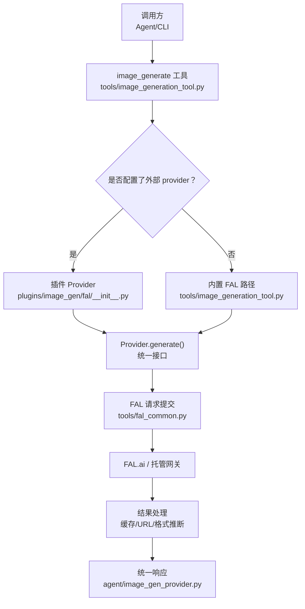
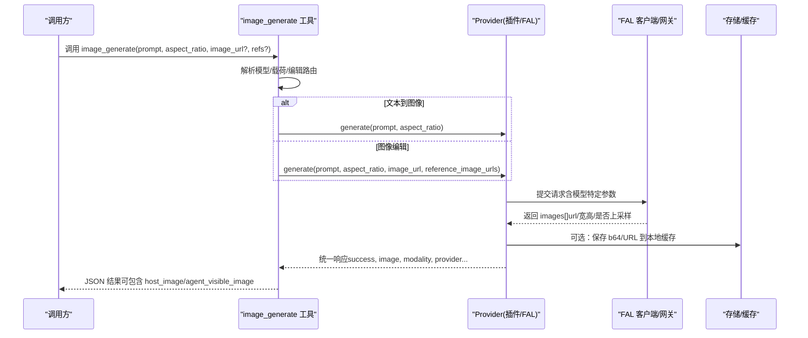
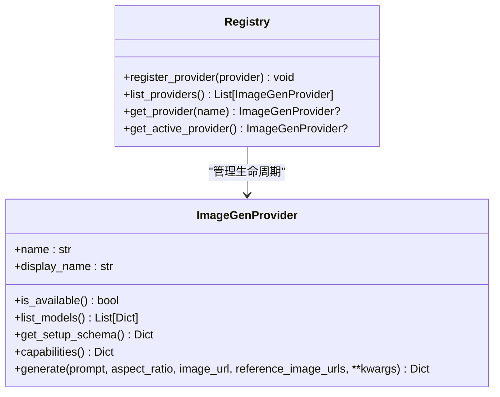
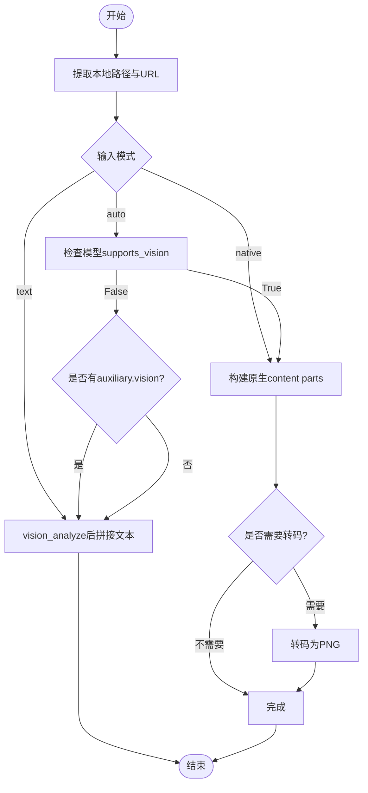
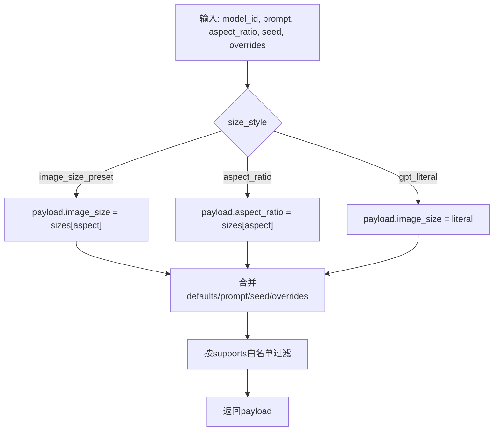
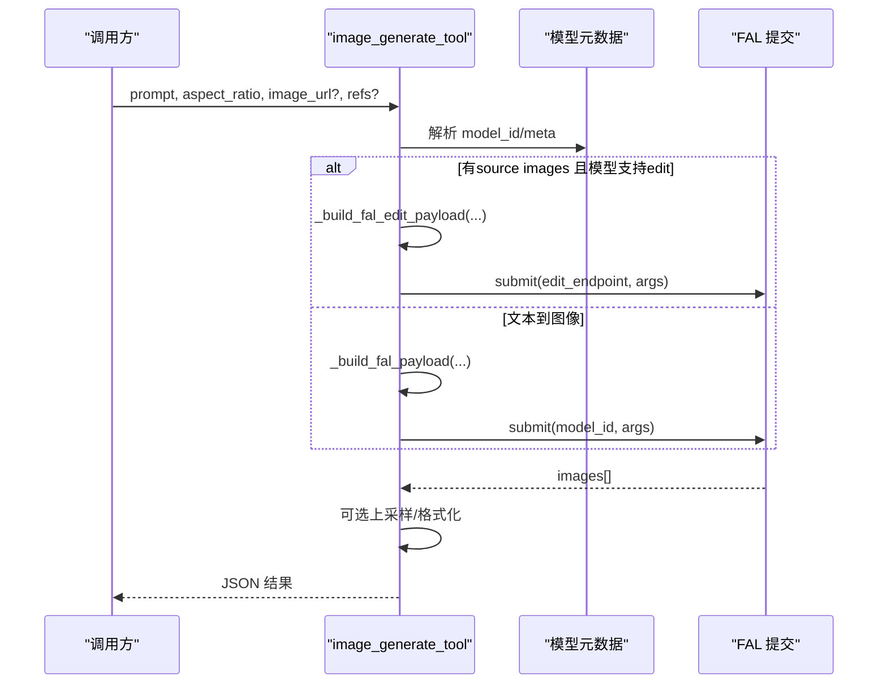
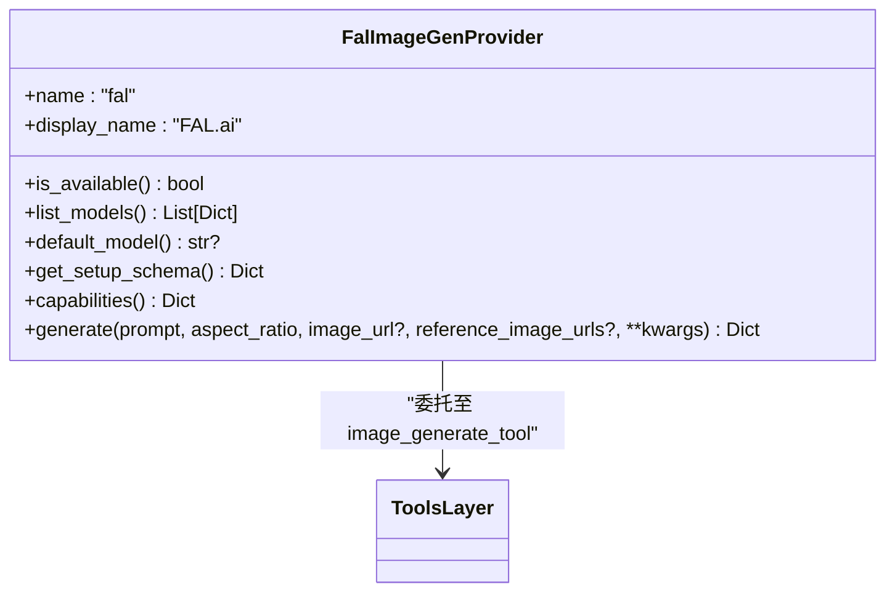
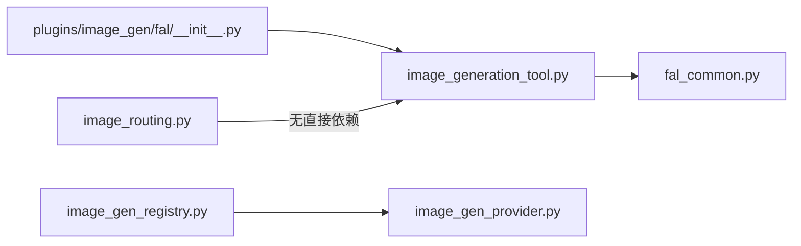

# 图像生成工具开发

<cite>
**本文引用的文件**
- [agent/image_gen_provider.py](file://agent/image_gen_provider.py)
- [agent/image_gen_registry.py](file://agent/image_gen_registry.py)
- [agent/image_routing.py](file://agent/image_routing.py)
- [tools/image_generation_tool.py](file://tools/image_generation_tool.py)
- [tools/fal_common.py](file://tools/fal_common.py)
- [plugins/image_gen/fal/__init__.py](file://plugins/image_gen/fal/__init__.py)
</cite>

## 目录
1. [简介](#简介)
2. [项目结构](#项目结构)
3. [核心组件](#核心组件)
4. [架构总览](#架构总览)
5. [详细组件分析](#详细组件分析)
6. [依赖关系分析](#依赖关系分析)
7. [性能与成本考量](#性能与成本考量)
8. [故障排查指南](#故障排查指南)
9. [结论](#结论)
10. [附录](#附录)

## 简介
本指南面向开发者，系统性说明如何在 Hermes Agent 中集成多种 AI 图像生成服务，构建统一的“文本到图像”和“图像编辑/变换”能力。文档覆盖：
- API 适配与统一抽象（Provider ABC、注册表、路由）
- 参数配置与模型选择（比例、尺寸、质量、步数等）
- 结果处理（本地缓存、URL 下载、格式推断、元数据）
- 提示词工程与风格控制（不同模型的参数族与最佳实践）
- 异步任务管理、进度跟踪与错误处理机制
- 图像格式转换、尺寸调整与元数据管理
- 成本控制、速率限制与缓存策略
- 完整代码示例路径（文本到图像、图像编辑、批量处理）

## 项目结构
围绕图像生成的关键模块分布如下：
- 抽象与注册
  - agent/image_gen_provider.py：定义 ImageGenProvider 抽象基类、统一响应构造、参考图归一化、图片缓存写入等
  - agent/image_gen_registry.py：提供 Provider 注册表与激活 Provider 解析逻辑
- 路由与输入处理
  - agent/image_routing.py：负责用户附带图像的自动提取、原生/文本两种输入模式决策、MIME 嗅探与转码
- 具体实现与工具
  - tools/image_generation_tool.py：FAL 多模型目录、载荷构建、编辑/生成路由、上采样、工具入口与动态 Schema
  - tools/fal_common.py：FAL SDK 懒加载、托管队列客户端封装、HTTP 状态提取
  - plugins/image_gen/fal/__init__.py：将 FAL 作为插件 Provider 接入注册表，并桥接到工具层

图表来源
- [tools/image_generation_tool.py:1072-1271](file://tools/image_generation_tool.py#L1072-L1271)
- [plugins/image_gen/fal/__init__.py:118-201](file://plugins/image_gen/fal/__init__.py#L118-L201)
- [tools/fal_common.py:80-163](file://tools/fal_common.py#L80-L163)
- [agent/image_gen_provider.py:341-393](file://agent/image_gen_provider.py#L341-L393)

章节来源
- [tools/image_generation_tool.py:1-200](file://tools/image_generation_tool.py#L1-L200)
- [agent/image_gen_provider.py:1-190](file://agent/image_gen_provider.py#L1-L190)
- [agent/image_gen_registry.py:1-146](file://agent/image_gen_registry.py#L1-L146)
- [agent/image_routing.py:1-150](file://agent/image_routing.py#L1-L150)

## 核心组件
- ImageGenProvider 抽象
  - 统一 generate(prompt, aspect_ratio, image_url, reference_image_urls, **kwargs) 接口
  - 支持 capabilities() 声明模态（text/image）、最大参考图数量
  - 提供 success_response/error_response 统一响应形状
- 注册表与激活 Provider
  - 通过 config.yaml 的 image_gen.provider 选择；未设置时回退单 Provider 或 legacy fal
  - 线程安全注册与查询
- 图像输入路由
  - 从自由文本中提取本地路径与 URL 图片引用
  - 决定 native 或 text 模式（基于模型能力与配置）
  - MIME 嗅探与必要转码（PNG/JPEG/GIF/WEBP 通用集）
- FAL 工具层
  - 多模型目录（FLUX、GPT Image、Nano Banana、Ideogram、Recraft、Qwen、Seedream、MAI 等）
  - 载荷构建：按 size_style 映射为 image_size/aspect_ratio/gpt_literal
  - 编辑路由：当存在 source images 且模型声明 edit_endpoint 时走编辑端点
  - 可选上采样（Clarity Upscaler），失败回退原图
  - 工具 Schema 动态描述（根据 active model 的能力）

章节来源
- [agent/image_gen_provider.py:64-188](file://agent/image_gen_provider.py#L64-L188)
- [agent/image_gen_registry.py:36-139](file://agent/image_gen_registry.py#L36-L139)
- [agent/image_routing.py:82-148](file://agent/image_routing.py#L82-L148)
- [tools/image_generation_tool.py:97-654](file://tools/image_generation_tool.py#L97-L654)
- [tools/image_generation_tool.py:800-902](file://tools/image_generation_tool.py#L800-L902)
- [tools/image_generation_tool.py:1072-1271](file://tools/image_generation_tool.py#L1072-L1271)

## 架构总览
下图展示一次图像生成的端到端流程，包括文本到图像与图像编辑两种路径，以及结果缓存与统一响应。

图表来源
- [tools/image_generation_tool.py:1072-1271](file://tools/image_generation_tool.py#L1072-L1271)
- [plugins/image_gen/fal/__init__.py:118-201](file://plugins/image_gen/fal/__init__.py#L118-L201)
- [tools/fal_common.py:80-163](file://tools/fal_common.py#L80-L163)
- [agent/image_gen_provider.py:239-338](file://agent/image_gen_provider.py#L239-L338)

## 详细组件分析

### 抽象与注册：ImageGenProvider 与注册表
- 抽象基类
  - name/display_name/is_available/list_models/get_setup_schema/capabilities/generate
  - 统一响应构造：success_response/error_response
  - 辅助：resolve_aspect_ratio、normalize_reference_images、save_b64_image/save_url_image
- 注册表
  - register_provider/list_providers/get_provider/get_active_provider
  - 激活策略：显式配置优先；否则单 Provider；否则 legacy fal；均受 is_available 过滤

图表来源
- [agent/image_gen_provider.py:64-188](file://agent/image_gen_provider.py#L64-L188)
- [agent/image_gen_registry.py:36-139](file://agent/image_gen_registry.py#L36-L139)

章节来源
- [agent/image_gen_provider.py:55-188](file://agent/image_gen_provider.py#L55-L188)
- [agent/image_gen_registry.py:32-139](file://agent/image_gen_registry.py#L32-L139)

### 图像输入路由：native vs text
- 自动提取本地路径与 URL 引用（跳过代码块内引用）
- 决定输入模式：
  - auto：若主模型 supports_vision=True，则 native；否则若有显式 auxiliary.vision 配置，则 text
  - native/native：直接以 OpenAI-style content parts 附加图片（data URL 或远程 URL）
  - text：先 vision_analyze 再拼接文本摘要
- MIME 嗅探与转码：对非通用格式（AVIF/HEIC/BMP/TIFF/ICO/SVG）尝试转 PNG，确保跨提供商兼容

图表来源
- [agent/image_routing.py:82-148](file://agent/image_routing.py#L82-L148)
- [agent/image_routing.py:461-506](file://agent/image_routing.py#L461-L506)
- [agent/image_routing.py:524-640](file://agent/image_routing.py#L524-L640)
- [agent/image_routing.py:669-725](file://agent/image_routing.py#L669-L725)

章节来源
- [agent/image_routing.py:82-148](file://agent/image_routing.py#L82-L148)
- [agent/image_routing.py:461-506](file://agent/image_routing.py#L461-L506)
- [agent/image_routing.py:524-640](file://agent/image_routing.py#L524-L640)
- [agent/image_routing.py:669-725](file://agent/image_routing.py#L669-L725)

### FAL 多模型与载荷构建
- 模型目录：涵盖 FLUX 2 Klein/Pro、Z-Image Turbo、Nano Banana Pro/2、GPT Image 1.5/2、Ideogram V3/V4、Recraft V4/V4.1、Qwen Image、Krea 2、Seedream 5.0 Pro/Lite、MAI Image 2.5 Pro 等
- 尺寸策略：
  - image_size_preset：如 landscape_16_9/square_hd/portrait_16_9
  - aspect_ratio：如 16:9/1:1/9:16
  - gpt_literal：如 1024x1024
- 载荷构建：
  - _build_fal_payload：合并 defaults、prompt、size、seed、overrides，并按 supports 白名单过滤
  - _build_fal_edit_payload：编辑端点额外要求 image_urls，尺寸键仅在 edit_supports 允许时发送
- 上采样：对文本到图像可选启用 Clarity Upscaler，失败回退原图

图表来源
- [tools/image_generation_tool.py:800-845](file://tools/image_generation_tool.py#L800-L845)
- [tools/image_generation_tool.py:848-902](file://tools/image_generation_tool.py#L848-L902)

章节来源
- [tools/image_generation_tool.py:97-654](file://tools/image_generation_tool.py#L97-L654)
- [tools/image_generation_tool.py:800-902](file://tools/image_generation_tool.py#L800-L902)

### 工具入口与路由：文本到图像 vs 图像编辑
- image_generate_tool：
  - 校验 prompt、后端可用性
  - 收集 source images（image_url + reference_image_urls）
  - 若存在 edit_endpoint 且有 source images，走编辑路径；否则文本到图像
  - 构建载荷并提交请求，处理结果（可选上采样）
  - 返回统一 JSON（success、image、modality、error、error_type）
- 动态 Schema：根据 active model 的能力（是否支持 image-to-image）动态描述参数

图表来源
- [tools/image_generation_tool.py:1072-1271](file://tools/image_generation_tool.py#L1072-L1271)
- [tools/image_generation_tool.py:800-902](file://tools/image_generation_tool.py#L800-L902)

章节来源
- [tools/image_generation_tool.py:1072-1271](file://tools/image_generation_tool.py#L1072-L1271)

### 插件 Provider 桥接：FAL 插件
- FalImageGenProvider：
  - 暴露 name/display_name/is_available/list_models/default_model/get_setup_schema/capabilities/generate
  - generate 内部委托给 tools.image_generation_tool.image_generate_tool，并将结果标准化为 Provider ABC 契约
  - capabilities 根据当前模型是否声明 edit_endpoint 动态返回 ["text", "image"] 或仅 ["text"]

图表来源
- [plugins/image_gen/fal/__init__.py:40-201](file://plugins/image_gen/fal/__init__.py#L40-L201)
- [tools/image_generation_tool.py:1072-1271](file://tools/image_generation_tool.py#L1072-L1271)

章节来源
- [plugins/image_gen/fal/__init__.py:40-201](file://plugins/image_gen/fal/__init__.py#L40-L201)

### 结果处理：缓存、格式与元数据
- 本地缓存
  - save_b64_image：解码 base64 写入 $HERMES_HOME/cache/images/，命名带时间戳与短 UUID
  - save_url_image：流式下载 URL 图片，限制大小，推断扩展名（Content-Type 或 URL 后缀），失败清理临时文件
- 格式推断与转码
  - 读取本地图片字节，嗅探 MIME；若非通用集则尝试 Pillow 转 PNG
  - 构建 data URL 供原生模式使用
- 元数据
  - 成功响应包含 model、provider、prompt、aspect_ratio、modality
  - 在容器/SSH 环境下可能注入 host_image 与 agent_visible_image 以便后续工具访问

章节来源
- [agent/image_gen_provider.py:230-338](file://agent/image_gen_provider.py#L230-L338)
- [agent/image_routing.py:524-640](file://agent/image_routing.py#L524-L640)
- [agent/image_routing.py:669-725](file://agent/image_routing.py#L669-L725)
- [tools/image_generation_tool.py:1040-1069](file://tools/image_generation_tool.py#L1040-L1069)

## 依赖关系分析
- 模块耦合
  - tools/image_generation_tool.py 依赖 tools/fal_common.py（FAL SDK 与托管网关）
  - plugins/image_gen/fal/__init__.py 通过延迟导入桥接到 tools.image_generation_tool
  - agent/image_gen_registry.py 依赖 agent/image_gen_provider.py 的抽象
  - agent/image_routing.py 独立于生成后端，专注输入侧路由与格式兼容
- 外部依赖
  - fal_client（可选，懒加载）
  - requests（下载 URL 图片）
  - Pillow（可选，用于转码）
- 潜在循环依赖
  - 通过延迟 import 避免冷启动开销与循环导入风险

图表来源
- [tools/image_generation_tool.py:1-75](file://tools/image_generation_tool.py#L1-L75)
- [tools/fal_common.py:1-53](file://tools/fal_common.py#L1-L53)
- [plugins/image_gen/fal/__init__.py:1-37](file://plugins/image_gen/fal/__init__.py#L1-L37)
- [agent/image_gen_registry.py:1-33](file://agent/image_gen_registry.py#L1-L33)
- [agent/image_gen_provider.py:1-52](file://agent/image_gen_provider.py#L1-L52)

章节来源
- [tools/image_generation_tool.py:1-75](file://tools/image_generation_tool.py#L1-L75)
- [tools/fal_common.py:1-53](file://tools/fal_common.py#L1-L53)
- [plugins/image_gen/fal/__init__.py:1-37](file://plugins/image_gen/fal/__init__.py#L1-L37)
- [agent/image_gen_registry.py:1-33](file://agent/image_gen_registry.py#L1-L33)
- [agent/image_gen_provider.py:1-52](file://agent/image_gen_provider.py#L1-L52)

## 性能与成本考量
- 性能优化
  - 懒加载 fal_client，减少 CLI 冷启动耗时
  - 托管网关复用 httpx.Client，避免每次创建连接
  - 流式下载大图片，限制最大字节数，防止内存膨胀
  - 按需转码，仅对非通用格式进行 Pillow 转 PNG
- 成本控制
  - 模型目录中包含价格信息（如 per-MP、per-image），便于 UI 展示与选择
  - 部分模型默认 quality/resolution 锁定（如 GPT Image 系列 medium 质量），保证计费可预测
  - 上采样仅在支持的模型开启，避免额外费用
- 速率限制与重试
  - 托管客户端封装了重试与超时头；异常中可提取 HTTP 状态码
  - 建议在上层增加指数退避与熔断（仓库未内置，可按需扩展）
- 缓存策略
  - 本地缓存 images 目录，文件名含时间戳与短 UUID，避免重复写入冲突
  - 对于远端 URL，建议在业务层增加短期缓存（如基于 URL 的哈希）以减少重复下载

章节来源
- [tools/image_generation_tool.py:44-56](file://tools/image_generation_tool.py#L44-L56)
- [tools/image_generation_tool.py:686-758](file://tools/image_generation_tool.py#L686-L758)
- [tools/image_generation_tool.py:908-951](file://tools/image_generation_tool.py#L908-L951)
- [tools/fal_common.py:80-163](file://tools/fal_common.py#L80-L163)
- [agent/image_gen_provider.py:239-338](file://agent/image_gen_provider.py#L239-L338)

## 故障排查指南
- 常见错误与定位
  - 无后端可用：检查 FAL_KEY 或 managed gateway 可达性；查看 _build_no_backend_setup_message 输出
  - 模型不支持编辑：当传入 image_url/reference_image_urls 但模型未声明 edit_endpoint 时，会抛出明确错误
  - 无效响应：API 未返回 images 字段或为空，抛出 ValueError
  - 上采样失败：记录警告并使用原图回退
- 调试与日志
  - DebugSession 记录调用参数、耗时、成功与否，便于问题复现
  - 各阶段均有 logger.info/warning/error，结合 error_type 快速分类
- 恢复建议
  - 切换模型或 provider（hermes tools → Image Generation）
  - 检查网络与 CDN 返回的 Content-Type，必要时手动指定扩展名
  - 对于托管网关 4xx，查看门户是否启用了该模型代理

章节来源
- [tools/image_generation_tool.py:1279-1317](file://tools/image_generation_tool.py#L1279-L1317)
- [tools/image_generation_tool.py:1200-1271](file://tools/image_generation_tool.py#L1200-L1271)
- [tools/image_generation_tool.py:908-951](file://tools/image_generation_tool.py#L908-L951)

## 结论
Hermes Agent 的图像生成子系统通过抽象 Provider、注册表与路由机制，实现了多后端、多模型的统一接入。工具层提供了完善的载荷构建、编辑路由、上采样与结果处理，配合插件体系可扩展更多后端。开发者可基于此框架快速集成新的图像生成服务，并通过配置与动态 Schema 控制行为，兼顾性能、成本与用户体验。

## 附录

### 代码示例路径
- 文本到图像
  - 入口函数：image_generate_tool(prompt, aspect_ratio, ...)
  - 参考：[tools/image_generation_tool.py:1072-1271](file://tools/image_generation_tool.py#L1072-L1271)
- 图像编辑
  - 编辑载荷构建：_build_fal_edit_payload
  - 参考：[tools/image_generation_tool.py:848-902](file://tools/image_generation_tool.py#L848-L902)
- 批量处理
  - 可在上层循环调用 image_generate_tool，结合缓存与并发控制（仓库未内置批量编排，可按需扩展）
- 插件 Provider
  - 注册与桥接：plugins/image_gen/fal/__init__.py
  - 参考：[plugins/image_gen/fal/__init__.py:40-201](file://plugins/image_gen/fal/__init__.py#L40-L201)

### 提示词工程与风格控制要点
- 不同模型的 size_style 与参数族不同：
  - FLUX/Recraft/Ideogram/Qwen/Seedream/MAI：image_size_preset
  - Nano Banana/Krea：aspect_ratio
  - GPT Image 1.5：gpt_literal
- 质量与速度权衡：
  - num_inference_steps、guidance_scale、quality、resolution 等参数影响速度与质量
  - 部分模型默认锁定 quality/resolution 以控制成本
- 风格控制：
  - 某些模型支持 style、colors、background_color、creativity、rendering_speed 等
  - 参考模型目录中的 defaults 与 supports 字段

章节来源
- [tools/image_generation_tool.py:97-654](file://tools/image_generation_tool.py#L97-L654)

### 异步任务管理、进度跟踪与错误处理
- 异步任务
  - 托管网关通过 fal_client.SyncClient 提交请求，返回 handle 对象，支持 get() 获取结果
  - 可在上层实现队列与回调，实现异步批处理
- 进度跟踪
  - 当前实现为同步等待（handler.get()），可在上层包装轮询或 webhook 机制
- 错误处理
  - 统一 error_response 形状，包含 error_type
  - 托管网关 4xx 转换为友好提示，引导用户切换模型或配置

章节来源
- [tools/fal_common.py:80-163](file://tools/fal_common.py#L80-L163)
- [tools/image_generation_tool.py:1200-1271](file://tools/image_generation_tool.py#L1200-L1271)