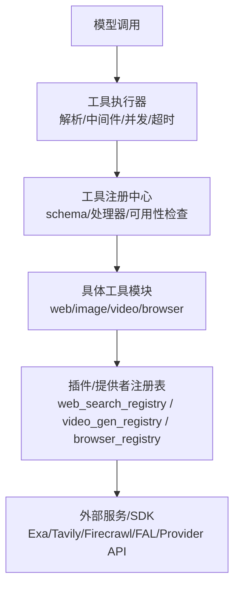
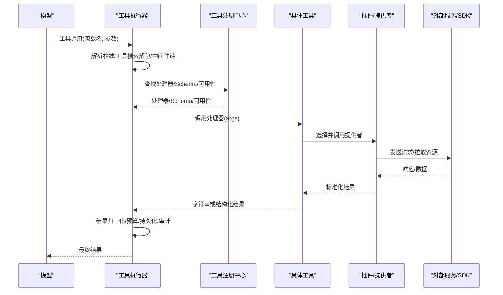
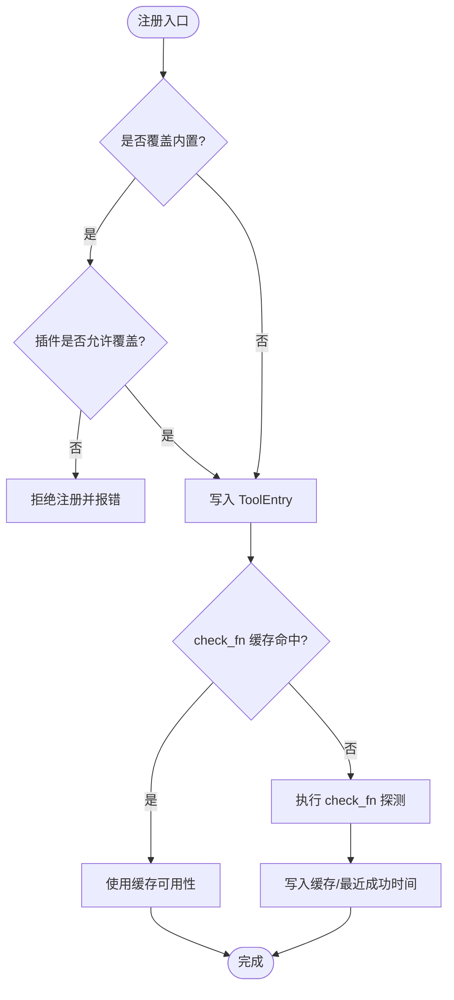
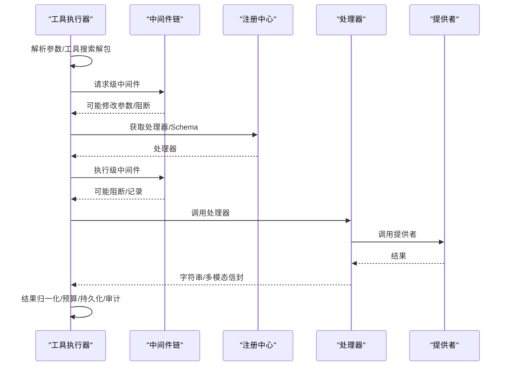
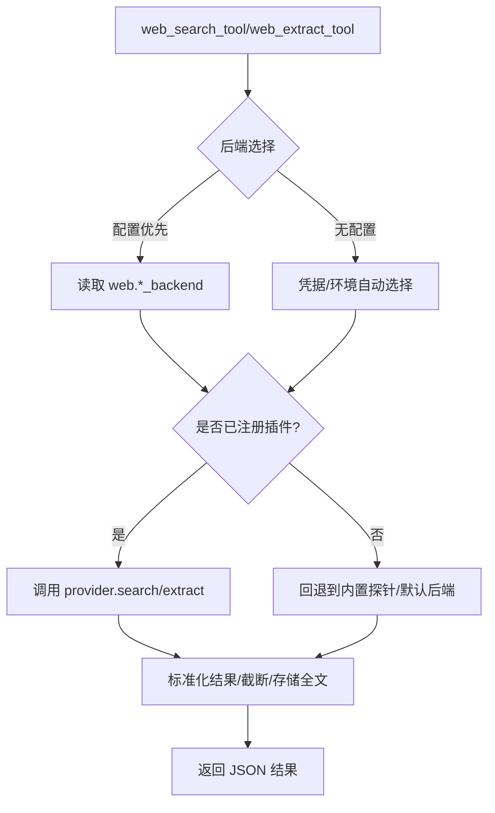
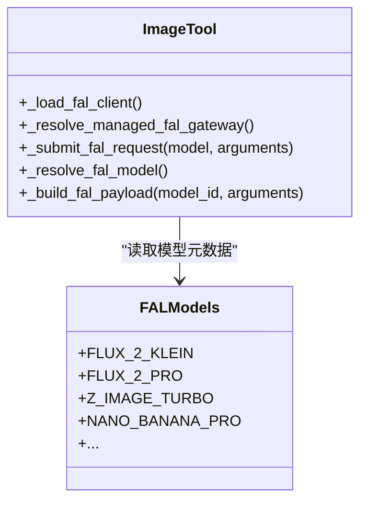
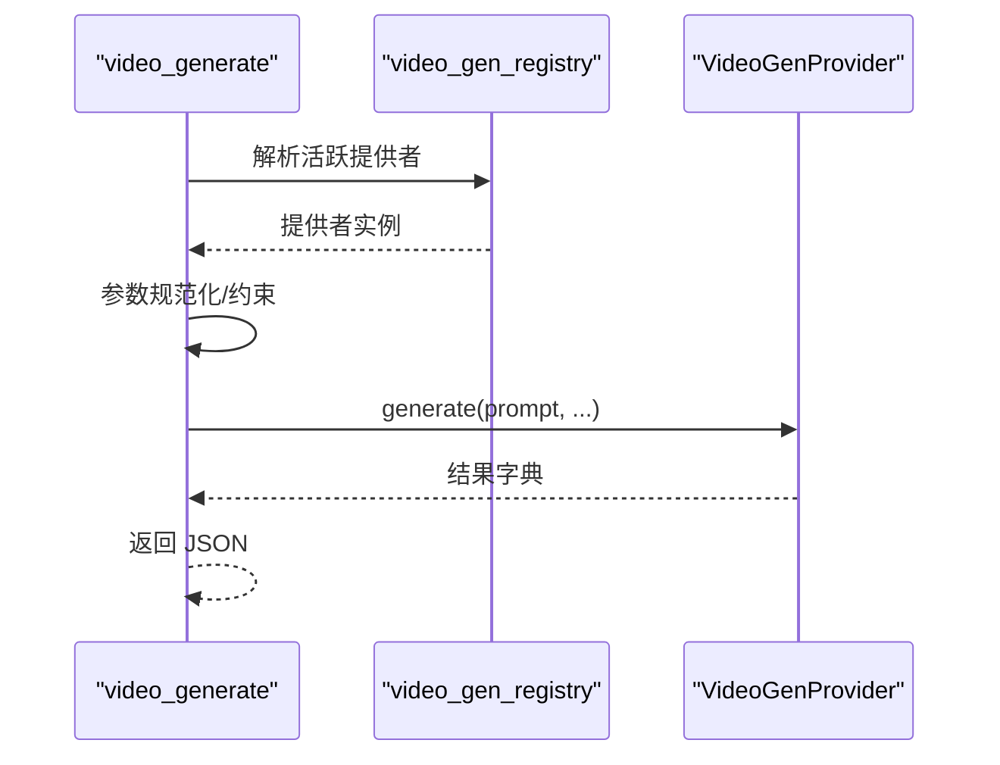
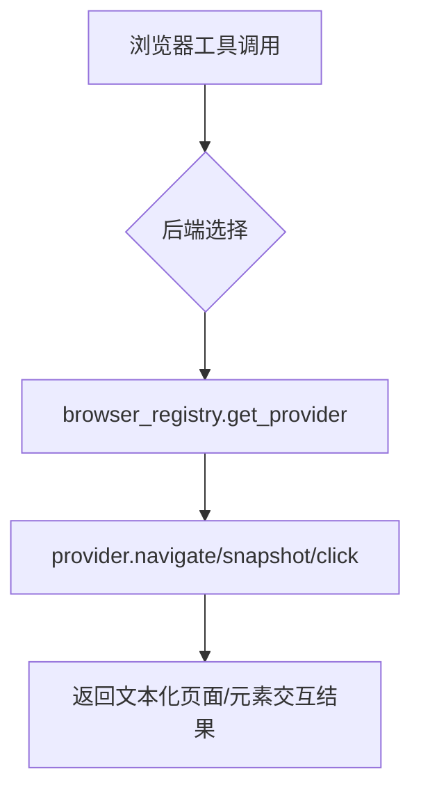
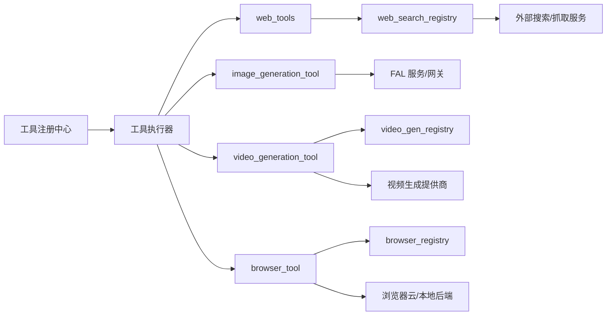

# 工具扩展开发

<cite>
**本文引用的文件**
- [tools/registry.py](file://tools/registry.py)
- [agent/tool_executor.py](file://agent/tool_executor.py)
- [tools/web_tools.py](file://tools/web_tools.py)
- [tools/image_generation_tool.py](file://tools/image_generation_tool.py)
- [tools/video_generation_tool.py](file://tools/video_generation_tool.py)
- [tools/browser_tool.py](file://tools/browser_tool.py)
</cite>

## 目录
1. [简介](#简介)
2. [项目结构](#项目结构)
3. [核心组件](#核心组件)
4. [架构总览](#架构总览)
5. [详细组件分析](#详细组件分析)
6. [依赖关系分析](#依赖关系分析)
7. [性能考量](#性能考量)
8. [故障排查指南](#故障排查指南)
9. [结论](#结论)
10. [附录](#附录)

## 简介
本指南面向希望为 Hermes Agent 扩展“工具能力”的开发者，系统阐述工具的接口规范、参数校验、执行环境、结果格式化机制，以及异步执行、错误处理、资源管理与安全沙箱等关键主题。文档同时提供网络搜索与抓取、浏览器自动化、图像生成、视频生成等完整实现示例，并覆盖工具注册、依赖管理、版本控制、测试策略、性能优化与调试技巧，帮助开发者快速构建高质量、可维护的工具扩展。

## 项目结构
Hermes 的工具体系围绕“集中式注册 + 统一调度 + 插件化后端”展开：
- 工具注册中心：集中声明工具元数据（名称、工具集、Schema、处理器、可用性检查、环境变量、是否异步、描述、表情、结果大小限制、动态 Schema 覆盖）。
- 工具执行器：负责解析调用、中间件链、并发调度、超时与中断、预算控制、结果持久化与审计。
- 具体工具模块：按功能域组织（如网络、图像、视频、浏览器），通过注册中心暴露给模型。
- 插件与提供者：将第三方或可选后端以插件形式接入（如 Web、图像、视频、浏览器），通过各自的注册表选择可用提供者。

图表来源
- [tools/registry.py:414-764](file://tools/registry.py#L414-L764)
- [agent/tool_executor.py:758-1200](file://agent/tool_executor.py#L758-L1200)
- [tools/web_tools.py:618-739](file://tools/web_tools.py#L618-L739)
- [tools/image_generation_tool.py:718-796](file://tools/image_generation_tool.py#L718-L796)
- [tools/video_generation_tool.py:226-410](file://tools/video_generation_tool.py#L226-L410)
- [tools/browser_tool.py:159-177](file://tools/browser_tool.py#L159-L177)

章节来源
- [tools/registry.py:108-159](file://tools/registry.py#L108-L159)
- [agent/tool_executor.py:758-1200](file://agent/tool_executor.py#L758-L1200)

## 核心组件
- 工具注册中心（ToolRegistry）
  - 职责：收集工具 Schema 与处理器；提供 get_definitions、dispatch、工具集查询、别名与覆盖策略；对 check_fn 进行 TTL 缓存与瞬态失败宽容。
  - 关键点：注册时支持 override 保护内置工具；支持动态 Schema 覆盖；结果归一化与错误体截断；线程安全的快照与生成号。
- 工具执行器（tool_executor）
  - 职责：解析参数、工具搜索解包、中间件链（请求/执行）、并发调度（线程池）、授权门控、开始顺序门控、超时与中断、预算控制、结果持久化、审计回调。
  - 关键点：并发上限、图片生成并行度限制、批任务放弃信号、人类审批等待排除在截止时间外。
- 工具结果与错误格式化工具
  - tool_error、tool_result：统一返回 JSON 字符串；错误消息长度受限；JSON 中的 error 字段会被裁剪。
- 插件与提供者
  - Web：web_search_registry 聚合多个搜索/抓取提供者（Exa、Tavily、Parallel、Firecrawl、SearXNG、Brave-free、DDGS、xai）。
  - 图像：FAL 模型目录与受管网关；按需选择直连或托管队列。
  - 视频：video_gen_registry 抽象 VideoGenProvider ABC，统一 schema 与动态描述。
  - 浏览器：browser_registry 聚合 Browserbase/Browser Use/Firecrawl/Camofox 等后端。

章节来源
- [tools/registry.py:201-231](file://tools/registry.py#L201-L231)
- [tools/registry.py:414-764](file://tools/registry.py#L414-L764)
- [tools/registry.py:800-835](file://tools/registry.py#L800-L835)
- [tools/registry.py:974-1002](file://tools/registry.py#L974-L1002)
- [agent/tool_executor.py:758-1200](file://agent/tool_executor.py#L758-L1200)
- [tools/web_tools.py:176-220](file://tools/web_tools.py#L176-L220)
- [tools/image_generation_tool.py:718-796](file://tools/image_generation_tool.py#L718-L796)
- [tools/video_generation_tool.py:226-410](file://tools/video_generation_tool.py#L226-L410)
- [tools/browser_tool.py:159-177](file://tools/browser_tool.py#L159-L177)

## 架构总览
下图展示从模型发起工具调用到最终结果返回的关键路径，包括中间件、注册中心、提供者与外部服务。

图表来源
- [agent/tool_executor.py:758-1200](file://agent/tool_executor.py#L758-L1200)
- [tools/registry.py:800-835](file://tools/registry.py#L800-L835)
- [tools/web_tools.py:618-739](file://tools/web_tools.py#L618-L739)
- [tools/image_generation_tool.py:718-796](file://tools/image_generation_tool.py#L718-L796)
- [tools/video_generation_tool.py:226-410](file://tools/video_generation_tool.py#L226-L410)

## 详细组件分析

### 工具注册中心（ToolRegistry）
- 注册流程
  - 每个工具模块在导入时调用 registry.register(...)，声明 name、toolset、schema、handler、check_fn、requires_env、is_async、description、emoji、max_result_size_chars、dynamic_schema_overrides。
  - 支持 override 保护：非插件默认禁止覆盖内置工具；插件需显式 opt-in。
- 可用性检查
  - check_fn 用于探测外部依赖（Docker、Playwright、API Key 等），带 TTL 缓存与“最近成功后的短暂失败宽容”，避免瞬态抖动导致工具不可用。
- 定义获取
  - get_definitions 会过滤掉 check_fn 失败的条目，并在必要时应用 dynamic_schema_overrides（例如根据当前配置动态调整描述）。
- 分发与结果归一化
  - dispatch 自动桥接异步处理器；异常被捕获并以统一错误格式返回；错误体长度受限；支持多模态信封。

图表来源
- [tools/registry.py:562-644](file://tools/registry.py#L562-L644)
- [tools/registry.py:257-379](file://tools/registry.py#L257-L379)
- [tools/registry.py:717-764](file://tools/registry.py#L717-L764)
- [tools/registry.py:800-835](file://tools/registry.py#L800-L835)

章节来源
- [tools/registry.py:201-231](file://tools/registry.py#L201-L231)
- [tools/registry.py:562-764](file://tools/registry.py#L562-L764)
- [tools/registry.py:800-835](file://tools/registry.py#L800-L835)

### 工具执行器（tool_executor）
- 参数解析与工具搜索解包
  - 解析模型传入的 JSON 参数；若为工具搜索桥接调用，则解包为底层真实工具并校验会话权限。
- 中间件链
  - 先执行请求级中间件，再执行执行级中间件；支持 pre-tool-call 钩子与守卫策略拦截。
- 并发与顺序
  - 使用线程池并发执行；通过“开始顺序门控”保证提交顺序的可见性；授权门控序列化人类审批交互，并从批截止时间中排除人类等待时长。
- 超时与中断
  - 支持全局并发工具超时；支持用户中断；批任务可被放弃以避免僵尸线程。
- 预算与持久化
  - 根据上下文窗口计算工具输出预算；结果持久化与增量刷新，确保破坏性操作前的状态可回滚。

图表来源
- [agent/tool_executor.py:758-1200](file://agent/tool_executor.py#L758-L1200)

章节来源
- [agent/tool_executor.py:758-1200](file://agent/tool_executor.py#L758-L1200)

### 网络工具（Web Tools）
- 后端选择与可用性
  - 支持 Exa、Parallel、Tavily、Firecrawl、SearXNG、Brave-free、DDGS、xai；优先读取配置 web.backend/web.search_backend/web.extract_backend，否则按凭据与环境自动选择。
  - 已注册的插件提供者通过 web_search_registry 发现与可用性检测。
- 搜索与抓取
  - web_search_tool：返回搜索结果元数据（标题、URL、描述、位置）。
  - web_extract_tool：提取页面内容（Markdown/HTML），超长页面采用头尾截取并保存全文至缓存目录，附带提示如何分页阅读省略部分；内联 base64 图片替换为占位符以减少 token 消耗。
- 安全与调试
  - URL 安全检查与敏感查询参数识别；调试会话记录调用与压缩指标。

图表来源
- [tools/web_tools.py:223-352](file://tools/web_tools.py#L223-L352)
- [tools/web_tools.py:618-739](file://tools/web_tools.py#L618-L739)
- [tools/web_tools.py:742-800](file://tools/web_tools.py#L742-L800)

章节来源
- [tools/web_tools.py:176-352](file://tools/web_tools.py#L176-L352)
- [tools/web_tools.py:618-800](file://tools/web_tools.py#L618-L800)

### 图像生成工具（Image Generation）
- 模型目录与负载构造
  - FAL_MODELS 维护各模型的显示名、速度、优势、价格、尺寸风格、默认参数、支持键白名单、是否上采样、编辑端点等。
  - _build_fal_payload 将统一输入（prompt、aspect_ratio）转换为模型特定负载，并按 supports 白名单过滤。
- 客户端与网关
  - 懒加载 fal_client；支持直接凭据或受管 FAL 队列网关；受管网关 4xx 错误会转化为更清晰的引导信息。
- 配置与默认
  - 从 config.yaml 的 image_gen.model 读取活跃模型；未配置时使用默认模型。

图表来源
- [tools/image_generation_tool.py:718-796](file://tools/image_generation_tool.py#L718-L796)
- [tools/image_generation_tool.py:97-654](file://tools/image_generation_tool.py#L97-L654)

章节来源
- [tools/image_generation_tool.py:718-796](file://tools/image_generation_tool.py#L718-L796)
- [tools/image_generation_tool.py:97-654](file://tools/image_generation_tool.py#L97-L654)

### 视频生成工具（Video Generation）
- 统一表面
  - 单一 video_generate 工具覆盖文本转视频、图像转视频、参考图转视频；参数包括 prompt、image_url、reference_image_urls、duration、aspect_ratio、resolution、negative_prompt、audio、seed、model。
- 提供者抽象
  - 通过 agent.video_gen_provider.VideoGenProvider ABC 与 agent.video_gen_registry 管理活跃提供者；工具层只做轻量校验，具体范围由提供者钳制。
- 动态 Schema
  - 根据活跃后端的 capabilities 与模型目录项，动态生成工具描述，减少模型误调。

图表来源
- [tools/video_generation_tool.py:226-410](file://tools/video_generation_tool.py#L226-L410)
- [tools/video_generation_tool.py:476-568](file://tools/video_generation_tool.py#L476-L568)

章节来源
- [tools/video_generation_tool.py:226-410](file://tools/video_generation_tool.py#L226-L410)
- [tools/video_generation_tool.py:476-568](file://tools/video_generation_tool.py#L476-L568)

### 浏览器自动化（Browser Tool）
- 多后端支持
  - 支持 Browserbase、Browser Use、Firecrawl、本地 Chromium（Camofox 可选）；通过 browser_registry 选择提供者。
- 安全与环境隔离
  - 仅透传必要的环境变量（如 BROWSERBASE_API_KEY、BROWSER_USE_API_KEY、FIRECRAWL_*），剥离其他敏感密钥；URL 安全校验与访问策略检查。
- 工作流
  - 导航、快照、点击、任务感知的内容提取；会话按 task_id 隔离；自动清理。

图表来源
- [tools/browser_tool.py:159-177](file://tools/browser_tool.py#L159-L177)
- [tools/browser_tool.py:125-140](file://tools/browser_tool.py#L125-L140)

章节来源
- [tools/browser_tool.py:125-177](file://tools/browser_tool.py#L125-L177)

## 依赖关系分析
- 工具注册中心与执行器
  - 执行器依赖注册中心获取处理器与 Schema；注册中心提供并发友好的快照与生成号，便于外部缓存。
- 工具模块与插件提供者
  - 工具模块通过各自注册表（web_search_registry、video_gen_registry、browser_registry）选择提供者；提供者实现 is_available、search/extract/generate 等能力。
- 外部依赖
  - Web：Exa、Tavily、Parallel、Firecrawl、SearXNG、Brave-free、DDGS、xai。
  - 图像：FAL.ai（直连或受管网关）。
  - 视频：各视频生成提供商（xAI、FAL、Google Veo 等）。
  - 浏览器：Browserbase、Browser Use、Firecrawl、Camofox。

图表来源
- [tools/registry.py:414-764](file://tools/registry.py#L414-L764)
- [agent/tool_executor.py:758-1200](file://agent/tool_executor.py#L758-L1200)
- [tools/web_tools.py:176-220](file://tools/web_tools.py#L176-L220)
- [tools/image_generation_tool.py:718-796](file://tools/image_generation_tool.py#L718-L796)
- [tools/video_generation_tool.py:226-410](file://tools/video_generation_tool.py#L226-L410)
- [tools/browser_tool.py:159-177](file://tools/browser_tool.py#L159-L177)

章节来源
- [tools/registry.py:414-764](file://tools/registry.py#L414-L764)
- [agent/tool_executor.py:758-1200](file://agent/tool_executor.py#L758-L1200)

## 性能考量
- 并发与限流
  - 工具执行器使用线程池并发执行，最大工作线程数可调；图片生成并发请求数受配置限制，避免后端突发导致失败。
- 超时与中断
  - 支持全局并发工具超时；用户中断可取消正在执行的工具；批任务放弃信号防止僵尸线程。
- 缓存与探测
  - check_fn 使用 TTL 缓存与“最近成功后的短暂失败宽容”，降低频繁探测开销与瞬态抖动影响。
- 结果大小与预算
  - 工具结果长度受限；根据上下文窗口动态计算工具输出预算，避免单次结果过大导致请求超限。
- 懒加载
  - 重依赖（如 fal_client、requests、LLM 调用）懒加载，减少冷启动开销。

[本节为通用指导，不直接分析具体文件]

## 故障排查指南
- 工具不可用
  - 检查 check_fn 探测是否失败（网络、依赖缺失、凭据未配置）；查看注册中心的 check_fn 缓存与最近成功时间。
- 工具被拦截
  - 检查中间件链与守卫策略是否阻断；确认会话工具集范围与工具搜索解包是否正确。
- 外部服务错误
  - Web 工具：确认所选后端是否已配置且可用；查看 provider.is_available 与凭据。
  - 图像工具：受管网关 4xx 错误通常表示模型未启用或订阅不足；可切换直连或更换模型。
  - 视频工具：确认 provider 已注册且 capabilities 匹配；注意模型与参数约束。
  - 浏览器工具：确认后端凭据与环境变量；检查网站访问策略与 URL 安全。
- 结果异常
  - 工具处理器必须返回字符串或多模态信封；其他类型会被视为错误；错误消息长度受限。

章节来源
- [tools/registry.py:257-379](file://tools/registry.py#L257-L379)
- [tools/registry.py:800-835](file://tools/registry.py#L800-L835)
- [tools/web_tools.py:618-739](file://tools/web_tools.py#L618-L739)
- [tools/image_generation_tool.py:718-796](file://tools/image_generation_tool.py#L718-L796)
- [tools/video_generation_tool.py:226-410](file://tools/video_generation_tool.py#L226-L410)
- [tools/browser_tool.py:125-177](file://tools/browser_tool.py#L125-L177)

## 结论
Hermes 的工具扩展框架以“注册中心 + 执行器 + 插件提供者”为核心，提供了统一的接口规范、严格的参数校验、灵活的执行环境与健壮的错误处理机制。通过动态 Schema、并发调度、预算控制与安全沙箱，开发者可以高效地扩展网络、图像、视频与浏览器等工具能力。遵循本指南的实践，可构建稳定、可观测、易维护的工具扩展，持续增强 Hermes Agent 的能力边界。

[本节为总结，不直接分析具体文件]

## 附录
- 开发步骤建议
  - 定义工具 Schema 与处理器；在模块导入时调用 registry.register(...)。
  - 实现 check_fn 探测外部依赖；声明 requires_env 与 is_async。
  - 如需动态描述，实现 dynamic_schema_overrides。
  - 通过对应注册表（web_search_registry、video_gen_registry、browser_registry）集成插件提供者。
  - 编写单元测试：mock 外部依赖、验证参数校验与结果格式。
  - 性能与调试：启用调试会话（如 WEB_TOOLS_DEBUG、IMAGE_TOOLS_DEBUG），观察日志与指标。
- 最佳实践
  - 始终返回字符串或多模态信封；错误消息简洁明确。
  - 对外部请求设置超时与重试；对大结果进行截断与持久化。
  - 使用工具集别名与覆盖策略谨慎替换内置工具。
  - 利用注册中心的生命周期钩子与审计回调进行监控与追踪。

[本节为通用指导，不直接分析具体文件]