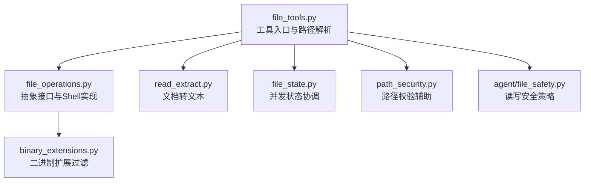
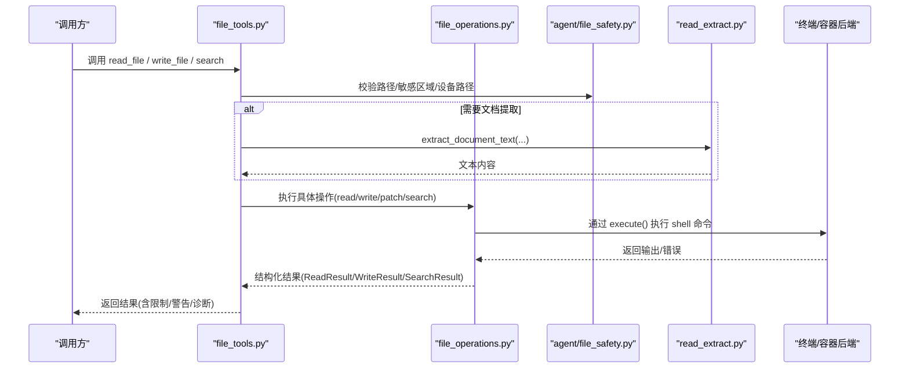
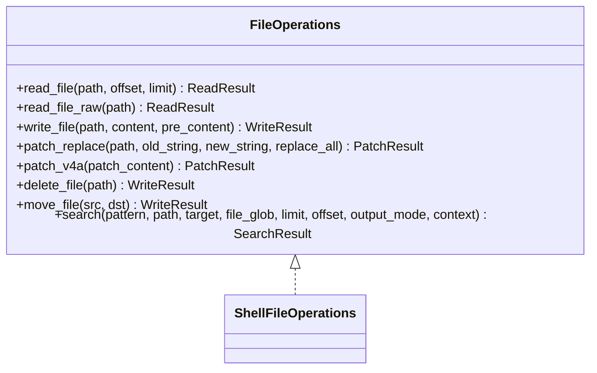
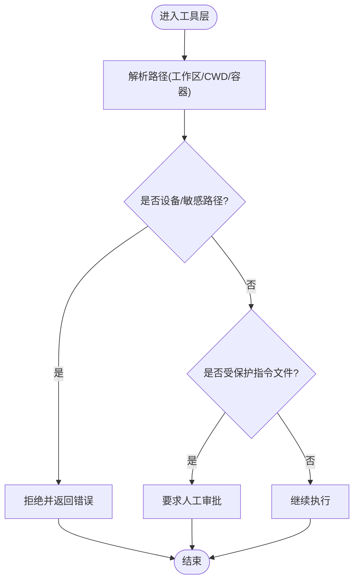
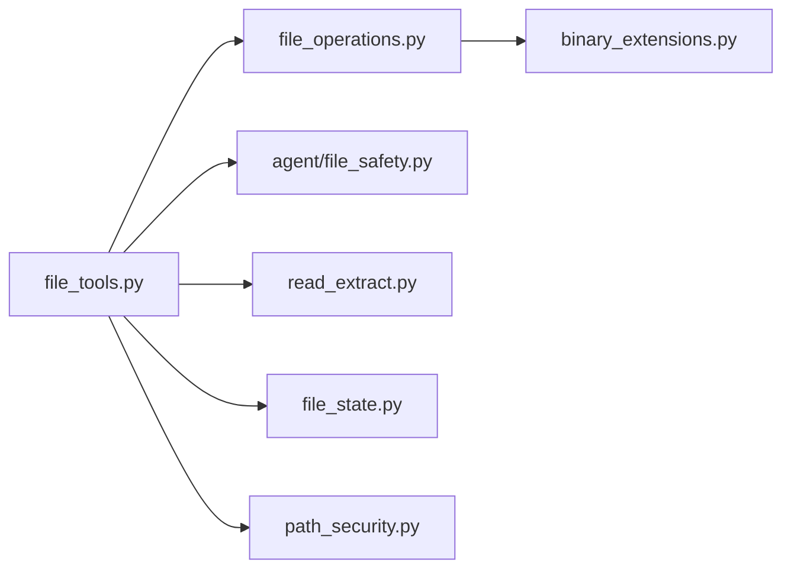

# 文件系统工具开发

<cite>
**本文引用的文件**
- [tools/file_operations.py](file://tools/file_operations.py)
- [tools/file_tools.py](file://tools/file_tools.py)
- [agent/file_safety.py](file://agent/file_safety.py)
- [tools/path_security.py](file://tools/path_security.py)
- [tools/read_extract.py](file://tools/read_extract.py)
- [tools/binary_extensions.py](file://tools/binary_extensions.py)
- [tools/file_state.py](file://tools/file_state.py)
</cite>

## 目录
1. [简介](#简介)
2. [项目结构](#项目结构)
3. [核心组件](#核心组件)
4. [架构总览](#架构总览)
5. [详细组件分析](#详细组件分析)
6. [依赖关系分析](#依赖关系分析)
7. [性能与内存优化](#性能与内存优化)
8. [故障排查指南](#故障排查指南)
9. [结论](#结论)
10. [附录：API与数据模型速查](#附录api与数据模型速查)

## 简介
本指南面向开发者，系统性说明如何在本仓库中构建安全、高效、跨平台的文件系统工具。内容覆盖文件读写、目录遍历、权限与路径安全、编码与特殊字符处理、异步 I/O 与大文件策略、监控与变更检测、沙箱隔离与恶意文件防护等主题，并提供可落地的实现思路与代码片段路径参考。

## 项目结构
围绕文件系统能力，仓库提供了分层清晰的模块：
- 抽象接口与通用实现：定义统一的文件操作接口，屏蔽不同终端/容器后端差异。
- 工具层封装：提供面向 LLM Agent 的易用 API，包含读取限制、搜索、补丁、批量操作等。
- 安全与合规：集中管理写拒绝列表、读保护、敏感路径拦截、工作区锚点与跨平台路径解析。
- 文档提取：对 Notebook、DOCX、XLSX 以及可选的任意文档格式进行文本化。
- 并发状态协调：在多子代理并发编辑同一文件时避免脏写。

图表来源
- [tools/file_tools.py:150-400](file://tools/file_tools.py#L150-L400)
- [tools/file_operations.py:450-520](file://tools/file_operations.py#L450-L520)
- [tools/read_extract.py:119-134](file://tools/read_extract.py#L119-L134)
- [tools/file_state.py:59-115](file://tools/file_state.py#L59-L115)
- [tools/path_security.py:15-44](file://tools/path_security.py#L15-L44)
- [agent/file_safety.py:28-80](file://agent/file_safety.py#L28-L80)
- [tools/binary_extensions.py:7-43](file://tools/binary_extensions.py#L7-L43)

章节来源
- [tools/file_tools.py:1-120](file://tools/file_tools.py#L1-L120)
- [tools/file_operations.py:1-120](file://tools/file_operations.py#L1-L120)
- [agent/file_safety.py:1-80](file://agent/file_safety.py#L1-L80)

## 核心组件
- 统一文件操作接口与 Shell 实现：提供 read/write/patch/search/delete/move 等能力，适配本地、SSH、Docker、Singularity、Modal、Daytona、Vercel Sandbox 等多种后端。
- 工具层封装：负责路径解析（工作区/CWD）、大小限制、设备路径拦截、敏感系统路径拒绝、受保护指令文件写入审批、结果脱敏与提示。
- 安全策略：集中维护写拒绝路径/前缀、读保护规则、跨配置/沙箱镜像/跨 Profile 的软守卫。
- 文档提取：将 .ipynb/.docx/.xlsx 及可选的任意文档转换为文本，支持 PDF 覆盖率告警。
- 并发状态协调：记录每任务读时间戳与最后写入者，防止并发子代理覆盖彼此修改。

章节来源
- [tools/file_operations.py:450-520](file://tools/file_operations.py#L450-L520)
- [tools/file_tools.py:150-400](file://tools/file_tools.py#L150-L400)
- [agent/file_safety.py:28-178](file://agent/file_safety.py#L28-L178)
- [tools/read_extract.py:119-134](file://tools/read_extract.py#L119-L134)
- [tools/file_state.py:59-115](file://tools/file_state.py#L59-L115)

## 架构总览
下图展示了从工具调用到具体实现的调用链与安全边界。

图表来源
- [tools/file_tools.py:150-400](file://tools/file_tools.py#L150-L400)
- [tools/file_operations.py:450-520](file://tools/file_operations.py#L450-L520)
- [agent/file_safety.py:194-337](file://agent/file_safety.py#L194-L337)
- [tools/read_extract.py:119-134](file://tools/read_extract.py#L119-L134)

## 详细组件分析

### 统一文件操作接口与 Shell 实现
- 抽象接口 FileOperations：定义 read_file/read_file_raw/write_file/patch_replace/patch_v4a/delete_file/move_file/search 等标准方法，便于多后端复用。
- ShellFileOperations：基于终端后端的 execute() 将文件操作表达为 shell 命令，从而在多种运行环境中保持一致行为。
- 行尾与 BOM 处理：自动检测并保留原始行尾（CRLF/LF），读取时剥离 UTF-8 BOM，写入时恢复，避免跨平台换行符污染。
- 搜索与上下文：使用 rg/grep 管线，分离诊断与匹配输出，支持分页、上下文行、超时标记与结果压缩。
- 内联 Lint：针对 JSON/YAML/TOML/Python 提供无子进程的快速语法检查；对 .ts/.go/.rs 等优先走 LSP 语义诊断。

图表来源
- [tools/file_operations.py:450-520](file://tools/file_operations.py#L450-L520)

章节来源
- [tools/file_operations.py:79-147](file://tools/file_operations.py#L79-L147)
- [tools/file_operations.py:357-419](file://tools/file_operations.py#L357-L419)
- [tools/file_operations.py:521-723](file://tools/file_operations.py#L521-L723)

### 工具层封装与路径安全
- 路径解析：以任务级工作区根为基准解析相对路径，兼容容器路径、Git Bash/MSYS 路径转换，避免 worktree 误写。
- 设备路径拦截：阻止读取可能挂起进程的设备节点与 /proc 敏感路径。
- 敏感系统路径拒绝：禁止直接写入系统关键目录与 Hermes 配置文件。
- 受保护指令文件：AGENTS.md/CLAUDE.md/SOUL.md/.cursorrules 等写入必须人工审批，防止持久化提示注入。
- 读保护：阻止读取内部缓存、凭据存储、项目 .env 等敏感文件，作为纵深防御。

图表来源
- [tools/file_tools.py:150-400](file://tools/file_tools.py#L150-L400)
- [tools/file_tools.py:516-589](file://tools/file_tools.py#L516-L589)
- [tools/file_tools.py:641-703](file://tools/file_tools.py#L641-L703)
- [tools/file_tools.py:706-800](file://tools/file_tools.py#L706-L800)
- [agent/file_safety.py:194-337](file://agent/file_safety.py#L194-L337)

章节来源
- [tools/file_tools.py:150-400](file://tools/file_tools.py#L150-L400)
- [tools/file_tools.py:516-589](file://tools/file_tools.py#L516-L589)
- [tools/file_tools.py:641-703](file://tools/file_tools.py#L641-L703)
- [tools/file_tools.py:706-800](file://tools/file_tools.py#L706-L800)
- [agent/file_safety.py:194-337](file://agent/file_safety.py#L194-L337)

### 安全策略与跨平台差异
- 写拒绝清单：精确路径与前缀，涵盖 SSH、AWS、GPG、Kube、Docker、Azure、GitHub CLI、Google Cloud 等凭据目录。
- 读保护规则：Hermes 内部缓存、认证文件、MCP tokens、项目 .env 等。
- 跨 Profile 与沙箱镜像：识别写到其他 Profile 或沙箱镜像路径的风险，给出明确警告与绕过方式。
- 路径校验辅助：validate_within_dir 与 has_traversal_component 用于快速校验与前置检查。

章节来源
- [agent/file_safety.py:28-178](file://agent/file_safety.py#L28-L178)
- [agent/file_safety.py:364-694](file://agent/file_safety.py#L364-L694)
- [tools/path_security.py:15-44](file://tools/path_security.py#L15-L44)

### 文档提取与格式转换
- 支持 .ipynb/.docx/.xlsx 原生提取；可选 anydoc 扩展支持更多 Office/OpenDocument/RTF/EPUB/PDF。
- 大文件与内存保护：限制最大字节数，避免一次性加载超大文档导致 OOM。
- PDF 覆盖率检测：当大量页面无法提取文本时，附加可读提示，指导按需 OCR。

章节来源
- [tools/read_extract.py:119-134](file://tools/read_extract.py#L119-L134)
- [tools/read_extract.py:164-195](file://tools/read_extract.py#L164-L195)
- [tools/read_extract.py:198-331](file://tools/read_extract.py#L198-L331)
- [tools/read_extract.py:381-577](file://tools/read_extract.py#L381-L577)

### 并发状态协调与版本控制基础
- 读/写时间戳记录：记录每个任务的最近读取时间与部分读取标记，跟踪全局最后写入者。
- 陈旧性检查：在写之前检查是否有其他子代理或外部修改，提示重新读取。
- 路径锁：按路径粒度加锁，串行化同一文件的读→改→写，避免竞态。
- 变更记录：可用于生成“自某时间以来被哪些任务修改了哪些文件”的摘要，辅助版本控制集成。

章节来源
- [tools/file_state.py:59-215](file://tools/file_state.py#L59-L215)
- [tools/file_state.py:218-333](file://tools/file_state.py#L218-L333)

## 依赖关系分析
- file_tools.py 依赖 file_operations.py 的抽象接口与实现，同时组合 agent/file_safety.py 的安全策略、tools/read_extract.py 的文档提取、tools/file_state.py 的并发状态。
- file_operations.py 依赖 agent/file_safety.py 的写拒绝策略，并使用 tools/binary_extensions.py 的二进制扩展判断。
- path_security.py 提供通用的路径校验工具，被多个工具复用。

图表来源
- [tools/file_tools.py:150-400](file://tools/file_tools.py#L150-L400)
- [tools/file_operations.py:450-520](file://tools/file_operations.py#L450-L520)
- [tools/binary_extensions.py:7-43](file://tools/binary_extensions.py#L7-L43)
- [tools/path_security.py:15-44](file://tools/path_security.py#L15-L44)

章节来源
- [tools/file_tools.py:150-400](file://tools/file_tools.py#L150-L400)
- [tools/file_operations.py:450-520](file://tools/file_operations.py#L450-L520)

## 性能与内存优化
- 分页读取：read_file 支持 offset/limit，默认限制行数与行长，避免单次返回过大内容。
- 字符预算：工具层对 read_file 输出做字符预算裁剪，保证模型上下文窗口安全。
- 大文件提示：超过阈值时提示使用范围读取，减少无效往返。
- 搜索限流：search 支持分页与超时处理，避免长时间阻塞。
- 文档提取限制：对任何文档类型设置最大字节上限，PDF 扫描页空白率过高时给出提示，引导按需处理。
- 二进制跳过：对常见二进制扩展直接跳过文本比较/处理，降低 I/O 与 CPU 开销。

章节来源
- [tools/file_tools.py:52-135](file://tools/file_tools.py#L52-L135)
- [tools/file_operations.py:724-767](file://tools/file_operations.py#L724-L767)
- [tools/read_extract.py:46-54](file://tools/read_extract.py#L46-L54)
- [tools/binary_extensions.py:7-43](file://tools/binary_extensions.py#L7-L43)

## 故障排查指南
- 路径解析异常：确认工作区根与 CWD 是否正确，检查 TERMINAL_CWD 是否为绝对且非哨兵值。
- 设备路径拦截：若读取卡住，检查是否命中 /dev/* 或 /proc/* 黑名单。
- 敏感路径拒绝：写入系统目录或 Hermes 配置会被拒绝，需改用终端提权或专用配置工具。
- 受保护指令文件：写入 AGENTS.md 等需人工审批，确保流程符合安全策略。
- 并发冲突：出现“文件已被其他子代理修改”的警告时，先 re-read 再写，或使用 lock_path 包裹整段操作。
- 文档提取失败：检查文件格式与大小限制，必要时安装 anydoc 或分块处理。

章节来源
- [tools/file_tools.py:150-400](file://tools/file_tools.py#L150-L400)
- [tools/file_tools.py:516-589](file://tools/file_tools.py#L516-L589)
- [tools/file_tools.py:641-703](file://tools/file_tools.py#L641-L703)
- [tools/file_state.py:142-215](file://tools/file_state.py#L142-L215)
- [tools/read_extract.py:119-134](file://tools/read_extract.py#L119-L134)

## 结论
本仓库提供了完善且可复用的文件系统工具框架：以抽象接口统一多后端，以工具层封装路径安全与资源限制，以安全策略保障凭据与系统完整性，以文档提取与并发状态协调提升可用性与健壮性。遵循本文实践，可构建出安全、高效、跨平台的文件操作工具，满足复杂场景下的读写、搜索、批处理与监控需求。

## 附录：API与数据模型速查
- 读取结果 ReadResult：包含 content、total_lines、file_size、truncated、is_binary/is_image、base64_content、mime_type、dimensions、error、similar_files。
- 写入结果 WriteResult：bytes_written、dirs_created、verified、lint、lsp_diagnostics、error、warning。
- 补丁结果 PatchResult：success、diff、files_modified/created/deleted、lint、lsp_diagnostics、error、no_change、note。
- 搜索结果 SearchResult：matches、files、counts、total_count、truncated、limit_reason、warning、error。
- 常用常量：MAX_LINES/MAX_LINE_LENGTH/MAX_FILE_SIZE、DEFAULT_READ_OFFSET/LIMIT、DEFAULT_SEARCH_OFFSET/LIMIT。

章节来源
- [tools/file_operations.py:158-264](file://tools/file_operations.py#L158-L264)
- [tools/file_operations.py:724-767](file://tools/file_operations.py#L724-L767)