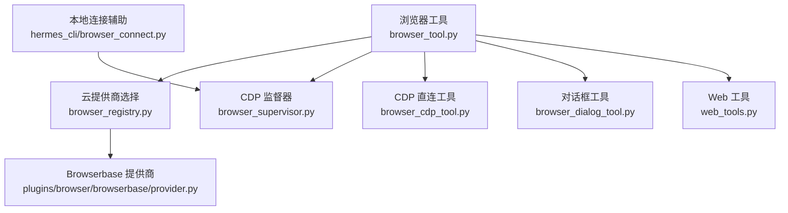
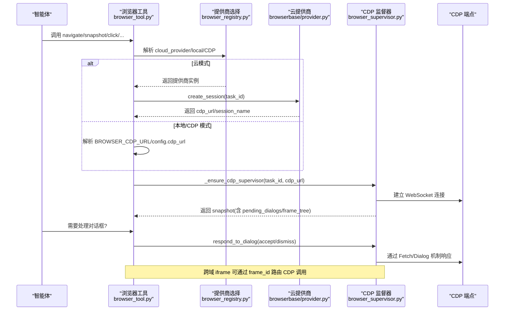
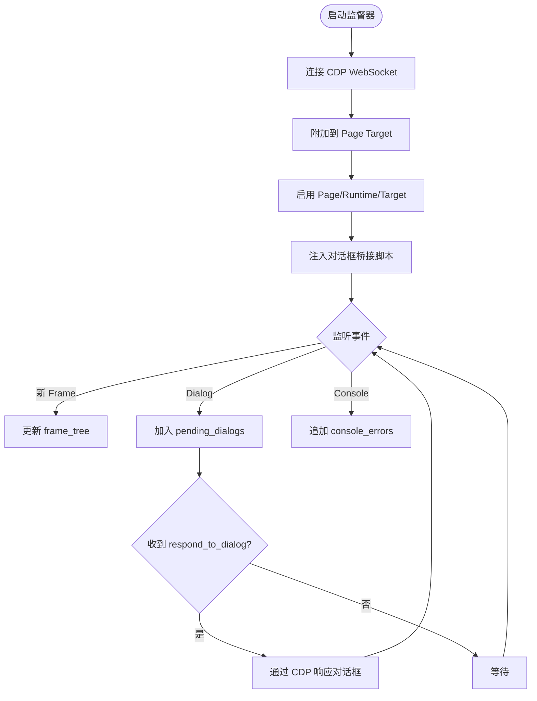
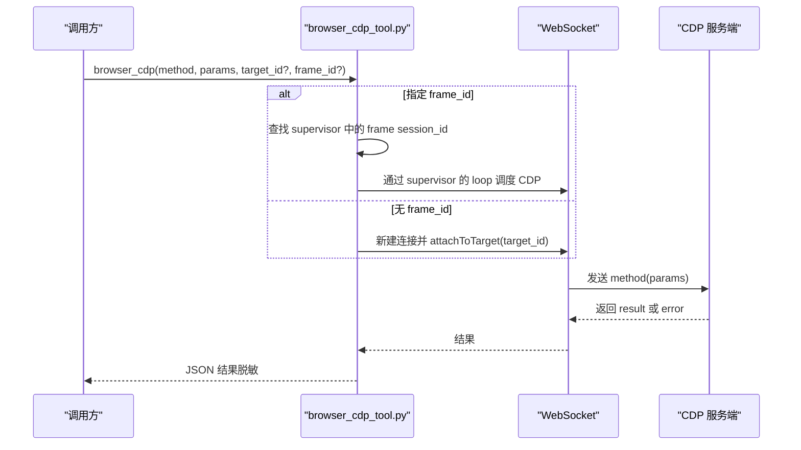
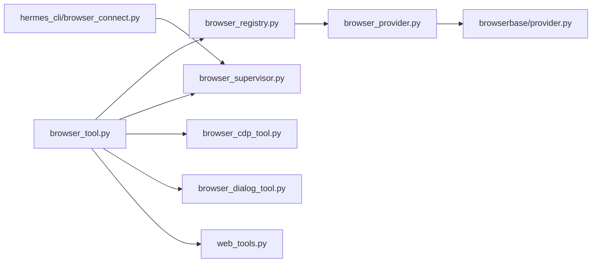

# 浏览器自动化工具开发

<cite>
**本文引用的文件**
- [tools/browser_tool.py](file://tools/browser_tool.py)
- [tools/browser_cdp_tool.py](file://tools/browser_cdp_tool.py)
- [tools/browser_supervisor.py](file://tools/browser_supervisor.py)
- [tools/browser_dialog_tool.py](file://tools/browser_dialog_tool.py)
- [agent/browser_provider.py](file://agent/browser_provider.py)
- [agent/browser_registry.py](file://agent/browser_registry.py)
- [plugins/browser/browserbase/provider.py](file://plugins/browser/browserbase/provider.py)
- [hermes_cli/browser_connect.py](file://hermes_cli/browser_connect.py)
- [tools/web_tools.py](file://tools/web_tools.py)
</cite>

## 目录
1. [简介](#简介)
2. [项目结构](#项目结构)
3. [核心组件](#核心组件)
4. [架构总览](#架构总览)
5. [详细组件分析](#详细组件分析)
6. [依赖关系分析](#依赖关系分析)
7. [性能与稳定性](#性能与稳定性)
8. [故障排查指南](#故障排查指南)
9. [结论](#结论)
10. [附录：示例与最佳实践](#附录示例与最佳实践)

## 简介
本指南面向希望构建“基于浏览器的自动化操作工具”的开发者，围绕以下目标展开：
- 浏览器实例管理、页面导航、元素操作与数据提取
- Chrome DevTools Protocol（CDP）使用、无头浏览器配置与性能优化
- 网页抓取、表单填写、截图生成与交互式操作
- 异步操作处理、超时控制、错误恢复与资源清理
- 反爬虫检测规避、验证码处理与会话管理的高级技巧
- 提供可落地的代码级参考路径与流程图/时序图

本项目在本地通过 agent-browser CLI 驱动 Chromium，或通过云提供商（Browserbase、Browser Use、Firecrawl）远程执行；同时支持 Camofox 作为本地反检测后端。所有浏览器能力以“工具”形式暴露给上层智能体调用，并通过 CDP 监督器统一处理对话框、跨域 iframe 等复杂场景。

## 项目结构
围绕浏览器自动化，关键模块分布如下：
- 工具层
  - tools/browser_tool.py：统一的浏览器工具入口，封装导航、快照、点击、截图、评估等能力，并选择后端（本地/云/Camofox/CDP）。
  - tools/browser_cdp_tool.py：直接发送任意 CDP 命令的“逃生通道”，用于原生对话框、iframe 作用域评估、Cookie/网络控制等。
  - tools/browser_dialog_tool.py：响应由 CDP 监督器捕获的 JS 对话框（alert/confirm/prompt/beforeunload）。
  - tools/web_tools.py：通用 Web 搜索/内容提取工具（与浏览器工具互补）。
- 运行时与协议
  - agent/browser_provider.py：云浏览器提供商抽象接口（会话创建/关闭/紧急清理）。
  - agent/browser_registry.py：提供商注册与选择策略（显式配置优先，其次按历史偏好自动选择）。
  - plugins/browser/browserbase/provider.py：Browserbase 云提供商实现。
  - hermes_cli/browser_connect.py：本地 Chromium 调试端口发现与连接辅助。
  - tools/browser_supervisor.py：持久化 CDP 监督器，维护 WebSocket 长连接、对话框拦截、frame_tree 与控制台事件。

图表来源
- [tools/browser_tool.py:1-120](file://tools/browser_tool.py#L1-L120)
- [agent/browser_registry.py:102-186](file://agent/browser_registry.py#L102-L186)
- [plugins/browser/browserbase/provider.py:95-200](file://plugins/browser/browserbase/provider.py#L95-L200)
- [tools/browser_supervisor.py:289-345](file://tools/browser_supervisor.py#L289-L345)
- [tools/browser_cdp_tool.py:188-276](file://tools/browser_cdp_tool.py#L188-L276)
- [tools/browser_dialog_tool.py:82-117](file://tools/browser_dialog_tool.py#L82-L117)
- [hermes_cli/browser_connect.py:145-200](file://hermes_cli/browser_connect.py#L145-L200)

章节来源
- [tools/browser_tool.py:1-120](file://tools/browser_tool.py#L1-L120)
- [agent/browser_registry.py:102-186](file://agent/browser_registry.py#L102-L186)
- [plugins/browser/browserbase/provider.py:95-200](file://plugins/browser/browserbase/provider.py#L95-L200)
- [tools/browser_supervisor.py:289-345](file://tools/browser_supervisor.py#L289-L345)
- [tools/browser_cdp_tool.py:188-276](file://tools/browser_cdp_tool.py#L188-L276)
- [tools/browser_dialog_tool.py:82-117](file://tools/browser_dialog_tool.py#L82-L117)
- [hermes_cli/browser_connect.py:145-200](file://hermes_cli/browser_connect.py#L145-L200)

## 核心组件
- 浏览器工具（browser_tool.py）
  - 负责选择后端（本地 headless Chromium、云提供商、Camofox、CDP 直连），统一暴露 navigate/snapshot/click/eval/screenshot 等能力。
  - 内置超时策略、截图清理、安全 URL 检查、对话框策略读取与 CDP 监督器启动。
- CDP 监督器（browser_supervisor.py）
  - 单任务一个持久化 CDP 连接，订阅 Page/Runtime/Target 事件，维护 pending_dialogs、recent_dialogs、frame_tree、console_errors。
  - 注入对话框桥接脚本，拦截 alert/confirm/prompt，使代理能“接受/拒绝”对话框。
- CDP 直连工具（browser_cdp_tool.py）
  - 允许发送任意 CDP 方法，支持 target_id（页签）和 frame_id（跨域 iframe）路由，具备私有地址/SSRF 防护。
- 对话框工具（browser_dialog_tool.py）
  - 读取 snapshot.pending_dialogs，调用 supervisor.respond_to_dialog 完成交互。
- 云提供商（browser_provider.py + browser_registry.py + Browserbase provider）
  - 抽象会话生命周期；registry 决定当前使用的提供商；Browserbase 实现创建/关闭会话及特性开关（代理、隐身、keep-alive、超时）。
- 本地连接辅助（hermes_cli/browser_connect.py）
  - 探测本地 Chromium 调试端口，返回可用的 CDP URL，供 /browser connect 或配置覆盖。

章节来源
- [tools/browser_tool.py:259-343](file://tools/browser_tool.py#L259-L343)
- [tools/browser_supervisor.py:289-345](file://tools/browser_supervisor.py#L289-L345)
- [tools/browser_cdp_tool.py:394-531](file://tools/browser_cdp_tool.py#L394-L531)
- [tools/browser_dialog_tool.py:28-79](file://tools/browser_dialog_tool.py#L28-L79)
- [agent/browser_provider.py:50-128](file://agent/browser_provider.py#L50-L128)
- [agent/browser_registry.py:113-186](file://agent/browser_registry.py#L113-L186)
- [plugins/browser/browserbase/provider.py:95-200](file://plugins/browser/browserbase/provider.py#L95-L200)
- [hermes_cli/browser_connect.py:145-200](file://hermes_cli/browser_connect.py#L145-L200)

## 架构总览
下图展示了从“浏览器工具”到“后端/CDP”的整体流程，包括云提供商选择、CDP 监督器、对话框处理与 iframe 路由。

图表来源
- [tools/browser_tool.py:594-649](file://tools/browser_tool.py#L594-L649)
- [agent/browser_registry.py:113-186](file://agent/browser_registry.py#L113-L186)
- [plugins/browser/browserbase/provider.py:95-200](file://plugins/browser/browserbase/provider.py#L95-L200)
- [tools/browser_supervisor.py:644-769](file://tools/browser_supervisor.py#L644-L769)
- [tools/browser_cdp_tool.py:284-391](file://tools/browser_cdp_tool.py#L284-L391)

## 详细组件分析

### 组件A：CDP 监督器（对话框与帧树）
- 职责
  - 维护每个 task_id 的单一 CDP WebSocket 连接，自动附加到 page 与子目标（OOPIF/worker）。
  - 注入对话框桥接脚本，将 alert/confirm/prompt 重定向到内部 XHR，通过 Fetch 拦截转为 pending_dialogs。
  - 维护 frame_tree（限制条目深度，避免广告页膨胀），以及 console_errors 环形缓冲。
- 关键流程
  - start() 启动后台线程与事件循环，_run() 负责断线重连与状态重建。
  - _attach_initial_page() 查找/创建 page target，启用 Page/Runtime/Target 域，安装对话框桥。
  - evaluate_runtime() 复用已连接会话执行 JS，自动降级序列化失败的场景。
- 复杂度与性能
  - 事件订阅与状态更新为 O(N) 帧数，frame_tree 有上限（默认 30 项，OOPIF 深度 2）。
  - 对话框响应通过同步桥接到事件循环，超时可控。

图表来源
- [tools/browser_supervisor.py:353-443](file://tools/browser_supervisor.py#L353-L443)
- [tools/browser_supervisor.py:644-769](file://tools/browser_supervisor.py#L644-L769)
- [tools/browser_supervisor.py:507-609](file://tools/browser_supervisor.py#L507-L609)

章节来源
- [tools/browser_supervisor.py:289-345](file://tools/browser_supervisor.py#L289-L345)
- [tools/browser_supervisor.py:353-443](file://tools/browser_supervisor.py#L353-L443)
- [tools/browser_supervisor.py:507-609](file://tools/browser_supervisor.py#L507-L609)
- [tools/browser_supervisor.py:644-769](file://tools/browser_supervisor.py#L644-L769)

### 组件B：CDP 直连工具（任意方法调用）
- 功能
  - 支持 method + params 直接发送到 CDP，可选 target_id（页签）或 frame_id（跨域 iframe）。
  - 对私有/内网 URL 进行 SSRF 防护，防止 Runtime.evaluate/DOM.getDocument 等敏感方法泄露。
  - 通过 websockets 建立独立连接，或在存在 supervisor 时复用其会话。
- 超时与错误
  - 超时范围 1-300 秒，异常分类为 TimeoutError/RuntimeError/WebSocketException，统一包装为 tool_error。
- 典型用法
  - 列出标签页：method='Target.getTargets'
  - 处理原生对话框：method='Page.handleJavaScriptDialog'
  - 获取 Cookie：method='Network.getAllCookies'
  - 在特定 tab 执行 JS：method='Runtime.evaluate'

图表来源
- [tools/browser_cdp_tool.py:188-276](file://tools/browser_cdp_tool.py#L188-L276)
- [tools/browser_cdp_tool.py:284-391](file://tools/browser_cdp_tool.py#L284-L391)
- [tools/browser_cdp_tool.py:394-531](file://tools/browser_cdp_tool.py#L394-L531)

章节来源
- [tools/browser_cdp_tool.py:188-276](file://tools/browser_cdp_tool.py#L188-L276)
- [tools/browser_cdp_tool.py:284-391](file://tools/browser_cdp_tool.py#L284-L391)
- [tools/browser_cdp_tool.py:394-531](file://tools/browser_cdp_tool.py#L394-L531)

### 组件C：对话框工具（响应 alert/confirm/prompt/beforeunload）
- 工作流
  - 先调用 browser_snapshot 查看 pending_dialogs，再调用 browser_dialog(action=accept|dismiss, prompt_text?, dialog_id?)。
  - 若未挂载 CDP 监督器，返回明确错误提示。
- 可用性
  - 仅在 CDP 可用时出现（本地 Chromium、Browserbase 等），Cam ofox（REST-only）不可用。

章节来源
- [tools/browser_dialog_tool.py:28-79](file://tools/browser_dialog_tool.py#L28-L79)
- [tools/browser_dialog_tool.py:82-117](file://tools/browser_dialog_tool.py#L82-L117)

### 组件D：云提供商选择与 Browserbase 实现
- 选择策略
  - 显式配置优先（忽略 is_available），否则按历史偏好（browser-use → browserbase）自动选择，未匹配则回退本地模式。
- Browserbase 会话
  - 支持 keepAlive、proxies、advancedStealth、自定义超时；402 时自动降级特性重试。
  - 返回 cdp_url 供后续 CDP 监督器连接。

章节来源
- [agent/browser_registry.py:113-186](file://agent/browser_registry.py#L113-L186)
- [plugins/browser/browserbase/provider.py:95-200](file://plugins/browser/browserbase/provider.py#L95-L200)

### 组件E：本地连接辅助（/browser connect）
- 功能
  - 探测本机 Chromium 调试端口（IPv4/IPv6 双栈），返回可用的 CDP URL。
  - 支持常见浏览器路径与参数（--remote-debugging-port、--user-data-dir 等）。

章节来源
- [hermes_cli/browser_connect.py:145-200](file://hermes_cli/browser_connect.py#L145-L200)

## 依赖关系分析
- 松耦合设计
  - browser_tool.py 通过 registry 选择提供商，不关心具体实现细节。
  - CDP 监督器与工具解耦：工具仅消费 snapshot/respond_to_dialog，不直接操作 WebSocket。
  - CDP 直连工具可作为“逃生通道”，但受安全守卫约束。
- 外部依赖
  - websockets：CDP 通信（监督器与直连工具）。
  - requests/httpx：云提供商 API 与 Web 工具。
  - agent.redact：日志与输出中的敏感信息脱敏。

图表来源
- [tools/browser_tool.py:652-800](file://tools/browser_tool.py#L652-L800)
- [agent/browser_registry.py:113-186](file://agent/browser_registry.py#L113-L186)
- [agent/browser_provider.py:50-128](file://agent/browser_provider.py#L50-L128)
- [plugins/browser/browserbase/provider.py:95-200](file://plugins/browser/browserbase/provider.py#L95-L200)
- [tools/browser_supervisor.py:289-345](file://tools/browser_supervisor.py#L289-L345)
- [tools/browser_cdp_tool.py:394-531](file://tools/browser_cdp_tool.py#L394-L531)
- [tools/browser_dialog_tool.py:82-117](file://tools/browser_dialog_tool.py#L82-L117)
- [tools/web_tools.py:1-100](file://tools/web_tools.py#L1-L100)
- [hermes_cli/browser_connect.py:145-200](file://hermes_cli/browser_connect.py#L145-L200)

章节来源
- [tools/browser_tool.py:652-800](file://tools/browser_tool.py#L652-L800)
- [agent/browser_registry.py:113-186](file://agent/browser_registry.py#L113-L186)
- [agent/browser_provider.py:50-128](file://agent/browser_provider.py#L50-L128)
- [plugins/browser/browserbase/provider.py:95-200](file://plugins/browser/browserbase/provider.py#L95-L200)
- [tools/browser_supervisor.py:289-345](file://tools/browser_supervisor.py#L289-L345)
- [tools/browser_cdp_tool.py:394-531](file://tools/browser_cdp_tool.py#L394-L531)
- [tools/browser_dialog_tool.py:82-117](file://tools/browser_dialog_tool.py#L82-L117)
- [tools/web_tools.py:1-100](file://tools/web_tools.py#L1-L100)
- [hermes_cli/browser_connect.py:145-200](file://hermes_cli/browser_connect.py#L145-L200)

## 性能与稳定性
- 超时控制
  - 命令超时：默认 30 秒，open 首次打开最小 60/120 秒，避免冷启动被误杀。
  - CDP 调用超时：1-300 秒，连接与响应分别设置 open/close 超时。
- 资源清理
  - 截图目录定期清理，避免磁盘膨胀。
  - 监督器 stop() 关闭 WebSocket、取消任务、回收线程。
- 健壮性
  - 断线重连：监督器在连接失败后指数退避并重试。
  - 安全：私有/内网 URL 阻断、敏感信息脱敏、环境变量最小化传递。
- 可扩展性
  - 提供商插件化，新增后端只需实现 BrowserProvider 并注册。

章节来源
- [tools/browser_tool.py:259-343](file://tools/browser_tool.py#L259-L343)
- [tools/browser_tool.py:361-421](file://tools/browser_tool.py#L361-L421)
- [tools/browser_supervisor.py:395-443](file://tools/browser_supervisor.py#L395-L443)
- [tools/browser_supervisor.py:644-769](file://tools/browser_supervisor.py#L644-L769)
- [tools/browser_cdp_tool.py:498-531](file://tools/browser_cdp_tool.py#L498-L531)

## 故障排查指南
- 无法连接 CDP
  - 检查 BROWSER_CDP_URL 或 config.browser.cdp_url 是否指向可达的 ws/wss 地址。
  - 使用 /browser connect 探测本地调试端口，确认 /json/version 可达。
- 对话框未弹出或未响应
  - 确认已启动 CDP 监督器；查看 snapshot.pending_dialogs。
  - 若后端自动关闭原生对话框（如 Browserbase），需依赖桥接路径（Fetch 拦截）。
- 跨域 iframe 无法执行 JS
  - 使用 frame_id 路由到对应子会话；same-origin iframe 可在父页面通过 contentWindow/contentDocument 访问。
- 超时与崩溃
  - 调整 command_timeout 与 CDP timeout；关注 stderr/stdout 临时文件定位崩溃原因。
  - 监督器断线会记录警告并重连，注意观察 recent_dialogs 与 console_errors。

章节来源
- [tools/browser_tool.py:298-343](file://tools/browser_tool.py#L298-L343)
- [tools/browser_tool.py:361-421](file://tools/browser_tool.py#L361-L421)
- [tools/browser_supervisor.py:644-769](file://tools/browser_supervisor.py#L644-L769)
- [tools/browser_cdp_tool.py:498-531](file://tools/browser_cdp_tool.py#L498-L531)
- [hermes_cli/browser_connect.py:145-200](file://hermes_cli/browser_connect.py#L145-L200)

## 结论
本方案通过“工具 + 提供商 + 监督器”的分层架构，实现了稳定可靠的浏览器自动化能力：
- 工具层屏蔽后端差异，统一交互模型；
- 提供商层支持本地与云端多后端；
- 监督器层保障对话框、跨域 iframe、控制台事件等复杂场景的可观测性与可控性；
- CDP 直连工具提供高级扩展能力，同时内置安全防护。

在实际工程中，建议：
- 优先使用高层工具（navigate/snapshot/click/eval/screenshot），必要时再用 CDP 直连；
- 合理配置超时与清理策略，确保长时间运行稳定；
- 利用 frame_id 与对话框桥接处理复杂页面；
- 结合云提供商的反检测与代理能力，提升成功率。

## 附录：示例与最佳实践
- 网页抓取
  - 使用 browser_navigate 进入目标页，browser_snapshot 获取文本表示，必要时 web_extract 做内容抽取。
  - 参考路径：[tools/browser_tool.py:1-120](file://tools/browser_tool.py#L1-L120)、[tools/web_tools.py:1-100](file://tools/web_tools.py#L1-L100)
- 表单填写
  - 通过 snapshot 中的元素 ref 进行 type/click；如需更细粒度控制，使用 browser_cdp 的 Runtime.evaluate。
  - 参考路径：[tools/browser_cdp_tool.py:394-531](file://tools/browser_cdp_tool.py#L394-L531)
- 截图生成
  - 使用浏览器工具的截图能力；如需自定义视口/设备模拟，使用 Emulation.setDeviceMetricsOverride。
  - 参考路径：[tools/browser_cdp_tool.py:555-579](file://tools/browser_cdp_tool.py#L555-L579)
- 交互式操作
  - 遇到弹窗：先 snapshot 查看 pending_dialogs，再调用 browser_dialog 响应。
  - 参考路径：[tools/browser_dialog_tool.py:28-79](file://tools/browser_dialog_tool.py#L28-L79)、[tools/browser_supervisor.py:445-505](file://tools/browser_supervisor.py#L445-L505)
- 反爬虫与验证码
  - 云提供商开启代理/隐身模式；必要时使用 CDP 修改 UA/视口/指纹相关字段。
  - 参考路径：[plugins/browser/browserbase/provider.py:95-200](file://plugins/browser/browserbase/provider.py#L95-L200)
- 会话管理
  - 使用 task_id 隔离会话；云模式下通过提供商会话 ID 管理生命周期。
  - 参考路径：[agent/browser_provider.py:90-128](file://agent/browser_provider.py#L90-L128)