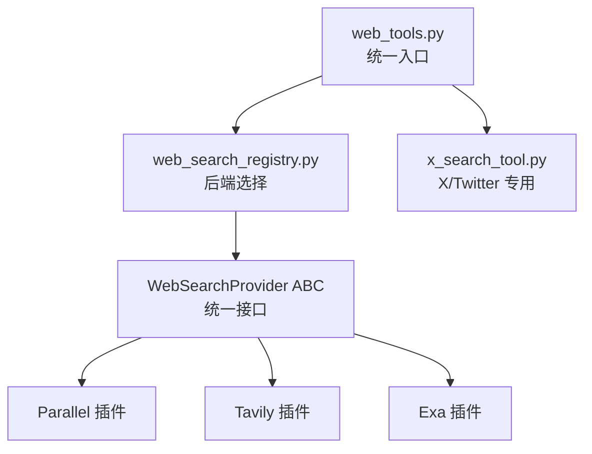
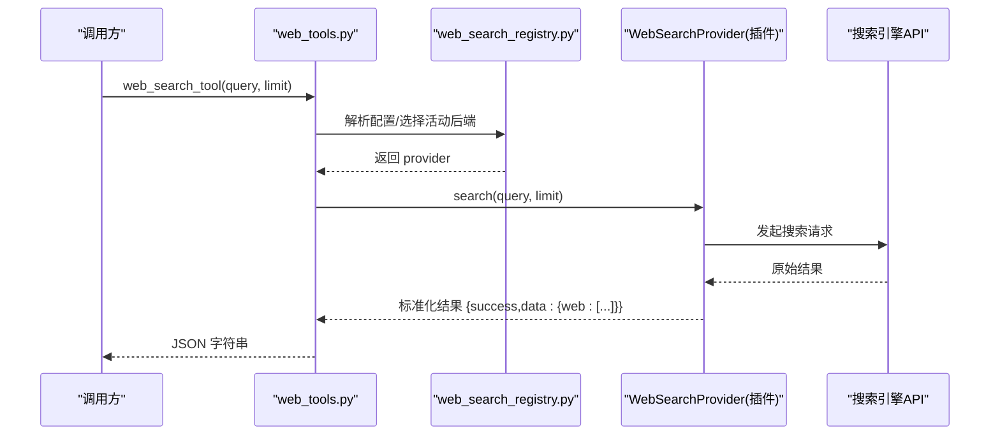
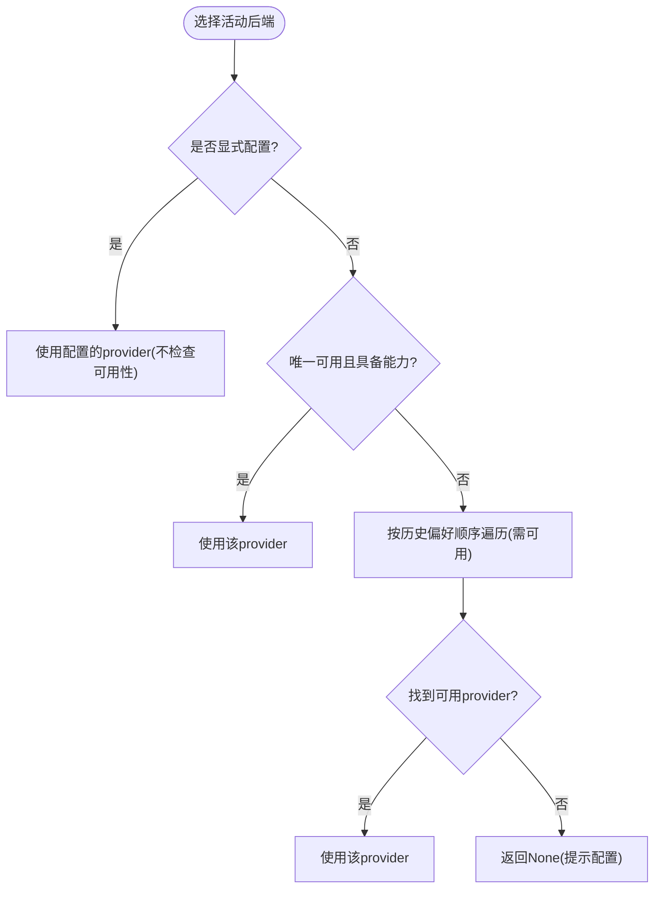
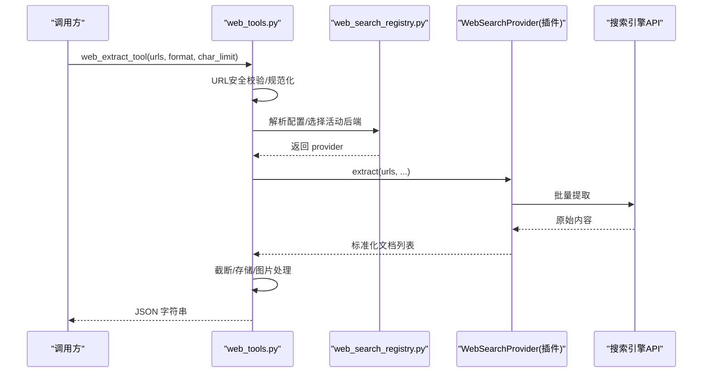
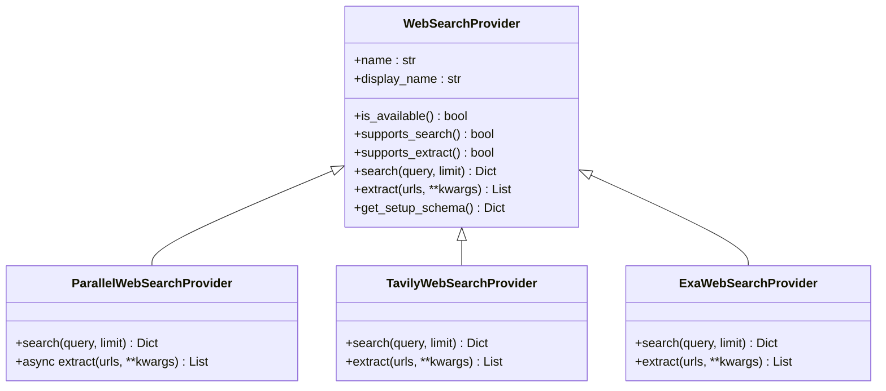
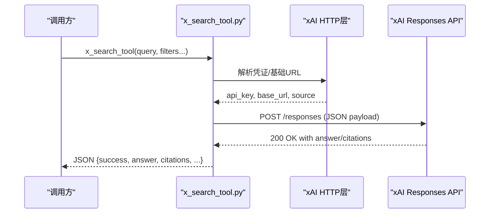
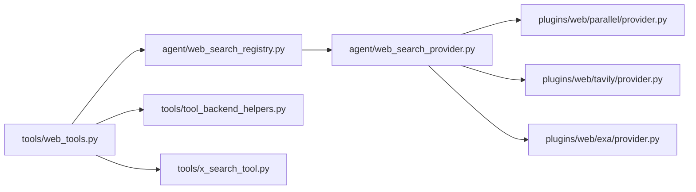

# 网络搜索工具开发

<cite>
**本文引用的文件**
- [agent/web_search_provider.py](file://agent/web_search_provider.py)
- [agent/web_search_registry.py](file://agent/web_search_registry.py)
- [tools/web_tools.py](file://tools/web_tools.py)
- [plugins/web/parallel/provider.py](file://plugins/web/parallel/provider.py)
- [plugins/web/tavily/provider.py](file://plugins/web/tavily/provider.py)
- [plugins/web/exa/provider.py](file://plugins/web/exa/provider.py)
- [tools/x_search_tool.py](file://tools/x_search_tool.py)
- [tools/tool_backend_helpers.py](file://tools/tool_backend_helpers.py)
</cite>

## 目录
1. [简介](#简介)
2. [项目结构](#项目结构)
3. [核心组件](#核心组件)
4. [架构总览](#架构总览)
5. [详细组件分析](#详细组件分析)
6. [依赖关系分析](#依赖关系分析)
7. [性能与可靠性](#性能与可靠性)
8. [故障排查指南](#故障排查指南)
9. [结论](#结论)
10. [附录：标准化结果格式与扩展实践](#附录：标准化结果格式与扩展实践)

## 简介
本指南面向希望构建高性能、可扩展的网络搜索工具的开发者。基于仓库中已实现的“插件化 Web 搜索提供者”体系，文档系统性地说明如何实现搜索引擎 API 适配、搜索结果标准化、分页与过滤、异步提取、错误重试、速率限制与缓存策略，并给出通用适配器模式、特定平台集成（如 X/Twitter）以及并行搜索的实现思路与代码路径参考。同时涵盖结果去重、相关性排序、质量评估与内容摘要等工程实践建议。

## 项目结构
该项目的搜索能力以“抽象接口 + 注册表 + 多后端插件”的方式组织：
- 抽象接口：定义统一的搜索与提取契约，屏蔽各引擎差异
- 注册表：负责发现、选择与路由当前可用的后端
- 工具层：对外暴露 web_search_tool 与 web_extract_tool，统一入口
- 插件实现：每个搜索引擎作为独立插件，实现搜索与/或提取能力
- 专用工具：X/Twitter 搜索通过 x_search_tool 直接调用 xAI Responses API

**图表来源**
- [tools/web_tools.py:618-739](file://tools/web_tools.py#L618-L739)
- [agent/web_search_registry.py:133-219](file://agent/web_search_registry.py#L133-L219)
- [agent/web_search_provider.py:89-212](file://agent/web_search_provider.py#L89-L212)
- [plugins/web/parallel/provider.py:147-298](file://plugins/web/parallel/provider.py#L147-L298)
- [plugins/web/tavily/provider.py:130-225](file://plugins/web/tavily/provider.py#L130-L225)
- [plugins/web/exa/provider.py:87-217](file://plugins/web/exa/provider.py#L87-L217)
- [tools/x_search_tool.py:291-553](file://tools/x_search_tool.py#L291-L553)

**章节来源**
- [tools/web_tools.py:1-1238](file://tools/web_tools.py#L1-L1238)
- [agent/web_search_provider.py:1-212](file://agent/web_search_provider.py#L1-L212)
- [agent/web_search_registry.py:1-305](file://agent/web_search_registry.py#L1-L305)

## 核心组件
- WebSearchProvider 抽象类：定义 name、is_available、supports_search/supported_extract、search、extract、get_setup_schema 等能力与元数据接口，所有搜索引擎插件必须实现它。
- Web Search Registry：集中管理注册的 Provider，按配置优先级与可用性选择“活动后端”，支持 per-capability 覆盖（search vs extract）。
- Tools 层：web_search_tool 与 web_extract_tool 是统一入口，负责参数校验、插件加载、分发与结果标准化。
- 插件实现：Parallel、Tavily、Exa 等分别封装各自 SDK/API，将原始响应映射为统一格式。
- X/Twitter 搜索：x_search_tool 直接对接 xAI Responses API，提供带引用标注的搜索结果。

**章节来源**
- [agent/web_search_provider.py:89-212](file://agent/web_search_provider.py#L89-L212)
- [agent/web_search_registry.py:48-219](file://agent/web_search_registry.py#L48-L219)
- [tools/web_tools.py:618-739](file://tools/web_tools.py#L618-L739)
- [plugins/web/parallel/provider.py:147-298](file://plugins/web/parallel/provider.py#L147-L298)
- [plugins/web/tavily/provider.py:130-225](file://plugins/web/tavily/provider.py#L130-L225)
- [plugins/web/exa/provider.py:87-217](file://plugins/web/exa/provider.py#L87-L217)
- [tools/x_search_tool.py:291-553](file://tools/x_search_tool.py#L291-L553)

## 架构总览
下图展示了从工具调用到具体搜索引擎的完整流程，包括后端选择、能力匹配、请求执行与结果归一化。

**图表来源**
- [tools/web_tools.py:618-739](file://tools/web_tools.py#L618-L739)
- [agent/web_search_registry.py:133-219](file://agent/web_search_registry.py#L133-L219)
- [agent/web_search_provider.py:142-184](file://agent/web_search_provider.py#L142-L184)
- [plugins/web/parallel/provider.py:170-216](file://plugins/web/parallel/provider.py#L170-L216)
- [plugins/web/tavily/provider.py:153-176](file://plugins/web/tavily/provider.py#L153-L176)
- [plugins/web/exa/provider.py:115-155](file://plugins/web/exa/provider.py#L115-L155)

## 详细组件分析

### 抽象接口与注册表
- WebSearchProvider 定义了搜索与提取的统一契约，支持同步与异步 extract 实现；通过 supports_search/supported_extract 声明能力，便于注册表按能力筛选。
- 注册表提供注册、列举、获取指定名称 Provider 的能力，并通过 _resolve 函数按以下顺序选择活动后端：
  1) 显式配置优先（web.search_backend / web.extract_backend / web.backend），即使不可用也返回以便下游报错更精确
  2) 单候选快捷路径（仅一个具备能力且可用）
  3) 历史偏好顺序（firecrawl → parallel → tavily → exa → searxng → brave-free → ddgs），按 is_available 过滤
  4) 否则返回 None，由上层提示用户配置

**图表来源**
- [agent/web_search_registry.py:133-219](file://agent/web_search_registry.py#L133-L219)

**章节来源**
- [agent/web_search_provider.py:89-212](file://agent/web_search_provider.py#L89-L212)
- [agent/web_search_registry.py:48-219](file://agent/web_search_registry.py#L48-L219)

### 工具层：web_search_tool 与 web_extract_tool
- web_search_tool：
  - 参数校验与限流（limit 范围控制）
  - 确保插件已加载（_ensure_web_plugins_loaded）
  - 根据配置与注册表选择 provider，调用其 search()
  - 输出统一 JSON：{success, data:{web:[{title,url,description,position}]}}
- web_extract_tool：
  - URL 安全校验与规范化
  - 支持异步 extract（检测协程函数并 await）
  - 对大页面进行 head+tail 截断与全文本地存储，避免上下文爆炸
  - 将 base64 图片替换为占位符，减少 token 消耗
  - 输出统一列表：每项包含 url、title、content、raw_content、metadata，失败项含 error

**图表来源**
- [tools/web_tools.py:742-1238](file://tools/web_tools.py#L742-L1238)
- [agent/web_search_registry.py:281-298](file://agent/web_search_registry.py#L281-L298)
- [plugins/web/parallel/provider.py:218-283](file://plugins/web/parallel/provider.py#L218-L283)
- [plugins/web/tavily/provider.py:178-210](file://plugins/web/tavily/provider.py#L178-L210)
- [plugins/web/exa/provider.py:157-202](file://plugins/web/exa/provider.py#L157-L202)

**章节来源**
- [tools/web_tools.py:618-1238](file://tools/web_tools.py#L618-L1238)

### 插件实现：Parallel、Tavily、Exa
- Parallel：
  - 使用同步客户端进行 search，异步客户端进行 extract
  - 支持搜索模式 PARALLEL_SEARCH_MODE（agentic/fast/one-shot）
  - 将结果映射为标准 web 列表；extract 返回文档列表，失败项带 error
- Tavily：
  - 通过 httpx 直接调用 REST API
  - 搜索与提取均同步实现，结果映射至标准格式
- Exa：
  - 使用官方 SDK，lazy 加载以避免冷启动开销
  - 搜索返回 highlights 作为 description；extract 返回文本内容

**图表来源**
- [agent/web_search_provider.py:89-212](file://agent/web_search_provider.py#L89-L212)
- [plugins/web/parallel/provider.py:147-298](file://plugins/web/parallel/provider.py#L147-L298)
- [plugins/web/tavily/provider.py:130-225](file://plugins/web/tavily/provider.py#L130-L225)
- [plugins/web/exa/provider.py:87-217](file://plugins/web/exa/provider.py#L87-L217)

**章节来源**
- [plugins/web/parallel/provider.py:1-298](file://plugins/web/parallel/provider.py#L1-L298)
- [plugins/web/tavily/provider.py:1-225](file://plugins/web/tavily/provider.py#L1-L225)
- [plugins/web/exa/provider.py:1-217](file://plugins/web/exa/provider.py#L1-L217)

### 特定平台搜索：X/Twitter（x_search_tool）
- 认证：支持 SuperGrok OAuth 与 XAI_API_KEY，自动刷新访问令牌
- 查询参数：允许/排除账号、日期范围、图像/视频理解开关
- 防御性输出：标记 degraded/degraded_reason，当启用过滤但无引用时表明答案来自模型知识而非索引
- 重试与超时：可配置 retries 与 timeout_seconds，指数退避重试 5xx 与网络异常
- 结果结构：answer、citations、inline_citations、degraded 等字段

**图表来源**
- [tools/x_search_tool.py:122-156](file://tools/x_search_tool.py#L122-L156)
- [tools/x_search_tool.py:291-476](file://tools/x_search_tool.py#L291-L476)

**章节来源**
- [tools/x_search_tool.py:1-553](file://tools/x_search_tool.py#L1-L553)

## 依赖关系分析
- 工具层依赖注册表进行后端选择；注册表依赖配置与插件注册
- 插件通过 get_provider_env 读取环境变量（兼容 Hermes 配置层）
- 工具层还复用 tool_backend_helpers 中的托管网关判断与凭据解析逻辑
- 各插件内部依赖各自的 SDK 或 HTTP 客户端，采用懒加载与模块级缓存降低启动成本

**图表来源**
- [tools/web_tools.py:1-1238](file://tools/web_tools.py#L1-L1238)
- [agent/web_search_registry.py:1-305](file://agent/web_search_registry.py#L1-L305)
- [agent/web_search_provider.py:1-212](file://agent/web_search_provider.py#L1-L212)
- [plugins/web/parallel/provider.py:1-298](file://plugins/web/parallel/provider.py#L1-L298)
- [plugins/web/tavily/provider.py:1-225](file://plugins/web/tavily/provider.py#L1-L225)
- [plugins/web/exa/provider.py:1-217](file://plugins/web/exa/provider.py#L1-L217)
- [tools/tool_backend_helpers.py:1-312](file://tools/tool_backend_helpers.py#L1-L312)
- [tools/x_search_tool.py:1-553](file://tools/x_search_tool.py#L1-L553)

**章节来源**
- [tools/tool_backend_helpers.py:1-312](file://tools/tool_backend_helpers.py#L1-L312)

## 性能与可靠性
- 异步提取：Parallel 插件的 extract 为 async，工具层通过 inspect 检测并 await，保持事件循环响应
- 重试与超时：x_search_tool 支持 retries 与 timeout_seconds，对 5xx 与网络异常进行指数退避重试
- 缓存策略：
  - 插件内懒加载与模块级客户端缓存（Parallel、Exa）
  - 工具层对 web_extract 的大页内容进行本地存储与截断，避免重复传输与上下文膨胀
- 速率限制：
  - 各插件在调用上游 API 时设置合理超时与最大结果数（如 max_results/min(limit, N)）
  - 可通过配置调整重试次数与超时时间
- 资源保护：
  - 大页内容截断与 footer 指示，引导 read_file 分块读取中间部分
  - base64 图片替换为占位符，减少 token 消耗

[本节为通用指导，无需特定文件来源]

## 故障排查指南
- 未配置后端：
  - 现象：web_search_tool 返回“未配置 web 搜索提供商”
  - 解决：运行 hermes tools 配置 web.search_backend 或 web.backend；或确保至少一个插件可用
- 插件被禁用：
  - 现象：配置了某后端但实际不可用
  - 解决：检查 plugins.disabled，重新启用对应 web/<vendor> 插件
- 缺少凭据：
  - 现象：插件 is_available 为 False 或调用时报错
  - 解决：设置相应环境变量（如 PARALLEL_API_KEY、TAVILY_API_KEY、EXA_API_KEY、XAI_API_KEY）
- 超时与网络错误：
  - 现象：请求超时或连接失败
  - 解决：增大 timeout_seconds、增加 retries；检查网络与代理设置
- 大页内容过大：
  - 现象：提取结果过长导致上下文溢出
  - 解决：调整 web.extract_char_limit；使用 read_file 分块读取存储的完整文本

**章节来源**
- [tools/web_tools.py:618-739](file://tools/web_tools.py#L618-L739)
- [agent/web_search_registry.py:222-278](file://agent/web_search_registry.py#L222-L278)
- [tools/x_search_tool.py:352-390](file://tools/x_search_tool.py#L352-L390)

## 结论
本项目提供了高内聚、低耦合的网络搜索基础设施：通过抽象接口统一不同搜索引擎的差异，借助注册表实现灵活的后端选择与能力路由，并以工具层屏蔽细节、保证结果一致性。在此基础上，开发者可以便捷地接入新的搜索引擎，复用统一的错误处理、重试、缓存与结果标准化机制，快速构建高性能、可靠的网络搜索工具。

[本节为总结性内容，无需特定文件来源]

## 附录：标准化结果格式与扩展实践

### 搜索结果标准化格式
- 搜索：{success: bool, data: {web: [{title, url, description, position}, ...]}}
- 提取：[{url, title, content, raw_content, metadata?}, ...]，失败项含 error

**章节来源**
- [agent/web_search_provider.py:22-49](file://agent/web_search_provider.py#L22-L49)
- [plugins/web/parallel/provider.py:194-206](file://plugins/web/parallel/provider.py#L194-L206)
- [plugins/web/tavily/provider.py:64-76](file://plugins/web/tavily/provider.py#L64-L76)
- [plugins/web/exa/provider.py:135-147](file://plugins/web/exa/provider.py#L135-L147)

### 分页与过滤机制
- 分页：通过 limit 控制返回条数，各插件在服务端进行上限裁剪（如 min(limit, 20)）
- 过滤：
  - X/Twitter：allowed_x_handles、excluded_x_handles、from_date、to_date
  - 其他插件：依据各自 API 能力扩展过滤参数

**章节来源**
- [tools/x_search_tool.py:291-351](file://tools/x_search_tool.py#L291-L351)
- [plugins/web/parallel/provider.py:170-206](file://plugins/web/parallel/provider.py#L170-L206)
- [plugins/web/tavily/provider.py:153-171](file://plugins/web/tavily/provider.py#L153-L171)
- [plugins/web/exa/provider.py:115-147](file://plugins/web/exa/provider.py#L115-L147)

### 异步搜索请求与并发
- 异步提取：Parallel 插件提供 async extract，工具层自动检测并 await
- 并发搜索：可在上层编排多个 provider 的 search 调用（例如并行调用多个搜索引擎），聚合结果后去重与排序

[本节为通用指导，无需特定文件来源]

### 错误重试、速率限制与缓存
- 重试：x_search_tool 支持 retries 与指数退避；插件层捕获异常并返回结构化错误
- 速率限制：通过超时与最大结果数控制；可按需引入令牌桶/漏桶策略
- 缓存：插件级客户端缓存；工具级大页内容本地存储与截断

**章节来源**
- [tools/x_search_tool.py:352-390](file://tools/x_search_tool.py#L352-L390)
- [plugins/web/parallel/provider.py:64-118](file://plugins/web/parallel/provider.py#L64-L118)
- [plugins/web/exa/provider.py:41-77](file://plugins/web/exa/provider.py#L41-L77)
- [tools/web_tools.py:480-576](file://tools/web_tools.py#L480-L576)

### 结果去重与相关性排序
- 去重：基于 URL 或标题哈希合并重复条目
- 排序：结合位置、标题相似度、描述关键词匹配度、引用数量等信号加权排序
- 质量评估：标记 degraded（如 X/Twitter 无引用）、统计空结果比例、记录错误率

[本节为通用指导，无需特定文件来源]

### 内容摘要功能
- 提取阶段：插件返回 clean 内容（已去除样板），工具层进行截断与图片占位替换
- 摘要生成：可在上层调用 LLM 对长文进行摘要，或使用内置压缩策略（如 head+tail 窗口）

**章节来源**
- [tools/web_tools.py:450-576](file://tools/web_tools.py#L450-L576)