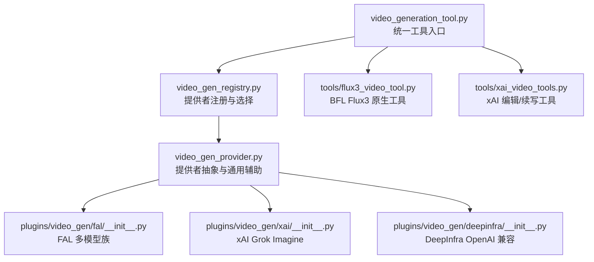
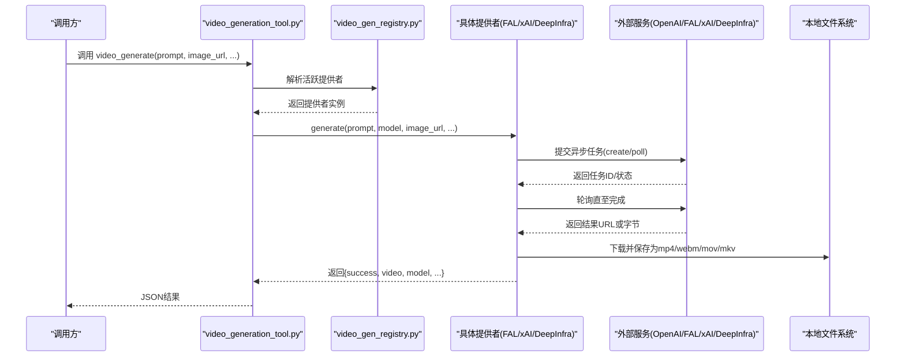
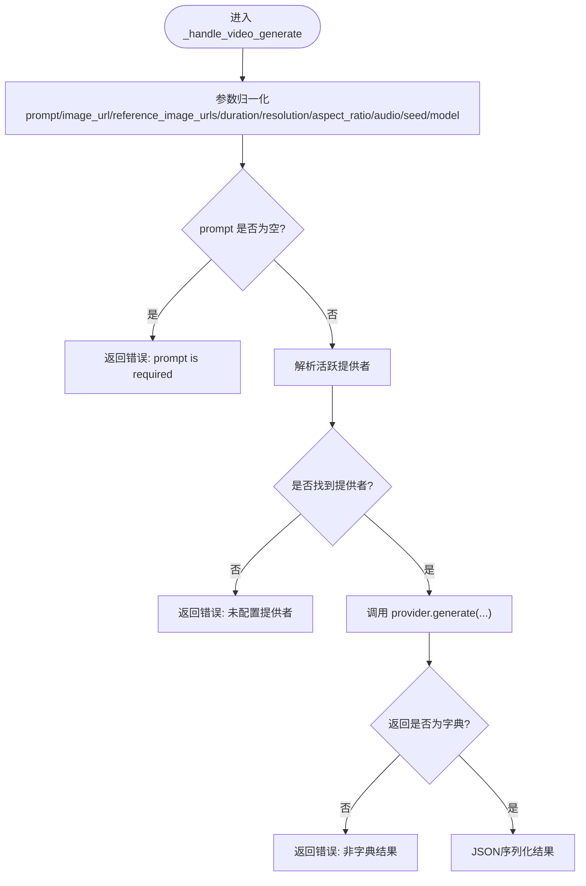
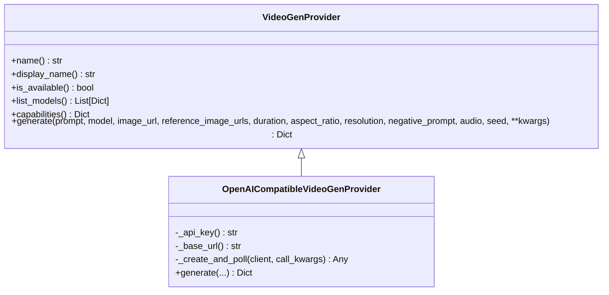
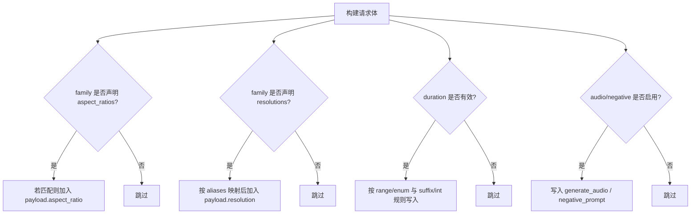
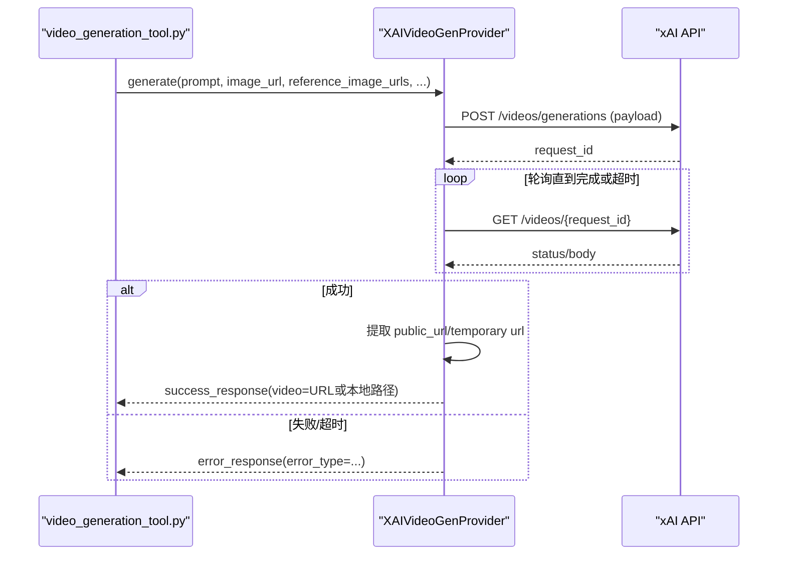
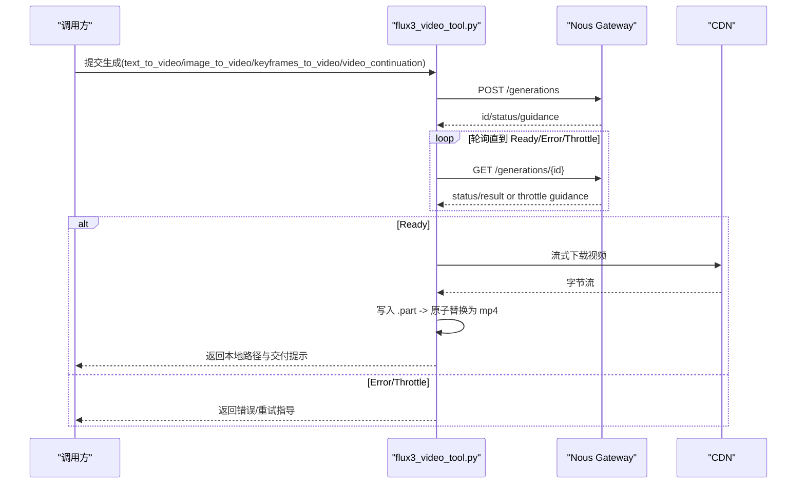
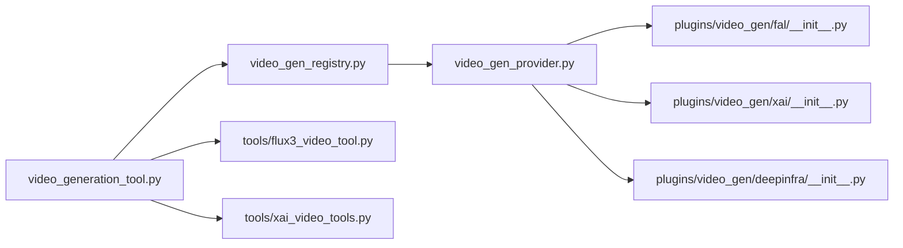

# 视频生成工具开发

<cite>
**本文引用的文件**
- [agent/video_gen_provider.py](file://agent/video_gen_provider.py)
- [agent/video_gen_registry.py](file://agent/video_gen_registry.py)
- [tools/video_generation_tool.py](file://tools/video_generation_tool.py)
- [plugins/video_gen/xai/__init__.py](file://plugins/video_gen/xai/__init__.py)
- [plugins/video_gen/fal/__init__.py](file://plugins/video_gen/fal/__init__.py)
- [plugins/video_gen/deepinfra/__init__.py](file://plugins/video_gen/deepinfra/__init__.py)
- [tools/flux3_video_tool.py](file://tools/flux3_video_tool.py)
- [tools/xai_video_tools.py](file://tools/xai_video_tools.py)
</cite>

## 目录
1. [简介](#简介)
2. [项目结构](#项目结构)
3. [核心组件](#核心组件)
4. [架构总览](#架构总览)
5. [详细组件分析](#详细组件分析)
6. [依赖关系分析](#依赖关系分析)
7. [性能与资源管理](#性能与资源管理)
8. [故障排查指南](#故障排查指南)
9. [结论](#结论)
10. [附录：最佳实践与示例路径](#附录：最佳实践与示例路径)

## 简介
本指南面向希望构建专业级 AI 视频生成工具的开发者，基于仓库中已有的“统一视频生成工具 + 可插拔后端”的设计，系统讲解如何集成文本到视频、图像转视频、参考图驱动的视频生成，以及视频编辑与续写等扩展能力。文档覆盖以下主题：
- 视频生成 API 集成（OpenAI 兼容接口、FAL.ai 多模型族、xAI Grok Imagine、DeepInfra）
- 帧序列处理与视频编解码（下载、缓存、流式保存、格式识别）
- 异步任务调度与轮询策略（带超时与预算的轮询循环）
- 大文件处理与内存管理（分块下载、大小上限、临时文件原子替换）
- 参数调优与质量控制（分辨率、时长、宽高比、音频、负向提示、种子）
- 成本控制与生成时间优化（模型族选择、网关代理、速率限制）
- 结果验证机制（状态机、终止状态、错误分类）

## 项目结构
视频生成功能采用“工具层 + 提供者抽象 + 插件注册 + 具体后端实现”的分层设计：
- 工具层：统一的 video_generate 工具，屏蔽后端差异，负责参数校验与动态 Schema
- 提供者抽象：VideoGenProvider ABC，定义 generate/capabilities/list_models 等契约
- 注册中心：维护已注册的提供者，按配置或可用性自动选择活跃提供者
- 具体后端：xFAL、xAI、DeepInfra 等插件实现；另有 BFL Flux3 原生工具走独立网关协议

**图表来源**
- [tools/video_generation_tool.py:62-160](file://tools/video_generation_tool.py#L62-L160)
- [agent/video_gen_registry.py:36-127](file://agent/video_gen_registry.py#L36-L127)
- [agent/video_gen_provider.py:75-196](file://agent/video_gen_provider.py#L75-L196)
- [plugins/video_gen/fal/__init__.py:539-741](file://plugins/video_gen/fal/__init__.py#L539-L741)
- [plugins/video_gen/xai/__init__.py:366-453](file://plugins/video_gen/xai/__init__.py#L366-L453)
- [plugins/video_gen/deepinfra/__init__.py:25-90](file://plugins/video_gen/deepinfra/__init__.py#L25-L90)
- [tools/flux3_video_tool.py:646-767](file://tools/flux3_video_tool.py#L646-L767)
- [tools/xai_video_tools.py:141-186](file://tools/xai_video_tools.py#L141-L186)

**章节来源**
- [tools/video_generation_tool.py:62-160](file://tools/video_generation_tool.py#L62-L160)
- [agent/video_gen_registry.py:36-127](file://agent/video_gen_registry.py#L36-L127)
- [agent/video_gen_provider.py:75-196](file://agent/video_gen_provider.py#L75-L196)

## 核心组件
- 统一工具：video_generate，支持文本到视频、图像到视频、参考图到视频；提供轻量校验与动态 Schema，将调用路由至活跃提供者
- 提供者抽象：VideoGenProvider 定义 name/display_name/is_available/list_models/capabilities/generate；OpenAICompatibleVideoGenProvider 封装 OpenAI 兼容接口的创建与轮询
- 注册中心：维护提供者映射，读取配置并选择活跃提供者，支持单可用提供者自动选择
- 具体后端：
  - FAL：多模型族（LTX、Pixverse、Seedance、Veo、Kling、MiniMax、Happy Horse 等），按 family 表构造请求体，支持直连或托管网关
  - xAI：Grok Imagine 文本/图像到视频，支持编辑/续写专用工具
  - DeepInfra：OpenAI 兼容视频端点，动态模型目录
- 原生工具：Flux3 通过 Nous 托管网关提交与轮询，自带媒体上传、下载与结果保存流程

**章节来源**
- [tools/video_generation_tool.py:310-410](file://tools/video_generation_tool.py#L310-L410)
- [agent/video_gen_provider.py:75-196](file://agent/video_gen_provider.py#L75-L196)
- [agent/video_gen_registry.py:79-127](file://agent/video_gen_registry.py#L79-L127)
- [plugins/video_gen/fal/__init__.py:539-741](file://plugins/video_gen/fal/__init__.py#L539-L741)
- [plugins/video_gen/xai/__init__.py:366-453](file://plugins/video_gen/xai/__init__.py#L366-L453)
- [plugins/video_gen/deepinfra/__init__.py:25-90](file://plugins/video_gen/deepinfra/__init__.py#L25-L90)
- [tools/flux3_video_tool.py:646-767](file://tools/flux3_video_tool.py#L646-L767)

## 架构总览
下图展示从工具调用到后端执行的完整链路，包括参数规范化、提供者选择、API 提交、轮询与结果落盘。

**图表来源**
- [tools/video_generation_tool.py:310-410](file://tools/video_generation_tool.py#L310-L410)
- [agent/video_gen_registry.py:79-127](file://agent/video_gen_registry.py#L79-L127)
- [agent/video_gen_provider.py:419-590](file://agent/video_gen_provider.py#L419-L590)
- [plugins/video_gen/fal/__init__.py:608-741](file://plugins/video_gen/fal/__init__.py#L608-L741)
- [plugins/video_gen/xai/__init__.py:552-661](file://plugins/video_gen/xai/__init__.py#L552-L661)
- [plugins/video_gen/deepinfra/__init__.py:25-90](file://plugins/video_gen/deepinfra/__init__.py#L25-L90)

## 详细组件分析

### 统一工具：video_generate
- 职责：参数归一化、输入约束检查、动态 Schema 构建、调用活跃提供者、异常包装
- 关键行为：
  - 根据 image_url 是否存在决定路由到文本到视频或图像到视频
  - 读取配置中的 provider/model，结合提供者默认值
  - 对 reference_image_urls 进行标准化与数量限制
  - 使用 success_response/error_response 统一返回结构

**图表来源**
- [tools/video_generation_tool.py:310-410](file://tools/video_generation_tool.py#L310-L410)

**章节来源**
- [tools/video_generation_tool.py:62-160](file://tools/video_generation_tool.py#L62-L160)
- [tools/video_generation_tool.py:310-410](file://tools/video_generation_tool.py#L310-L410)

### 提供者抽象与通用辅助
- VideoGenProvider：定义 name、display_name、is_available、list_models、capabilities、generate
- OpenAICompatibleVideoGenProvider：封装 OpenAI 兼容视频的 create_and_poll 替代方案，带硬截止时间的轮询；支持 URL 或 SDK 下载内容并保存到本地缓存
- 辅助函数：save_b64_video/save_bytes_video/save_url_video，统一写入 $HERMES_HOME/cache/videos/，支持多种视频格式与大小上限

**图表来源**
- [agent/video_gen_provider.py:75-196](file://agent/video_gen_provider.py#L75-L196)
- [agent/video_gen_provider.py:379-590](file://agent/video_gen_provider.py#L379-L590)

**章节来源**
- [agent/video_gen_provider.py:75-196](file://agent/video_gen_provider.py#L75-L196)
- [agent/video_gen_provider.py:204-316](file://agent/video_gen_provider.py#L204-L316)
- [agent/video_gen_provider.py:319-371](file://agent/video_gen_provider.py#L319-L371)
- [agent/video_gen_provider.py:379-590](file://agent/video_gen_provider.py#L379-L590)

### FAL 多模型族后端
- 模型族：LTX 2.3、Pixverse v6、Seedance 2.0/2.5 Mini、Veo 3.1、MiniMax H3、Kling v3 4K、Happy Horse、FLUX 3、Grok Imagine 1.5、Gemini Omni Flash
- 特性：按 family 表裁剪请求体（aspect_ratios/resolutions/durations/audio/negative_prompt），支持直接密钥或托管网关
- 路由：image_url 存在则走 image-to-video 端点，否则 text-to-video
- 输出：返回 CDN URL，可由上层工具决定是否下载到本地

**图表来源**
- [plugins/video_gen/fal/__init__.py:353-417](file://plugins/video_gen/fal/__init__.py#L353-L417)
- [plugins/video_gen/fal/__init__.py:539-741](file://plugins/video_gen/fal/__init__.py#L539-L741)

**章节来源**
- [plugins/video_gen/fal/__init__.py:72-276](file://plugins/video_gen/fal/__init__.py#L72-L276)
- [plugins/video_gen/fal/__init__.py:353-417](file://plugins/video_gen/fal/__init__.py#L353-L417)
- [plugins/video_gen/fal/__init__.py:539-741](file://plugins/video_gen/fal/__init__.py#L539-L741)

### xAI Grok Imagine 后端
- 能力：文本到视频、图像到视频、参考图到视频；支持编辑与续写（独立工具）
- 认证：OAuth 或 XAI_API_KEY；支持存储选项（files-cdn）
- 模型：grok-imagine-video（文本/参考）、grok-imagine-video-1.5（图像到视频）
- 轮询：自定义事件循环封装异步调用，带超时与错误分类

**图表来源**
- [plugins/video_gen/xai/__init__.py:552-661](file://plugins/video_gen/xai/__init__.py#L552-L661)
- [plugins/video_gen/xai/__init__.py:329-358](file://plugins/video_gen/xai/__init__.py#L329-L358)
- [tools/xai_video_tools.py:141-186](file://tools/xai_video_tools.py#L141-L186)

**章节来源**
- [plugins/video_gen/xai/__init__.py:61-81](file://plugins/video_gen/xai/__init__.py#L61-L81)
- [plugins/video_gen/xai/__init__.py:366-453](file://plugins/video_gen/xai/__init__.py#L366-L453)
- [plugins/video_gen/xai/__init__.py:552-661](file://plugins/video_gen/xai/__init__.py#L552-L661)
- [tools/xai_video_tools.py:141-186](file://tools/xai_video_tools.py#L141-L186)

### DeepInfra OpenAI 兼容后端
- 复用 OpenAICompatibleVideoGenProvider，仅声明 identity、credentials、live catalog
- 优势：无需硬编码模型 ID，随目录更新自动生效

**章节来源**
- [plugins/video_gen/deepinfra/__init__.py:25-90](file://plugins/video_gen/deepinfra/__init__.py#L25-L90)
- [agent/video_gen_provider.py:379-590](file://agent/video_gen_provider.py#L379-L590)

### BFL Flux3 原生工具
- 通过 Nous 托管网关提交与轮询，自带媒体上传、下载与结果保存
- 轮询策略：固定间隔、预算控制、连续传输错误上限、可中断等待
- 结果保存：流式下载、部分文件原子替换、最小合理大小校验

**图表来源**
- [tools/flux3_video_tool.py:646-767](file://tools/flux3_video_tool.py#L646-L767)
- [tools/flux3_video_tool.py:441-545](file://tools/flux3_video_tool.py#L441-L545)

**章节来源**
- [tools/flux3_video_tool.py:115-182](file://tools/flux3_video_tool.py#L115-L182)
- [tools/flux3_video_tool.py:337-401](file://tools/flux3_video_tool.py#L337-L401)
- [tools/flux3_video_tool.py:441-545](file://tools/flux3_video_tool.py#L441-L545)
- [tools/flux3_video_tool.py:646-767](file://tools/flux3_video_tool.py#L646-L767)

## 依赖关系分析
- 工具层依赖注册中心以解析活跃提供者
- 提供者抽象被所有后端实现继承或复用
- FAL/xAI/DeepInfra 分别依赖各自 SDK/HTTP 客户端与认证机制
- Flux3 工具依赖 Nous 托管网关与媒体上传/下载协议

**图表来源**
- [tools/video_generation_tool.py:310-410](file://tools/video_generation_tool.py#L310-L410)
- [agent/video_gen_registry.py:36-127](file://agent/video_gen_registry.py#L36-L127)
- [agent/video_gen_provider.py:75-196](file://agent/video_gen_provider.py#L75-L196)
- [plugins/video_gen/fal/__init__.py:539-741](file://plugins/video_gen/fal/__init__.py#L539-L741)
- [plugins/video_gen/xai/__init__.py:366-453](file://plugins/video_gen/xai/__init__.py#L366-L453)
- [plugins/video_gen/deepinfra/__init__.py:25-90](file://plugins/video_gen/deepinfra/__init__.py#L25-L90)
- [tools/flux3_video_tool.py:646-767](file://tools/flux3_video_tool.py#L646-L767)
- [tools/xai_video_tools.py:141-186](file://tools/xai_video_tools.py#L141-L186)

**章节来源**
- [tools/video_generation_tool.py:310-410](file://tools/video_generation_tool.py#L310-L410)
- [agent/video_gen_registry.py:36-127](file://agent/video_gen_registry.py#L36-L127)
- [agent/video_gen_provider.py:75-196](file://agent/video_gen_provider.py#L75-L196)

## 性能与资源管理
- 轮询与超时：
  - OpenAI 兼容后端：自定义轮询间隔与截止时间，避免无限阻塞
  - Flux3：预算秒数、轮询间隔、连续传输错误上限、可中断等待
- 大文件与内存：
  - 流式下载分块写入，设置最大字节上限，防止内存溢出
  - 部分文件命名与原子替换，确保下载失败不留下半残文件
- 格式支持与压缩：
  - 支持 mp4/webm/mov/mkv，依据 Content-Type 或 URL 后缀推断
  - 可通过后端参数（如分辨率、时长、音频开关）控制体积与质量
- 成本控制：
  - 选择廉价模型族（如 Pixverse、LTX）或按需升级至高质量模型（如 Kling、Veo）
  - 使用托管网关时注意订阅限制与可用端点
- 生成时间优化：
  - 合理设置 duration/resolution/aspect_ratio，避免不必要的高开销
  - 利用参考图减少长提示词带来的不稳定性和重试成本

**章节来源**
- [agent/video_gen_provider.py:419-590](file://agent/video_gen_provider.py#L419-L590)
- [tools/flux3_video_tool.py:202-245](file://tools/flux3_video_tool.py#L202-L245)
- [tools/flux3_video_tool.py:408-545](file://tools/flux3_video_tool.py#L408-L545)
- [plugins/video_gen/fal/__init__.py:72-276](file://plugins/video_gen/fal/__init__.py#L72-L276)

## 故障排查指南
- 常见错误类型：
  - missing_credentials：未配置 API Key 或未登录
  - no_model：无可用模型（目录为空或不可达）
  - modality_unsupported：所选模型族不支持当前模态（文本/图像）
  - invalid_request：prompt 为空或参数非法
  - api_error：后端 API 异常或网络错误
  - empty_response：任务完成但无输出
  - transport_error：网关不可达或响应不可读
- 定位步骤：
  - 检查配置中的 provider/model 是否正确
  - 查看提供者 capabilities 与实际传入参数是否匹配
  - 确认认证与网络可达性
  - 关注轮询状态与终止条件，区分节流与失败
  - 对于 Flux3，关注 guidance 与 details 字段

**章节来源**
- [tools/video_generation_tool.py:310-410](file://tools/video_generation_tool.py#L310-L410)
- [agent/video_gen_provider.py:319-371](file://agent/video_gen_provider.py#L319-L371)
- [plugins/video_gen/fal/__init__.py:608-741](file://plugins/video_gen/fal/__init__.py#L608-L741)
- [plugins/video_gen/xai/__init__.py:767-776](file://plugins/video_gen/xai/__init__.py#L767-L776)
- [tools/flux3_video_tool.py:115-182](file://tools/flux3_video_tool.py#L115-L182)

## 结论
该代码库提供了企业级的视频生成工具框架：统一工具入口、可插拔提供者、丰富的后端实现与完善的异步轮询与资源管理机制。开发者可基于此快速集成多种 AI 视频模型，灵活控制质量、成本与性能，并通过标准化工具链实现文本到视频、图像到视频、参考图驱动生成以及视频编辑与续写等高级功能。

## 附录：最佳实践与示例路径
- 文本到视频：
  - 使用 FAL 的 pixverse-v6 或 LTX 2.3，设置合理的 duration 与 resolution
  - 参考路径：[plugins/video_gen/fal/__init__.py:72-117](file://plugins/video_gen/fal/__init__.py#L72-L117)
- 图像到视频：
  - 使用 xAI grok-imagine-video-1.5 或 FAL 的 Seedance/Veo/Kling
  - 参考路径：[plugins/video_gen/xai/__init__.py:61-81](file://plugins/video_gen/xai/__init__.py#L61-L81)、[plugins/video_gen/fal/__init__.py:118-276](file://plugins/video_gen/fal/__init__.py#L118-L276)
- 参考图驱动视频：
  - 使用 xAI 的 reference_images，限制数量与格式
  - 参考路径：[plugins/video_gen/xai/__init__.py:249-264](file://plugins/video_gen/xai/__init__.py#L249-L264)
- 视频编辑与续写：
  - 使用 xai_video_edit/xai_video_extend，传入公共 HTTPS MP4 URL
  - 参考路径：[tools/xai_video_tools.py:70-138](file://tools/xai_video_tools.py#L70-L138)、[tools/xai_video_tools.py:141-186](file://tools/xai_video_tools.py#L141-L186)
- 大文件与流式下载：
  - 使用 save_url_video/save_bytes_video 或 Flux3 的流式下载逻辑
  - 参考路径：[agent/video_gen_provider.py:255-316](file://agent/video_gen_provider.py#L255-L316)、[tools/flux3_video_tool.py:441-545](file://tools/flux3_video_tool.py#L441-L545)
- 成本控制与质量平衡：
  - 选择合适模型族与分辨率/时长；优先廉价模型族用于原型验证
  - 参考路径：[plugins/video_gen/fal/__init__.py:72-276](file://plugins/video_gen/fal/__init__.py#L72-L276)