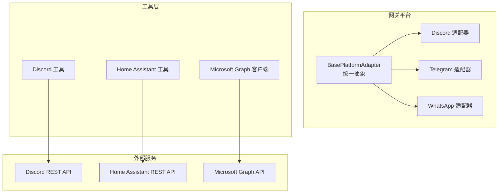
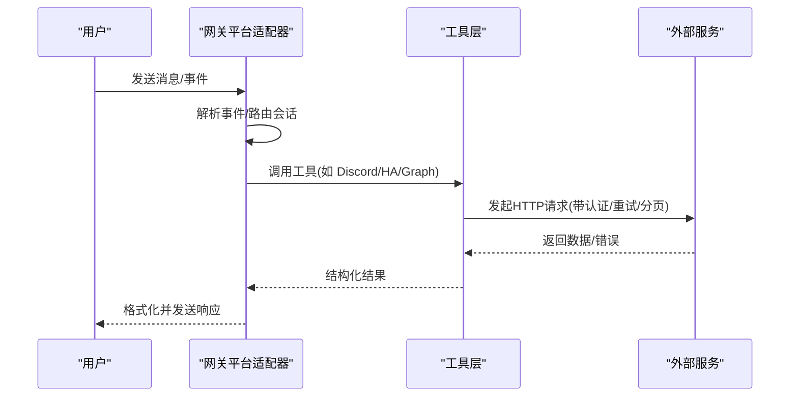
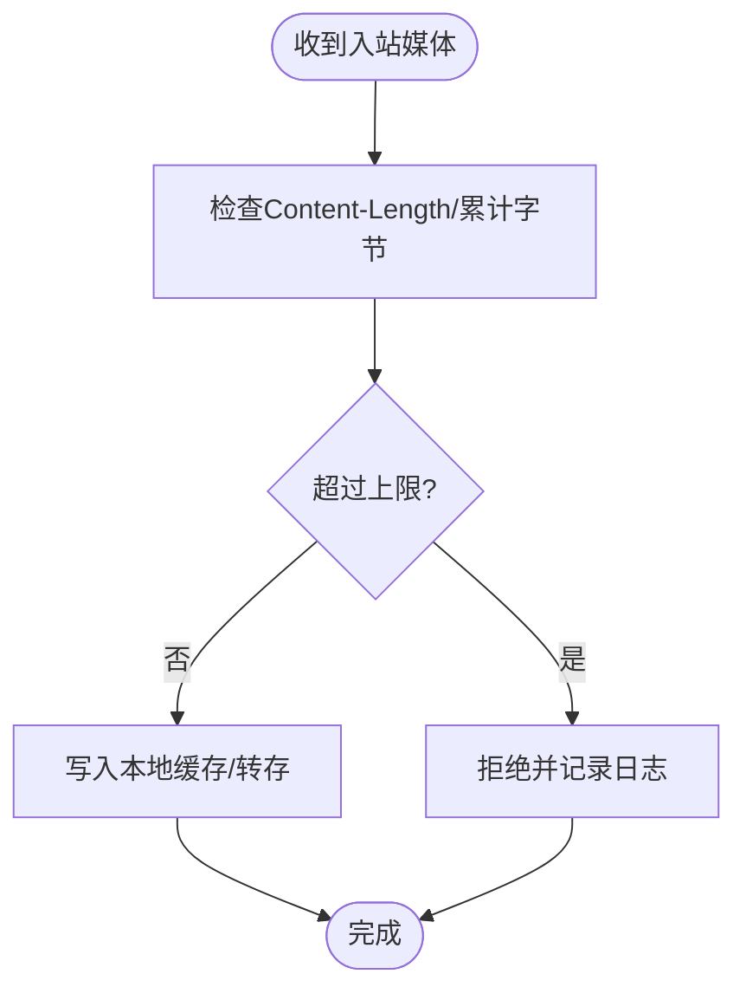
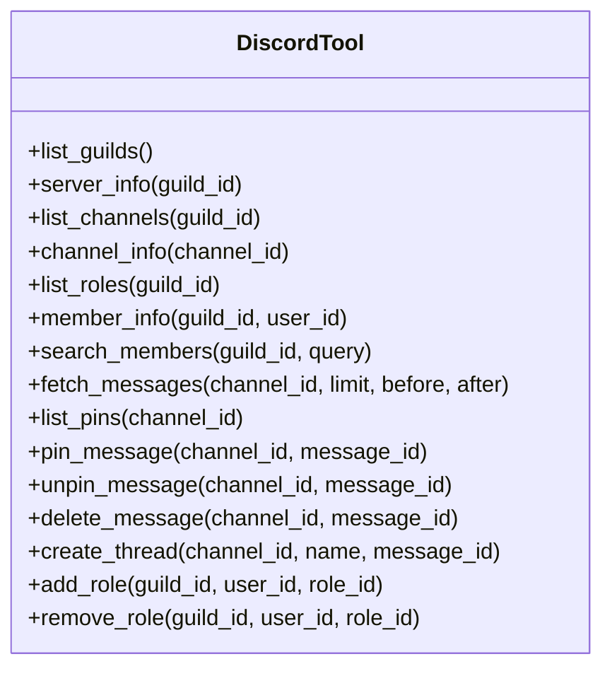
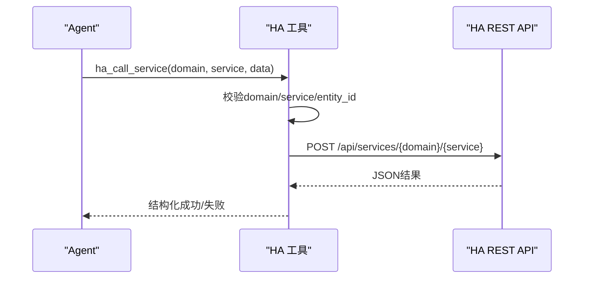
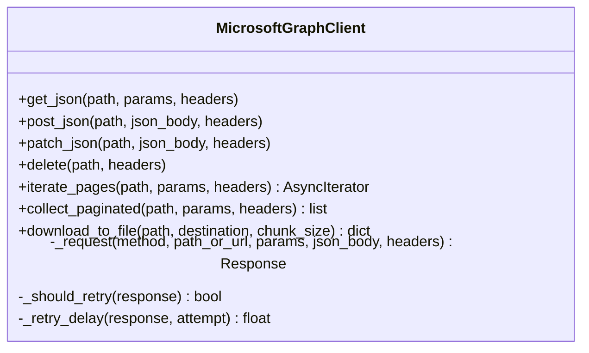
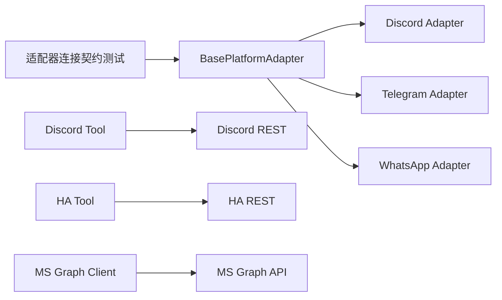

# 通信工具开发

<cite>
**本文引用的文件**
- [README.md](file://README.md)
- [gateway/platforms/base.py](file://gateway/platforms/base.py)
- [gateway/platforms/__init__.py](file://gateway/platforms/__init__.py)
- [tools/discord_tool.py](file://tools/discord_tool.py)
- [tools/homeassistant_tool.py](file://tools/homeassistant_tool.py)
- [tools/microsoft_graph_client.py](file://tools/microsoft_graph_client.py)
- [tests/gateway/test_adapter_connect_is_reconnect_contract.py](file://tests/gateway/test_adapter_connect_is_reconnect_contract.py)
</cite>

## 目录
1. [简介](#简介)
2. [项目结构](#项目结构)
3. [核心组件](#核心组件)
4. [架构总览](#架构总览)
5. [详细组件分析](#详细组件分析)
6. [依赖关系分析](#依赖关系分析)
7. [性能与高可用](#性能与高可用)
8. [故障排查指南](#故障排查指南)
9. [结论](#结论)
10. [附录：平台接入清单与最佳实践](#附录：平台接入清单与最佳实践)

## 简介
本指南面向需要构建跨平台消息传递与通信集成的开发者，围绕“消息发送、接收处理、协议适配”展开，结合仓库中的网关平台适配器体系与工具层实现，提供从 Discord 机器人、Home Assistant 集成到 Microsoft Graph 操作的完整技术路径。文档同时覆盖异步消息处理、队列与重试机制、富媒体与模板化输出、连接池与负载均衡、以及高可用设计要点，帮助你在多平台上稳定交付一致的通信体验。

## 项目结构
- 网关平台适配器（gateway/platforms）：定义统一的平台抽象与通用能力（媒体格式、代理、长度限制、流式 TTS、入站媒体大小限制等），各平台通过继承扩展具体实现。
- 工具层（tools）：面向 LLM/Agent 的可调用工具集合，包含对 Discord、Home Assistant、Microsoft Graph 的封装，提供认证、请求、分页、重试、下载等能力。
- 测试与契约（tests）：确保平台适配器接口一致性（如 connect 必须接受 is_reconnect 参数），保障网关重连流程稳定。

图表来源
- [gateway/platforms/base.py:1-120](file://gateway/platforms/base.py#L1-L120)
- [tools/discord_tool.py:1-120](file://tools/discord_tool.py#L1-L120)
- [tools/homeassistant_tool.py:1-120](file://tools/homeassistant_tool.py#L1-L120)
- [tools/microsoft_graph_client.py:1-120](file://tools/microsoft_graph_client.py#L1-L120)

章节来源
- [README.md:1-180](file://README.md#L1-L180)
- [gateway/platforms/__init__.py:1-46](file://gateway/platforms/__init__.py#L1-L46)

## 核心组件
- 平台适配器基类与通用能力：统一的消息事件模型、发送结果、线程/回复锚点、媒体类型判定、TTS 流式输出、入站媒体大小限制、代理与网络访问控制等。
- Discord 工具：直接调用 Discord REST API，支持服务器/频道/角色/成员/消息/线程等操作；具备意图检测与能力缓存，按权限动态暴露工具。
- Home Assistant 工具：通过长生命周期令牌访问 HA REST API，提供实体列表、状态查询、服务发现与服务调用，内置安全白名单与输入校验。
- Microsoft Graph 客户端：异步 HTTP 客户端，封装认证、重试、分页、大文件流式下载，错误分类与可恢复策略。

章节来源
- [gateway/platforms/base.py:1-200](file://gateway/platforms/base.py#L1-L200)
- [tools/discord_tool.py:1-120](file://tools/discord_tool.py#L1-L120)
- [tools/homeassistant_tool.py:1-120](file://tools/homeassistant_tool.py#L1-L120)
- [tools/microsoft_graph_client.py:1-120](file://tools/microsoft_graph_client.py#L1-L120)

## 架构总览
整体采用“网关平台适配器 + 工具层”的分层架构：
- 网关侧负责接入不同消息平台，标准化事件与发送语义，屏蔽平台差异。
- 工具层为 Agent/LLM 提供可编排的能力，包括第三方系统交互（Discord、HA、MS Graph）。
- 通过统一的认证、重试、分页、媒体处理与限流策略，保证跨平台一致性与稳定性。

图表来源
- [gateway/platforms/base.py:1-120](file://gateway/platforms/base.py#L1-L120)
- [tools/microsoft_graph_client.py:1-120](file://tools/microsoft_graph_client.py#L1-L120)

## 详细组件分析

### 平台适配器基类与通用能力
- 统一抽象：定义平台名称归一化、线程元数据、回复锚点、媒体类型判断、TTS 流式句柄、入站媒体大小限制、代理配置等。
- 关键特性：
  - 媒体格式与音频通道选择：根据扩展名与平台特性决定使用原生语音或文档发送。
  - UTF-16 长度限制：针对 Telegram 等平台进行精确截断，避免超长消息。
  - 代理与 NO_PROXY：自动识别 macOS 系统代理与环境变量，支持 SOCKS/HTTP。
  - 入站媒体保护：限制内存缓冲大小，防止恶意或超大上传导致 OOM。

图表来源
- [gateway/platforms/base.py:720-800](file://gateway/platforms/base.py#L720-L800)

章节来源
- [gateway/platforms/base.py:1-200](file://gateway/platforms/base.py#L1-L200)
- [gateway/platforms/base.py:720-800](file://gateway/platforms/base.py#L720-L800)

### Discord 机器人工具
- 功能范围：列出服务器、获取服务器信息、列举频道、角色、成员、消息、钉选/取消钉选、删除消息、创建线程、添加/移除角色等。
- 认证与意图：通过 Bot Token 鉴权；在构建工具时探测应用级特权意图（如 GUILD_MEMBERS、MESSAGE_CONTENT），动态隐藏不可用操作。
- 能力缓存：进程内缓存 + 磁盘缓存（24小时 TTL），后台探测避免冷启动阻塞。
- 错误处理：限制响应体大小，捕获 HTTPError 并转换为结构化错误，便于上层提示。

图表来源
- [tools/discord_tool.py:348-648](file://tools/discord_tool.py#L348-L648)

章节来源
- [tools/discord_tool.py:1-120](file://tools/discord_tool.py#L1-L120)
- [tools/discord_tool.py:348-648](file://tools/discord_tool.py#L348-L648)
- [tools/discord_tool.py:648-800](file://tools/discord_tool.py#L648-L800)

### Home Assistant 集成工具
- 功能范围：实体列表与过滤、实体状态查询、服务发现、服务调用（开关灯、调节温度等）。
- 认证与安全：使用长生命周期令牌；严格校验 entity_id 与服务域名/名称正则；黑名单禁止危险域（shell_command、command_line、python_script、pyscript、hassio、rest_command）。
- 异步执行：内部使用 aiohttp 异步请求，同步包装器在已有事件循环中安全运行。

图表来源
- [tools/homeassistant_tool.py:178-202](file://tools/homeassistant_tool.py#L178-L202)
- [tools/homeassistant_tool.py:252-290](file://tools/homeassistant_tool.py#L252-L290)

章节来源
- [tools/homeassistant_tool.py:1-120](file://tools/homeassistant_tool.py#L1-L120)
- [tools/homeassistant_tool.py:178-202](file://tools/homeassistant_tool.py#L178-L202)
- [tools/homeassistant_tool.py:252-290](file://tools/homeassistant_tool.py#L252-L290)

### Microsoft Graph 客户端
- 功能范围：GET/POST/PATCH/DELETE、分页迭代、批量收集、大文件流式下载。
- 认证与重试：基于 TokenProvider 获取访问令牌；对 401 自动刷新令牌；对 429/5xx 指数退避重试；支持 Retry-After 头。
- 错误分类：将响应体解析为结构化错误，携带状态码、方法、URL、消息与可选重试间隔。

图表来源
- [tools/microsoft_graph_client.py:46-155](file://tools/microsoft_graph_client.py#L46-L155)
- [tools/microsoft_graph_client.py:156-259](file://tools/microsoft_graph_client.py#L156-L259)
- [tools/microsoft_graph_client.py:260-401](file://tools/microsoft_graph_client.py#L260-L401)

章节来源
- [tools/microsoft_graph_client.py:1-120](file://tools/microsoft_graph_client.py#L1-L120)
- [tools/microsoft_graph_client.py:260-401](file://tools/microsoft_graph_client.py#L260-L401)

### 平台适配器连接契约与重连
- 契约要求：所有平台适配器的 connect 方法必须接受 is_reconnect 关键字参数，以便网关在重连时正确传递上下文。
- 回归测试：通过 AST 静态扫描所有适配器文件，确保签名兼容，避免首次重连即崩溃导致平台静默断开。

章节来源
- [tests/gateway/test_adapter_connect_is_reconnect_contract.py:1-145](file://tests/gateway/test_adapter_connect_is_reconnect_contract.py#L1-L145)

## 依赖关系分析
- 平台适配器基类被各平台适配器继承，提供通用能力与规范。
- 工具层独立于网关，但通过统一认证与错误处理与外部服务交互。
- 测试约束了适配器接口的稳定性，降低升级风险。

图表来源
- [gateway/platforms/base.py:1-120](file://gateway/platforms/base.py#L1-L120)
- [tools/discord_tool.py:1-120](file://tools/discord_tool.py#L1-L120)
- [tools/homeassistant_tool.py:1-120](file://tools/homeassistant_tool.py#L1-L120)
- [tools/microsoft_graph_client.py:1-120](file://tools/microsoft_graph_client.py#L1-L120)
- [tests/gateway/test_adapter_connect_is_reconnect_contract.py:1-145](file://tests/gateway/test_adapter_connect_is_reconnect_contract.py#L1-L145)

章节来源
- [gateway/platforms/base.py:1-120](file://gateway/platforms/base.py#L1-L120)
- [tests/gateway/test_adapter_connect_is_reconnect_contract.py:1-145](file://tests/gateway/test_adapter_connect_is_reconnect_contract.py#L1-L145)

## 性能与高可用
- 异步 I/O：工具层广泛使用 aiohttp/httpx 异步客户端，减少阻塞，提升吞吐。
- 重试与退避：MS Graph 客户端实现指数退避与 Retry-After 支持；Discord 工具限制响应体大小，避免异常负载。
- 分页与大文件：MS Graph 客户端支持分页迭代与流式下载，降低内存占用。
- 入站媒体保护：统一限制入站媒体大小，防止恶意上传导致 OOM。
- 代理与网络：支持 SOCKS/HTTP 代理与 NO_PROXY 规则，适应复杂网络环境。
- 连接池：通过 httpx/aiohttp 的连接复用减少握手开销；在高并发场景下建议显式配置连接池大小与超时。
- 负载均衡：网关侧可通过多实例部署与反向代理实现水平扩展；平台适配器无状态化有利于横向扩容。
- 高可用：适配器 connect 契约保障重连稳定；错误分类与可恢复策略提升鲁棒性。

[本节为通用指导，不直接分析具体文件]

## 故障排查指南
- 平台适配器重连失败：检查 connect 是否接受 is_reconnect 参数；参考回归测试用例定位问题。
- Discord 工具权限不足：确认应用级意图（GUILD_MEMBERS、MESSAGE_CONTENT）已启用；查看能力缓存与日志。
- Home Assistant 服务调用失败：校验 domain/service 是否符合正则且不在黑名单；检查实体 ID 格式与令牌有效性。
- Microsoft Graph 请求失败：关注 401/429/5xx 错误；利用客户端的错误对象获取 retry_after_seconds 与 payload；必要时清理令牌缓存并重试。
- 入站媒体过大：调整 gateway.max_inbound_media_bytes 配置或检查上游文件大小；关注日志中的超限拒绝信息。

章节来源
- [tests/gateway/test_adapter_connect_is_reconnect_contract.py:1-145](file://tests/gateway/test_adapter_connect_is_reconnect_contract.py#L1-L145)
- [tools/discord_tool.py:648-800](file://tools/discord_tool.py#L648-L800)
- [tools/homeassistant_tool.py:252-290](file://tools/homeassistant_tool.py#L252-L290)
- [tools/microsoft_graph_client.py:260-401](file://tools/microsoft_graph_client.py#L260-L401)
- [gateway/platforms/base.py:720-800](file://gateway/platforms/base.py#L720-L800)

## 结论
本项目提供了完善的多平台通信基础设施：以平台适配器基类为核心的统一抽象，配合工具层的 Discord、Home Assistant、Microsoft Graph 集成，实现了从消息收发、协议适配到富媒体与自动化控制的完整链路。通过异步 I/O、重试与分页、入站媒体保护、代理与网络控制等手段，保障了跨平台的稳定性与可扩展性。遵循适配器连接契约与测试约束，可进一步降低集成与维护成本。

[本节为总结，不直接分析具体文件]

## 附录：平台接入清单与最佳实践
- 接入步骤
  - 继承 BasePlatformAdapter，实现 connect/disconnect/message handling。
  - 遵循 is_reconnect 契约，确保网关重连流程稳定。
  - 使用统一媒体处理与长度限制，保证跨平台一致性。
- 认证与密钥
  - 使用 SecretScope 管理凭据（如 DISCORD_BOT_TOKEN、HASS_TOKEN、MS Graph 凭据）。
  - 对外部服务调用统一添加认证头与用户代理。
- 错误与重试
  - 区分可重试与不可重试错误；对 429/5xx 实施指数退避。
  - 对 401 自动刷新令牌并清理缓存。
- 性能优化
  - 使用异步客户端与连接池；合理设置超时与并发度。
  - 对大文件采用流式读写；对分页接口进行迭代消费。
- 安全加固
  - 严格校验输入（entity_id、domain/service 正则）。
  - 黑名单危险域；限制入站媒体大小；防止 SSRF。
- 监控与可观测性
  - 记录关键路径日志（请求 URL、状态码、错误信息）。
  - 暴露健康检查与指标（如重连次数、错误率、延迟）。

[本节为通用指导，不直接分析具体文件]