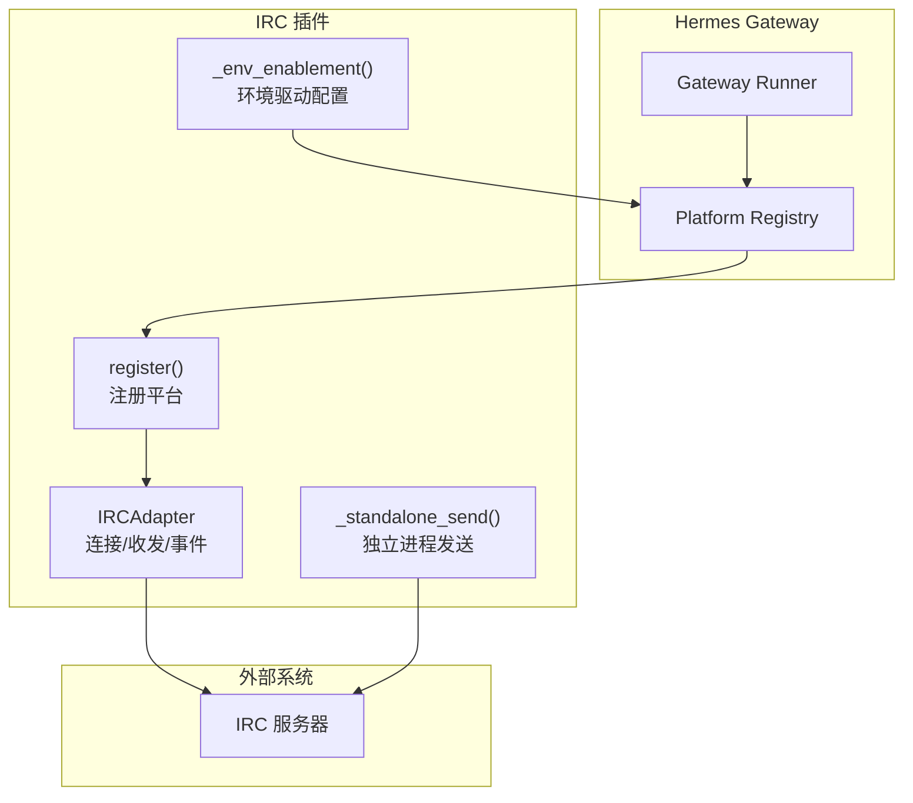
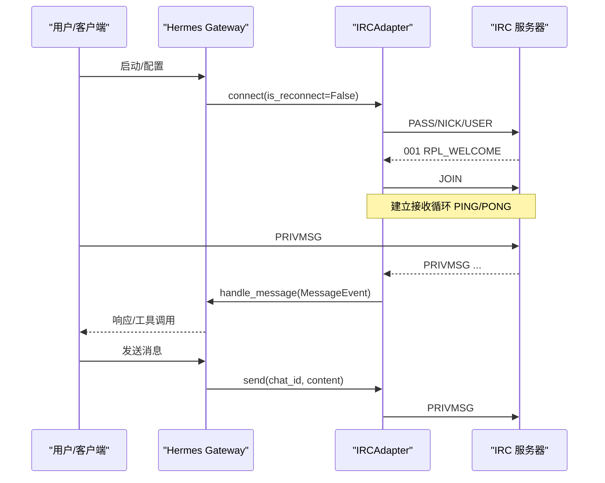
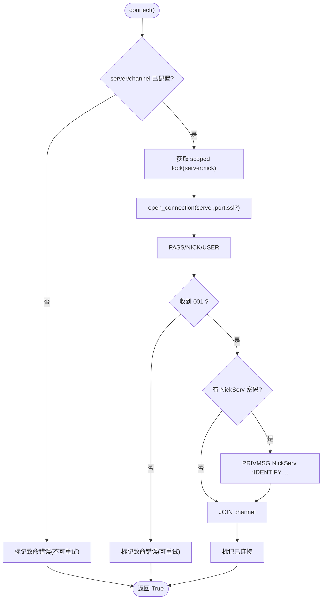
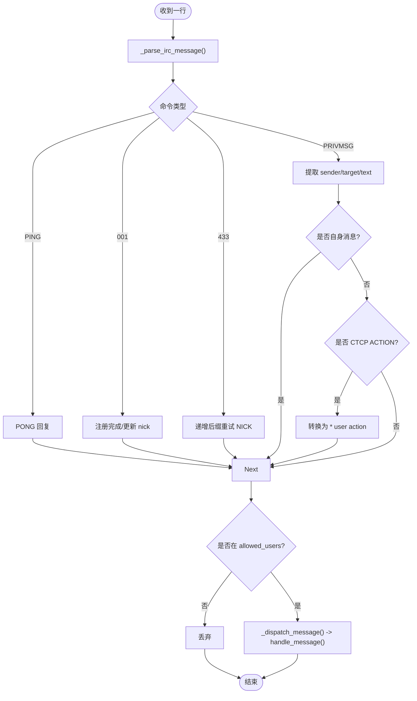
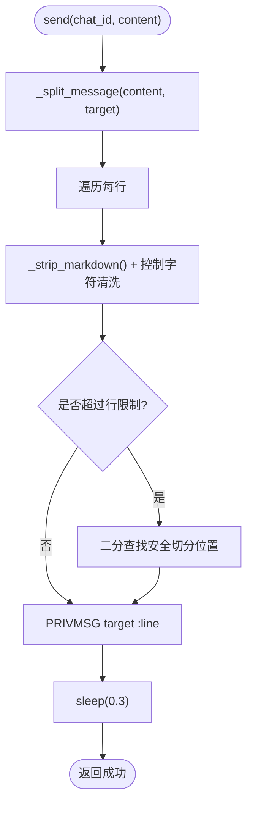
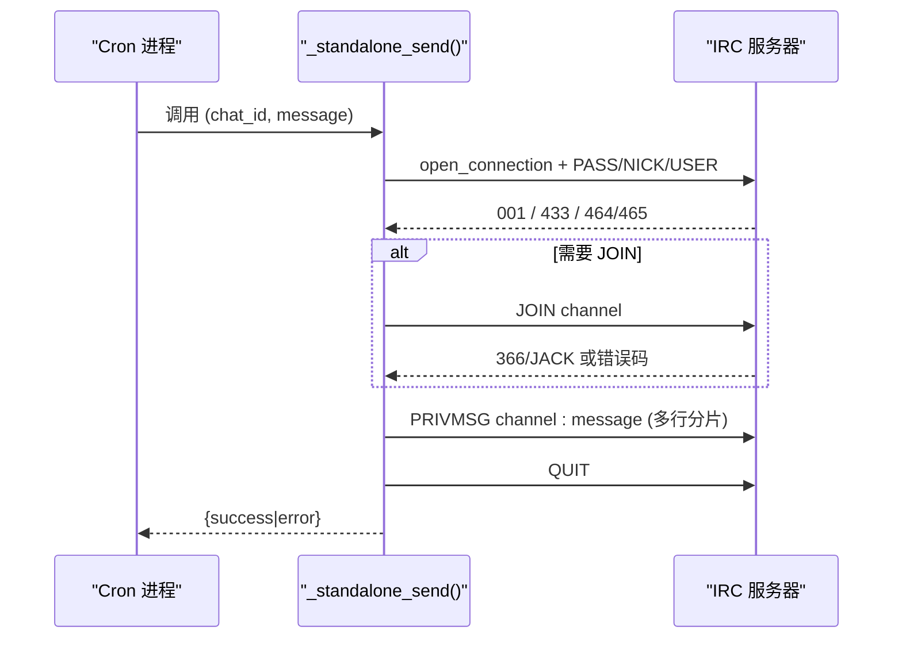
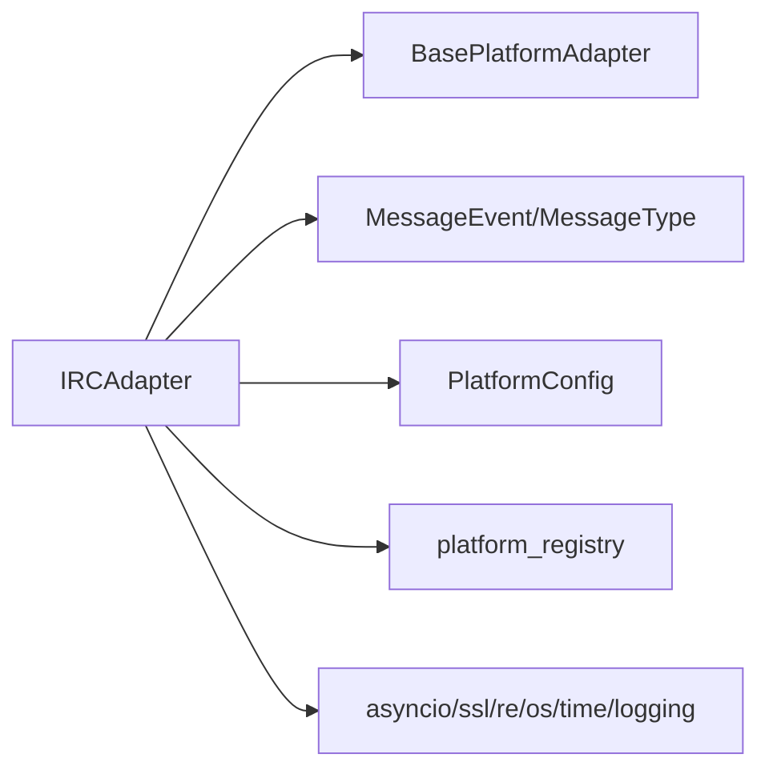

# IRC 协议平台适配器

<cite>
**本文引用的文件**
- [adapter.py](file://plugins/platforms/irc/adapter.py)
- [__init__.py](file://plugins/platforms/irc/__init__.py)
- [plugin.yaml](file://plugins/platforms/irc/plugin.yaml)
- [test_irc_adapter.py](file://tests/gateway/test_irc_adapter.py)
- [irc.md](file://website/docs/user-guide/messaging/irc.md)
</cite>

## 目录
1. [简介](#简介)
2. [项目结构](#项目结构)
3. [核心组件](#核心组件)
4. [架构总览](#架构总览)
5. [详细组件分析](#详细组件分析)
6. [依赖关系分析](#依赖关系分析)
7. [性能考量](#性能考量)
8. [故障排查指南](#故障排查指南)
9. [结论](#结论)
10. [附录](#附录)

## 简介
本指南面向需要在 Hermes Agent 中集成 IRC 协议的平台适配开发者。内容覆盖：
- IRC 服务器连接、注册与心跳保活
- 频道管理与消息收发（加入、离开、模式设置、邀请、踢出、静音等）
- 用户认证（NickServ 自动识别、可选的服务器密码）
- 消息处理（CTCP ACTION 转换、Markdown 转纯文本、长消息分片）
- 安全考虑（防注入攻击、控制字符过滤、敏感信息保护）
- 与 Hermes Gateway 的集成（通道到会话映射、消息路由、权限控制）
- 测试策略（协议兼容性、网络异常、性能优化建议）

说明：当前实现基于 Python 标准库 asyncio，不依赖第三方 IRC SDK；未内置 SASL、DCC 或完整 CTCP 扩展，但提供了可扩展点与最佳实践建议。

## 项目结构
IRC 平台以插件形式提供，核心位于 plugins/platforms/irc 目录：
- adapter.py：适配器实现、协议解析、发送/接收循环、独立发送器、插件注册
- __init__.py：暴露 register 入口
- plugin.yaml：声明环境变量、描述与 UI 提示
- website/docs/user-guide/messaging/irc.md：用户配置与使用文档
- tests/gateway/test_irc_adapter.py：单元测试与协议行为验证

图表来源
- [adapter.py:953-996](file://plugins/platforms/irc/adapter.py#L953-L996)
- [adapter.py:677-725](file://plugins/platforms/irc/adapter.py#L677-L725)
- [adapter.py:743-944](file://plugins/platforms/irc/adapter.py#L743-L944)

章节来源
- [adapter.py:1-996](file://plugins/platforms/irc/adapter.py#L1-L996)
- [plugin.yaml:1-55](file://plugins/platforms/irc/plugin.yaml#L1-L55)
- [irc.md:1-79](file://website/docs/user-guide/messaging/irc.md#L1-L79)

## 核心组件
- IRCAdapter：继承 BasePlatformAdapter，封装 IRC 连接生命周期、消息收发、事件分发
- 协议辅助函数：_parse_irc_message、_extract_nick、_strip_markdown、_strip_irc_control_chars
- 独立发送器 _standalone_send：供 cron 等非网关进程单独发送消息
- 插件注册 register：将 IRC 平台接入 Hermes 平台注册表，并声明能力与环境变量
- 环境驱动配置 _env_enablement：从环境变量生成 PlatformConfig.extra，支持 home_channel

关键职责与要点：
- 连接：TLS/非 TLS、PASS/NICK/USER、注册等待、NickServ IDENTIFY、JOIN 频道
- 接收：PING/PONG 保活、PRIVMSG 解析、CTCP ACTION 转换、地址匹配、授权检查
- 发送：按行拆分、控制字符清洗、速率限制、错误上报
- 安全：控制字符替换、目标校验、敏感信息读取通过作用域密钥

章节来源
- [adapter.py:83-113](file://plugins/platforms/irc/adapter.py#L83-L113)
- [adapter.py:119-534](file://plugins/platforms/irc/adapter.py#L119-L534)
- [adapter.py:728-741](file://plugins/platforms/irc/adapter.py#L728-L741)
- [adapter.py:743-944](file://plugins/platforms/irc/adapter.py#L743-L944)
- [adapter.py:953-996](file://plugins/platforms/irc/adapter.py#L953-L996)

## 架构总览
IRC 适配器作为 Hermes 的一个平台插件运行，遵循统一的平台接口。Gateway 负责调度、重连、状态上报；适配器专注协议细节与业务逻辑。

图表来源
- [adapter.py:179-244](file://plugins/platforms/irc/adapter.py#L179-L244)
- [adapter.py:391-505](file://plugins/platforms/irc/adapter.py#L391-L505)
- [adapter.py:282-303](file://plugins/platforms/irc/adapter.py#L282-L303)

## 详细组件分析

### 连接与生命周期管理
- 连接流程：创建 SSL 上下文（可选）、打开连接、发送 PASS/NICK/USER、等待 001、NickServ 识别、JOIN 频道
- 锁机制：同一 server+nickname 在多个 profile 间互斥，避免身份冲突
- 断开清理：QUIT、关闭流、取消接收任务、释放锁、重置状态

图表来源
- [adapter.py:179-244](file://plugins/platforms/irc/adapter.py#L179-L244)
- [adapter.py:246-279](file://plugins/platforms/irc/adapter.py#L246-L279)

章节来源
- [adapter.py:179-279](file://plugins/platforms/irc/adapter.py#L179-L279)

### 消息接收与处理
- 接收循环：按行读取、解码、分发
- 命令处理：PING/PONG、001、433 昵称冲突重试、PRIVMSG 解析
- 频道消息：仅响应被 @ 或 , 提及的消息；DM 直接处理
- CTCP：ACTION 转换为可读文本，其他 CTCP 忽略
- 授权：allowed_users 白名单（大小写不敏感）

图表来源
- [adapter.py:391-505](file://plugins/platforms/irc/adapter.py#L391-L505)

章节来源
- [adapter.py:391-505](file://plugins/platforms/irc/adapter.py#L391-L505)

### 消息发送与格式化
- 发送路径：send() 校验连接、按行拆分、逐行发送、基本限速
- 分片算法：按 UTF-8 字节长度切分，优先空格断点，保证不超过 IRC 行限制
- Markdown 剥离：粗体/斜体/代码/链接/图片转为纯文本，适配 IRC 显示
- 控制字符清洗：去除 \r、\n、\x00，防止注入

图表来源
- [adapter.py:282-303](file://plugins/platforms/irc/adapter.py#L282-L303)
- [adapter.py:318-379](file://plugins/platforms/irc/adapter.py#L318-L379)

章节来源
- [adapter.py:282-379](file://plugins/platforms/irc/adapter.py#L282-L379)

### 独立发送器（cron/非网关进程）
- 用途：当 cron 与 gateway 不在同一进程时，仍可通过临时连接发送消息
- 特性：独立 nick（带 -cron 后缀），JOIN 频道后再发送，处理注册超时、昵称冲突、JOIN 拒绝等错误
- 安全：对 chat_id 进行非法字符校验，消息内容清洗

图表来源
- [adapter.py:743-944](file://plugins/platforms/irc/adapter.py#L743-L944)

章节来源
- [adapter.py:743-944](file://plugins/platforms/irc/adapter.py#L743-L944)

### 插件注册与配置
- register()：向平台注册表注册 IRC 平台，声明名称、标签、工厂函数、检查/验证/连接状态、环境变量、安装提示、setup 函数、环境驱动、cron 投递、最大消息长度、PII 策略、平台提示等
- _env_enablement()：从环境变量填充 PlatformConfig.extra，包括 home_channel，便于无需实例化适配器即可感知配置
- plugin.yaml：声明必需/可选环境变量及 UI 提示

章节来源
- [adapter.py:677-725](file://plugins/platforms/irc/adapter.py#L677-L725)
- [adapter.py:953-996](file://plugins/platforms/irc/adapter.py#L953-L996)
- [plugin.yaml:1-55](file://plugins/platforms/irc/plugin.yaml#L1-L55)

### 与 Hermes 的集成
- 通道到会话映射：chat_id 即 IRC 频道名或 DM 的对方 nick；chat_type 为 group/dm
- 消息路由：通过 _dispatch_message 构建 MessageEvent 并交给基类 handle_message
- 权限控制：allowed_users 白名单；若允许所有人，需配合网络级 NickServ 强化身份
- Cron 投递：通过 cron_deliver_env_var 指定 home_channel，默认回退到 IRC_CHANNEL

章节来源
- [adapter.py:453-534](file://plugins/platforms/irc/adapter.py#L453-L534)
- [adapter.py:953-996](file://plugins/platforms/irc/adapter.py#L953-L996)
- [irc.md:54-65](file://website/docs/user-guide/messaging/irc.md#L54-L65)

## 依赖关系分析
- 运行时依赖：Python 标准库 asyncio、ssl、re、os、time、logging
- 框架依赖：BasePlatformAdapter、MessageEvent、MessageType、SendResult、PlatformConfig、platform_registry
- 插件体系：通过 register(ctx) 接入平台注册表，支持 env_enablement_fn、standalone_sender_fn、allowed_users_env 等钩子

图表来源
- [adapter.py:70-77](file://plugins/platforms/irc/adapter.py#L70-L77)
- [adapter.py:953-996](file://plugins/platforms/irc/adapter.py#L953-L996)

章节来源
- [adapter.py:70-77](file://plugins/platforms/irc/adapter.py#L70-L77)
- [adapter.py:953-996](file://plugins/platforms/irc/adapter.py#L953-L996)

## 性能考量
- 连接与注册：使用 wait_for 设置超时，避免阻塞；注册失败快速失败并重试
- 接收循环：批量读取 4096 字节，按 \r\n 分割，减少 I/O 次数
- 发送限速：每条消息后 sleep(0.3)，避免触发服务器 flood 保护
- 分片算法：按 UTF-8 字节长度二分查找切分点，优先空格断点，降低碎片率
- 资源清理：断开时显式关闭 writer、取消接收任务、释放锁，避免资源泄漏

[本节为通用指导，不直接分析具体文件]

## 故障排查指南
常见问题与定位：
- 无法连接：检查 server/port/use_tls，查看日志中的 connect_failed 错误
- 注册超时：确认服务器可达且 001 响应正常，必要时调整超时
- 昵称冲突：433 错误会自动递增后缀重试；如频繁冲突，更换 nickname
- 频道加入失败：JOIN 被拒绝（403/405/471/473/474/475），检查频道模式与权限
- 消息未送达：确认已 JOIN 频道（尤其是 +n 模式），检查 chat_id 合法性与控制字符清洗
- 权限拦截：allowed_users 未包含发送者 nick，或被忽略的未提及频道消息

章节来源
- [adapter.py:179-244](file://plugins/platforms/irc/adapter.py#L179-L244)
- [adapter.py:438-451](file://plugins/platforms/irc/adapter.py#L438-L451)
- [adapter.py:792-796](file://plugins/platforms/irc/adapter.py#L792-L796)
- [adapter.py:865-893](file://plugins/platforms/irc/adapter.py#L865-L893)

## 结论
该 IRC 平台适配器以最小依赖实现了稳定的 IRC 通信能力，涵盖连接、注册、频道加入、消息收发、基础安全与 Hermes 集成。对于更高级的现代 IRC 扩展（SASL、DCC、完整 CTCP），可在现有基础上扩展：
- SASL：在注册序列中插入 AUTHENTICATE 与相关命令，结合凭据存储
- DCC：新增 TCP/UDP 监听与握手流程，用于文件传输
- CTCP：扩展解析与响应逻辑，支持版本/时间/ping 等命令

建议在扩展前评估安全性与兼容性，并通过测试用例覆盖协议边界与异常路径。

[本节为总结性内容，不直接分析具体文件]

## 附录

### 开发示例与最佳实践
- 机器人：在 _handle_line 中根据关键词或正则触发工具调用，保持简洁回复
- 自动响应系统：基于 _dispatch_message 的 MessageEvent 进行规则匹配与响应
- 频道监控：订阅频道消息，聚合统计或告警，注意速率限制与日志脱敏

[本节为概念性指导，不直接分析具体文件]

### 测试策略
- 协议兼容性：验证 _parse_irc_message、_extract_nick、Markdown 剥离、控制字符清洗
- 网络异常：模拟连接失败、注册超时、JOIN 拒绝、昵称冲突
- 性能优化：长消息分片、UTF-8 字节边界、限速策略
- 参考用例：见 tests/gateway/test_irc_adapter.py

章节来源
- [test_irc_adapter.py:23-35](file://tests/gateway/test_irc_adapter.py#L23-L35)
- [test_irc_adapter.py:67-103](file://tests/gateway/test_irc_adapter.py#L67-L103)
- [test_irc_adapter.py:104-207](file://tests/gateway/test_irc_adapter.py#L104-L207)
- [test_irc_adapter.py:209-245](file://tests/gateway/test_irc_adapter.py#L209-L245)
- [test_irc_adapter.py:334-409](file://tests/gateway/test_irc_adapter.py#L334-L409)

### 安全注意事项
- 防注入攻击：清洗 \r、\n、\x00，避免 CRLF 注入与协议命令注入
- 恶意链接检测：可在消息进入 LLM 前增加 URL 扫描与黑名单过滤（需在上层实现）
- 敏感信息过滤：凭据通过作用域密钥读取；输出日志与错误信息避免泄露敏感值

章节来源
- [adapter.py:728-737](file://plugins/platforms/irc/adapter.py#L728-L737)
- [adapter.py:42-59](file://plugins/platforms/irc/adapter.py#L42-L59)