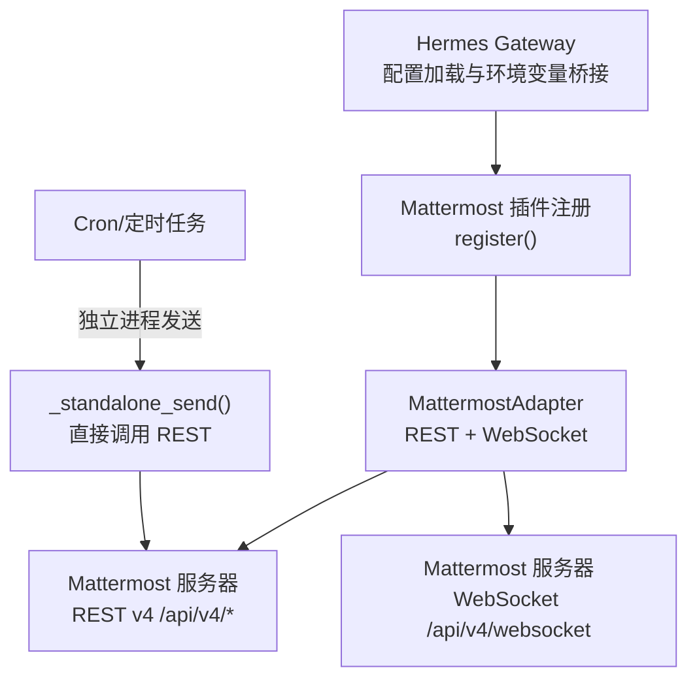
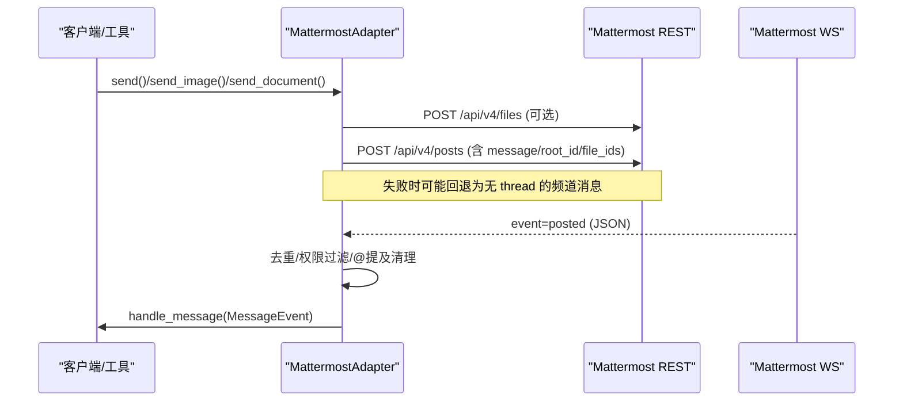
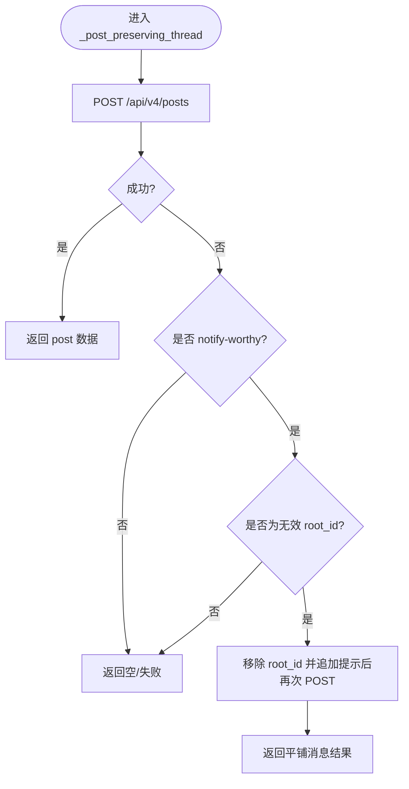
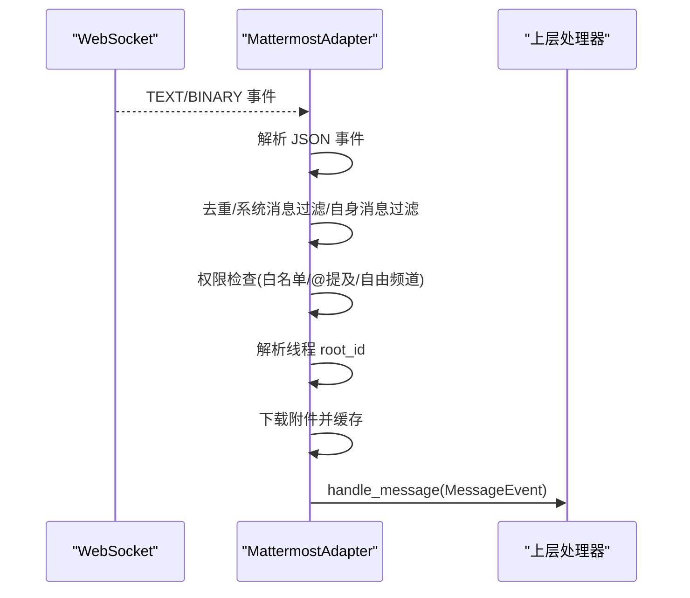
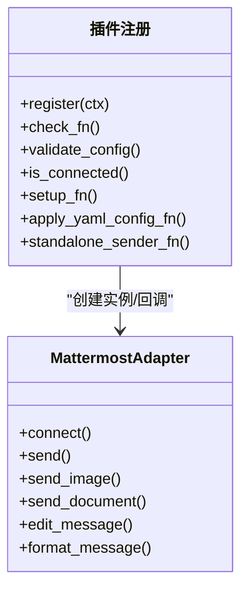
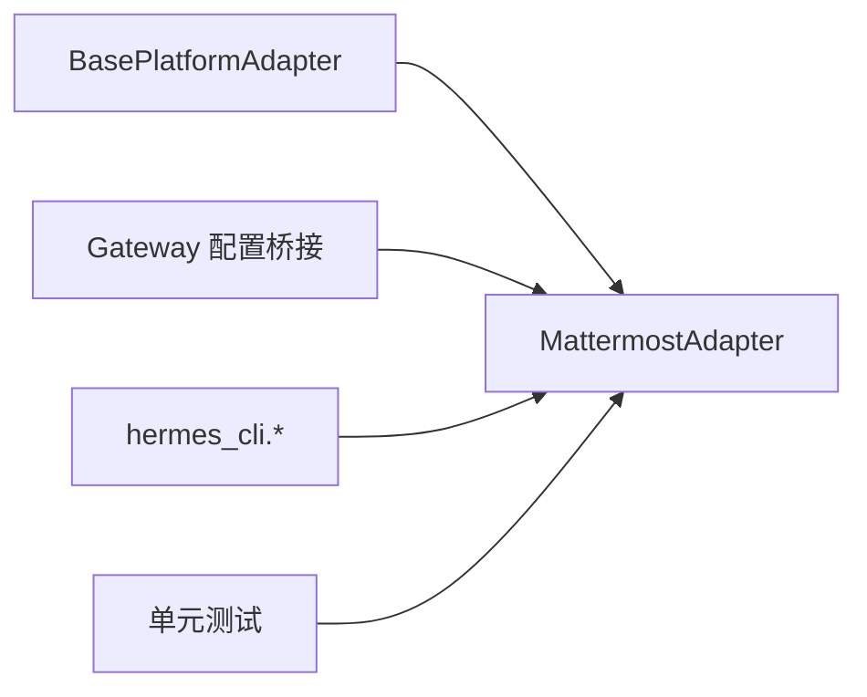

# Mattermost 平台适配器

<cite>
**本文引用的文件**
- [adapter.py](file://plugins/platforms/mattermost/adapter.py)
- [__init__.py](file://plugins/platforms/mattermost/__init__.py)
- [plugin.yaml](file://plugins/platforms/mattermost/plugin.yaml)
- [test_mattermost.py](file://tests/gateway/test_mattermost.py)
- [test_mattermost_plugin_setup.py](file://tests/gateway/test_mattermost_plugin_setup.py)
- [config.py](file://gateway/config.py)
</cite>

## 目录
1. [简介](#简介)
2. [项目结构](#项目结构)
3. [核心组件](#核心组件)
4. [架构总览](#架构总览)
5. [详细组件分析](#详细组件分析)
6. [依赖关系分析](#依赖关系分析)
7. [性能与可靠性](#性能与可靠性)
8. [故障排除指南](#故障排除指南)
9. [结论](#结论)
10. [附录：配置与集成示例](#附录配置与集成示例)

## 简介
本文件面向在 Hermes Agent 中接入 Mattermost 平台的开发者，系统性说明如何通过 REST API 与 WebSocket 实现消息收发、线程回复、文件附件、频道权限控制、@提及响应、以及插件化注册与交互式配置。文档同时覆盖安全要点（令牌认证、传输加密）、与 Hermes Gateway 的集成点（通道到会话映射、定时任务投递），并提供常见问题定位与优化建议。

## 项目结构
Mattermost 适配以插件形式提供，核心代码位于 plugins/platforms/mattermost 目录，测试位于 tests/gateway，Gateway 侧的环境变量桥接在 gateway/config.py 中完成。

图表来源
- [config.py:2026-2042](file://gateway/config.py#L2026-L2042)
- [adapter.py:1289-1328](file://plugins/platforms/mattermost/adapter.py#L1289-L1328)
- [adapter.py:1012-1145](file://plugins/platforms/mattermost/adapter.py#L1012-L1145)

章节来源
- [config.py:2026-2042](file://gateway/config.py#L2026-L2042)
- [adapter.py:1289-1328](file://plugins/platforms/mattermost/adapter.py#L1289-L1328)
- [adapter.py:1012-1145](file://plugins/platforms/mattermost/adapter.py#L1012-L1145)

## 核心组件
- MattermostAdapter：实现 BasePlatformAdapter，封装 REST 调用、WebSocket 监听、消息格式化、线程处理、文件上传与批量图片发送。
- 插件注册：通过 register() 暴露平台能力、校验函数、交互式安装向导、YAML→环境变量桥接、独立进程发送器、最大消息长度等元数据。
- 环境变量与配置桥接：Gateway 将 MATTERMOST_* 环境变量注入 PlatformConfig；插件内部通过 os.getenv 读取运行时开关。
- 独立发送器：_standalone_send() 用于 cron 等非网关进程直接调用 REST 发送消息与附件。

章节来源
- [adapter.py:113-148](file://plugins/platforms/mattermost/adapter.py#L113-L148)
- [adapter.py:1289-1328](file://plugins/platforms/mattermost/adapter.py#L1289-L1328)
- [config.py:2026-2042](file://gateway/config.py#L2026-L2042)

## 架构总览
Mattermost 适配器通过 aiohttp 与 Mattermost 实例通信：
- REST：使用 Bearer Token 认证，访问 /api/v4/posts、/api/v4/files 等端点。
- WebSocket：连接 /api/v4/websocket，发送 authentication_challenge 进行鉴权，持续消费 posted 事件并转换为 MessageEvent 交由上层处理。
- 线程支持：根据 reply_mode 与 root_id 解析，必要时回退为频道内平铺消息以避免通知丢失。
- 权限控制：支持白名单频道、自由响应频道、@提及要求等策略。
- 文件处理：下载 URL 或本地文件后上传至 Mattermost，再作为附件发布；接收端按 MIME 类型缓存为图片/音频/文档。

图表来源
- [adapter.py:384-414](file://plugins/platforms/mattermost/adapter.py#L384-L414)
- [adapter.py:532-594](file://plugins/platforms/mattermost/adapter.py#L532-L594)
- [adapter.py:738-809](file://plugins/platforms/mattermost/adapter.py#L738-L809)
- [adapter.py:811-1002](file://plugins/platforms/mattermost/adapter.py#L811-L1002)

## 详细组件分析

### REST API 集成
- 认证与请求头：统一通过 Authorization: Bearer {token} 传递令牌。
- 关键端点：
  - GET /api/v4/users/me：验证凭据并获取机器人身份。
  - POST /api/v4/posts：发送文本或带附件的消息，支持 root_id 线程。
  - PUT /api/v4/posts/{id}/patch：编辑已发消息。
  - POST /api/v4/files：上传文件并返回 file_infos，取 id 用于附件。
  - GET /api/v4/files/{id}/info：获取附件元信息（名称、MIME）。
  - GET /api/v4/files/{id}：下载附件二进制流。
- 错误与限流：对 4xx/5xx 记录状态与响应体片段；对 429/5xx 在下载路径做重试；网络异常捕获并记录。

图表来源
- [adapter.py:231-257](file://plugins/platforms/mattermost/adapter.py#L231-L257)

章节来源
- [adapter.py:153-203](file://plugins/platforms/mattermost/adapter.py#L153-L203)
- [adapter.py:231-257](file://plugins/platforms/mattermost/adapter.py#L231-L257)
- [adapter.py:281-304](file://plugins/platforms/mattermost/adapter.py#L281-L304)
- [adapter.py:439-450](file://plugins/platforms/mattermost/adapter.py#L439-L450)

### WebSocket 实时通信
- 连接与鉴权：构造 wss/ws URL，连接 /api/v4/websocket，发送 authentication_challenge 携带 token。
- 事件处理：仅处理 event=posted，解析 double-encoded post JSON，忽略系统消息与自身消息。
- 权限与路由：
  - 允许频道白名单（allowed_channels）优先于其他规则。
  - 非 DM 频道默认需要 @提及，可通过 free_response_channels 豁免。
  - 自动剥离 @bot 提及，避免污染用户输入。
- 线程映射：DM 使用 user_id 标识；频道模式下若开启 thread 模式，顶级帖子可作为根线程 ID。
- 媒体处理：根据 file_ids 下载并缓存为图片/音频/文档，设置 media_types 为完整 MIME。

图表来源
- [adapter.py:738-809](file://plugins/platforms/mattermost/adapter.py#L738-L809)
- [adapter.py:811-1002](file://plugins/platforms/mattermost/adapter.py#L811-L1002)

章节来源
- [adapter.py:738-809](file://plugins/platforms/mattermost/adapter.py#L738-L809)
- [adapter.py:811-1002](file://plugins/platforms/mattermost/adapter.py#L811-L1002)

### 插件系统与配置桥接
- 插件注册：register() 向平台注册 Mattermost，声明 required_env、setup_fn、apply_yaml_config_fn、cron_deliver_env_var、standalone_sender_fn、max_message_length 等。
- YAML→环境变量：_apply_yaml_config 将 config.yaml 中的 mattermost 字段翻译为 MATTERMOST_* 环境变量，供适配器运行时读取。
- 交互式安装：interactive_setup() 引导用户填写服务器地址、Bot 令牌、允许用户列表与 Home Channel，并持久化到环境。
- Cron 投递：通过 standalone_sender_fn 在非网关进程中直接调用 REST 发送消息与附件。

图表来源
- [adapter.py:1289-1328](file://plugins/platforms/mattermost/adapter.py#L1289-L1328)
- [adapter.py:1153-1215](file://plugins/platforms/mattermost/adapter.py#L1153-L1215)
- [adapter.py:1222-1255](file://plugins/platforms/mattermost/adapter.py#L1222-L1255)
- [adapter.py:1012-1145](file://plugins/platforms/mattermost/adapter.py#L1012-L1145)

章节来源
- [adapter.py:1289-1328](file://plugins/platforms/mattermost/adapter.py#L1289-L1328)
- [adapter.py:1153-1215](file://plugins/platforms/mattermost/adapter.py#L1153-L1215)
- [adapter.py:1222-1255](file://plugins/platforms/mattermost/adapter.py#L1222-L1255)
- [adapter.py:1012-1145](file://plugins/platforms/mattermost/adapter.py#L1012-L1145)

### 团队与工作空间管理
- 频道组织：通过 channel_id 区分 DM/群组/公开频道；get_chat_info 可获取显示名与类型。
- 用户权限：
  - 允许用户白名单：MATTERMOST_ALLOWED_USERS。
  - 允许所有用户（开发用）：MATTERMOST_ALLOW_ALL_USERS。
  - 频道白名单：MATTERMOST_ALLOWED_CHANNELS（严格限制响应范围）。
  - 自由响应频道：MATTERMOST_FREE_RESPONSE_CHANNELS（无需 @提及）。
  - 必须 @提及：MATTERMOST_REQUIRE_MENTION（默认 true）。
- 角色分配：适配器不直接操作角色，但可通过频道白名单与 @提及策略实现细粒度访问控制。
- 消息线程：
  - 支持 thread 模式：reply_to 或 metadata.thread_id 解析为 root_id。
  - 当 root_id 无效且为通知类消息时，自动回退为频道内平铺消息，确保最终答案可见。

章节来源
- [adapter.py:846-903](file://plugins/platforms/mattermost/adapter.py#L846-L903)
- [adapter.py:205-257](file://plugins/platforms/mattermost/adapter.py#L205-L257)
- [adapter.py:368-382](file://plugins/platforms/mattermost/adapter.py#L368-L382)

### 消息格式化处理
- Markdown：Mattermost 原生支持标准 Markdown，适配器基本透传。
- 富文本与代码块：保持原样渲染。
- 图片处理：将  转为纯链接，由 Mattermost 自动预览；或通过 send_image/send_document 上传附件。
- 长消息分片：超过 MAX_POST_LENGTH（4000）的消息会被切分为多条发送。

章节来源
- [adapter.py:518-526](file://plugins/platforms/mattermost/adapter.py#L518-L526)
- [adapter.py:384-414](file://plugins/platforms/mattermost/adapter.py#L384-L414)

### 安全考虑
- 认证：使用 Bearer Token 进行 REST 与 WebSocket 鉴权。
- 传输加密：通过 https/wss 与服务器通信。
- 防 SSRF：下载 URL 前进行安全检查，非法 URL 降级为文本发送。
- 路径遍历防护：REST 路径拼接前检测 “..” 并拒绝。
- 敏感信息：日志中对错误响应截断输出，避免泄露敏感内容。

章节来源
- [adapter.py:153-203](file://plugins/platforms/mattermost/adapter.py#L153-L203)
- [adapter.py:532-594](file://plugins/platforms/mattermost/adapter.py#L532-L594)

## 依赖关系分析
- 外部依赖：aiohttp（HTTP 客户端与 WebSocket）。
- 内部依赖：
  - gateway.platforms.base：基础适配器接口、消息类型、媒体缓存工具。
  - gateway.config：平台枚举、环境变量桥接。
  - hermes_cli.*：交互式安装与环境值读写。
- 插件入口：__init__.py 暴露 register，供插件系统发现。

图表来源
- [adapter.py:113-148](file://plugins/platforms/mattermost/adapter.py#L113-L148)
- [__init__.py:1-4](file://plugins/platforms/mattermost/__init__.py#L1-L4)
- [config.py:2026-2042](file://gateway/config.py#L2026-L2042)

章节来源
- [adapter.py:113-148](file://plugins/platforms/mattermost/adapter.py#L113-L148)
- [__init__.py:1-4](file://plugins/platforms/mattermost/__init__.py#L1-L4)
- [config.py:2026-2042](file://gateway/config.py#L2026-L2042)

## 性能与可靠性
- 连接与重连：WebSocket 采用指数退避与抖动重连；对 401/403 等永久错误停止重连。
- 消息分片：长消息按 4000 字符切分，避免服务端限制。
- 批量图片：每批最多 5 个附件（Mattermost 限制），超量分批发送。
- 下载重试：对 429/5xx 与超时进行有限次重试，失败时降级为文本发送。
- 线程回退：当 root_id 无效且为通知类消息时，自动回退为频道内消息，保证可达性。

章节来源
- [adapter.py:738-770](file://plugins/platforms/mattermost/adapter.py#L738-L770)
- [adapter.py:637-733](file://plugins/platforms/mattermost/adapter.py#L637-L733)
- [adapter.py:532-594](file://plugins/platforms/mattermost/adapter.py#L532-L594)
- [adapter.py:231-257](file://plugins/platforms/mattermost/adapter.py#L231-L257)

## 故障排除指南
- API 限流：
  - 现象：下载或发帖出现 429。
  - 处理：适配器在下载路径对 429/5xx 进行重试；如仍失败则降级为文本发送。
- 连接断开：
  - 现象：WebSocket 断开。
  - 处理：自动指数退避重连；遇到 401/403 等永久错误不再重连。
- 消息丢失：
  - 现象：线程 root_id 无效导致无法嵌套。
  - 处理：通知类消息自动回退为频道内平铺消息，附带提示。
- 权限问题：
  - 现象：频道未响应或忽略消息。
  - 处理：检查 allowed_channels、require_mention、free_response_channels 配置是否正确。
- 认证失败：
  - 现象：无法获取 users/me 或 WS 鉴权失败。
  - 处理：确认 MATTERMOST_TOKEN 与 MATTERMOST_URL 正确，且网络可达。

章节来源
- [adapter.py:532-594](file://plugins/platforms/mattermost/adapter.py#L532-L594)
- [adapter.py:738-770](file://plugins/platforms/mattermost/adapter.py#L738-L770)
- [adapter.py:231-257](file://plugins/platforms/mattermost/adapter.py#L231-L257)
- [adapter.py:846-903](file://plugins/platforms/mattermost/adapter.py#L846-L903)
- [adapter.py:310-342](file://plugins/platforms/mattermost/adapter.py#L310-L342)

## 结论
Mattermost 适配器通过 REST 与 WebSocket 实现了高可靠的消息收发、线程处理、文件附件与权限控制，并以插件方式无缝融入 Hermes 生态。其设计兼顾了安全性、可扩展性与容错能力，适合在生产环境中稳定运行。

## 附录：配置与集成示例
- 环境变量
  - 必需：MATTERMOST_URL、MATTERMOST_TOKEN
  - 可选：MATTERMOST_ALLOWED_USERS、MATTERMOST_ALLOW_ALL_USERS、MATTERMOST_HOME_CHANNEL、MATTERMOST_REPLY_MODE、MATTERMOST_REQUIRE_MENTION、MATTERMOST_FREE_RESPONSE_CHANNELS、MATTERMOST_ALLOWED_CHANNELS
- 交互式安装
  - 运行插件提供的 interactive_setup()，按提示填写服务器地址、Bot 令牌、允许用户与 Home Channel。
- Cron 投递
  - 通过 standalone_sender_fn 在非网关进程中直接调用 REST 发送消息与附件。
- 频道到会话映射
  - DM：以 user_id 标识；频道：以 channel_id 标识，并在 thread 模式下以 root_id 建立会话上下文。
- 测试参考
  - 发送、线程、WebSocket 事件解析、权限与媒体类型等行为均有单测覆盖，便于回归验证。

章节来源
- [plugin.yaml:1-50](file://plugins/platforms/mattermost/plugin.yaml#L1-L50)
- [adapter.py:1153-1215](file://plugins/platforms/mattermost/adapter.py#L1153-L1215)
- [adapter.py:1012-1145](file://plugins/platforms/mattermost/adapter.py#L1012-L1145)
- [test_mattermost.py:16-24](file://tests/gateway/test_mattermost.py#L16-L24)
- [test_mattermost.py:101-128](file://tests/gateway/test_mattermost.py#L101-L128)
- [test_mattermost.py:134-263](file://tests/gateway/test_mattermost.py#L134-L263)
- [test_mattermost.py:269-349](file://tests/gateway/test_mattermost.py#L269-L349)
- [test_mattermost.py:355-395](file://tests/gateway/test_mattermost.py#L355-L395)
- [test_mattermost.py:401-463](file://tests/gateway/test_mattermost.py#L401-L463)
- [test_mattermost.py:517-563](file://tests/gateway/test_mattermost.py#L517-L563)
- [test_mattermost.py:566-597](file://tests/gateway/test_mattermost.py#L566-L597)
- [test_mattermost_plugin_setup.py:36-53](file://tests/gateway/test_mattermost_plugin_setup.py#L36-L53)
- [config.py:2026-2042](file://gateway/config.py#L2026-L2042)