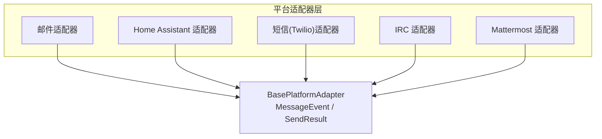
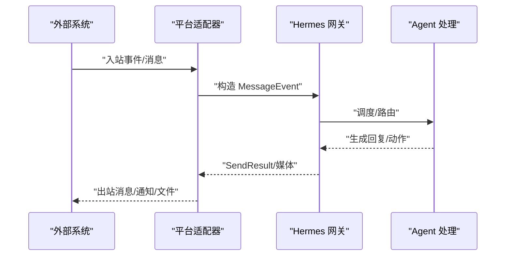
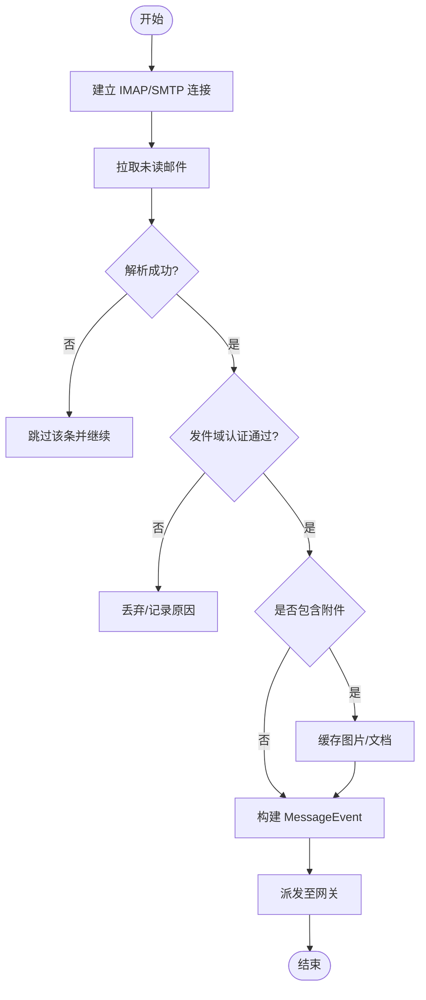
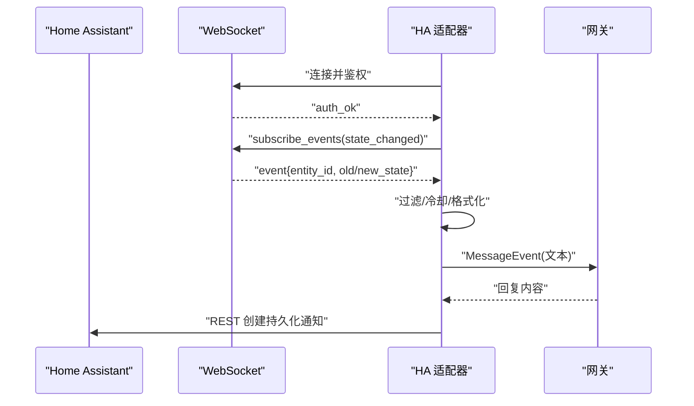
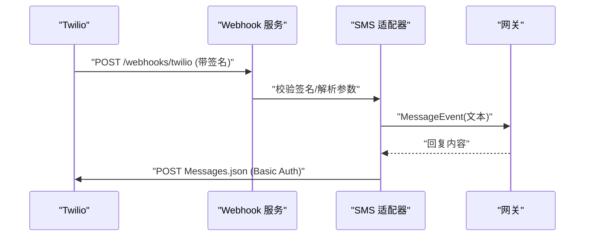
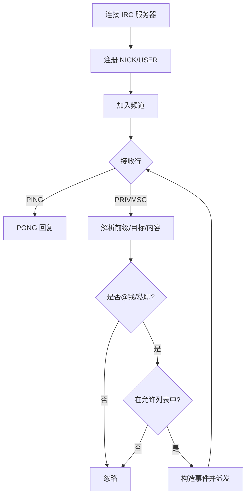
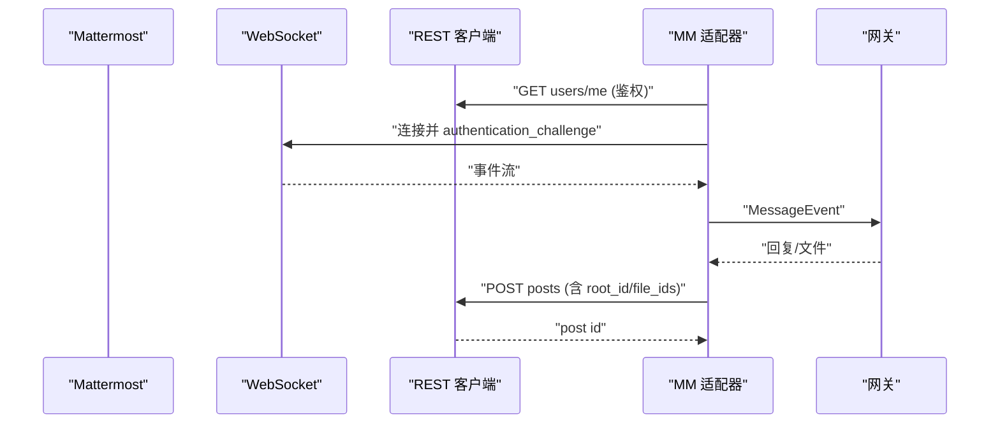
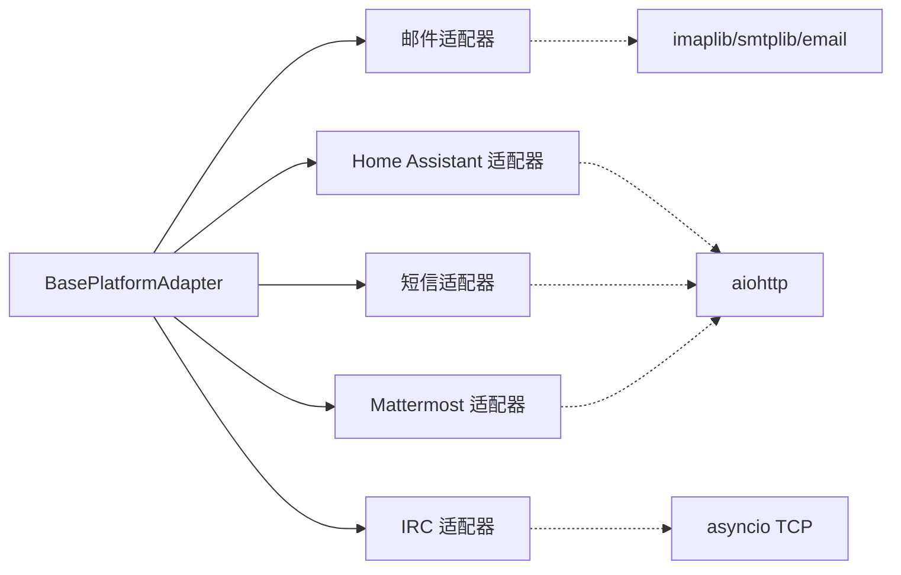

# 专业领域平台适配器

<cite>
**本文引用的文件**
- [gateway/platforms/base.py](file://gateway/platforms/base.py)
- [plugins/platforms/email/adapter.py](file://plugins/platforms/email/adapter.py)
- [plugins/platforms/homeassistant/adapter.py](file://plugins/platforms/homeassistant/adapter.py)
- [plugins/platforms/sms/adapter.py](file://plugins/platforms/sms/adapter.py)
- [plugins/platforms/irc/adapter.py](file://plugins/platforms/irc/adapter.py)
- [plugins/platforms/mattermost/adapter.py](file://plugins/platforms/mattermost/adapter.py)
</cite>

## 目录
1. [简介](#简介)
2. [项目结构](#项目结构)
3. [核心组件](#核心组件)
4. [架构总览](#架构总览)
5. [详细组件分析](#详细组件分析)
6. [依赖关系分析](#依赖关系分析)
7. [性能考虑](#性能考虑)
8. [故障排查指南](#故障排查指南)
9. [结论](#结论)
10. [附录](#附录)

## 简介
本指南面向需要在 Hermes 网关中接入“邮件系统、智能家居（Home Assistant）、短信服务、IRC 协议与专业聊天平台（Mattermost）”的开发者。文档聚焦各领域的协议差异与业务适配要点，包括：
- 邮件：IMAP 收信、SMTP 发信、附件处理、发送者认证（SPF/DKIM/DMARC）。
- 智能家居：Home Assistant WebSocket 事件订阅、设备状态变更到消息事件转换、冷却防抖。
- 短信：Twilio REST API 收发、Webhook 签名校验、号码白名单。
- IRC：原生 TCP 协议实现、命令解析、频道/私聊路由、昵称冲突与限流。
- Mattermost：REST + WebSocket 双通道、线程回复、文件上传与批量图片、重连退避。

同时涵盖安全（加密传输、身份验证、访问控制）、与其他系统集成方式、数据同步机制、测试策略与部署注意事项。

## 项目结构
Hermes 通过统一的平台适配器抽象，将不同通信渠道标准化为 MessageEvent/SendResult，便于上层 Agent 统一处理。关键位置：
- 基础接口与通用能力：gateway/platforms/base.py
- 各平台适配器：plugins/platforms/{email, homeassistant, sms, irc, mattermost}/adapter.py

图表来源
- [gateway/platforms/base.py:1-120](file://gateway/platforms/base.py#L1-L120)
- [plugins/platforms/email/adapter.py:467-532](file://plugins/platforms/email/adapter.py#L467-L532)
- [plugins/platforms/homeassistant/adapter.py:77-117](file://plugins/platforms/homeassistant/adapter.py#L77-L117)
- [plugins/platforms/sms/adapter.py:81-117](file://plugins/platforms/sms/adapter.py#L81-L117)
- [plugins/platforms/irc/adapter.py:119-172](file://plugins/platforms/irc/adapter.py#L119-L172)
- [plugins/platforms/mattermost/adapter.py:113-148](file://plugins/platforms/mattermost/adapter.py#L113-L148)

章节来源
- [gateway/platforms/base.py:1-120](file://gateway/platforms/base.py#L1-L120)

## 核心组件
- BasePlatformAdapter：定义 connect/disconnect/send/get_chat_info 等统一接口，提供消息格式化、截断、媒体处理、代理配置、入站媒体大小限制等通用能力。
- 各平台适配器：继承基类，实现特定协议的连接、鉴权、事件监听、消息路由与发送。

章节来源
- [gateway/platforms/base.py:1-120](file://gateway/platforms/base.py#L1-L120)

## 架构总览
下图展示从外部系统到 Hermes 网关的消息流转与回写路径，覆盖 IMAP/SMTP、HA WebSocket、Twilio Webhook/REST、IRC TCP、Mattermost REST+WS。

图表来源
- [plugins/platforms/email/adapter.py:676-791](file://plugins/platforms/email/adapter.py#L676-L791)
- [plugins/platforms/homeassistant/adapter.py:243-344](file://plugins/platforms/homeassistant/adapter.py#L243-L344)
- [plugins/platforms/sms/adapter.py:322-422](file://plugins/platforms/sms/adapter.py#L322-L422)
- [plugins/platforms/irc/adapter.py:391-534](file://plugins/platforms/irc/adapter.py#L391-L534)
- [plugins/platforms/mattermost/adapter.py:738-800](file://plugins/platforms/mattermost/adapter.py#L738-L800)

## 详细组件分析

### 邮件适配器（IMAP/SMTP）
- 协议与流程
  - IMAP 轮询收件箱，过滤自动/无回复发件人，提取正文与附件，基于 Authentication-Results 进行 SPF/DKIM/DMARC 校验。
  - SMTP 发送支持端口 465（隐式 TLS）与 STARTTLS，具备 IPv4 回退连接逻辑。
- 安全与访问控制
  - 默认要求发件域通过 DMARC/SPF/DKIM 认证；可配置是否信任 From 头或指定 authserv-id。
  - 支持允许列表/全局允许开关，避免仅凭 From 头导致的伪造风险。
- 附件与模板
  - 图片与文档分别缓存至本地，支持跳过附件以降低带宽与恶意载荷风险。
  - 文本体优先 text/plain，其次 text/html 并剥离标签。
- 性能与健壮性
  - 已见 UID 集合上限裁剪，避免内存增长；IMAP ID 兼容部分服务器；异常时不中断批次处理。

图表来源
- [plugins/platforms/email/adapter.py:676-791](file://plugins/platforms/email/adapter.py#L676-L791)
- [plugins/platforms/email/adapter.py:327-404](file://plugins/platforms/email/adapter.py#L327-L404)
- [plugins/platforms/email/adapter.py:554-662](file://plugins/platforms/email/adapter.py#L554-L662)

章节来源
- [plugins/platforms/email/adapter.py:467-800](file://plugins/platforms/email/adapter.py#L467-L800)

### Home Assistant 适配器（WebSocket 事件）
- 协议与流程
  - 通过 aiohttp 连接 HA WebSocket，完成认证后订阅 state_changed 事件。
  - 对事件按 domain/entity 过滤与冷却去抖，转换为人类可读消息并转发。
- 出站消息
  - 使用 REST API 创建持久化通知，避免与事件读取共用 WS 的连接竞争。
- 重连与容错
  - 指数退避重连，断开后清理资源；未配置过滤器时发出告警。

图表来源
- [plugins/platforms/homeassistant/adapter.py:127-211](file://plugins/platforms/homeassistant/adapter.py#L127-L211)
- [plugins/platforms/homeassistant/adapter.py:243-344](file://plugins/platforms/homeassistant/adapter.py#L243-L344)
- [plugins/platforms/homeassistant/adapter.py:412-464](file://plugins/platforms/homeassistant/adapter.py#L412-L464)

章节来源
- [plugins/platforms/homeassistant/adapter.py:77-475](file://plugins/platforms/homeassistant/adapter.py#L77-L475)

### 短信适配器（Twilio）
- 协议与流程
  - 启动 aiohttp 内置 Web 服务接收 Twilio Webhook，校验 HMAC 签名，解析表单参数，构造 MessageEvent。
  - 出站通过 Twilio REST API 发送，支持长消息分片与 Basic Auth。
- 安全与访问控制
  - 强制签名校验（开发模式可关闭但警告），支持号码白名单与全局允许开关。
  - 请求体大小限制，防止超大负载。
- 独立发送
  - 提供 standalone_sender_fn，供 cron 等非网关进程直接调用 Twilio API。

图表来源
- [plugins/platforms/sms/adapter.py:114-169](file://plugins/platforms/sms/adapter.py#L114-L169)
- [plugins/platforms/sms/adapter.py:252-316](file://plugins/platforms/sms/adapter.py#L252-L316)
- [plugins/platforms/sms/adapter.py:322-422](file://plugins/platforms/sms/adapter.py#L322-L422)
- [plugins/platforms/sms/adapter.py:181-235](file://plugins/platforms/sms/adapter.py#L181-L235)

章节来源
- [plugins/platforms/sms/adapter.py:81-537](file://plugins/platforms/sms/adapter.py#L81-L537)

### IRC 适配器（TCP/协议）
- 协议与流程
  - 使用 asyncio 原生 TCP 连接，实现 PASS/NICK/USER/JOIN/PRIVMSG/PING-PONG 等命令。
  - 解析前缀、命令与参数，区分频道与私聊，支持 @提及/@, 触发响应。
- 安全与访问控制
  - 可选 NickServ 识别、服务器密码；支持允许的昵称白名单（大小写不敏感）。
  - 剥离控制字符，防止注入 IRC 命令。
- 发送与限流
  - 按行拆分消息，遵守 IRC 行长度限制；发送间隔限流避免洪水。

图表来源
- [plugins/platforms/irc/adapter.py:179-244](file://plugins/platforms/irc/adapter.py#L179-L244)
- [plugins/platforms/irc/adapter.py:391-534](file://plugins/platforms/irc/adapter.py#L391-L534)
- [plugins/platforms/irc/adapter.py:282-360](file://plugins/platforms/irc/adapter.py#L282-L360)

章节来源
- [plugins/platforms/irc/adapter.py:119-800](file://plugins/platforms/irc/adapter.py#L119-L800)

### Mattermost 适配器（REST + WebSocket）
- 协议与流程
  - REST v4 用于认证、发帖、文件上传；WebSocket 用于实时事件监听。
  - 支持线程回复（root_id 解析）、编辑消息、多图片批量上传（每帖最多 5 个文件）。
- 安全与访问控制
  - Bearer Token 鉴权；禁止路径穿越；URL 安全校验防止 SSRF。
  - 禁用提及以减少噪音。
- 重连与降级
  - 指数退避重连；当线程根无效时降级为频道内平铺消息。

图表来源
- [plugins/platforms/mattermost/adapter.py:310-342](file://plugins/platforms/mattermost/adapter.py#L310-L342)
- [plugins/platforms/mattermost/adapter.py:384-414](file://plugins/platforms/mattermost/adapter.py#L384-L414)
- [plugins/platforms/mattermost/adapter.py:532-635](file://plugins/platforms/mattermost/adapter.py#L532-L635)
- [plugins/platforms/mattermost/adapter.py:738-800](file://plugins/platforms/mattermost/adapter.py#L738-L800)

章节来源
- [plugins/platforms/mattermost/adapter.py:113-800](file://plugins/platforms/mattermost/adapter.py#L113-L800)

## 依赖关系分析
- 共同依赖
  - aiohttp：Home Assistant、短信、Mattermost 均使用其进行 HTTP/WebSocket 通信。
  - 标准库：邮件使用 imaplib/smtplib/email；IRC 使用 asyncio 原生 TCP。
- 耦合点
  - 所有适配器均依赖 BasePlatformAdapter 提供的统一接口与工具函数（如代理、媒体限制、消息截断）。
  - 插件注册入口通过 register(ctx) 暴露给平台注册表，支持 required_env、is_connected、standalone_sender_fn 等元信息。

图表来源
- [gateway/platforms/base.py:1-120](file://gateway/platforms/base.py#L1-L120)
- [plugins/platforms/email/adapter.py:467-532](file://plugins/platforms/email/adapter.py#L467-L532)
- [plugins/platforms/homeassistant/adapter.py:77-117](file://plugins/platforms/homeassistant/adapter.py#L77-L117)
- [plugins/platforms/sms/adapter.py:81-117](file://plugins/platforms/sms/adapter.py#L81-L117)
- [plugins/platforms/irc/adapter.py:119-172](file://plugins/platforms/irc/adapter.py#L119-L172)
- [plugins/platforms/mattermost/adapter.py:113-148](file://plugins/platforms/mattermost/adapter.py#L113-L148)

章节来源
- [gateway/platforms/base.py:1-120](file://gateway/platforms/base.py#L1-L120)

## 性能考虑
- 邮件
  - IMAP 批量 UNSEEN 查询与已见 UID 集合裁剪，避免重复处理与内存膨胀。
  - SMTP 连接失败时尝试 IPv4 回退，减少 IPv6 不可达导致的超时。
- Home Assistant
  - 事件冷却（cooldown_seconds）与实体过滤，降低高频传感器风暴。
- 短信
  - Webhook 最大负载限制与快速返回空 TwiML，保证高吞吐。
  - 长消息分片发送，避免单条过大。
- IRC
  - 行长度拆分与发送间隔限流，避免被网络拒绝或封禁。
- Mattermost
  - 批量图片上传（每帖最多 5 个文件），减少多次发帖开销。
  - 指数退避重连与抖动，降低瞬时风暴。

[本节为通用指导，无需具体文件引用]

## 故障排查指南
- 邮件
  - 检查 EMAIL_* 环境变量与 config.yaml 中的 host/port/address/password 是否完整。
  - 若出现“Unsafe Login”，确认已发送 IMAP ID 命令；必要时调整 authserv-id。
  - 发件域认证失败时，查看 Authentication-Results 是否存在且匹配。
- Home Assistant
  - 确认 HASS_TOKEN 有效且 URL 可达；未配置 watch_domains/entities/watch_all 会丢弃事件。
  - 重连失败时观察日志中的 backoff 与错误类型。
- 短信
  - 确保 SMS_WEBHOOK_URL 正确并在 Twilio 控制台配置；生产环境务必开启签名校验。
  - 若收到 413/403，检查请求体大小与签名。
- IRC
  - 连接超时或注册超时，检查服务器地址、端口、TLS 与密码。
  - 昵称冲突会自动追加后缀重试；频道需先 JOIN 再 PRIVMSG。
- Mattermost
  - 认证失败（401/403）不会无限重连；检查 token 与权限。
  - 线程根无效时会自动降级为频道内消息；关注 last_post_status/error。

章节来源
- [plugins/platforms/email/adapter.py:596-662](file://plugins/platforms/email/adapter.py#L596-L662)
- [plugins/platforms/homeassistant/adapter.py:127-164](file://plugins/platforms/homeassistant/adapter.py#L127-L164)
- [plugins/platforms/sms/adapter.py:114-169](file://plugins/platforms/sms/adapter.py#L114-L169)
- [plugins/platforms/irc/adapter.py:179-244](file://plugins/platforms/irc/adapter.py#L179-L244)
- [plugins/platforms/mattermost/adapter.py:310-342](file://plugins/platforms/mattermost/adapter.py#L310-L342)

## 结论
通过统一的 BasePlatformAdapter 抽象，Hermes 能够以一致的方式对接多种专业领域平台。各适配器在协议细节、安全策略与性能优化上各有侧重，但都遵循相同的消息模型与生命周期管理。建议在实际部署中：
- 严格配置凭据与环境变量，启用必要的认证与访问控制。
- 根据平台特性设置合理的过滤、冷却与限流策略。
- 利用 standalone_sender_fn 支持离线/定时任务场景。
- 结合日志与指标持续观测连接稳定性与错误率。

[本节为总结性内容，无需具体文件引用]

## 附录
- 配置与环境变量速查
  - 邮件：EMAIL_IMAP_HOST/PORT、EMAIL_SMTP_HOST/PORT、EMAIL_ADDRESS/PASSWORD、EMAIL_POLL_INTERVAL、EMAIL_ALLOWED_USERS、EMAIL_TRUST_FROM_HEADER、EMAIL_AUTHSERV_ID
  - Home Assistant：HASS_TOKEN、HASS_URL、watch_domains/entities、ignore_entities、watch_all、cooldown_seconds
  - 短信：TWILIO_ACCOUNT_SID/TWILIO_AUTH_TOKEN/TWILIO_PHONE_NUMBER、SMS_WEBHOOK_PORT/HOST/URL、SMS_INSECURE_NO_SIGNATURE、SMS_ALLOWED_USERS、SMS_ALLOW_ALL_USERS、SMS_HOME_CHANNEL
  - IRC：IRC_SERVER/PORT/NICKNAME/CHANNEL、IRC_USE_TLS、IRC_SERVER_PASSWORD、IRC_NICKSERV_PASSWORD、allowed_users
  - Mattermost：MATTERMOST_URL、MATTERMOST_TOKEN、MATTERMOST_ALLOWED_USERS、MATTERMOST_HOME_CHANNEL、reply_mode
- 测试策略
  - 单元测试：模拟 IMAP/SMTP、WebSocket、REST 响应，验证消息解析与路由。
  - 集成测试：搭建最小可用实例（HA、Mattermost、IRC 服务器、Twilio Sandbox），端到端验证收发。
  - 压力测试：高频事件（传感器风暴、群消息）下的冷却与限流效果。
- 部署注意事项
  - 网络：确保防火墙放行所需端口（IMAP/SMTP、Webhook、IRC、WS/REST）。
  - 证书：SMTP/IRC TLS 与 HTTPS/WSS 证书有效性。
  - 资源：合理设置媒体入站大小限制与并发连接数。
  - 监控：记录连接状态、错误码、重连次数与消息延迟。

[本节为补充信息，无需具体文件引用]