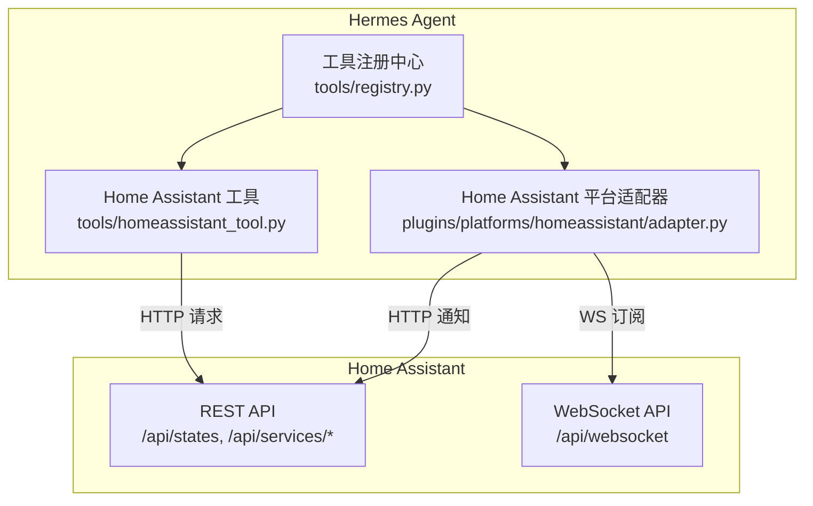
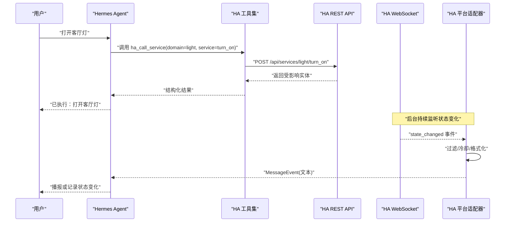
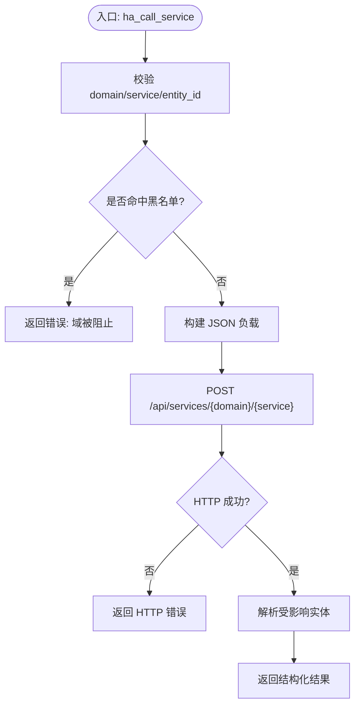
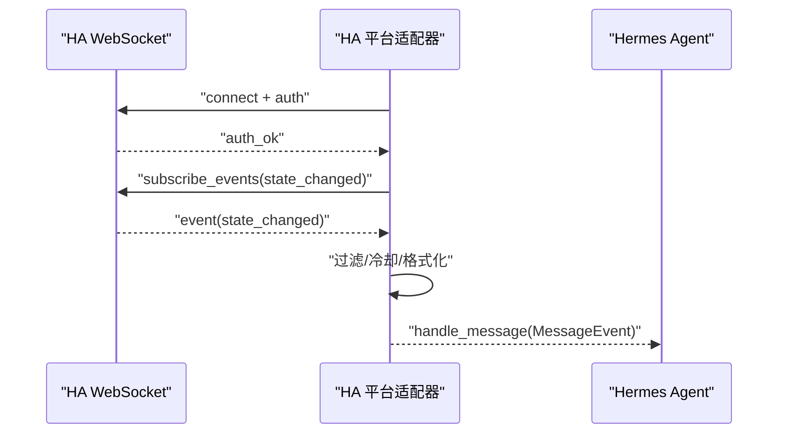
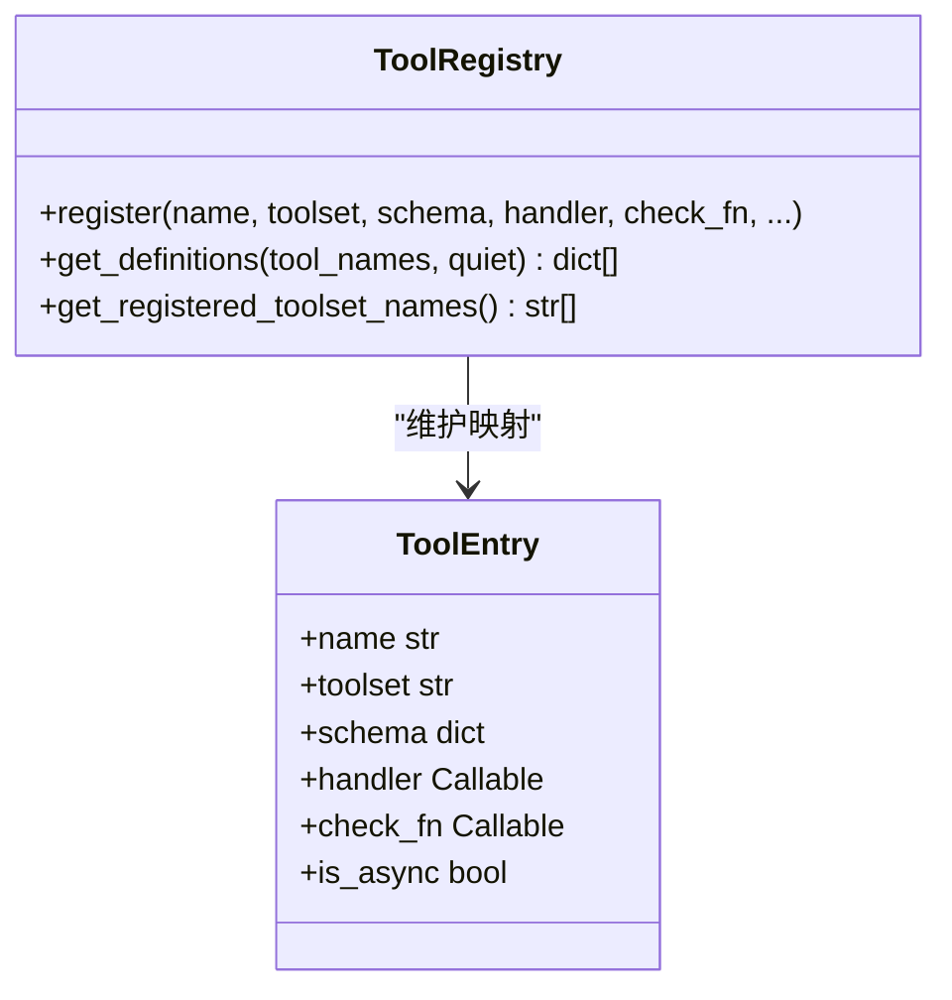
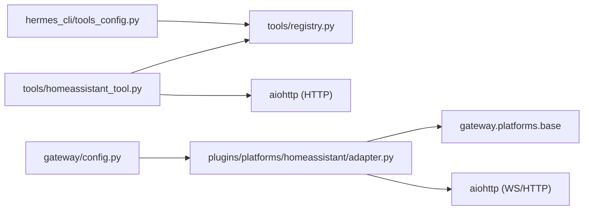

# 智能家居平台适配器

<cite>
**本文引用的文件**
- [tools/homeassistant_tool.py](file://tools/homeassistant_tool.py)
- [plugins/platforms/homeassistant/adapter.py](file://plugins/platforms/homeassistant/adapter.py)
- [tools/registry.py](file://tools/registry.py)
- [tests/tools/test_homeassistant_tool.py](file://tests/tools/test_homeassistant_tool.py)
- [gateway/config.py](file://gateway/config.py)
- [hermes_cli/tools_config.py](file://hermes_cli/tools_config.py)
- [skills/smart-home/DESCRIPTION.md](file://skills/smart-home/DESCRIPTION.md)
</cite>

## 目录
1. [简介](#简介)
2. [项目结构](#项目结构)
3. [核心组件](#核心组件)
4. [架构总览](#架构总览)
5. [详细组件分析](#详细组件分析)
6. [依赖关系分析](#依赖关系分析)
7. [性能考虑](#性能考虑)
8. [故障排查指南](#故障排查指南)
9. [结论](#结论)
10. [附录](#附录)

## 简介
本指南面向希望在 Hermes Agent 中集成 Home Assistant 的开发者，覆盖以下主题：
- 通过 REST API 控制设备（实体列表、状态查询、服务调用）
- 通过 WebSocket 监听 Home Assistant 状态变化事件并转发到 Agent
- 安全策略：访问令牌管理、域名白/黑名单、参数校验与防路径穿越
- 工具注册与发现机制，便于 LLM 自动调用
- 测试策略：设备模拟、网络异常处理与性能优化建议
- 与 Hermes Agent 的对话集成：自然语言设备控制与场景管理

## 项目结构
围绕 Home Assistant 的适配主要涉及两类代码：
- 工具层（tools/homeassistant_tool.py）：提供 ha_list_entities、ha_get_state、ha_list_services、ha_call_service 四个可被 LLM 调用的工具，基于 Home Assistant REST API。
- 平台适配器（plugins/platforms/homeassistant/adapter.py）：建立与 HA 的 WebSocket 连接，订阅 state_changed 事件，将状态变更转换为消息事件并回送到 Agent；同时支持通过 REST 发送通知。

图表来源
- [tools/homeassistant_tool.py:1-515](file://tools/homeassistant_tool.py#L1-L515)
- [plugins/platforms/homeassistant/adapter.py:1-605](file://plugins/platforms/homeassistant/adapter.py#L1-L605)
- [tools/registry.py:1-800](file://tools/registry.py#L1-L800)

章节来源
- [tools/homeassistant_tool.py:1-515](file://tools/homeassistant_tool.py#L1-L515)
- [plugins/platforms/homeassistant/adapter.py:1-605](file://plugins/platforms/homeassistant/adapter.py#L1-L605)
- [tools/registry.py:1-800](file://tools/registry.py#L1-L800)
- [skills/smart-home/DESCRIPTION.md:1-4](file://skills/smart-home/DESCRIPTION.md#L1-L4)

## 核心组件
- 工具模块（tools/homeassistant_tool.py）
  - 暴露四个工具：列出实体、获取实体状态、列出可用服务、调用服务。
  - 使用长生命周期访问令牌（HASS_TOKEN）进行认证，URL 来自 HASS_URL。
  - 对 domain/service/entity_id 做严格正则校验，并对危险域进行黑名单拦截，防止 SSRF 与命令执行风险。
- 平台适配器（plugins/platforms/homeassistant/adapter.py）
  - 通过 WebSocket 订阅 state_changed 事件，按域/实体过滤与冷却时间控制事件风暴。
  - 将事件格式化为人类可读消息，并通过 handle_message 回送到 Agent。
  - 通过 REST API 发送持久化通知作为出站消息通道。
- 工具注册中心（tools/registry.py）
  - 集中管理工具元数据、可用性检查与动态 schema 覆盖。
  - 为每个工具提供 check_fn 缓存与 TTL，避免频繁探测外部依赖导致抖动。

章节来源
- [tools/homeassistant_tool.py:1-515](file://tools/homeassistant_tool.py#L1-L515)
- [plugins/platforms/homeassistant/adapter.py:1-605](file://plugins/platforms/homeassistant/adapter.py#L1-L605)
- [tools/registry.py:1-800](file://tools/registry.py#L1-L800)

## 架构总览
下图展示从用户自然语言到设备控制的端到端流程，以及状态变更的回传路径。

图表来源
- [tools/homeassistant_tool.py:106-201](file://tools/homeassistant_tool.py#L106-L201)
- [plugins/platforms/homeassistant/adapter.py:127-211](file://plugins/platforms/homeassistant/adapter.py#L127-L211)
- [plugins/platforms/homeassistant/adapter.py:243-344](file://plugins/platforms/homeassistant/adapter.py#L243-L344)

## 详细组件分析

### 工具模块：Home Assistant REST 控制
- 功能要点
  - 列出实体：支持按域和区域过滤，返回精简摘要。
  - 获取状态：读取单个实体的完整属性与时间戳。
  - 列出服务：聚合各域的服务描述与字段说明，辅助 LLM 选择正确参数。
  - 调用服务：构造 JSON 负载并调用 /api/services/{domain}/{service}。
- 安全策略
  - entity_id 与服务名必须匹配严格正则，禁止路径穿越字符。
  - 危险域（如 shell_command、hassio、python_script 等）直接拒绝。
  - 使用 Bearer Token 认证，Token 来源于环境变量或受管密钥。
- 错误处理
  - 统一捕获异常并返回结构化错误，限制错误体长度以避免上下文膨胀。

图表来源
- [tools/homeassistant_tool.py:252-289](file://tools/homeassistant_tool.py#L252-L289)
- [tools/homeassistant_tool.py:178-201](file://tools/homeassistant_tool.py#L178-L201)

章节来源
- [tools/homeassistant_tool.py:1-515](file://tools/homeassistant_tool.py#L1-L515)
- [tests/tools/test_homeassistant_tool.py:1-382](file://tests/tools/test_homeassistant_tool.py#L1-L382)

### 平台适配器：WebSocket 事件监听与出站通知
- 连接与认证
  - 建立 WebSocket 连接到 /api/websocket，完成 auth_required → auth → auth_ok 流程。
  - 订阅 state_changed 事件，支持 watch_domains、watch_entities、ignore_entities 与 watch_all 配置。
- 事件处理
  - 应用忽略与过滤规则，按实体维度冷却，避免事件风暴。
  - 将事件格式化为人类可读消息，封装为 MessageEvent 并通过 handle_message 回送。
- 出站消息
  - 通过 REST API 调用 persistent_notification.create 发送通知，避免与事件监听共用同一 WS 连接产生竞态。
- 重连策略
  - 指数退避重连（固定步长），失败时记录日志并在运行期内持续尝试。

图表来源
- [plugins/platforms/homeassistant/adapter.py:127-211](file://plugins/platforms/homeassistant/adapter.py#L127-L211)
- [plugins/platforms/homeassistant/adapter.py:243-344](file://plugins/platforms/homeassistant/adapter.py#L243-L344)

章节来源
- [plugins/platforms/homeassistant/adapter.py:1-605](file://plugins/platforms/homeassistant/adapter.py#L1-L605)

### 工具注册与发现
- 注册方式
  - 工具模块在导入时调用 registry.register，声明名称、工具集、schema、处理器与可用性检查函数。
- 可用性检查
  - 通过 check_fn 探测外部依赖（如 HASS_TOKEN 是否存在），结果带 TTL 缓存，减少抖动。
- 动态 Schema
  - 支持运行时覆盖部分 schema 字段，确保模型看到的工具定义与实际能力一致。

图表来源
- [tools/registry.py:201-230](file://tools/registry.py#L201-L230)
- [tools/registry.py:562-644](file://tools/registry.py#L562-L644)
- [tools/registry.py:717-764](file://tools/registry.py#L717-L764)

章节来源
- [tools/registry.py:1-800](file://tools/registry.py#L1-L800)

### 配置与环境变量
- 关键配置项
  - HASS_URL：Home Assistant 实例地址（默认 http://homeassistant.local:8123）。
  - HASS_TOKEN：长生命周期访问令牌，用于 REST 与 WebSocket 认证。
- 配置加载
  - 平台适配器从 PlatformConfig.extra 与环境变量读取 URL，并从受管密钥读取 Token。
  - CLI 工具集配置中包含 homeassistant 工具集的启用逻辑与提示。

章节来源
- [plugins/platforms/homeassistant/adapter.py:91-117](file://plugins/platforms/homeassistant/adapter.py#L91-L117)
- [gateway/config.py:2081-2087](file://gateway/config.py#L2081-L2087)
- [hermes_cli/tools_config.py:660-669](file://hermes_cli/tools_config.py#L660-L669)
- [hermes_cli/tools_config.py:200-205](file://hermes_cli/tools_config.py#L200-L205)
- [hermes_cli/tools_config.py:2300-2301](file://hermes_cli/tools_config.py#L2300-L2301)

## 依赖关系分析
- 工具模块依赖 aiohttp 发起 HTTP 请求，依赖 tools.registry 进行工具注册与发现。
- 平台适配器依赖 aiohttp 建立 WebSocket 与 REST 通信，依赖 gateway.platforms.base 提供的基类与消息类型。
- 配置与 CLI 层负责注入环境变量与工具集开关。

图表来源
- [tools/homeassistant_tool.py:1-515](file://tools/homeassistant_tool.py#L1-L515)
- [plugins/platforms/homeassistant/adapter.py:1-605](file://plugins/platforms/homeassistant/adapter.py#L1-L605)
- [tools/registry.py:1-800](file://tools/registry.py#L1-L800)
- [gateway/config.py:2081-2087](file://gateway/config.py#L2081-L2087)
- [hermes_cli/tools_config.py:660-669](file://hermes_cli/tools_config.py#L660-L669)

章节来源
- [tools/homeassistant_tool.py:1-515](file://tools/homeassistant_tool.py#L1-L515)
- [plugins/platforms/homeassistant/adapter.py:1-605](file://plugins/platforms/homeassistant/adapter.py#L1-L605)
- [tools/registry.py:1-800](file://tools/registry.py#L1-L800)
- [gateway/config.py:2081-2087](file://gateway/config.py#L2081-L2087)
- [hermes_cli/tools_config.py:660-669](file://hermes_cli/tools_config.py#L660-L669)

## 性能考虑
- 事件风暴抑制
  - 适配器侧按实体维度设置冷却时间，避免高频状态变化导致消息洪泛。
- 连接与超时
  - WebSocket 与 REST 均设置合理超时，避免阻塞主循环。
- 工具可用性缓存
  - check_fn 结果带 TTL 与“最近成功”宽容窗口，降低外部依赖抖动对工具可见性的影响。
- 输出裁剪
  - 工具错误体长度受限，避免上下文过大影响模型响应质量。

[本节为通用指导，不直接分析具体文件]

## 故障排查指南
- 常见问题定位
  - 未配置 HASS_TOKEN：工具不可用，适配器无法连接。
  - 事件未到达：检查 watch_domains/watch_entities/watch_all 配置是否正确。
  - 服务调用失败：确认 domain/service 未被黑名单拦截，且参数符合 schema。
- 诊断步骤
  - 验证环境变量与受管密钥是否生效。
  - 查看适配器日志中的连接与重连信息。
  - 使用 ha_list_services 确认目标服务存在与字段说明。
- 相关测试用例
  - 工具可用性、黑名单、实体 ID 校验、JSON data 反序列化等。

章节来源
- [plugins/platforms/homeassistant/adapter.py:66-74](file://plugins/platforms/homeassistant/adapter.py#L66-L74)
- [plugins/platforms/homeassistant/adapter.py:127-164](file://plugins/platforms/homeassistant/adapter.py#L127-L164)
- [tools/homeassistant_tool.py:345-348](file://tools/homeassistant_tool.py#L345-L348)
- [tests/tools/test_homeassistant_tool.py:116-163](file://tests/tools/test_homeassistant_tool.py#L116-L163)
- [tests/tools/test_homeassistant_tool.py:236-294](file://tests/tools/test_homeassistant_tool.py#L236-L294)

## 结论
本实现通过工具层与平台适配器两层解耦，既提供了强大的设备控制能力，又实现了实时状态同步。安全方面通过严格的参数校验与黑名单策略，有效降低了远程执行与 SSRF 风险。结合工具注册中心的可用性缓存与事件冷却机制，系统在稳定性与性能上具备良好表现。建议在部署时明确配置 HASS_URL 与 HASS_TOKEN，并根据实际需求调整事件过滤与冷却策略。

[本节为总结性内容，不直接分析具体文件]

## 附录

### 开发示例与实践建议
- 设备控制工具
  - 使用 ha_list_services 发现可用服务与字段，再调用 ha_call_service 执行控制。
  - 参考路径：[工具定义与处理器:354-471](file://tools/homeassistant_tool.py#L354-L471)
- 自动化脚本
  - 在 Cron 或定时任务中通过适配器独立发送器发送通知，无需网关进程。
  - 参考路径：[独立发送器:483-551](file://plugins/platforms/homeassistant/adapter.py#L483-L551)
- 处理设备状态变化
  - 配置 watch_domains/watch_entities 与冷却时间，接收并处理 state_changed 事件。
  - 参考路径：[事件监听与处理:243-344](file://plugins/platforms/homeassistant/adapter.py#L243-L344)

### 与 Hermes Agent 的对话集成
- 自然语言设备控制
  - LLM 根据工具 schema 自动选择合适工具，调用后向用户反馈执行结果。
  - 参考路径：[工具注册与发现:717-764](file://tools/registry.py#L717-L764)
- 智能家居场景管理
  - 通过 scene 域服务切换场景，或使用 script 域执行复杂动作序列。
  - 参考路径：[服务调用 schema:428-471](file://tools/homeassistant_tool.py#L428-L471)

### 测试策略
- 设备模拟
  - 使用 mock 替换异步调用，验证参数校验与错误分支。
  - 参考路径：[单元测试:1-382](file://tests/tools/test_homeassistant_tool.py#L1-L382)
- 网络异常处理
  - 覆盖超时与 HTTP 错误分支，确保返回稳定结构化的错误信息。
  - 参考路径：[适配器发送与错误处理:412-464](file://plugins/platforms/homeassistant/adapter.py#L412-L464)
- 性能优化建议
  - 合理设置冷却时间与事件过滤，避免事件风暴。
  - 利用 check_fn 缓存减少外部依赖探测开销。

章节来源
- [tests/tools/test_homeassistant_tool.py:1-382](file://tests/tools/test_homeassistant_tool.py#L1-L382)
- [plugins/platforms/homeassistant/adapter.py:412-464](file://plugins/platforms/homeassistant/adapter.py#L412-L464)
- [tools/registry.py:233-380](file://tools/registry.py#L233-L380)