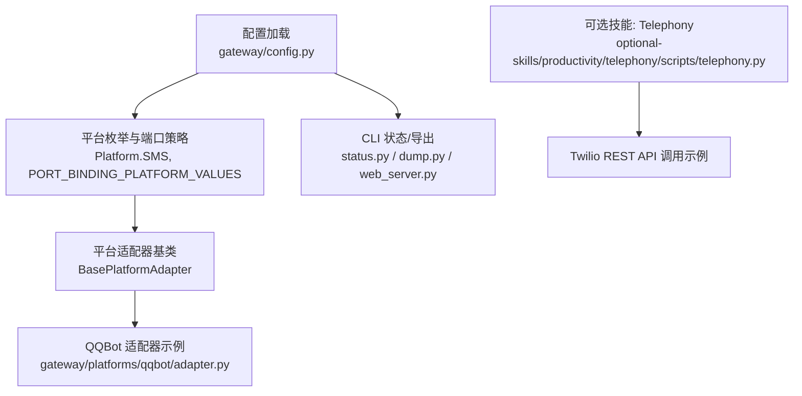
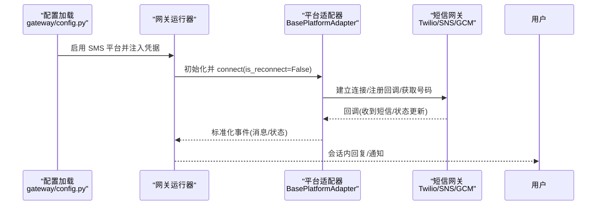
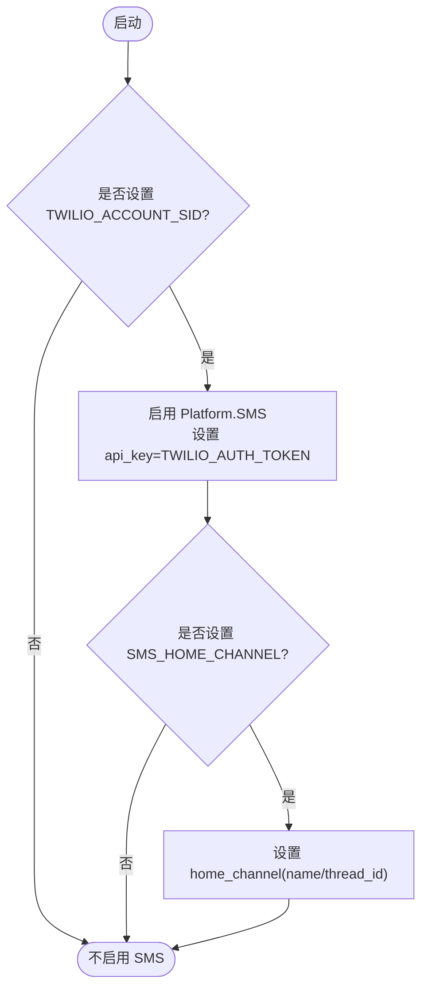
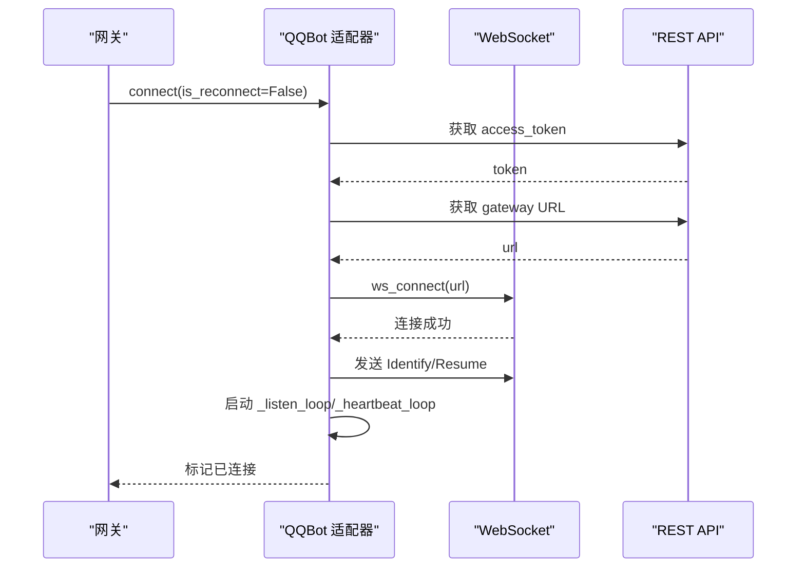
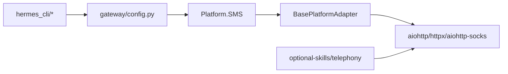

# 短信平台适配器

<cite>
**本文引用的文件**
- [gateway/config.py](file://gateway/config.py)
- [gateway/platforms/base.py](file://gateway/platforms/base.py)
- [gateway/platforms/qqbot/adapter.py](file://gateway/platforms/qqbot/adapter.py)
- [tests/gateway/test_adapter_connect_is_reconnect_contract.py](file://tests/gateway/test_adapter_connect_is_reconnect_contract.py)
- [hermes_cli/web_server.py](file://hermes_cli/web_server.py)
- [hermes_cli/status.py](file://hermes_cli/status.py)
- [hermes_cli/dump.py](file://hermes_cli/dump.py)
- [agent/prompt_builder.py](file://agent/prompt_builder.py)
- [optional-skills/productivity/telephony/scripts/telephony.py](file://optional-skills/productivity/telephony/scripts/telephony.py)
</cite>

## 目录
1. [简介](#简介)
2. [项目结构](#项目结构)
3. [核心组件](#核心组件)
4. [架构总览](#架构总览)
5. [详细组件分析](#详细组件分析)
6. [依赖关系分析](#依赖关系分析)
7. [性能考虑](#性能考虑)
8. [故障排除指南](#故障排除指南)
9. [结论](#结论)
10. [附录：配置与集成示例](#附录：配置与集成示例)

## 简介
本开发文档面向在 Hermes Agent 中接入短信平台的开发者，聚焦于 SMS 网关适配、消息发送与接收、状态跟踪、错误处理与安全策略。当前仓库已内置对 SMS（Twilio）的运行时启用与配置入口，并提供了统一的平台适配器基类与连接重连契约。对于 AWS SNS、Google Cloud Messaging 等第三方服务商，可通过扩展平台适配器或插件机制进行对接。

## 项目结构
- 平台枚举与配置加载：定义平台类型、端口绑定策略以及各平台的环境变量注入。
- 平台适配器基类：提供通用的网络代理、媒体大小限制、TTS 输出路径、安全校验等能力。
- 具体平台实现：以 QQBot 为例展示 WebSocket/HTTP 长连接、心跳、重连、鉴权与事件分发流程；SMS 通过配置开关启用，后续可在此基类上扩展 Twilio/SNS/GCM 等实现。
- CLI 与状态工具：提供环境变量提示、状态检查与导出，便于运维排障。
- 技能脚本：可选的 Telephony 技能脚本展示了如何直接调用 Twilio REST API 完成语音/短信相关操作。

**图表来源**
- [gateway/config.py:280-479](file://gateway/config.py#L280-L479)
- [gateway/platforms/base.py:1-200](file://gateway/platforms/base.py#L1-L200)
- [gateway/platforms/qqbot/adapter.py:180-370](file://gateway/platforms/qqbot/adapter.py#L180-L370)
- [hermes_cli/status.py:490-510](file://hermes_cli/status.py#L490-L510)
- [hermes_cli/dump.py:180-200](file://hermes_cli/dump.py#L180-L200)
- [hermes_cli/web_server.py:7790-7800](file://hermes_cli/web_server.py#L7790-L7800)
- [optional-skills/productivity/telephony/scripts/telephony.py:270-310](file://optional-skills/productivity/telephony/scripts/telephony.py#L270-L310)

**章节来源**
- [gateway/config.py:280-479](file://gateway/config.py#L280-L479)
- [gateway/platforms/base.py:1-200](file://gateway/platforms/base.py#L1-L200)
- [gateway/platforms/qqbot/adapter.py:180-370](file://gateway/platforms/qqbot/adapter.py#L180-L370)

## 核心组件
- 平台枚举与配置注入：
  - 定义 Platform.SMS 及 SMS 作为端口绑定平台之一，用于 webhook/listener 模式。
  - 当检测到 TWILIO_ACCOUNT_SID 时，自动启用 SMS 平台，并设置 api_key（TWILIO_AUTH_TOKEN），同时支持设置 home_channel。
- 平台适配器基类：
  - 提供通用能力：代理解析、SSRF 防护、入站媒体大小限制、TTS 输出路径生成、UTF-16 长度计算等。
  - 所有平台适配器继承该基类，确保一致的连接、重连、错误上报与资源清理行为。
- QQBot 适配器（参考实现）：
  - 展示 connect/disconnect、WebSocket 生命周期、心跳、重连退避、快速断开检测、致命错误码处理等完整流程。
  - 其 connect() 必须接受 is_reconnect 关键字参数，以满足网关重连观察者的统一调用契约。
- CLI 与状态：
  - status.py 将 SMS 与所需环境变量关联，便于诊断。
  - dump.py 列出 SMS 对应的环境变量键名。
  - web_server.py 提供 SMS 环境变量的必填项与默认值说明。
- 可选技能脚本：
  - telephony.py 演示了如何读取 Twilio 凭据并调用 Twilio REST API，可作为短信/语音集成的参考。

**章节来源**
- [gateway/config.py:2114-2128](file://gateway/config.py#L2114-L2128)
- [gateway/platforms/base.py:682-800](file://gateway/platforms/base.py#L682-L800)
- [gateway/platforms/qqbot/adapter.py:309-374](file://gateway/platforms/qqbot/adapter.py#L309-L374)
- [tests/gateway/test_adapter_connect_is_reconnect_contract.py:1-145](file://tests/gateway/test_adapter_connect_is_reconnect_contract.py#L1-L145)
- [hermes_cli/status.py:490-510](file://hermes_cli/status.py#L490-L510)
- [hermes_cli/dump.py:180-200](file://hermes_cli/dump.py#L180-L200)
- [hermes_cli/web_server.py:7790-7800](file://hermes_cli/web_server.py#L7790-L7800)
- [optional-skills/productivity/telephony/scripts/telephony.py:270-310](file://optional-skills/productivity/telephony/scripts/telephony.py#L270-L310)

## 架构总览
Hermes 的短信通道由“配置层 + 适配器层 + 外部网关”构成：
- 配置层：根据环境变量启用 SMS 平台，注入密钥与 home_channel。
- 适配器层：基于 BasePlatformAdapter 实现短信发送/接收、回调处理、状态跟踪与错误上报。
- 外部网关：Twilio/AWS SNS/Google Cloud Messaging 等通过 HTTP API 或协议（如 SMPP）与适配器交互。

**图表来源**
- [gateway/config.py:2114-2128](file://gateway/config.py#L2114-L2128)
- [gateway/platforms/base.py:682-800](file://gateway/platforms/base.py#L682-L800)
- [gateway/platforms/qqbot/adapter.py:309-374](file://gateway/platforms/qqbot/adapter.py#L309-L374)

## 详细组件分析

### 平台枚举与配置注入（SMS/Twilio）
- 当存在 TWILIO_ACCOUNT_SID 时，自动创建并启用 Platform.SMS，设置 api_key 为 TWILIO_AUTH_TOKEN。
- 支持通过 SMS_HOME_CHANNEL 及其名称、线程 ID 配置 home_channel，使 cron/任务可直接投递到默认短信通道。
- SMS 被标记为端口绑定平台，意味着在 webhook/listener 模式下会监听端口以接收回调。

**图表来源**
- [gateway/config.py:2114-2128](file://gateway/config.py#L2114-L2128)
- [gateway/config.py:380-417](file://gateway/config.py#L380-L417)

**章节来源**
- [gateway/config.py:2114-2128](file://gateway/config.py#L2114-L2128)
- [gateway/config.py:380-417](file://gateway/config.py#L380-L417)

### 平台适配器基类（通用能力）
- 代理与网络安全：
  - 解析代理 URL、NO_PROXY 匹配、macOS 系统代理自动发现。
  - SSRF 防护：对响应重定向目标进行安全检查，防止内网访问。
- 入站媒体限制：
  - 限制图片/音频/视频的最大内存占用，避免恶意大文件导致 OOM。
- TTS 输出路径：
  - 按平台选择合适格式（ogg/mp3），保证语音气泡兼容性。
- UTF-16 长度计算：
  - 针对 Telegram 等平台的消息长度限制，使用 UTF-16 单位计数，避免截断多字节字符。

**章节来源**
- [gateway/platforms/base.py:255-549](file://gateway/platforms/base.py#L255-L549)
- [gateway/platforms/base.py:682-800](file://gateway/platforms/base.py#L682-L800)
- [gateway/platforms/base.py:176-234](file://gateway/platforms/base.py#L176-L234)

### QQBot 适配器（连接与重连契约）
- connect() 必须接受 is_reconnect 关键字参数，供网关重连观察者统一调用。
- 连接流程：
  - 获取访问令牌 → 获取 Gateway URL → 打开 WebSocket → 启动监听与心跳 → 标记已连接。
- 重连与错误处理：
  - 快速断开检测、速率限制退避、致命错误码停止重连、会话失效清理并重标识。
- 心跳与保活：
  - 基于 Hello 事件中的 heartbeat_interval 定时发送心跳，保持连接活跃。

**图表来源**
- [gateway/platforms/qqbot/adapter.py:309-374](file://gateway/platforms/qqbot/adapter.py#L309-L374)
- [gateway/platforms/qqbot/adapter.py:424-515](file://gateway/platforms/qqbot/adapter.py#L424-L515)
- [gateway/platforms/qqbot/adapter.py:516-715](file://gateway/platforms/qqbot/adapter.py#L516-L715)

**章节来源**
- [gateway/platforms/qqbot/adapter.py:309-374](file://gateway/platforms/qqbot/adapter.py#L309-L374)
- [gateway/platforms/qqbot/adapter.py:424-515](file://gateway/platforms/qqbot/adapter.py#L424-L515)
- [gateway/platforms/qqbot/adapter.py:516-715](file://gateway/platforms/qqbot/adapter.py#L516-L715)
- [tests/gateway/test_adapter_connect_is_reconnect_contract.py:1-145](file://tests/gateway/test_adapter_connect_is_reconnect_contract.py#L1-L145)

### 短信协议与回调处理（SMPP/HTTP API）
- 当前仓库未包含 SMPP 客户端实现；短信通道主要通过 HTTP API（如 Twilio）或平台 webhook 进行通信。
- 若需接入 SMPP：
  - 可在 BasePlatformAdapter 之上新增适配器，复用代理、SSRF 防护、媒体限制等通用能力。
  - 实现 connect()/disconnect()、消息发送、回调路由、状态跟踪与错误上报。
  - 遵循 is_reconnect 契约，确保网关重连观察者能正确驱动适配器。

[本节为概念性说明，不直接分析具体文件]

### 安全考虑
- 号码验证：
  - 在适配器层对入站号码进行白名单/格式校验，避免非法号码滥用。
- 内容过滤：
  - 结合 agent/prompt_builder.py 中对 SMS 的提示词约束（简洁纯文本），在业务层增加敏感词/违规内容过滤。
- 速率限制：
  - 参考 QQBot 的重连退避与速率限制处理，在短信适配器中实现请求限流与重试退避。
- 隐私保护：
  - 日志脱敏：使用 safe_url_for_log 等工具隐藏敏感信息。
  - 入站媒体大小限制：防止恶意大文件导致资源耗尽。

**章节来源**
- [agent/prompt_builder.py:831-833](file://agent/prompt_builder.py#L831-L833)
- [gateway/platforms/base.py:645-680](file://gateway/platforms/base.py#L645-L680)
- [gateway/platforms/base.py:762-800](file://gateway/platforms/base.py#L762-L800)
- [gateway/platforms/qqbot/adapter.py:516-715](file://gateway/platforms/qqbot/adapter.py#L516-L715)

### 与 Hermes Agent 的集成
- 会话管理：
  - 通过 BasePlatformAdapter 的会话上下文与元数据传递，确保跨平台的一致性。
- 消息转换：
  - 将平台原始消息转换为 Hermes 内部事件模型，支持文本、媒体、音频等类型。
- 多语言支持：
  - 利用 i18n 与 prompt_builder 的 SMS 提示词约束，确保不同语言下的简洁纯文本输出。

**章节来源**
- [gateway/platforms/base.py:78-108](file://gateway/platforms/base.py#L78-L108)
- [agent/prompt_builder.py:831-833](file://agent/prompt_builder.py#L831-L833)

## 依赖关系分析
- 配置依赖：
  - SMS 平台启用依赖 TWILIO_ACCOUNT_SID 与可选的 TWILIO_AUTH_TOKEN、SMS_HOME_CHANNEL。
- 运行时依赖：
  - 适配器依赖网络库（aiohttp/httpx）、代理库（aiohttp-socks）等。
- CLI 依赖：
  - status.py、dump.py、web_server.py 提供环境变量提示与必填项校验。

**图表来源**
- [gateway/config.py:2114-2128](file://gateway/config.py#L2114-L2128)
- [gateway/platforms/base.py:451-517](file://gateway/platforms/base.py#L451-L517)
- [hermes_cli/status.py:490-510](file://hermes_cli/status.py#L490-L510)
- [hermes_cli/dump.py:180-200](file://hermes_cli/dump.py#L180-L200)
- [hermes_cli/web_server.py:7790-7800](file://hermes_cli/web_server.py#L7790-L7800)
- [optional-skills/productivity/telephony/scripts/telephony.py:270-310](file://optional-skills/productivity/telephony/scripts/telephony.py#L270-L310)

**章节来源**
- [gateway/config.py:2114-2128](file://gateway/config.py#L2114-L2128)
- [gateway/platforms/base.py:451-517](file://gateway/platforms/base.py#L451-L517)
- [hermes_cli/status.py:490-510](file://hermes_cli/status.py#L490-L510)
- [hermes_cli/dump.py:180-200](file://hermes_cli/dump.py#L180-L200)
- [hermes_cli/web_server.py:7790-7800](file://hermes_cli/web_server.py#L7790-L7800)
- [optional-skills/productivity/telephony/scripts/telephony.py:270-310](file://optional-skills/productivity/telephony/scripts/telephony.py#L270-L310)

## 性能考虑
- 连接池与超时：
  - 使用平台特定的 httpx 限制与超时配置，避免连接泄漏与长时间阻塞。
- 重连退避：
  - 参考 QQBot 的重连退避策略，避免雪崩式重连。
- 媒体大小限制：
  - 严格限制入站媒体大小，防止内存溢出。
- 代理与 DNS：
  - 支持 SOCKS/HTTP 代理与 NO_PROXY 匹配，提升网络可达性与安全性。

[本节提供一般性指导，不直接分析具体文件]

## 故障排除指南
- 网关连接问题：
  - 检查 TWILIO_ACCOUNT_SID 与 TWILIO_AUTH_TOKEN 是否正确设置。
  - 确认 SMS 平台已启用且 home_channel 配置正确。
- 短信发送失败：
  - 查看适配器日志中的错误码与消息，参考 QQBot 的错误分类与处理逻辑。
  - 检查速率限制与重连退避是否生效。
- 网络超时：
  - 调整代理设置与超时时间，确保网络可达。
  - 使用 status.py 与 dump.py 检查环境变量与配置。

**章节来源**
- [gateway/config.py:2114-2128](file://gateway/config.py#L2114-L2128)
- [gateway/platforms/qqbot/adapter.py:516-715](file://gateway/platforms/qqbot/adapter.py#L516-L715)
- [hermes_cli/status.py:490-510](file://hermes_cli/status.py#L490-L510)
- [hermes_cli/dump.py:180-200](file://hermes_cli/dump.py#L180-L200)

## 结论
Hermes Agent 已为短信平台提供坚实的基础设施：平台枚举、配置注入、适配器基类与连接重连契约。当前 SMS（Twilio）通过环境变量启用，并可扩展至 AWS SNS、Google Cloud Messaging 等服务商。建议在新适配器中复用基类的安全与性能能力，遵循 is_reconnect 契约，确保与网关的稳定集成。

[本节为总结性内容，不直接分析具体文件]

## 附录：配置与集成示例
- 启用 SMS（Twilio）：
  - 设置环境变量：TWILIO_ACCOUNT_SID、TWILIO_AUTH_TOKEN。
  - 可选：SMS_HOME_CHANNEL、SMS_HOME_CHANNEL_NAME、SMS_HOME_CHANNEL_THREAD_ID。
- 状态检查：
  - 使用 hermes_cli/status.py 查看 SMS 环境变量状态。
  - 使用 hermes_cli/dump.py 导出环境变量键名。
- 直接调用 Twilio REST API（可选技能）：
  - 参考 optional-skills/productivity/telephony/scripts/telephony.py 中的凭据读取与 API 调用示例。

**章节来源**
- [gateway/config.py:2114-2128](file://gateway/config.py#L2114-L2128)
- [hermes_cli/status.py:490-510](file://hermes_cli/status.py#L490-L510)
- [hermes_cli/dump.py:180-200](file://hermes_cli/dump.py#L180-L200)
- [hermes_cli/web_server.py:7790-7800](file://hermes_cli/web_server.py#L7790-L7800)
- [optional-skills/productivity/telephony/scripts/telephony.py:270-310](file://optional-skills/productivity/telephony/scripts/telephony.py#L270-L310)