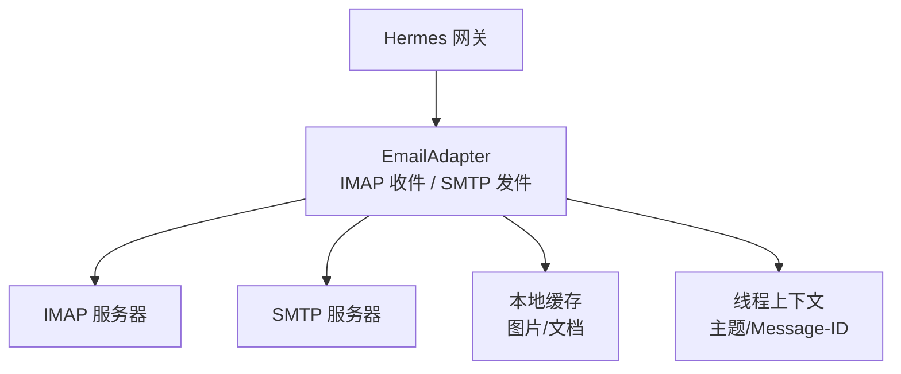
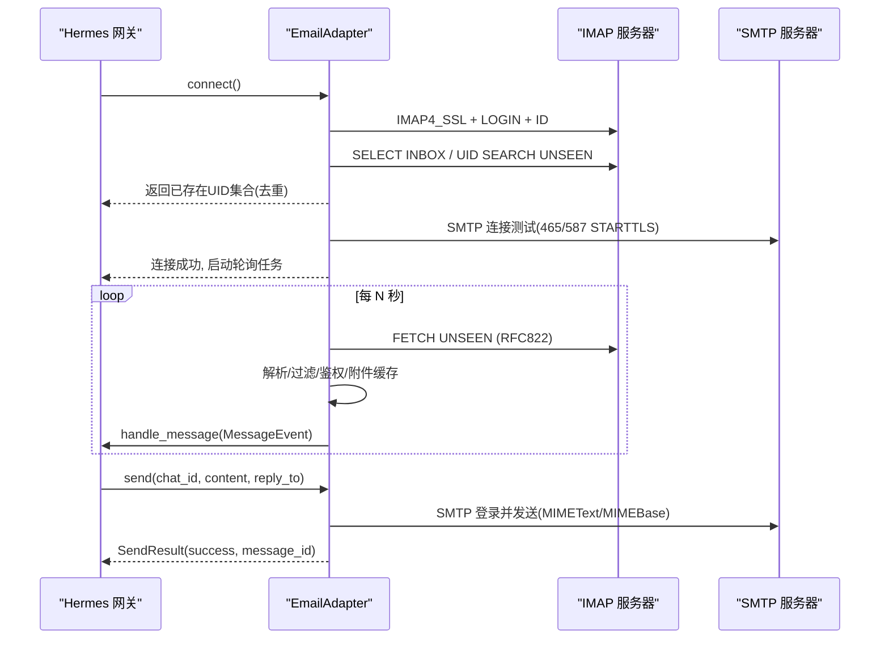
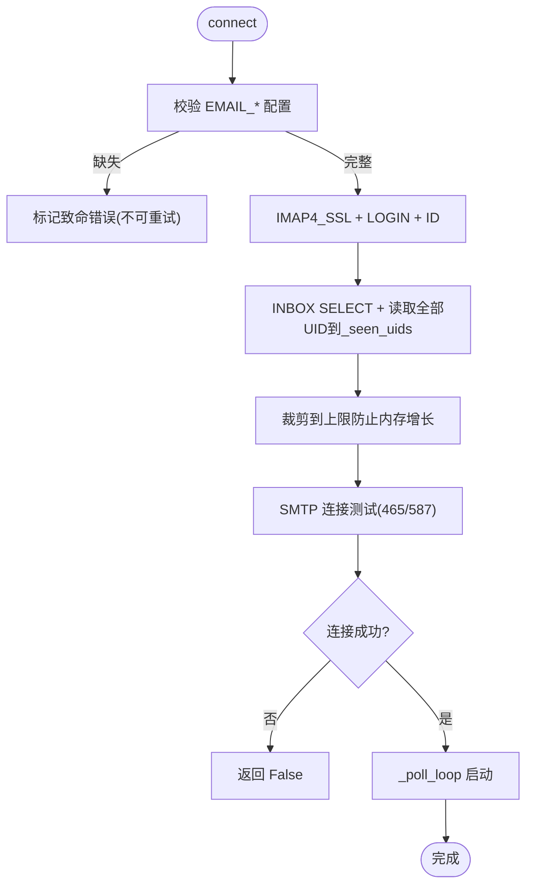
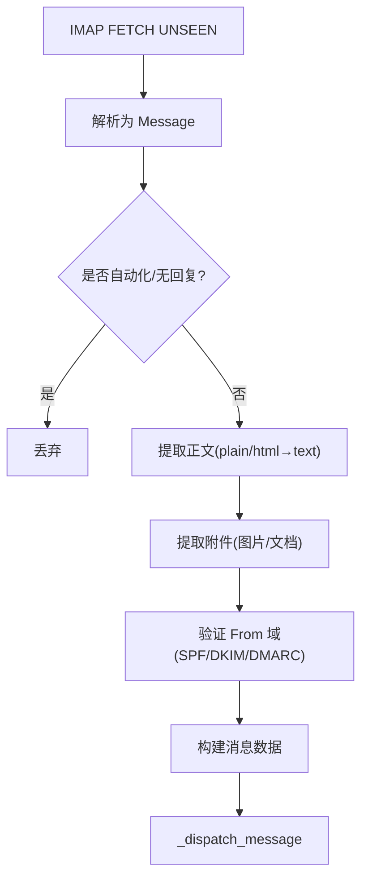
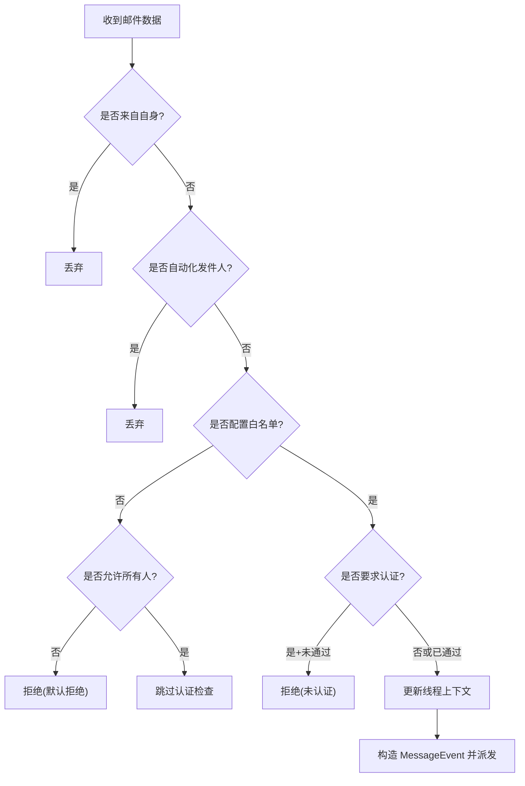
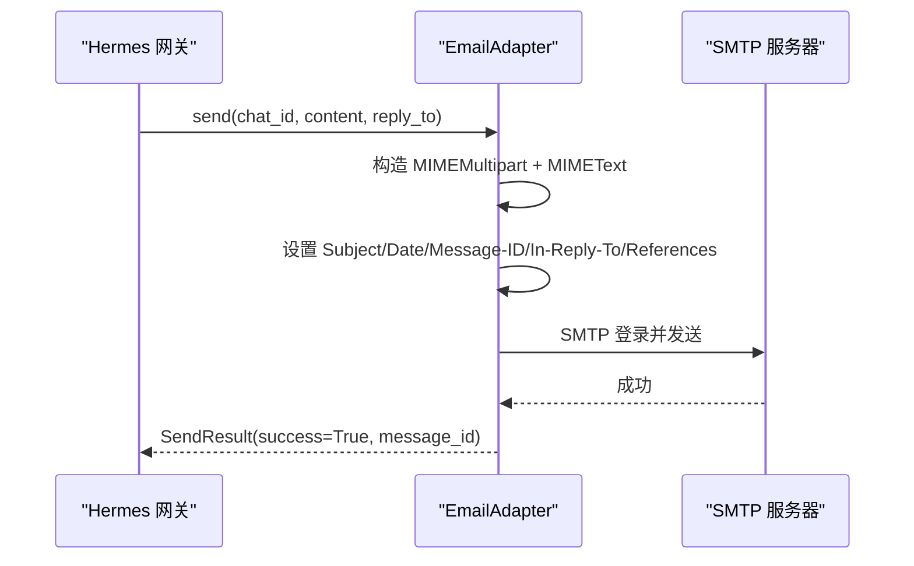
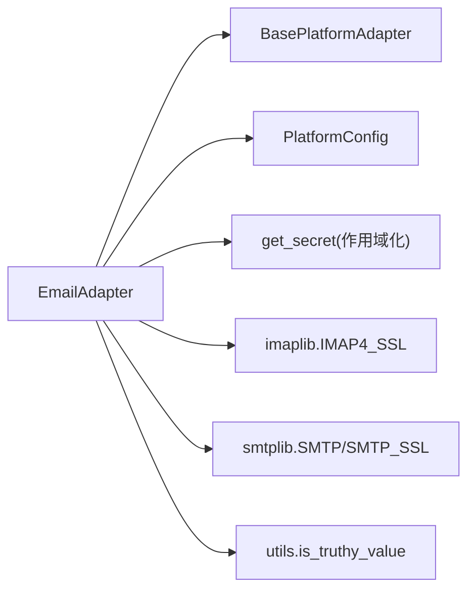

# 邮件平台适配器

<cite>
**本文引用的文件**
- [plugins/platforms/email/adapter.py](file://plugins/platforms/email/adapter.py)
- [plugins/platforms/email/__init__.py](file://plugins/platforms/email/__init__.py)
- [tests/gateway/test_email.py](file://tests/gateway/test_email.py)
- [tests/gateway/test_adapter_connect_is_reconnect_contract.py](file://tests/gateway/test_adapter_connect_is_reconnect_contract.py)
- [skills/email/email-inbox-triage/SKILL.md](file://skills/email/email-inbox-triage/SKILL.md)
</cite>

## 目录
1. [简介](#简介)
2. [项目结构](#项目结构)
3. [核心组件](#核心组件)
4. [架构总览](#架构总览)
5. [详细组件分析](#详细组件分析)
6. [依赖关系分析](#依赖关系分析)
7. [性能考量](#性能考量)
8. [故障排除指南](#故障排除指南)
9. [结论](#结论)
10. [附录](#附录)

## 简介
本文件面向 Hermes Agent 的“邮件平台适配器”，系统性说明其基于 SMTP/IMAP 协议的收发实现、附件处理、HTML 文本提取、认证与安全配置、路由与权限控制、垃圾邮件过滤、队列与重试机制，以及与 Hermes 网关（平台适配器体系）的集成方式。文档同时提供可操作的配置示例、事件处理流程、自定义模板思路以及常见问题的排障方法。

## 项目结构
邮件平台以插件形式注册到 Hermes 网关，核心代码位于 plugins/platforms/email 目录：
- adapter.py：实现 EmailAdapter（继承自 BasePlatformAdapter），包含 IMAP 收信、SMTP 发信、附件处理、安全校验、线程上下文、轮询循环等。
- __init__.py：暴露 register 入口，供插件系统加载。

图表来源
- [plugins/platforms/email/adapter.py:467-662](file://plugins/platforms/email/adapter.py#L467-L662)
- [plugins/platforms/email/adapter.py:676-791](file://plugins/platforms/email/adapter.py#L676-L791)
- [plugins/platforms/email/adapter.py:938-1210](file://plugins/platforms/email/adapter.py#L938-L1210)

章节来源
- [plugins/platforms/email/__init__.py:1-4](file://plugins/platforms/email/__init__.py#L1-L4)
- [plugins/platforms/email/adapter.py:1-113](file://plugins/platforms/email/adapter.py#L1-L113)

## 核心组件
- EmailAdapter：平台适配器的主体，负责连接管理、消息轮询、消息分发、发送响应、附件处理、会话线程上下文维护。
- 配置读取：通过环境变量与 PlatformConfig.extra 读取邮箱地址、密码、IMAP/SMTP 主机与端口、轮询间隔、是否跳过附件、是否要求发件人域认证等。
- 安全与认证：默认启用发件人域认证检查（SPF/DKIM/DMARC），支持可选关闭；支持 authserv-id 限定可信结果来源。
- 垃圾邮件过滤：自动忽略 noreply/自动化头部的邮件。
- 附件处理：图片走图片缓存，文档走文档缓存；支持跳过附件模式。
- 线程上下文：记录每个对话的主题与 Message-ID，用于回复时正确设置 Re:/In-Reply-To/References。
- 独立发送器：提供 _standalone_send 以便工具层直接发送邮件。

章节来源
- [plugins/platforms/email/adapter.py:55-113](file://plugins/platforms/email/adapter.py#L55-L113)
- [plugins/platforms/email/adapter.py:467-532](file://plugins/platforms/email/adapter.py#L467-L532)
- [plugins/platforms/email/adapter.py:793-821](file://plugins/platforms/email/adapter.py#L793-L821)
- [plugins/platforms/email/adapter.py:938-1210](file://plugins/platforms/email/adapter.py#L938-L1210)
- [plugins/platforms/email/adapter.py:1235-1318](file://plugins/platforms/email/adapter.py#L1235-L1318)

## 架构总览
邮件适配器遵循 Hermes 平台适配器契约：
- 生命周期：connect/disconnect，内部启动异步轮询任务。
- 消息流：IMAP 拉取未读 → 解析/过滤/鉴权 → 转换为 MessageEvent → 交给网关处理。
- 回复流：send/send_document/send_multiple_images → 构造 MIME 消息 → SMTP 发送。

图表来源
- [plugins/platforms/email/adapter.py:596-662](file://plugins/platforms/email/adapter.py#L596-L662)
- [plugins/platforms/email/adapter.py:676-791](file://plugins/platforms/email/adapter.py#L676-L791)
- [plugins/platforms/email/adapter.py:938-1007](file://plugins/platforms/email/adapter.py#L938-L1007)

## 详细组件分析

### 连接与轮询
- connect：校验必要配置，测试 IMAP 连接并初始化已见 UID 集合，测试 SMTP 连接，启动轮询任务。
- disconnect：停止轮询并清理任务。
- _poll_loop/_check_inbox：周期性调用 IMAP 获取未读邮件，在 executor 中执行以避免阻塞事件循环。

图表来源
- [plugins/platforms/email/adapter.py:596-662](file://plugins/platforms/email/adapter.py#L596-L662)
- [plugins/platforms/email/adapter.py:676-694](file://plugins/platforms/email/adapter.py#L676-L694)

章节来源
- [plugins/platforms/email/adapter.py:596-694](file://plugins/platforms/email/adapter.py#L596-L694)

### 收件解析与垃圾邮件过滤
- _fetch_new_messages：IMAP 搜索 UNSEEN，逐个 UID 获取 RFC822 原始报文，解析为 email.message.Message。
- 自动忽略：noreply/自动化头部（Auto-Submitted、Precedence 等）。
- 正文提取：优先 text/plain，其次 text/html 转纯文本（简单标签剥离）。
- 附件提取：图片走图片缓存，其他走文档缓存；支持 skip_attachments 跳过。

图表来源
- [plugins/platforms/email/adapter.py:695-791](file://plugins/platforms/email/adapter.py#L695-L791)
- [plugins/platforms/email/adapter.py:195-204](file://plugins/platforms/email/adapter.py#L195-L204)
- [plugins/platforms/email/adapter.py:231-280](file://plugins/platforms/email/adapter.py#L231-L280)
- [plugins/platforms/email/adapter.py:407-464](file://plugins/platforms/email/adapter.py#L407-L464)
- [plugins/platforms/email/adapter.py:327-404](file://plugins/platforms/email/adapter.py#L327-L404)

章节来源
- [plugins/platforms/email/adapter.py:195-204](file://plugins/platforms/email/adapter.py#L195-L204)
- [plugins/platforms/email/adapter.py:231-280](file://plugins/platforms/email/adapter.py#L231-L280)
- [plugins/platforms/email/adapter.py:327-404](file://plugins/platforms/email/adapter.py#L327-L404)
- [plugins/platforms/email/adapter.py:407-464](file://plugins/platforms/email/adapter.py#L407-L464)
- [plugins/platforms/email/adapter.py:695-791](file://plugins/platforms/email/adapter.py#L695-L791)

### 授权与路由
- 白名单与允许所有：
  - EMAIL_ALLOWED_USERS：仅允许列表中的发件人。
  - EMAIL_ALLOW_ALL_USERS/GATEWAY_ALLOW_ALL_USERS：允许所有人（绕过身份校验）。
- 发件人域认证：当启用 require_authenticated_sender 且使用白名单且未开启 allow-all 时，必须通过 SPF/DKIM/DMARC 校验，否则丢弃。
- 线程上下文：按 chat_id（发件人邮箱）保存 subject 与 message_id，用于回复时正确设置 Re:/In-Reply-To/References。

图表来源
- [plugins/platforms/email/adapter.py:793-821](file://plugins/platforms/email/adapter.py#L793-L821)
- [plugins/platforms/email/adapter.py:823-936](file://plugins/platforms/email/adapter.py#L823-L936)

章节来源
- [plugins/platforms/email/adapter.py:793-821](file://plugins/platforms/email/adapter.py#L793-L821)
- [plugins/platforms/email/adapter.py:823-936](file://plugins/platforms/email/adapter.py#L823-L936)

### 发送与附件
- send：发送纯文本回复，保持 Re: 主题与线程头。
- send_image：将图片 URL 作为文本附加到正文。
- send_multiple_images：本地文件作为附件发送，远程 URL 仅追加到正文。
- send_document：发送单个文件附件。
- 附件编码：MIMEBase 二进制 base64 编码，设置 Content-Disposition。

图表来源
- [plugins/platforms/email/adapter.py:938-1007](file://plugins/platforms/email/adapter.py#L938-L1007)
- [plugins/platforms/email/adapter.py:1012-1133](file://plugins/platforms/email/adapter.py#L1012-L1133)
- [plugins/platforms/email/adapter.py:1135-1210](file://plugins/platforms/email/adapter.py#L1135-L1210)

章节来源
- [plugins/platforms/email/adapter.py:938-1007](file://plugins/platforms/email/adapter.py#L938-L1007)
- [plugins/platforms/email/adapter.py:1012-1133](file://plugins/platforms/email/adapter.py#L1012-L1133)
- [plugins/platforms/email/adapter.py:1135-1210](file://plugins/platforms/email/adapter.py#L1135-L1210)

### 安全与加密传输
- SSL/TLS：
  - IMAP：IMAP4_SSL 强制加密。
  - SMTP：端口 465 使用 SMTP_SSL；其他端口使用 STARTTLS。
- IPv4 回退：当默认连接超时/失败（常见于 IPv6 不可达）时，尝试仅 IPv4 路径。
- 发件人域认证：
  - 解析 Authentication-Results 头，校验 dmarc=pass、spf=pass（对齐 From）、dkim=pass（header.d 对齐 From）。
  - 支持 authserv-id 限定可信结果来源。
- 敏感信息保护：
  - 使用作用域化的秘密读取函数避免跨 profile 泄露。
  - 最大消息长度限制（50,000 字符）。

章节来源
- [plugins/platforms/email/adapter.py:115-168](file://plugins/platforms/email/adapter.py#L115-L168)
- [plugins/platforms/email/adapter.py:554-595](file://plugins/platforms/email/adapter.py#L554-L595)
- [plugins/platforms/email/adapter.py:327-404](file://plugins/platforms/email/adapter.py#L327-L404)
- [plugins/platforms/email/adapter.py:55-92](file://plugins/platforms/email/adapter.py#L55-L92)
- [plugins/platforms/email/adapter.py:1300-1318](file://plugins/platforms/email/adapter.py#L1300-L1318)

### 与 Hermes 网关集成
- 插件注册：register 暴露 name="email"、label、工厂函数、连通性检查、必需环境变量、独立发送器等。
- 连通性检查：_is_connected 判断 extra.address 或环境变量是否存在。
- 适配器契约：connect 接受 is_reconnect 关键字参数，满足网关重连契约。

章节来源
- [plugins/platforms/email/adapter.py:1235-1318](file://plugins/platforms/email/adapter.py#L1235-L1318)
- [tests/gateway/test_adapter_connect_is_reconnect_contract.py:114-145](file://tests/gateway/test_adapter_connect_is_reconnect_contract.py#L114-L145)

## 依赖关系分析
- 外部协议：IMAP（接收）、SMTP（发送）。
- 标准库：email、imaplib、smtplib、ssl、socket、uuid、pathlib。
- 内部依赖：
  - gateway.platforms.base.BasePlatformAdapter、MessageEvent、MessageType、SendResult。
  - gateway.config.Platform、PlatformConfig。
  - agent.secret_scope.get_secret（作用域化密钥读取）。
  - utils.is_truthy_value（布尔值解析）。

图表来源
- [plugins/platforms/email/adapter.py:41-50](file://plugins/platforms/email/adapter.py#L41-L50)
- [plugins/platforms/email/adapter.py:27-38](file://plugins/platforms/email/adapter.py#L27-L38)

章节来源
- [plugins/platforms/email/adapter.py:41-50](file://plugins/platforms/email/adapter.py#L41-L50)
- [plugins/platforms/email/adapter.py:27-38](file://plugins/platforms/email/adapter.py#L27-L38)

## 性能考量
- 非阻塞 IO：IMAP 操作在 executor 中运行，避免阻塞事件循环。
- 去重与内存控制：_seen_uids 维护最近 UID 集合，超过阈值后裁剪至一半，防止无限增长。
- 批量处理：IMAP 批量搜索 UNSEEN，逐条处理但容错（异常不中断批次）。
- 连接优化：SMTP 连接失败时自动回退到 IPv4；465/587 协议选择。
- 附件策略：可选择跳过附件以减少带宽与存储压力。

章节来源
- [plugins/platforms/email/adapter.py:534-553](file://plugins/platforms/email/adapter.py#L534-L553)
- [plugins/platforms/email/adapter.py:676-791](file://plugins/platforms/email/adapter.py#L676-L791)
- [plugins/platforms/email/adapter.py:554-595](file://plugins/platforms/email/adapter.py#L554-L595)

## 故障排除指南
- 连接问题
  - IMAP/SMTP 连接失败：检查 EMAIL_IMAP_HOST/PORT、EMAIL_SMTP_HOST/PORT、网络可达性与防火墙。
  - IPv6 不可达导致超时：适配器会自动回退到 IPv4；若仍失败，检查 DNS 与网络栈。
  - 163/NetEase 需要 IMAP ID：适配器在登录后发送 ID 命令，如失败会记录日志但不影响主流程。
- 认证失败
  - 用户名/密码错误：确认 EMAIL_ADDRESS/EMAIL_PASSWORD 正确；企业邮箱可能需要应用专用密码。
  - TLS/证书问题：确保 SMTP 端口与协议匹配（465 用 SSL，587 用 STARTTLS）。
  - 发件人域认证被拒：若你的接收服务器不添加 Authentication-Results，可在配置中关闭 require_authenticated_sender（承担风险）。
- 邮件发送失败
  - SMTP 登录/发送异常：查看日志中的错误信息；确认账号权限与出站规则。
  - 附件过大：注意 SMTP 服务商的消息大小限制；必要时拆分或压缩。
  - 资源释放：适配器在 finally 中确保 quit/close，即使发送失败也会尽量释放连接。
- 权限与路由
  - 默认拒绝：未配置白名单且未开启 allow-all 时，所有发件人被拒绝；请配置 EMAIL_ALLOWED_USERS 或 EMAIL_ALLOW_ALL_USERS。
  - 白名单下未认证：需通过 SPF/DKIM/DMARC；否则会被丢弃。
- 轮询与重复
  - 重复处理：通过 _seen_uids 去重；若出现漏处理，检查 IMAP 响应结构与异常分支。
  - 轮询间隔：调整 EMAIL_POLL_INTERVAL 平衡实时性与负载。

章节来源
- [plugins/platforms/email/adapter.py:596-662](file://plugins/platforms/email/adapter.py#L596-L662)
- [plugins/platforms/email/adapter.py:676-791](file://plugins/platforms/email/adapter.py#L676-L791)
- [plugins/platforms/email/adapter.py:823-936](file://plugins/platforms/email/adapter.py#L823-L936)
- [plugins/platforms/email/adapter.py:938-1210](file://plugins/platforms/email/adapter.py#L938-L1210)
- [tests/gateway/test_email.py:450-800](file://tests/gateway/test_email.py#L450-L800)

## 结论
邮件平台适配器以标准库为基础，实现了稳定可靠的 IMAP/SMTP 收发能力，内置垃圾邮件过滤、发件人域认证、附件缓存、线程上下文与 IPv4 回退等关键特性。通过插件注册机制与 Hermes 网关无缝集成，并提供独立发送器便于工具层调用。建议在生产环境启用发件人域认证与白名单，合理配置轮询间隔与附件策略，以获得最佳安全性与性能。

## 附录

### 配置与环境变量
- 必需
  - EMAIL_ADDRESS：代理邮箱地址
  - EMAIL_PASSWORD：邮箱密码或应用专用密码
  - EMAIL_IMAP_HOST：IMAP 服务器主机
  - EMAIL_SMTP_HOST：SMTP 服务器主机
- 可选
  - EMAIL_IMAP_PORT：IMAP 端口（默认 993）
  - EMAIL_SMTP_PORT：SMTP 端口（默认 587）
  - EMAIL_POLL_INTERVAL：轮询间隔（秒）
  - EMAIL_ALLOWED_USERS：允许的发件人列表（逗号分隔）
  - EMAIL_ALLOW_ALL_USERS：允许所有人（true/1/yes）
  - EMAIL_TRUST_FROM_HEADER：信任 From 头（关闭认证检查，谨慎使用）
  - EMAIL_AUTHSERV_ID：限定 Authentication-Results 的可信来源域名
  - platforms.email.skip_attachments：跳过附件
  - platforms.email.require_authenticated_sender：是否要求发件人域认证

章节来源
- [plugins/platforms/email/adapter.py:55-92](file://plugins/platforms/email/adapter.py#L55-L92)
- [plugins/platforms/email/adapter.py:467-532](file://plugins/platforms/email/adapter.py#L467-L532)
- [plugins/platforms/email/adapter.py:793-821](file://plugins/platforms/email/adapter.py#L793-L821)
- [plugins/platforms/email/adapter.py:1300-1318](file://plugins/platforms/email/adapter.py#L1300-L1318)

### 代码示例路径（不含具体代码内容）
- 配置加载与连通性检查
  - [check_email_requirements:206-216](file://plugins/platforms/email/adapter.py#L206-L216)
  - [_is_connected:1284-1293](file://plugins/platforms/email/adapter.py#L1284-L1293)
- 连接与轮询
  - [connect:596-662](file://plugins/platforms/email/adapter.py#L596-L662)
  - [_poll_loop/_check_inbox:676-694](file://plugins/platforms/email/adapter.py#L676-L694)
- 收件解析与过滤
  - [_fetch_new_messages:695-791](file://plugins/platforms/email/adapter.py#L695-L791)
  - [_is_automated_sender:195-204](file://plugins/platforms/email/adapter.py#L195-L204)
  - [_extract_text_body:231-266](file://plugins/platforms/email/adapter.py#L231-L266)
  - [_strip_html:269-280](file://plugins/platforms/email/adapter.py#L269-L280)
- 附件处理
  - [_extract_attachments:407-464](file://plugins/platforms/email/adapter.py#L407-L464)
- 授权与路由
  - [_allow_all_senders/_allowlist_in_effect:793-821](file://plugins/platforms/email/adapter.py#L793-L821)
  - [_dispatch_message:823-936](file://plugins/platforms/email/adapter.py#L823-L936)
- 发送与附件
  - [send:938-1007](file://plugins/platforms/email/adapter.py#L938-L1007)
  - [send_multiple_images:1029-1080](file://plugins/platforms/email/adapter.py#L1029-L1080)
  - [_send_email_with_attachments:1081-1133](file://plugins/platforms/email/adapter.py#L1081-L1133)
  - [send_document:1135-1158](file://plugins/platforms/email/adapter.py#L1135-L1158)
  - [_send_email_with_attachment:1160-1210](file://plugins/platforms/email/adapter.py#L1160-L1210)
- 独立发送器
  - [_standalone_send:1235-1282](file://plugins/platforms/email/adapter.py#L1235-L1282)

### 与 Hermes Agent 核心系统集成要点
- 会话绑定：通过 build_source 将 chat_id/user_id 映射到发件人邮箱，形成 DM 会话。
- 消息转换：将邮件转换为 MessageEvent（含类型、媒体、回复引用）。
- 用户权限控制：结合白名单与 allow-all 开关，以及发件人域认证，决定放行与否。
- 重连契约：connect 接受 is_reconnect 关键字参数，符合网关重连机制。

章节来源
- [plugins/platforms/email/adapter.py:823-936](file://plugins/platforms/email/adapter.py#L823-L936)
- [tests/gateway/test_adapter_connect_is_reconnect_contract.py:114-145](file://tests/gateway/test_adapter_connect_is_reconnect_contract.py#L114-L145)

### 邮件收件箱分拣技能（参考）
- 该技能提供收件箱优先级排序、线程感知、安全起草回复的流程与注意事项，可与连接器技能配合使用。

章节来源
- [skills/email/email-inbox-triage/SKILL.md:1-88](file://skills/email/email-inbox-triage/SKILL.md#L1-L88)