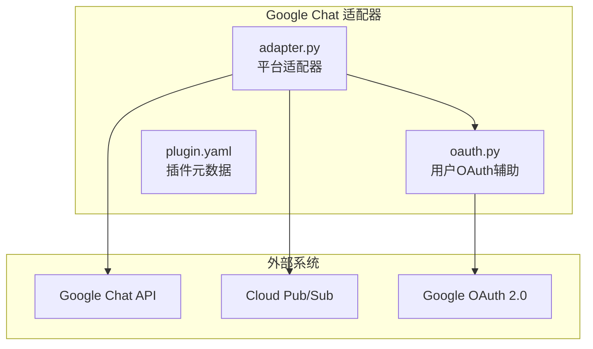
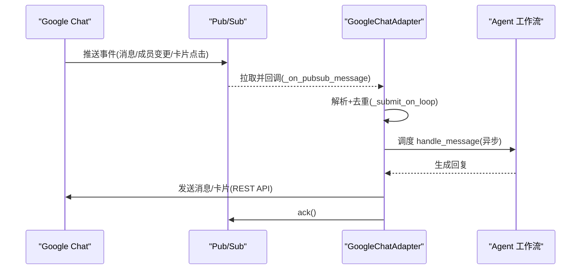
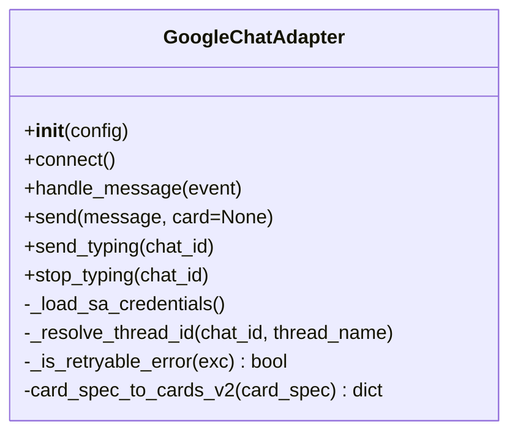
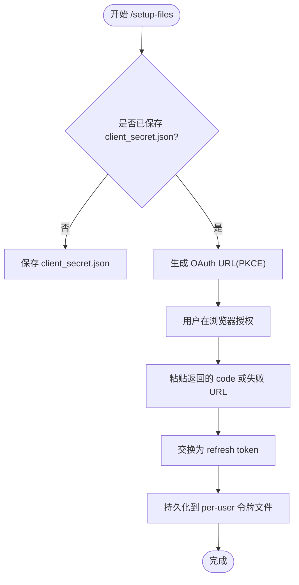
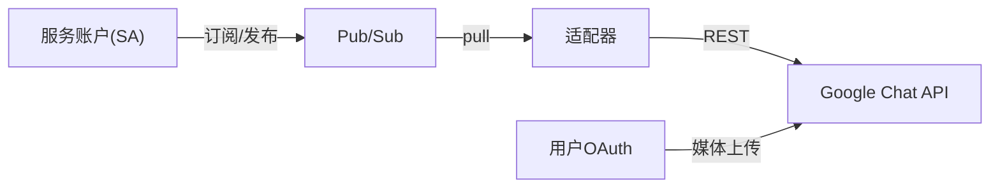

# Google Chat 适配器

<cite>
**本文引用的文件**
- [adapter.py](file://plugins/platforms/google_chat/adapter.py)
- [oauth.py](file://plugins/platforms/google_chat/oauth.py)
- [plugin.yaml](file://plugins/platforms/google_chat/plugin.yaml)
- [google_chat.md](file://website/docs/user-guide/messaging/google_chat.md)
- [test_google_chat.py](file://tests/gateway/test_google_chat.py)
</cite>

## 目录
1. [简介](#简介)
2. [项目结构](#项目结构)
3. [核心组件](#核心组件)
4. [架构总览](#架构总览)
5. [详细组件分析](#详细组件分析)
6. [依赖关系分析](#依赖关系分析)
7. [性能与可靠性](#性能与可靠性)
8. [部署与配置](#部署与配置)
9. [企业级能力与安全](#企业级能力与安全)
10. [故障排除](#故障排除)
11. [结论](#结论)
12. [附录：开发示例与最佳实践](#附录开发示例与最佳实践)

## 简介
本文件面向在企业环境中集成 Google Chat 的开发者，提供基于 Hermes Agent 的 Google Chat 适配器的完整说明。内容涵盖：
- 与企业协作生态（Google Workspace、Gmail、Drive、日历）的集成思路与边界
- Google Cloud 认证流程（服务账户、OAuth 2.0、HTTP 回调与 Pub/Sub 两种入站模式）
- 消息处理、卡片消息、表单交互与自动化脚本
- 多租户支持、数据隔离与安全框架集成
- 部署指南、监控配置与故障排除
- 开发示例、配置模板与最佳实践

## 项目结构
Google Chat 适配器以插件形式组织在 plugins/platforms/google_chat 下，包含：
- adapter.py：平台适配器实现，负责事件路由、消息收发、卡片渲染、重试与流控等
- oauth.py：用户 OAuth 辅助模块，用于原生附件上传所需的 per-user 授权与令牌管理
- plugin.yaml：插件元数据与环境变量声明，供 UI 注入与引导
- 配套文档 website/docs/user-guide/messaging/google_chat.md：端到端设置与使用指南
- 测试 tests/gateway/test_google_chat.py：覆盖连接、事件路由、出站发送、SSRF 防护、重连等

图表来源
- [adapter.py:1-36](file://plugins/platforms/google_chat/adapter.py#L1-L36)
- [oauth.py:1-55](file://plugins/platforms/google_chat/oauth.py#L1-L55)
- [plugin.yaml:1-51](file://plugins/platforms/google_chat/plugin.yaml#L1-L51)

章节来源
- [adapter.py:1-36](file://plugins/platforms/google_chat/adapter.py#L1-L36)
- [plugin.yaml:1-51](file://plugins/platforms/google_chat/plugin.yaml#L1-L51)

## 核心组件
- 平台适配器（GoogleChatAdapter）
  - 通过 Pub/Sub pull 订阅或 HTTP 回调接收事件；通过 Chat REST API 发送消息
  - 支持“思考中”占位消息就地编辑、长消息分片、卡片 v2 渲染、澄清问题交互
  - 内置出站重试、速率限制告警、线程计数持久化（DM 主流程 vs 侧线程）
- 用户 OAuth 辅助（oauth.py）
  - 为原生附件上传提供 per-user 授权流程（chat.messages.create 最小权限）
  - 管理客户端密钥、待处理状态、刷新令牌与撤销
- 插件元数据（plugin.yaml）
  - 声明必需/可选环境变量，便于在配置界面展示与引导

章节来源
- [adapter.py:625-763](file://plugins/platforms/google_chat/adapter.py#L625-L763)
- [oauth.py:186-315](file://plugins/platforms/google_chat/oauth.py#L186-L315)
- [plugin.yaml:16-51](file://plugins/platforms/google_chat/plugin.yaml#L16-L51)

## 架构总览
适配器采用“异步事件驱动 + 同步 API 调用”的混合模型：
- 入站：Pub/Sub SubscriberClient 在后台线程回调，通过 asyncio.run_coroutine_threadsafe 将处理切回事件循环
- 出站：所有 Chat REST 调用通过 asyncio.to_thread 执行，避免阻塞事件循环
- 事件类型路由：仅 MESSAGE 进入代理工作流；ADDED_TO_SPACE 缓存机器人资源名；CARD_CLICKED 在 v1 中 ACK（后续 PR 实现交互）

图表来源
- [adapter.py:1-36](file://plugins/platforms/google_chat/adapter.py#L1-L36)
- [adapter.py:208-227](file://plugins/platforms/google_chat/adapter.py#L208-L227)

## 详细组件分析

### 适配器类 GoogleChatAdapter
职责与关键点：
- 初始化时延迟加载 google-cloud/googleapiclient，降低冷启动开销
- 支持服务账户凭据（路径或内联 JSON）、ADC、环境变量等多来源
- 维护每空间速率限制计数、线程计数持久化、typing 卡片并发控制
- 出站重试策略：对 429/5xx 及网络瞬态错误指数退避重试
- 卡片 v2 渲染：将内部 card_spec 转换为 Chat Card v2 结构，支持按钮、选择输入、图片等
- DM 主流程与侧线程区分：通过持久化的 thread count 决定会话隔离与回复线程归属

图表来源
- [adapter.py:625-763](file://plugins/platforms/google_chat/adapter.py#L625-L763)
- [adapter.py:475-513](file://plugins/platforms/google_chat/adapter.py#L475-L513)
- [adapter.py:257-284](file://plugins/platforms/google_chat/adapter.py#L257-L284)

章节来源
- [adapter.py:625-763](file://plugins/platforms/google_chat/adapter.py#L625-L763)
- [adapter.py:475-513](file://plugins/platforms/google_chat/adapter.py#L475-L513)
- [adapter.py:257-284](file://plugins/platforms/google_chat/adapter.py#L257-L284)

### 用户 OAuth 辅助模块
职责与关键点：
- 解决 media.upload 必须使用用户凭据的限制，实现 per-user 授权
- 存储与刷新用户令牌，支持按邮箱命名空间的多用户隔离
- CLI 命令：检查、注册客户端密钥、生成授权 URL、交换授权码、撤销令牌、安装依赖
- 安全：原子写入、私有权限、敏感信息脱敏、最小权限 scope（chat.messages.create）

图表来源
- [oauth.py:518-617](file://plugins/platforms/google_chat/oauth.py#L518-L617)
- [oauth.py:186-251](file://plugins/platforms/google_chat/oauth.py#L186-L251)

章节来源
- [oauth.py:186-251](file://plugins/platforms/google_chat/oauth.py#L186-L251)
- [oauth.py:518-617](file://plugins/platforms/google_chat/oauth.py#L518-L617)

### 卡片消息与表单交互
- 卡片 v2 渲染：将 sections/widgets 转换为 Chat Card v2 结构，支持文本、装饰文本、分割线、图片、按钮列表、选择输入
- 澄清问题：当需要多选确认时，自动渲染为卡片按钮；点击后通过 CARD_CLICKED 事件回传选择结果
- 降级策略：若卡片发送失败或无固定选项，回退为纯文本提示

章节来源
- [adapter.py:395-513](file://plugins/platforms/google_chat/adapter.py#L395-L513)

### 出站消息与重试
- 出站调用通过 asyncio.to_thread 执行，避免阻塞事件循环
- 重试策略：对 429/5xx 及网络瞬态错误进行指数退避重试，最大尝试次数与抖动参数可控
- 打字指示器：发送前插入“思考中”占位消息，完成后就地编辑为真实回复，避免墓碑消息

章节来源
- [adapter.py:235-243](file://plugins/platforms/google_chat/adapter.py#L235-L243)
- [adapter.py:285-294](file://plugins/platforms/google_chat/adapter.py#L285-L294)

### 入站事件与线程管理
- 事件类型：MESSAGE、ADDED_TO_SPACE、REMOVED_FROM_SPACE、CARD_CLICKED
- 线程计数持久化：按 (chat_id, thread_name) 记录历史，判断 DM 主流程与侧线程，确保会话隔离与正确回复线程
- 去重：MessageDeduplicator 防止重复处理

章节来源
- [adapter.py:30-36](file://plugins/platforms/google_chat/adapter.py#L30-L36)
- [adapter.py:515-623](file://plugins/platforms/google_chat/adapter.py#L515-L623)
- [adapter.py:185-196](file://plugins/platforms/google_chat/adapter.py#L185-L196)

## 依赖关系分析
- 运行时依赖（惰性加载）：
  - google-cloud-pubsub、google-api-python-client、google-auth、google-auth-oauthlib、google-auth-httplib2、httplib2、pyasn1
- 入站通道：
  - Pub/Sub pull 订阅（无需公网地址）
  - 可选 HTTP 回调（需验证签名与受众）
- 出站通道：
  - Google Chat REST API（chat.googleapis.com）
- 用户附件上传：
  - 需要 per-user OAuth（chat.messages.create），由 oauth.py 管理

图表来源
- [adapter.py:213-227](file://plugins/platforms/google_chat/adapter.py#L213-L227)
- [oauth.py:155-172](file://plugins/platforms/google_chat/oauth.py#L155-L172)

章节来源
- [adapter.py:213-227](file://plugins/platforms/google_chat/adapter.py#L213-L227)
- [oauth.py:155-172](file://plugins/platforms/google_chat/oauth.py#L155-L172)

## 性能与可靠性
- 冷启动优化：惰性导入重型依赖，减少 CLI 启动开销
- 并发模型：Pub/Sub 回调线程与事件循环解耦，避免阻塞
- 出站重试：指数退避与抖动，提高鲁棒性
- 速率限制：按空间统计命中次数并告警，建议合理响应长度或提升配额
- 线程计数持久化：跨重启保持侧线程隔离，避免上下文泄漏

章节来源
- [adapter.py:51-78](file://plugins/platforms/google_chat/adapter.py#L51-L78)
- [adapter.py:235-243](file://plugins/platforms/google_chat/adapter.py#L235-L243)
- [adapter.py:515-623](file://plugins/platforms/google_chat/adapter.py#L515-L623)

## 部署与配置
- 环境要求
  - 启用 Google Chat API 与 Cloud Pub/Sub API
  - 创建 GCP 项目、Topic、Subscription，并完成 IAM 绑定（topic 允许 chat-api-push 发布；subscription 允许 SA 订阅）
  - 配置 Chat 应用功能与连接方式为 Pub/Sub
- 环境变量（来自 plugin.yaml）
  - 必需：GOOGLE_CHAT_PROJECT_ID、GOOGLE_CHAT_SUBSCRIPTION_NAME、GOOGLE_CHAT_SERVICE_ACCOUNT_JSON（或 ADC）
  - 可选：GOOGLE_CHAT_HTTP_EVENTS_URL/AUDIENCE/SERVICE_ACCOUNT_EMAIL、GOOGLE_CHAT_ALLOWED_USERS、GOOGLE_CHAT_HOME_CHANNEL、流量控制相关
- 用户附件上传（可选）
  - 保存 client_secret.json，用户运行 /setup-files 完成一次授权
  - 令牌按邮箱隔离存储，支持撤销与刷新

章节来源
- [google_chat.md:37-180](file://website/docs/user-guide/messaging/google_chat.md#L37-L180)
- [plugin.yaml:16-51](file://plugins/platforms/google_chat/plugin.yaml#L16-L51)
- [oauth.py:442-617](file://plugins/platforms/google_chat/oauth.py#L442-L617)

## 企业级能力与安全
- 多租户与数据隔离
  - 按空间与线程隔离会话；DM 主流程与侧线程通过持久化计数区分
  - 用户 OAuth 令牌按邮箱隔离，互不干扰
- 安全框架集成
  - 附件下载白名单校验（仅信任 Google 域名），防止 SSRF
  - 日志与错误信息中的敏感字段脱敏（订阅路径、SA 邮箱等）
  - 最小权限原则：SA 仅授予订阅所需角色；用户 OAuth 仅请求 chat.messages.create
- 合规与治理
  - 建议在受监管工作区使用前完成审批；遵循数据驻留与 AI 治理政策

章节来源
- [adapter.py:308-339](file://plugins/platforms/google_chat/adapter.py#L308-L339)
- [adapter.py:341-365](file://plugins/platforms/google_chat/adapter.py#L341-L365)
- [oauth.py:155-172](file://plugins/platforms/google_chat/oauth.py#L155-L172)
- [google_chat.md:390-415](file://website/docs/user-guide/messaging/google_chat.md#L390-L415)

## 故障排除
- 机器人无响应
  - 检查 Pub/Sub 订阅是否有未投递消息；确认 SA 具备订阅者权限
  - 检查 topic 上 chat-api-push 的发布者权限
  - 查看日志是否出现“Connected”与配置校验错误
- 出站报错
  - 403：机器人被移出空间或撤销，重新安装即可
  - 频繁速率限制：缩短响应或提升配额；适配器会指数退避重试
- 附件上传问题
  - 用户未运行 /setup-files 或令牌过期：提示重新授权
  - 客户端密钥未保存或未在当前 profile：按 profile 分别保存
- 调试
  - 开启 GOOGLE_CHAT_DEBUG_RAW=1 可输出经脱敏的原始信封（DEBUG 级别）

章节来源
- [google_chat.md:326-387](file://website/docs/user-guide/messaging/google_chat.md#L326-L387)
- [adapter.py:257-284](file://plugins/platforms/google_chat/adapter.py#L257-L284)

## 结论
该 Google Chat 适配器提供了生产可用的入站事件处理、稳定的出站消息发送、卡片交互与原生附件上传能力。通过 Pub/Sub 与 HTTP 回调双通道、严格的权限与安全检查、以及完善的重试与流控机制，适合在企业环境中作为协作入口与自动化中枢。结合 Google Workspace 生态（邮件、Drive、日历）可通过技能层扩展，形成端到端的办公自动化方案。

## 附录：开发示例与最佳实践
- 开发示例
  - 事件路由与消息处理：参考测试中对消息、成员变更、卡片点击的处理路径
  - 卡片渲染：使用 card_spec_to_cards_v2 将结构化卡片转为 Chat Card v2
  - 出站重试：利用 _is_retryable_error 分类错误并触发重试
  - 线程计数：通过 _ThreadCountStore 持久化计数，保证会话隔离
- 最佳实践
  - 使用最小权限：SA 仅授予订阅所需角色；用户 OAuth 仅请求必要 scope
  - 控制消息长度：单条消息上限约 4000 字符，超长自动分片
  - 谨慎配置公开回调：优先使用 Pub/Sub pull；如需 HTTP 回调，务必验证签名与受众
  - 监控与告警：关注速率限制命中与 Pub/Sub 重连日志
  - 多租户隔离：按空间与线程隔离会话；per-user 令牌独立管理

章节来源
- [test_google_chat.py:1-200](file://tests/gateway/test_google_chat.py#L1-L200)
- [adapter.py:475-513](file://plugins/platforms/google_chat/adapter.py#L475-L513)
- [adapter.py:257-284](file://plugins/platforms/google_chat/adapter.py#L257-L284)
- [adapter.py:515-623](file://plugins/platforms/google_chat/adapter.py#L515-L623)