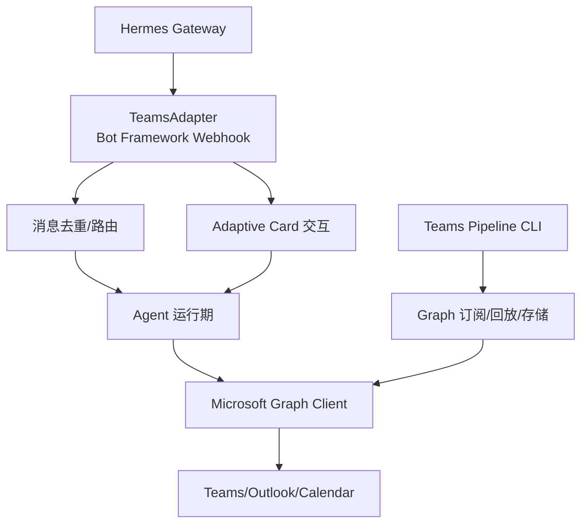
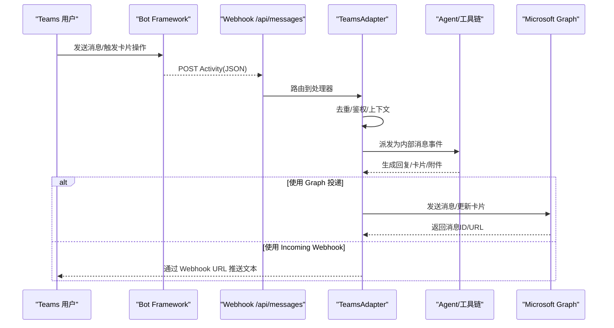
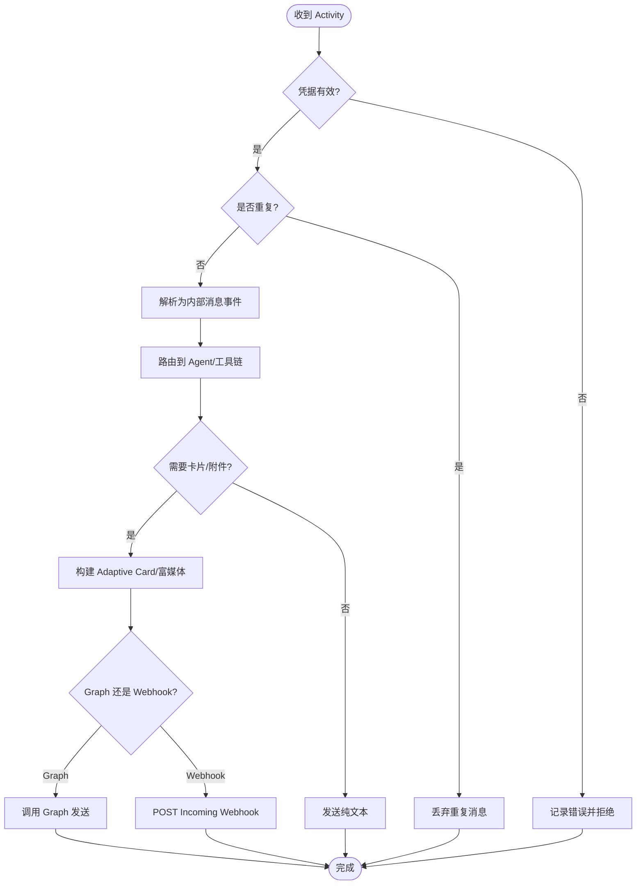
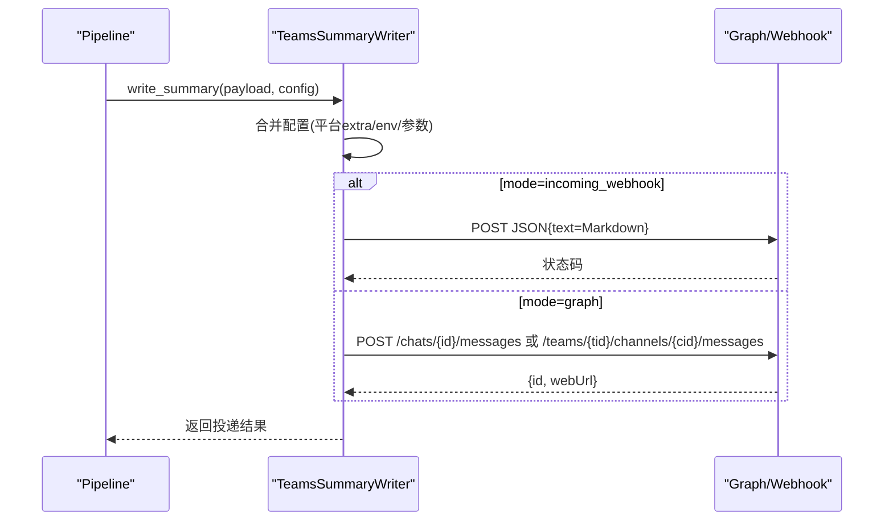
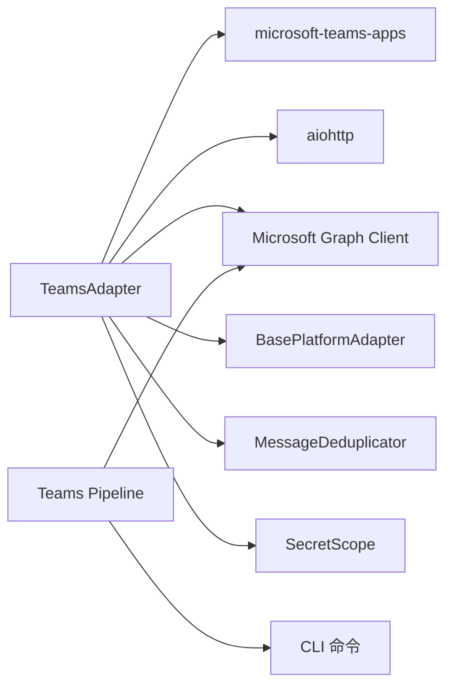

# Microsoft Teams 适配器

<cite>
**本文引用的文件**
- [plugins/platforms/teams/adapter.py](file://plugins/platforms/teams/adapter.py)
- [plugins/platforms/teams/plugin.yaml](file://plugins/platforms/teams/plugin.yaml)
- [plugins/teams_pipeline/__init__.py](file://plugins/teams_pipeline/__init__.py)
- [gateway/platforms/base.py](file://gateway/platforms/base.py)
- [gateway/platforms/helpers.py](file://gateway/platforms/helpers.py)
- [tools/microsoft_graph_auth.py](file://tools/microsoft_graph_auth.py)
- [tools/microsoft_graph_client.py](file://tools/microsoft_graph_client.py)
- [hermes_cli/config.py](file://hermes_cli/config.py)
- [hermes_cli/web_server.py](file://hermes_cli/web_server.py)
</cite>

## 目录
1. [简介](#简介)
2. [项目结构](#项目结构)
3. [核心组件](#核心组件)
4. [架构总览](#架构总览)
5. [详细组件分析](#详细组件分析)
6. [依赖关系分析](#依赖关系分析)
7. [性能与扩展性](#性能与扩展性)
8. [故障排除指南](#故障排除指南)
9. [结论](#结论)
10. [附录：配置与部署](#附录配置与部署)

## 简介
本文件面向企业级开发者，系统化阐述 Hermes Agent 的 Microsoft Teams 适配器实现。内容涵盖：
- Teams 平台的企业特性：Azure AD 集成、组织权限管理、频道与群组消息处理
- OAuth 认证流程与应用注册要点（结合 Bot Framework）
- 消息格式转换、富媒体支持、卡片消息与交互式组件（Adaptive Card）
- 企业级能力：审批工作流、日程集成、文件协作、会议控制（通过 Teams Pipeline）
- 多租户架构、数据隔离策略与安全合规要求
- 完整配置示例、错误处理模式与性能优化建议
- 部署指南、监控指标与故障排除方法

## 项目结构
Teams 适配器的代码位于插件体系内，核心由“平台适配器”和“会议流水线”两部分组成：
- 平台适配器：负责与 Teams Bot Framework 通信，接收 Webhook 消息、发送消息、处理 Adaptive Card 交互
- 会议流水线：提供对 Teams 会议事件订阅、Graph API 调用、结果回写等能力

图表来源
- [plugins/platforms/teams/adapter.py:753-800](file://plugins/platforms/teams/adapter.py#L753-L800)
- [plugins/teams_pipeline/__init__.py:1-24](file://plugins/teams_pipeline/__init__.py#L1-L24)
- [tools/microsoft_graph_client.py](file://tools/microsoft_graph_client.py)

章节来源
- [plugins/platforms/teams/adapter.py:1-120](file://plugins/platforms/teams/adapter.py#L1-L120)
- [plugins/platforms/teams/plugin.yaml:1-53](file://plugins/platforms/teams/plugin.yaml#L1-L53)
- [plugins/teams_pipeline/__init__.py:1-24](file://plugins/teams_pipeline/__init__.py#L1-L24)

## 核心组件
- TeamsAdapter：基于 microsoft-teams-apps SDK 的 aiohttp Webhook 服务器，承载 Bot Framework 活动收发、会话上下文、消息去重、卡片交互
- TeamsSummaryWriter：面向 Pipeline 的出站投递器，支持 Incoming Webhook 或 Graph API 两种模式将摘要写入 Teams
- _AiohttpBridgeAdapter：桥接 SDK 路由到现有 aiohttp 应用，避免引入 FastAPI/Uvicorn
- Teams Pipeline CLI：用于 Graph 订阅、作业管理与回放等操作

章节来源
- [plugins/platforms/teams/adapter.py:170-380](file://plugins/platforms/teams/adapter.py#L170-L380)
- [plugins/platforms/teams/adapter.py:381-429](file://plugins/platforms/teams/adapter.py#L381-L429)
- [plugins/platforms/teams/adapter.py:753-800](file://plugins/platforms/teams/adapter.py#L753-L800)
- [plugins/teams_pipeline/__init__.py:1-24](file://plugins/teams_pipeline/__init__.py#L1-L24)

## 架构总览
Teams 适配器采用“Webhook + SDK + Graph”的分层架构：
- 接入层：aiohttp 暴露 /api/messages，接收 Bot Framework 活动
- 适配层：SDK 解析 Activity，转换为内部消息事件；处理 Adaptive Card 回调
- 业务层：Gateway/Agent 执行工具链，产出结果
- 集成层：通过 Microsoft Graph 访问 Teams/Outlook/Calendar，或通过 Incoming Webhook 直接投递

图表来源
- [plugins/platforms/teams/adapter.py:753-800](file://plugins/platforms/teams/adapter.py#L753-L800)
- [plugins/platforms/teams/adapter.py:170-380](file://plugins/platforms/teams/adapter.py#L170-L380)
- [tools/microsoft_graph_client.py](file://tools/microsoft_graph_client.py)

## 详细组件分析

### TeamsAdapter：Bot Framework 接入与消息处理
- 启动与监听：通过 aiohttp 暴露 /api/messages，端口默认 3978，支持自定义 host/port
- 鉴权与凭据：从环境变量或配置读取 client_id、client_secret、tenant_id；支持服务地址白名单校验
- 消息去重：内置 MessageDeduplicator，防止重复处理
- 会话上下文：维护 chat_id → ConversationReference 映射，确保卡片与消息正确投递
- 长消息拆分：支持按长度限制拆分消息，避免超出 Teams 文本上限
- 安全约束：对 service_url 进行白名单校验，对 conversation ID 做字符集校验，防止 SSRF/路径穿越

图表来源
- [plugins/platforms/teams/adapter.py:753-800](file://plugins/platforms/teams/adapter.py#L753-L800)
- [plugins/platforms/teams/adapter.py:529-649](file://plugins/platforms/teams/adapter.py#L529-L649)
- [gateway/platforms/helpers.py](file://gateway/platforms/helpers.py)

章节来源
- [plugins/platforms/teams/adapter.py:120-170](file://plugins/platforms/teams/adapter.py#L120-L170)
- [plugins/platforms/teams/adapter.py:484-527](file://plugins/platforms/teams/adapter.py#L484-L527)
- [plugins/platforms/teams/adapter.py:529-649](file://plugins/platforms/teams/adapter.py#L529-L649)
- [plugins/platforms/teams/adapter.py:753-800](file://plugins/platforms/teams/adapter.py#L753-L800)

### TeamsSummaryWriter：会议摘要投递
- 支持两种投递模式：
  - incoming_webhook：通过 Incoming Webhook URL 发送 Markdown 文本
  - graph：通过 Microsoft Graph 向聊天或频道发送 HTML 富文本
- 自动选择模式：根据配置中的 delivery_mode、incoming_webhook_url、chat_id/team_id/channel_id 推断
- 渲染输出：将结构化摘要渲染为 Markdown 或 HTML，包含标题、摘要、关键决策、行动项、风险等

图表来源
- [plugins/platforms/teams/adapter.py:170-380](file://plugins/platforms/teams/adapter.py#L170-L380)
- [tools/microsoft_graph_client.py](file://tools/microsoft_graph_client.py)

章节来源
- [plugins/platforms/teams/adapter.py:170-380](file://plugins/platforms/teams/adapter.py#L170-L380)

### Teams Pipeline：会议事件与 Graph 集成
- 提供 CLI 命令用于查看作业、回放运行、验证 Graph 设置、维护订阅
- 通过 Microsoft Graph 订阅 Teams 会议事件，驱动后续处理流程
- 与 TeamsAdapter 复用同一 Teams 集成面，避免重复接入

章节来源
- [plugins/teams_pipeline/__init__.py:1-24](file://plugins/teams_pipeline/__init__.py#L1-L24)

### 消息格式转换与富媒体支持
- 文本消息：支持 Markdown，超长消息自动拆分
- 富媒体：通过 SDK 发送图片、文档等附件；卡片消息使用 Adaptive Card
- 卡片交互：支持按钮点击、表单提交等回调，交由 Agent 工具链处理

章节来源
- [plugins/platforms/teams/adapter.py:753-800](file://plugins/platforms/teams/adapter.py#L753-L800)

### 企业级功能
- 审批工作流：通过 Adaptive Card 发起审批，用户确认后继续执行敏感操作
- 日程集成：借助 Graph API 读取/创建日历事件（由 Pipeline 驱动）
- 文件协作：在卡片中嵌入链接或附件，结合 Graph 访问 OneDrive/SharePoint
- 会议控制：通过 Pipeline 订阅会议事件，触发自动化流程（如会后总结）

章节来源
- [plugins/platforms/teams/adapter.py:170-380](file://plugins/platforms/teams/adapter.py#L170-L380)
- [plugins/teams_pipeline/__init__.py:1-24](file://plugins/teams_pipeline/__init__.py#L1-L24)

## 依赖关系分析
- 外部依赖：microsoft-teams-apps SDK、aiohttp、httpx（按需加载）、Microsoft Graph SDK
- 内部依赖：Gateway BasePlatformAdapter、MessageDeduplicator、SecretScope、Microsoft Graph 客户端
- 配置来源：config.yaml、环境变量、平台插件描述（plugin.yaml）

图表来源
- [plugins/platforms/teams/adapter.py:753-800](file://plugins/platforms/teams/adapter.py#L753-L800)
- [plugins/teams_pipeline/__init__.py:1-24](file://plugins/teams_pipeline/__init__.py#L1-L24)
- [gateway/platforms/base.py](file://gateway/platforms/base.py)
- [gateway/platforms/helpers.py](file://gateway/platforms/helpers.py)
- [tools/microsoft_graph_client.py](file://tools/microsoft_graph_client.py)

章节来源
- [plugins/platforms/teams/adapter.py:753-800](file://plugins/platforms/teams/adapter.py#L753-L800)
- [plugins/teams_pipeline/__init__.py:1-24](file://plugins/teams_pipeline/__init__.py#L1-L24)

## 性能与扩展性
- 懒加载依赖：仅在需要时导入 httpx/SDK，降低启动开销
- 请求体大小限制：限制最大请求体，防止恶意大负载
- 连接超时：为 Token 获取与消息发送设置超时，避免阻塞
- 并发与队列：aiohttp 异步处理，适合高吞吐场景
- 可扩展点：
  - 新增卡片类型：在 SDK 模型基础上扩展
  - 新增 Graph 资源：通过 Microsoft Graph Client 扩展
  - 新增投递模式：在 SummaryWriter 中增加新分支

[本节为通用指导，不直接分析具体文件]

## 故障排除指南
- 常见错误
  - 缺少凭据：确认 TEAMS_CLIENT_ID、TEAMS_CLIENT_SECRET、TEAMS_TENANT_ID 已配置
  - 服务地址非法：检查 TEAMS_SERVICE_URL 是否在允许列表中
  - 消息未送达：检查 chat_id/team_id/channel_id 是否正确
  - 卡片无响应：确认 Adaptive Card 回调路由已注册
- 诊断步骤
  - 启用日志：查看 Webhook 接收与处理日志
  - 验证 Graph：使用 Pipeline CLI 验证 Graph 设置
  - 测试独立发送：使用独立发送函数验证凭据与网络
- 恢复措施
  - 重新安装依赖：确保 microsoft-teams-apps 与 aiohttp 可用
  - 修正配置：更新环境变量或 config.yaml
  - 重启服务：必要时重启 Gateway 以重新绑定路由

章节来源
- [plugins/platforms/teams/adapter.py:484-527](file://plugins/platforms/teams/adapter.py#L484-L527)
- [plugins/platforms/teams/adapter.py:529-649](file://plugins/platforms/teams/adapter.py#L529-L649)
- [plugins/platforms/teams/adapter.py:753-800](file://plugins/platforms/teams/adapter.py#L753-L800)

## 结论
Hermes Agent 的 Microsoft Teams 适配器提供了完整的企业级集成能力：
- 通过 Bot Framework 与 Azure AD 实现安全认证与会话管理
- 支持丰富的消息与卡片交互，满足复杂业务流程
- 借助 Microsoft Graph 与 Pipeline 实现会议、日程、文件的深度集成
- 具备健壮的错误处理、性能优化与安全约束，适合生产环境部署

[本节为总结性内容，不直接分析具体文件]

## 附录：配置与部署
- 必需环境变量
  - TEAMS_CLIENT_ID：Azure AD 应用客户端 ID
  - TEAMS_CLIENT_SECRET：Azure AD 应用客户端密钥
  - TEAMS_TENANT_ID：Azure AD 租户 ID
- 可选环境变量
  - TEAMS_PORT：Webhook 监听端口（默认 3978）
  - TEAMS_HOST：Webhook 绑定主机（默认双栈）
  - TEAMS_ALLOWED_USERS：允许的用户列表
  - TEAMS_ALLOW_ALL_USERS：开发模式允许所有用户
  - TEAMS_HOME_CHANNEL：默认聊天/频道 ID
  - TEAMS_HOME_CHANNEL_NAME：主页频道显示名
  - TEAMS_DELIVERY_MODE：摘要投递模式（incoming_webhook 或 graph）
  - TEAMS_INCOMING_WEBHOOK_URL：Incoming Webhook 地址
  - TEAMS_GRAPH_ACCESS_TOKEN：Graph 访问令牌（可选）
  - TEAMS_TEAM_ID、TEAMS_CHANNEL_ID、TEAMS_CHAT_ID：目标标识
- 配置位置
  - config.yaml 的 platforms.teams.extra
  - 环境变量注入（由 hermes_cli/config.py 与 hermes_cli/web_server.py 支持）
- 部署步骤
  - 安装依赖：microsoft-teams-apps、aiohttp
  - 配置凭据与环境变量
  - 启动 Gateway，确认 /api/messages 可访问
  - 验证 Graph 订阅与消息收发
  - 使用 Pipeline CLI 管理会议事件

章节来源
- [plugins/platforms/teams/plugin.yaml:1-53](file://plugins/platforms/teams/plugin.yaml#L1-L53)
- [hermes_cli/config.py](file://hermes_cli/config.py)
- [hermes_cli/web_server.py](file://hermes_cli/web_server.py)