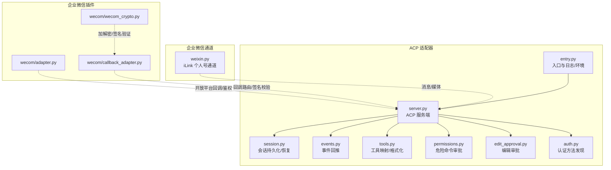
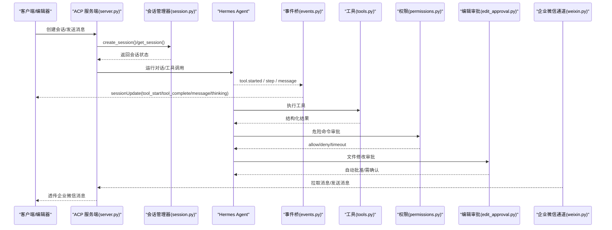
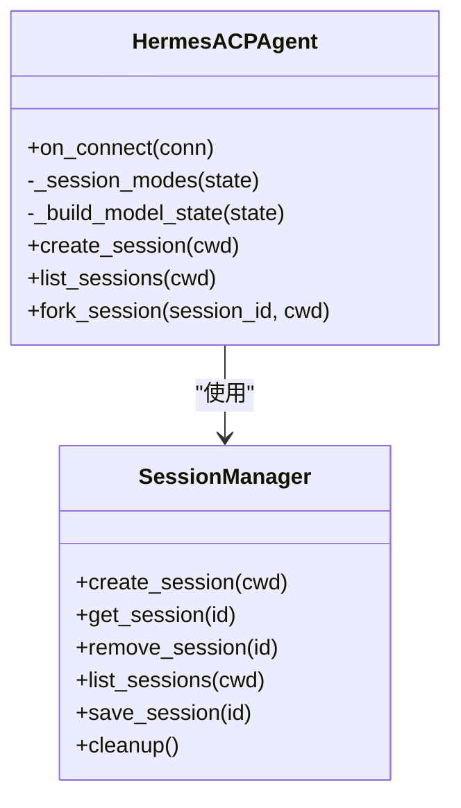
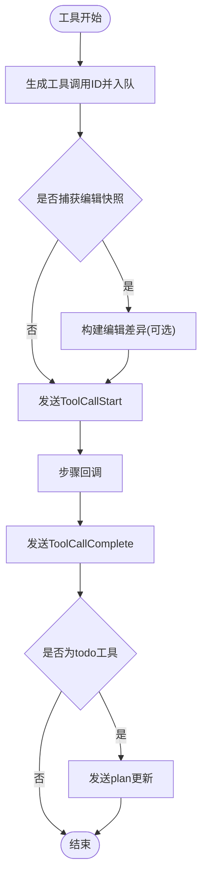
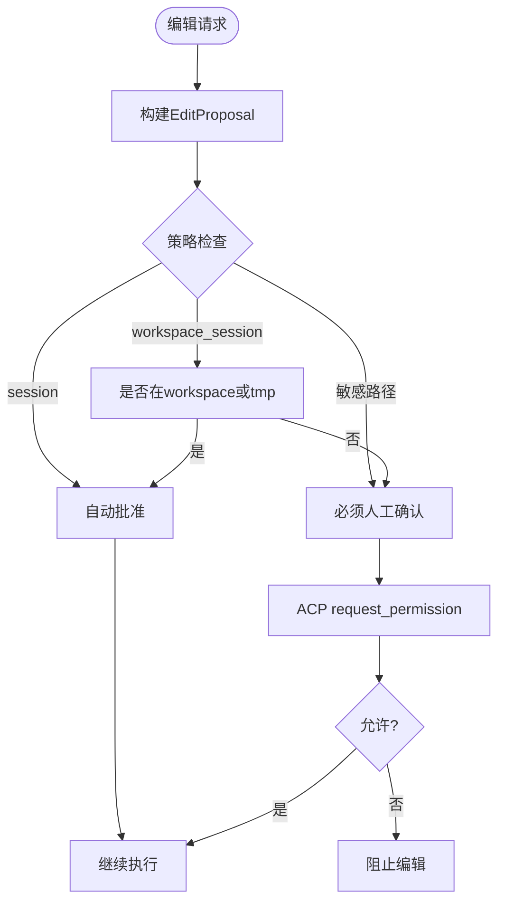
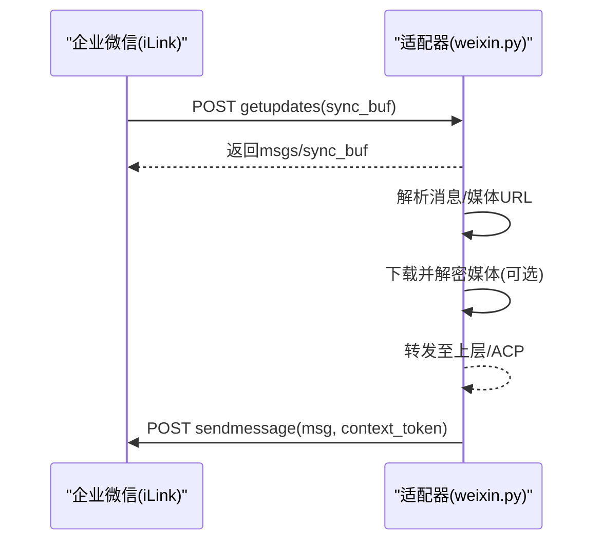
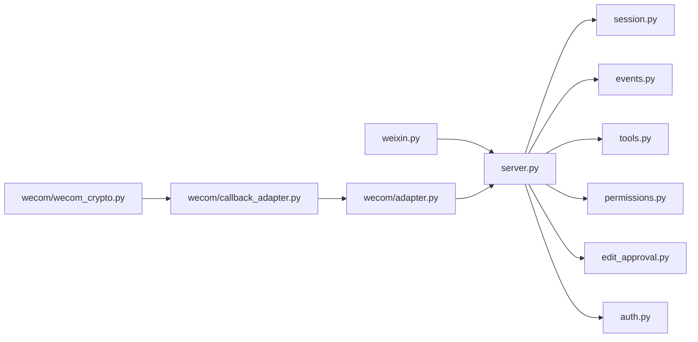

# 企业微信适配器

<cite>
**本文引用的文件**
- [acp_adapter/server.py](file://acp_adapter/server.py)
- [acp_adapter/auth.py](file://acp_adapter/auth.py)
- [acp_adapter/entry.py](file://acp_adapter/entry.py)
- [acp_adapter/events.py](file://acp_adapter/events.py)
- [acp_adapter/session.py](file://acp_adapter/session.py)
- [acp_adapter/tools.py](file://acp_adapter/tools.py)
- [acp_adapter/permissions.py](file://acp_adapter/permissions.py)
- [acp_adapter/edit_approval.py](file://acp_adapter/edit_approval.py)
- [gateway/platforms/weixin.py](file://gateway/platforms/weixin.py)
- [plugins/platforms/wecom/adapter.py](file://plugins/platforms/wecom/adapter.py)
- [plugins/platforms/wecom/callback_adapter.py](file://plugins/platforms/wecom/callback_adapter.py)
- [plugins/platforms/wecom/wecom_crypto.py](file://plugins/platforms/wecom/wecom_crypto.py)
</cite>

## 目录
1. [简介](#简介)
2. [项目结构](#项目结构)
3. [核心组件](#核心组件)
4. [架构总览](#架构总览)
5. [详细组件分析](#详细组件分析)
6. [依赖关系分析](#依赖关系分析)
7. [性能与限流](#性能与限流)
8. [安全与合规](#安全与合规)
9. [部署与运维](#部署与运维)
10. [故障诊断](#故障诊断)
11. [结论](#结论)
12. [附录：配置模板与最佳实践](#附录：配置模板与最佳实践)

## 简介
本指南面向在企业环境中集成“企业微信”的开发者，围绕企业特性（组织架构、部门权限、审批流程、第三方应用集成）、开放平台认证机制、API 限流策略、数据安全要求、消息处理与富文本支持、小程序与企业应用开发、日程管理、文档协作、视频会议、任务分配等主题，提供端到端的开发与落地方案。同时结合仓库中已有的 ACP 适配器与企业微信个人号通道实现，给出可复用的架构模式与工程化建议。

## 项目结构
本项目包含两类与企业微信相关的适配层：
- ACP 适配器（acp_adapter）：将 Hermes Agent 暴露为 Agent Client Protocol（ACP）服务，供编辑器或客户端通过 stdio 调用，具备会话管理、工具调用、权限审批、编辑审批、事件回推等能力。
- 企业微信通道（gateway/platforms/weixin.py）：基于 iLink Bot API 的个人微信通道，用于长轮询获取消息、发送消息、媒体上传下载、上下文 token 管理等。
- 插件式企业微信（plugins/platforms/wecom/*）：面向企业微信开放平台的插件化接入点，包含回调适配器、加密解密等能力。

图表来源
- [acp_adapter/server.py:1-120](file://acp_adapter/server.py#L1-L120)
- [acp_adapter/entry.py:1-120](file://acp_adapter/entry.py#L1-L120)
- [acp_adapter/session.py:1-120](file://acp_adapter/session.py#L1-L120)
- [acp_adapter/events.py:1-120](file://acp_adapter/events.py#L1-L120)
- [acp_adapter/tools.py:1-120](file://acp_adapter/tools.py#L1-L120)
- [acp_adapter/permissions.py:1-120](file://acp_adapter/permissions.py#L1-L120)
- [acp_adapter/edit_approval.py:1-120](file://acp_adapter/edit_approval.py#L1-L120)
- [gateway/platforms/weixin.py:1-120](file://gateway/platforms/weixin.py#L1-L120)
- [plugins/platforms/wecom/adapter.py](file://plugins/platforms/wecom/adapter.py)
- [plugins/platforms/wecom/callback_adapter.py](file://plugins/platforms/wecom/callback_adapter.py)
- [plugins/platforms/wecom/wecom_crypto.py](file://plugins/platforms/wecom/wecom_crypto.py)

章节来源
- [acp_adapter/server.py:1-120](file://acp_adapter/server.py#L1-L120)
- [acp_adapter/entry.py:1-120](file://acp_adapter/entry.py#L1-L120)
- [gateway/platforms/weixin.py:1-120](file://gateway/platforms/weixin.py#L1-L120)

## 核心组件
- ACP 服务端（HermesACPAgent）：封装 Hermes AIAgent，提供会话创建/恢复、模型选择、工具调用、计划更新、思考过程、消息流式推送等能力。
- 会话管理器（SessionManager）：维护内存中的会话状态，并持久化到共享 SessionDB，支持跨进程重启恢复、工作目录隔离、历史合并与去重。
- 事件桥接（events.py）：将 AIAgent 的工具开始/完成、思考、消息等事件转换为 ACP sessionUpdate 推送给客户端。
- 工具映射（tools.py）：将 Hermes 工具名映射为 ACP ToolKind，并对结果进行可读性优化与截断。
- 权限审批（permissions.py）：将 Hermes 的危险命令审批桥接到 ACP 的 request_permission，支持一次性允许、会话级、永久允许与拒绝。
- 编辑审批（edit_approval.py）：对 write_file/patch 等文件修改操作构建 diff，并在 ACP 端请求用户确认；支持按策略自动批准（如临时目录、工作区路径）。
- 认证方法（auth.py）：检测运行时 provider，并向 ACP 注册终端设置方法与已配置的 provider 认证方式。
- 企业微信通道（weixin.py）：基于 iLink 协议的个人微信通道，负责长轮询拉取消息、发送消息、媒体上传下载、上下文 token 缓存、频率限制与过期处理。
- 企业微信插件（wecom/*）：面向企业微信开放平台的回调与加密模块，用于接收回调、验签、解密消息体等。

章节来源
- [acp_adapter/server.py:566-800](file://acp_adapter/server.py#L566-L800)
- [acp_adapter/session.py:175-387](file://acp_adapter/session.py#L175-L387)
- [acp_adapter/events.py:110-280](file://acp_adapter/events.py#L110-L280)
- [acp_adapter/tools.py:20-120](file://acp_adapter/tools.py#L20-L120)
- [acp_adapter/permissions.py:18-183](file://acp_adapter/permissions.py#L18-L183)
- [acp_adapter/edit_approval.py:25-231](file://acp_adapter/edit_approval.py#L25-L231)
- [acp_adapter/auth.py:1-80](file://acp_adapter/auth.py#L1-L80)
- [gateway/platforms/weixin.py:90-120](file://gateway/platforms/weixin.py#L90-L120)

## 架构总览
下图展示了从客户端到 ACP 适配器再到 Hermes Agent 的核心调用链，以及与企业微信通道的交互。

图表来源
- [acp_adapter/server.py:566-800](file://acp_adapter/server.py#L566-L800)
- [acp_adapter/session.py:199-387](file://acp_adapter/session.py#L199-L387)
- [acp_adapter/events.py:110-280](file://acp_adapter/events.py#L110-L280)
- [acp_adapter/tools.py:20-120](file://acp_adapter/tools.py#L20-L120)
- [acp_adapter/permissions.py:110-183](file://acp_adapter/permissions.py#L110-L183)
- [acp_adapter/edit_approval.py:233-339](file://acp_adapter/edit_approval.py#L233-L339)
- [gateway/platforms/weixin.py:447-502](file://gateway/platforms/weixin.py#L447-L502)

## 详细组件分析

### ACP 适配器（HermesACPAgent）
- 会话生命周期：创建、恢复、分叉、清理；支持跨进程重启后从数据库恢复历史。
- 模型选择：聚合提供商与自定义命名端点，限制每提供商最大模型数，避免下拉列表过大。
- 工具与内容块：将 ACP 的内容块（文本、图片、资源链接、嵌入资源）转换为 Hermes/OpenAI 兼容格式。
- 错误与异常：捕获资源读取失败、网络超时等，并以友好文本提示。

图表来源
- [acp_adapter/server.py:566-800](file://acp_adapter/server.py#L566-L800)
- [acp_adapter/session.py:175-387](file://acp_adapter/session.py#L175-L387)

章节来源
- [acp_adapter/server.py:566-800](file://acp_adapter/server.py#L566-L800)
- [acp_adapter/session.py:175-387](file://acp_adapter/session.py#L175-L387)

### 事件桥接（events.py）
- 工具进度：将 tool.started 转为 ToolCallStart，跟踪同名工具的并发调用，确保 completion 对应正确 ID。
- 思考过程：将 thinking 文本以 agent_thought_text 推送。
- 步骤回调：解析工具调用结果，生成 ToolCallComplete；当工具为 todo 时，额外生成 plan 更新。
- 消息回调：将 agent 输出文本分段推送。

图表来源
- [acp_adapter/events.py:110-280](file://acp_adapter/events.py#L110-L280)

章节来源
- [acp_adapter/events.py:110-280](file://acp_adapter/events.py#L110-L280)

### 工具映射与结果格式化（tools.py）
- 工具类型映射：将 Hermes 工具名映射为 ACP ToolKind（read/edit/execute/fetch/think/other）。
- 标题生成：为常见工具生成人类可读标题，便于 UI 展示。
- 结果格式化：对 read_file、search_files、execute_code、web_search、process、delegate、memory、browser 等工具结果进行结构化摘要与截断，提升可读性。
- 失败判定：保守地识别结构化失败（退出码非零、success=false、error 字段），避免误标成功。

章节来源
- [acp_adapter/tools.py:20-120](file://acp_adapter/tools.py#L20-L120)
- [acp_adapter/tools.py:213-800](file://acp_adapter/tools.py#L213-L800)

### 权限审批（permissions.py）
- 选项映射：将 ACP 的 allow_once/allow_session/allow_always/deny/deny_always 映射为 Hermes 审批语义。
- 工具调用包装：为权限请求构造 ToolCallUpdate，附带命令与描述。
- 超时与异常：默认超时内未响应视为 deny；异常情况下记录日志并返回 deny。

章节来源
- [acp_adapter/permissions.py:18-183](file://acp_adapter/permissions.py#L18-L183)

### 编辑审批（edit_approval.py）
- 提案构建：针对 write_file 与 patch（replace/patch 模式）构建 EditProposal，读取旧内容并计算新内容。
- 自动批准策略：根据策略（ask/workspace_session/session）与敏感路径（.git/.ssh、敏感文件名）决定是否跳过确认。
- 审批桥接：在 ACP 端发起 request_permission，支持一次性允许与拒绝；异常或超时时默认拒绝。

图表来源
- [acp_adapter/edit_approval.py:178-231](file://acp_adapter/edit_approval.py#L178-L231)
- [acp_adapter/edit_approval.py:233-339](file://acp_adapter/edit_approval.py#L233-L339)

章节来源
- [acp_adapter/edit_approval.py:178-339](file://acp_adapter/edit_approval.py#L178-L339)

### 认证方法（auth.py）
- Provider 检测：从运行时 provider 解析 api_key/provider，支持字符串密钥与 callable 令牌提供者。
- 认证方法注册：向 ACP 注册终端设置方法与当前 provider 的认证方式，保证首次安装也能引导配置。

章节来源
- [acp_adapter/auth.py:1-80](file://acp_adapter/auth.py#L1-L80)

### 企业微信通道（weixin.py）
- 长轮询拉取：通过 getupdates 接口拉取消息，支持同步缓冲与超时处理。
- 发送消息：sendmessage 接口，携带 context_token 维持会话上下文。
- 媒体处理：AES-128-ECB 加密/解密，CDN 上传下载，URL 白名单校验防止 SSRF。
- 频率限制与过期：识别 rate limit 与 session expired 错误码，退避重试。
- 上下文 token 缓存：按账户+用户维度持久化 context_token，提高发送成功率。

图表来源
- [gateway/platforms/weixin.py:447-502](file://gateway/platforms/weixin.py#L447-L502)
- [gateway/platforms/weixin.py:549-607](file://gateway/platforms/weixin.py#L549-L607)
- [gateway/platforms/weixin.py:661-684](file://gateway/platforms/weixin.py#L661-L684)

章节来源
- [gateway/platforms/weixin.py:90-120](file://gateway/platforms/weixin.py#L90-L120)
- [gateway/platforms/weixin.py:447-684](file://gateway/platforms/weixin.py#L447-L684)

### 企业微信插件（wecom/*）
- adapter.py：企业微信开放平台回调入口，负责路由与业务处理。
- callback_adapter.py：回调适配层，处理签名校验、消息分发。
- wecom_crypto.py：加解密与签名验证，保障回调数据完整性与机密性。

章节来源
- [plugins/platforms/wecom/adapter.py](file://plugins/platforms/wecom/adapter.py)
- [plugins/platforms/wecom/callback_adapter.py](file://plugins/platforms/wecom/callback_adapter.py)
- [plugins/platforms/wecom/wecom_crypto.py](file://plugins/platforms/wecom/wecom_crypto.py)

## 依赖关系分析
- ACP 适配器依赖 Hermes CLI 的配置与运行时 provider 解析，用于模型选择与认证方法发现。
- 会话管理器依赖 SessionDB 进行持久化，支持跨进程恢复与搜索。
- 事件桥接依赖 ACP SDK 的 session_update 推送能力。
- 工具映射依赖 Hermes 工具集，对结果进行格式化与截断。
- 权限与编辑审批依赖 ACP 的 request_permission 与工具调用更新。
- 企业微信通道依赖 aiohttp 与 cryptography，实现 HTTP 通信与 AES 加解密。
- 企业微信插件依赖回调适配与加密模块，确保回调安全。

图表来源
- [acp_adapter/server.py:1-120](file://acp_adapter/server.py#L1-L120)
- [acp_adapter/session.py:1-120](file://acp_adapter/session.py#L1-L120)
- [acp_adapter/events.py:1-120](file://acp_adapter/events.py#L1-L120)
- [acp_adapter/tools.py:1-120](file://acp_adapter/tools.py#L1-L120)
- [acp_adapter/permissions.py:1-120](file://acp_adapter/permissions.py#L1-L120)
- [acp_adapter/edit_approval.py:1-120](file://acp_adapter/edit_approval.py#L1-L120)
- [acp_adapter/auth.py:1-80](file://acp_adapter/auth.py#L1-L80)
- [gateway/platforms/weixin.py:1-120](file://gateway/platforms/weixin.py#L1-L120)
- [plugins/platforms/wecom/adapter.py](file://plugins/platforms/wecom/adapter.py)
- [plugins/platforms/wecom/callback_adapter.py](file://plugins/platforms/wecom/callback_adapter.py)
- [plugins/platforms/wecom/wecom_crypto.py](file://plugins/platforms/wecom/wecom_crypto.py)

章节来源
- [acp_adapter/server.py:1-120](file://acp_adapter/server.py#L1-L120)
- [gateway/platforms/weixin.py:1-120](file://gateway/platforms/weixin.py#L1-L120)

## 性能与限流
- 会话分页：list_sessions 固定页大小，避免大数据量导致性能下降。
- 模型选择上限：每提供商最多显示一定数量的模型，避免客户端渲染卡顿。
- 资源大小限制：图片与嵌入资源限制最大字节数，防止大文件阻塞。
- 企业微信通道：
  - 长轮询超时与退避：getupdates 超时处理，避免长时间占用连接。
  - 频率限制：识别 rate limit 错误码，采用退避重试。
  - 媒体下载：仅允许白名单域名，减少 SSRF 风险与不必要流量。

章节来源
- [acp_adapter/server.py:200-224](file://acp_adapter/server.py#L200-L224)
- [gateway/platforms/weixin.py:110-120](file://gateway/platforms/weixin.py#L110-L120)
- [gateway/platforms/weixin.py:624-654](file://gateway/platforms/weixin.py#L624-L654)

## 安全与合规
- 认证与授权：
  - ACP 认证方法：检测运行时 provider，支持终端设置与已配置 provider 认证。
  - 企业微信回调：签名校验与消息解密，确保回调数据完整与机密。
- 数据安全：
  - 媒体 URL 白名单：仅允许企业微信 CDN 域名，防止 SSRF。
  - 敏感路径保护：编辑审批对 .git/.ssh 等路径强制人工确认。
  - 错误信息脱敏：终端工具输出与错误信息中不泄露密钥形状字符串。
- 多租户与隔离：
  - 会话工作目录隔离：每个 ACP 会话绑定独立 cwd，工具执行受限于该目录。
  - 上下文 token 缓存：按账户+用户维度存储，避免跨会话污染。

章节来源
- [acp_adapter/auth.py:11-80](file://acp_adapter/auth.py#L11-L80)
- [gateway/platforms/weixin.py:624-654](file://gateway/platforms/weixin.py#L624-L654)
- [acp_adapter/edit_approval.py:192-231](file://acp_adapter/edit_approval.py#L192-L231)
- [tests/tools/test_terminal_error_redaction.py:1-154](file://tests/tools/test_terminal_error_redaction.py#L1-L154)

## 部署与运维
- 启动入口：
  - ACP 适配器：通过 entry.py 加载环境变量、配置日志、启动 ACP 服务。
  - 企业微信通道：通过 gateway/platforms/weixin.py 接入 iLink 协议。
- 环境变量与配置：
  - 从 HERMES_HOME 下的 .env 加载配置。
  - 企业微信凭据通过 get_secret 或环境变量注入。
- 监控与告警：
  - 日志输出至 stderr，stdout 保留给 ACP JSON-RPC。
  - 关键错误（网络超时、权限超时、编辑审批失败）记录日志。
- 故障自愈：
  - 会话恢复：进程重启后从 SessionDB 恢复会话。
  - 频率限制：识别 rate limit 并退避重试。
  - 会话过期：识别 session expired 并重新登录或刷新 token。

章节来源
- [acp_adapter/entry.py:81-120](file://acp_adapter/entry.py#L81-L120)
- [acp_adapter/entry.py:220-283](file://acp_adapter/entry.py#L220-L283)
- [gateway/platforms/weixin.py:110-120](file://gateway/platforms/weixin.py#L110-L120)

## 故障诊断
- 常见问题：
  - 无法拉取消息：检查 getupdates 超时与网络连通性。
  - 发送失败：检查 context_token 是否正确传递。
  - 媒体下载失败：检查 CDN URL 是否在白名单，证书是否可用。
  - 权限审批超时：检查 ACP 客户端是否响应，调整超时时间。
  - 编辑审批被拒：检查策略与敏感路径，确认自动批准条件。
- 调试技巧：
  - 查看 stderr 日志，定位具体错误堆栈。
  - 检查 SessionDB 中的会话历史与元数据。
  - 使用 ACP 客户端的 sessionUpdate 观察事件流。

章节来源
- [gateway/platforms/weixin.py:447-502](file://gateway/platforms/weixin.py#L447-L502)
- [acp_adapter/permissions.py:110-183](file://acp_adapter/permissions.py#L110-L183)
- [acp_adapter/edit_approval.py:233-339](file://acp_adapter/edit_approval.py#L233-L339)

## 结论
本指南基于仓库中的 ACP 适配器与企业微信通道实现，提供了企业微信适配的完整架构与工程实践。通过会话管理、事件桥接、工具映射、权限与编辑审批、认证与安全、限流与恢复等机制，可实现稳定、安全、可扩展的企业级集成。建议在部署时遵循最小权限原则，严格校验回调与媒体 URL，合理配置超时与重试策略，并结合监控与日志进行持续优化。

## 附录：配置模板与最佳实践
- 环境变量：
  - WEIXIN_*：企业微信相关凭据，通过 get_secret 或环境变量注入。
  - HERMES_HOME：Hermes 主目录，.env 文件存放于此。
- 配置项：
  - model.provider/model.default：指定默认模型与提供商。
  - mcp_servers：启用 MCP 服务器，扩展工具能力。
- 最佳实践：
  - 使用会话工作目录隔离，避免跨会话干扰。
  - 对敏感路径启用强制人工确认。
  - 合理设置超时与重试，避免雪崩效应。
  - 定期清理过期会话与上下文 token。
  - 使用白名单限制媒体 URL，防止 SSRF。

章节来源
- [acp_adapter/entry.py:104-120](file://acp_adapter/entry.py#L104-L120)
- [gateway/platforms/weixin.py:264-296](file://gateway/platforms/weixin.py#L264-L296)
- [acp_adapter/session.py:112-156](file://acp_adapter/session.py#L112-L156)