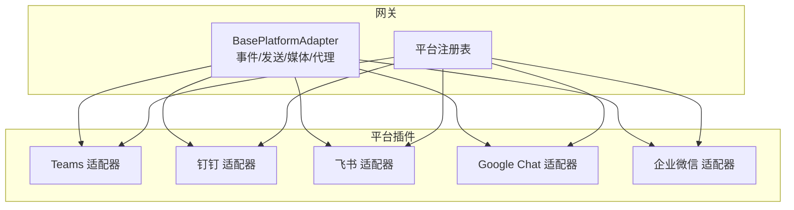
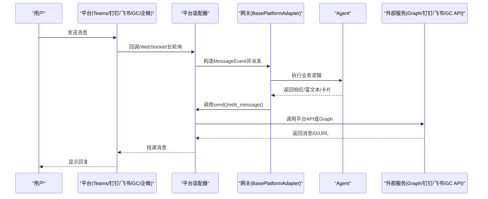
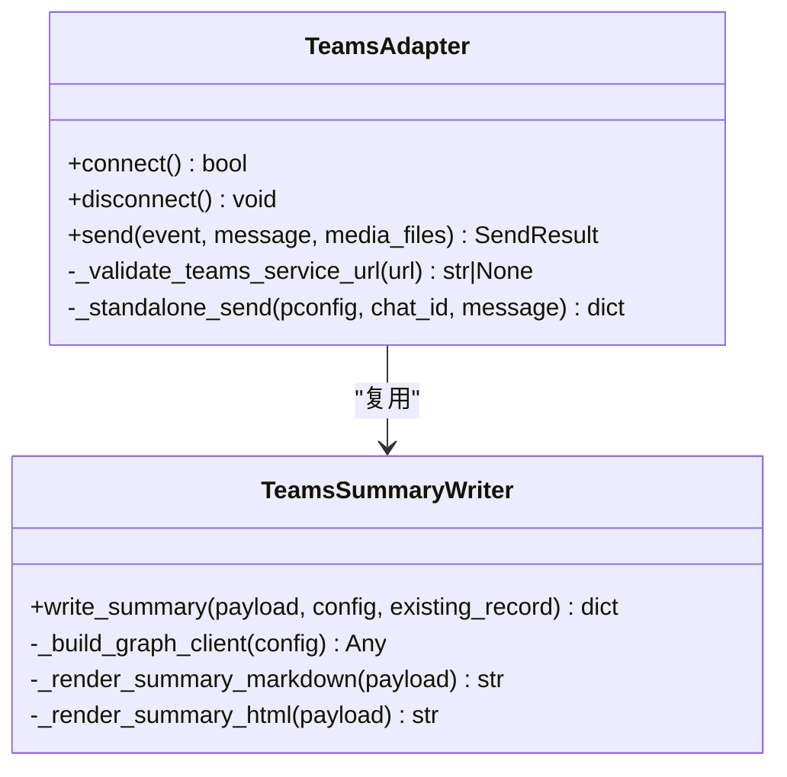
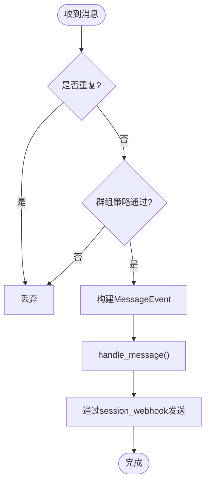
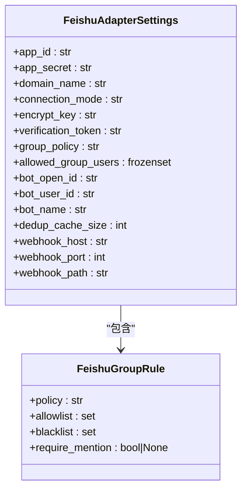
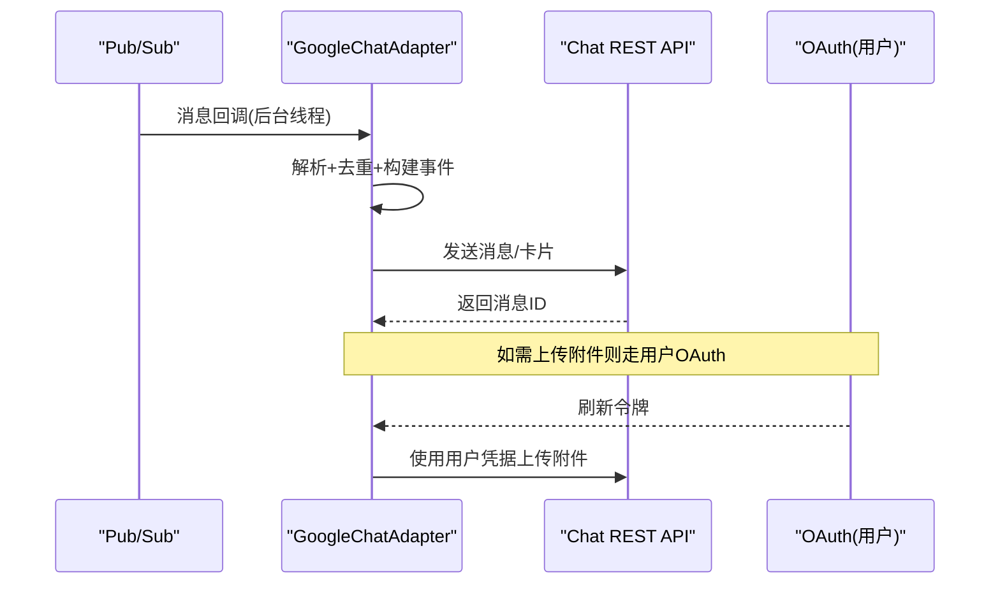
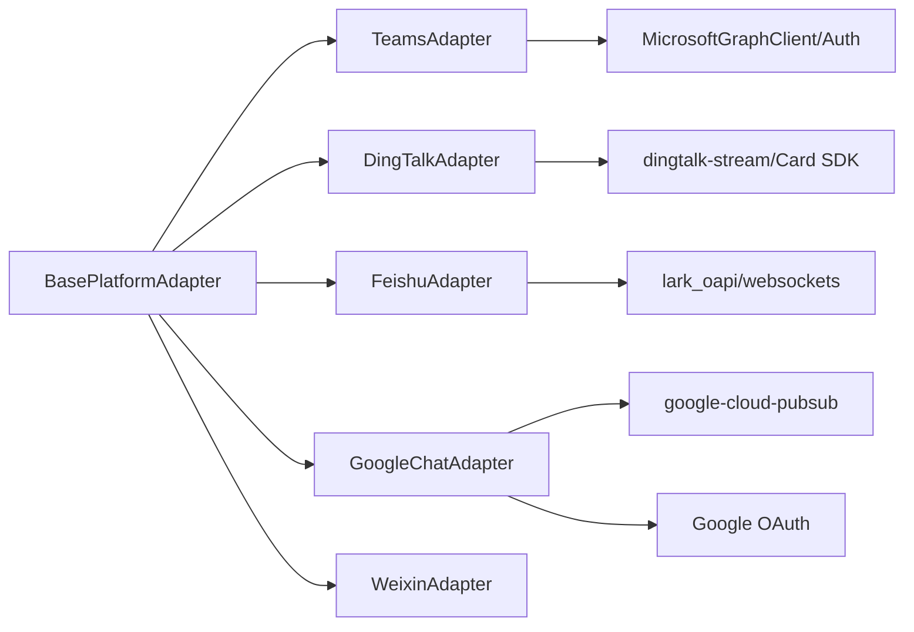

# 企业级平台适配器

<cite>
**本文引用的文件**
- [gateway/platforms/base.py](file://gateway/platforms/base.py)
- [plugins/platforms/teams/adapter.py](file://plugins/platforms/teams/adapter.py)
- [plugins/platforms/dingtalk/adapter.py](file://plugins/platforms/dingtalk/adapter.py)
- [plugins/platforms/feishu/adapter.py](file://plugins/platforms/feishu/adapter.py)
- [plugins/platforms/google_chat/adapter.py](file://plugins/platforms/google_chat/adapter.py)
- [gateway/platforms/weixin.py](file://gateway/platforms/weixin.py)
- [hermes_cli/dingtalk_auth.py](file://hermes_cli/dingtalk_auth.py)
- [tools/microsoft_graph_client.py](file://tools/microsoft_graph_client.py)
- [tools/microsoft_graph_auth.py](file://tools/microsoft_graph_auth.py)
- [plugins/platforms/google_chat/oauth.py](file://plugins/platforms/google_chat/oauth.py)
</cite>

## 目录
1. [简介](#简介)
2. [项目结构](#项目结构)
3. [核心组件](#核心组件)
4. [架构总览](#架构总览)
5. [详细组件分析](#详细组件分析)
6. [依赖关系分析](#依赖关系分析)
7. [性能与限流](#性能与限流)
8. [故障排除指南](#故障排除指南)
9. [结论](#结论)
10. [附录：部署、监控与合规](#附录部署监控与合规)

## 简介
本指南面向在企业环境中集成 Microsoft Teams、钉钉、企业微信、飞书、Google Chat 等协作平台的开发者。文档围绕以下目标展开：
- 统一适配器抽象与平台差异处理（消息收发、媒体、线程与会话）
- 企业级安全与合规（OAuth、权限、审计、网络白名单、SSRF 防护）
- 多租户与数据隔离（会话键、组织域、用户标识映射）
- 企业特性适配（审批、日程、文档协作、视频会议）
- 可观测性（监控告警、日志脱敏、错误分类）
- 部署配置与排障（依赖懒加载、重试退避、断线重连）

## 项目结构
本项目采用“网关 + 插件化平台”的架构：
- 网关层提供统一的平台适配器基类、事件模型、发送结果、媒体缓存、代理与入站媒体大小限制等通用能力
- 各平台以插件形式实现，遵循统一接口，独立管理连接、鉴权、消息路由与平台特性

图表来源
- [gateway/platforms/base.py:1-120](file://gateway/platforms/base.py#L1-L120)
- [plugins/platforms/teams/adapter.py:753-800](file://plugins/platforms/teams/adapter.py#L753-L800)
- [plugins/platforms/dingtalk/adapter.py:230-320](file://plugins/platforms/dingtalk/adapter.py#L230-L320)
- [plugins/platforms/feishu/adapter.py:404-450](file://plugins/platforms/feishu/adapter.py#L404-L450)
- [plugins/platforms/google_chat/adapter.py:625-700](file://plugins/platforms/google_chat/adapter.py#L625-L700)

章节来源
- [gateway/platforms/base.py:1-120](file://gateway/platforms/base.py#L1-L120)

## 核心组件
- BasePlatformAdapter：定义所有平台必须实现的接口，包括消息接收、发送、媒体处理、线程元数据、自动 TTS、入站媒体大小限制、代理解析等
- MessageEvent/SendResult：统一的事件与发送结果模型，屏蔽平台差异
- 媒体缓存与下载：统一将入站图片/音视频下载到本地缓存，避免平台临时链接失效
- 代理与安全：支持 HTTP/SOCKS 代理、NO_PROXY 匹配、macOS 系统代理检测、SSRF 重定向保护

章节来源
- [gateway/platforms/base.py:1-120](file://gateway/platforms/base.py#L1-L120)
- [gateway/platforms/base.py:707-800](file://gateway/platforms/base.py#L707-L800)
- [gateway/platforms/base.py:417-517](file://gateway/platforms/base.py#L417-L517)

## 架构总览
下图展示从平台到网关再到 Agent 的核心调用链，以及各平台特有的认证与出站通道。

图表来源
- [plugins/platforms/teams/adapter.py:753-800](file://plugins/platforms/teams/adapter.py#L753-L800)
- [plugins/platforms/dingtalk/adapter.py:319-380](file://plugins/platforms/dingtalk/adapter.py#L319-L380)
- [plugins/platforms/feishu/adapter.py:404-450](file://plugins/platforms/feishu/adapter.py#L404-L450)
- [plugins/platforms/google_chat/adapter.py:625-700](file://plugins/platforms/google_chat/adapter.py#L625-L700)
- [gateway/platforms/base.py:1-120](file://gateway/platforms/base.py#L1-L120)

## 详细组件分析

### Microsoft Teams 适配器
- 认证与连接
  - 使用 microsoft-teams-apps SDK，通过 Webhook/aiohttp 桥接接收活动
  - 支持环境变量与配置项注入 client_id/client_secret/tenant_id/port/host/service_url
  - 支持 Graph 模式直接发送（需 access_token），或 Incoming Webhook 模式
- 消息与富媒体
  - 支持文本、卡片、富文本；长消息按平台限制拆分
  - 会议摘要写入支持 Markdown/HTML 渲染
- 安全与合规
  - service_url 白名单校验，防止 SSRF/令牌外泄
  - chat_id 字符集校验，防止路径穿越
- 多租户
  - tenant_id 区分租户；会话键基于平台上下文隔离
- 企业特性
  - 会议总结、频道消息、聊天消息两种投递模式

图表来源
- [plugins/platforms/teams/adapter.py:753-800](file://plugins/platforms/teams/adapter.py#L753-L800)
- [plugins/platforms/teams/adapter.py:170-380](file://plugins/platforms/teams/adapter.py#L170-L380)
- [plugins/platforms/teams/adapter.py:529-649](file://plugins/platforms/teams/adapter.py#L529-L649)

章节来源
- [plugins/platforms/teams/adapter.py:753-800](file://plugins/platforms/teams/adapter.py#L753-L800)
- [plugins/platforms/teams/adapter.py:170-380](file://plugins/platforms/teams/adapter.py#L170-L380)
- [plugins/platforms/teams/adapter.py:529-649](file://plugins/platforms/teams/adapter.py#L529-L649)

### 钉钉 适配器
- 认证与连接
  - 使用 Stream Mode（WebSocket）保持长连接，自动重连与指数退避
  - 支持 Card SDK（可选）用于 AI 卡片编辑与流式更新
- 消息与富媒体
  - 支持文本、图片、音视频、文件、富文本；@提及识别
  - 会话 Webhook 缓存与过期管理，保证回复可达
- 群组策略
  - require_mention、free_response_chats、allowed_chats、mention_patterns、allowed_users
- 安全与合规
  - 严格校验 session_webhook 域名，避免 SSRF
  - 卡片流式状态清理，避免残留“思考中”卡片
- 多租户
  - 通过 app_key/secret 与机器人 code 区分租户与应用

图表来源
- [plugins/platforms/dingtalk/adapter.py:319-380](file://plugins/platforms/dingtalk/adapter.py#L319-L380)
- [plugins/platforms/dingtalk/adapter.py:470-593](file://plugins/platforms/dingtalk/adapter.py#L470-L593)
- [plugins/platforms/dingtalk/adapter.py:661-778](file://plugins/platforms/dingtalk/adapter.py#L661-L778)

章节来源
- [plugins/platforms/dingtalk/adapter.py:230-320](file://plugins/platforms/dingtalk/adapter.py#L230-L320)
- [plugins/platforms/dingtalk/adapter.py:470-593](file://plugins/platforms/dingtalk/adapter.py#L470-L593)
- [plugins/platforms/dingtalk/adapter.py:661-778](file://plugins/platforms/dingtalk/adapter.py#L661-L778)

### 飞书 适配器
- 认证与连接
  - 支持 WebSocket 长连接与 Webhook 两种传输
  - 支持验证 Token 作为第二层鉴权
- 身份模型
  - open_id（应用级）、user_id（租户级）、union_id（开发者级）
  - 会话键优先使用 union_id 以保证跨应用稳定性
- 消息与富媒体
  - 支持文本、图片、音视频、文件、富文本、卡片按钮点击事件
  - 支持批处理与去重、异常追踪、Webhook 体大小限制
- 企业特性
  - 审批流程按钮映射、评论规则、会议邀请等扩展能力
- 安全与合规
  - Webhook 速率限制与异常阈值、卡片动作去重窗口

图表来源
- [plugins/platforms/feishu/adapter.py:404-450](file://plugins/platforms/feishu/adapter.py#L404-L450)
- [plugins/platforms/feishu/adapter.py:441-450](file://plugins/platforms/feishu/adapter.py#L441-L450)

章节来源
- [plugins/platforms/feishu/adapter.py:404-450](file://plugins/platforms/feishu/adapter.py#L404-L450)
- [plugins/platforms/feishu/adapter.py:441-450](file://plugins/platforms/feishu/adapter.py#L441-L450)

### Google Chat 适配器
- 认证与连接
  - 支持 Pub/Sub 订阅与 HTTP 回调两种入站方式
  - 使用 Service Account 与 OAuth 双通道：Bot 发消息用 SA，上传附件需用户 OAuth
- 并发模型
  - Pub/Sub 回调在后台线程，通过 run_coroutine_threadsafe 调度到事件循环
  - 所有 Chat REST 调用通过 to_thread 避免阻塞事件循环
- 消息与富媒体
  - 支持卡片、按钮、选择输入、图片、分隔符等
  - 文本长度限制与重试退避（429/5xx）
- 线程与会话
  - 持久化线程计数，区分 DM 主流程与侧线程，避免上下文泄漏
- 安全与合规
  - 附件下载仅允许可信 Google 域名，防 SSRF
  - 错误信息脱敏（订阅路径、SA 邮箱）

图表来源
- [plugins/platforms/google_chat/adapter.py:625-700](file://plugins/platforms/google_chat/adapter.py#L625-L700)
- [plugins/platforms/google_chat/adapter.py:257-284](file://plugins/platforms/google_chat/adapter.py#L257-L284)
- [plugins/platforms/google_chat/adapter.py:308-339](file://plugins/platforms/google_chat/adapter.py#L308-L339)

章节来源
- [plugins/platforms/google_chat/adapter.py:625-700](file://plugins/platforms/google_chat/adapter.py#L625-L700)
- [plugins/platforms/google_chat/adapter.py:257-284](file://plugins/platforms/google_chat/adapter.py#L257-L284)
- [plugins/platforms/google_chat/adapter.py:308-339](file://plugins/platforms/google_chat/adapter.py#L308-L339)

### 企业微信 适配器
- 认证与连接
  - 基于 iLink Bot API 长轮询 getupdates
  - 每次出站需回显 context_token 以保持会话
- 媒体与加密
  - 媒体通过 AES-128-ECB 加密 CDN 协议上传/下载
  - 严格白名单校验下载域名，防 SSRF
- 会话与状态
  - 持久化 context_token 与 typing ticket 缓存
  - 支持打字状态、二维码登录辅助

章节来源
- [gateway/platforms/weixin.py:1-120](file://gateway/platforms/weixin.py#L1-L120)
- [gateway/platforms/weixin.py:240-347](file://gateway/platforms/weixin.py#L240-L347)
- [gateway/platforms/weixin.py:624-684](file://gateway/platforms/weixin.py#L624-L684)

## 依赖关系分析
- 平台适配器均继承自 BasePlatformAdapter，复用统一的消息事件、发送结果、媒体缓存、代理与安全工具
- 各平台通过插件机制按需加载，避免启动时引入重型依赖
- 企业级能力（如 Graph、钉钉卡片、飞书审批、Google OAuth）通过工具模块与第三方 SDK 接入

图表来源
- [gateway/platforms/base.py:1-120](file://gateway/platforms/base.py#L1-L120)
- [plugins/platforms/teams/adapter.py:753-800](file://plugins/platforms/teams/adapter.py#L753-L800)
- [plugins/platforms/dingtalk/adapter.py:230-320](file://plugins/platforms/dingtalk/adapter.py#L230-L320)
- [plugins/platforms/feishu/adapter.py:404-450](file://plugins/platforms/feishu/adapter.py#L404-L450)
- [plugins/platforms/google_chat/adapter.py:625-700](file://plugins/platforms/google_chat/adapter.py#L625-L700)

章节来源
- [gateway/platforms/base.py:1-120](file://gateway/platforms/base.py#L1-L120)

## 性能与限流
- 入站媒体大小限制：默认 128 MiB，可通过配置关闭或调整，防止内存溢出
- 代理与 NO_PROXY：支持 HTTP/SOCKS 代理、macOS 系统代理检测与精确匹配
- 平台限流与重试
  - Teams：Bot Framework 活动体大小限制与超时控制
  - 钉钉：重连退避、卡片流式状态清理
  - 飞书：Webhook 速率限制、卡片动作去重窗口
  - Google Chat：429/5xx 重试退避、线程计数持久化
- 资源占用优化：平台 SDK 与重型依赖懒加载，减少进程冷启动开销

章节来源
- [gateway/platforms/base.py:707-800](file://gateway/platforms/base.py#L707-L800)
- [gateway/platforms/base.py:417-517](file://gateway/platforms/base.py#L417-L517)
- [plugins/platforms/dingtalk/adapter.py:319-380](file://plugins/platforms/dingtalk/adapter.py#L319-L380)
- [plugins/platforms/google_chat/adapter.py:257-284](file://plugins/platforms/google_chat/adapter.py#L257-L284)

## 故障排除指南
- 认证失败
  - Teams：检查 client_id/secret/tenant_id 与服务 URL 白名单
  - 钉钉：确认 Stream 客户端已安装且凭据正确
  - 飞书：验证 App ID/Secret、加密 Key、验证 Token
  - Google Chat：确认 SA 权限与 OAuth 刷新令牌
- 网络问题
  - 代理配置：检查 HTTPS_PROXY/HTTP_PROXY/ALL_PROXY 与 NO_PROXY
  - macOS 系统代理：自动检测并生效
  - 域名白名单：确保下载/回调域名在白名单内
- 限流与重试
  - 观察 429/5xx 错误，启用重试与退避
  - 飞书 Webhook 异常阈值告警
- 媒体与缓存
  - 入站媒体超限被拒绝，调整 max_inbound_media_bytes
  - 检查本地缓存目录权限与空间

章节来源
- [gateway/platforms/base.py:417-517](file://gateway/platforms/base.py#L417-L517)
- [gateway/platforms/base.py:707-800](file://gateway/platforms/base.py#L707-L800)
- [plugins/platforms/teams/adapter.py:529-649](file://plugins/platforms/teams/adapter.py#L529-L649)
- [plugins/platforms/dingtalk/adapter.py:319-380](file://plugins/platforms/dingtalk/adapter.py#L319-L380)
- [plugins/platforms/feishu/adapter.py:404-450](file://plugins/platforms/feishu/adapter.py#L404-L450)
- [plugins/platforms/google_chat/adapter.py:257-284](file://plugins/platforms/google_chat/adapter.py#L257-L284)

## 结论
通过统一的 BasePlatformAdapter 与插件化平台适配器，项目实现了跨企业协作平台的一致接入能力。各平台在认证、消息、媒体、线程与会话方面各有差异，但均可通过配置与环境变量进行灵活定制。结合严格的网络安全策略、限流与重试机制、以及完善的可观测性与故障排除能力，能够满足企业级对安全、合规与稳定性的要求。

## 附录：部署、监控与合规

### OAuth 与企业应用注册
- Teams
  - 在 Azure AD 注册应用，配置 client_id/secret/tenant_id
  - 支持 Graph 模式与 Incoming Webhook 两种投递
  - 参考：[tools/microsoft_graph_client.py](file://tools/microsoft_graph_client.py)、[tools/microsoft_graph_auth.py](file://tools/microsoft_graph_auth.py)
- 钉钉
  - 在钉钉开放平台创建机器人，获取 client_id/secret
  - 支持 Stream Mode 与 Card SDK
  - 参考：[hermes_cli/dingtalk_auth.py](file://hermes_cli/dingtalk_auth.py)
- 飞书
  - 在飞书开放平台创建应用，配置 App ID/Secret、加密 Key、验证 Token
  - 支持 WebSocket/Webhook 两种传输
- Google Chat
  - 使用 Service Account 与 OAuth 双通道；用户附件上传需用户授权
  - 参考：[plugins/platforms/google_chat/oauth.py](file://plugins/platforms/google_chat/oauth.py)

### 组织架构集成、权限管理与审计
- 组织域与用户标识
  - 飞书：open_id/user_id/union_id 三级标识，会话键优先 union_id
  - 钉钉：staff_id/sender_id 白名单与群组策略
  - Google Chat：邮件地址与空间成员关系
- 权限最小化
  - Teams：仅申请必要 Graph 权限
  - 钉钉：仅开启所需机器人能力
  - 飞书：按功能申请最小权限集
  - Google Chat：chat.bot 与 pubsub 权限，附件上传走用户 OAuth
- 审计日志
  - 记录关键操作（认证、消息收发、卡片交互）
  - 敏感信息脱敏（订阅路径、SA 邮箱、URL 查询参数）

### 企业网络配置
- 代理与 NO_PROXY
  - 支持 HTTP/SOCKS 代理与 macOS 系统代理
  - 支持通配符与 CIDR 匹配
- 域名白名单
  - 企业微信：iLink/CDN 域名白名单
  - Google Chat：仅允许可信 Google 域名
  - Teams：Bot Framework 服务 URL 白名单

### 企业特性适配
- 审批流程
  - 飞书：审批按钮映射与标签
- 日程管理
  - Teams：会议总结与频道/聊天消息投递
- 文档协作
  - 飞书：文档与媒体引用
- 视频会议
  - Teams：会议相关活动与摘要

### 多租户支持与数据隔离
- 会话键隔离：基于平台上下文与用户标识（union_id/staff_id/email）
- 租户隔离：Teams tenant_id、钉钉应用 key、飞书 App ID、Google 项目/空间
- 隐私保护：URL 脱敏、错误信息脱敏、入站媒体大小限制

### 部署配置、监控告警与故障排除
- 依赖懒加载：避免冷启动开销
- 重试与退避：平台 API 瞬态错误自动重试
- 监控指标：连接状态、速率限制命中、异常阈值
- 故障定位：日志级别、错误分类、关键路径断点

章节来源
- [plugins/platforms/teams/adapter.py:529-649](file://plugins/platforms/teams/adapter.py#L529-L649)
- [hermes_cli/dingtalk_auth.py](file://hermes_cli/dingtalk_auth.py)
- [plugins/platforms/google_chat/oauth.py](file://plugins/platforms/google_chat/oauth.py)
- [gateway/platforms/base.py:417-517](file://gateway/platforms/base.py#L417-L517)
- [gateway/platforms/base.py:707-800](file://gateway/platforms/base.py#L707-L800)