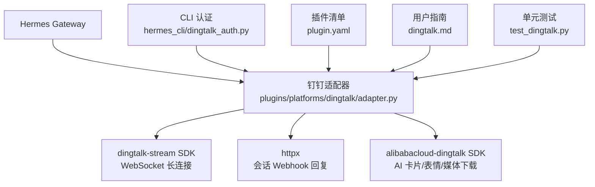
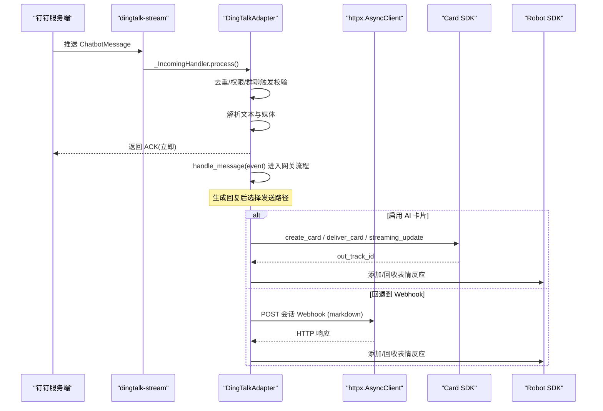
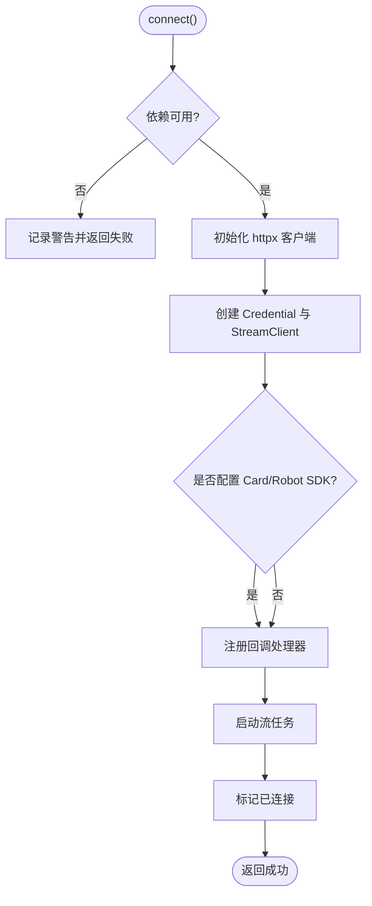
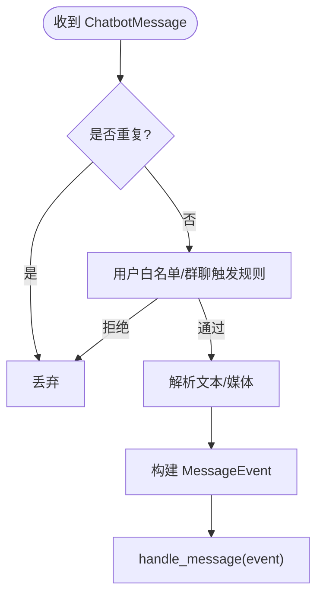
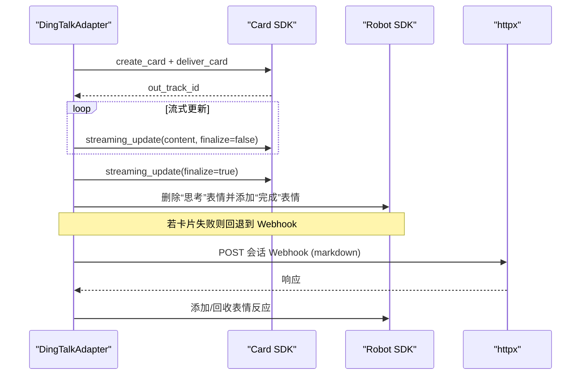
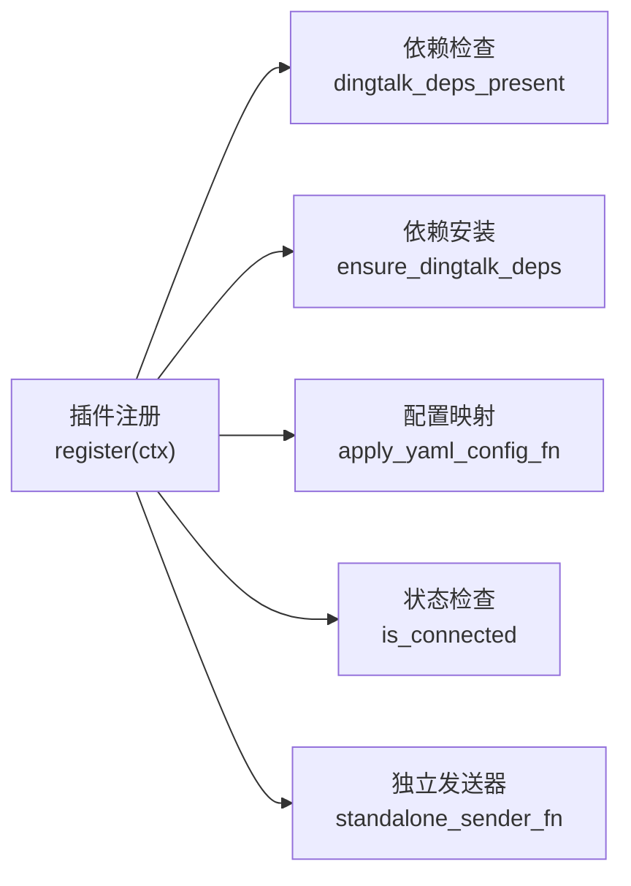

# 钉钉适配器

<cite>
**本文引用的文件**
- [plugins/platforms/dingtalk/adapter.py](file://plugins/platforms/dingtalk/adapter.py)
- [hermes_cli/dingtalk_auth.py](file://hermes_cli/dingtalk_auth.py)
- [plugins/platforms/dingtalk/plugin.yaml](file://plugins/platforms/dingtalk/plugin.yaml)
- [website/docs/user-guide/messaging/dingtalk.md](file://website/docs/user-guide/messaging/dingtalk.md)
- [tests/gateway/test_dingtalk.py](file://tests/gateway/test_dingtalk.py)
- [gateway/config.py](file://gateway/config.py)
</cite>

## 目录
1. [简介](#简介)
2. [项目结构](#项目结构)
3. [核心组件](#核心组件)
4. [架构总览](#架构总览)
5. [详细组件分析](#详细组件分析)
6. [依赖关系分析](#依赖关系分析)
7. [性能与可靠性](#性能与可靠性)
8. [安全、数据加密与审计](#安全数据加密与审计)
9. [部署与配置](#部署与配置)
10. [常见问题排查](#常见问题排查)
11. [结论](#结论)

## 简介
本文件面向在 Hermes Agent 中集成钉钉（DingTalk）的开发者，系统性说明钉钉适配器的实现方式、消息收发流程、回调机制、AI 卡片流式更新、群聊触发策略、多企业隔离与安全配置。文档同时给出端到端示例与排错指南，帮助快速完成企业级业务流程落地。

## 项目结构
钉钉适配以插件形式接入 Hermes Gateway，核心由以下文件组成：
- 平台适配器：负责连接钉钉 Stream Mode、解析消息、发送回复、管理 AI 卡片生命周期
- CLI 认证：提供二维码设备流授权，自动获取 Client ID/Secret
- 插件清单：声明环境变量、描述能力
- 用户指南：安装、配置、功能说明与故障排除
- 测试用例：覆盖关键行为与兼容性

图表来源
- [plugins/platforms/dingtalk/adapter.py:1-120](file://plugins/platforms/dingtalk/adapter.py#L1-L120)
- [hermes_cli/dingtalk_auth.py:1-120](file://hermes_cli/dingtalk_auth.py#L1-L120)
- [plugins/platforms/dingtalk/plugin.yaml:1-40](file://plugins/platforms/dingtalk/plugin.yaml#L1-L40)
- [website/docs/user-guide/messaging/dingtalk.md:1-120](file://website/docs/user-guide/messaging/dingtalk.md#L1-L120)
- [tests/gateway/test_dingtalk.py:1-120](file://tests/gateway/test_dingtalk.py#L1-L120)

章节来源
- [plugins/platforms/dingtalk/adapter.py:1-120](file://plugins/platforms/dingtalk/adapter.py#L1-L120)
- [plugins/platforms/dingtalk/plugin.yaml:1-40](file://plugins/platforms/dingtalk/plugin.yaml#L1-L40)

## 核心组件
- DingTalkAdapter：继承 BasePlatformAdapter，封装 Stream Mode 连接、消息入站处理、出站回复、AI 卡片流式编辑、表情反应、媒体下载等
- _IncomingHandler：适配 dingtalk-stream 回调协议，将 CallbackMessage 转为 ChatbotMessage 并异步派发处理
- CLI 认证模块：实现设备流注册、二维码展示、轮询授权结果
- 插件注册钩子：将适配器注入平台注册表，暴露检查、依赖安装、YAML 配置映射、独立发送器、cron 投递等能力

章节来源
- [plugins/platforms/dingtalk/adapter.py:230-380](file://plugins/platforms/dingtalk/adapter.py#L230-L380)
- [plugins/platforms/dingtalk/adapter.py:1606-1708](file://plugins/platforms/dingtalk/adapter.py#L1606-L1708)
- [hermes_cli/dingtalk_auth.py:60-152](file://hermes_cli/dingtalk_auth.py#L60-L152)
- [plugins/platforms/dingtalk/adapter.py:1910-1931](file://plugins/platforms/dingtalk/adapter.py#L1910-L1931)

## 架构总览
钉钉适配器通过 Stream Mode 建立 WebSocket 长连接接收消息，使用会话 Webhook 发送 Markdown 回复；可选启用 AI 卡片进行结构化、可流式更新的富文本展示。整体调用时序如下：

图表来源
- [plugins/platforms/dingtalk/adapter.py:319-380](file://plugins/platforms/dingtalk/adapter.py#L319-L380)
- [plugins/platforms/dingtalk/adapter.py:661-778](file://plugins/platforms/dingtalk/adapter.py#L661-L778)
- [plugins/platforms/dingtalk/adapter.py:1017-1124](file://plugins/platforms/dingtalk/adapter.py#L1017-L1124)
- [plugins/platforms/dingtalk/adapter.py:1213-1331](file://plugins/platforms/dingtalk/adapter.py#L1213-L1331)
- [plugins/platforms/dingtalk/adapter.py:1419-1489](file://plugins/platforms/dingtalk/adapter.py#L1419-L1489)

## 详细组件分析

### 连接与生命周期
- 连接：创建 httpx 客户端、Credential、StreamClient，注册回调处理器，启动后台任务维持连接，支持指数退避重连
- 断开：关闭 WebSocket、取消流任务、清理背景任务、最终化所有处于流式状态的卡片、释放资源

图表来源
- [plugins/platforms/dingtalk/adapter.py:319-380](file://plugins/platforms/dingtalk/adapter.py#L319-L380)
- [plugins/platforms/dingtalk/adapter.py:385-468](file://plugins/platforms/dingtalk/adapter.py#L385-L468)

章节来源
- [plugins/platforms/dingtalk/adapter.py:319-468](file://plugins/platforms/dingtalk/adapter.py#L319-L468)

### 入站消息处理
- 去重：基于 message_id 的滑动窗口去重
- 权限与触发：允许用户白名单、群聊需 @提及或匹配正则唤醒词、自由回复群组豁免
- 上下文：按 chat_id 维护最近一次消息与会话 Webhook，避免并发冲突
- 媒体解析：图片、语音、视频、文件、富文本混合内容，自动识别类型并提取下载码
- 事件构建：组装 MessageEvent 交由网关处理

图表来源
- [plugins/platforms/dingtalk/adapter.py:661-778](file://plugins/platforms/dingtalk/adapter.py#L661-L778)
- [plugins/platforms/dingtalk/adapter.py:472-593](file://plugins/platforms/dingtalk/adapter.py#L472-L593)
- [plugins/platforms/dingtalk/adapter.py:779-1013](file://plugins/platforms/dingtalk/adapter.py#L779-L1013)

章节来源
- [plugins/platforms/dingtalk/adapter.py:472-778](file://plugins/platforms/dingtalk/adapter.py#L472-L778)
- [plugins/platforms/dingtalk/adapter.py:779-1013](file://plugins/platforms/dingtalk/adapter.py#L779-L1013)

### 出站消息与 AI 卡片
- 首选 AI 卡片：创建卡片、投递到会话、流式更新内容；最终回复时关闭卡片并切换表情为“完成”
- 回退 Webhook：当卡片不可用时，通过会话 Webhook 发送 Markdown；同样支持表情反应
- 图片发送：通过 Markdown 内联图片链接；本地文件上传需走 OpenAPI（当前会话 Webhook 不支持直接附件）

图表来源
- [plugins/platforms/dingtalk/adapter.py:1017-1124](file://plugins/platforms/dingtalk/adapter.py#L1017-L1124)
- [plugins/platforms/dingtalk/adapter.py:1213-1331](file://plugins/platforms/dingtalk/adapter.py#L1213-L1331)
- [plugins/platforms/dingtalk/adapter.py:1333-1405](file://plugins/platforms/dingtalk/adapter.py#L1333-L1405)
- [plugins/platforms/dingtalk/adapter.py:1419-1489](file://plugins/platforms/dingtalk/adapter.py#L1419-L1489)

章节来源
- [plugins/platforms/dingtalk/adapter.py:1017-1489](file://plugins/platforms/dingtalk/adapter.py#L1017-L1489)

### 回调机制与兼容
- 回调入口：_IncomingHandler.process 适配 dingtalk-stream 版本差异，将 CallbackMessage.data 解析为 ChatbotMessage
- 字段补齐：确保 session_webhook、is_in_at_list 等关键字段存在
- 非阻塞：处理逻辑作为后台任务执行，保证 ACK 立即返回，避免心跳超时断连

章节来源
- [plugins/platforms/dingtalk/adapter.py:1606-1708](file://plugins/platforms/dingtalk/adapter.py#L1606-L1708)
- [tests/gateway/test_dingtalk.py:525-564](file://tests/gateway/test_dingtalk.py#L525-L564)

### 多企业支持与数据隔离
- 多企业：每个企业应用拥有独立的 Client ID/Secret，适配器通过环境变量或 PlatformConfig.extra 读取，天然支持多实例或多租户
- 数据隔离：会话 Webhook 与 conversation_id 绑定，消息上下文按 chat_id 隔离；群聊可按用户维度隔离会话历史（通过网关配置 group_sessions_per_user）
- 隐私保护：不主动采集组织通讯录；仅依据消息中的 sender_id/staff_id 做权限判断；敏感信息在错误日志中进行脱敏

章节来源
- [plugins/platforms/dingtalk/adapter.py:265-298](file://plugins/platforms/dingtalk/adapter.py#L265-L298)
- [plugins/platforms/dingtalk/adapter.py:661-778](file://plugins/platforms/dingtalk/adapter.py#L661-L778)
- [website/docs/user-guide/messaging/dingtalk.md:21-38](file://website/docs/user-guide/messaging/dingtalk.md#L21-L38)

### 企业微信特性说明
- 本项目未包含企业微信（WeCom）适配器；如需企业微信集成，请参考平台扩展模式新增对应适配器，复用网关抽象接口
- 常见企业场景（通讯录管理、日程安排、文档协作、视频会议）可通过工具层与外部系统集成，而非在本适配器内实现

[本节为概念性说明，不直接分析具体文件]

## 依赖关系分析
- 运行时依赖：dingtalk-stream（>=0.20）、httpx、alibabacloud-dingtalk（可选，用于 AI 卡片、表情、媒体下载）
- 懒加载：依赖检测函数仅在需要时安装与导入，避免无钉钉环境下的启动失败
- 插件注册：通过 register(ctx) 将适配器注入平台注册表，暴露依赖检查、配置映射、独立发送器等能力

图表来源
- [plugins/platforms/dingtalk/adapter.py:1910-1931](file://plugins/platforms/dingtalk/adapter.py#L1910-L1931)
- [plugins/platforms/dingtalk/adapter.py:165-228](file://plugins/platforms/dingtalk/adapter.py#L165-L228)
- [plugins/platforms/dingtalk/adapter.py:1836-1889](file://plugins/platforms/dingtalk/adapter.py#L1836-L1889)

章节来源
- [plugins/platforms/dingtalk/adapter.py:165-228](file://plugins/platforms/dingtalk/adapter.py#L165-L228)
- [plugins/platforms/dingtalk/adapter.py:1836-1931](file://plugins/platforms/dingtalk/adapter.py#L1836-L1931)

## 性能与可靠性
- 连接稳定性：指数退避重连（2s→5s→10s→30s→60s），防止网络抖动导致频繁重试
- 消息处理：ACK 立即返回，消息处理后台执行，避免阻塞心跳
- 资源管理：断开时关闭 WebSocket、取消任务、清理背景任务、最终化流式卡片，避免资源泄漏
- 限流与超时：httpx 设置合理超时与连接限制，降低拥塞风险
- 长度限制：单条消息最大 20000 字符，超长内容将被截断

章节来源
- [plugins/platforms/dingtalk/adapter.py:385-468](file://plugins/platforms/dingtalk/adapter.py#L385-L468)
- [plugins/platforms/dingtalk/adapter.py:1017-1124](file://plugins/platforms/dingtalk/adapter.py#L1017-L1124)
- [website/docs/user-guide/messaging/dingtalk.md:248-284](file://website/docs/user-guide/messaging/dingtalk.md#L248-L284)

## 安全、数据加密与审计
- 认证：使用钉钉应用 Client ID/Secret 建立 Stream 连接；CLI 支持二维码设备流授权，避免明文输入
- 访问控制：支持 allowed_users 白名单、群聊 require_mention、free_response_chats 豁免、allowed_chats 群组白名单
- 数据安全：会话 Webhook 仅对近期消息有效，过期自动清理；错误日志中对 webhook URL 中的 access_token 进行脱敏
- 审计建议：结合网关日志与钉钉机器人操作日志，记录消息收发、权限判定、卡片创建/更新等操作

章节来源
- [hermes_cli/dingtalk_auth.py:60-152](file://hermes_cli/dingtalk_auth.py#L60-L152)
- [plugins/platforms/dingtalk/adapter.py:472-593](file://plugins/platforms/dingtalk/adapter.py#L472-L593)
- [plugins/platforms/dingtalk/adapter.py:1724-1770](file://plugins/platforms/dingtalk/adapter.py#L1724-L1770)

## 部署与配置
- 安装依赖：安装 dingtalk-stream、httpx、alibabacloud-dingtalk（可选）
- 环境变量：
  - 必需：DINGTALK_CLIENT_ID、DINGTALK_CLIENT_SECRET
  - 可选：DINGTALK_REQUIRE_MENTION、DINGTALK_FREE_RESPONSE_CHATS、DINGTALK_MENTION_PATTERNS、DINGTALK_ALLOWED_USERS、DINGTALK_HOME_CHANNEL、DINGTALK_WEBHOOK_URL
- YAML 配置：通过 gateway.platforms.dingtalk.extra 设置 require_mention、allowed_users、card_template_id 等
- 交互设置：运行 hermes gateway setup 选择钉钉，支持二维码授权或手动输入凭证
- 启动网关：hermes gateway，确认连接成功并在钉钉中发送消息验证

章节来源
- [website/docs/user-guide/messaging/dingtalk.md:42-171](file://website/docs/user-guide/messaging/dingtalk.md#L42-L171)
- [plugins/platforms/dingtalk/plugin.yaml:12-40](file://plugins/platforms/dingtalk/plugin.yaml#L12-L40)
- [plugins/platforms/dingtalk/adapter.py:1836-1889](file://plugins/platforms/dingtalk/adapter.py#L1836-L1889)

## 常见问题排查
- 未安装依赖：提示 dingtalk-stream 或 httpx 缺失，按指引安装
- 凭证缺失：检查 DINGTALK_CLIENT_ID 与 DINGTALK_CLIENT_SECRET 是否正确设置
- 流断开/重连循环：检查网络、凭证有效性与应用状态；适配器会自动重连
- 离线：确认网关进程运行，查看终端输出错误信息
- 无会话 Webhook：每次新消息会提供新的会话 Webhook，重启后需重新发起消息
- 群聊不响应：确认 allowlist、require_mention、free_response_chats 配置是否符合预期

章节来源
- [website/docs/user-guide/messaging/dingtalk.md:224-284](file://website/docs/user-guide/messaging/dingtalk.md#L224-L284)
- [tests/gateway/test_dingtalk.py:91-103](file://tests/gateway/test_dingtalk.py#L91-L103)

## 结论
钉钉适配器通过 Stream Mode 实现了低延迟、免公网的实时消息通道，结合 AI 卡片提供了丰富的富文本与流式更新体验。其权限控制、会话隔离、资源管理与错误恢复机制完善，适合在企业环境中稳定运行。配合 CLI 认证与插件注册体系，能够快速完成多企业部署与运维。对于企业微信等其他平台，可参照本适配器的设计模式进行扩展。