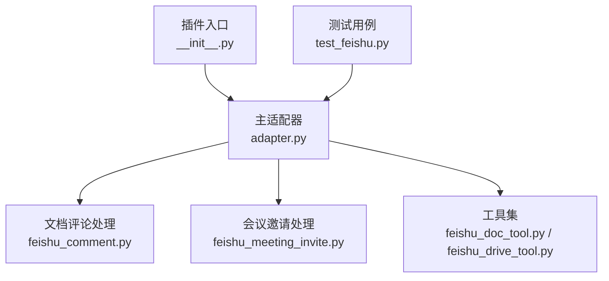
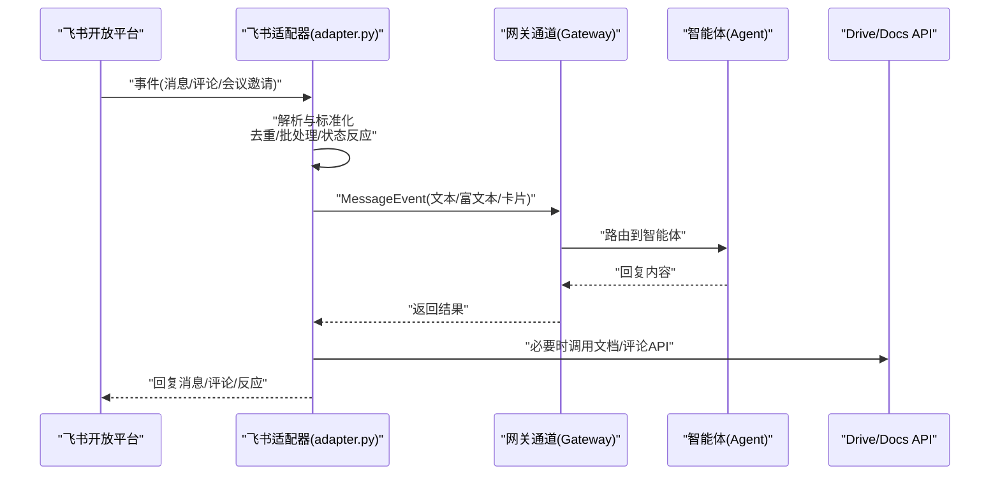
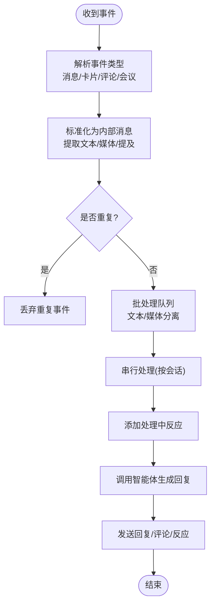
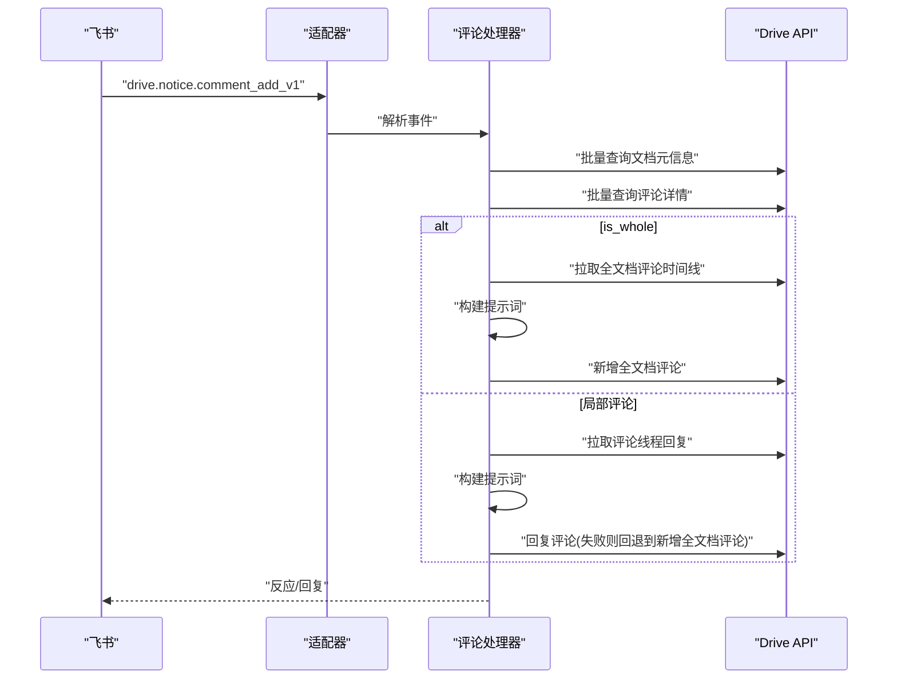
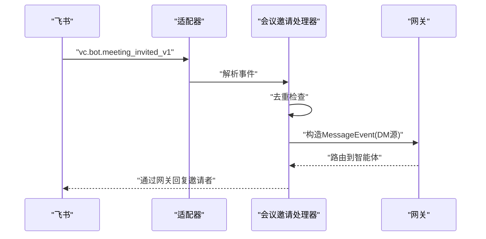
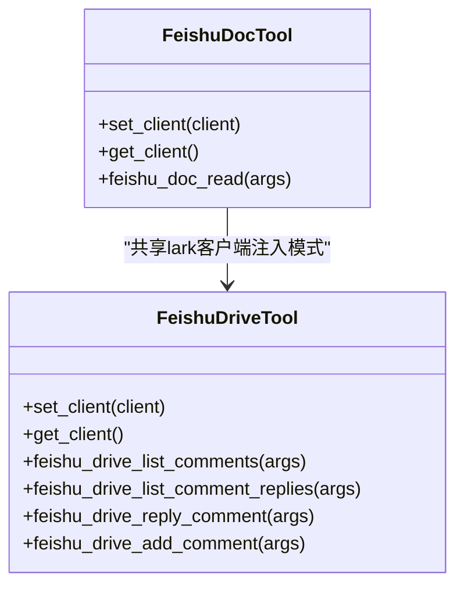
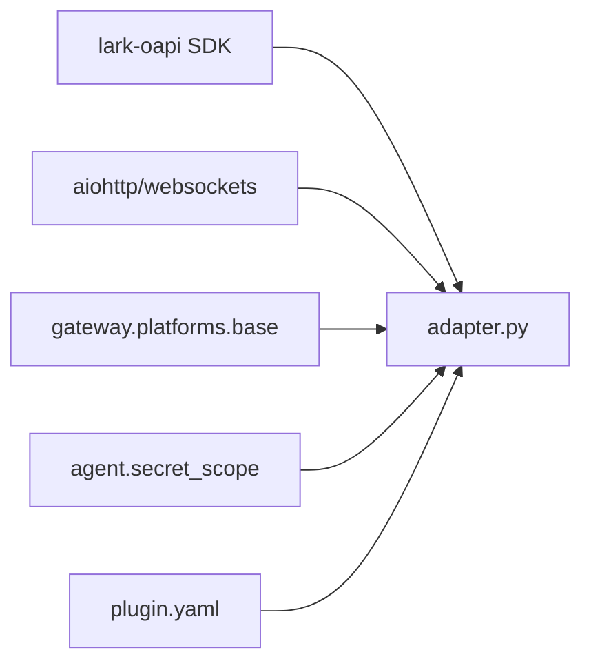

# 飞书适配器

<cite>
**本文引用的文件**
- [plugins/platforms/feishu/__init__.py](file://plugins/platforms/feishu/__init__.py)
- [plugins/platforms/feishu/adapter.py](file://plugins/platforms/feishu/adapter.py)
- [plugins/platforms/feishu/plugin.yaml](file://plugins/platforms/feishu/plugin.yaml)
- [plugins/platforms/feishu/feishu_comment.py](file://plugins/platforms/feishu/feishu_comment.py)
- [plugins/platforms/feishu/feishu_meeting_invite.py](file://plugins/platforms/feishu/feishu_meeting_invite.py)
- [tools/feishu_doc_tool.py](file://tools/feishu_doc_tool.py)
- [tools/feishu_drive_tool.py](file://tools/feishu_drive_tool.py)
- [tests/gateway/test_feishu.py](file://tests/gateway/test_feishu.py)
</cite>

## 目录
1. [简介](#简介)
2. [项目结构](#项目结构)
3. [核心组件](#核心组件)
4. [架构总览](#架构总览)
5. [详细组件分析](#详细组件分析)
6. [依赖关系分析](#依赖关系分析)
7. [性能与容量规划](#性能与容量规划)
8. [安全、权限与合规](#安全权限与合规)
9. [部署与配置](#部署与配置)
10. [故障排除](#故障排除)
11. [结论](#结论)

## 简介
本文件面向在 Hermes Agent 中集成飞书（Feishu/Lark）的开发者，系统性说明飞书作为新一代企业协作平台的能力边界与适配方式。内容涵盖：
- 飞书开放平台的 API 设计、事件订阅机制与消息卡片系统
- 多维表格、知识库、文档协作、会议邀请等企业级场景的适配思路
- 多租户与企业隔离策略、隐私保护与数据合规要点
- 完整的开发示例与最佳实践，包括审批流程、日程管理、文档协作与视频会议
- 部署配置、性能优化与故障排除指南

## 项目结构
飞书适配器以插件形式接入 Hermes Gateway，核心由以下模块组成：
- 适配器入口与注册：通过 __init__ 暴露 register，供网关加载
- 主适配器：实现连接模式（WebSocket/Webhook）、消息收发、媒体缓存、去重、批处理、状态反应等
- 文档评论处理：解析飞书文档评论事件，调用 Drive v1/v2 接口进行查询与回复
- 会议邀请处理：将 vc.bot.meeting_invited_v1 事件转换为标准 MessageEvent，走网关常规路由
- 工具集：提供读取文档内容与文档评论操作的工具，便于智能体在对话中直接操作飞书文档

图表来源
- [plugins/platforms/feishu/__init__.py:1-4](file://plugins/platforms/feishu/__init__.py#L1-L4)
- [plugins/platforms/feishu/adapter.py:1-120](file://plugins/platforms/feishu/adapter.py#L1-L120)
- [plugins/platforms/feishu/feishu_comment.py:1-22](file://plugins/platforms/feishu/feishu_comment.py#L1-L22)
- [plugins/platforms/feishu/feishu_meeting_invite.py:1-20](file://plugins/platforms/feishu/feishu_meeting_invite.py#L1-L20)
- [tools/feishu_doc_tool.py:1-20](file://tools/feishu_doc_tool.py#L1-L20)
- [tools/feishu_drive_tool.py:1-20](file://tools/feishu_drive_tool.py#L1-L20)
- [tests/gateway/test_feishu.py:1-20](file://tests/gateway/test_feishu.py#L1-L20)

章节来源
- [plugins/platforms/feishu/__init__.py:1-4](file://plugins/platforms/feishu/__init__.py#L1-L4)
- [plugins/platforms/feishu/adapter.py:1-120](file://plugins/platforms/feishu/adapter.py#L1-L120)
- [plugins/platforms/feishu/plugin.yaml:1-45](file://plugins/platforms/feishu/plugin.yaml#L1-L45)

## 核心组件
- 适配器类与设置
  - 支持 WebSocket 长连接与 Webhook 两种传输模式
  - 支持 DM 与群聊 @提及触发、图片/文件/音频/视频等媒体入站缓存
  - 支持按会话串行处理消息、发送进度状态反应（Typing/CrossMark）
  - 支持卡片按钮点击事件转为合成命令事件
  - 支持 Webhook 异常追踪与验证令牌二次校验
  - 身份模型：open_id（应用级）、user_id（租户级）、union_id（开发者级），并给出机器人自身 open_id 的使用场景
- 文档评论处理
  - 解析 drive.notice.comment_add_v1 事件
  - 批量查询文档元信息与评论详情，区分全文档评论与局部评论
  - 构建提示词，调用智能体生成回复，再路由到对应 API（回复或新增全文档评论）
  - 支持 Wiki 链接反向解析与引用文档格式化
- 会议邀请处理
  - 解析 vc.bot.meeting_invited_v1 事件，构造 MessageEvent 进入网关常规路由
  - 自动去重与用户身份解析，确保回复可安全回传
- 工具集
  - 文档读取：通过 BaseRequest 调用 raw_content 接口获取文档纯文本
  - 文档评论：列出评论、列出回复、回复评论、新增全文档评论

章节来源
- [plugins/platforms/feishu/adapter.py:18-46](file://plugins/platforms/feishu/adapter.py#L18-L46)
- [plugins/platforms/feishu/adapter.py:219-244](file://plugins/platforms/feishu/adapter.py#L219-L244)
- [plugins/platforms/feishu/adapter.py:353-456](file://plugins/platforms/feishu/adapter.py#L353-L456)
- [plugins/platforms/feishu/feishu_comment.py:1-22](file://plugins/platforms/feishu/feishu_comment.py#L1-L22)
- [plugins/platforms/feishu/feishu_comment.py:103-147](file://plugins/platforms/feishu/feishu_comment.py#L103-L147)
- [plugins/platforms/feishu/feishu_meeting_invite.py:1-20](file://plugins/platforms/feishu/feishu_meeting_invite.py#L1-L20)
- [tools/feishu_doc_tool.py:33-51](file://tools/feishu_doc_tool.py#L33-L51)
- [tools/feishu_drive_tool.py:93-130](file://tools/feishu_drive_tool.py#L93-L130)

## 架构总览
下图展示从飞书事件到 Hermes Agent 的端到端流程，包括消息接收、标准化、智能体处理与回复投递。

图表来源
- [plugins/platforms/feishu/adapter.py:1-120](file://plugins/platforms/feishu/adapter.py#L1-L120)
- [plugins/platforms/feishu/feishu_comment.py:250-353](file://plugins/platforms/feishu/feishu_comment.py#L250-L353)
- [plugins/platforms/feishu/feishu_meeting_invite.py:167-213](file://plugins/platforms/feishu/feishu_meeting_invite.py#L167-L213)

## 详细组件分析

### 适配器主流程（消息与卡片）
- 连接模式
  - WebSocket：使用 lark-oapi SDK 建立长连接，支持 Channel UA Tag 以确保群 @提及事件推送
  - Webhook：本地 HTTP 服务接收事件，具备请求体大小限制、速率限制与异常追踪
- 消息标准化
  - 支持 Post、Interactive Card、At、Media、Image、Audio、Video 等多种元素
  - 对 Markdown 渲染进行分块与转义，避免代码块吞尾问题
- 批处理与去重
  - 文本与媒体分别批处理，控制延迟与最大条数/字符数
  - 全局去重窗口与卡片动作去重窗口，防止重复处理
- 状态反应
  - 开始处理时添加“正在输入”反应，成功完成移除，失败替换为“叉号”

图表来源
- [plugins/platforms/feishu/adapter.py:219-244](file://plugins/platforms/feishu/adapter.py#L219-L244)
- [plugins/platforms/feishu/adapter.py:592-651](file://plugins/platforms/feishu/adapter.py#L592-L651)
- [plugins/platforms/feishu/adapter.py:653-731](file://plugins/platforms/feishu/adapter.py#L653-L731)

章节来源
- [plugins/platforms/feishu/adapter.py:18-46](file://plugins/platforms/feishu/adapter.py#L18-L46)
- [plugins/platforms/feishu/adapter.py:219-244](file://plugins/platforms/feishu/adapter.py#L219-L244)
- [plugins/platforms/feishu/adapter.py:592-731](file://plugins/platforms/feishu/adapter.py#L592-L731)

### 文档评论处理（Drive v1/v2）
- 事件解析：解析 comment_add_v1 事件，提取 file_token、comment_id、reply_id、is_whole 等关键字段
- 并行查询：批量查询文档元信息（标题、URL、类型）与评论详情
- 分支处理：
  - 全文档评论：拉取时间线，构建上下文，生成回复后新增全文档评论
  - 局部评论：拉取评论线程回复，生成回复后尝试回复；若不允许则回退到新增全文档评论
- 重试与一致性：对 batch_query 与 replies 列表进行多次重试，应对最终一致性
- Wiki 链接解析：识别 wiki 链接并反向解析为底层文档类型与 token，用于上下文增强

图表来源
- [plugins/platforms/feishu/feishu_comment.py:103-147](file://plugins/platforms/feishu/feishu_comment.py#L103-L147)
- [plugins/platforms/feishu/feishu_comment.py:250-353](file://plugins/platforms/feishu/feishu_comment.py#L250-L353)
- [plugins/platforms/feishu/feishu_comment.py:355-463](file://plugins/platforms/feishu/feishu_comment.py#L355-L463)
- [plugins/platforms/feishu/feishu_comment.py:470-595](file://plugins/platforms/feishu/feishu_comment.py#L470-L595)
- [plugins/platforms/feishu/feishu_comment.py:668-784](file://plugins/platforms/feishu/feishu_comment.py#L668-L784)

章节来源
- [plugins/platforms/feishu/feishu_comment.py:103-147](file://plugins/platforms/feishu/feishu_comment.py#L103-L147)
- [plugins/platforms/feishu/feishu_comment.py:250-353](file://plugins/platforms/feishu/feishu_comment.py#L250-L353)
- [plugins/platforms/feishu/feishu_comment.py:355-463](file://plugins/platforms/feishu/feishu_comment.py#L355-L463)
- [plugins/platforms/feishu/feishu_comment.py:470-595](file://plugins/platforms/feishu/feishu_comment.py#L470-L595)
- [plugins/platforms/feishu/feishu_comment.py:668-784](file://plugins/platforms/feishu/feishu_comment.py#L668-L784)

### 会议邀请处理（vc.bot.meeting_invited_v1）
- 事件解析：从 body.content 中提取 JSON 负载，解析 meeting、inviter、invite_time 等字段
- 去重：基于 event_id 或 meeting_id + inviter + invite_time 生成键，避免重复处理
- 路由：构造 MessageEvent，携带 DM 源与用户信息，交由网关常规路由处理

图表来源
- [plugins/platforms/feishu/feishu_meeting_invite.py:49-135](file://plugins/platforms/feishu/feishu_meeting_invite.py#L49-L135)
- [plugins/platforms/feishu/feishu_meeting_invite.py:138-213](file://plugins/platforms/feishu/feishu_meeting_invite.py#L138-L213)

章节来源
- [plugins/platforms/feishu/feishu_meeting_invite.py:49-135](file://plugins/platforms/feishu/feishu_meeting_invite.py#L49-L135)
- [plugins/platforms/feishu/feishu_meeting_invite.py:138-213](file://plugins/platforms/feishu/feishu_meeting_invite.py#L138-L213)

### 工具集（文档与评论）
- 文档读取工具：通过 BaseRequest 调用 raw_content 接口，返回文档纯文本内容
- 文档评论工具：
  - 列出评论与回复（分页）
  - 回复评论（文本元素）
  - 新增全文档评论（文本元素）
- 客户端注入：通过线程局部存储注入 lark 客户端，保证工具在同步执行环境中可用

图表来源
- [tools/feishu_doc_tool.py:19-27](file://tools/feishu_doc_tool.py#L19-L27)
- [tools/feishu_doc_tool.py:69-122](file://tools/feishu_doc_tool.py#L69-L122)
- [tools/feishu_drive_tool.py:20-27](file://tools/feishu_drive_tool.py#L20-L27)
- [tools/feishu_drive_tool.py:40-87](file://tools/feishu_drive_tool.py#L40-L87)
- [tools/feishu_drive_tool.py:133-166](file://tools/feishu_drive_tool.py#L133-L166)
- [tools/feishu_drive_tool.py:208-239](file://tools/feishu_drive_tool.py#L208-L239)
- [tools/feishu_drive_tool.py:280-314](file://tools/feishu_drive_tool.py#L280-L314)
- [tools/feishu_drive_tool.py:351-379](file://tools/feishu_drive_tool.py#L351-L379)

章节来源
- [tools/feishu_doc_tool.py:69-122](file://tools/feishu_doc_tool.py#L69-L122)
- [tools/feishu_drive_tool.py:40-87](file://tools/feishu_drive_tool.py#L40-L87)
- [tools/feishu_drive_tool.py:133-166](file://tools/feishu_drive_tool.py#L133-L166)
- [tools/feishu_drive_tool.py:208-239](file://tools/feishu_drive_tool.py#L208-L239)
- [tools/feishu_drive_tool.py:280-314](file://tools/feishu_drive_tool.py#L280-L314)
- [tools/feishu_drive_tool.py:351-379](file://tools/feishu_drive_tool.py#L351-L379)

## 依赖关系分析
- 外部依赖
  - lark-oapi SDK：用于 WebSocket 连接与 API 调用（BaseRequest、AccessTokenType、HttpMethod）
  - aiohttp/websockets：Webhook 与 WebSocket 传输层（可选导入，保持启动快速）
- 内部依赖
  - gateway.platforms.base：基础适配器接口、消息类型、媒体缓存等
  - hermes_constants/utils：路径与工具函数
  - agent.secret_scope：受控密钥读取，支持默认配置文件启动时的回退
- 插件注册
  - plugin.yaml 声明环境变量与描述，便于安装向导引导配置

图表来源
- [plugins/platforms/feishu/adapter.py:74-116](file://plugins/platforms/feishu/adapter.py#L74-L116)
- [plugins/platforms/feishu/adapter.py:121-139](file://plugins/platforms/feishu/adapter.py#L121-L139)
- [plugins/platforms/feishu/plugin.yaml:13-45](file://plugins/platforms/feishu/plugin.yaml#L13-L45)

章节来源
- [plugins/platforms/feishu/adapter.py:74-139](file://plugins/platforms/feishu/adapter.py#L74-L139)
- [plugins/platforms/feishu/plugin.yaml:13-45](file://plugins/platforms/feishu/plugin.yaml#L13-L45)

## 性能与容量规划
- 批处理与延迟控制
  - 文本批处理：默认延迟 0.6 秒，最多 8 条或 4000 字符
  - 媒体批处理：默认延迟 0.8 秒
- 去重与缓存
  - 去重 TTL：24 小时
  - 发送者名称缓存：10 分钟
  - 处理中反应句柄缓存上限：1024
  - 消息文本缓存上限：512
- Webhook 安全与限流
  - 请求体大小限制：1 MB
  - 滑动窗口限流：60 秒内最多 120 次/IP
  - 异常追踪阈值：连续错误响应达到 25 次记录警告，TTL 6 小时
- 重试与一致性
  - 评论批量查询与回复列表拉取支持多次重试，应对最终一致性
- 连接与重连
  - 连接尝试次数：3 次
  - 发送尝试次数：3 次
  - 断线重连：支持 is_reconnect 参数，确保网关重连器正确调用

章节来源
- [plugins/platforms/feishu/adapter.py:219-244](file://plugins/platforms/feishu/adapter.py#L219-L244)
- [plugins/platforms/feishu/adapter.py:271-285](file://plugins/platforms/feishu/adapter.py#L271-L285)
- [plugins/platforms/feishu/feishu_comment.py:300-353](file://plugins/platforms/feishu/feishu_comment.py#L300-L353)
- [plugins/platforms/feishu/feishu_comment.py:398-463](file://plugins/platforms/feishu/feishu_comment.py#L398-L463)
- [tests/gateway/test_adapter_connect_is_reconnect_contract.py:1-145](file://tests/gateway/test_adapter_connect_is_reconnect_contract.py#L1-L145)

## 安全、权限与合规
- 身份模型与权限
  - open_id：应用级稳定标识，无需额外权限
  - user_id：租户级稳定标识，需 contact:user.employee_id:readonly 权限
  - union_id：开发者级跨应用稳定标识，适合未来多应用场景
- 访问控制
  - 群组策略：支持 open/allowlist/blacklist/admin_only/disabled
  - 允许用户白名单：FEISHU_ALLOWED_USERS
  - 机器人 @提及门控：可按群组规则要求必须 @提及
- 安全配置
  - 加密密钥与验证令牌：二次认证层，保障 Webhook 安全
  - 密钥读取：通过受控 secret scope 读取，支持默认配置文件启动回退
- 数据合规与隐私
  - 媒体与文档内容仅用于必要处理，遵循最小化原则
  - 日志与调试输出注意脱敏，避免泄露敏感信息
  - 多企业支持与数据隔离：通过租户级 token 与 app_id 隔离，建议在不同企业使用独立应用与凭据

章节来源
- [plugins/platforms/feishu/adapter.py:18-46](file://plugins/platforms/feishu/adapter.py#L18-L46)
- [plugins/platforms/feishu/adapter.py:142-159](file://plugins/platforms/feishu/adapter.py#L142-L159)
- [plugins/platforms/feishu/adapter.py:405-456](file://plugins/platforms/feishu/adapter.py#L405-L456)
- [plugins/platforms/feishu/plugin.yaml:13-45](file://plugins/platforms/feishu/plugin.yaml#L13-L45)

## 部署与配置
- 环境变量
  - 必需：FEISHU_APP_ID、FEISHU_APP_SECRET
  - 可选：FEISHU_DOMAIN（feishu/lark）、FEISHU_ALLOWED_USERS、FEISHU_ALLOW_ALL_USERS、FEISHU_HOME_CHANNEL、FEISHU_HOME_CHANNEL_NAME
- 连接模式
  - WebSocket：推荐用于实时性与稳定性，需启用 Channel UA Tag
  - Webhook：适用于无公网或 NAT 环境，需配置端口与路径
- 安装与引导
  - 插件描述包含安装向导所需字段与提示，便于自动化配置
- 测试与验证
  - 单元测试覆盖配置加载、消息标准化、WebSocket UA Tag、断开重连等行为

章节来源
- [plugins/platforms/feishu/plugin.yaml:13-45](file://plugins/platforms/feishu/plugin.yaml#L13-L45)
- [tests/gateway/test_feishu.py:49-66](file://tests/gateway/test_feishu.py#L49-L66)
- [tests/gateway/test_feishu.py:103-130](file://tests/gateway/test_feishu.py#L103-L130)
- [tests/gateway/test_feishu.py:132-183](file://tests/gateway/test_feishu.py#L132-L183)
- [tests/gateway/test_feishu.py:185-200](file://tests/gateway/test_feishu.py#L185-L200)

## 故障排除
- 常见问题
  - 群聊 @提及未推送：确认 WebSocket 连接使用了 Channel UA Tag
  - 断开后未恢复：确保 connect() 接受 is_reconnect 参数，网关重连器会转发该参数
  - 文档评论不一致：batch_query 与 replies 列表拉取支持重试，等待最终一致性
  - 回复失败：局部评论回复失败（特定错误码）时回退到新增全文档评论
- 诊断建议
  - 查看 Webhook 异常追踪日志，关注连续错误阈值
  - 检查请求体大小限制与速率限制，避免被限流
  - 使用工具集列出评论与回复，验证数据链路
  - 通过单元测试复现与验证关键行为

章节来源
- [plugins/platforms/feishu/adapter.py:219-244](file://plugins/platforms/feishu/adapter.py#L219-L244)
- [plugins/platforms/feishu/feishu_comment.py:300-353](file://plugins/platforms/feishu/feishu_comment.py#L300-L353)
- [plugins/platforms/feishu/feishu_comment.py:470-595](file://plugins/platforms/feishu/feishu_comment.py#L470-L595)
- [tests/gateway/test_adapter_connect_is_reconnect_contract.py:1-145](file://tests/gateway/test_adapter_connect_is_reconnect_contract.py#L1-L145)
- [tests/gateway/test_feishu.py:103-183](file://tests/gateway/test_feishu.py#L103-L183)

## 结论
本适配器为 Hermes Agent 提供了完整的飞书集成能力，覆盖消息、文档评论与会议邀请等企业级场景。通过灵活的连接模式、严格的去重与批处理、完善的错误重试与异常追踪，以及安全的权限与合规设计，能够满足多企业、多租户环境下的稳定运行需求。建议在生产环境中优先采用 WebSocket 模式，并结合单元测试与监控指标持续优化性能与可靠性。