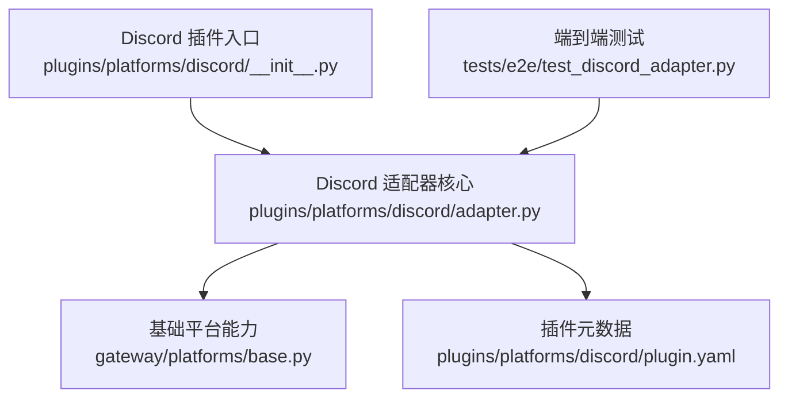
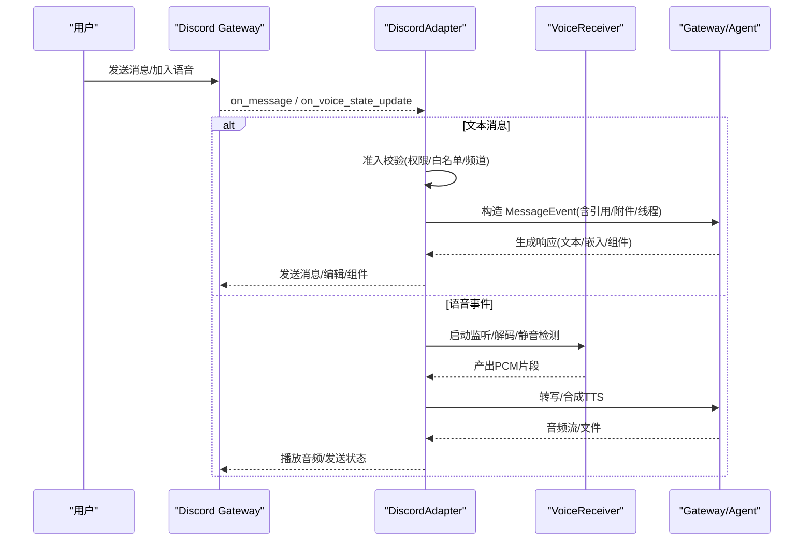
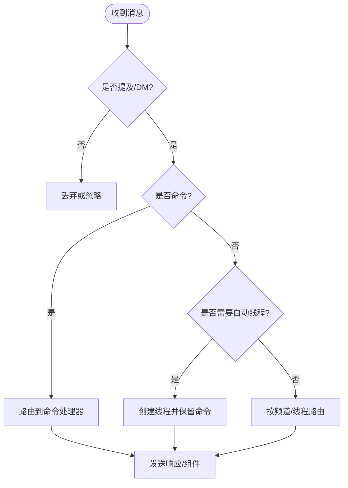
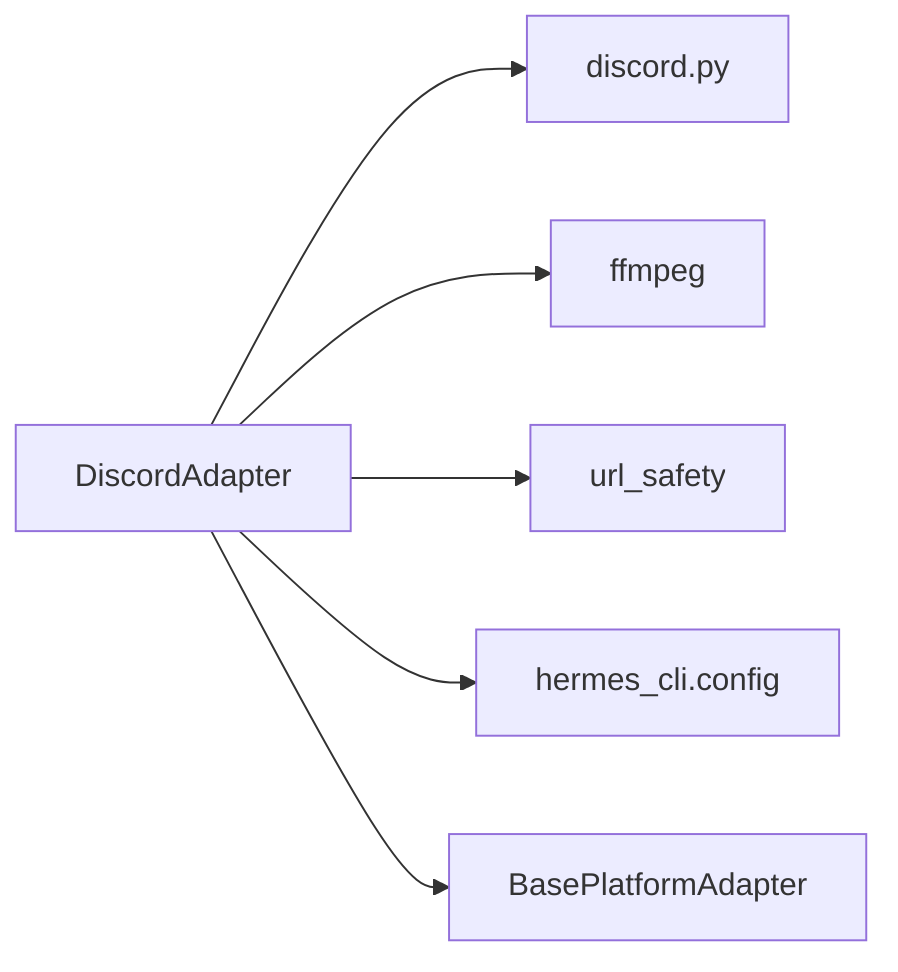

# Discord 平台适配器

<cite>
**本文引用的文件**
- [plugins/platforms/discord/adapter.py](file://plugins/platforms/discord/adapter.py)
- [plugins/platforms/discord/__init__.py](file://plugins/platforms/discord/__init__.py)
- [plugins/platforms/discord/plugin.yaml](file://plugins/platforms/discord/plugin.yaml)
- [gateway/platforms/base.py](file://gateway/platforms/base.py)
- [tests/e2e/test_discord_adapter.py](file://tests/e2e/test_discord_adapter.py)
</cite>

## 目录
1. [简介](#简介)
2. [项目结构](#项目结构)
3. [核心组件](#核心组件)
4. [架构总览](#架构总览)
5. [详细组件分析](#详细组件分析)
6. [依赖关系分析](#依赖关系分析)
7. [性能与限制](#性能与限制)
8. [故障排查指南](#故障排查指南)
9. [结论](#结论)
10. [附录](#附录)

## 简介
本文件面向在 Hermes Agent 中集成 Discord 平台的开发者，系统性说明 Discord Bot API 的接入方式、消息系统（文本、嵌入、组件交互、模态框）、服务器（Guild）与频道管理（文本、语音、线程）、用户与角色权限、富媒体（图片、视频、音频、附件）、表情与贴纸、Webhook 与 Slash Commands 的实现要点，以及速率限制、内容安全策略、调试工具与性能优化实践。文档基于仓库内 Discord 平台适配器的实现进行提炼，确保与实际代码一致。

## 项目结构
Discord 平台以插件形式提供，入口通过 __init__ 暴露注册函数；核心逻辑集中在 adapter.py，配置元信息在 plugin.yaml；通用能力（代理、媒体大小上限、TTS 输出路径等）由 gateway/platforms/base.py 提供；端到端行为由 tests/e2e/test_discord_adapter.py 覆盖。

图表来源
- [plugins/platforms/discord/__init__.py:1-4](file://plugins/platforms/discord/__init__.py#L1-L4)
- [plugins/platforms/discord/adapter.py:1221-1412](file://plugins/platforms/discord/adapter.py#L1221-L1412)
- [gateway/platforms/base.py:417-517](file://gateway/platforms/base.py#L417-L517)
- [plugins/platforms/discord/plugin.yaml:1-35](file://plugins/platforms/discord/plugin.yaml#L1-L35)
- [tests/e2e/test_discord_adapter.py:1-156](file://tests/e2e/test_discord_adapter.py#L1-L156)

章节来源
- [plugins/platforms/discord/__init__.py:1-4](file://plugins/platforms/discord/__init__.py#L1-L4)
- [plugins/platforms/discord/adapter.py:1221-1412](file://plugins/platforms/discord/adapter.py#L1221-L1412)
- [gateway/platforms/base.py:417-517](file://gateway/platforms/base.py#L417-L517)
- [plugins/platforms/discord/plugin.yaml:1-35](file://plugins/platforms/discord/plugin.yaml#L1-L35)
- [tests/e2e/test_discord_adapter.py:1-156](file://tests/e2e/test_discord_adapter.py#L1-L156)

## 核心组件
- DiscordAdapter：继承自 BasePlatformAdapter，负责连接 Discord、事件分发、消息处理、Slash Commands、按钮交互、语音通道、线程、提及与权限控制、消息去重、存活探测等。
- VoiceReceiver：捕获并解码语音频道的 RTP 包，支持 NaCl 传输解密、DAVE E2EE、Opus 解码、静音检测与 PCM->WAV 转换。
- 基础平台能力：代理解析、入站媒体大小限制、TTS 输出路径、UTF-16 长度计算与截断等。

章节来源
- [plugins/platforms/discord/adapter.py:987-1129](file://plugins/platforms/discord/adapter.py#L987-L1129)
- [plugins/platforms/discord/adapter.py:525-908](file://plugins/platforms/discord/adapter.py#L525-L908)
- [gateway/platforms/base.py:417-517](file://gateway/platforms/base.py#L417-L517)
- [gateway/platforms/base.py:738-800](file://gateway/platforms/base.py#L738-L800)

## 架构总览
Discord 适配器通过 discord.py 建立 Bot 客户端，订阅 on_ready、on_message、on_voice_state_update 等事件，完成消息准入校验、命令识别、自动建线程、回复锚点、附件缓存、流式编辑与 TTS 播放。语音通道通过 VoiceReceiver 实时解码用户语音，结合 ffmpeg 转换为 Whisper 可识别格式。

图表来源
- [plugins/platforms/discord/adapter.py:1339-1399](file://plugins/platforms/discord/adapter.py#L1339-L1399)
- [plugins/platforms/discord/adapter.py:1506-1520](file://plugins/platforms/discord/adapter.py#L1506-L1520)
- [plugins/platforms/discord/adapter.py:525-908](file://plugins/platforms/discord/adapter.py#L525-L908)

## 详细组件分析

### 应用注册、Bot Token 与权限配置
- 应用与 Token：plugin.yaml 声明必需环境变量 DISCORD_BOT_TOKEN，并在描述中指向开发者门户链接，便于引导创建应用与获取 Token。
- Intents 与 AllowedMentions：connect() 中动态构建 Intents（message_content、dm_messages、guild_messages、members、voice_states），并根据允许列表是否包含用户名或角色决定是否启用成员意图；默认拒绝 @everyone 与角色 ping，仅允许用户与回复用户提及，避免误炸频道。
- 代理与连通性：支持 DISCORD_PROXY 及系统代理，SOCKS/HTTP 均兼容；连接超时与任务退出快速失败，避免僵尸客户端。

章节来源
- [plugins/platforms/discord/plugin.yaml:1-35](file://plugins/platforms/discord/plugin.yaml#L1-L35)
- [plugins/platforms/discord/adapter.py:1221-1412](file://plugins/platforms/discord/adapter.py#L1221-L1412)
- [gateway/platforms/base.py:417-517](file://gateway/platforms/base.py#L417-L517)

### 消息系统与交互
- 文本消息：支持 Markdown 链接渲染、代码块、长消息拆分（2000 字符限制）。
- 嵌入消息：通过统一发送流程承载富信息展示。
- 组件交互与模态框：按钮视图具备超时控制（默认 300 秒，范围 30-900 秒），用于执行审批、确认、提示更新等；选择菜单与按钮操作可通过 View/Component 机制触发回调。
- 引用与回复：支持 reply_to_message_id 与 thread 上下文，DM 与频道场景分别处理。
- 自动建线程：在频道中 @mention 时可根据配置自动创建线程，保持对话隔离。

图表来源
- [tests/e2e/test_discord_adapter.py:30-108](file://tests/e2e/test_discord_adapter.py#L30-L108)
- [plugins/platforms/discord/adapter.py:1432-1504](file://plugins/platforms/discord/adapter.py#L1432-L1504)

章节来源
- [plugins/platforms/discord/adapter.py:1001-1005](file://plugins/platforms/discord/adapter.py#L1001-L1005)
- [plugins/platforms/discord/adapter.py:938-984](file://plugins/platforms/discord/adapter.py#L938-L984)
- [tests/e2e/test_discord_adapter.py:30-108](file://tests/e2e/test_discord_adapter.py#L30-L108)

### 服务器（Guild）、频道类型与用户角色
- 服务器与频道：支持文本频道、语音频道、线程；通过 on_voice_state_update 跟踪成员进出与切换。
- 用户与角色：支持按用户 ID、角色 ID、频道 ID 的白名单/黑名单控制；DM 模式可单独配置；支持“免提及”自由响应频道。
- 机器人过滤：可配置是否允许其他机器人消息，或在仅被提及时响应。

章节来源
- [plugins/platforms/discord/adapter.py:1359-1399](file://plugins/platforms/discord/adapter.py#L1359-L1399)
- [plugins/platforms/discord/adapter.py:1432-1504](file://plugins/platforms/discord/adapter.py#L1432-L1504)

### 富媒体支持与附件处理
- 图片/视频/音频：入站媒体受全局大小上限保护（默认 128 MiB），下载与缓存遵循安全 URL 校验与重定向防护；出站音频根据扩展名选择原生音频发送或文档发送。
- 附件引用：回复带有附件的消息会缓存并传递媒体路径给上层处理。
- 安全策略：对重定向目标进行 SSRF 防护，禁止私有地址；日志中对 URL 脱敏。

章节来源
- [gateway/platforms/base.py:738-800](file://gateway/platforms/base.py#L738-L800)
- [plugins/platforms/discord/adapter.py:171-205](file://plugins/platforms/discord/adapter.py#L171-L205)
- [tests/e2e/test_discord_adapter.py:110-156](file://tests/e2e/test_discord_adapter.py#L110-L156)

### 表情、贴纸、GIF 与自定义表情
- 表情与贴纸：通过 Discord 原生消息与附件机制支持；适配器层不直接编码表情，交由平台 SDK 渲染。
- GIF：作为普通图片/视频附件上传与展示。
- 自定义表情：通过消息内容与附件携带，无需额外适配。

章节来源
- [plugins/platforms/discord/adapter.py:1001-1005](file://plugins/platforms/discord/adapter.py#L1001-L1005)

### Webhook 与 Slash Commands
- Slash Commands：在 connect() 中根据配置注册应用级命令，受全局 100 条限制约束；命令同步状态持久化，避免频繁全量刷新。
- Webhook：适配器主要使用 Bot 事件模型；如需异步通知或跨进程回传，可在上层通过 Webhook 工具链实现（不在本适配器核心范围内）。

章节来源
- [plugins/platforms/discord/adapter.py:72-85](file://plugins/platforms/discord/adapter.py#L72-L85)
- [plugins/platforms/discord/adapter.py:1392-1399](file://plugins/platforms/discord/adapter.py#L1392-L1399)

### 语音通道与 TTS
- 语音接收：VoiceReceiver 监听 RTP 包，支持 NaCl 与 DAVE E2EE 解密、Opus 解码、静音检测、PCM->WAV 转换（ffmpeg）。
- 播放与混音：支持连续混音（环境底噪+人声避让），播放超时与空闲断开策略可配置。
- TTS：自动 TTS 输出路径按平台决定格式（如 Ogg/MP3），并通过基础平台能力保障容器修复与流式写入。

章节来源
- [plugins/platforms/discord/adapter.py:525-908](file://plugins/platforms/discord/adapter.py#L525-L908)
- [gateway/platforms/base.py:176-199](file://gateway/platforms/base.py#L176-L199)

### 交互式组件示例（选择菜单与按钮）
- 按钮视图：超时控制来自配置（默认 300 秒，最小 30 秒，最大 900 秒），用于审批、确认、提示更新等交互。
- 选择菜单：字段长度与选项数量受 Discord 限制（例如选择字段最多 100 项、按钮标签最多 80 字符），适配器层进行截断与校验。
- 回调处理：通过 discord.py 的 Component 回调机制绑定业务逻辑，结合权限校验与上下文路由。

章节来源
- [plugins/platforms/discord/adapter.py:938-984](file://plugins/platforms/discord/adapter.py#L938-L984)
- [plugins/platforms/discord/adapter.py:72-88](file://plugins/platforms/discord/adapter.py#L72-L88)

## 依赖关系分析
- 外部库：discord.py（消息、组件、语音）、ffmpeg（音频转换）、可选 nacl/davey（加密）、aiohttp_socks（代理）。
- 内部模块：BasePlatformAdapter（通用能力）、tools.url_safety（URL 安全）、hermes_cli.config（配置读取）。

图表来源
- [plugins/platforms/discord/adapter.py:1221-1412](file://plugins/platforms/discord/adapter.py#L1221-L1412)
- [plugins/platforms/discord/adapter.py:874-908](file://plugins/platforms/discord/adapter.py#L874-L908)
- [gateway/platforms/base.py:417-517](file://gateway/platforms/base.py#L417-L517)

章节来源
- [plugins/platforms/discord/adapter.py:1221-1412](file://plugins/platforms/discord/adapter.py#L1221-L1412)
- [gateway/platforms/base.py:417-517](file://gateway/platforms/base.py#L417-L517)

## 性能与限制
- 消息长度：Discord 单条消息上限 2000 字符，适配器自动拆分与截断。
- 组件字段：选择字段最多 100 项、按钮标签最多 80 字符，需截断与校验。
- 应用命令：全局应用级 Slash Commands 上限 100 条，注册时需控制集合规模。
- 入站媒体：默认 128 MiB 上限，防止内存溢出；可配置关闭。
- 速率限制：编辑频率受限（流式编辑每 tick 约 1 次），适配器缓存上次溢出预览以避免重复编辑。
- WebSocket 健康：定期探测 ready/open/ACK 与延迟，异常阈值触发重连。

章节来源
- [plugins/platforms/discord/adapter.py:1001-1005](file://plugins/platforms/discord/adapter.py#L1001-L1005)
- [plugins/platforms/discord/adapter.py:72-88](file://plugins/platforms/discord/adapter.py#L72-L88)
- [plugins/platforms/discord/adapter.py:72-85](file://plugins/platforms/discord/adapter.py#L72-L85)
- [gateway/platforms/base.py:738-800](file://gateway/platforms/base.py#L738-L800)
- [plugins/platforms/discord/adapter.py:1532-1590](file://plugins/platforms/discord/adapter.py#L1532-L1590)

## 故障排查指南
- 无法上线：检查 discord.py 是否安装、Opus 是否加载、Token 是否配置、Intents 是否在开发者门户开启。
- 消息未响应：确认白名单/角色/频道配置、是否要求 @mention、是否被自动线程影响。
- 语音无声：验证 Opus/DLL 加载、RTP 头与填充处理、DAVE 解密是否成功、ffmpeg 是否可用。
- 命令失效：检查应用命令总数是否超过 100、命令同步状态文件是否损坏。
- 媒体过大：调整 max_inbound_media_bytes 或关闭上限；检查重定向安全策略。

章节来源
- [plugins/platforms/discord/adapter.py:1221-1412](file://plugins/platforms/discord/adapter.py#L1221-L1412)
- [plugins/platforms/discord/adapter.py:1432-1504](file://plugins/platforms/discord/adapter.py#L1432-L1504)
- [plugins/platforms/discord/adapter.py:525-908](file://plugins/platforms/discord/adapter.py#L525-L908)
- [gateway/platforms/base.py:738-800](file://gateway/platforms/base.py#L738-L800)

## 结论
Hermes 的 Discord 平台适配器提供了完整的消息、组件、语音与权限管理能力，结合基础平台的安全与性能特性，满足生产级部署需求。开发时应重点关注 Token 与 Intents 配置、命令数量限制、媒体大小上限与 WebSocket 健康探测，合理使用组件超时与消息拆分策略，确保稳定与高效。

## 附录
- 环境变量参考：DISCORD_BOT_TOKEN、DISCORD_ALLOWED_USERS、DISCORD_ALLOW_ALL_USERS、DISCORD_HOME_CHANNEL、DISCORD_HOME_CHANNEL_NAME、DISCORD_PROXY、DISCORD_ALLOW_MENTION_*、HERMES_DISCORD_TEXT_BATCH_DELAY_SECONDS 等。
- 配置键参考：approvals.discord_prompt_timeout、discord.voice_channel_inactivity_timeout_seconds、websocket_liveness_interval_seconds、websocket_heartbeat_ack_max_age_seconds、websocket_max_latency_seconds、gateway.max_inbound_media_bytes。

章节来源
- [plugins/platforms/discord/plugin.yaml:1-35](file://plugins/platforms/discord/plugin.yaml#L1-L35)
- [plugins/platforms/discord/adapter.py:938-984](file://plugins/platforms/discord/adapter.py#L938-L984)
- [gateway/platforms/base.py:417-517](file://gateway/platforms/base.py#L417-L517)