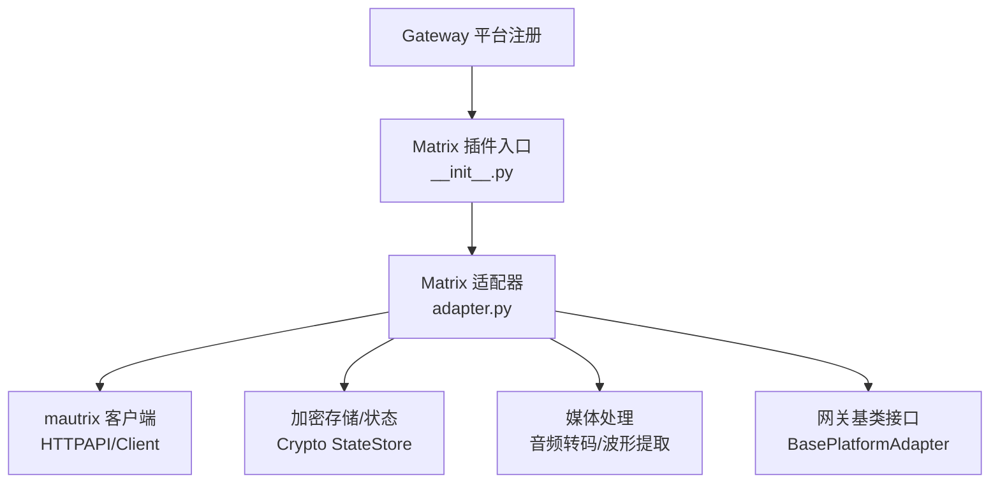
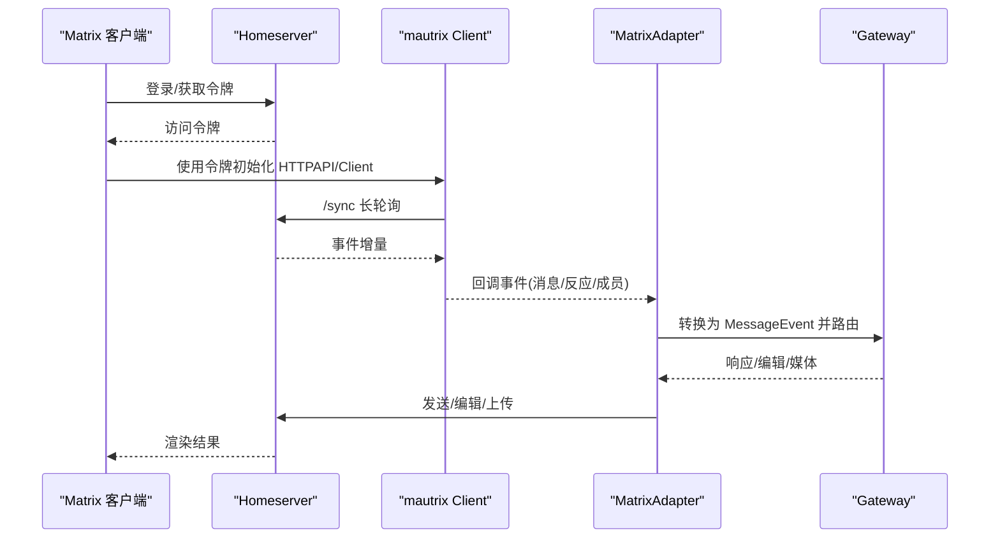
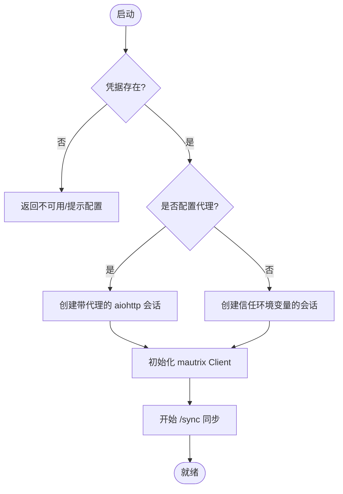
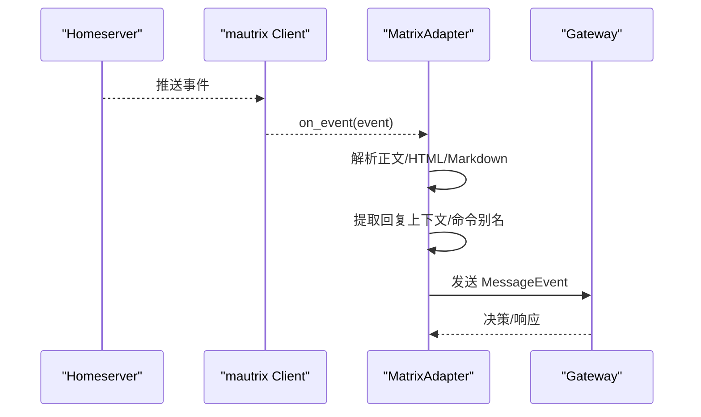
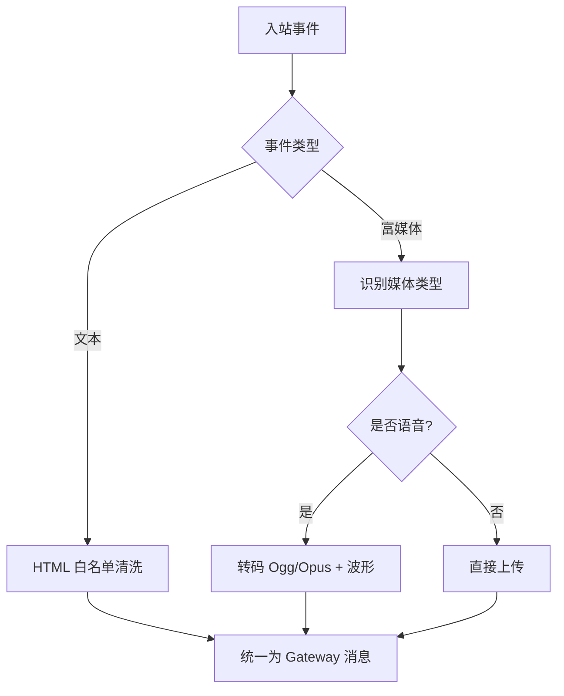
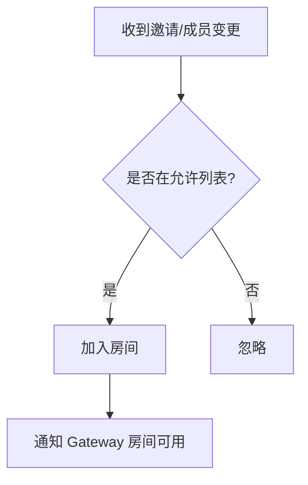
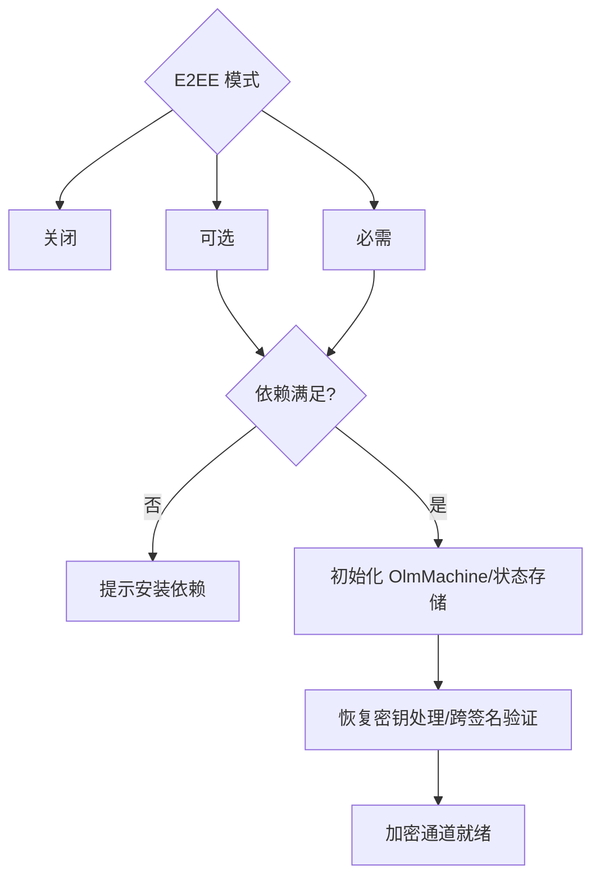
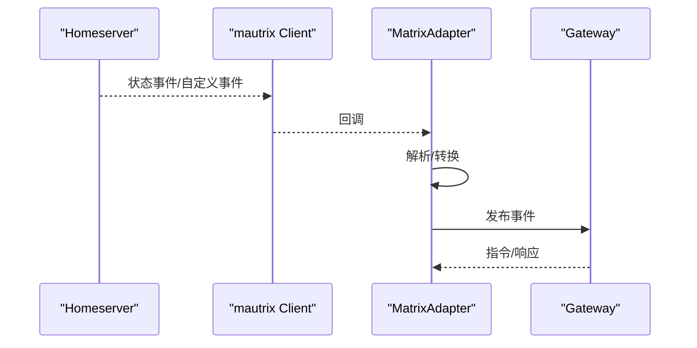
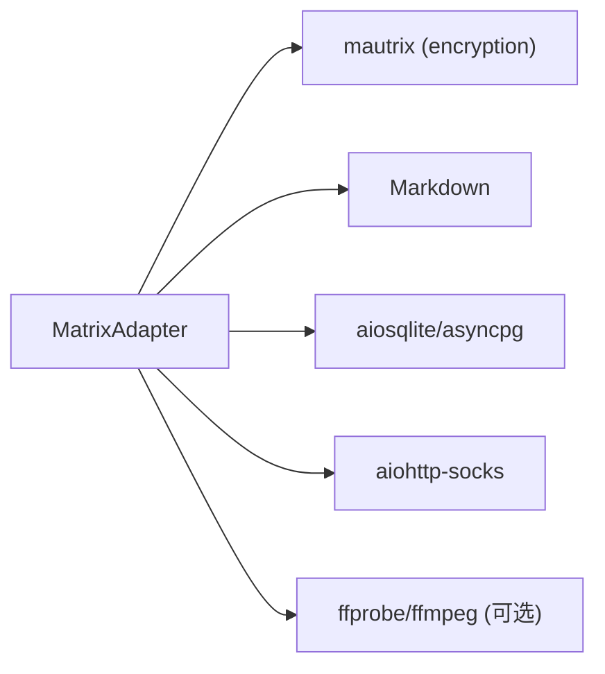

# Matrix 平台适配器

<cite>
**本文引用的文件**
- [plugins/platforms/matrix/adapter.py](file://plugins/platforms/matrix/adapter.py)
- [plugins/platforms/matrix/plugin.yaml](file://plugins/platforms/matrix/plugin.yaml)
- [plugins/platforms/matrix/__init__.py](file://plugins/platforms/matrix/__init__.py)
- [gateway/platforms/base.py](file://gateway/platforms/base.py)
- [tests/gateway/test_matrix.py](file://tests/gateway/test_matrix.py)
</cite>

## 目录
1. [简介](#简介)
2. [项目结构](#项目结构)
3. [核心组件](#核心组件)
4. [架构总览](#架构总览)
5. [详细组件分析](#详细组件分析)
6. [依赖关系分析](#依赖关系分析)
7. [性能与内存管理](#性能与内存管理)
8. [故障排查指南](#故障排查指南)
9. [结论](#结论)
10. [附录：配置与环境变量](#附录配置与环境变量)

## 简介
本文件为 Hermes Agent 的 Matrix 平台适配器的开发文档。内容覆盖 Matrix Protocol 的核心概念（房间、用户、事件、服务器）、Element Server 与客户端 SDK 集成方式（认证、加入房间、事件监听）、消息类型映射（纯文本、富文本、HTML、Markdown、富媒体）、房间管理与权限控制、邀请与访问级别、文件上传与缩略图处理、端到端加密（E2EE）与密钥管理、自定义事件与实时通信示例，以及兼容性、调试技巧与性能优化建议。

## 项目结构
Matrix 平台以插件形式接入 Gateway，核心实现位于 plugins/platforms/matrix 目录，通过 __init__.py 暴露注册函数，由 Gateway 平台注册机制加载。

图表来源
- [plugins/platforms/matrix/__init__.py:1-4](file://plugins/platforms/matrix/__init__.py#L1-L4)
- [plugins/platforms/matrix/adapter.py:1136-1200](file://plugins/platforms/matrix/adapter.py#L1136-L1200)
- [gateway/platforms/base.py:3580-3650](file://gateway/platforms/base.py#L3580-L3650)

章节来源
- [plugins/platforms/matrix/__init__.py:1-4](file://plugins/platforms/matrix/__init__.py#L1-L4)
- [plugins/platforms/matrix/adapter.py:1136-1200](file://plugins/platforms/matrix/adapter.py#L1136-L1200)
- [gateway/platforms/base.py:3580-3650](file://gateway/platforms/base.py#L3580-L3650)

## 核心组件
- MatrixAdapter：继承自 BasePlatformAdapter，负责连接 homeserver、同步事件、发送消息、处理媒体与 E2EE。
- 事件处理器：注册 m.room.message、m.reaction、成员变更等事件，将入站事件转换为 Gateway 内部 MessageEvent。
- 媒体管线：支持图片、视频、语音上传；对语音进行 Ogg/Opus 转码并生成波形元数据。
- HTML/Markdown 安全转换：内置白名单 HTML 清理器，防止脚本注入。
- 命令别名：将 Matrix 友好的 !command 转换为 /command 供 Gateway 分发。
- 权限与过滤：支持允许用户列表、允许房间列表、@提及要求、免提及房间等。
- E2EE：可选开启 off/optional/required，支持恢复密钥输出与跨签名验证。

章节来源
- [plugins/platforms/matrix/adapter.py:1-50](file://plugins/platforms/matrix/adapter.py#L1-L50)
- [plugins/platforms/matrix/adapter.py:414-491](file://plugins/platforms/matrix/adapter.py#L414-L491)
- [plugins/platforms/matrix/adapter.py:278-346](file://plugins/platforms/matrix/adapter.py#L278-L346)
- [plugins/platforms/matrix/adapter.py:1136-1200](file://plugins/platforms/matrix/adapter.py#L1136-L1200)

## 架构总览
下图展示从 Matrix 客户端到 Gateway 的事件流与回发路径，包括认证、同步、事件解析、消息发送与编辑。

图表来源
- [plugins/platforms/matrix/adapter.py:716-747](file://plugins/platforms/matrix/adapter.py#L716-L747)
- [plugins/platforms/matrix/adapter.py:1136-1200](file://plugins/platforms/matrix/adapter.py#L1136-L1200)
- [gateway/platforms/base.py:3580-3650](file://gateway/platforms/base.py#L3580-L3650)

## 详细组件分析

### 认证与会话建立
- 支持凭据来源：access token 或密码登录；可通过配置或环境变量注入。
- 代理支持：aiohttp 会话可配置 HTTP(S)/SOCKS 代理，确保所有请求生效。
- 首次启动与重连：connect() 接受 is_reconnect 参数，便于网关在断线后恢复。

图表来源
- [plugins/platforms/matrix/adapter.py:716-747](file://plugins/platforms/matrix/adapter.py#L716-L747)
- [gateway/platforms/base.py:3580-3650](file://gateway/platforms/base.py#L3580-L3650)

章节来源
- [plugins/platforms/matrix/adapter.py:716-747](file://plugins/platforms/matrix/adapter.py#L716-L747)
- [gateway/platforms/base.py:3580-3650](file://gateway/platforms/base.py#L3580-L3650)

### 事件监听与消息解析
- 事件类型：m.room.message、m.reaction、成员变更等。
- 回复解析：兼容 Matrix 内联引用格式，提取被回复内容与作者 MXID。
- 命令别名：!command 自动归一化为 /command，交由 Gateway 分发。
- 时间戳容错：兼容毫秒/秒级时间戳，避免时钟偏差导致消息丢弃。

图表来源
- [plugins/platforms/matrix/adapter.py:348-412](file://plugins/platforms/matrix/adapter.py#L348-L412)
- [plugins/platforms/matrix/adapter.py:278-346](file://plugins/platforms/matrix/adapter.py#L278-L346)
- [plugins/platforms/matrix/adapter.py:696-714](file://plugins/platforms/matrix/adapter.py#L696-L714)

章节来源
- [plugins/platforms/matrix/adapter.py:278-346](file://plugins/platforms/matrix/adapter.py#L278-L346)
- [plugins/platforms/matrix/adapter.py:348-412](file://plugins/platforms/matrix/adapter.py#L348-L412)
- [plugins/platforms/matrix/adapter.py:696-714](file://plugins/platforms/matrix/adapter.py#L696-L714)

### 消息类型映射与富文本安全
- 文本：纯文本、Markdown、HTML 均支持；HTML 经白名单清洗，仅允许安全标签与属性。
- 富媒体：图片、视频、语音；语音优先转码为 Ogg/Opus，附带时长与波形元数据以提升 Element 气泡渲染。
- 长度分片：根据 max_message_length 自动拆分超长消息，避免客户端渲染问题。

图表来源
- [plugins/platforms/matrix/adapter.py:414-491](file://plugins/platforms/matrix/adapter.py#L414-L491)
- [plugins/platforms/matrix/adapter.py:147-224](file://plugins/platforms/matrix/adapter.py#L147-L224)
- [plugins/platforms/matrix/adapter.py:225-276](file://plugins/platforms/matrix/adapter.py#L225-L276)
- [plugins/platforms/matrix/adapter.py:569-591](file://plugins/platforms/matrix/adapter.py#L569-L591)

章节来源
- [plugins/platforms/matrix/adapter.py:414-491](file://plugins/platforms/matrix/adapter.py#L414-L491)
- [plugins/platforms/matrix/adapter.py:147-224](file://plugins/platforms/matrix/adapter.py#L147-L224)
- [plugins/platforms/matrix/adapter.py:225-276](file://plugins/platforms/matrix/adapter.py#L225-L276)
- [plugins/platforms/matrix/adapter.py:569-591](file://plugins/platforms/matrix/adapter.py#L569-L591)

### 房间管理、邀请与权限控制
- 允许用户/房间：支持按用户 ID 或房间 ID 白名单限制触发。
- @提及要求：默认需要 @mention 才触发，可配置免提及房间。
- 邀请处理：监听成员变更，自动加入受邀房间（可配置）。
- 访问级别：结合房间可见性与权限策略，配合 Gateway 的权限模型。

图表来源
- [plugins/platforms/matrix/adapter.py:1136-1200](file://plugins/platforms/matrix/adapter.py#L1136-L1200)

章节来源
- [plugins/platforms/matrix/adapter.py:1136-1200](file://plugins/platforms/matrix/adapter.py#L1136-L1200)

### 文件上传与缩略图/媒体处理
- 图片/视频：上传至 homeserver，返回 ContentURI，用于消息体引用。
- 语音：优先转码为 Ogg/Opus，附带 duration 与 waveform，提升 Element 气泡体验。
- 缩略图：由 homeserver 或客户端处理；适配器提供最佳实践元数据。

章节来源
- [plugins/platforms/matrix/adapter.py:147-224](file://plugins/platforms/matrix/adapter.py#L147-L224)
- [plugins/platforms/matrix/adapter.py:225-276](file://plugins/platforms/matrix/adapter.py#L225-L276)

### 端到端加密（E2EE）与密钥管理
- 模式：off / optional / required，支持向后兼容 MATRIX_ENCRYPTION。
- 依赖检查：检测 python-olm、asyncpg、aiosqlite 等依赖，缺失时给出安装提示。
- 恢复密钥：支持生成一次性恢复密钥并写入受保护文件，或通过环境变量复用。
- 跨签名验证：基于 OlmMachine 与状态存储，维护房间加密信息与共享房间缓存。

图表来源
- [plugins/platforms/matrix/adapter.py:749-780](file://plugins/platforms/matrix/adapter.py#L749-L780)
- [plugins/platforms/matrix/adapter.py:996-1066](file://plugins/platforms/matrix/adapter.py#L996-L1066)
- [plugins/platforms/matrix/adapter.py:803-900](file://plugins/platforms/matrix/adapter.py#L803-L900)
- [plugins/platforms/matrix/adapter.py:1068-1134](file://plugins/platforms/matrix/adapter.py#L1068-L1134)

章节来源
- [plugins/platforms/matrix/adapter.py:749-780](file://plugins/platforms/matrix/adapter.py#L749-L780)
- [plugins/platforms/matrix/adapter.py:996-1066](file://plugins/platforms/matrix/adapter.py#L996-L1066)
- [plugins/platforms/matrix/adapter.py:803-900](file://plugins/platforms/matrix/adapter.py#L803-L900)
- [plugins/platforms/matrix/adapter.py:1068-1134](file://plugins/platforms/matrix/adapter.py#L1068-L1134)

### 自定义事件类型、房间状态更新与实时通信
- 自定义事件：可在适配器中注册对应事件类型的处理器，将业务事件转为 Gateway 消息。
- 房间状态：监听 m.room.name、成员变化等状态事件，更新本地缓存并通知 Gateway。
- 实时通信：基于 /sync 长轮询，事件驱动，低延迟。

图表来源
- [plugins/platforms/matrix/adapter.py:1136-1200](file://plugins/platforms/matrix/adapter.py#L1136-L1200)

章节来源
- [plugins/platforms/matrix/adapter.py:1136-1200](file://plugins/platforms/matrix/adapter.py#L1136-L1200)

### 兼容性考虑（不同客户端渲染差异）
- Element 语音气泡：依赖 MSC3245 voice 元数据（duration/waveform），适配器尽力生成。
- 大消息：部分客户端渲染不佳，适配器按 max_message_length 分片。
- HTML 安全：严格白名单，避免脚本与危险属性。

章节来源
- [plugins/platforms/matrix/adapter.py:147-224](file://plugins/platforms/matrix/adapter.py#L147-L224)
- [plugins/platforms/matrix/adapter.py:414-491](file://plugins/platforms/matrix/adapter.py#L414-L491)
- [plugins/platforms/matrix/adapter.py:569-591](file://plugins/platforms/matrix/adapter.py#L569-L591)

## 依赖关系分析
- 外部依赖：mautrix（含 encryption）、Markdown、aiosqlite、asyncpg、aiohttp-socks。
- 运行时依赖：ffprobe/ffmpeg（可选，用于语音元数据与转码）。
- 模块绑定：lazy_deps 按需安装并重新绑定类型全局变量，保证测试与生产一致性。

图表来源
- [plugins/platforms/matrix/adapter.py:996-1066](file://plugins/platforms/matrix/adapter.py#L996-L1066)
- [plugins/platforms/matrix/adapter.py:147-224](file://plugins/platforms/matrix/adapter.py#L147-L224)

章节来源
- [plugins/platforms/matrix/adapter.py:996-1066](file://plugins/platforms/matrix/adapter.py#L996-L1066)
- [plugins/platforms/matrix/adapter.py:147-224](file://plugins/platforms/matrix/adapter.py#L147-L224)

## 性能与内存管理
- 事件流处理：/sync 增量同步，避免全量拉取；合理设置 startup grace 窗口减少误判。
- 消息分片：按 max_message_length 切分，降低客户端压力与内存占用。
- 媒体处理：语音转码与波形计算异步化，失败降级为原始文件传输。
- 代理与会话：复用 aiohttp 会话，减少连接开销；SOCKS 通过 Connector 层应用。
- 日志脱敏：URL 查询串与敏感信息脱敏，避免泄露。

章节来源
- [plugins/platforms/matrix/adapter.py:569-591](file://plugins/platforms/matrix/adapter.py#L569-L591)
- [plugins/platforms/matrix/adapter.py:225-276](file://plugins/platforms/matrix/adapter.py#L225-L276)
- [plugins/platforms/matrix/adapter.py:716-747](file://plugins/platforms/matrix/adapter.py#L716-L747)
- [plugins/platforms/matrix/adapter.py:912-921](file://plugins/platforms/matrix/adapter.py#L912-L921)

## 故障排查指南
- 无法连接：检查 MATRIX_HOMESERVER、MATRIX_ACCESS_TOKEN/MATRIX_PASSWORD；确认依赖已安装。
- E2EE 失败：确认 e2ee_mode 与依赖；查看恢复密钥输出与跨签名验证日志。
- 消息不显示：检查 @mention 要求与允许房间/用户列表；确认事件时间戳未因时钟偏差被丢弃。
- 语音无气泡：确认 ffmpeg/ffprobe 可用；检查 duration/waveform 元数据生成。
- 代理问题：确认 HTTP(S)/SOCKS 代理配置正确；必要时启用 trust_env。

章节来源
- [plugins/platforms/matrix/adapter.py:972-994](file://plugins/platforms/matrix/adapter.py#L972-L994)
- [plugins/platforms/matrix/adapter.py:749-780](file://plugins/platforms/matrix/adapter.py#L749-L780)
- [plugins/platforms/matrix/adapter.py:803-900](file://plugins/platforms/matrix/adapter.py#L803-L900)
- [plugins/platforms/matrix/adapter.py:696-714](file://plugins/platforms/matrix/adapter.py#L696-L714)
- [plugins/platforms/matrix/adapter.py:716-747](file://plugins/platforms/matrix/adapter.py#L716-L747)

## 结论
Matrix 平台适配器提供了完整的 Matrix 协议集成能力，涵盖认证、事件处理、富媒体、权限控制与 E2EE。通过严格的 HTML 安全清洗、消息分片与代理支持，适配多种客户端渲染差异。建议在部署时明确 e2ee_mode、依赖与代理配置，并结合允许列表与 @mention 策略保障安全性与可用性。

## 附录：配置与环境变量
- 必填：
  - MATRIX_HOMESERVER：Homeserver URL
  - MATRIX_ACCESS_TOKEN 或 MATRIX_PASSWORD：认证凭据
- 可选：
  - MATRIX_USER_ID：完整用户 ID（密码登录时使用）
  - MATRIX_DEVICE_ID：设备 ID（E2EE 持久化）
  - MATRIX_PROXY：HTTP(S)/SOCKS 代理
  - MATRIX_ALLOWED_USERS / MATRIX_ALLOWED_ROOMS：白名单
  - MATRIX_HOME_ROOM：通知/定时任务目标房间
  - MATRIX_REACTIONS：是否处理生命周期反应
  - MATRIX_REQUIRE_MENTION / MATRIX_FREE_RESPONSE_ROOMS：@提及策略
  - MATRIX_PROCESS_NOTICES：是否处理 m.notice
  - MATRIX_ALLOW_ROOM_MENTIONS：是否允许 @room 提及
  - MATRIX_TOOLS_ALLOW_*：工具执行开关（redaction/invite/create room）
  - MATRIX_AUTO_THREAD / MATRIX_DM_AUTO_THREAD：线程策略
  - MATRIX_RECOVERY_KEY / MATRIX_RECOVERY_KEY_OUTPUT_FILE：恢复密钥
  - MATRIX_DM_MENTION_THREADS：DM 中被 @mention 时创建线程
  - MATRIX_ALLOW_PUBLIC_ROOMS：是否允许创建公开房间
  - MATRIX_MAX_MESSAGE_LENGTH：出站消息分片长度
  - MATRIX_APPROVAL_REQUIRE_SENDER / MATRIX_APPROVAL_TIMEOUT_SECONDS：审批策略
  - MATRIX_E2EE_MODE：off/optional/required（覆盖 MATRIX_ENCRYPTION）

章节来源
- [plugins/platforms/matrix/adapter.py:1-50](file://plugins/platforms/matrix/adapter.py#L1-L50)
- [plugins/platforms/matrix/plugin.yaml:1-42](file://plugins/platforms/matrix/plugin.yaml#L1-L42)