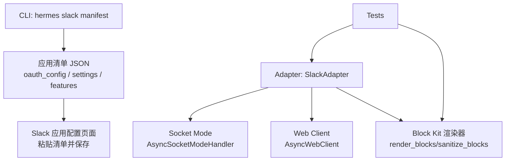
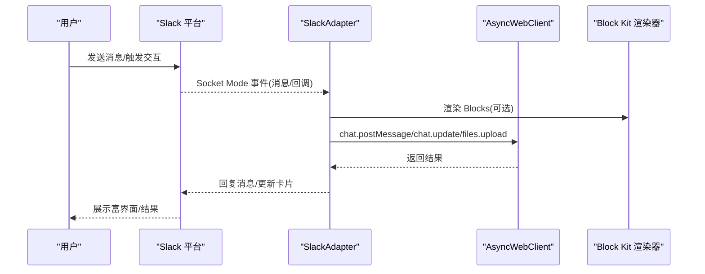
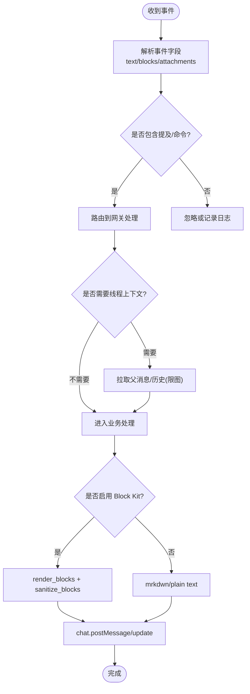
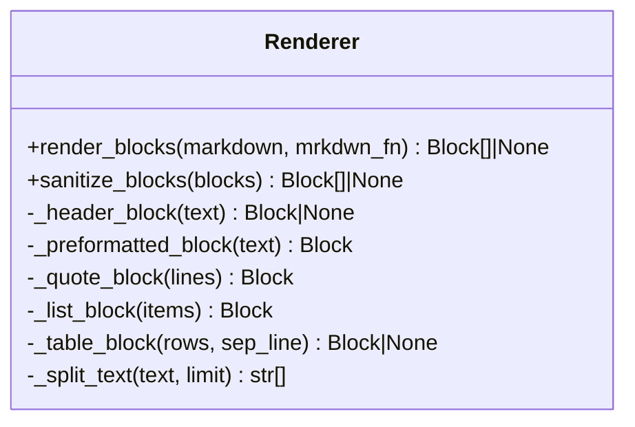
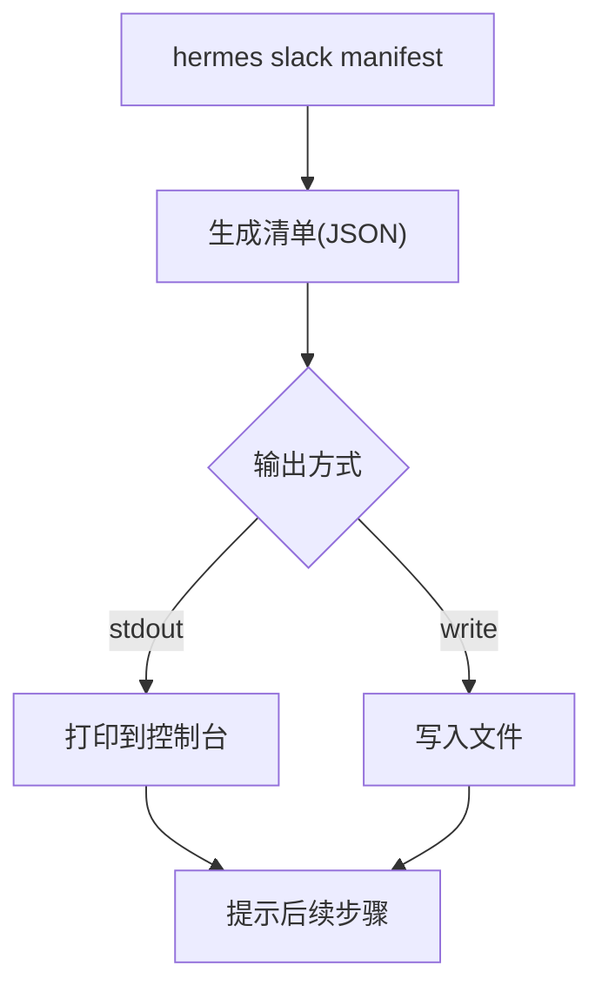
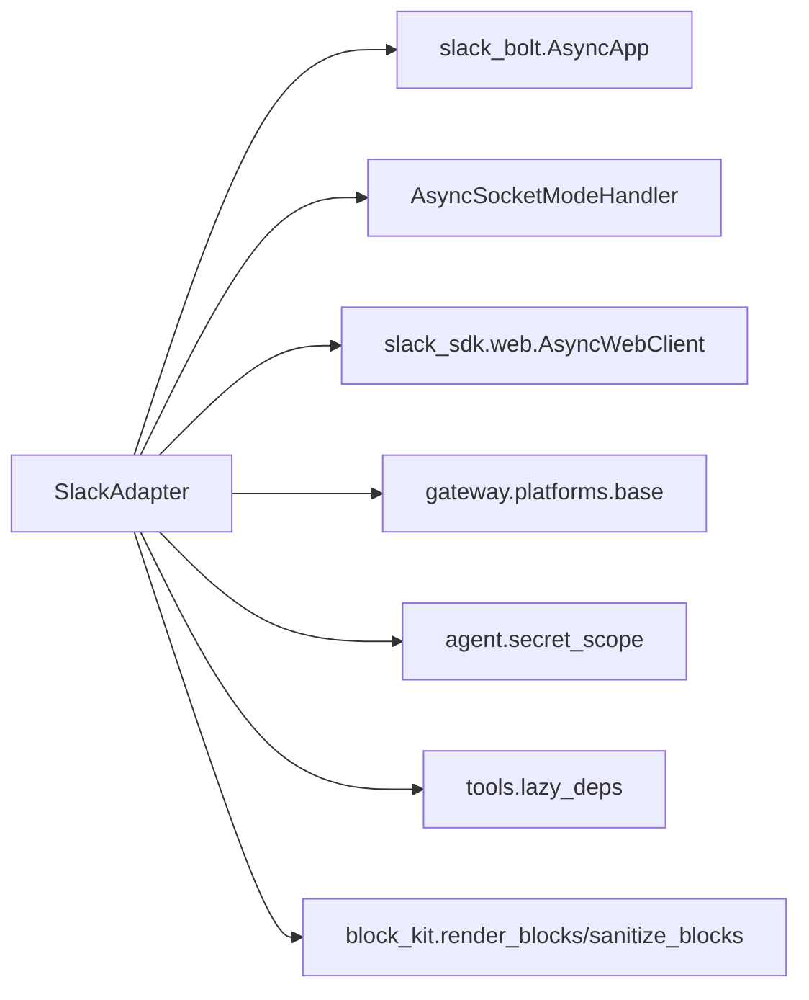

# Slack 平台适配器

<cite>
**本文引用的文件**
- [adapter.py](file://plugins/platforms/slack/adapter.py)
- [block_kit.py](file://plugins/platforms/slack/block_kit.py)
- [slack_cli.py](file://hermes_cli/slack_cli.py)
- [subcommands/slack.py](file://hermes_cli/subcommands/slack.py)
- [test_slack.py](file://tests/gateway/test_slack.py)
- [test_slack_block_kit.py](file://tests/gateway/test_slack_block_kit.py)
- [test_adapter_connect_is_reconnect_contract.py](file://tests/gateway/test_adapter_connect_is_reconnect_contract.py)
</cite>

## 目录
1. [简介](#简介)
2. [项目结构](#项目结构)
3. [核心组件](#核心组件)
4. [架构总览](#架构总览)
5. [详细组件分析](#详细组件分析)
6. [依赖关系分析](#依赖关系分析)
7. [性能与限制](#性能与限制)
8. [故障排查指南](#故障排查指南)
9. [结论](#结论)
10. [附录：配置与部署清单](#附录配置与部署清单)

## 简介
本文件面向在 Hermes Agent 中集成 Slack 平台的开发者，系统性说明 Slack App 与 Bot 的配置流程、OAuth 授权、权限申请与应用安装；详解 Slack Block Kit 的使用，构建富界面元素（表格、卡片、表单、交互组件）；解释消息类型转换（普通消息、富文本、附件、多格式内容）；覆盖频道管理、私聊会话、线程讨论与直接消息处理；包含文件上传、预览生成与多媒体内容处理；说明 Events API 与 Socket Mode 的配置和使用；提供自定义视图、模态框与回调处理的实现思路；并总结 Slack 平台限制、调试技巧与性能优化建议。

## 项目结构
Slack 适配相关代码主要分布在以下位置：
- 平台适配器与渲染器：plugins/platforms/slack/
- CLI 工具（应用清单生成）：hermes_cli/
- 测试与契约校验：tests/gateway/

图表来源
- [slack_cli.py:30-163](file://hermes_cli/slack_cli.py#L30-L163)
- [adapter.py:25-60](file://plugins/platforms/slack/adapter.py#L25-L60)
- [block_kit.py:368-535](file://plugins/platforms/slack/block_kit.py#L368-L535)

章节来源
- [slack_cli.py:1-163](file://hermes_cli/slack_cli.py#L1-L163)
- [adapter.py:1-120](file://plugins/platforms/slack/adapter.py#L1-L120)
- [block_kit.py:1-60](file://plugins/platforms/slack/block_kit.py#L1-L60)

## 核心组件
- Slack 适配器（SlackAdapter）：基于 slack-bolt 的异步应用与 Socket Mode，负责事件接收、消息路由、线程上下文缓存、代理与重连、去重等。
- Block Kit 渲染器：将 Markdown 转换为 Slack Block Kit blocks，支持标题、列表、引用、代码块、原生表格与富文本段落，并在边界处做安全裁剪。
- CLI 清单生成：自动生成包含斜杠命令、OAuth scopes、事件订阅与 Socket Mode 的应用清单，便于一键注册到 Slack 应用。

章节来源
- [adapter.py:1-120](file://plugins/platforms/slack/adapter.py#L1-L120)
- [block_kit.py:368-535](file://plugins/platforms/slack/block_kit.py#L368-L535)
- [slack_cli.py:30-163](file://hermes_cli/slack_cli.py#L30-L163)

## 架构总览
Hermes 通过 Slack Adapter 使用 Socket Mode 建立与 Slack 的双向连接，接收消息与交互事件，调用 Web API 发送消息与文件，并使用 Block Kit 渲染富文本。CLI 用于生成应用清单，简化 OAuth 与事件订阅配置。

图表来源
- [adapter.py:25-60](file://plugins/platforms/slack/adapter.py#L25-L60)
- [block_kit.py:368-535](file://plugins/platforms/slack/block_kit.py#L368-L535)

## 详细组件分析

### Slack 适配器（SlackAdapter）
- 连接与事件
  - 使用 AsyncApp 与 AsyncSocketModeHandler 建立 Socket Mode 连接。
  - 注册 message、app_mention、reaction_*、assistant_thread_*、app_home_opened/app_context_changed 等事件。
  - 支持按团队隔离的多工作区场景，维护 channel-to-team 映射。
- 消息处理
  - 解析 Slack 事件中的 text/blocks/attachments，提取可读文本与 URL。
  - 对 @everyone/@channel/@here 等特殊提及进行清理。
  - 线程上下文缓存：拉取父消息与历史消息，控制下载图片数量，避免冷启动时过多 IO。
- 发送与富文本
  - 优先尝试 Block Kit 渲染，失败回退到 mrkdwn/plain text。
  - 对外发 blocks 执行 sanitize，截断超长文本、修复 column_settings、丢弃空块，确保不超过 Slack 限制。
- 代理与网络
  - 自动解析代理并应用到 Slack SDK 客户端，遵循 NO_PROXY 白名单。
  - 对 Socket Mode 后台任务进行优雅取消与超时等待。
- 去重与幂等
  - 针对 Socket Mode 重投递，使用可配置的 TTL 去重窗口，避免重复回复。

图表来源
- [adapter.py:110-253](file://plugins/platforms/slack/adapter.py#L110-L253)
- [adapter.py:325-380](file://plugins/platforms/slack/adapter.py#L325-L380)
- [adapter.py:494-533](file://plugins/platforms/slack/adapter.py#L494-L533)
- [adapter.py:557-622](file://plugins/platforms/slack/adapter.py#L557-L622)
- [adapter.py:665-746](file://plugins/platforms/slack/adapter.py#L665-L746)
- [adapter.py:748-800](file://plugins/platforms/slack/adapter.py#L748-L800)

章节来源
- [adapter.py:25-120](file://plugins/platforms/slack/adapter.py#L25-L120)
- [adapter.py:254-380](file://plugins/platforms/slack/adapter.py#L254-L380)
- [adapter.py:494-622](file://plugins/platforms/slack/adapter.py#L494-L622)
- [adapter.py:665-800](file://plugins/platforms/slack/adapter.py#L665-L800)

### Block Kit 渲染器
- 能力
  - 将 Markdown 段落、标题、分隔线、引用、列表、代码块、管道表格转换为 Slack Block Kit blocks。
  - 表格超过 Slack 限制（行数/列数/字符总数）时自动降级为等宽预格式化文本。
  - 对 section/header/context 文本进行长度截断，修复 column_settings，丢弃空块，保证 payload 合法。
- 设计约束
  - 永远不抛出异常；渲染失败回退到纯文本路径，确保消息不丢失。
  - 每个 blocks 必须附带 text 回退，以兼容通知、读屏与旧客户端。

图表来源
- [block_kit.py:166-243](file://plugins/platforms/slack/block_kit.py#L166-L243)
- [block_kit.py:295-340](file://plugins/platforms/slack/block_kit.py#L295-L340)
- [block_kit.py:368-535](file://plugins/platforms/slack/block_kit.py#L368-L535)
- [block_kit.py:581-689](file://plugins/platforms/slack/block_kit.py#L581-L689)

章节来源
- [block_kit.py:1-60](file://plugins/platforms/slack/block_kit.py#L1-L60)
- [block_kit.py:368-535](file://plugins/platforms/slack/block_kit.py#L368-L535)
- [block_kit.py:581-689](file://plugins/platforms/slack/block_kit.py#L581-L689)

### CLI 应用清单生成
- 功能
  - 生成完整 Slack 应用清单，包含显示信息、Bot 用户、斜杠命令、OAuth scopes、事件订阅、Socket Mode 设置。
  - 支持选择 Assistant/Agent/无 AI 对话体验，以及仅输出斜杠命令片段以便合并到现有清单。
  - 支持写入文件或标准输出，并提供下一步操作指引。
- 关键配置项
  - oauth_config.scopes.bot：读取频道历史、写入消息、文件读写、反应读取、用户读取等。
  - settings.event_subscriptions.bot_events：消息、反应、助手线程生命周期等。
  - settings.socket_mode_enabled：启用 Socket Mode。

图表来源
- [slack_cli.py:30-163](file://hermes_cli/slack_cli.py#L30-L163)
- [slack_cli.py:166-283](file://hermes_cli/slack_cli.py#L166-L283)
- [subcommands/slack.py:12-94](file://hermes_cli/subcommands/slack.py#L12-L94)

章节来源
- [slack_cli.py:1-163](file://hermes_cli/slack_cli.py#L1-L163)
- [slack_cli.py:166-283](file://hermes_cli/slack_cli.py#L166-L283)
- [subcommands/slack.py:12-94](file://hermes_cli/subcommands/slack.py#L12-L94)

### 测试与契约
- 适配器连接契约：所有平台适配器的 connect() 必须接受 is_reconnect 关键字参数，否则重连时会崩溃。
- Block Kit 单元测试：验证标题、嵌套列表、链接、表格、空内容防护、超界裁剪等。
- 适配器行为测试：事件注册、斜杠命令路由、多工作区隔离、忽略频道抑制等。

章节来源
- [test_adapter_connect_is_reconnect_contract.py:1-109](file://tests/gateway/test_adapter_connect_is_reconnect_contract.py#L1-L109)
- [test_slack_block_kit.py:1-200](file://tests/gateway/test_slack_block_kit.py#L1-L200)
- [test_slack.py:103-400](file://tests/gateway/test_slack.py#L103-L400)

## 依赖关系分析
- 外部依赖
  - slack_bolt：异步应用框架与 Socket Mode 处理器。
  - slack_sdk：异步 Web 客户端，用于调用 Slack API。
  - aiohttp：底层 HTTP 客户端。
- 内部依赖
  - gateway.platforms.base：基础适配器接口、消息类型、文档/视频缓存、代理解析等。
  - agent.secret_scope：获取密钥。
  - tools.lazy_deps：按需懒加载第三方依赖。

图表来源
- [adapter.py:25-60](file://plugins/platforms/slack/adapter.py#L25-L60)
- [adapter.py:286-323](file://plugins/platforms/slack/adapter.py#L286-L323)

章节来源
- [adapter.py:25-60](file://plugins/platforms/slack/adapter.py#L25-L60)
- [adapter.py:286-323](file://plugins/platforms/slack/adapter.py#L286-L323)

## 性能与限制
- Slack 平台限制（由渲染器与适配器共同保障）
  - 消息块上限：最多 50 个 blocks。
  - section/context 文本上限：3000 字符。
  - header 文本上限：150 字符。
  - 原生 table 限制：最多 100 行、20 列、单元格累计字符 10000。
  - 当超出限制或无法解析时，自动降级为等宽预格式化文本或回退到纯文本，确保消息不丢失。
- 去重与重投递
  - Socket Mode 重投递窗口默认 1 小时，可通过环境变量调整，防止重复回复。
- 代理与网络
  - 自动应用代理，尊重 NO_PROXY 白名单；对不支持协议或绕过策略进行日志记录。
- 资源与关闭
  - Socket Mode 后台任务取消带超时，避免关闭阻塞。
- 批量与缓存
  - 线程上下文缓存减少重复 API 调用；音频/视频/文档缓存复用已下载内容，降低带宽与延迟。

章节来源
- [block_kit.py:35-42](file://plugins/platforms/slack/block_kit.py#L35-L42)
- [block_kit.py:581-689](file://plugins/platforms/slack/block_kit.py#L581-L689)
- [adapter.py:748-800](file://plugins/platforms/slack/adapter.py#L748-L800)
- [adapter.py:665-746](file://plugins/platforms/slack/adapter.py#L665-L746)
- [adapter.py:267-284](file://plugins/platforms/slack/adapter.py#L267-L284)

## 故障排查指南
- 常见问题定位
  - 事件未触发：检查事件订阅与 Socket Mode 是否启用；确认 app_mention/message/reaction 等事件已注册。
  - 消息被忽略：确认未命中 ignored_channels；检查去重窗口是否导致重复过滤。
  - 富文本不生效：查看 render_blocks 是否返回 None（超限或解析失败），此时会回退到 mrkdwn/plain text。
  - 审批卡片不更新：检查 sanitize_blocks 是否截断过长文本或修复了 column_settings。
- 调试技巧
  - 开启 DEBUG 日志观察事件接收与过滤原因（如 bot_message）。
  - 使用 CLI 生成清单并粘贴到 Slack 应用配置，逐步验证 scopes/events/socket mode。
  - 通过测试用例快速验证 Block Kit 渲染与适配器行为。
- 恢复策略
  - 重连时确保 connect() 接受 is_reconnect 参数，避免重启后通道静默断开。
  - 对 Socket Mode 任务进行优雅取消与超时等待，避免卡死。

章节来源
- [test_slack.py:207-236](file://tests/gateway/test_slack.py#L207-L236)
- [test_slack.py:302-400](file://tests/gateway/test_slack.py#L302-L400)
- [test_slack_block_kit.py:117-200](file://tests/gateway/test_slack_block_kit.py#L117-L200)
- [test_adapter_connect_is_reconnect_contract.py:1-109](file://tests/gateway/test_adapter_connect_is_reconnect_contract.py#L1-L109)

## 结论
Slack 适配器在 Hermes 中提供了稳定可靠的接入层：通过 Socket Mode 高效收发事件，借助 Block Kit 渲染富界面，并通过 CLI 简化应用清单配置。适配器内置去重、代理、线程上下文缓存与严格的边界裁剪，确保在高负载与复杂输入下仍保持稳定。结合完善的测试与契约校验，可在生产环境中可靠运行。

## 附录：配置与部署清单
- 应用清单生成
  - 使用 CLI 生成完整清单或仅斜杠命令片段，粘贴至 Slack 应用配置并保存。
  - 根据需求选择 Assistant/Agent/无 AI 对话体验。
- OAuth 与权限
  - 确保启用必要的 bot scopes（如 channels:history、chat:write、files:read/write、reactions:read、users:read 等）。
- 事件订阅
  - 订阅 message、app_mention、reaction_added/removed、assistant_thread_*、app_home_opened/app_context_changed 等。
- Socket Mode
  - 启用 Socket Mode，配置 App Token（xapp-...）与 Bot Token（xoxb-...）。
- 代理与网络
  - 如需代理，确保协议受支持且不在 NO_PROXY 白名单内。
- 环境变量
  - SLACK_DEDUP_TTL_SECONDS：调整 Socket Mode 重投递去重窗口。

章节来源
- [slack_cli.py:30-163](file://hermes_cli/slack_cli.py#L30-L163)
- [slack_cli.py:166-283](file://hermes_cli/slack_cli.py#L166-L283)
- [adapter.py:748-800](file://plugins/platforms/slack/adapter.py#L748-L800)