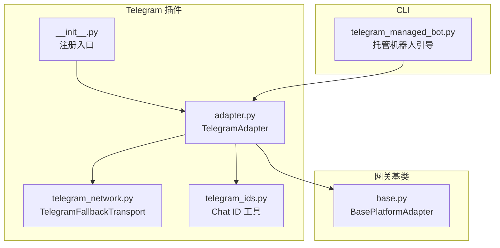
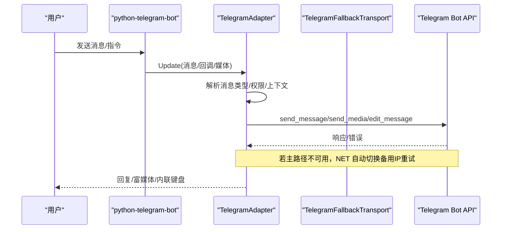
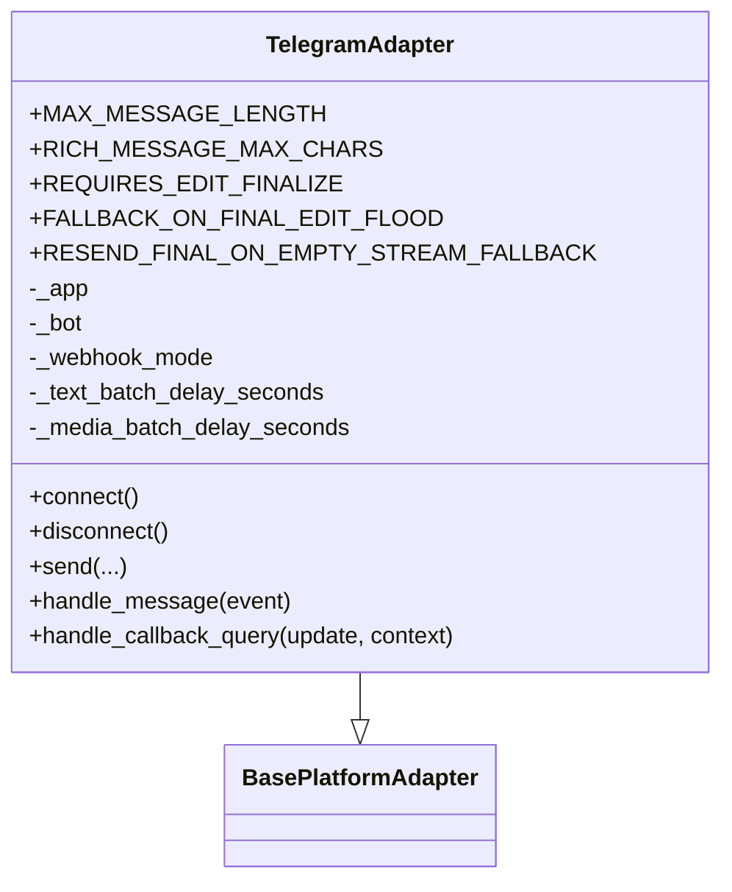
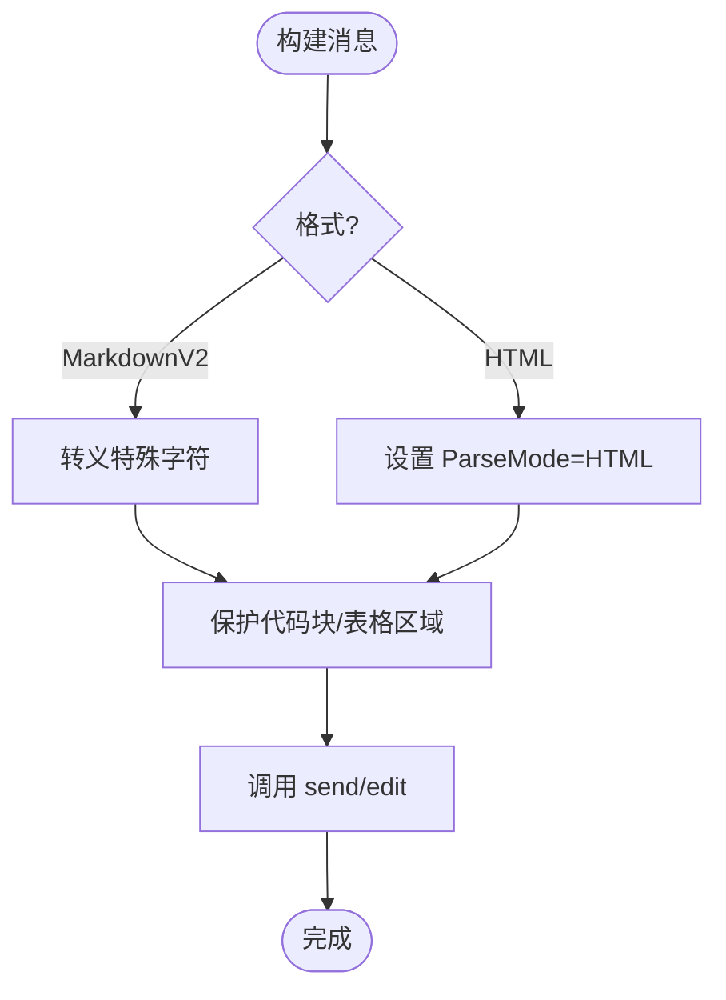
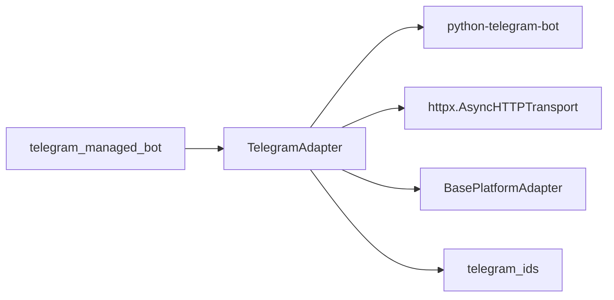

# Telegram 平台适配器

<cite>
**本文引用的文件**
- [adapter.py](file://plugins/platforms/telegram/adapter.py)
- [telegram_network.py](file://plugins/platforms/telegram/telegram_network.py)
- [telegram_ids.py](file://plugins/platforms/telegram/telegram_ids.py)
- [__init__.py](file://plugins/platforms/telegram/__init__.py)
- [telegram_managed_bot.py](file://hermes_cli/telegram_managed_bot.py)
- [base.py](file://gateway/platforms/base.py)
</cite>

## 目录
1. [简介](#简介)
2. [项目结构](#项目结构)
3. [核心组件](#核心组件)
4. [架构总览](#架构总览)
5. [详细组件分析](#详细组件分析)
6. [依赖关系分析](#依赖关系分析)
7. [性能与限制](#性能与限制)
8. [故障排查指南](#故障排查指南)
9. [结论](#结论)
10. [附录：配置与示例路径](#附录：配置与示例路径)

## 简介
本文件面向需要在 Hermes Agent 中集成 Telegram Bot API 的开发者，系统性说明 Telegram 平台适配器的实现方式、消息类型映射、权限与群组/频道/超级群组支持、富媒体处理（图片、文件、语音、视频、文档）、Markdown/HTML 渲染、内联键盘与回调按钮、文件上传下载、缩略图与音频时长探测、语音转文字能力接入点、命令与中间件扩展方式、频率与大小限制、调试与错误处理、以及性能优化建议。

## 项目结构
Telegram 平台相关代码主要位于插件目录下的 telegram 包，并配合 CLI 的托管机器人引导模块与网络层增强模块：
- 适配器核心：plugins/platforms/telegram/adapter.py
- 网络增强（DNS 失败回退）：plugins/platforms/telegram/telegram_network.py
- Chat ID 规范化：plugins/platforms/telegram/telegram_ids.py
- 插件入口：plugins/platforms/telegram/__init__.py
- 托管机器人创建流程：hermes_cli/telegram_managed_bot.py
- 平台基类与通用能力：gateway/platforms/base.py

图表来源
- [adapter.py:633-799](file://plugins/platforms/telegram/adapter.py#L633-L799)
- [telegram_network.py:52-166](file://plugins/platforms/telegram/telegram_network.py#L52-L166)
- [telegram_ids.py:23-52](file://plugins/platforms/telegram/telegram_ids.py#L23-L52)
- [__init__.py:1-4](file://plugins/platforms/telegram/__init__.py#L1-L4)
- [telegram_managed_bot.py:166-359](file://hermes_cli/telegram_managed_bot.py#L166-L359)
- [base.py:4185-4185](file://gateway/platforms/base.py#L4185-L4185)

章节来源
- [adapter.py:633-799](file://plugins/platforms/telegram/adapter.py#L633-L799)
- [telegram_network.py:52-166](file://plugins/platforms/telegram/telegram_network.py#L52-L166)
- [telegram_ids.py:23-52](file://plugins/platforms/telegram/telegram_ids.py#L23-L52)
- [__init__.py:1-4](file://plugins/platforms/telegram/__init__.py#L1-L4)
- [telegram_managed_bot.py:166-359](file://hermes_cli/telegram_managed_bot.py#L166-L359)
- [base.py:4185-4185](file://gateway/platforms/base.py#L4185-L4185)

## 核心组件
- TelegramAdapter：继承自 BasePlatformAdapter，封装长轮询/可选 Webhook 模式、消息收发、富媒体、MarkdownV2/HTML、内联键盘与回调、文本批处理与分块、编辑与最终落盘策略等。
- TelegramFallbackTransport：当 api.telegram.org 不可达时，通过 DoH 或种子 IP 进行连接回退，保持逻辑主机名与 SNI 不变。
- Chat ID 工具：统一将 chat_id 归一化为 Bot API 接受的数值或 @username 字符串。
- 托管机器人引导：提供 QR 码与深链，自动创建子机器人并轮询获取 Token。

章节来源
- [adapter.py:633-799](file://plugins/platforms/telegram/adapter.py#L633-L799)
- [telegram_network.py:52-166](file://plugins/platforms/telegram/telegram_network.py#L52-L166)
- [telegram_ids.py:23-52](file://plugins/platforms/telegram/telegram_ids.py#L23-L52)
- [telegram_managed_bot.py:166-359](file://hermes_cli/telegram_managed_bot.py#L166-L359)

## 架构总览
TelegramAdapter 在启动时根据配置选择长轮询或 Webhook 模式；长轮询模式下使用 python-telegram-bot 的 Application 与 getUpdates 循环，并通过自定义超时与心跳任务保障可恢复性。发送端对 MarkdownV2/HTML 进行安全转义与表格/代码块保护区域处理，必要时走 Rich Messages 或降级为传统路径。网络层在 DNS 失败时自动切换到备用 IP，避免“假死”。

图表来源
- [adapter.py:237-268](file://plugins/platforms/telegram/adapter.py#L237-L268)
- [adapter.py:633-799](file://plugins/platforms/telegram/adapter.py#L633-L799)
- [telegram_network.py:105-157](file://plugins/platforms/telegram/telegram_network.py#L105-L157)

## 详细组件分析

### TelegramAdapter 类与生命周期
- 关键常量与行为开关：最大消息长度、是否拆分长消息、Rich Message 字符上限、是否需要 finalize 编辑、流式最终消息重发策略等。
- 初始化参数：reply_to_mode、禁用链接预览、Rich Messages/Drafts 开关、打字状态冷却、媒体批量聚合、文本批量延迟等。
- 长轮询健康门控：首次连接需完成一次 getUpdates 往返；后续每代轮询有进度超时；心跳任务兜底防止挂起。
- 资源清理：stop/drain/start 均有独立超时，避免 CLOSE-WAIT 导致全局阻塞。

图表来源
- [adapter.py:633-799](file://plugins/platforms/telegram/adapter.py#L633-L799)
- [base.py:4185-4185](file://gateway/platforms/base.py#L4185-L4185)

章节来源
- [adapter.py:633-799](file://plugins/platforms/telegram/adapter.py#L633-L799)

### 消息类型映射与富媒体
- 文本：支持 MarkdownV2 与 HTML；对 MarkdownV2 特殊字符进行转义；对代码块/表格等“受保护区域”保留原样；单行换行在富文本路径下转为硬断行。
- 图片/文档/文件：复用基类的缓存与类型判定；按扩展名/MIME 推断；支持缩略图生成与缓存。
- 语音/音频：本地探测音频时长（WAV/mutagen/ffprobe），确保气泡显示正确时长；可接入语音转文字管线。
- 视频：发送前等待服务端转码完成，采用更长的读取超时以避免误判失败。
- 表情符号：遵循 Telegram 客户端渲染；如需在 MarkdownV2 中使用特殊字符，需转义。

章节来源
- [adapter.py:326-393](file://plugins/platforms/telegram/adapter.py#L326-L393)
- [adapter.py:461-573](file://plugins/platforms/telegram/adapter.py#L461-L573)
- [base.py:4185-4185](file://gateway/platforms/base.py#L4185-L4185)

### 权限模型、群组、频道与超级群组
- Chat ID 归一化：数值型（含负数频道 ID）与 @username 均被接受；提供键稳定化方法用于持久化。
- 权限控制：通过授权门限与环境变量作用域隔离，避免多 Profile 下错配。
- 群组/频道/超级群组：支持论坛主题 thread_id 回退；频道仅允许管理员或特定角色操作（由上层权限策略决定）。

章节来源
- [telegram_ids.py:23-52](file://plugins/platforms/telegram/telegram_ids.py#L23-L52)
- [adapter.py:41-56](file://plugins/platforms/telegram/adapter.py#L41-L56)
- [adapter.py:5443-5443](file://plugins/platforms/telegram/adapter.py#L5443-L5443)

### Markdown/HTML 与内联键盘/回调按钮
- MarkdownV2：内置转义与剥离工具；表格会转换为列表以兼容 Telegram 渲染；代码块与表格区域不被破坏。
- HTML：通过 ParseMode 发送；敏感信息在错误日志中脱敏。
- 内联键盘与回调：使用 InlineKeyboardMarkup/InlineKeyboardButton；回调查询处理器统一路由到业务逻辑。

图表来源
- [adapter.py:461-573](file://plugins/platforms/telegram/adapter.py#L461-L573)
- [adapter.py:237-268](file://plugins/platforms/telegram/adapter.py#L237-L268)

章节来源
- [adapter.py:461-573](file://plugins/platforms/telegram/adapter.py#L461-L573)
- [adapter.py:237-268](file://plugins/platforms/telegram/adapter.py#L237-L268)

### 文件上传/下载、缩略图与音频处理
- 上传：复用基类缓存与类型判断；视频发送采用更长超时；音频发送前尝试本地探测时长。
- 下载：通过 Bot API 获取文件路径后下载；结合代理/回退传输提升可达性。
- 缩略图：图片/文档发送时可附带缩略图；基类负责缓存与尺寸裁剪。
- 音频：优先使用标准库 wave 与 mutagen，最后回退 ffprobe；所有步骤异常均吞掉以保证健壮性。

章节来源
- [adapter.py:326-393](file://plugins/platforms/telegram/adapter.py#L326-L393)
- [telegram_network.py:46-71](file://plugins/platforms/telegram/telegram_network.py#L46-L71)
- [base.py:4185-4185](file://gateway/platforms/base.py#L4185-L4185)

### 语音转文字（STT）接入点
- 适配器预留音频时长探测与音频处理钩子；实际 STT 可通过 agent/transcription_provider 与 tools.transcription_tools 组合接入，在收到语音消息后触发转写并作为文本继续处理。

章节来源
- [adapter.py:326-393](file://plugins/platforms/telegram/adapter.py#L326-L393)

### 自定义命令、中间件与事件处理器
- 命令：通过 CommandHandler 注册 /start、/help 等命令；可在适配器中扩展业务命令。
- 中间件：基于 BasePlatformAdapter 的生命周期与消息处理管道，可在进入/离开处注入鉴权、审计、限流等逻辑。
- 事件处理器：MessageHandler/CallbackQueryHandler 分别处理文本与回调；可按过滤器精确匹配。

章节来源
- [adapter.py:237-268](file://plugins/platforms/telegram/adapter.py#L237-L268)
- [adapter.py:3909-3909](file://plugins/platforms/telegram/adapter.py#L3909-L3909)
- [adapter.py:4040-4040](file://plugins/platforms/telegram/adapter.py#L4040-L4040)

### Webhook 与长轮询模式
- 长轮询：默认模式，Application.start_polling 配合多层超时与心跳，保证冷启动与热重启的健康检测。
- Webhook：可通过配置启用；需要公网可达 URL 与安全校验；适合高并发场景。
- 回退网络：无论何种模式，底层请求均经 TelegramFallbackTransport，提高抗弱网能力。

章节来源
- [adapter.py:633-799](file://plugins/platforms/telegram/adapter.py#L633-L799)
- [telegram_network.py:105-157](file://plugins/platforms/telegram/telegram_network.py#L105-L157)

### 托管机器人创建（Bot Token 管理）
- 通过 CLI 模块创建配对会话，展示 QR 码与深链，用户在 Telegram 中确认创建子机器人；服务轮询返回 Token 并保存至本地。
- 适用于无 BotFather 手动复制 Token 的场景，简化部署。

章节来源
- [telegram_managed_bot.py:166-359](file://hermes_cli/telegram_managed_bot.py#L166-L359)

## 依赖关系分析
- TelegramAdapter 依赖 python-telegram-bot（懒加载安装），并在缺失时提示安装。
- 网络层依赖 httpx，并实现 AsyncBaseTransport 以重写连接行为。
- Chat ID 工具提供正则与转换函数，供适配器与上层路由使用。
- 基类提供统一的发送/缓存/类型判定能力，减少重复实现。

图表来源
- [adapter.py:395-458](file://plugins/platforms/telegram/adapter.py#L395-L458)
- [telegram_network.py:52-166](file://plugins/platforms/telegram/telegram_network.py#L52-L166)
- [telegram_ids.py:23-52](file://plugins/platforms/telegram/telegram_ids.py#L23-L52)
- [base.py:4185-4185](file://gateway/platforms/base.py#L4185-L4185)
- [telegram_managed_bot.py:166-359](file://hermes_cli/telegram_managed_bot.py#L166-L359)

章节来源
- [adapter.py:395-458](file://plugins/platforms/telegram/adapter.py#L395-L458)
- [telegram_network.py:52-166](file://plugins/platforms/telegram/telegram_network.py#L52-L166)
- [telegram_ids.py:23-52](file://plugins/platforms/telegram/telegram_ids.py#L23-L52)
- [base.py:4185-4185](file://gateway/platforms/base.py#L4185-L4185)
- [telegram_managed_bot.py:166-359](file://hermes_cli/telegram_managed_bot.py#L166-L359)

## 性能与限制
- 消息长度：文本上限 4096 字符；Rich Messages 原始内容上限 32768 字符，超出则走传统分块路径。
- 文件大小：遵循 Telegram Bot API 限制；大文件发送需考虑带宽与超时。
- 频率控制：适配器维护打字状态冷却与文本/媒体批量聚合，降低频繁编辑导致的限流风险。
- 网络超时：stop/drain/start 均有独立超时，避免 CLOSE-WAIT 导致全局阻塞；心跳任务兜底防止挂起。
- 媒体发送：视频发送采用更长读取超时，避免服务端转码耗时被误判为失败。

章节来源
- [adapter.py:644-657](file://plugins/platforms/telegram/adapter.py#L644-L657)
- [adapter.py:575-623](file://plugins/platforms/telegram/adapter.py#L575-L623)
- [adapter.py:714-785](file://plugins/platforms/telegram/adapter.py#L714-L785)

## 故障排查指南
- 无法连接 api.telegram.org：检查代理与防火墙；观察 TelegramFallbackTransport 日志；必要时配置环境变量指定备用 IP。
- 长轮询卡住：查看心跳与轮询进度超时；关注 _polling_error_task 是否挂起；必要时重启适配器。
- 消息未送达：检查消息长度与格式；MarkdownV2 特殊字符是否正确转义；富文本路径是否被禁用。
- 回调按钮无效：确认 CallbackQueryHandler 已注册且回调数据格式正确；检查权限与聊天类型。
- 错误日志泄露敏感信息：适配器会对错误文本进行脱敏；如仍出现，检查上游日志输出。

章节来源
- [telegram_network.py:105-157](file://plugins/platforms/telegram/telegram_network.py#L105-L157)
- [adapter.py:28-39](file://plugins/platforms/telegram/adapter.py#L28-L39)
- [adapter.py:575-623](file://plugins/platforms/telegram/adapter.py#L575-L623)

## 结论
该 Telegram 平台适配器提供了完整的 Bot API 集成能力，涵盖消息与富媒体、权限与群组/频道支持、Markdown/HTML 渲染、内联键盘与回调、网络回退与健壮的生命周期管理。通过合理的超时、心跳与批量聚合机制，能够在复杂网络环境下保持稳定。开发者可在此基础上扩展自定义命令、中间件与事件处理器，以满足多样化业务需求。

## 附录：配置与示例路径
- Bot Token 配置与托管创建：[telegram_managed_bot.py:166-359](file://hermes_cli/telegram_managed_bot.py#L166-L359)
- 长轮询/Webhook 模式与超时：[adapter.py:575-623](file://plugins/platforms/telegram/adapter.py#L575-L623)
- 消息长度与 Rich Messages 限制：[adapter.py:644-657](file://plugins/platforms/telegram/adapter.py#L644-L657)
- MarkdownV2 转义与表格保护：[adapter.py:461-573](file://plugins/platforms/telegram/adapter.py#L461-L573)
- 内联键盘与回调注册：[adapter.py:237-268](file://plugins/platforms/telegram/adapter.py#L237-L268), [adapter.py:3909-3909](file://plugins/platforms/telegram/adapter.py#L3909-L3909), [adapter.py:4040-4040](file://plugins/platforms/telegram/adapter.py#L4040-L4040)
- 音频时长探测与 STT 接入点：[adapter.py:326-393](file://plugins/platforms/telegram/adapter.py#L326-L393)
- Chat ID 规范化与用户名识别：[telegram_ids.py:23-52](file://plugins/platforms/telegram/telegram_ids.py#L23-L52)
- 网络回退与代理：[telegram_network.py:46-71](file://plugins/platforms/telegram/telegram_network.py#L46-L71), [telegram_network.py:105-157](file://plugins/platforms/telegram/telegram_network.py#L105-L157)
- 基类发送与缓存能力：[base.py:4185-4185](file://gateway/platforms/base.py#L4185-L4185)